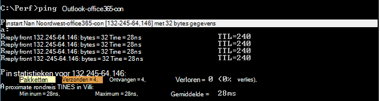

# <a name="performance-troubleshooting-plan-for-office-365"></a><span data-ttu-id="05cbb-103">Prestatieproblemen met Office 365 oplossen: planning</span><span class="sxs-lookup"><span data-stu-id="05cbb-103">Performance troubleshooting plan for Office 365</span></span>

<span data-ttu-id="05cbb-104">Wilt u weten welke stappen u moet ondernemen om vertragingen, vastlopen en trage prestaties tussen SharePoint Online, OneDrive voor Bedrijven, Exchange Online of Skype voor Bedrijven Online en uw clientcomputer te identificeren en op te lossen?</span><span class="sxs-lookup"><span data-stu-id="05cbb-104">Do you need to know the steps to take to identify and fix lags, hangs, and slow performance between SharePoint Online, OneDrive for Business, Exchange Online, or Skype for Business Online, and your client computer?</span></span> <span data-ttu-id="05cbb-105">Voordat u de ondersteuning belt, kan dit artikel u helpen Office 365 problemen met de prestaties op te lossen en zelfs enkele van de meest voorkomende problemen op te lossen.</span><span class="sxs-lookup"><span data-stu-id="05cbb-105">Before you call support, this article can help you troubleshoot Office 365 performance issues and even fix some of the most common issues.</span></span>

<span data-ttu-id="05cbb-106">Dit artikel is eigenlijk een voorbeeldactieplan dat u kunt gebruiken om waardevolle gegevens over uw prestatieprobleem vast te leggen terwijl dit gebeurt.</span><span class="sxs-lookup"><span data-stu-id="05cbb-106">This article is actually a sample action plan that you can use to capture valuable data about your performance issue as it's happening.</span></span> <span data-ttu-id="05cbb-107">Enkele belangrijke problemen zijn ook opgenomen in dit artikel.</span><span class="sxs-lookup"><span data-stu-id="05cbb-107">Some top issues are also included in this article.</span></span>

<span data-ttu-id="05cbb-108">Als u nieuw bent in netwerkprestaties en een plan voor de lange termijn wilt maken om de prestaties tussen uw clientapparaten en Office 365 te controleren, bekijkt u Office 365 prestatieafstemming en probleemoplossing - Beheerder en [IT-Pro.](performance-tuning-using-baselines-and-history.md)</span><span class="sxs-lookup"><span data-stu-id="05cbb-108">If you're new to network performance and want to make a long term plan to monitor performance between your client machines and Office 365, take a look at [Office 365 performance tuning and troubleshooting - Admin and IT Pro](performance-tuning-using-baselines-and-history.md).</span></span>

## <a name="sample-performance-troubleshooting-action-plan"></a><span data-ttu-id="05cbb-109">Voorbeeld van een actieplan voor het oplossen van prestatieproblemen</span><span class="sxs-lookup"><span data-stu-id="05cbb-109">Sample performance troubleshooting action plan</span></span>

<span data-ttu-id="05cbb-110">Dit actieplan bevat twee onderdelen. een voorbereidingsfase en een registratiefase.</span><span class="sxs-lookup"><span data-stu-id="05cbb-110">This action plan contains two parts; a preparation phase, and a logging phase.</span></span> <span data-ttu-id="05cbb-111">Als u op dit moment een prestatieprobleem hebt en u gegevens moet verzamelen, kunt u dit abonnement meteen gebruiken.</span><span class="sxs-lookup"><span data-stu-id="05cbb-111">If you have a performance problem right now, and you need to do data collection, you can start using this plan right away.</span></span>

### <a name="prepare-the-client-computer"></a><span data-ttu-id="05cbb-112">De clientcomputer voorbereiden</span><span class="sxs-lookup"><span data-stu-id="05cbb-112">Prepare the client computer</span></span>

- <span data-ttu-id="05cbb-113">Zoek een clientcomputer die het prestatieprobleem kan reproduceren.</span><span class="sxs-lookup"><span data-stu-id="05cbb-113">Find a client computer that can reproduce the performance problem.</span></span> <span data-ttu-id="05cbb-114">Deze computer wordt gebruikt tijdens het oplossen van problemen.</span><span class="sxs-lookup"><span data-stu-id="05cbb-114">This computer will be used during the course of troubleshooting.</span></span>
- <span data-ttu-id="05cbb-115">Schrijf de stappen op die ervoor zorgen dat het prestatieprobleem zich voordeed, zodat u klaar bent wanneer het tijd is om te testen.</span><span class="sxs-lookup"><span data-stu-id="05cbb-115">Write down the steps that cause the performance problem to happen so you're ready when it comes time to test.</span></span>
- <span data-ttu-id="05cbb-116">Hulpprogramma's installeren voor het verzamelen en opnemen van informatie:</span><span class="sxs-lookup"><span data-stu-id="05cbb-116">Install tools for gathering and recording information:</span></span>
  - <span data-ttu-id="05cbb-117">Installeer [Netmon 3.4](https://www.microsoft.com/download/details.aspx?id=4865) (of gebruik een vergelijkbaar hulpprogramma voor netwerktracing).</span><span class="sxs-lookup"><span data-stu-id="05cbb-117">Install [Netmon 3.4](https://www.microsoft.com/download/details.aspx?id=4865) (or use an equivalent network tracing tool).</span></span>
  - <span data-ttu-id="05cbb-118">Installeer de gratis Basic Edition van [HTTPWatch](https://www.httpwatch.com/download/) (of gebruik een vergelijkbaar hulpprogramma voor netwerktracing).</span><span class="sxs-lookup"><span data-stu-id="05cbb-118">Install the free Basic Edition of [HTTPWatch](https://www.httpwatch.com/download/) (or use an equivalent network Tracing tool).</span></span>
  - <span data-ttu-id="05cbb-119">Gebruik een schermrecorder of voer de stappenrecorder (PSR.exe) uit die wordt geleverd bij Windows Vista en hoger, om een record te houden van de stappen die u tijdens het testen ondernomen hebt.</span><span class="sxs-lookup"><span data-stu-id="05cbb-119">Use a screen recorder or run the Steps Recorder (PSR.exe) that comes with Windows Vista and later, in order to keep a record of the steps you take during testing.</span></span>

### <a name="log-the-performance-issue"></a><span data-ttu-id="05cbb-120">Het prestatieprobleem melden</span><span class="sxs-lookup"><span data-stu-id="05cbb-120">Log the performance issue</span></span>

- <span data-ttu-id="05cbb-121">Sluit alle overbodige internetbrowsers.</span><span class="sxs-lookup"><span data-stu-id="05cbb-121">Close all extraneous Internet browsers.</span></span>
- <span data-ttu-id="05cbb-122">Start de stappenrecorder of een andere schermrecorder.</span><span class="sxs-lookup"><span data-stu-id="05cbb-122">Start the Steps Recorder, or another screen recorder.</span></span>
- <span data-ttu-id="05cbb-123">Start uw Netmon-opname (of hulpprogramma voor netwerktracing).</span><span class="sxs-lookup"><span data-stu-id="05cbb-123">Start your Netmon capture (or network tracing tool).</span></span>
- <span data-ttu-id="05cbb-124">U kunt uw DNS-cache op de clientcomputer wissen vanaf de opdrachtregel door ipconfig /flushdns te typen.</span><span class="sxs-lookup"><span data-stu-id="05cbb-124">Clear your DNS cache on the client computer from the command line by typing ipconfig /flushdns.</span></span>
- <span data-ttu-id="05cbb-125">Start een nieuwe browsersessie en schakel HTTPWatch in.</span><span class="sxs-lookup"><span data-stu-id="05cbb-125">Start a new browser session and turn on HTTPWatch.</span></span>
- <span data-ttu-id="05cbb-126">Optioneel: Als u een Exchange Online test, kunt u het hulpprogramma Exchange Client Performance Analyzer uitvoeren vanaf de Office 365 beheerconsole.</span><span class="sxs-lookup"><span data-stu-id="05cbb-126">Optional: If you are testing Exchange Online, run the Exchange Client Performance Analyzer tool from the Office 365 admin console.</span></span>
- <span data-ttu-id="05cbb-127">Reproduceer de exacte stappen die het prestatieprobleem veroorzaken.</span><span class="sxs-lookup"><span data-stu-id="05cbb-127">Reproduce the exact steps that cause the performance issue.</span></span>
- <span data-ttu-id="05cbb-128">Stop de trace van uw Netmon of een ander hulpmiddel.</span><span class="sxs-lookup"><span data-stu-id="05cbb-128">Stop your Netmon or other tool's trace.</span></span>
- <span data-ttu-id="05cbb-129">Voer op de opdrachtregel een traceroute uit naar uw Office 365 door de volgende opdracht te typen en vervolgens op Enter te drukken:</span><span class="sxs-lookup"><span data-stu-id="05cbb-129">At the command line, run a trace route to your Office 365 subscription by typing the following command and then pressing ENTER:</span></span>

  ``` cmd
  tracert <subscriptionname>.onmicrosoft.com
  ```

- <span data-ttu-id="05cbb-130">Stop de stappenrecorder en sla de video op.</span><span class="sxs-lookup"><span data-stu-id="05cbb-130">Stop the Steps Recorder and save the video.</span></span> <span data-ttu-id="05cbb-131">Zorg ervoor dat u de datum en tijd van de opname opeent en of de opname goede of slechte prestaties aantoont.</span><span class="sxs-lookup"><span data-stu-id="05cbb-131">Be sure to include the date and time of the capture and whether it demonstrates good or bad performance.</span></span>
- <span data-ttu-id="05cbb-132">Sla de trace-bestanden op.</span><span class="sxs-lookup"><span data-stu-id="05cbb-132">Save the trace files.</span></span> <span data-ttu-id="05cbb-133">Zorg er nogmaals voor dat u de datum en tijd van de opname op moet nemen en of deze goede of slechte prestaties aantoont.</span><span class="sxs-lookup"><span data-stu-id="05cbb-133">Again, be sure to include the date and time of the capture and whether it demonstrates good or bad performance.</span></span>

<span data-ttu-id="05cbb-134">Als u niet bekend bent met het uitvoeren van de hulpprogramma's die in dit artikel worden genoemd, maakt u zich geen zorgen, want we bieden de volgende stappen.</span><span class="sxs-lookup"><span data-stu-id="05cbb-134">If you're not familiar with running the tools mentioned in this article, don't worry because we provide those steps next.</span></span> <span data-ttu-id="05cbb-135">Als u gewend bent om dit soort netwerk vastleggen te doen, kunt u naar Basislijnen verzamelen [gaan,](performance-tuning-using-baselines-and-history.md#how-to-collect-baselines)waarin het filteren en lezen van de logboeken wordt beschreven.</span><span class="sxs-lookup"><span data-stu-id="05cbb-135">If you're accustomed to doing this kind of network capturing, you can skip to [How to collect baselines](performance-tuning-using-baselines-and-history.md#how-to-collect-baselines), which describes filtering and reading the logs.</span></span>

### <a name="flush-the-dns-cache-first"></a><span data-ttu-id="05cbb-136">Eerst de DNS-cache leegmaken</span><span class="sxs-lookup"><span data-stu-id="05cbb-136">Flush the DNS Cache first</span></span>

<span data-ttu-id="05cbb-137">Waarom?</span><span class="sxs-lookup"><span data-stu-id="05cbb-137">Why?</span></span> <span data-ttu-id="05cbb-138">Door de DNS-cache leeg te spoelen, start u de tests met een schone lei.</span><span class="sxs-lookup"><span data-stu-id="05cbb-138">By flushing out the DNS cache you're starting your tests with a clean slate.</span></span> <span data-ttu-id="05cbb-139">Door de cache te wissen, kunt u de inhoud van de DNS-resolver opnieuw instellen op de meest recente items.</span><span class="sxs-lookup"><span data-stu-id="05cbb-139">By clearing the cache, you're resetting the DNS resolver contents to the most up-to-date entries.</span></span> <span data-ttu-id="05cbb-140">Vergeet niet dat met een flush geen HOST-bestandsgegevens worden verwijderd.</span><span class="sxs-lookup"><span data-stu-id="05cbb-140">Remember that a flush does not remove HOSTs file entries.</span></span> <span data-ttu-id="05cbb-141">Als u hostbestandsgegevens uitgebreid gebruikt, kopieert u deze items naar een bestand in een andere adreslijst en leegt u het HOST-bestand.</span><span class="sxs-lookup"><span data-stu-id="05cbb-141">If you use HOST file entries extensively, you should copy those entries out to a file in another directory and then empty the HOST file.</span></span>

#### <a name="flush-your-dns-resolver-cache"></a><span data-ttu-id="05cbb-142">Uw DNS-resolvercache leegmaken</span><span class="sxs-lookup"><span data-stu-id="05cbb-142">Flush your DNS resolver cache</span></span>

1. <span data-ttu-id="05cbb-143">Open de opdrachtprompt **(cmd starten of** Windows \>  \>   \> **cmd).**</span><span class="sxs-lookup"><span data-stu-id="05cbb-143">Open the command prompt, (either **Start** \> **Run** \> **cmd** or **Windows key** \> **cmd**).</span></span>
2. <span data-ttu-id="05cbb-144">Typ de volgende opdracht en druk op Enter:</span><span class="sxs-lookup"><span data-stu-id="05cbb-144">Type the following command and press ENTER:</span></span>

    ``` cmd
    ipconfig /flushdns
    ```

## <a name="netmon"></a><span data-ttu-id="05cbb-145">Netmon</span><span class="sxs-lookup"><span data-stu-id="05cbb-145">Netmon</span></span>

<span data-ttu-id="05cbb-146">Met het hulpprogramma Netwerkcontrole[(Netmon)](https://www.microsoft.com/download/details.aspx?id=4865)van Microsoft worden pakketten geanalyseerd, dat wil zeggen verkeer, die tussen computers op netwerken worden gebruikt.</span><span class="sxs-lookup"><span data-stu-id="05cbb-146">Microsoft's Network Monitoring tool ([Netmon](https://www.microsoft.com/download/details.aspx?id=4865)) analyzes packets, that is traffic, that passes between computers on networks.</span></span> <span data-ttu-id="05cbb-147">Door Netmon te gebruiken om verkeer met Office 365 te traceren, kunt u pakketkoppen vastleggen, bekijken en lezen, tussenliggende apparaten identificeren, belangrijke instellingen op netwerkhardware controleren, op gevallen pakketten zoeken en de verkeersstroom tussen computers op uw bedrijfsnetwerk en Office 365.</span><span class="sxs-lookup"><span data-stu-id="05cbb-147">By using Netmon to trace traffic with Office 365 you can capture, view, and read packet headers, identify intervening devices, check important settings on network hardware, look for dropped packets, and follow the flow of traffic between computers on your corporate network and Office 365.</span></span> <span data-ttu-id="05cbb-148">Omdat de werkelijke hoeveelheid verkeer is versleuteld, dat wil zeggen dat het (reist via poort 443 via SSL/TLS, kunt u de verzonden bestanden niet lezen.</span><span class="sxs-lookup"><span data-stu-id="05cbb-148">Because the actual body of the traffic is encrypted, that is, it(travels on port 443 via SSL/TLS, you can't read the files being sent.</span></span> <span data-ttu-id="05cbb-149">In plaats daarvan krijgt u een ongefilterd spoor van het pad dat door het pakket wordt gevolgd, zodat u het probleemgedrag kunt opsporen.</span><span class="sxs-lookup"><span data-stu-id="05cbb-149">Instead, you get an unfiltered trace of the path that the packet takes which can help you track down the problem behavior.</span></span>

<span data-ttu-id="05cbb-150">Zorg ervoor dat u op dit moment geen filter gebruikt.</span><span class="sxs-lookup"><span data-stu-id="05cbb-150">Be sure you don't apply a filter at this time.</span></span> <span data-ttu-id="05cbb-151">Voer in plaats daarvan de stappen uit en laat het probleem zien voordat u de trace stopt en opspart.</span><span class="sxs-lookup"><span data-stu-id="05cbb-151">Instead, run through the steps and demonstrate the problem before stopping the trace and saving.</span></span>

<span data-ttu-id="05cbb-152">Nadat u Netmon 3.4 hebt geïnstalleerd, opent u het hulpprogramma en neemt u de volgende stappen:</span><span class="sxs-lookup"><span data-stu-id="05cbb-152">After you install Netmon 3.4, open the tool and take these steps:</span></span>

### <a name="take-a-netmon-trace-and-reproduce-the-issue"></a><span data-ttu-id="05cbb-153">Een Netmon-trace nemen en het probleem reproduceren</span><span class="sxs-lookup"><span data-stu-id="05cbb-153">Take a Netmon trace and reproduce the issue</span></span>

1. <span data-ttu-id="05cbb-154">Start Netmon 3.4.</span><span class="sxs-lookup"><span data-stu-id="05cbb-154">Launch Netmon 3.4.</span></span>
<span data-ttu-id="05cbb-155">Er zijn drie deelvensters op de **startpagina:** **Recente** **vastleggen,** Netwerken selecteren en aan de slag met Microsoft Network **Monitor 3.4. Let op.**</span><span class="sxs-lookup"><span data-stu-id="05cbb-155">There are three panes on the **Start** page: **Recent Captures**, **Select Networks**, and the **Getting Started with Microsoft Network Monitor 3.4. Notice**.</span></span> <span data-ttu-id="05cbb-156">In het deelvenster Netwerken selecteren krijgt u ook een lijst met de standaardnetwerken waaruit u kunt vastleggen.</span><span class="sxs-lookup"><span data-stu-id="05cbb-156">The Select Networks panel will also give you a list of the default networks from which you can capture.</span></span> <span data-ttu-id="05cbb-157">Zorg ervoor dat netwerkkaarten hier zijn geselecteerd.</span><span class="sxs-lookup"><span data-stu-id="05cbb-157">Be sure that network cards are selected here.</span></span>

2. <span data-ttu-id="05cbb-158">Klik boven aan **de** **startpagina** op Nieuwe opname.</span><span class="sxs-lookup"><span data-stu-id="05cbb-158">Click **New Capture** at the top of the **Start** page.</span></span> <span data-ttu-id="05cbb-159">Hiermee wordt een nieuw tabblad toegevoegd naast het **tabblad Startpagina** met de naam **Vastleggen 1.**</span><span class="sxs-lookup"><span data-stu-id="05cbb-159">This adds a new tab beside the **Start** page tab called **Capture 1**.</span></span>
<span data-ttu-id="05cbb-160"></span><span class="sxs-lookup"><span data-stu-id="05cbb-160"></span></span>

3. <span data-ttu-id="05cbb-161">Als u een eenvoudige opname wilt maken, klikt u **op Start** op de werkbalk.</span><span class="sxs-lookup"><span data-stu-id="05cbb-161">To take a simple capture, click **Start** on the toolbar.</span></span>

4. <span data-ttu-id="05cbb-162">Reproduceer de stappen die een prestatieprobleem presenteren.</span><span class="sxs-lookup"><span data-stu-id="05cbb-162">Reproduce the steps that present a performance issue.</span></span>

5. <span data-ttu-id="05cbb-163">Klik **op Bestand** \> **opslaan** als \> **stoppen.**</span><span class="sxs-lookup"><span data-stu-id="05cbb-163">Click **Stop** \> **File** \> **Save As**.</span></span> <span data-ttu-id="05cbb-164">Vergeet niet om de datum en tijd met de tijdzone op te geven en te vermelden of deze slechte of goede prestaties aantoont.</span><span class="sxs-lookup"><span data-stu-id="05cbb-164">Remember to give the date and time with the time zone and to mention if it demonstrates bad or good performance.</span></span>

## <a name="httpwatch"></a><span data-ttu-id="05cbb-165">HTTPWatch</span><span class="sxs-lookup"><span data-stu-id="05cbb-165">HTTPWatch</span></span>

<span data-ttu-id="05cbb-166">[HTTPWatch](https://www.httpwatch.com/download/) wordt in rekening gebracht en er wordt een gratis versie geleverd.</span><span class="sxs-lookup"><span data-stu-id="05cbb-166">[HTTPWatch](https://www.httpwatch.com/download/) comes in charged, and a free edition.</span></span> <span data-ttu-id="05cbb-167">De gratis Basic Edition bevat alles wat u nodig hebt voor deze test.</span><span class="sxs-lookup"><span data-stu-id="05cbb-167">The free Basic Edition covers everything you need for this test.</span></span> <span data-ttu-id="05cbb-168">HTTPWatch controleert netwerkverkeer en laadtijd van pagina's direct vanuit het browservenster.</span><span class="sxs-lookup"><span data-stu-id="05cbb-168">HTTPWatch monitors network traffic and page load time right from your browser window.</span></span> <span data-ttu-id="05cbb-169">HTTPWatch is een internetverbinding met Internet Explorer die de prestaties grafisch beschrijft.</span><span class="sxs-lookup"><span data-stu-id="05cbb-169">HTTPWatch is a plug-in to Internet Explorer that graphically describes performance.</span></span> <span data-ttu-id="05cbb-170">De analyse kan worden opgeslagen en bekeken in HTTPWatch Studio.</span><span class="sxs-lookup"><span data-stu-id="05cbb-170">The analysis can be saved and viewed in HTTPWatch Studio.</span></span>

> [!NOTE]
> <span data-ttu-id="05cbb-171">Als u een andere browser gebruikt, zoals Firefox, Google Chrome of als u HTTPWatch niet kunt installeren in Internet Explorer, opent u een nieuw browservenster en drukt u op F12 op het toetsenbord.</span><span class="sxs-lookup"><span data-stu-id="05cbb-171">If you use another browser, such as Firefox, Google Chrome, or if you can't install HTTPWatch in Internet Explorer, open a new browser window and press F12 on your keyboard.</span></span> <span data-ttu-id="05cbb-172">U ziet het pop-upprogramma voor ontwikkelaars onder aan uw browser.</span><span class="sxs-lookup"><span data-stu-id="05cbb-172">You should see the Developer Tool pop-up at the bottom of your browser.</span></span> <span data-ttu-id="05cbb-173">Als u Opera gebruikt, drukt u op Ctrl+Shift+I voor webcontrole en klikt u vervolgens op het tabblad Netwerk en voltooit u de tests die hieronder worden beschreven. </span><span class="sxs-lookup"><span data-stu-id="05cbb-173">If you use Opera, press CTRL+SHIFT+I for Web Inspector, then click the **Network** tab and complete the testing outlined below.</span></span> <span data-ttu-id="05cbb-174">De informatie is iets anders, maar laadtijden worden nog steeds weergegeven in milliseconden.</span><span class="sxs-lookup"><span data-stu-id="05cbb-174">The information will be slightly different, but load times will still be displayed in milliseconds.</span></span> <span data-ttu-id="05cbb-175">> HTTPWatch is ook erg handig voor problemen met SharePoint Online pagina laadtijden.</span><span class="sxs-lookup"><span data-stu-id="05cbb-175">> HTTPWatch is also very useful for issues with SharePoint Online page load times.</span></span>

### <a name="run-httpwatch-and-reproduce-the-issue"></a><span data-ttu-id="05cbb-176">HTTPWatch uitvoeren en het probleem reproduceren</span><span class="sxs-lookup"><span data-stu-id="05cbb-176">Run HTTPWatch and reproduce the issue</span></span>

<span data-ttu-id="05cbb-177">HTTPWatch is een browser-internetverbinding, dus het weergeven van het hulpprogramma in de browser is iets anders voor elke versie van Internet Explorer.</span><span class="sxs-lookup"><span data-stu-id="05cbb-177">HTTPWatch is a browser plug-in, so exposing the tool in the browser is slightly different for each version of Internet Explorer.</span></span> <span data-ttu-id="05cbb-178">Meestal kunt u HTTPWatch vinden onder de opdrachtenbalk in de internet explorer-browser.</span><span class="sxs-lookup"><span data-stu-id="05cbb-178">Typically, you can find HTTPWatch under the Commands bar in the Internet Explorer browser.</span></span> <span data-ttu-id="05cbb-179">Als u de HTTPWatch-internetverbinding niet ziet in het browservenster, controleert u de versie van uw browser door op **Help** Over te klikken of in latere versies van Internet Explorer op het tandwielsymbool en Over Internet Explorer te \>  **klikken.**</span><span class="sxs-lookup"><span data-stu-id="05cbb-179">If you don't see the HTTPWatch plug-in in your browser window, check the version of your browser by clicking **Help** \> **About**, or in later versions of Internet Explorer, click the gear symbol and **About Internet Explorer**.</span></span> <span data-ttu-id="05cbb-180">Als u de **opdrachtenbalk wilt** starten, klikt u met de rechtermuisknop op de menubalk in Internet Explorer en klikt u **op Opdrachtenbalk.**</span><span class="sxs-lookup"><span data-stu-id="05cbb-180">To launch the **Commands** bar, right-click the menu bar in Internet Explorer and click **Commands bar**.</span></span>

<span data-ttu-id="05cbb-181">In het verleden is HTTPWatch gekoppeld aan zowel de opdrachten als de Verkenner-balken, dus als u het pictogram (zelfs na het opnieuw opstarten) niet direct ziet, controleert u Hulpmiddelen en de werkbalken voor het pictogram.</span><span class="sxs-lookup"><span data-stu-id="05cbb-181">In the past, HTTPWatch has been associated with both the Commands and the Explorer bars, so once you install, if you don't immediately see the icon (even after reboot) check **Tools**, and your toolbars for the icon.</span></span> <span data-ttu-id="05cbb-182">Werkbalken kunnen worden aangepast en er kunnen opties aan worden toegevoegd.</span><span class="sxs-lookup"><span data-stu-id="05cbb-182">Remember that toolbars can be customized and options can be added to them.</span></span>


1. <span data-ttu-id="05cbb-184">HTTPWatch starten in een browservenster van Internet Explorer.</span><span class="sxs-lookup"><span data-stu-id="05cbb-184">Launch HTTPWatch in an Internet Explorer browser window.</span></span> <span data-ttu-id="05cbb-185">De browser wordt onder aan dat venster weergegeven.</span><span class="sxs-lookup"><span data-stu-id="05cbb-185">It will appear docked to the browser at the bottom of that window.</span></span> <span data-ttu-id="05cbb-186">Klik **op Opnemen**.</span><span class="sxs-lookup"><span data-stu-id="05cbb-186">Click **Record**.</span></span>

2. <span data-ttu-id="05cbb-187">Reproduceer de exacte stappen die betrokken zijn bij het prestatieprobleem.</span><span class="sxs-lookup"><span data-stu-id="05cbb-187">Reproduce the exact steps involved in the performance issue.</span></span> <span data-ttu-id="05cbb-188">Klik op **de knop Stoppen** in HTTPWatch.</span><span class="sxs-lookup"><span data-stu-id="05cbb-188">Click the **Stop** button in HTTPWatch.</span></span>

3. <span data-ttu-id="05cbb-189">**Sla** de HTTPWatch of **Verzenden per e-mail op.**</span><span class="sxs-lookup"><span data-stu-id="05cbb-189">**Save** the HTTPWatch or **Send by Email**.</span></span> <span data-ttu-id="05cbb-190">Vergeet niet om het bestand een naam te geven, zodat het datum- en tijdgegevens bevat en een indicatie of uw Horloge een demonstratie van goede of slechte prestaties bevat.</span><span class="sxs-lookup"><span data-stu-id="05cbb-190">Remember to name the file so that it includes date and time information and an indication of whether your Watch contains a demonstration of good or bad performance.</span></span>


<span data-ttu-id="05cbb-192">Deze schermafbeelding is afkomstig van de Professional-versie van HTTPWatch.</span><span class="sxs-lookup"><span data-stu-id="05cbb-192">This screen shot is from the Professional version of HTTPWatch.</span></span> <span data-ttu-id="05cbb-193">U kunt traceringen die zijn gemaakt in de basisversie openen op een computer met een Professional-versie en deze daar lezen.</span><span class="sxs-lookup"><span data-stu-id="05cbb-193">You can open traces taken in the Basic Version on a computer with a Professional version and read it there.</span></span> <span data-ttu-id="05cbb-194">Mogelijk is er extra informatie beschikbaar via de trace via die methode.</span><span class="sxs-lookup"><span data-stu-id="05cbb-194">Extra information may be available from the trace through that method.</span></span>

## <a name="problem-steps-recorder"></a><span data-ttu-id="05cbb-195">Probleemstappenrecorder</span><span class="sxs-lookup"><span data-stu-id="05cbb-195">Problem Steps Recorder</span></span>

<span data-ttu-id="05cbb-196">Met Stappenrecorder of PSR.exe kunt u problemen opnemen terwijl deze zich voordoen.</span><span class="sxs-lookup"><span data-stu-id="05cbb-196">Steps Recorder, or PSR.exe, allows you to record issues as they are occurring.</span></span> <span data-ttu-id="05cbb-197">Het is een zeer handig hulpmiddel en heel eenvoudig uit te voeren.</span><span class="sxs-lookup"><span data-stu-id="05cbb-197">It's a very useful tool and very simple to run.</span></span>

### <a name="run-problem-steps-recorder-psrexe-to-record-your-work"></a><span data-ttu-id="05cbb-198">Probleemstappenrecorder (PSR.exe) uitvoeren om uw werk op te nemen</span><span class="sxs-lookup"><span data-stu-id="05cbb-198">Run Problem Steps Recorder (PSR.exe) to record your work</span></span>

1. <span data-ttu-id="05cbb-199">Gebruik **Type start** uitvoerenPSR.exeOK of klik op Windows type toetsPSR.exe\>  \> en druk  \> vervolgens  \> op  \> Enter.</span><span class="sxs-lookup"><span data-stu-id="05cbb-199">Either use **Start** \> **Run** \> type **PSR.exe** \> **OK**, or, click the **Windows Key** \> type **PSR.exe** \> and then press ENTER.</span></span>

2. <span data-ttu-id="05cbb-200">Wanneer het kleine PSR.exe wordt weergegeven, klikt u op **Record starten** en reproduceert u de stappen die het prestatieprobleem reproduceren.</span><span class="sxs-lookup"><span data-stu-id="05cbb-200">When the small PSR.exe window appears, click **Start Record** and reproduce the steps that reproduce the performance issue.</span></span> <span data-ttu-id="05cbb-201">U kunt opmerkingen zo nodig toevoegen door op **Opmerkingen toevoegen te klikken.**</span><span class="sxs-lookup"><span data-stu-id="05cbb-201">You can add comments as needed, by clicking **Add Comments**.</span></span>

3. <span data-ttu-id="05cbb-202">Klik **op Record stoppen** wanneer u de stappen hebt voltooid.</span><span class="sxs-lookup"><span data-stu-id="05cbb-202">Click **Stop Record** when you have completed the steps.</span></span> <span data-ttu-id="05cbb-203">Als het prestatieprobleem een pagina-render is, wacht u totdat de pagina wordt weergegeven voordat u de opname stopt.</span><span class="sxs-lookup"><span data-stu-id="05cbb-203">If the performance issue is a page render, wait for the page to render before you stop the recording.</span></span>

4. <span data-ttu-id="05cbb-204">Klik op **Opslaan**.</span><span class="sxs-lookup"><span data-stu-id="05cbb-204">Click **Save**.</span></span>


<span data-ttu-id="05cbb-206">De datum en tijd worden voor u vastgelegd.</span><span class="sxs-lookup"><span data-stu-id="05cbb-206">The date and time is recorded for you.</span></span> <span data-ttu-id="05cbb-207">Dit koppelt uw PSR op tijd aan uw Netmon-trace en HTTPWatch en helpt bij het oplossen van precisieproblemen.</span><span class="sxs-lookup"><span data-stu-id="05cbb-207">This links your PSR to your Netmon trace and HTTPWatch in time, and helps with precision troubleshooting.</span></span> <span data-ttu-id="05cbb-208">De datum en tijd in de PSR-record kunnen bijvoorbeeld aantonen dat er een minuut is verstreken tussen het aanmelden en browsen van de URL en de gedeeltelijke render van de beheersite.</span><span class="sxs-lookup"><span data-stu-id="05cbb-208">The date and time in the PSR record can show that a minute passed between the login and browsing of the URL and the partial render of the admin site, for example.</span></span>

## <a name="read-your-traces"></a><span data-ttu-id="05cbb-209">Uw sporen lezen</span><span class="sxs-lookup"><span data-stu-id="05cbb-209">Read your traces</span></span>

<span data-ttu-id="05cbb-210">Het is niet mogelijk om alles te leren over probleemoplossing voor netwerken en prestaties die iemand moet weten via een artikel.</span><span class="sxs-lookup"><span data-stu-id="05cbb-210">It isn't possible to teach everything about network and performance troubleshooting that someone would need to know via an article.</span></span> <span data-ttu-id="05cbb-211">Om goed in prestaties te komen, hebt u ervaring nodig en kennis van hoe uw netwerk werkt en meestal presteert.</span><span class="sxs-lookup"><span data-stu-id="05cbb-211">Getting good at performance takes experience, and knowledge of how your network works and usually performs.</span></span> <span data-ttu-id="05cbb-212">Maar het is mogelijk om een lijst met belangrijkste problemen te maken en te laten zien hoe u met hulpprogramma's gemakkelijker de meest voorkomende problemen kunt oplossen.</span><span class="sxs-lookup"><span data-stu-id="05cbb-212">But it is possible to round up a list of top issues and show how tools can make it easier for you to eliminate the most common problems.</span></span>

<span data-ttu-id="05cbb-213">Als u netwerksporen voor het lezen van vaardigheden wilt oppikken voor uw Office 365 sites, is er geen betere docent dan regelmatig sporen van paginaladingen te maken en ervaring op te doen met het lezen ervan.</span><span class="sxs-lookup"><span data-stu-id="05cbb-213">If you want to pick up skills reading network traces for your Office 365 sites, there is no better teacher than creating traces of page loads regularly and gaining experience reading them.</span></span> <span data-ttu-id="05cbb-214">Als u bijvoorbeeld een kans hebt, laadt u een Office 365 en traceert u het proces.</span><span class="sxs-lookup"><span data-stu-id="05cbb-214">For example, when you have a chance, load an Office 365 service and trace the process.</span></span> <span data-ttu-id="05cbb-215">Filter de trace voor DNS-verkeer of zoek in FrameData naar de naam van de service die u hebt doorzocht.</span><span class="sxs-lookup"><span data-stu-id="05cbb-215">Filter the trace for DNS traffic, or search the FrameData for the name of the service you browsed.</span></span> <span data-ttu-id="05cbb-216">Scan de trace om een idee te krijgen van de stappen die worden uitgevoerd wanneer de service wordt geladen.</span><span class="sxs-lookup"><span data-stu-id="05cbb-216">Scan the trace to get an idea of the steps that occur when the service loads.</span></span> <span data-ttu-id="05cbb-217">Op deze manier leert u hoe de normale paginabelasting eruit moet zien, en in het geval van probleemoplossing, met name rond prestaties, kan het vergelijken van goede en slechte sporen u veel leren.</span><span class="sxs-lookup"><span data-stu-id="05cbb-217">This will help you learn what normal page load should look like, and in the case of troubleshooting, particularly around performance, comparing good to bad traces can teach you a lot.</span></span>

<span data-ttu-id="05cbb-218">Netmon gebruikt Microsoft Intellisense in het veld Weergavefilter.</span><span class="sxs-lookup"><span data-stu-id="05cbb-218">Netmon uses Microsoft Intellisense in the Display filter field.</span></span> <span data-ttu-id="05cbb-219">Intellisense, of intelligente code-voltooiing, is die truc waarbij u in een periode typt en alle beschikbare opties worden weergegeven in een vervolgkeuzevak.</span><span class="sxs-lookup"><span data-stu-id="05cbb-219">Intellisense, or intelligent code completion, is that trick where you type in a period and all available options are displayed in a drop-down selection box.</span></span> <span data-ttu-id="05cbb-220">Als u zich bijvoorbeeld zorgen maakt over de schaal van TCP-vensters, kunt u op deze manier uw weg vinden naar een  `.protocol.tcp.window < 100` filter (zoals).</span><span class="sxs-lookup"><span data-stu-id="05cbb-220">If, for example, you are worried about TCP window scaling, you can find your way to a filter (such as  `.protocol.tcp.window < 100`) by this means.</span></span>


<span data-ttu-id="05cbb-222">Netmon-traces kunnen veel verkeer bevatten.</span><span class="sxs-lookup"><span data-stu-id="05cbb-222">Netmon traces can have a lot of traffic in them.</span></span> <span data-ttu-id="05cbb-223">Als u geen ervaring hebt met het lezen van de trace, is het waarschijnlijk dat u de trace de eerste keer zult openen.</span><span class="sxs-lookup"><span data-stu-id="05cbb-223">If you aren't experienced with reading them, it's likely you will be overwhelmed opening the trace the first time.</span></span> <span data-ttu-id="05cbb-224">Het eerste wat u moet doen, is het signaal scheiden van het achtergrondgeluid in de trace.</span><span class="sxs-lookup"><span data-stu-id="05cbb-224">The first thing to do is separate the signal from the background noise in the trace.</span></span> <span data-ttu-id="05cbb-225">U hebt getest Office 365 en dat is het verkeer dat u wilt zien.</span><span class="sxs-lookup"><span data-stu-id="05cbb-225">You tested against Office 365, and that's the traffic you want to see.</span></span> <span data-ttu-id="05cbb-226">Als u gewend bent om door traceringen te navigeren, hebt u deze lijst mogelijk niet nodig.</span><span class="sxs-lookup"><span data-stu-id="05cbb-226">If you are used to navigating through traces, you may not need this list.</span></span>

<span data-ttu-id="05cbb-227">Verkeer tussen uw client en Office 365 via TLS, wat betekent dat de hoofdbestandscondductie van het verkeer wordt versleuteld en niet leesbaar is in een algemene Netmon-trace.</span><span class="sxs-lookup"><span data-stu-id="05cbb-227">Traffic between your client and Office 365 travels via TLS, which means that the body of the traffic will be encrypted and not readable in a generic Netmon trace.</span></span> <span data-ttu-id="05cbb-228">Uw prestatieanalyse hoeft niet de details van de gegevens in het pakket te weten.</span><span class="sxs-lookup"><span data-stu-id="05cbb-228">Your performance analysis doesn't need to know the specifics of the information in the packet.</span></span> <span data-ttu-id="05cbb-229">Het is echter zeer geïnteresseerd in pakketkoppen en de informatie die ze bevatten.</span><span class="sxs-lookup"><span data-stu-id="05cbb-229">It is, however, very interested in packet headers and the information that they contain.</span></span>

### <a name="tips-to-get-a-good-trace"></a><span data-ttu-id="05cbb-230">Tips om een goede trace te krijgen</span><span class="sxs-lookup"><span data-stu-id="05cbb-230">Tips to get a good trace</span></span>

- <span data-ttu-id="05cbb-231">Weet de waarde van het IPv4- of IPv6-adres van uw clientcomputer.</span><span class="sxs-lookup"><span data-stu-id="05cbb-231">Know the value of the IPv4 or IPv6 address of your client computer.</span></span> <span data-ttu-id="05cbb-232">U kunt deze in de opdrachtprompt krijgen door **IPConfig** te typen en vervolgens op Enter te drukken.</span><span class="sxs-lookup"><span data-stu-id="05cbb-232">You can get this from the command prompt by typing **IPConfig** and then pressing ENTER.</span></span> <span data-ttu-id="05cbb-233">Als u dit adres kent, kunt u in één oogopslag zien of het verkeer in de trace rechtstreeks betrekking heeft op uw clientcomputer.</span><span class="sxs-lookup"><span data-stu-id="05cbb-233">Knowing this address will let you tell at a glance whether the traffic in the trace directly involves your client computer.</span></span> <span data-ttu-id="05cbb-234">Als er een bekende proxy is, pingt u deze en krijgt u ook het IP-adres.</span><span class="sxs-lookup"><span data-stu-id="05cbb-234">If there is a known proxy, ping it and get its IP address as well.</span></span>

- <span data-ttu-id="05cbb-235">Flush your DNS resolver cache and, if possible, close all browsers except the one in which you are running your tests.</span><span class="sxs-lookup"><span data-stu-id="05cbb-235">Flush your DNS resolver cache and, if possible, close all browsers except the one in which you are running your tests.</span></span> <span data-ttu-id="05cbb-236">Als u dit niet kunt doen, bijvoorbeeld als ondersteuning een browserprogramma gebruikt om het bureaublad van uw clientcomputer te zien, kunt u de trace filteren.</span><span class="sxs-lookup"><span data-stu-id="05cbb-236">If you are not able to do this, for instance, if support is using some browser-based tool to see your client computer's desktop, be prepared to filter your trace.</span></span>

- <span data-ttu-id="05cbb-237">Zoek in een bezet trace de Office 365 service die u gebruikt.</span><span class="sxs-lookup"><span data-stu-id="05cbb-237">In a busy trace, locate the Office 365 service that you're using.</span></span> <span data-ttu-id="05cbb-238">Als u uw verkeer nog nooit of zelden hebt gezien, is dit een handige stap om het prestatieprobleem te scheiden van andere netwerkruis.</span><span class="sxs-lookup"><span data-stu-id="05cbb-238">If you've never or seldom seen your traffic before, this is a helpful step in separating the performance issue from other network noise.</span></span> <span data-ttu-id="05cbb-239">U kunt dit op een aantal manieren doen.</span><span class="sxs-lookup"><span data-stu-id="05cbb-239">There are a few ways to do this.</span></span> <span data-ttu-id="05cbb-240">Direct vóór de test kunt u _ping_ of _PsPing_ gebruiken tegen de URL van de specifieke service ( of `ping outlook.office365.com` , `psping -4 microsoft-my.sharepoint.com:443` bijvoorbeeld).</span><span class="sxs-lookup"><span data-stu-id="05cbb-240">Directly before your test, you can use _ping_ or _PsPing_ against the URL of the specific service (`ping outlook.office365.com` or `psping -4 microsoft-my.sharepoint.com:443`, for example).</span></span> <span data-ttu-id="05cbb-241">U kunt die ping of PsPing ook gemakkelijk vinden in een Netmon-trace (op de procesnaam).</span><span class="sxs-lookup"><span data-stu-id="05cbb-241">You can also easily find that ping or PsPing in a Netmon trace (by its process name).</span></span> <span data-ttu-id="05cbb-242">Dat geeft u een plek om te zoeken.</span><span class="sxs-lookup"><span data-stu-id="05cbb-242">That will give you a place to start looking.</span></span>

<span data-ttu-id="05cbb-243">Als u alleen Netmon-tracering gebruikt op het moment van het probleem, is dat ook niet erg.</span><span class="sxs-lookup"><span data-stu-id="05cbb-243">If you're only using Netmon tracing at the time of the problem, that's okay too.</span></span> <span data-ttu-id="05cbb-244">Als u zich wilt oriënteren, gebruikt u een filter zoals `ContainsBin(FrameData, ASCII, "office")` of `ContainsBin(FrameData, ASCII, "outlook")` .</span><span class="sxs-lookup"><span data-stu-id="05cbb-244">To orient yourself, use a filter like `ContainsBin(FrameData, ASCII, "office")` or `ContainsBin(FrameData, ASCII, "outlook")`.</span></span> <span data-ttu-id="05cbb-245">U kunt uw framenummer opnemen vanuit het trace-bestand.</span><span class="sxs-lookup"><span data-stu-id="05cbb-245">You can record your frame number from the trace file.</span></span> <span data-ttu-id="05cbb-246">Mogelijk wilt u ook helemaal _naar_ rechts door het deelvenster Overzicht van frame schuiven en de kolom Gespreks-id zoeken.</span><span class="sxs-lookup"><span data-stu-id="05cbb-246">You may also want to scroll the _Frame Summary_ pane all the way to the right and look for the Conversation ID column.</span></span> <span data-ttu-id="05cbb-247">Er is een getal aangegeven voor de id van dit specifieke gesprek dat u later ook afzonderlijk kunt opnemen en bekijken.</span><span class="sxs-lookup"><span data-stu-id="05cbb-247">There is a number indicated there for the ID of this specific conversation that you can also record and look at in isolation later.</span></span> <span data-ttu-id="05cbb-248">Vergeet niet dit filter te verwijderen voordat u een ander filter gaat toepassen.</span><span class="sxs-lookup"><span data-stu-id="05cbb-248">Remember to remove this filter before applying any other filtering.</span></span>

> [!TIP]
> <span data-ttu-id="05cbb-249">Netmon heeft een groot aantal handige ingebouwde filters.</span><span class="sxs-lookup"><span data-stu-id="05cbb-249">Netmon has a lot of helpful built-in filters.</span></span> <span data-ttu-id="05cbb-250">Probeer de **knop Filter laden** boven aan het _filtervenster_ Weergeven.</span><span class="sxs-lookup"><span data-stu-id="05cbb-250">Try the **Load Filter** button at the top of the _Display_ filter pane.</span></span>


<span data-ttu-id="05cbb-253">Maak kennis met uw verkeer en ontdek welke informatie u nodig hebt.</span><span class="sxs-lookup"><span data-stu-id="05cbb-253">Get familiar with your traffic, and learn to locate the information you need.</span></span> <span data-ttu-id="05cbb-254">Leer bijvoorbeeld om te bepalen welk pakket in de trace de eerste verwijzing heeft naar de Office 365-service die u gebruikt (zoals 'Outlook').</span><span class="sxs-lookup"><span data-stu-id="05cbb-254">For example, learn to determine which packet in the trace has the first reference to the Office 365 service you're using (like "Outlook").</span></span>

<span data-ttu-id="05cbb-255">Als Office 365 Outlook Online als voorbeeld neemt, begint het verkeer als het volgende:</span><span class="sxs-lookup"><span data-stu-id="05cbb-255">Taking Office 365 Outlook Online as an example, the traffic begins something like this:</span></span>

- <span data-ttu-id="05cbb-256">DNS Standard Query en DNS Response voor outlook.office365.com met overeenkomende Query-query's.</span><span class="sxs-lookup"><span data-stu-id="05cbb-256">DNS Standard Query and DNS Response for outlook.office365.com with matching QueryIDs.</span></span> <span data-ttu-id="05cbb-257">Het is belangrijk om de tijds verschuiving voor deze omslag te noteren, evenals waar in de wereld de Office 365 Global DNS de aanvraag voor naamresolutie verzendt.</span><span class="sxs-lookup"><span data-stu-id="05cbb-257">It's important to note the time offset for this turn-around, as well as where in the world the Office 365 Global DNS sends the request for name resolution.</span></span> <span data-ttu-id="05cbb-258">Ideaal, zo lokaal mogelijk, in plaats van halverwege de wereld.</span><span class="sxs-lookup"><span data-stu-id="05cbb-258">Ideally, as locally as possible, rather than halfway across the world.</span></span>

- <span data-ttu-id="05cbb-259">Een HTTP GET-aanvraag waarvan het statusrapport permanent is verplaatst (301)</span><span class="sxs-lookup"><span data-stu-id="05cbb-259">A HTTP GET Request whose status report Moved Permanently (301)</span></span>

- <span data-ttu-id="05cbb-260">RWS-verkeer, inclusief RWS-Verbinding maken aanvragen en Verbinding maken antwoorden.</span><span class="sxs-lookup"><span data-stu-id="05cbb-260">RWS Traffic including RWS Connect requests and Connect replies.</span></span> <span data-ttu-id="05cbb-261">(Dit is Remote Winsock die een verbinding voor u maakt.)</span><span class="sxs-lookup"><span data-stu-id="05cbb-261">(This is Remote Winsock making a connection for you.)</span></span>

- <span data-ttu-id="05cbb-262">Een TCP SYN- en TCP SYN/ACK-gesprek.</span><span class="sxs-lookup"><span data-stu-id="05cbb-262">A TCP SYN and TCP SYN/ACK conversation.</span></span> <span data-ttu-id="05cbb-263">Veel van de instellingen in dit gesprek zijn van invloed op uw prestaties.</span><span class="sxs-lookup"><span data-stu-id="05cbb-263">A lot of the settings in this conversation impact your performance.</span></span>

- <span data-ttu-id="05cbb-264">Vervolgens vindt er een reeks TLS:TLS-verkeer plaats waar de TLS-handshake- en TLS-certificaatgesprekken plaatsvinden.</span><span class="sxs-lookup"><span data-stu-id="05cbb-264">Then a series of TLS:TLS traffic which is where the TLS handshake and TLS certificate conversations take place.</span></span> <span data-ttu-id="05cbb-265">(Onthoud dat de gegevens zijn versleuteld via SSL/TLS.)</span><span class="sxs-lookup"><span data-stu-id="05cbb-265">(Remember the data is encrypted via SSL/TLS.)</span></span>

<span data-ttu-id="05cbb-266">Alle delen van het verkeer zijn belangrijk en verbonden, maar kleine gedeelten van de trace bevatten informatie die met name belangrijk is voor het oplossen van prestatieproblemen. Daarom richten we ons op deze gebieden.</span><span class="sxs-lookup"><span data-stu-id="05cbb-266">All parts of the traffic are important and connected, but small portions of the trace contain information particularly important in terms of performance troubleshooting, so we'll focus on those areas.</span></span> <span data-ttu-id="05cbb-267">Aangezien we genoeg Office 365 prestatieproblemen bij Microsoft hebben uitgevoerd om een lijst met veelvoorkomende problemen samen te stellen, richten we ons op deze problemen en op het gebruik van de hulpprogramma's die we nodig hebben om ze vervolgens uit te zoeken.</span><span class="sxs-lookup"><span data-stu-id="05cbb-267">Also, since we've done enough Office 365 performance troubleshooting at Microsoft to compile a Top Ten list of common problems, we'll focus on those issues and how to use the tools we have to root them out next.</span></span>

<span data-ttu-id="05cbb-268">Als u ze nog niet allemaal hebt geïnstalleerd, wordt in de matrix hieronder gebruik gemaakt van verschillende hulpprogramma's.</span><span class="sxs-lookup"><span data-stu-id="05cbb-268">If you haven't installed them all ready, the matrix below makes use of several tools.</span></span> <span data-ttu-id="05cbb-269">Waar mogelijk.</span><span class="sxs-lookup"><span data-stu-id="05cbb-269">Where possible.</span></span> <span data-ttu-id="05cbb-270">Er worden koppelingen naar de installatiepunten verstrekt.</span><span class="sxs-lookup"><span data-stu-id="05cbb-270">Links are provided to the installation points.</span></span> <span data-ttu-id="05cbb-271">De lijst bevat veelgebruikte hulpprogramma's voor netwerktracing, zoals [Netmon](https://www.microsoft.com/download/details.aspx?id=4865) en [Wireshark,](https://www.wireshark.org/)maar gebruik een traceringshulpmiddel waarmee u vertrouwd bent en waarin u gewend bent netwerkverkeer te filteren.</span><span class="sxs-lookup"><span data-stu-id="05cbb-271">The list includes common network tracing tools like [Netmon](https://www.microsoft.com/download/details.aspx?id=4865) and [Wireshark](https://www.wireshark.org/), but use any tracing tool you are comfortable with, and in which you're accustomed to filtering network traffic.</span></span> <span data-ttu-id="05cbb-272">Wanneer u aan het testen bent, onthoudt u:</span><span class="sxs-lookup"><span data-stu-id="05cbb-272">When you're testing, remember:</span></span>

- <span data-ttu-id="05cbb-273">*Sluit uw browsers en test met slechts één browser*  die wordt uitgevoerd. Dit vermindert het totale verkeer dat u vast legt.</span><span class="sxs-lookup"><span data-stu-id="05cbb-273">*Close your browsers, and test with only one browser running*  - This will reduce the overall traffic you capture.</span></span> <span data-ttu-id="05cbb-274">Het zorgt voor een minder drukke trace.</span><span class="sxs-lookup"><span data-stu-id="05cbb-274">It makes for a less busy trace.</span></span>
- <span data-ttu-id="05cbb-275">*Flush your DNS resolver cache on the client computer*  - This will give you a clean slate when you start to take your capture, for a cleaner trace.</span><span class="sxs-lookup"><span data-stu-id="05cbb-275">*Flush your DNS resolver cache on the client computer*  - This will give you a clean slate when you start to take your capture, for a cleaner trace.</span></span>

## <a name="common-issues"></a><span data-ttu-id="05cbb-276">Veelvoorkomende problemen</span><span class="sxs-lookup"><span data-stu-id="05cbb-276">Common issues</span></span>

<span data-ttu-id="05cbb-277">Enkele veelvoorkomende problemen waar u mee te maken kunt krijgen en hoe u deze kunt vinden in uw netwerkspoor.</span><span class="sxs-lookup"><span data-stu-id="05cbb-277">Some common issues you may face and how to find them in your Network trace.</span></span>

### <a name="tcp-windows-scaling"></a><span data-ttu-id="05cbb-278">TCP Windows Scaling</span><span class="sxs-lookup"><span data-stu-id="05cbb-278">TCP Windows Scaling</span></span>

<span data-ttu-id="05cbb-279">Gevonden in de SYN - SYN/ACK.</span><span class="sxs-lookup"><span data-stu-id="05cbb-279">Found in the SYN - SYN/ACK.</span></span> <span data-ttu-id="05cbb-280">Oudere of oudere hardware maakt mogelijk geen gebruik van de schaal van TCP-vensters.</span><span class="sxs-lookup"><span data-stu-id="05cbb-280">Legacy or aging hardware may not take advantage of TCP windows scaling.</span></span>  <span data-ttu-id="05cbb-281">Zonder de juiste instellingen voor het schalen van TCP-vensters, wordt de standaardbuffer van 16 bits in TCP-kopteksten in milliseconden gevuld.</span><span class="sxs-lookup"><span data-stu-id="05cbb-281">Without proper TCP windows scaling settings, the default 16-bit buffer in TCP headers fills in milliseconds.</span></span>  <span data-ttu-id="05cbb-282">Verkeer kan niet doorgaan met verzenden totdat de client een bevestiging ontvangt dat de oorspronkelijke gegevens zijn ontvangen, waardoor vertragingen ontstaan.</span><span class="sxs-lookup"><span data-stu-id="05cbb-282">Traffic cannot continue to send until the client receives an acknowledgment that the original data has been received, causing delays.</span></span>

#### <a name="tools"></a><span data-ttu-id="05cbb-283">Hulpprogramma's</span><span class="sxs-lookup"><span data-stu-id="05cbb-283">Tools</span></span>

- <span data-ttu-id="05cbb-284">Netmon</span><span class="sxs-lookup"><span data-stu-id="05cbb-284">Netmon</span></span>
- <span data-ttu-id="05cbb-285">Wireshark</span><span class="sxs-lookup"><span data-stu-id="05cbb-285">Wireshark</span></span>

#### <a name="what-to-look-for"></a><span data-ttu-id="05cbb-286">Waar moet ik naar zoeken?</span><span class="sxs-lookup"><span data-stu-id="05cbb-286">What to look for</span></span>

<span data-ttu-id="05cbb-287">Zoek naar het SYN- SYN/ACK-verkeer in uw netwerkspoor.</span><span class="sxs-lookup"><span data-stu-id="05cbb-287">Look for the SYN - SYN/ACK traffic in your network trace.</span></span>  <span data-ttu-id="05cbb-288">Gebruik in Netmon een filter zoals  `tcp.flags.syn == 1` .</span><span class="sxs-lookup"><span data-stu-id="05cbb-288">In Netmon, use a filter like  `tcp.flags.syn == 1`.</span></span> <span data-ttu-id="05cbb-289">Dit filter is hetzelfde in Wireshark.</span><span class="sxs-lookup"><span data-stu-id="05cbb-289">This filter is the same in Wireshark.</span></span>


<span data-ttu-id="05cbb-291">Voor elke SYN is er een bronpoortnummer (SrcPort) dat is afgestemd op de doelpoort (DstPort) van de gerelateerde bevestiging (SYN/ACK).</span><span class="sxs-lookup"><span data-stu-id="05cbb-291">Notice that for every SYN there is a source port (SrcPort) number that is matched in the destination port (DstPort) of the related Acknowledgment (SYN/ACK).</span></span>

<span data-ttu-id="05cbb-292">Als u de Windows wilt zien die door uw netwerkverbinding wordt gebruikt, vouwt u eerst de SYN uit en vervolgens de gerelateerde SYN/ACK.</span><span class="sxs-lookup"><span data-stu-id="05cbb-292">To see the Windows Scaling value that is used by your network connection, expand first the SYN, and then the related SYN/ACK.</span></span>


### <a name="tcp-idle-time-settings"></a><span data-ttu-id="05cbb-294">TCP Idle Time Instellingen</span><span class="sxs-lookup"><span data-stu-id="05cbb-294">TCP Idle Time Settings</span></span>

<span data-ttu-id="05cbb-295">Historisch gezien zijn de meeste perimeternetwerken geconfigureerd voor tijdelijke verbindingen, wat betekent dat niet-actieve verbindingen over het algemeen worden beëindigd.</span><span class="sxs-lookup"><span data-stu-id="05cbb-295">Historically, most perimeter networks are configured for transient connections, meaning idle connections are generally terminated.</span></span> <span data-ttu-id="05cbb-296">Inactieve TCP-sessies kunnen worden beëindigd met proxies en firewalls van meer dan 100 tot 300 seconden.</span><span class="sxs-lookup"><span data-stu-id="05cbb-296">Idle TCP sessions can be terminated by proxies and firewalls at greater than 100 to 300 seconds.</span></span> <span data-ttu-id="05cbb-297">Dit is problematisch voor Outlook Online, omdat hiermee langdurige verbindingen worden gemaakt en gebruikt, ongeacht of ze inactief zijn of niet.</span><span class="sxs-lookup"><span data-stu-id="05cbb-297">This is problematic for Outlook Online because it creates and uses long-term connections, whether they are idle or not.</span></span>

<span data-ttu-id="05cbb-298">Wanneer verbindingen worden beëindigd door proxy- of firewallapparaten, is de client niet op de hoogte en een poging om Outlook Online te gebruiken, betekent dat een clientcomputer herhaaldelijk probeert de verbinding nieuw leven in te blazen voordat u een nieuwe verbinding maakt.</span><span class="sxs-lookup"><span data-stu-id="05cbb-298">When connections are terminated by proxy or firewall devices, the client is not informed, and an attempt to use Outlook Online will mean a client computer will try, repeatedly, to revive the connection before making a new one.</span></span> <span data-ttu-id="05cbb-299">Mogelijk ziet u vasthangingen in het product, aanwijzingen of trage prestaties bij het laden van pagina's.</span><span class="sxs-lookup"><span data-stu-id="05cbb-299">You may see hangs in the product, prompts, or slow performance on page load.</span></span>

#### <a name="tools"></a><span data-ttu-id="05cbb-300">Hulpprogramma's</span><span class="sxs-lookup"><span data-stu-id="05cbb-300">Tools</span></span>

- <span data-ttu-id="05cbb-301">Netmon</span><span class="sxs-lookup"><span data-stu-id="05cbb-301">Netmon</span></span>
- <span data-ttu-id="05cbb-302">Wireshark</span><span class="sxs-lookup"><span data-stu-id="05cbb-302">Wireshark</span></span>

#### <a name="what-to-look-for"></a><span data-ttu-id="05cbb-303">Waar moet ik naar zoeken?</span><span class="sxs-lookup"><span data-stu-id="05cbb-303">What to look for</span></span>

<span data-ttu-id="05cbb-304">Bekijk in Netmon het veld Time Offset voor een retourneer.</span><span class="sxs-lookup"><span data-stu-id="05cbb-304">In Netmon, look at the Time Offset field for a round-trip.</span></span> <span data-ttu-id="05cbb-305">Een retourreis is de tijd tussen het verzenden van een aanvraag door de client naar de server en het ontvangen van een antwoord.</span><span class="sxs-lookup"><span data-stu-id="05cbb-305">A round-trip is the time between client sending a request to the server and receiving a response back.</span></span> <span data-ttu-id="05cbb-306">Controleer tussen de client en het uitgangspunt (bijvoorbeeld.</span><span class="sxs-lookup"><span data-stu-id="05cbb-306">Check between the Client and the egress point (ex.</span></span> <span data-ttu-id="05cbb-307">Client -- \> Proxy) of de client Office 365 (Client -- \> Office 365).</span><span class="sxs-lookup"><span data-stu-id="05cbb-307">Client --\> Proxy), or the Client to Office 365 (Client --\> Office 365).</span></span> <span data-ttu-id="05cbb-308">U kunt dit in veel soorten pakketten zien.</span><span class="sxs-lookup"><span data-stu-id="05cbb-308">You can see this in many types of packets.</span></span>

<span data-ttu-id="05cbb-309">Het filter in Netmon kan er bijvoorbeeld uitzien  `.Protocol.IPv4.Address == 10.102.14.112 AND .Protocol.IPv4.Address == 10.201.114.12` of, in Wireshark,  `ip.addr == 10.102.14.112 &amp;&amp; ip.addr == 10.201.114.12` .</span><span class="sxs-lookup"><span data-stu-id="05cbb-309">As an example, the filter in Netmon may look like  `.Protocol.IPv4.Address == 10.102.14.112 AND .Protocol.IPv4.Address == 10.201.114.12`, or, in Wireshark,  `ip.addr == 10.102.14.112 &amp;&amp; ip.addr == 10.201.114.12`.</span></span>

> [!TIP]
> <span data-ttu-id="05cbb-310">Weet u niet of het IP-adres in uw trace van uw DNS-server is?</span><span class="sxs-lookup"><span data-stu-id="05cbb-310">Don't know if the IP address in your trace belongs to your DNS server?</span></span> <span data-ttu-id="05cbb-311">Probeer het op te zoeken op de opdrachtregel.</span><span class="sxs-lookup"><span data-stu-id="05cbb-311">Try looking it up at the command line.</span></span> <span data-ttu-id="05cbb-312">Klik **op** \> **Uitvoeren starten** en typ \> **cmd** of druk **op Windows toets** en typ \> **cmd.**</span><span class="sxs-lookup"><span data-stu-id="05cbb-312">Click **Start** \> **Run** \> and type **cmd**, or press **Windows Key** \> and type **cmd**.</span></span> <span data-ttu-id="05cbb-313">Typ bij de prompt  `nslookup <the IP address from the network trace>` .</span><span class="sxs-lookup"><span data-stu-id="05cbb-313">At the prompt, type  `nslookup <the IP address from the network trace>`.</span></span> <span data-ttu-id="05cbb-314">Als u wilt testen, gebruikt u nslookup tegen het IP-adres van uw eigen computer.</span><span class="sxs-lookup"><span data-stu-id="05cbb-314">To test, use nslookup against your own computer's IP address.</span></span> <span data-ttu-id="05cbb-315">> Zie URL's en IP-adresbereiken Office 365 een lijst met IP-bereik van [Microsoft.](./urls-and-ip-address-ranges.md)</span><span class="sxs-lookup"><span data-stu-id="05cbb-315">> To see a list of Microsoft's IP ranges, see [Office 365 URLs and IP address ranges](./urls-and-ip-address-ranges.md).</span></span>

<span data-ttu-id="05cbb-316">Als er een probleem is, kunt u verwachten dat er lange tijds verschuivingen worden weergegeven, in dit geval (Outlook Online), met name in TLS:TLS-pakketten waarin de passage van toepassingsgegevens wordt weergegeven (bijvoorbeeld in Netmon kunt u toepassingsgegevenspakketten vinden via `.Protocol.TLS AND Description == "TLS:TLS Rec Layer-1 SSL Application Data"` ).</span><span class="sxs-lookup"><span data-stu-id="05cbb-316">If there is a problem, expect long Time Offsets to appear, in this case (Outlook Online), particularly in TLS:TLS packets that show the passage of Application Data (for example, in Netmon you can find application data packets via  `.Protocol.TLS AND Description == "TLS:TLS Rec Layer-1 SSL Application Data"`).</span></span> <span data-ttu-id="05cbb-317">U ziet een vloeiende voortgang in de tijd van de sessie.</span><span class="sxs-lookup"><span data-stu-id="05cbb-317">You should see a smooth progression in the time across the session.</span></span> <span data-ttu-id="05cbb-318">Als u lange vertragingen ziet bij het vernieuwen van uw Outlook Online, kan dit worden veroorzaakt door een hoge mate van resets die worden verzonden.</span><span class="sxs-lookup"><span data-stu-id="05cbb-318">If you see long delays when refreshing your Outlook Online, this could be caused by a high degree of resets being sent.</span></span>

### <a name="latencyround-trip-time"></a><span data-ttu-id="05cbb-319">Latentie/retourtijd</span><span class="sxs-lookup"><span data-stu-id="05cbb-319">Latency/Round Trip Time</span></span>

<span data-ttu-id="05cbb-320">Latentie is een meting die veel kan veranderen, afhankelijk van een groot aantal variabelen, zoals het upgraden van oudere apparaten, het toevoegen van een groot aantal gebruikers aan een netwerk en het percentage van de totale bandbreedte die door andere taken op een netwerkverbinding wordt verbruikt.</span><span class="sxs-lookup"><span data-stu-id="05cbb-320">Latency is a measure that can change a lot depending on many variables, such upgrading aging devices, adding a large number of users to a network, and the percentage of overall bandwidth consumed by other tasks on a network connection.</span></span>

<span data-ttu-id="05cbb-321">Er zijn bandbreedteberekeningen voor Office 365 beschikbaar op deze [netwerkplanning](network-planning-and-performance.md) en prestatieafstemming voor Office 365 pagina.</span><span class="sxs-lookup"><span data-stu-id="05cbb-321">There are bandwidth calculators for Office 365 available from this [Network planning and performance tuning for Office 365](network-planning-and-performance.md) page.</span></span>

<span data-ttu-id="05cbb-322">Wilt u de snelheid van uw verbinding of de bandbreedte van uw internetprovider meten?</span><span class="sxs-lookup"><span data-stu-id="05cbb-322">Need to measure the speed of your connection, or your ISP connection's bandwidth?</span></span> <span data-ttu-id="05cbb-323">Probeer deze site (of sites zoals deze): [Speedtest Official Site,](https://www.speedtest.net/)of bevraag uw favoriete zoekmachine voor de **zinssnelheidstest.**</span><span class="sxs-lookup"><span data-stu-id="05cbb-323">Try this site (or sites like it): [Speedtest Official Site](https://www.speedtest.net/), or query your favorite search engine for the phrase **speed test**.</span></span>

#### <a name="tools"></a><span data-ttu-id="05cbb-324">Hulpprogramma's</span><span class="sxs-lookup"><span data-stu-id="05cbb-324">Tools</span></span>

- <span data-ttu-id="05cbb-325">Ping</span><span class="sxs-lookup"><span data-stu-id="05cbb-325">Ping</span></span>
- <span data-ttu-id="05cbb-326">PsPing</span><span class="sxs-lookup"><span data-stu-id="05cbb-326">PsPing</span></span>
- <span data-ttu-id="05cbb-327">Netmon</span><span class="sxs-lookup"><span data-stu-id="05cbb-327">Netmon</span></span>
- <span data-ttu-id="05cbb-328">Wireshark</span><span class="sxs-lookup"><span data-stu-id="05cbb-328">Wireshark</span></span>

#### <a name="what-to-look-for"></a><span data-ttu-id="05cbb-329">Waar moet ik naar zoeken?</span><span class="sxs-lookup"><span data-stu-id="05cbb-329">What to look for</span></span>

<span data-ttu-id="05cbb-330">Als u latentie in een trace wilt bijhouden, hebt u baat bij het hebben van het IP-adres van de clientcomputer en het IP-adres van de DNS-server in Office 365.</span><span class="sxs-lookup"><span data-stu-id="05cbb-330">To track latency in a trace, you will benefit from having recorded the client computer IP address and the IP address of the DNS server in Office 365.</span></span> <span data-ttu-id="05cbb-331">Dit is voor het eenvoudiger filteren van trace.</span><span class="sxs-lookup"><span data-stu-id="05cbb-331">This is for the purpose of easier trace filtering.</span></span> <span data-ttu-id="05cbb-332">Als u verbinding maakt via een proxy, hebt u het IP-adres van uw clientcomputer, het proxy-/uitgangs-IP-adres en het Office 365 DNS-IP-adres nodig om het werk gemakkelijker te maken.</span><span class="sxs-lookup"><span data-stu-id="05cbb-332">If you connect through a proxy, you will need your client computer IP address, the proxy/egress IP address, and the Office 365 DNS IP address, to make the work easier.</span></span>

<span data-ttu-id="05cbb-333">Een pingaanvraag die naar outlook.office365.com wordt verzonden, geeft de naam op van het datacenter dat de aanvraag ontvangt, zelfs als  *ping*  mogelijk geen verbinding kan maken om de opeenvolgende ICMP-pakketten met handelsmerken te verzenden.</span><span class="sxs-lookup"><span data-stu-id="05cbb-333">A ping request sent to outlook.office365.com will tell you the name of the datacenter receiving the request, even if ping  *may*  not be able to connect to send the trademark consecutive ICMP packets.</span></span> <span data-ttu-id="05cbb-334">Als u PsPing gebruikt (een gratis hulpmiddel om te downloaden) en specifiek de poort (443) gebruikt en misschien IPv4 (-4) gebruikt, krijgt u een gemiddelde retourtijd voor verzonden pakketten.</span><span class="sxs-lookup"><span data-stu-id="05cbb-334">If you use PsPing (a free tool for download), and specific the port (443) and perhaps to use IPv4 (-4) you will get an average round-trip-time for packets sent.</span></span> <span data-ttu-id="05cbb-335">Dit werkt dit voor andere URL's in de Office 365 services, zoals `psping -4 yourSite.sharepoint.com:443` .</span><span class="sxs-lookup"><span data-stu-id="05cbb-335">This will work this for other URLs in the Office 365 services, like `psping -4 yourSite.sharepoint.com:443`.</span></span> <span data-ttu-id="05cbb-336">In feite kunt u een aantal pings opgeven om een groter voorbeeld voor uw gemiddelde te krijgen, probeer zoiets `psping -4 -n 20 yourSite-my.sharepoint.com:443` als .</span><span class="sxs-lookup"><span data-stu-id="05cbb-336">In fact, you can specify a number of pings to get a larger sample for your average, try something like `psping -4 -n 20 yourSite-my.sharepoint.com:443`.</span></span>

> [!NOTE]
> <span data-ttu-id="05cbb-337">PsPing verzendt geen ICMP-pakketten.</span><span class="sxs-lookup"><span data-stu-id="05cbb-337">PsPing doesn't send ICMP packets.</span></span> <span data-ttu-id="05cbb-338">Het pingt met TCP-pakketten via een specifieke poort, zodat u alle TCP-pakketten kunt gebruiken die u kent om geopend te zijn.</span><span class="sxs-lookup"><span data-stu-id="05cbb-338">It pings with TCP packets over a specific port, so you can use any one you know to be open.</span></span> <span data-ttu-id="05cbb-339">In Office 365, waarbij SSL/TLS wordt gebruikt, kunt u poort :443 aan uw PsPing koppelen.</span><span class="sxs-lookup"><span data-stu-id="05cbb-339">In Office 365, which uses SSL/TLS, try attaching port :443 to your PsPing.</span></span>


<span data-ttu-id="05cbb-341">Als u de traag presterende pagina hebt Office 365 terwijl u een netwerkspoor doet, moet u een Netmon- of Wireshark-trace filteren op `DNS` .</span><span class="sxs-lookup"><span data-stu-id="05cbb-341">If you loaded the slow performing Office 365 page while doing a network trace, you should filter a Netmon or Wireshark trace for `DNS`.</span></span> <span data-ttu-id="05cbb-342">Dit is een van de IPs die we zoeken.</span><span class="sxs-lookup"><span data-stu-id="05cbb-342">This is one of the IPs we're looking for.</span></span>

<span data-ttu-id="05cbb-343">Hier volgen de stappen die u moet ondernemen om uw Netmon te filteren om het IP-adres op te halen (en dns-latentie te bekijken).</span><span class="sxs-lookup"><span data-stu-id="05cbb-343">Here are the steps to take to filter your Netmon to get the IP address (and take a look at DNS Latency).</span></span> <span data-ttu-id="05cbb-344">In dit voorbeeld wordt outlook.office365.com gebruikt, maar kan ook de URL van een SharePoint Online-tenant gebruiken (hithere.sharepoint.com bijvoorbeeld).</span><span class="sxs-lookup"><span data-stu-id="05cbb-344">This example uses outlook.office365.com, but may also use the URL of a SharePoint Online tenant (hithere.sharepoint.com for example).</span></span>

1. <span data-ttu-id="05cbb-345">Ping de URL en neem in de resultaten de naam en het IP-adres op van de `ping outlook.office365.com` DNS-server waar de pingaanvraag naar is verzonden.</span><span class="sxs-lookup"><span data-stu-id="05cbb-345">Ping the URL `ping outlook.office365.com` and, in the results, record the name and IP address of the DNS server the ping request was sent to.</span></span>
2. <span data-ttu-id="05cbb-346">Netwerkspoor dat de pagina opent of de actie doet die u het prestatieprobleem geeft, of, als u een hoge latentie op de ping ziet, zelf, netwerk traceren.</span><span class="sxs-lookup"><span data-stu-id="05cbb-346">Network trace opening the page, or doing the action that gives you the performance problem, or, if you see a high latency on the ping, itself, network trace it.</span></span>
3. <span data-ttu-id="05cbb-347">Open de trace in Netmon en filter op DNS (dit filter werkt ook in Wireshark, maar is gevoelig voor `-- dns` case).</span><span class="sxs-lookup"><span data-stu-id="05cbb-347">Open the trace in Netmon and filter for DNS (this filter also works in Wireshark, but is sensitive to case `-- dns`).</span></span> <span data-ttu-id="05cbb-348">Aangezien u de naam van de DNS-server kent van uw ping, kunt u ook sneller filteren in Netmon als dit: , dat er zo uitziet in Wireshark dns en frame bevat `DNS AND ContainsBin(FrameData, ASCII, "namnorthwest")` 'namnorthwest'.</span><span class="sxs-lookup"><span data-stu-id="05cbb-348">Since you know the name of the DNS server from your ping you may also filter more speedily in Netmon like this: `DNS AND ContainsBin(FrameData, ASCII, "namnorthwest")`, which looks like this in Wireshark dns and frame contains "namnorthwest".</span></span><br/><span data-ttu-id="05cbb-349">Open het antwoordpakket en klik in het venster Netmon **Frame Details** op **DNS** om uit te vouwen voor meer informatie.</span><span class="sxs-lookup"><span data-stu-id="05cbb-349">Open the response packet and, in the Netmon **Frame Details** window, click **DNS** to expand for more information.</span></span> <span data-ttu-id="05cbb-350">In de DNS-gegevens vindt u het IP-adres van de DNS-server waar de aanvraag naar is gegaan in Office 365.</span><span class="sxs-lookup"><span data-stu-id="05cbb-350">In the DNS information you'll find the IP address of the DNS server the request went to in Office 365.</span></span> <span data-ttu-id="05cbb-351">U hebt dit IP-adres nodig voor de volgende stap (het hulpprogramma PsPing).</span><span class="sxs-lookup"><span data-stu-id="05cbb-351">You'll need this IP address for the next step (the PsPing tool).</span></span> <span data-ttu-id="05cbb-352">Verwijder het filter, klik met de rechtermuisknop op de DNS-reactie in Netmon **(Frame summary** Find \> **Conversations** DNS) om de DNS-query en antwoord \> naast elkaar te zien.</span><span class="sxs-lookup"><span data-stu-id="05cbb-352">Remove the filter, right-click on the DNS Response in Netmon (**Frame Summary** \> **Find Conversations** \> **DNS**) to see the DNS Query and Response side-by-side.</span></span>
4. <span data-ttu-id="05cbb-353">Noteer in Netmon ook de kolom Tijds verschuiving tussen de DNS-aanvraag en het antwoord.</span><span class="sxs-lookup"><span data-stu-id="05cbb-353">In Netmon, also note the Time Offset  column between the DNS Request and Response.</span></span> <span data-ttu-id="05cbb-354">In de volgende stap is het eenvoudig te installeren en te gebruiken [hulpprogramma PsPing](/sysinternals/downloads/psping) erg handig, zowel omdat ICMP vaak wordt geblokkeerd op Firewalls en omdat PsPing de latentie elegant bij houdt in milliseconden.</span><span class="sxs-lookup"><span data-stu-id="05cbb-354">In the next step, the easy-to-install and use [PsPing](/sysinternals/downloads/psping) tool comes in very handy, both because ICMP is often blocked on Firewalls, and because PsPing elegantly tracks latency in milliseconds.</span></span> <span data-ttu-id="05cbb-355">PsPing voltooit een TCP-verbinding met een adres en poort (in ons geval poort 443 openen).</span><span class="sxs-lookup"><span data-stu-id="05cbb-355">PsPing completes a TCP connection to an address and port (in our case open port 443).</span></span>
5. <span data-ttu-id="05cbb-356">PsPing installeren.</span><span class="sxs-lookup"><span data-stu-id="05cbb-356">Install PsPing.</span></span>
6. <span data-ttu-id="05cbb-357">Open een opdrachtprompt (Start \> Run type cmd of Windows Key type cmd) en wijzig de adreslijst in de adreslijst waar u PsPing hebt geïnstalleerd om de opdracht \> \> PsPing uit te voeren.</span><span class="sxs-lookup"><span data-stu-id="05cbb-357">Open a command prompt (Start \> Run \> type cmd, or Windows Key \> type cmd) and change directory to the directory where you installed PsPing to run the PsPing command.</span></span> <span data-ttu-id="05cbb-358">In mijn voorbeelden ziet u dat ik een 'Perf'-map heb gemaakt op de hoofdmap van C. U kunt hetzelfde doen voor snelle toegang.</span><span class="sxs-lookup"><span data-stu-id="05cbb-358">In my examples you can see I made a 'Perf' folder on the root of C. You can do the same for quick access.</span></span>
7. <span data-ttu-id="05cbb-359">Typ de opdracht zodat u psPing maakt op basis van het IP-adres van de DNS-server Office 365 van uw eerdere Netmon-trace, inclusief het poortnummer, zoals `psping -n 20 132.245.24.82:445` .</span><span class="sxs-lookup"><span data-stu-id="05cbb-359">Type the command so that you're making your PsPing against the IP address of the Office 365 DNS server from your earlier Netmon trace, including the port number, like `psping -n 20 132.245.24.82:445`.</span></span> <span data-ttu-id="05cbb-360">Hiermee krijgt u een steekproef van 20 pings en wordt de latentie gemiddeld wanneer PsPing stopt.</span><span class="sxs-lookup"><span data-stu-id="05cbb-360">This will give you a sampling of 20 pings and average the latency when PsPing stops.</span></span>

<span data-ttu-id="05cbb-361">Als u een proxyserver wilt Office 365, zijn de stappen iets anders.</span><span class="sxs-lookup"><span data-stu-id="05cbb-361">If you're going to Office 365 through a proxy server, the steps are a little different.</span></span> <span data-ttu-id="05cbb-362">U psping eerst naar uw proxyserver om een gemiddelde latentiewaarde in milliseconden naar proxy/egress en back te krijgen en vervolgens PsPing uit te voeren op de proxy of op een computer met een directe internetverbinding om de ontbrekende waarde te krijgen (de waarde die moet Office 365 en terug).</span><span class="sxs-lookup"><span data-stu-id="05cbb-362">You would first PsPing to your proxy server to get an average latency value in milliseconds to proxy/egress and back, and then either run PsPing on the proxy, or on a computer with a direct Internet connection to get the missing value (the one to Office 365 and back).</span></span>

<span data-ttu-id="05cbb-363">Als u PsPing wilt uitvoeren vanaf de proxy, hebt u twee millisecondenwaarden: Clientcomputer naar proxyserver of uitgangspunt en proxyserver om te Office 365.</span><span class="sxs-lookup"><span data-stu-id="05cbb-363">If you choose to run PsPing from the proxy, you'll have two millisecond values: Client computer to proxy server or egress point, and proxy server to Office 365.</span></span> <span data-ttu-id="05cbb-364">En u bent klaar.</span><span class="sxs-lookup"><span data-stu-id="05cbb-364">And you're done!</span></span> <span data-ttu-id="05cbb-365">Hoe dan ook, waarden opnemen.</span><span class="sxs-lookup"><span data-stu-id="05cbb-365">Well, recording values, anyway.</span></span>

<span data-ttu-id="05cbb-366">Als u PsPing op een andere clientcomputer met een directe verbinding met internet gebruikt, dat wil zeggen, zonder proxy, hebt u twee millisecondenwaarden: Clientcomputer naar proxyserver of uitgangspunt en clientcomputer naar Office 365.</span><span class="sxs-lookup"><span data-stu-id="05cbb-366">If you run PsPing on another client computer that has a direct connection to the Internet, that is, without a proxy, you will have two millisecond values: Client computer to proxy server or egress point, and client computer to Office 365.</span></span> <span data-ttu-id="05cbb-367">Trek in dit geval de waarde van de clientcomputer af van de waarde van de clientcomputer naar de proxyserver of het uitgangspunt van de waarde van de clientcomputer naar Office 365 en u hebt de RTT-nummers van uw clientcomputer naar de proxyserver of het uitgangspunt, en van proxyserver of uitgangspunt naar Office 365.</span><span class="sxs-lookup"><span data-stu-id="05cbb-367">In this case, subtract the value of client computer to proxy server or egress point from the value of client computer to Office 365, and you will have the RTT numbers from your client computer to the proxy server or egress point, and from proxy server or egress point to Office 365.</span></span>

<span data-ttu-id="05cbb-368">Als u echter een clientcomputer kunt vinden op de locatie die rechtstreeks is verbonden of als u de proxy overbrugt, kunt u ervoor kiezen om te kijken of het probleem zich daar begint te reproduceren en het daarna te testen.</span><span class="sxs-lookup"><span data-stu-id="05cbb-368">However, if you can find a client computer in the impacted location that is directly connected, or bypasses the proxy, you may choose to see if the issue reproduces there to begin with, and test using it thereafter.</span></span>

<span data-ttu-id="05cbb-369">Latentie, zoals wordt gezien in een Netmon-trace, kunnen deze extra milliseconden worden bij elkaar op tellen, als er voldoende zijn in een bepaalde sessie.</span><span class="sxs-lookup"><span data-stu-id="05cbb-369">Latency, as seen in a Netmon trace, those extra milliseconds can add up, if there are enough of them in any given session.</span></span>


> [!NOTE]
> <span data-ttu-id="05cbb-371">Uw IP-adres kan anders zijn dan de IP-adressen die hier worden weergegeven. Uw ping kan bijvoorbeeld iets meer als 157.56.0.0/16 of een vergelijkbaar bereik retourneren.</span><span class="sxs-lookup"><span data-stu-id="05cbb-371">Your IP address may be different than the IPs shown here, for example, your ping may return something more like 157.56.0.0/16 or a similar range.</span></span> <span data-ttu-id="05cbb-372">Voor een lijst met bereiksen die door Office 365 worden gebruikt, bekijkt u [Office 365 URL's en IP-adresbereiken.](./urls-and-ip-address-ranges.md)</span><span class="sxs-lookup"><span data-stu-id="05cbb-372">For a list of ranges used by Office 365, check out [Office 365 URLs and IP address ranges](./urls-and-ip-address-ranges.md).</span></span>

<span data-ttu-id="05cbb-373">Vergeet niet om alle knooppunten uit te vouwen (er is een knop bovenaan) als u wilt zoeken naar bijvoorbeeld 132.245.</span><span class="sxs-lookup"><span data-stu-id="05cbb-373">Remember to expand all the nodes (there's a button at the top for this) if you want to search for, for example, 132.245.</span></span>

### <a name="proxy-authentication"></a><span data-ttu-id="05cbb-374">Proxyverificatie</span><span class="sxs-lookup"><span data-stu-id="05cbb-374">Proxy Authentication</span></span>

<span data-ttu-id="05cbb-375">Dit geldt alleen voor u als u een proxyserver gebruikt.</span><span class="sxs-lookup"><span data-stu-id="05cbb-375">This only applies to you if you're going through a proxy server.</span></span> <span data-ttu-id="05cbb-376">Zo niet, dan kunt u deze stappen overslaan.</span><span class="sxs-lookup"><span data-stu-id="05cbb-376">If not, you can skip these steps.</span></span> <span data-ttu-id="05cbb-377">Wanneer u goed werkt, moet proxyverificatie in milliseconden plaatsvinden, consistent.</span><span class="sxs-lookup"><span data-stu-id="05cbb-377">When working properly, proxy authentication should take place in milliseconds, consistently.</span></span> <span data-ttu-id="05cbb-378">U ziet geen af en toe slechte prestaties tijdens piekuren (bijvoorbeeld).</span><span class="sxs-lookup"><span data-stu-id="05cbb-378">You shouldn't see intermittent bad performance during peak usage periods (for example).</span></span>

<span data-ttu-id="05cbb-379">Als proxyverificatie is aangemaakt, moet u elke keer dat u een nieuwe TCP-verbinding maakt met Office 365 om informatie op te halen, achter de schermen een verificatieproces doorlopen.</span><span class="sxs-lookup"><span data-stu-id="05cbb-379">If Proxy authentication is on, each time you make a new TCP connection to Office 365 to get information, you need to pass through an authentication process behind the scenes.</span></span> <span data-ttu-id="05cbb-380">Wanneer u bijvoorbeeld overschakelt van Agenda naar E-mail in Outlook Online, wordt u geverifieerd.</span><span class="sxs-lookup"><span data-stu-id="05cbb-380">So, for example, when switching from Calendar to Mail in Outlook Online, you will authenticate.</span></span> <span data-ttu-id="05cbb-381">En in SharePoint Online, als op een pagina media of gegevens van meerdere sites of locaties worden weergegeven, verifieert u voor elke verschillende TCP-verbinding die nodig is om de gegevens weer te geven.</span><span class="sxs-lookup"><span data-stu-id="05cbb-381">And in SharePoint Online, if a page displays media or data from multiple sites or locations, you will authenticate for each different TCP connection that is needed in order to render the data.</span></span>

<span data-ttu-id="05cbb-382">In Outlook Online kunt u last hebben van trage laadtijden wanneer u schakelt tussen Agenda en uw postvak, of trage pagina's laden in SharePoint Online.</span><span class="sxs-lookup"><span data-stu-id="05cbb-382">In Outlook Online, you may experience slow load times whenever you switch between Calendar and your mailbox, or slow page loads in SharePoint Online.</span></span> <span data-ttu-id="05cbb-383">Er worden hier echter geen andere symptomen vermeld.</span><span class="sxs-lookup"><span data-stu-id="05cbb-383">However, there are other symptoms not listed here.</span></span>

<span data-ttu-id="05cbb-384">Proxyverificatie is een instelling op uw uitgangsproxyserver.</span><span class="sxs-lookup"><span data-stu-id="05cbb-384">Proxy authentication is a setting on your egress proxy server.</span></span> <span data-ttu-id="05cbb-385">Als dit een prestatieprobleem veroorzaakt met Office 365, moet u uw netwerkteam raadplegen.</span><span class="sxs-lookup"><span data-stu-id="05cbb-385">If it is causing a performance issue with Office 365, you must consult your networking team.</span></span>

#### <a name="tools"></a><span data-ttu-id="05cbb-386">Hulpprogramma's</span><span class="sxs-lookup"><span data-stu-id="05cbb-386">Tools</span></span>

- <span data-ttu-id="05cbb-387">Netmon</span><span class="sxs-lookup"><span data-stu-id="05cbb-387">Netmon</span></span>
- <span data-ttu-id="05cbb-388">Wireshark</span><span class="sxs-lookup"><span data-stu-id="05cbb-388">Wireshark</span></span>

#### <a name="what-to-look-for"></a><span data-ttu-id="05cbb-389">Waar moet ik naar zoeken?</span><span class="sxs-lookup"><span data-stu-id="05cbb-389">What to look for</span></span>

<span data-ttu-id="05cbb-390">Proxyverificatie vindt plaats wanneer een nieuwe TCP-sessie moet worden gesponnen, meestal om bestanden of informatie op te vragen van de server of om informatie te leveren.</span><span class="sxs-lookup"><span data-stu-id="05cbb-390">Proxy authentication takes place whenever a new TCP session must be spun up, commonly to request files or info from the server, or to supply info.</span></span> <span data-ttu-id="05cbb-391">U ziet bijvoorbeeld proxyverificatie rond HTTP GET- of HTTP POST-aanvragen.</span><span class="sxs-lookup"><span data-stu-id="05cbb-391">For example, you may see proxy authentication around HTTP GET or HTTP POST requests.</span></span> <span data-ttu-id="05cbb-392">Als u de frames wilt zien waarin u aanvragen in uw trace wilt authenticeren, voegt u de kolom 'NTLMSSP Summary' toe aan Netmon en filtert u op  `.property.NTLMSSPSummary` .</span><span class="sxs-lookup"><span data-stu-id="05cbb-392">If you want to see the frames where you are authenticating requests in your trace, add the 'NTLMSSP Summary' column to Netmon and filter for  `.property.NTLMSSPSummary`.</span></span> <span data-ttu-id="05cbb-393">Als u wilt zien hoe lang de verificatie duurt, voegt u de kolom Time Delta toe.</span><span class="sxs-lookup"><span data-stu-id="05cbb-393">To see how long the authentication is taking, add the Time Delta column.</span></span>

<span data-ttu-id="05cbb-394">Een kolom toevoegen aan Netmon:</span><span class="sxs-lookup"><span data-stu-id="05cbb-394">To add a column to Netmon:</span></span>

1. <span data-ttu-id="05cbb-395">Klik met de rechtermuisknop op een kolom, zoals **Beschrijving.**</span><span class="sxs-lookup"><span data-stu-id="05cbb-395">Right-click on a column such as **Description**.</span></span>
2. <span data-ttu-id="05cbb-396">Klik **op Kolommen kiezen.**</span><span class="sxs-lookup"><span data-stu-id="05cbb-396">Click **Choose Columns**.</span></span>
3. <span data-ttu-id="05cbb-397">Zoek _NTLMSSP Summary en_ Time _Delta_ in de lijst en klik op **Toevoegen.**</span><span class="sxs-lookup"><span data-stu-id="05cbb-397">Locate _NTLMSSP Summary_ and _Time Delta_ in the list and click **Add**.</span></span>
4. <span data-ttu-id="05cbb-398">Verplaats de nieuwe kolommen naar de plaats vóór of achter de _kolom_ Beschrijving, zodat u ze naast elkaar kunt lezen.</span><span class="sxs-lookup"><span data-stu-id="05cbb-398">Move the new columns into place before or behind the _Description_ column so you can read them side-by-side.</span></span>
5. <span data-ttu-id="05cbb-399">Klik op **OK**.</span><span class="sxs-lookup"><span data-stu-id="05cbb-399">Click **OK**.</span></span>

<span data-ttu-id="05cbb-400">Zelfs als u de kolom niet toevoegt, werkt het Netmon-filter.</span><span class="sxs-lookup"><span data-stu-id="05cbb-400">Even if you don't add the column, the Netmon filter will work.</span></span> <span data-ttu-id="05cbb-401">Maar het oplossen van problemen is veel gemakkelijker als u kunt zien in welke fase van verificatie u zich in.</span><span class="sxs-lookup"><span data-stu-id="05cbb-401">But your troubleshooting will be much easier if you can see what stage of authentication you're in.</span></span>

<span data-ttu-id="05cbb-402">Als u naar exemplaren van proxyverificatie zoekt, moet u alle frames bestuderen waar een NTLM-uitdaging is of een verificatiebericht aanwezig is.</span><span class="sxs-lookup"><span data-stu-id="05cbb-402">When looking for instances of Proxy Authentication, be sure to study all frames where there is an NTLM Challenge, or an Authenticate Message is present.</span></span> <span data-ttu-id="05cbb-403">Klik indien nodig met de rechtermuisknop op het specifieke deel van het verkeer en Zoek gesprekken \> TCP.</span><span class="sxs-lookup"><span data-stu-id="05cbb-403">If necessary, right-click the specific piece of traffic and Find Conversations \> TCP.</span></span> <span data-ttu-id="05cbb-404">Let op de Time Delta-waarden in deze gesprekken.</span><span class="sxs-lookup"><span data-stu-id="05cbb-404">Be aware of the Time Delta values in these Conversations.</span></span>


<span data-ttu-id="05cbb-406">Een vertraging van vier seconden in proxyverificatie, zoals wordt gezien in Wireshark.</span><span class="sxs-lookup"><span data-stu-id="05cbb-406">A four second delay in proxy authentication as seen in Wireshark.</span></span> <span data-ttu-id="05cbb-407">De **tijddelta van de** vorige weergegeven framekolom is gemaakt door met de rechtermuisknop op het veld met dezelfde naam in de framedetails te klikken en Toevoegen als kolom te selecteren.</span><span class="sxs-lookup"><span data-stu-id="05cbb-407">The **Time delta from previous displayed frame** column was made via right-clicking the field of the same name in the frame details and selecting Add as Column.</span></span>  <br/> <span data-ttu-id="05cbb-408"></span><span class="sxs-lookup"><span data-stu-id="05cbb-408"></span></span>

### <a name="dns-performance"></a><span data-ttu-id="05cbb-409">DNS-prestaties</span><span class="sxs-lookup"><span data-stu-id="05cbb-409">DNS Performance</span></span>

<span data-ttu-id="05cbb-410">Naamresolutie werkt het beste en het meest snel wanneer deze zo dicht mogelijk bij het land van de klant plaatsvindt.</span><span class="sxs-lookup"><span data-stu-id="05cbb-410">Name resolution works best and most quickly when it takes place as close to the client's country as possible.</span></span>

<span data-ttu-id="05cbb-411">Als dns-naamresolutie in het buitenland plaatsvindt, kan deze seconden toevoegen aan paginabelastingen.</span><span class="sxs-lookup"><span data-stu-id="05cbb-411">If DNS name resolution is taking place overseas, it can add seconds to page loads.</span></span> <span data-ttu-id="05cbb-412">In het ideale geval vindt naamresolutie plaats onder 100 ms.</span><span class="sxs-lookup"><span data-stu-id="05cbb-412">Ideally, name resolution happens in under 100ms.</span></span> <span data-ttu-id="05cbb-413">Zo niet, dan moet u verder onderzoek doen.</span><span class="sxs-lookup"><span data-stu-id="05cbb-413">If not, you should do further investigation.</span></span>

> [!TIP]
> <span data-ttu-id="05cbb-414">Weet u niet zeker hoe clientconnectiviteit werkt in Office 365?</span><span class="sxs-lookup"><span data-stu-id="05cbb-414">Not sure how Client Connectivity works in Office 365?</span></span> <span data-ttu-id="05cbb-415">Bekijk hier het verwijzingsdocument [clientconnectiviteit.](/previous-versions//dn741250(v=technet.10))</span><span class="sxs-lookup"><span data-stu-id="05cbb-415">Take a look at the Client Connectivity Reference document [here](/previous-versions//dn741250(v=technet.10)).</span></span>

#### <a name="tools"></a><span data-ttu-id="05cbb-416">Hulpprogramma's</span><span class="sxs-lookup"><span data-stu-id="05cbb-416">Tools</span></span>

- <span data-ttu-id="05cbb-417">Netmon</span><span class="sxs-lookup"><span data-stu-id="05cbb-417">Netmon</span></span>
- <span data-ttu-id="05cbb-418">Wireshark</span><span class="sxs-lookup"><span data-stu-id="05cbb-418">Wireshark</span></span>
- <span data-ttu-id="05cbb-419">PsPing</span><span class="sxs-lookup"><span data-stu-id="05cbb-419">PsPing</span></span>

#### <a name="what-to-look-for"></a><span data-ttu-id="05cbb-420">Waar moet ik naar zoeken?</span><span class="sxs-lookup"><span data-stu-id="05cbb-420">What to look for</span></span>

<span data-ttu-id="05cbb-421">Het analyseren van DNS-prestaties is meestal een andere taak voor een netwerkspoor.</span><span class="sxs-lookup"><span data-stu-id="05cbb-421">Analyzing DNS performance is typically another job for a network trace.</span></span> <span data-ttu-id="05cbb-422">PsPing is echter ook handig bij het uit- of uitspraken over een mogelijke oorzaak.</span><span class="sxs-lookup"><span data-stu-id="05cbb-422">However, PsPing is also helpful in ruling in, or out, a possible cause.</span></span>

<span data-ttu-id="05cbb-423">DNS-verkeer is gebaseerd op TCP- en UDP-aanvragen en antwoorden zijn duidelijk gemarkeerd met een id die helpt om een specifieke aanvraag te matchen met de specifieke reactie.</span><span class="sxs-lookup"><span data-stu-id="05cbb-423">DNS traffic is based on TCP and UDP requests and responses are clearly marked with an ID that will help to match a specific request with its specific response.</span></span> <span data-ttu-id="05cbb-424">U ziet DNS-verkeer wanneer bijvoorbeeld SharePoint online een netwerknaam of URL op een webpagina gebruikt.</span><span class="sxs-lookup"><span data-stu-id="05cbb-424">You'll see DNS traffic when, for example, SharePoint Online uses a network name or URL on a web page.</span></span> <span data-ttu-id="05cbb-425">Als vuistregel wordt het grootste deel van dit verkeer, behalve bij het overzetten van zones, over UDP uitgevoerd.</span><span class="sxs-lookup"><span data-stu-id="05cbb-425">As a rule of thumb, most of this traffic, except when transferring Zones, runs over UDP.</span></span>

<span data-ttu-id="05cbb-426">In zowel Netmon als Wireshark is het meest eenvoudige filter om DNS-verkeer te `dns` bekijken.</span><span class="sxs-lookup"><span data-stu-id="05cbb-426">In both Netmon and Wireshark, the most basic filter that will let you look at DNS traffic is simply `dns`.</span></span> <span data-ttu-id="05cbb-427">Zorg ervoor dat u kleine case gebruikt bij het opgeven van het filter.</span><span class="sxs-lookup"><span data-stu-id="05cbb-427">Be sure to use lower case when specifying the filter.</span></span> <span data-ttu-id="05cbb-428">Vergeet niet om uw DNS-resolvercache leeg te maken voordat u begint met het reproduceren van het probleem op uw clientcomputer.</span><span class="sxs-lookup"><span data-stu-id="05cbb-428">Remember to flush your DNS resolver cache before you begin to reproduce the issue on your client computer.</span></span> <span data-ttu-id="05cbb-429">Als u bijvoorbeeld een trage SharePoint Online-pagina voor de startpagina hebt, moet u alle browsers sluiten, een nieuwe browser openen, beginnen met traceren, uw DNS-resolvercache leegmaken en naar uw SharePoint Online-site bladeren.</span><span class="sxs-lookup"><span data-stu-id="05cbb-429">For example, if you have a slow SharePoint Online page load for the Home page, you should close all browsers, open a new browser, start tracing, flush your DNS resolver cache, and browse to your SharePoint Online site.</span></span> <span data-ttu-id="05cbb-430">Wanneer de hele pagina is opgelost, moet u de trace stoppen en opslaan.</span><span class="sxs-lookup"><span data-stu-id="05cbb-430">Once the entire page resolves, you should stop and save the trace.</span></span>


<span data-ttu-id="05cbb-432">U wilt de tijds verschuiving hier bekijken.</span><span class="sxs-lookup"><span data-stu-id="05cbb-432">You want to look at the time offset here.</span></span> <span data-ttu-id="05cbb-433">En het kan handig zijn om de **kolom Time Delta** toe te voegen aan Netmon, wat u kunt doen door de volgende stappen uit te voeren:</span><span class="sxs-lookup"><span data-stu-id="05cbb-433">And it may be helpful to add the **Time Delta** column to Netmon which you can do by completing these steps:</span></span>

1. <span data-ttu-id="05cbb-434">Klik met de rechtermuisknop op een kolom, zoals **Beschrijving.**</span><span class="sxs-lookup"><span data-stu-id="05cbb-434">Right-click on a column such as **Description**.</span></span>
2. <span data-ttu-id="05cbb-435">Klik **op Kolommen kiezen.**</span><span class="sxs-lookup"><span data-stu-id="05cbb-435">Click **Choose Columns**.</span></span>
3. <span data-ttu-id="05cbb-436">Zoek _Time Delta_ in de lijst en klik op **Toevoegen.**</span><span class="sxs-lookup"><span data-stu-id="05cbb-436">Locate _Time Delta_ in the list and click **Add**.</span></span>
4. <span data-ttu-id="05cbb-437">Verplaats de nieuwe kolom naar de plaats vóór of achter de _kolom_ Beschrijving, zodat u deze naast elkaar kunt lezen.</span><span class="sxs-lookup"><span data-stu-id="05cbb-437">Move the new column into place before or behind the _Description_ column so you can read them side-by-side.</span></span>
5. <span data-ttu-id="05cbb-438">Klik op **OK**.</span><span class="sxs-lookup"><span data-stu-id="05cbb-438">Click **OK**.</span></span>

<span data-ttu-id="05cbb-439">Als u een query van belang vindt, kunt u overwegen deze te isoleren door met de rechtermuisknop op die query te klikken in het deelvenster framedetails en De dns van **gesprekken zoeken te** \> **kiezen.**</span><span class="sxs-lookup"><span data-stu-id="05cbb-439">If you find a query of interest, consider isolating it by right-clicking that query in the frame details panel, choosing **Find Conversations** \> **DNS**.</span></span> <span data-ttu-id="05cbb-440">Het deelvenster Netwerkgesprekken springt direct naar het specifieke gesprek in het logboek van het UDP-verkeer.</span><span class="sxs-lookup"><span data-stu-id="05cbb-440">Notice that the Network Conversations panel jumps right to the specific conversation in its log of UDP traffic.</span></span>


<span data-ttu-id="05cbb-442">In Wireshark kunt u een kolom maken voor DNS-tijd.</span><span class="sxs-lookup"><span data-stu-id="05cbb-442">In Wireshark you can make a column for DNS time.</span></span> <span data-ttu-id="05cbb-443">Neem uw trace (of open een trace) in Wireshark en filter op `dns` of, handiger,  `dns.time` .</span><span class="sxs-lookup"><span data-stu-id="05cbb-443">Take your trace (or open a trace) in Wireshark and filter by `dns`, or, more helpfully,  `dns.time`.</span></span> <span data-ttu-id="05cbb-444">Klik op een DNS-query en vouw in het deelvenster met details de  `Domain Name System (response)` details uit.</span><span class="sxs-lookup"><span data-stu-id="05cbb-444">Click on any DNS query, and, in the panel showing details, expand the  `Domain Name System (response)` details.</span></span> <span data-ttu-id="05cbb-445">U ziet een veld voor tijd `[Time: 0.001111100 seconds]` (bijvoorbeeld.</span><span class="sxs-lookup"><span data-stu-id="05cbb-445">You'll see a field for time (for example, `[Time: 0.001111100 seconds]`.</span></span> <span data-ttu-id="05cbb-446">Klik met de rechtermuisknop op deze tijd en selecteer **Toepassen als kolom.**</span><span class="sxs-lookup"><span data-stu-id="05cbb-446">Right-click this time and select **Apply as Column**.</span></span> <span data-ttu-id="05cbb-447">Hierdoor krijgt u een **kolom Tijd** om uw trace sneller te sorteren.</span><span class="sxs-lookup"><span data-stu-id="05cbb-447">This will give you a **Time** column for quicker sorting of your trace.</span></span> <span data-ttu-id="05cbb-448">Klik op de nieuwe kolom om te sorteren op aflopende waarden om te zien welke DNS-oproep het langst is opgelost.</span><span class="sxs-lookup"><span data-stu-id="05cbb-448">Click on the new column to sort by descending values to see which DNS call took the longest to resolve.</span></span>

[<span data-ttu-id="05cbb-449">Een blader van SharePoint Online gefilterd in Wireshark op (kleine letters) dns.time, met de tijd van de details gemaakt in een kolom en gesorteerd oplopend.</span><span class="sxs-lookup"><span data-stu-id="05cbb-449">A browse of SharePoint Online filtered in Wireshark by (lowercase) dns.time, with the time from the details made into a column and sorted ascending.</span></span>](../media/1439dcc2-12ff-4ee2-9ef3-1484cf79c384.PNG)

<span data-ttu-id="05cbb-450">Als u meer onderzoek wilt doen naar de DNS-resolutietijd, probeert u een PsPing tegen de DNS-poort die door TCP wordt gebruikt (bijvoorbeeld  `psping <IP address of DNS server>:53` ) .</span><span class="sxs-lookup"><span data-stu-id="05cbb-450">If you would like to do more investigation of the DNS resolution time, try a PsPing against the DNS port used by TCP (for example,  `psping <IP address of DNS server>:53`) .</span></span> <span data-ttu-id="05cbb-451">Ziet u nog steeds een prestatieprobleem?</span><span class="sxs-lookup"><span data-stu-id="05cbb-451">Do you still see a performance issue?</span></span> <span data-ttu-id="05cbb-452">Als u dit doet, is de kans groter dat het probleem een breder netwerkprobleem is dan een specifiek probleem met de DNS-toepassing die u gebruikt om de oplossing te doen.</span><span class="sxs-lookup"><span data-stu-id="05cbb-452">If you do, then the problem is more likely to be a broader network issue than an issue of specific the DNS application you're hitting to do resolution.</span></span> <span data-ttu-id="05cbb-453">Het is ook de moeite waard om te vermelden dat een ping naar outlook.office365.com u laat zien waar dns-naamresolutie voor Outlook Online plaatsvindt (bijvoorbeeld outlook-namnorthwest.office365.com).</span><span class="sxs-lookup"><span data-stu-id="05cbb-453">It's also worth mentioning, again, that a ping to outlook.office365.com will tell you where DNS name resolution for Outlook Online is taking place (for example, outlook-namnorthwest.office365.com).</span></span>

<span data-ttu-id="05cbb-454">Als het probleem DNS-specifiek lijkt te zijn, kan het nodig zijn om contact op te nemen met uw IT-afdeling om DNS-configuraties en DNS Forwarders te bekijken om dit probleem verder te onderzoeken.</span><span class="sxs-lookup"><span data-stu-id="05cbb-454">If the issue looks to be DNS specific, it may be necessary to contact your IT department to look at DNS configurations and DNS Forwarders to further investigate this issue.</span></span>

### <a name="proxy-scalability"></a><span data-ttu-id="05cbb-455">Schaalbaarheid van proxy</span><span class="sxs-lookup"><span data-stu-id="05cbb-455">Proxy Scalability</span></span>

<span data-ttu-id="05cbb-456">Services zoals Outlook Online in Office 365 klanten meerdere langdurige verbindingen verlenen.</span><span class="sxs-lookup"><span data-stu-id="05cbb-456">Services like Outlook Online in Office 365 grant clients multiple long-term connections.</span></span> <span data-ttu-id="05cbb-457">Daarom kan elke gebruiker meer verbindingen gebruiken die een langere levensduur vereisen.</span><span class="sxs-lookup"><span data-stu-id="05cbb-457">Therefore, each user may use more connections that require a longer life.</span></span>

#### <a name="tools"></a><span data-ttu-id="05cbb-458">Hulpprogramma's</span><span class="sxs-lookup"><span data-stu-id="05cbb-458">Tools</span></span>

<span data-ttu-id="05cbb-459">Wiskunde</span><span class="sxs-lookup"><span data-stu-id="05cbb-459">Math</span></span>

#### <a name="what-to-look-for"></a><span data-ttu-id="05cbb-460">Waar moet ik naar zoeken?</span><span class="sxs-lookup"><span data-stu-id="05cbb-460">What to look for</span></span>

<span data-ttu-id="05cbb-461">Er is geen specifiek hulpprogramma voor netwerk traceren of probleemoplossing.</span><span class="sxs-lookup"><span data-stu-id="05cbb-461">There is no network trace or troubleshooting tool specific to this.</span></span> <span data-ttu-id="05cbb-462">In plaats daarvan is het gebaseerd op bandbreedteberekeningen, gegeven beperkingen en andere variabelen.</span><span class="sxs-lookup"><span data-stu-id="05cbb-462">Instead, it's based upon bandwidth calculations given limitations and other variables.</span></span>

### <a name="tcp-max-segment-size"></a><span data-ttu-id="05cbb-463">TCP Max Segment Size</span><span class="sxs-lookup"><span data-stu-id="05cbb-463">TCP Max Segment Size</span></span>

<span data-ttu-id="05cbb-464">Gevonden in de SYN - SYN/ACK.</span><span class="sxs-lookup"><span data-stu-id="05cbb-464">Found in the SYN - SYN/ACK.</span></span>  <span data-ttu-id="05cbb-465">Voer deze controle uit in een prestatienetwerkspoor dat u hebt genomen om ervoor te zorgen dat TCP-pakketten zo zijn geconfigureerd dat de maximale hoeveelheid gegevens wordt meegenomen.</span><span class="sxs-lookup"><span data-stu-id="05cbb-465">Do this check in any performance network trace you've taken to ensure that TCP packets are configured to carry the maximum amount of data possible.</span></span>

<span data-ttu-id="05cbb-466">Het doel is om een MSS van 1460 bytes te zien voor het verzenden van gegevens.</span><span class="sxs-lookup"><span data-stu-id="05cbb-466">The goal is to see a MSS of 1460 bytes for transmission of data.</span></span> <span data-ttu-id="05cbb-467">Als u achter een proxy zit of als u een NAT gebruikt, moet u deze test uitvoeren van client naar proxy/egress/NAT en van proxy/egress/NAT naar Office 365 voor de beste resultaten!</span><span class="sxs-lookup"><span data-stu-id="05cbb-467">If you're behind a proxy, or you are using a NAT, remember to run this test from client to proxy/egress/NAT, and from proxy/egress/NAT to Office 365 for best results!</span></span> <span data-ttu-id="05cbb-468">Dit zijn verschillende TCP-sessies.</span><span class="sxs-lookup"><span data-stu-id="05cbb-468">These are different TCP sessions.</span></span>

#### <a name="tools"></a><span data-ttu-id="05cbb-469">Hulpprogramma's</span><span class="sxs-lookup"><span data-stu-id="05cbb-469">Tools</span></span>

<span data-ttu-id="05cbb-470">Netmon</span><span class="sxs-lookup"><span data-stu-id="05cbb-470">Netmon</span></span>

#### <a name="what-to-look-for"></a><span data-ttu-id="05cbb-471">Waar moet ik naar zoeken?</span><span class="sxs-lookup"><span data-stu-id="05cbb-471">What to look for</span></span>

<span data-ttu-id="05cbb-472">TCP Max Segment Size (MSS) is een andere parameter van de drieweghanddruk in uw netwerkspoor, wat betekent dat u de gegevens vindt die u nodig hebt in het SYN- SYN/ACK-pakket.</span><span class="sxs-lookup"><span data-stu-id="05cbb-472">TCP Max Segment Size (MSS) is another parameter of the three-way handshake in your network trace, that means you'll find the data you need in the SYN - SYN/ACK packet.</span></span> <span data-ttu-id="05cbb-473">MSS is eigenlijk vrij eenvoudig te zien.</span><span class="sxs-lookup"><span data-stu-id="05cbb-473">MSS is actually pretty simple to see.</span></span>

<span data-ttu-id="05cbb-474">Open een prestatienetwerkspoor dat u hebt en zoek de verbinding waar u nieuwsgierig naar bent of die het prestatieprobleem aantoont.</span><span class="sxs-lookup"><span data-stu-id="05cbb-474">Open any performance network trace you have and find the connection you're curious about, or that demonstrates the performance problem.</span></span>

> [!NOTE]
> <span data-ttu-id="05cbb-475">Als u een trace zoekt en het verkeer wilt vinden dat relevant is voor uw gesprek, filtert u op het IP-adres van de client of het IP van de proxyserver of het uitgangspunt, of beide.</span><span class="sxs-lookup"><span data-stu-id="05cbb-475">If you are looking at a trace and need to find the traffic relevant to your conversation, filter by the IP of the Client, or the IP of the proxy server or egress point, or both.</span></span> <span data-ttu-id="05cbb-476">Als u rechtstreeks gaat, moet u de URL pingen die u test voor het IP-adres van Office 365 in de trace en erop filteren.</span><span class="sxs-lookup"><span data-stu-id="05cbb-476">Going directly, you will need to ping the URL that you're testing for the IP address of Office 365 in the trace, and filter by it.</span></span>

<span data-ttu-id="05cbb-477">Kijkt u naar de tweede hands trace?</span><span class="sxs-lookup"><span data-stu-id="05cbb-477">Looking at the trace second-hand?</span></span> <span data-ttu-id="05cbb-478">Probeer filters te gebruiken om uzelf te oriënteren.</span><span class="sxs-lookup"><span data-stu-id="05cbb-478">Try using filters to orient yourself.</span></span> <span data-ttu-id="05cbb-479">Voer in Netmon een zoekopdracht uit op basis van de URL, zoals `Containsbin(framedata, ascii, "sphybridExample")` , noteer het framenummer.</span><span class="sxs-lookup"><span data-stu-id="05cbb-479">In Netmon, run a search based on the URL, such as `Containsbin(framedata, ascii, "sphybridExample")`, take note of the frame number.</span></span>

<span data-ttu-id="05cbb-480">Gebruik in Wireshark zoiets  `frame contains "sphybridExample"` als .</span><span class="sxs-lookup"><span data-stu-id="05cbb-480">In Wireshark use something like  `frame contains "sphybridExample"`.</span></span> <span data-ttu-id="05cbb-481">Als u extern Winsock-verkeer (RWS) hebt gevonden (dit kan worden weergegeven als een [PSH, ACK] in Wireshark), onthoud dan dat RWS-verbinding kort vóór relevante SYN - SYN/ACK's kan worden gezien, zoals eerder is besproken.</span><span class="sxs-lookup"><span data-stu-id="05cbb-481">If you notice that you've found Remote Winsock (RWS) traffic (it may appear as a [PSH, ACK] in Wireshark), remember that RWS connects can be seen shortly before relevant SYN - SYN/ACKs, as discussed earlier.</span></span>

<span data-ttu-id="05cbb-482">Op dit moment kunt u het framenummer opnemen, het filter neerzetten en op Alle verkeer **in** het venster Netwerkgesprekken in Netmon klikken om de dichtstbijzijnde SYN te bekijken.</span><span class="sxs-lookup"><span data-stu-id="05cbb-482">At this point, you can record the frame number, drop the filter, click **All Traffic** in the Network Conversations window in Netmon to look at the nearest SYN.</span></span>

<span data-ttu-id="05cbb-483">Belangrijk is dat als u op het moment van de trace geen ip-adresgegevens hebt ontvangen, de URL in de trace (bijvoorbeeld een deel van) wordt gevonden, dat u IP-adressen hebt om op te `sphybridExample-my.sharepoint.com` filteren.</span><span class="sxs-lookup"><span data-stu-id="05cbb-483">Importantly, if you didn't receive any of the IP address information at the time of the trace, finding your URL in the trace (part of `sphybridExample-my.sharepoint.com`, for example), will give you IP addresses to filter by.</span></span>

<span data-ttu-id="05cbb-484">Zoek de verbinding in de trace die u wilt zien.</span><span class="sxs-lookup"><span data-stu-id="05cbb-484">Locate the connection in the trace that you're interested in seeing.</span></span> <span data-ttu-id="05cbb-485">U kunt dit doen door de trace te scannen, door te filteren op IP-adressen of door specifieke gespreks-ip-adressen te selecteren met behulp van het venster Netwerkgesprekken in Netmon.</span><span class="sxs-lookup"><span data-stu-id="05cbb-485">You may do this by either scanning the trace, by filtering by IP addresses, or by selecting specific Conversation IDs using the Network Conversations window in Netmon.</span></span> <span data-ttu-id="05cbb-486">Wanneer u het SYN-pakket hebt gevonden, vouwt u TCP (in Netmon) of Transmission Control Protocol (in Wireshark) uit in het deelvenster Framedetails.</span><span class="sxs-lookup"><span data-stu-id="05cbb-486">Once you've found the SYN packet, expand TCP (in Netmon), or Transmission Control Protocol (in Wireshark) in the Frame Details panel.</span></span> <span data-ttu-id="05cbb-487">Vouw TCP-opties en MaxSegmentSize uit.</span><span class="sxs-lookup"><span data-stu-id="05cbb-487">Expand TCP Options and MaxSegmentSize.</span></span> <span data-ttu-id="05cbb-488">Zoek het bijbehorende SYN-ACK-frame en vouw TCP-opties en MaxSegmentSize uit.</span><span class="sxs-lookup"><span data-stu-id="05cbb-488">Locate the related SYN-ACK frame and Expand TCP Options and MaxSegmentSize.</span></span> <span data-ttu-id="05cbb-489">De kleinste van de twee waarden is de maximale segmentgrootte.</span><span class="sxs-lookup"><span data-stu-id="05cbb-489">The smaller of the two values will be your Maximum Segment Size.</span></span> <span data-ttu-id="05cbb-490">In deze afbeelding maak ik gebruik van de ingebouwde kolom in Netmon genaamd TCP Troubleshoot.</span><span class="sxs-lookup"><span data-stu-id="05cbb-490">In this picture, I make use of the built-in Column in Netmon called TCP Troubleshoot.</span></span>


<span data-ttu-id="05cbb-492">De ingebouwde kolom staat boven aan het **deelvenster Framedetails.**</span><span class="sxs-lookup"><span data-stu-id="05cbb-492">The built-in column is at the top of the **Frame Details** panel.</span></span> <span data-ttu-id="05cbb-493">(Als u wilt teruggaan naar de normale weergave, klikt u nogmaals **op Kolommen** en kiest u **vervolgens Tijdzone**.)</span><span class="sxs-lookup"><span data-stu-id="05cbb-493">(To switch back to your normal view, click **Columns** again, and then choose **Time Zone**.)</span></span>


<span data-ttu-id="05cbb-495">Hier is een gefilterde trace in Wireshark.</span><span class="sxs-lookup"><span data-stu-id="05cbb-495">Here's a filtered trace in Wireshark.</span></span> <span data-ttu-id="05cbb-496">Er is een filter specifiek voor de MSS-waarde ( `tcp.options.mss` ).</span><span class="sxs-lookup"><span data-stu-id="05cbb-496">There is a filter specific to the MSS value (`tcp.options.mss`).</span></span> <span data-ttu-id="05cbb-497">De frames van een SYN-, SYN/ACK-, ACK-handshake zijn onder aan de Wireshark gekoppeld aan Framedetails (dus frame 47 ACK, koppelingen naar 46 SYN/ACK, koppelingen naar 43 SYN) om dit soort werk gemakkelijker te maken.</span><span class="sxs-lookup"><span data-stu-id="05cbb-497">The frames of a SYN, SYN/ACK, ACK handshake are linked at the bottom of the Wireshark equivalent to Frame Details (so frame 47 ACK, links to 46 SYN/ACK, links to 43 SYN) to make this kind of work easier.</span></span>


<span data-ttu-id="05cbb-499">Als u Selectieve bevestiging **(het volgende** onderwerp in deze matrix) moet controleren, sluit u de trace niet!</span><span class="sxs-lookup"><span data-stu-id="05cbb-499">If you need to check **Selective Acknowledgment** (next topic in this matrix), don't close your trace!</span></span>

### <a name="selective-acknowledgment"></a><span data-ttu-id="05cbb-500">Selectieve bevestiging</span><span class="sxs-lookup"><span data-stu-id="05cbb-500">Selective Acknowledgment</span></span>

<span data-ttu-id="05cbb-501">Gevonden in de SYN - SYN/ACK.</span><span class="sxs-lookup"><span data-stu-id="05cbb-501">Found in the SYN - SYN/ACK.</span></span> <span data-ttu-id="05cbb-502">Moet worden gerapporteerd als toegestaan in zowel SYN als SYN/ACK.</span><span class="sxs-lookup"><span data-stu-id="05cbb-502">Must be reported as Permitted in both SYN and SYN/ACK.</span></span> <span data-ttu-id="05cbb-503">Met Selectieve bevestiging (SACK) kunt u gegevens soepeler doorvertalen wanneer een pakket of pakket ontbreekt.</span><span class="sxs-lookup"><span data-stu-id="05cbb-503">Selective Acknowledgment (SACK) allows for smoother retransmission of data when a packet or packets go missing.</span></span> <span data-ttu-id="05cbb-504">Apparaten kunnen deze functie uitschakelen, wat kan leiden tot prestatieproblemen.</span><span class="sxs-lookup"><span data-stu-id="05cbb-504">Devices can disable this feature, which can lead to performance problems.</span></span>

<span data-ttu-id="05cbb-505">Als u achter een proxy zit of als u een NAT gebruikt, moet u deze test uitvoeren van client naar proxy/egress/NAT en van proxy/egress/NAT naar Office 365 voor de beste resultaten!</span><span class="sxs-lookup"><span data-stu-id="05cbb-505">If you're behind a proxy, or you are using a NAT, remember to run this test from client to proxy/egress/NAT, and from proxy/egress/NAT to Office 365 for best results!</span></span> <span data-ttu-id="05cbb-506">Dit zijn verschillende TCP-sessies.</span><span class="sxs-lookup"><span data-stu-id="05cbb-506">These are different TCP sessions.</span></span>

#### <a name="tools"></a><span data-ttu-id="05cbb-507">Hulpprogramma's</span><span class="sxs-lookup"><span data-stu-id="05cbb-507">Tools</span></span>

<span data-ttu-id="05cbb-508">Netmon</span><span class="sxs-lookup"><span data-stu-id="05cbb-508">Netmon</span></span>

#### <a name="what-to-look-for"></a><span data-ttu-id="05cbb-509">Waar moet ik naar zoeken?</span><span class="sxs-lookup"><span data-stu-id="05cbb-509">What to look for</span></span>

<span data-ttu-id="05cbb-510">Selectieve bevestiging (SACK) is een andere parameter in de SYN-SYN/ACK-handshake.</span><span class="sxs-lookup"><span data-stu-id="05cbb-510">Selective Acknowledgment (SACK) is another parameter in the SYN-SYN/ACK handshake.</span></span> <span data-ttu-id="05cbb-511">U kunt uw trace op vele manieren filteren op SYN - SYN/ACK.</span><span class="sxs-lookup"><span data-stu-id="05cbb-511">You can filter your trace for SYN - SYN/ACK many ways.</span></span>

<span data-ttu-id="05cbb-512">Zoek de verbinding in de trace die u wilt zien door de trace te scannen, te filteren op IP-adressen of door op een gespreks-id te klikken in het venster Netwerkgesprekken in Netmon.</span><span class="sxs-lookup"><span data-stu-id="05cbb-512">Locate the connection in the trace that you're interested in seeing either by scanning the trace, filtering by IP addresses, or by clicking a Conversation ID using the Network Conversations window in Netmon.</span></span> <span data-ttu-id="05cbb-513">Wanneer u het SYN-pakket hebt gevonden, vouwt u TCP uit in Netmon of Transmission Control Protocol in Wireshark in de sectie Framedetails.</span><span class="sxs-lookup"><span data-stu-id="05cbb-513">Once you've found the SYN packet, expand TCP in Netmon, or Transmission Control Protocol in Wireshark in the Frame Details section.</span></span> <span data-ttu-id="05cbb-514">Vouw TCP-opties uit en vervolgens SACK.</span><span class="sxs-lookup"><span data-stu-id="05cbb-514">Expand TCP Options and then SACK.</span></span> <span data-ttu-id="05cbb-515">Zoek het bijbehorende SYN-ACK-frame en vouw TCP-opties en het SACK-veld uit.</span><span class="sxs-lookup"><span data-stu-id="05cbb-515">Locate the related SYN-ACK frame and Expand TCP Options and its SACK field.</span></span> <span data-ttu-id="05cbb-516">Zorg ervoor dat SACK is toegestaan in zowel SYN als SYN/ACK.</span><span class="sxs-lookup"><span data-stu-id="05cbb-516">Make certain SACK is permitted in both SYN and SYN/ACK.</span></span> <span data-ttu-id="05cbb-517">Hier ziet u SACK-waarden, zoals u ziet in zowel Netmon als Wireshark.</span><span class="sxs-lookup"><span data-stu-id="05cbb-517">Here are SACK values as seen in both Netmon and Wireshark.</span></span>


### <a name="dns-geolocation"></a><span data-ttu-id="05cbb-520">DNS-geolocatie</span><span class="sxs-lookup"><span data-stu-id="05cbb-520">DNS Geolocation</span></span>

<span data-ttu-id="05cbb-521">Waar ter wereld Office 365 probeert om uw DNS-oproep op te lossen, is de verbindingssnelheid van invloed.</span><span class="sxs-lookup"><span data-stu-id="05cbb-521">Where in the world Office 365 tries to resolve your DNS call effects your connection speed.</span></span>

<span data-ttu-id="05cbb-522">In Outlook Online, nadat de eerste DNS-opzoekactie is voltooid, wordt de locatie van die DNS gebruikt om verbinding te maken met uw dichtstbijzijnde datacenter.</span><span class="sxs-lookup"><span data-stu-id="05cbb-522">In Outlook Online, after the first DNS lookup is completed, the location of that DNS will be used to connect to your nearest datacenter.</span></span> <span data-ttu-id="05cbb-523">U wordt verbonden met een Outlook Online CAS-server, die het backbone-netwerk gebruikt om verbinding te maken met het datacenter (dC) waar uw gegevens zijn opgeslagen.</span><span class="sxs-lookup"><span data-stu-id="05cbb-523">You will be connected to an Outlook Online CAS server, which will use the backbone network to connect to the datacenter (dC) where your data is stored.</span></span> <span data-ttu-id="05cbb-524">Dit gaat sneller.</span><span class="sxs-lookup"><span data-stu-id="05cbb-524">This is faster.</span></span>

<span data-ttu-id="05cbb-525">Wanneer u SharePoint Online gebruikt, wordt een gebruiker die naar het buitenland reist, doorgestuurd naar zijn of haar actieve datacenter. Dit is de dC waarvan de locatie is gebaseerd op de thuisbasis van de SPO-tenant (dus een dC in de Verenigde Staten als de gebruiker in de VS is gebaseerd).</span><span class="sxs-lookup"><span data-stu-id="05cbb-525">When accessing SharePoint Online, a user traveling abroad will be directed to their active datacenter -- that's the dC whose location is based on their SPO tenant's home-base (so, a dC in the USA if the user if USA-based).</span></span>

<span data-ttu-id="05cbb-526">Lync Online heeft actieve knooppunten in meer dan één dC tegelijk.</span><span class="sxs-lookup"><span data-stu-id="05cbb-526">Lync online has active nodes in more than one dC at a time.</span></span> <span data-ttu-id="05cbb-527">Wanneer aanvragen worden verzonden voor Lync Online-exemplaren, bepaalt microsofts DNS waar ter wereld de aanvraag vandaan komt en retourneert u IP-adressen van de dichtstbijzijnde regionale dC waar Lync online actief is.</span><span class="sxs-lookup"><span data-stu-id="05cbb-527">When requests are sent for Lync online instances, Microsoft's DNS will determine where in the world the request came from, and return IP addresses from the nearest regional dC where Lync online is active.</span></span>

> [!TIP]
> <span data-ttu-id="05cbb-528">Wilt u meer weten over hoe clients verbinding maken met Office 365?</span><span class="sxs-lookup"><span data-stu-id="05cbb-528">Need to know more about how clients connect to Office 365?</span></span> <span data-ttu-id="05cbb-529">Bekijk het verwijzingsartikel [Clientconnectiviteit](/previous-versions//dn741250(v=technet.10)) (en de nuttige afbeeldingen).</span><span class="sxs-lookup"><span data-stu-id="05cbb-529">Take a look at the [Client Connectivity](/previous-versions//dn741250(v=technet.10)) reference article (and its helpful graphics).</span></span>

#### <a name="tools"></a><span data-ttu-id="05cbb-530">Hulpprogramma's</span><span class="sxs-lookup"><span data-stu-id="05cbb-530">Tools</span></span>

- <span data-ttu-id="05cbb-531">Ping</span><span class="sxs-lookup"><span data-stu-id="05cbb-531">Ping</span></span>
- <span data-ttu-id="05cbb-532">PsPing</span><span class="sxs-lookup"><span data-stu-id="05cbb-532">PsPing</span></span>

#### <a name="what-to-look-for"></a><span data-ttu-id="05cbb-533">Waar moet ik naar zoeken?</span><span class="sxs-lookup"><span data-stu-id="05cbb-533">What to look for</span></span>

<span data-ttu-id="05cbb-534">Verzoeken om naamsresolutie van de DNS-servers van de client naar de DNS-servers van Microsoft moeten in de meeste gevallen leiden tot het retourneren van het IP-adres van een regionaal datacenter (dC).</span><span class="sxs-lookup"><span data-stu-id="05cbb-534">Requests for name resolution from the client's DNS servers to Microsoft's DNS servers should in most cases result in Microsoft DNS returning the IP address of a regional datacenter (dC).</span></span> <span data-ttu-id="05cbb-535">Wat betekent dit voor u?</span><span class="sxs-lookup"><span data-stu-id="05cbb-535">What does this mean for you?</span></span> <span data-ttu-id="05cbb-536">Als uw hoofdkantoor zich in Bangalore, India, maar u reist in de Verenigde Staten, wanneer uw browser een aanvraag voor Outlook Online doet, moeten de DNS-servers van Microsoft u IP-adressen geven aan datacenters in de Verenigde Staten, een regionaal datacenter.</span><span class="sxs-lookup"><span data-stu-id="05cbb-536">If your headquarters are in Bangalore, India, but you are traveling in the United States, when your browser makes a request for Outlook Online, Microsoft's DNS servers should hand you IP addresses to datacenters in the United States -- a regional datacenter.</span></span> <span data-ttu-id="05cbb-537">Als e-mail nodig is van Outlook, worden deze gegevens verspreid over het snelle backbonenetwerk van Microsoft tussen de datacenters.</span><span class="sxs-lookup"><span data-stu-id="05cbb-537">If mail is needed from Outlook, that data will travel across Microsoft's quick backbone network between the datacenters.</span></span>

<span data-ttu-id="05cbb-538">DNS werkt het snelst wanneer naamresolutie zo dicht mogelijk bij de gebruikerslocatie wordt uitgevoerd.</span><span class="sxs-lookup"><span data-stu-id="05cbb-538">DNS works fastest when name resolution is done as close to the user location as possible.</span></span> <span data-ttu-id="05cbb-539">Als u zich in Europa bevindt, wilt u naar een Microsoft DNS in Europa gaan en (idealiter) omgaan met een datacenter in Europa.</span><span class="sxs-lookup"><span data-stu-id="05cbb-539">If you're in Europe, you want to go to a Microsoft DNS in Europe, and (ideally) deal with a datacenter in Europe.</span></span> <span data-ttu-id="05cbb-540">De prestaties van een client in Europa die naar DNS en een datacenter in Amerika gaat, zijn trager.</span><span class="sxs-lookup"><span data-stu-id="05cbb-540">Performance from a client in Europe going to DNS and a datacenter in America will be slower.</span></span>

<span data-ttu-id="05cbb-541">Voer het hulpmiddel Ping uit outlook.office365.com om te bepalen waar ter wereld uw DNS-aanvraag wordt gerouteerd.</span><span class="sxs-lookup"><span data-stu-id="05cbb-541">Run the Ping tool against outlook.office365.com to determine where in the world your DNS request is being routed.</span></span> <span data-ttu-id="05cbb-542">Als u in Europa bent, ziet u een antwoord van iets als outlook-emeawest.office365.com.</span><span class="sxs-lookup"><span data-stu-id="05cbb-542">If you are in Europe, you should see a reply from something like outlook-emeawest.office365.com.</span></span> <span data-ttu-id="05cbb-543">In Amerika verwacht u zoiets als outlook-namnorthwest.office365.com.</span><span class="sxs-lookup"><span data-stu-id="05cbb-543">In the Americas, expect something like outlook-namnorthwest.office365.com.</span></span>

<span data-ttu-id="05cbb-544">Open de opdrachtprompt op de clientcomputer (via Cmd starten of Windows \> \> \> cmd van het type toets).</span><span class="sxs-lookup"><span data-stu-id="05cbb-544">Open the command prompt on the client computer (via Start \> Run \> cmd or Windows key \> type cmd).</span></span> <span data-ttu-id="05cbb-545">Typ ping outlook.office365.com en druk op Enter.</span><span class="sxs-lookup"><span data-stu-id="05cbb-545">Type ping outlook.office365.com and press ENTER.</span></span> <span data-ttu-id="05cbb-546">Vergeet niet om -4 op te geven als u wilt opgeven dat u wilt pingen via IPv4.</span><span class="sxs-lookup"><span data-stu-id="05cbb-546">Remember, to specify -4 if you want to specify to ping via IPv4.</span></span> <span data-ttu-id="05cbb-547">Het kan zijn dat u geen antwoord krijgt van de ICMP-pakketten, maar u moet de naam zien van de DNS waarop de aanvraag is gerouteerd.</span><span class="sxs-lookup"><span data-stu-id="05cbb-547">You may fail to get a reply from the ICMP packets, but you should see the name of the DNS to which the request was routed.</span></span> <span data-ttu-id="05cbb-548">Als u de latentienummers voor deze verbinding wilt zien, probeert u PsPing naar het IP-adres van de server die wordt geretourneerd via ping.</span><span class="sxs-lookup"><span data-stu-id="05cbb-548">If you want to see the latency numbers for this connection try PsPing to the IP address of the server that is returned by ping.</span></span>




### <a name="office-365-application-troubleshooting"></a><span data-ttu-id="05cbb-551">Office 365 Probleemoplossing voor toepassingen</span><span class="sxs-lookup"><span data-stu-id="05cbb-551">Office 365 Application Troubleshooting</span></span>

#### <a name="tools"></a><span data-ttu-id="05cbb-552">Hulpprogramma's</span><span class="sxs-lookup"><span data-stu-id="05cbb-552">Tools</span></span>

- <span data-ttu-id="05cbb-553">Netmon</span><span class="sxs-lookup"><span data-stu-id="05cbb-553">Netmon</span></span>
- <span data-ttu-id="05cbb-554">HTTPWatch</span><span class="sxs-lookup"><span data-stu-id="05cbb-554">HTTPWatch</span></span>
- <span data-ttu-id="05cbb-555">F12 Console in de browser</span><span class="sxs-lookup"><span data-stu-id="05cbb-555">F12 Console in the browser</span></span>

<span data-ttu-id="05cbb-556">We hebben geen betrekking op hulpprogramma's die worden gebruikt voor toepassingsspecifieke probleemoplossing in dit netwerkspecifieke artikel.</span><span class="sxs-lookup"><span data-stu-id="05cbb-556">We don't cover tools used in application-specific troubleshooting in this network-specific article.</span></span> <span data-ttu-id="05cbb-557">Maar op deze pagina  vindt u bronnen [die u kunt gebruiken.](https://support.office.com/article/Network-planning-and-performance-tuning-for-Office-365-e5f1228c-da3c-4654-bf16-d163daee8848)</span><span class="sxs-lookup"><span data-stu-id="05cbb-557">But you'll find resources you  *can*  use [on this page](https://support.office.com/article/Network-planning-and-performance-tuning-for-Office-365-e5f1228c-da3c-4654-bf16-d163daee8848).</span></span>

## <a name="related-topics"></a><span data-ttu-id="05cbb-558">Verwante onderwerpen</span><span class="sxs-lookup"><span data-stu-id="05cbb-558">Related Topics</span></span>

[<span data-ttu-id="05cbb-559">Office 365-eindpunten beheren</span><span class="sxs-lookup"><span data-stu-id="05cbb-559">Managing Office 365 endpoints</span></span>](https://support.office.com/article/99cab9d4-ef59-4207-9f2b-3728eb46bf9a)

[<span data-ttu-id="05cbb-560">Veelgestelde vragen over Office 365-eindpunten</span><span class="sxs-lookup"><span data-stu-id="05cbb-560">Office 365 endpoints FAQ</span></span>](https://support.office.com/article/d4088321-1c89-4b96-9c99-54c75cae2e6d)