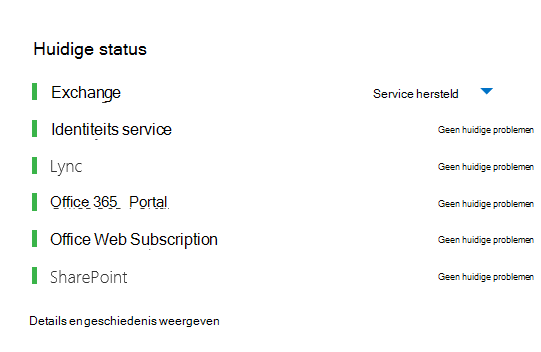
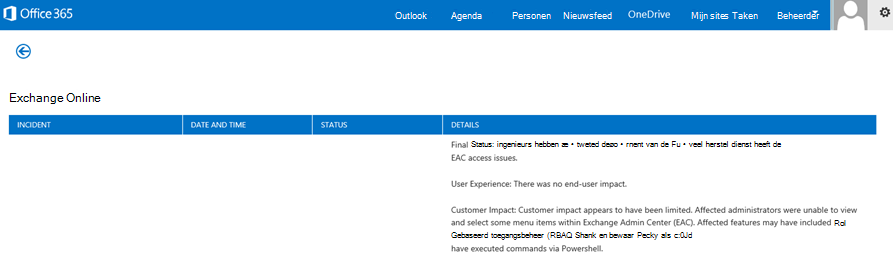
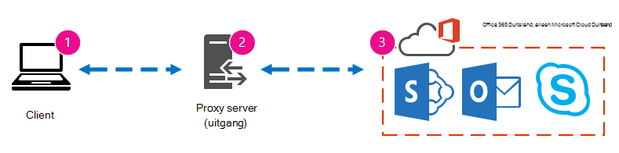
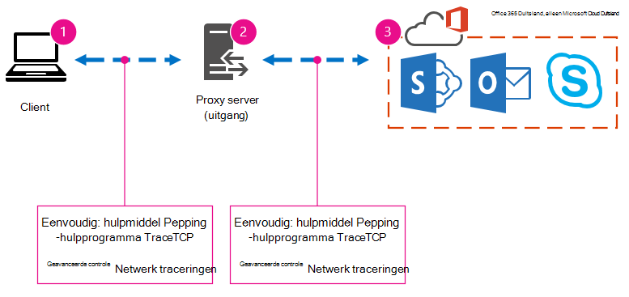
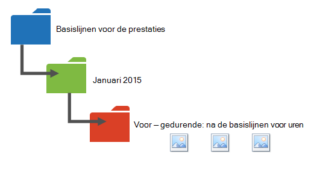
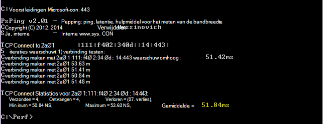
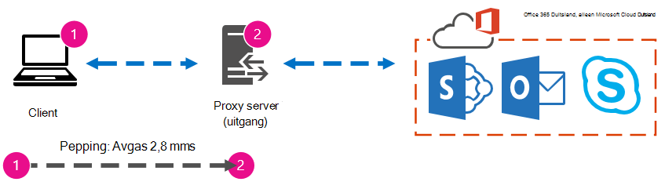

# Office 365-prestatieafstemming gebruikt basislijnen en prestatiegeschiedenisOffice 365 performance tuning using baselines and performance history

Er zijn enkele eenvoudige manieren om de verbindingsprestaties tussen uw Office 365 en uw bedrijf te controleren, zodat u een ruwe basislijn van uw connectiviteit kunt vaststellen.There are some simple ways to check the connection performance between Office 365 and your business that will let you establish a rough baseline of your connectivity. Als u de prestatiesgeschiedenis van uw clientcomputerverbindingen kent, kunt u nieuwe problemen vroegtijdig opsporen, problemen identificeren en voorspellen.Knowing the performance history of your client computer connections can help you detect emerging issues early, identify, and predict problems.
  
Als u niet gewend bent om te werken aan prestatieproblemen, is dit artikel ontworpen om u te helpen enkele veelvoorkomende vragen te overwegen, zoals Hoe weet u dat het probleem dat u ziet een prestatieprobleem is en niet een Office 365 service-incident?If you're not used to working on performance issues, this article is designed to help you consider some common questions, like How do you know the problem you're seeing is a performance issue and not an Office 365 service incident? Hoe kunt u goede prestaties op lange termijn plannen?How can you plan for good performance, long term? Hoe kunt u de prestaties in de gaten houden?How can you keep an eye on performance? Als uw team of klanten trage prestaties zien tijdens het gebruik van Office 365 en u zich afvraagt wat deze vragen zijn, leest u verder.If your team or clients are seeing slow performance while using Office 365, and you wonder about any of these questions, read on.
  
> [!IMPORTANT]
> **Hebt u op dit moment een prestatieprobleem tussen Office 365 klant en klant?****Have a performance issue between your client and Office 365 right now?** Volg de stappen die worden beschreven in het plan voor [prestatieproblemen voor Office 365.](performance-troubleshooting-plan.md)Follow the steps outlined in the [Performance troubleshooting plan for Office 365](performance-troubleshooting-plan.md). 
    
## Iets wat u moet weten over Office 365 prestatiesSomething you should know about Office 365 performance

Office 365 in een speciaal Microsoft-netwerk met hoge capaciteit dat niet alleen wordt gecontroleerd door automatisering, maar ook door echte personen.Office 365 lives inside a high-capacity, dedicated Microsoft network that is steadily monitored not just by automation, but by real people. Een deel van de rol van het Office 365 cloud is het inbouwen van prestatieafstemming en stroomlijnen waar dit mogelijk is.Part of the role of maintaining the Office 365 cloud is building-in performance tuning and streamlining where it's possible. Aangezien clients van de Office 365 cloud verbinding moeten maken via internet, is er een continue inspanning om de prestaties van de verschillende services Office 365 optimaliseren.Since clients of the Office 365 cloud have to connect across the Internet, there is a continuous effort to fine-tune the performance across Office 365 services too. Prestatieverbeteringen stoppen nooit echt in de cloud en er is veel ervaring met het gezond en snel houden van de cloud.Performance improvements never really stop in the cloud, and there is a lot of accumulated experience with keeping the cloud healthy and quick. Als er een prestatieprobleem is dat vanaf uw locatie verbinding maakt met Office 365, kunt u het beste niet beginnen met en wachten op een ondersteuningscase.Should you experience a performance issue connecting from your location to Office 365, it's best not to start with, and wait on, a Support case. In plaats daarvan moet u beginnen met het onderzoeken van het probleem van 'van binnen naar buiten'.Instead, you should begin investigating the problem from 'the inside out'. Dat wil zeggen: begin binnen uw netwerk en werk uw weg naar Office 365.That is, start inside of your network, and work your way out to Office 365. Voordat u een zaak opent met Office 365 ondersteuning, kunt u gegevens verzamelen en acties ondernemen om uw probleem te verkennen en mogelijk op te lossen.Before you open a case with Office 365 Support, you can gather data and take actions that will explore, and may resolve, your problem.
  
> [!IMPORTANT]
> Wees op de hoogte van capaciteitsplanning en limieten in Office 365.Be aware of capacity planning and limits in Office 365. Met deze informatie bent u voor op de curve wanneer u een prestatieprobleem probeert op te lossen.That information will put you ahead of the curve when trying to resolve a performance issue. Hier is een koppeling naar de Microsoft 365 [en Office 365 servicebeschrijvingen.](/office365/servicedescriptions/office-365-service-descriptions-technet-library)Here's a link to the [Microsoft 365 and Office 365 service descriptions](/office365/servicedescriptions/office-365-service-descriptions-technet-library). Dit is een centrale hub en alle services die door Office 365 worden aangeboden, hebben een koppeling naar hun eigen Servicebeschrijvingen vanaf hier.This is a central hub, and all the services offered by Office 365 have a link that goes to their own Service Descriptions from here. Dat betekent dat als u de standaardlimieten voor SharePoint Online wilt zien, u bijvoorbeeld op [SharePoint Online servicebeschrijving](/office365/servicedescriptions/sharepoint-online-service-description/sharepoint-online-service-description) klikt en de SharePoint [onlinelimieten](/office365/servicedescriptions/sharepoint-online-service-description/sharepoint-online-limits)zoekt.That means, should you need to see the standard limits for SharePoint Online, for example, you would click [SharePoint Online Service Description](/office365/servicedescriptions/sharepoint-online-service-description/sharepoint-online-service-description) and locate its [SharePoint Online Limits section](/office365/servicedescriptions/sharepoint-online-service-description/sharepoint-online-limits). 
  
Zorg ervoor dat u de probleemoplossing doorneemt met de kennis dat prestaties een schuivende schaal zijn, dat het niet gaat om het bereiken van een ideale waarde en het permanent onderhouden ervan (als u dit denkt, zijn af en toe taken met een hoge bandbreedte, zoals het instappen van een groot aantal gebruikers of het uitvoeren van grote gegevensmigraties, erg belastend, dus plan dan de gevolgen voor de prestaties).Make sure you go into your troubleshooting with the understanding that performance is a sliding scale, it's not about achieving an idealized value and maintaining it permanently (if you believe this is so, then occasional high-bandwidth tasks like on-boarding a large number of users, or doing large data migrations will be very stressful -- so do plan for performance impacts then). U kunt en moet een goed idee hebben van uw prestatiedoelen, maar veel variabelen spelen in op de prestaties, dus de prestaties variëren.You can, and should, have a rough idea of your performance targets, but a lot of variables play into performance, therefore, performance varies. Dat is de aard van de prestaties.That's the nature of performance. 
  
Prestatieproblemen gaan niet over het bereiken van specifieke doelen en het voor onbepaalde tijd behouden van deze getallen, maar het verbeteren van bestaande activiteiten, gezien alle variabelen.Performance troubleshooting isn't about meeting specific goals and maintaining those numbers indefinitely, it's about improving existing activities, given all the variables. 
  
## Hoe ziet een prestatieprobleem eruit?Okay, what does a performance problem look like?

Eerst moet u ervoor zorgen dat wat u ondervindt inderdaad een prestatieprobleem is en niet een service-incident.First, you need to make sure that what you are experiencing is indeed a performance issue and not a service incident. Een prestatieprobleem verschilt van een service-incident in Office 365.A performance problem is different from a service incident in Office 365. U kunt ze als eerste van elkaar onderscheiden.Here's how to tell them apart.
  
Als de Office 365 service problemen heeft, is dat een service-incident.If the Office 365 service is having issues, that's a service incident. U ziet rode of gele pictogrammen onder Huidige status **in** de Microsoft 365-beheercentrum, mogelijk ziet u ook trage prestaties op clientcomputers die verbinding maken met Office 365.You will see red or yellow icons under **Current health** in the Microsoft 365 admin center, you may also notice slow performance on client computers connecting to Office 365. Als huidige status bijvoorbeeld een rood pictogram  rapporteert en u Onderzoeken naast Exchange ziet, kunt u dan ook een aantal oproepen ontvangen van personen in uw organisatie die klagen dat clientpostvakken die Exchange Online gebruiken, slecht presteren.For example, if Current health reports a red icon and you see **Investigating** beside Exchange, you might then also receive a bunch of calls from people in your organization who complain that client mailboxes that use Exchange Online are performing badly. In dat geval is het redelijk om ervan uit te gaan dat uw Exchange Online net het slachtoffer is geworden van problemen binnen de Service.In that case, it's reasonable to assume that your Exchange Online performance just became a victim of issues within the Service. 
  

  
Op dit moment moet u, de Office 365-beheerder, de huidige status controleren en vervolgens regelmatig details en geschiedenis weergeven om op de hoogte te blijven van het onderhoud dat we op het systeem uitvoeren. At this point, you, the Office 365 admin, should check **Current health** and then **View details and history**, frequently, to keep up to date on maintenance we perform on the system. Het **dashboard Huidige status** is gemaakt om u bij te werken over wijzigingen in en problemen in de service.The **Current health** dashboard was made to update you about changes to, and problems in, the service. De notities en uitleg die zijn geschreven naar de gezondheidsgeschiedenis, beheerder naar beheerder, zijn er om u te helpen uw impact te meten en om u op de hoogte te houden van lopende werkzaamheden.The notes and explanations written to health history, admin to admin, are there to help you gauge your impact, and to keep you posted about ongoing work. 
  

  
Een prestatieprobleem is geen service-incident, ook al kunnen incidenten trage prestaties veroorzaken.A performance issue isn't a service incident, even though incidents can cause slow performance. Een prestatieprobleem ziet er als volgende uit:A performance issue looks like this:
  
- Er treedt een prestatieprobleem op, ongeacht wat het beheercentrum **Huidige status** rapporteert voor de service.A performance issue occurs no matter what the admin center **Current health** is reporting for the service. 
    
-  Een gedrag dat vroeger relatief naadloos was, duurt lang voordat het is voltooid of nooit is voltooid.A behavior that used to be relatively seamless takes a long time to complete or never completes. 
    
- U kunt het probleem ook repliceren, of u weet in ieder geval dat dit gebeurt als u de juiste reeks stappen doet.You can replicate the problem too, or, at least, you know it will happen if you do the right series of steps.
    
-  Als het probleem af en toe is, is er nog steeds een patroon, bijvoorbeeld dat u om 10:00 uur gesprekken hebt van gebruikers die geen betrouwbare toegang hebben tot Office 365 en dat de oproepen rond 12.00 uur zullen afsterven.If the problem is intermittent, there is still a pattern, for example, you know that by 10:00 AM you will have calls from users who can't reliably access Office 365, and that the calls will die down around noon. 
    
Dit klinkt waarschijnlijk bekend; misschien te bekend.This probably sounds familiar; maybe too familiar. Zodra u weet dat het een prestatieprobleem is, wordt de vraag' Wat doet u nu?Once you know it's a performance problem, the question becomes, "What do you do next?" De rest van dit artikel helpt u precies dat te bepalen.The rest of this article helps you determine exactly that.
  
## Het prestatieprobleem definiëren en testenHow to define and test the performance problem

Prestatieproblemen ontstaan vaak in de tijd, dus het kan lastig zijn om het werkelijke probleem te definiëren.Performance issues often emerge over time, so it can be challenging to define the actual problem. U moet een goede probleemverklaring en een goed idee van de context van problemen maken, en vervolgens moet u herhaalbare teststappen uitvoeren om de dag te winnen.You need to create a good problem statement and a good idea of issue context, and then you need to repeatable testing steps to win the day. Anders gaat u mogelijk verloren zonder uw eigen schuld.Otherwise, through no fault of your own, you may be lost. Waarom?Why? Hier zijn enkele voorbeelden van problemen die onvoldoende informatie bevatten:Well, here are some examples of problems statements that don't provide enough information:
  
- Het overstappen van mijn Postvak IN naar mijn agenda was iets wat ik niet heb gezien en nu is het een koffiepauze.Switching from my Inbox to my Calendar used to be something I didn't notice, and now it's a coffee-break. Kunt u ervoor zorgen dat het zich zo gedragen als vroeger?Can you make it act like it used to?
    
- Het uploaden van mijn bestanden naar SharePoint Online duurt een eeuwigheid.Uploading my files to SharePoint Online is taking forever. Waarom is het traag in de middag, maar een andere keer is het snel?Why is it slow in the afternoon, but any other time, it's fast? Kan het niet gewoon snel zijn?Can't it just be fast?
    
De bovenstaande probleemverklaringen bieden verschillende grote uitdagingen.There are several large challenges posed by the problem statements above. Er zijn met name veel dubbelzinnigheden om mee om te gaan.Specifically, there are a lot of ambiguities to deal with. bijvoorbeeld:for example:
  
- Het is niet duidelijk hoe het schakelen tussen Postvak IN en Agenda op de laptop werkt.It's unclear how switching between Inbox and Calendar used to act on the laptop.
    
- Wanneer de gebruiker zegt: 'Kan het niet gewoon snel zijn', wat is 'snel'?When the user says, "Can't it just be fast", what's "fast"?
    
- Hoe lang is 'voor altijd'?How long is "forever"? Is dat enkele seconden of minuten, of kan de gebruiker gaan lunchen en wordt deze tien minuten nadat de gebruiker terug is, klaar?Is that several seconds, or minutes, or could the user go to lunch and it would finish up ten minutes after the user got back?
    
Dit alles zonder rekening te houden met het feit dat de beheerder en probleemoplosser niet op de hoogte kunnen zijn van veel details uit probleemverklaringen zoals deze.All of this is without considering that the admin and troubleshooter can't be aware of many details from problem statements like these. Bijvoorbeeld wanneer het probleem zich voordeed. Dat de gebruiker thuis werkt en alleen maar langzaam ziet schakelen terwijl hij of zij een thuisnetwerk gebruikt. Dat de gebruiker meerdere andere RAM-intensieve toepassingen moet uitvoeren op de lokale client, of dat de gebruiker een ouder besturingssysteem gebruikt of geen recente updates heeft uitgevoerd.For example, when the problem started happening; That the user works from home and only ever sees slow switching while on a home network; That the user must run several other RAM intensive applications on the local client, or the user is running an older operating system or hasn't run recent updates.
  
Wanneer gebruikers een prestatieprobleem melden, moet er veel informatie worden verzameld.When users report a performance problem, there's a lot of information to collect. Het verzamelen van deze gegevens maakt deel uit van een proces dat scoping van het probleem wordt genoemd, of het onderzoeken ervan.Collecting this information is part of a process called scoping the issue, or investigating it. Het volgende is een eenvoudige scopinglijst die u kunt gebruiken om informatie over uw prestatieprobleem te verzamelen.The following is a basic scoping list you can use to collect information about your performance issue. Deze lijst is niet volledig, maar het is een plek om een eigen lijst te starten:This list is not exhaustive, but it's a place to start one of your own: 
  
- Op welke datum is het probleem gebeurd en rond welk tijdstip van de dag of nacht?On what date did the issue happen, and around what time of day or night?
    
- Welk type clientcomputer gebruikte u en hoe maakt deze verbinding met het zakelijke netwerk (VPN, Wired, Wireless)?What kind of client computer were you using, and how does it connect to the business network (VPN, Wired, Wireless)?
    
- Werkte u op afstand of was u op kantoor?Were you working remotely or were you in the office?
    
- Hebt u dezelfde acties op een andere computer geprobeerd en hetzelfde gedrag gezien?Did you try the same actions on another computer and see the same behavior?
    
- Doorloop de stappen die u de problemen geven, zodat u de acties kunt schrijven die u hebt genomen.Walk through the steps that are giving you the trouble so that you can write the actions you take down.
    
- Hoe traag zijn de prestaties in seconden of minuten?How slow in seconds or minutes is the performance?
    
- Waar ter wereld bevindt u zich?Where in the world are you located?
    
Sommige van deze vragen zijn duidelijker dan andere.Some of these questions are more obvious than others. De meeste mensen begrijpen dat een probleemoplosser de exacte stappen nodig heeft om het probleem te reproduceren.Most everyone will understand a troubleshooter needs the exact steps to reproduce the issue. Hoe kunt u anders opnemen wat er mis is en hoe kunt u anders testen of het probleem is opgelost?After all, how else can you record what's wrong, and how else can you test if the issue is fixed? Minder voor de hand liggend zijn dingen als 'Welke datum en tijd hebt u het probleem gezien?' en 'Waar ter wereld bevindt u zich?', informatie die u kunt gebruiken in combinatie.Less obvious are things like "What date and time did you see the issue?", and "Where in the world are you located?", information that can be used in tandem. Afhankelijk van wanneer de gebruiker aan het werk was, kan een paar uur tijdverschil betekenen dat er al onderhoud wordt gedaan aan delen van het netwerk van uw bedrijf.Depending on when the user was working, a few hours of time difference may mean maintenance is already underway on parts of your company's network. Als uw bedrijf bijvoorbeeld een hybride implementatie heeft, zoals een hybride SharePoint Search, waarmee zoekopdrachten kunnen worden uitgevoerd in zowel SharePoint Online als een on-premises SharePoint Server 2013-exemplaar, worden er mogelijk updates uitgevoerd in de on-premises farm.If, for example, your company has a hybrid implementation, like a hybrid SharePoint Search, which can query search indexes in both SharePoint Online and an On-premises SharePoint Server 2013 instance, updates may be underway in the on-premises farm. Als uw bedrijf allemaal in de cloud is, kan systeemonderhoud bestaan uit het toevoegen of verwijderen van netwerkhardware, het uitrollen van updates die voor het hele bedrijf zijn, of het aanbrengen van wijzigingen in DNS of andere kerninfrastructuur.If your company is all in the cloud, system maintenance may include adding or removing network hardware, rolling out updates that are company-wide, or making changes to DNS, or other core infrastructure.
  
Wanneer u een prestatieprobleem oplost, lijkt het een beetje op een plaats delict. U moet nauwkeurig en oplettend zijn om conclusies te trekken uit het bewijs.When you're troubleshooting a performance problem, it's a bit like a crime scene, you need to be precise and observant to draw any conclusions from the evidence. Hiervoor moet u een goede probleemverklaring krijgen door bewijs te verzamelen.In order to do this, you must get a good problem statement by gathering evidence. Het moet de context van de computer, de context van de gebruiker, het begin van het probleem en de exacte stappen bevatten die het prestatieprobleem hebben blootgelegd.It should include the computer's context, the user's context, when the problem began, and the exact steps that exposed the performance issue. Deze probleemverklaring moet de bovenste pagina in uw notities zijn en blijven.This problem statement should be, and stay, the topmost page in your notes. Door de probleemverklaring opnieuw te doorlopen nadat u aan de oplossing hebt gewerkt, neemt u de stappen om te testen en te bewijzen of de acties die u ondernomen hebt het probleem hebben opgelost.By walking through the problem statement again after you work on the resolution, you are taking the steps to test and prove whether the actions you take have resolved the issue. Dit is essentieel om te weten wanneer uw werk, daar, klaar is.This is critical to knowing when your work, there, is done.
  
## Weet u hoe de prestaties er vroeger uit zien als deze goed waren?Do you know how performance used to look when it was good?

Als u pech hebt, weet niemand het.If you're unlucky, nobody knows. Niemand had getallen.Nobody had numbers. Dat betekent dat niemand de eenvoudige vraag 'Over hoeveel seconden heeft het gebruikt om een Postvak IN in Office 365 weer te geven' kan beantwoorden, of 'Hoe lang heeft het duren voordat de leidinggevenden een Lync Online-vergadering hebben gehad?', wat een veelvoorkomende scenario is voor veel bedrijven.That means nobody can answer the simple question "About how many seconds did it used to take to bring up an Inbox in Office 365?", or "How long did it used to take when the Executives had a Lync Online meeting?", which is a common scenario for many companies.
  
Wat hier ontbreekt, is een basislijn voor prestaties.What's missing here is a performance baseline.
  
Basislijnen geven u een context voor uw prestaties.Baselines give you a context for your performance. U moet af en toe een basislijn nemen om regelmatig te werken, afhankelijk van de behoeften van uw bedrijf.You should take a baseline occasionally to frequently, depending on the needs of your company. Als u een groter bedrijf bent, kan uw Operations-team al basislijnen voor uw on-premises omgeving maken.If you are a larger company, your Operations team may take baselines for your on-premises environment already. Als u bijvoorbeeld alle Exchange-servers patcht op de eerste maandag van de maand en al uw SharePoint-servers op de derde maandag, heeft uw Operations-team waarschijnlijk een lijst met taken en scenario's die na het patchen worden uitgevoerd, om te bewijzen dat kritieke functies operationeel zijn.For example, if you patch all the Exchange servers on the first Monday of the month, and all your SharePoint servers on the third Monday, your Operations team probably has a list of tasks and scenarios it runs post-patching, to prove that critical functions are operational. U opent bijvoorbeeld het Postvak IN, klikt op Verzenden/ontvangen en zorgt ervoor dat de mappen worden bijgewerkt of bladert in SharePoint op de hoofdpagina van de site, gaat naar de pagina Zoeken in het bedrijf en doet een zoekopdracht die resultaten oplevert.For example, opening the Inbox, clicking Send/Receive, and making sure the folders update, or, in SharePoint, browsing the main page of the site, going into the enterprise Search page, and doing a search that returns results.
  
Als uw toepassingen in Office 365 staan, kunt u de tijd (in milliseconden) meten vanaf een clientcomputer in uw netwerk, naar een uitgangspunt of het punt waar u uw netwerk verlaat en naar Office 365.If your applications are in Office 365, some of the most fundamental baselines you can take measure the time (in milliseconds) from a client computer inside your network, to an egress point, or the point where you leave your network and go out to Office 365. Hier vindt u enkele handige basislijnen die u kunt onderzoeken en opnemen:Here are some helpful baselines that you can investigate and record:
  
- Identificeer de apparaten tussen uw clientcomputer en het uitgangspunt, bijvoorbeeld uw proxyserver.Identify the devices between your client computer and your egress point, for example, your proxy server.
    
  - U moet uw apparaten kennen, zodat u context (IP-adressen, type apparaat, enzovoort) hebt voor prestatieproblemen die zich voordoen.You need to know your devices so that you have context (IP addresses, type of device, et cetera) for performance problems that arise.
    
  - Proxyservers zijn veelvoorkomende uitgangspunten, dus u kunt uw webbrowser controleren om te zien welke proxyserver deze kan gebruiken, indien van toepassing.Proxy servers are common egress points, so you can check your web browser to see what proxy server it is set to use, if any.
    
  - Er zijn hulpprogramma's van derden die uw netwerk kunnen ontdekken en in kaart kunnen brengen, maar de veiligste manier om uw apparaten te kennen, is door een lid van uw netwerkteam te vragen.There are third party tools that can discover and map your network, but the safest way to know your devices is to ask a member of your network team.
    
- Identificeer uw internetprovider (internetprovider), schrijf de contactgegevens op en vraag hoeveel circuits u hebt.Identify your Internet service provider (ISP), write down their contact information, and ask how many circuits how much bandwidth you have.
    
- Identificeer binnen uw bedrijf resources voor de apparaten tussen uw client en het uitgangspunt of identificeer een contactpersoon voor noodgevallen om mee te praten over netwerkproblemen.Inside your company, identify resources for the devices between your client and the egress point, or identify an emergency contact to talk to about networking issues.
    
Hier zijn enkele basislijnen die u kunt berekenen met eenvoudige tests met hulpprogramma's:Here are some baselines that simple testing with tools can calculate for you:
  
- Tijd van uw clientcomputer naar het uitgangspunt in millisecondenTime from your client computer to your egress point in milliseconds
    
- Tijd van het uitgangspunt naar Office 365 in millisecondenTime from your egress point to Office 365 in milliseconds
    
- Locatie in de wereld van de server die de URL's voor Office 365 wanneer u bladertLocation in the world of the server that resolves the URLS for Office 365 when you browse
    
- De snelheid van de DNS-resolutie van uw internetprovider in milliseconden, inconsistenties in de ontvangst van pakketten (netwerk jitter), upload- en downloadtijden in millisecondenThe speed of your ISP's DNS resolution in milliseconds, inconsistencies in packet arrival (network jitter), upload and download times in milliseconds
    
Als u niet bekend bent met het uitvoeren van deze stappen, gaan we verder met meer informatie in dit artikel.If you're unfamiliar with how to carry out these steps, we'll go into more detail in this article. 
  
## Wat is een basislijn?What is a baseline?

U weet wat de gevolgen zijn wanneer het fout gaat, maar als u uw historische prestatiegegevens niet kent, is het niet mogelijk om een context te hebben voor hoe slecht het kan zijn geworden en wanneer.You'll know the impact when it goes bad, but if you don't know your historical performance data, it's not possible to have a context for how bad it may have become, and when. Dus zonder basislijn ontbreekt de belangrijkste aanwijzing om de puzzel op te lossen: de afbeelding in het puzzelvak.So without a baseline, you're missing the key clue to solve the puzzle: the picture on the puzzle box. Bij prestatieproblemen hebt u een *vergelijkingspunt nodig.*In performance troubleshooting, you need a point of  *comparison*  . Eenvoudige basislijnen voor prestaties zijn niet moeilijk te nemen.Simple performance baselines aren't difficult to take. Uw Operations-team kan worden belast met het uitvoeren van deze taken volgens een planning.Your Operations team can be tasked with carrying these out on a schedule. Stel dat uw verbinding er zo uitziet:For example, let's say your connection looks like this: 
  

  
Dat betekent dat u hebt gecontroleerd bij uw netwerkteam en hebt ontdekt dat u uw bedrijf voor internet verlaat via een proxyserver en dat deze proxy alle aanvragen verwerkt die uw clientcomputer naar de cloud verzendt.That means you've checked with your network team and found out that you leave your company for the Internet through a proxy server, and that proxy handles all the requests your client computer sends to the cloud. In dit geval moet u een vereenvoudigde versie van uw verbinding tekenen waarin alle tussenliggende apparaten worden vermeld.In this case, you should draw a simplified version of your connection that lists all the intervening devices. Voeg nu hulpprogramma's in die u kunt gebruiken om de prestaties te testen tussen de client, het uitgangspunt (waar u uw netwerk verlaat voor internet) en de Office 365 cloud.Now, insert tools that you can use to test the performance between the client, the egress point (where you leave your network for the Internet), and the Office 365 cloud.
  

  
De opties worden weergegeven als **Eenvoudig** en Geavanceerd **vanwege** de hoeveelheid expertise die u nodig hebt om de prestatiegegevens te vinden.The options are listed as **Simple** and **Advanced** because of the amount of expertise you need in order to find the performance data. Een netwerkspoor neemt veel tijd in vergelijking met het uitvoeren van opdrachtregelhulpmiddelen zoals PsPing en TraceTCP.A network trace will take a lot of time, compared to running command-line tools like PsPing and TraceTCP. Deze twee opdrachtregelhulpmiddelen zijn gekozen omdat ze geen ICMP-pakketten gebruiken, die worden geblokkeerd door Office 365 en omdat ze in milliseconden de tijd geven die nodig is om de clientcomputer te verlaten, of proxyserver (als u toegang hebt) en bij Office 365.These two command-line tools were chosen because they don't use ICMP packets, which will be blocked by Office 365, and because they give the time in milliseconds that it takes to leave the client computer, or proxy server (if you have access) and arrive at Office 365. Elke afzonderlijke hop van de ene naar de andere computer krijgt een tijdswaarde en dat is heel goed voor basislijnen.Each individual hop from one computer to another will end up with a time value, and that's great for baselines! Net zo belangrijk is dat u met deze opdrachtregelhulpmiddelen een poortnummer aan de opdracht kunt toevoegen, dit is handig omdat Office 365 communiceert via poort 443, de poort die wordt gebruikt door Secure Sockets Layer en Transport Layer Security (SSL en TLS).Just as importantly, these command-line tools allow you to add a port number onto the command, this is useful because Office 365 communicates over port 443, which is the port used by Secure Sockets Layer and Transport Layer Security (SSL and TLS). Andere hulpprogramma's van derden kunnen echter betere oplossingen zijn voor uw situatie.However, other third-party tools may be better solutions for your situation. Microsoft biedt geen ondersteuning voor al deze hulpprogramma's, dus als psPing en TraceTCP om de een of andere reden niet werken, gaat u verder met een netwerkspoor met een hulpprogramma zoals Netmon.Microsoft doesn't support all of these tools, so if, for some reason, you can't get PsPing and TraceTCP working, move on to a network trace with a tool like Netmon. 
  
U kunt een basislijn maken vóór werkuren, opnieuw tijdens intensief gebruik en daarna opnieuw na uren.You can take a baseline before business hours, again during heavy use, and then again after hours. Dit betekent dat u mogelijk een mapstructuur hebt die er op het einde een beetje zo uitziet:This means you may have a folder structure that looks a bit like this in the end:
  

  
Kies ook een naamgevingsconventie voor uw bestanden.You should also pick a naming convention your files. Dit zijn enkele voorbeelden:Here are some examples:
  
- Feb_09_2015_9amPST_PerfBaseline_Netmon_ClientToEgress_NormalFeb_09_2015_9amPST_PerfBaseline_Netmon_ClientToEgress_Normal
    
- Jan_10_2015_3pmCST_PerfBaseline_PsPing_ClientToO365_bypassProxy_SLOWJan_10_2015_3pmCST_PerfBaseline_PsPing_ClientToO365_bypassProxy_SLOW
    
- Feb_08_2015_2pmEST_PerfBaseline_BADPerfFeb_08_2015_2pmEST_PerfBaseline_BADPerf
    
- Feb_08_2015_8-30amEST_PerfBaseline_GoodPerfFeb_08_2015_8-30amEST_PerfBaseline_GoodPerf
    
Er zijn veel verschillende manieren om dit te doen, maar het gebruik van de indeling **\<dateTime\>\<what's happening in the test\>** is een goede plek om te beginnen.There are lots of different ways to do this, but using the format **\<dateTime\>\<what's happening in the test\>** is a good place to start. Als u hier zorgvuldig mee bezig bent, helpt dit veel wanneer u problemen later probeert op te lossen.Being diligent about this will help a lot when you are trying to troubleshoot issues later. Later kunt u zeggen: 'Ik heb twee sporen op 8 februari, een goede prestatie en een slecht resultaat, zodat we ze kunnen vergelijken'.Later, you'll be able to say "I took two traces on February 8th, one showed good performance and one showed bad, so we can compare them". Dit is zeer handig voor het oplossen van problemen.This is extremely helpful for troubleshooting. 
  
U moet een georganiseerde manier hebben om uw historische basislijnen te behouden.You need to have an organized way to keep your historical baselines. In dit voorbeeld hebben de eenvoudige methoden drie opdrachtregeluitvoeren geproduceerd en zijn de resultaten verzameld als schermafbeeldingen, maar in plaats daarvan hebt u mogelijk netwerkopnamebestanden.In this example, the simple methods produced three command line outputs and the results were collected as screen shots, but you may have network capture files instead. Gebruik de methode die het beste voor u werkt.Use the method that works best for you. Sla uw historische basislijnen op en raadpleeg deze op punten waar u wijzigingen ziet in het gedrag van onlineservices.Store your historical baselines and refer to them at points where you notice changes in the behavior of online services. 
  
## Waarom prestatiegegevens verzamelen tijdens een pilot?Why collect performance data during a pilot?

Er is geen betere tijd om basislijnen te maken dan tijdens een pilot van de Office 365 service.There is no better time to start making baselines than during a pilot of the Office 365 service. Uw kantoor kan duizenden gebruikers, honderdduizenden of vijf gebruikers hebben, maar zelfs met een klein aantal gebruikers kunt u tests uitvoeren om schommelingen in prestaties te meten.Your office may have thousands of users, hundreds of thousands, or it may have five, but even with a small number of users, you can perform tests to measure fluctuations in performance. In het geval van een groot bedrijf kan een representatieve steekproef van enkele honderden gebruikers die Office 365 piloten, naar buiten worden geprojecteerd op enkele duizenden, zodat u weet waar problemen kunnen optreden voordat ze optreden.In the case of a large company, a representative sample of several hundred users piloting Office 365 can be projected outward to several thousands so you know where issues might arise before they happen.
  
In het geval van een klein bedrijf, waarbij instappen betekent dat alle gebruikers tegelijk naar de service gaan en er geen pilot is, moet u prestatie-metingen houden, zodat u gegevens hebt om aan iedereen weer te geven die mogelijk een slecht presterende bewerking moet oplossen.In the case of a small company, where on-boarding means that all users go to the service at the same time and there is no pilot, keep performance measures so that you have data to show to anyone who may have to troubleshoot a badly performing operation. Als u bijvoorbeeld merkt dat u plotseling door uw gebouw kunt lopen in de tijd die nodig is om een middelgrote afbeelding te uploaden, waar dit vroeger heel snel gebeurde.For example, if you notice that all of a sudden you can walk around your building in the time it takes to upload a medium-sized graphic where it used to happen very quickly.
  
## Basislijnen verzamelenHow to collect baselines

Voor alle probleemoplossingsplannen moet u deze dingen minimaal identificeren:For all troubleshooting plans you need to identify these things at a minimum:
  
- De clientcomputer die u gebruikt (het type computer of apparaat, een IP-adres en de acties die het probleem hebben veroorzaakt)The client computer you're using (the type of computer or device, an IP address, and the actions that caused the issue)
    
- Waar de clientcomputer zich in de wereld bevindt (bijvoorbeeld of deze gebruiker een VPN gebruikt voor het netwerk, op afstand werkt of op het bedrijfs intranet)Where the client computer is located in the world (for example, whether this user on a VPN to the network, working remotely, or on the company intranet)
    
- Het uitgangspunt dat de clientcomputer gebruikt vanuit uw netwerk (het punt waarop het verkeer uw bedrijf verlaat voor een internetprovider of internet)The egress point the client computer uses from your network (the point at which traffic leaves your business for an ISP or the Internet)
    
 U kunt de indeling van uw netwerk vinden via de netwerkbeheerder.You can find out the layout of your network from the network administrator. Als u een klein netwerk hebt, bekijkt u de apparaten die u verbinden met internet en belt u uw internetprovider als u vragen hebt over de indeling.If you're on a small network, take a look at the devices connecting you to the Internet, and call your ISP if you have questions about the layout. Maak een afbeelding van de uiteindelijke indeling voor uw verwijzing.Create a graphic of the final layout for your reference. 
  
Deze sectie is onderverdeeld in eenvoudige opdrachtregelhulpmiddelen en -methoden en meer geavanceerde hulpmiddelenopties.This section is broken into simple command-line tools and methods, and more advanced tools options. We behandelen eerst eenvoudige methoden.We'll cover simple methods first. Maar als u op dit moment een prestatieprobleem hebt, moet u naar geavanceerde methoden gaan en het voorbeeld van het actieplan voor prestatieproblemen uitproberen.But if you've got a performance problem right now, you should jump to advanced methods and try out the sample performance-troubleshooting action plan.
  
### Eenvoudige methodenSimple methods

Het doel van deze eenvoudige methoden is om eenvoudige prestatielijnlijnen in de tijd op te nemen, te begrijpen en correct op te slaan, zodat u op de hoogte bent van de Office 365 prestaties.The objective of these simple methods is to learn to take, understand, and properly store simple performance baselines over time so that you are informed about Office 365 performance. Hier is het eenvoudige diagram voor eenvoudig, zoals u eerder hebt gezien:Here's the very simple diagram for simple, as you've seen before:
  

  
> [!NOTE]
> TraceTCP is opgenomen in deze schermafbeelding, omdat het een handig hulpmiddel is om in milliseconden weer te geven hoe lang een aanvraag duurt om te verwerken, en hoeveel netwerkhops of verbindingen van de ene computer naar de volgende, die de aanvraag nodig heeft om een bestemming te bereiken.TraceTCP is included in this screen shot because it's a useful tool for showing, in milliseconds, how long a request takes to process, and how many network hops, or connections from one computer to the next, that the request takes to reach a destination. TraceTCP kan ook de namen geven van servers die tijdens hops worden gebruikt, wat handig kan zijn voor een Microsoft Office 365 probleemoplosser in ondersteuning.TraceTCP can also give the names of servers used during hops, which can be useful to a Microsoft Office 365 troubleshooter in Support. > TraceTCP-opdrachten kunnen heel eenvoudig zijn, zoals: >> Vergeet niet om het poortnummer in de opdracht  `tracetcp.exe outlook.office365.com:443` op te nemen!> TraceTCP commands can be very simple, such as: >  `tracetcp.exe outlook.office365.com:443`> Remember to include the port number in the command! > [TraceTCP](https://simulatedsimian.github.io/tracetcp_download.html) is een gratis download, maar is afhankelijk van Wincap. > [TraceTCP](https://simulatedsimian.github.io/tracetcp_download.html) is a free download, but relies on Wincap. Wincap is een hulpprogramma dat ook wordt gebruikt en geïnstalleerd door Netmon.Wincap is a tool that is also used and installed by Netmon. We gebruiken Netmon ook in de sectie Geavanceerde methoden.We also use Netmon in the advanced methods section. 
  
 Als u meerdere kantoren hebt, moet u ook op elk van deze locaties een set gegevens van een client bewaren.If you have multiple offices, you'll need to keep a set of data from a client in each of those locations as well. Deze test meet de latentie, die in dit geval een getalwaarde is die de tijd beschrijft tussen een client die een aanvraag naar Office 365 verstuurt en Office 365 de aanvraag beantwoordt.This test measures latency, which, in this case, is a number value that describes the amount of time between a client sending a request to Office 365, and Office 365 responding to the request. Het testen vindt zijn oorsprong in uw domein op een clientcomputer en kijkt naar een retourreis vanuit uw netwerk, via een uitgangspunt, via internet naar Office 365 en terug.The testing originates inside your domain on a client computer, and looks to measure a round trip from inside your network, out through an egress point, across the Internet to Office 365, and back. 
  
Er zijn een paar manieren om met het uitgangspunt om te gaan, in dit geval de proxyserver.There are a few ways to deal with the egress point, in this case, the proxy server. U kunt van 1 naar 2 en vervolgens 2 tot 3 traceren en vervolgens de getallen in milliseconden toevoegen om een definitief totaal te krijgen aan de rand van uw netwerk.You can either trace from 1 to 2 and then 2 to 3, and then add the numbers in milliseconds to get a final total to the edge of your network. U kunt de verbinding ook zo configureren dat de proxy voor Office 365 wordt overgeslagen.Or, you can configure the connection to bypass the proxy for Office 365 addresses. In een groter netwerk met een firewall, reverse proxy of een combinatie van de twee moet u mogelijk uitzonderingen maken op de proxyserver, waardoor het verkeer voor veel URL's kan worden doorgelaten.In a larger network with a firewall, reverse proxy, or some combination of the two, you may need to make exceptions on the proxy server that will allow traffic to pass for a lot of URLs. Zie url's en IP-adresbereiken voor Office 365 lijst met eindpunten die door Office 365 [worden gebruikt.](https://support.office.com/article/8548a211-3fe7-47cb-abb1-355ea5aa88a2)For the list of endpoints used by Office 365, see [Office 365 URLs and IP address ranges](https://support.office.com/article/8548a211-3fe7-47cb-abb1-355ea5aa88a2). Als u een authenticerende proxy hebt, begint u met het testen van uitzonderingen voor het volgende:If you have an authenticating proxy, begin by testing exceptions for the following:
  
- Poorten 80 en 443Ports 80 and 443
    
- TCP- en HTTP'sTCP and HTTPs
    
- Verbindingen die uitgaand zijn van een van deze URL's:Connections that are outbound to any of these URLs:
    
- \*.microsoftonline.com\*.microsoftonline.com
    
- \*.microsoftonline-p.com\*.microsoftonline-p.com
    
- \*.sharepoint.com\*.sharepoint.com
    
- \*.outlook.com\*.outlook.com
    
- \*.lync.com\*.lync.com
    
- osub.microsoft.comosub.microsoft.com
    
Alle gebruikers moeten toegang hebben tot deze adressen zonder tussenkomst van proxy's of verificatie.All users need to be allowed to get to these addresses without any proxy interference or authentication. Op een kleiner netwerk moet u deze toevoegen aan de lijst met proxy-bypasss in uw webbrowser.On a smaller network, you should add these to your proxy bypass list in your web browser. 
  
Als u deze wilt toevoegen aan uw lijst met proxy-bypasss in Internet Explorer, gaat u naar **Extra** \> **internetopties** \> **Verbindingen** \> **LAN-instellingen** \> **Geavanceerd.**To add these to your proxy bypass list in Internet Explorer, go to **Tools** \> **Internet Options** \> **Connections** \> **LAN settings** \> **Advanced**. Op het tabblad Geavanceerd vindt u ook de proxyserver en de proxyserverpoort.The advanced tab is also where you will find your proxy server and proxy server port. Mogelijk moet u op het selectievakje **Een proxyserver** voor uw LAN gebruiken klikken om toegang te krijgen **tot** de knop Geavanceerd.You may need to click the checkbox **Use a proxy server for your LAN**, to access the **Advanced** button. U moet ervoor zorgen dat proxyserver voor **lokale** adressen omzeilen is ingeschakeld.You'll want to make sure that **Bypass proxy server for local addresses** is checked. Wanneer u op **Geavanceerd** klikt, ziet u een tekstvak waarin u uitzonderingen kunt invoeren.Once you click **Advanced**, you'll see a text box where you can enter exceptions. Scheid de jokerteken-URL's die hierboven worden vermeld, bijvoorbeeld door punt-dubbele punt:Separate the wildcard URLs listed above with semi-colons, for example:
  
\*.microsoftonline.com; \*.sharepoint.com\*.microsoftonline.com; \*.sharepoint.com
  
Wanneer u de proxy hebt overgeslagen, kunt u ping of PsPing rechtstreeks op een url Office 365 gebruiken.Once you bypass your proxy, you should be able to use ping or PsPing directly on an Office 365 URL. De volgende stap is het testen van ping **outlook.office365.com.**The next step will be to test ping **outlook.office365.com**. Of als u PsPing **gebruikt of** een ander hulpmiddel waarmee u een poortnummer aan de opdracht kunt leveren, psping tegen portal.microsoftonline.com:443 om de gemiddelde retourtijd in milliseconden te zien.Or, if you're using PsPing or another tool that will let you supply a port number to the command, PsPing against **portal.microsoftonline.com:443** to see the average round trip time in milliseconds. 
  
De retourtijd, of RTT, is een getalwaarde die meet hoe lang het duurt om een HTTP-aanvraag naar een server zoals outlook.office365.com te verzenden en een antwoord terug te krijgen dat bevestigt dat de server weet dat u het hebt gedaan.The round trip time, or RTT, is a number value that measures how long it takes to send a HTTP request to a server like outlook.office365.com and get a response back that acknowledges the server knows that you did it. U ziet dit soms afgekort als RTT.You'll sometimes see this abbreviated as RTT. Dit moet een relatief korte tijd zijn.This should be a relatively short amount of time.
  
U moet [PSPing](/sysinternals/downloads/psping) of een ander hulpprogramma gebruiken dat geen ICMP-pakketten gebruikt die door de Office 365 worden geblokkeerd om deze test uit te kunnen doen.You have to use [PSPing](/sysinternals/downloads/psping) or another tool that does not use ICMP packets which are blocked by Office 365 in order to do this test. 
  
 **PsPing gebruiken om een algemene retourtijd in milliseconden rechtstreeks vanuit een url Office 365 krijgen****How to use PsPing to get an overall round trip time in milliseconds directly from an Office 365 URL**
  
1. Voer een opdrachtprompt met verhoogde opdracht uit door de volgende stappen uit te voeren:Run an elevated command prompt by completing these steps:
    
1. Klik op **Start**.Click **Start**.
    
2. Typ cmd **in het** vak Zoeken starten en druk op Ctrl+Shift+Enter.In the **Start Search** box, type cmd, and then press CTRL+SHIFT+ENTER.
    
3. Als het **dialoogvenster Gebruikersaccountbeheer** wordt weergegeven, controleert u of de actie die wordt weergegeven, is wat u wilt en klikt u vervolgens op **Doorgaan.**If the **User Account Control** dialog box appears, confirm that the action it displays is what you want, and then click **Continue**.
    
2. Ga naar de map waar het hulpprogramma (in dit geval PsPing) is geïnstalleerd en test deze Office 365 URL's:Navigate to the folder where the tool (in this case PsPing) is installed and test these Office 365 URLs:
    
  - psping admin.microsoft.com:443psping admin.microsoft.com:443
    
  - psping microsoft-my.sharepoint.com:443psping microsoft-my.sharepoint.com:443
    
  - psping outlook.office365.com:443psping outlook.office365.com:443
    
  - psping www.yammer.com:443psping www.yammer.com:443
    
    
  
Zorg ervoor dat u het poortnummer van 443 op moet nemen.Be sure to include the port number of 443. Houd er Office 365 werkt op een versleuteld kanaal.Remember that Office 365 works on an encrypted channel. Als u PsPing zonder het poortnummer hebt, mislukt uw aanvraag.If you PsPing without the port number, your request will fail. Wanneer u uw korte lijst hebt gepingt, kijkt u naar de gemiddelde tijd in milliseconden (ms).Once you've pinged your short list, look for the Average time in milliseconds (ms). Dat is wat u wilt opnemen!That is what you want to record!
  

  
Als u niet bekend bent met proxy bypass en de voorkeur geeft aan stap voor stap, moet u eerst de naam van de proxyserver weten.If you're not familiar with proxy bypass, and prefer to take things step-by-step, you need to first find out the name of your proxy server. Ga in Internet Explorer naar **Tools** \> **Internet Options** \> **Connections** LAN \> **settings** \> **Advanced**.In Internet Explorer go to **Tools** \> **Internet Options** \> **Connections** \> **LAN settings** \> **Advanced**. Op **het** tabblad Geavanceerd wordt de proxyserver weergegeven.The **Advanced** tab is where you will see your proxy server listed. Ping die proxyserver bij een opdrachtprompt door deze taak uit te voeren:Ping that proxy server at a command prompt by completing this task: 
  
 **De proxyserver pingen en een retourwaarde krijgen in milliseconden voor fase 1 tot en met 2****To ping the proxy server and get a round trip value in milliseconds for stage 1 to 2**
  
1. Voer een opdrachtprompt met verhoogde opdracht uit door de volgende stappen uit te voeren:Run an elevated command prompt by completing these steps:
    
1. Klik op **Start**.Click **Start**.
    
2. Typ cmd **in het** vak Zoeken starten en druk op Ctrl+Shift+Enter.In the **Start Search** box, type cmd, and then press CTRL+SHIFT+ENTER.
    
3. Als het **dialoogvenster Gebruikersaccountbeheer** wordt weergegeven, controleert u of de actie die wordt weergegeven, is wat u wilt en klikt u vervolgens op **Doorgaan.**If the **User Account Control** dialog box appears, confirm that the action it displays is what you want, and then click **Continue**.
    
2. Typ ping \<the name of the proxy server your browser uses, or the IP address of the proxy server\> en druk op Enter.Type ping \<the name of the proxy server your browser uses, or the IP address of the proxy server\> and then press ENTER. Als u PsPing of een ander hulpprogramma hebt geïnstalleerd, kunt u ervoor kiezen om dat hulpprogramma te gebruiken.If you have PsPing, or some other tool, installed, you can choose to use that tool instead. 
    
    Uw opdracht ziet er mogelijk uit als een van deze voorbeelden:Your command may look like any of these examples: 
    
  - ping ourproxy.ourdomain.industry.business.comping ourproxy.ourdomain.industry.business.com
    
  - ping 155.55.121.55ping 155.55.121.55
    
  - ping ourproxyping ourproxy
    
  - psping ourproxy.ourdomain.industry.business.com:80psping ourproxy.ourdomain.industry.business.com:80
    
  - psping 155.55.121.55:80psping 155.55.121.55:80
    
  - psping ourproxy:80psping ourproxy:80
    
3. Wanneer de trace stopt met het verzenden van testpakketten, krijgt u een klein overzicht met een gemiddelde, in milliseconden, en dat is de waarde waar u achter aan zit.When the trace stops sending test packets, you'll get a small summary that lists an average, in milliseconds, and that's the value you're after. Maak een schermafbeelding van de prompt en sla deze op met uw naamgevingsconventie.Take a screen shot of the prompt and save it using your naming convention. Op dit moment kan het ook helpen om het diagram in te vullen met de waarde.At this point it may also help to fill in the diagram with the value.
    
Misschien hebt u 's morgens vroeg een trace gemaakt en kan uw client snel bij de proxy (of via een uitgangsserver naar internet) komen.Maybe you've taken a trace in the early morning, and your client can get to the proxy (or whatever egress server exits to the Internet) quickly. In dit geval kunnen uw getallen er als volgende uitzien:In this case, your numbers may look like this:
  

  
Als uw clientcomputer een van de weinige geselecteerde gebruikers is met toegang tot de proxyserver (of de uitgangsserver), kunt u het volgende deel van de test uitvoeren door op afstand verbinding te maken met die computer en de opdrachtprompt naar PsPing uit te voeren naar een Office 365-URL.If your client computer is one of the select few with access to the proxy (or egress) server, you can run the next leg of the test by remotely connecting to that computer, running the command prompt to PsPing to an Office 365 URL from there. Als u geen toegang hebt tot die computer, kunt u contact opnemen met uw netwerkbronnen voor hulp bij de volgende leg en op die manier exacte nummers krijgen.If you don't have access to that computer, you can contact your network resources for help with the next leg and get exact numbers that way. Als dat niet mogelijk is, neemt u een PsPing tegen de Office 365 URL in kwestie en vergelijkt u deze met de PsPing- of Ping-tijd tegen de proxyserver.If that's not possible, take a PsPing against the Office 365 URL in question and compare it to the PsPing or Ping time against your proxy server. 
  
Als u bijvoorbeeld 51,84 milliseconden van de client naar de OFFICE 365-URL hebt en u 2,8 milliseconden van de client naar de proxy (of het uitgangspunt) hebt, hebt u 49,04 milliseconden van het uitgangspunt naar Office 365.For example, if you have 51.84 milliseconds from the client to the Office 365 URL, and you have 2.8 milliseconds from the client to the proxy (or egress point), then you have 49.04 milliseconds from the egress to Office 365. Als u een PsPing van 12,25 milliseconden hebt van de client naar de proxy tijdens de hoogte van de dag en 62,01 milliseconden van de client naar de URL van Office 365, is de gemiddelde waarde voor de proxy die naar de OFFICE 365-URL gaat 49,76 milliseconden.Likewise, if you have a PsPing of 12.25 milliseconds from the client to the proxy during the height of the day, and 62.01 milliseconds from the client to the Office 365 URL, then your average value for the proxy egress to the Office 365 URL is 49.76 milliseconds.
  

  
In termen van probleemoplossing kunt u iets interessants vinden door deze basislijnen te behouden.In terms of troubleshooting, you may find something interesting just from keeping these baselines. Bijvoorbeeld: als u in het algemeen ongeveer 40 tot 59 milliseconden latentie hebt van de proxy of het uitgangspunt naar de URL van Office 365 en een client voor proxy- of uitgangspuntlatentie van ongeveer 3 tot 7 milliseconden hebt (afhankelijk van het netwerkverkeer dat u op dat moment ziet) dan weet u zeker dat er iets problematisch is als uw laatste drie client-to-proxy- of uitgangslijnlijnen een latentie van 45 milliseconden laten zien.For example, if you find that you generally have about 40 to 59 milliseconds of latency from the proxy or egress point to the Office 365 URL, and have a client to proxy or egress point latency of about 3 to 7 milliseconds (depending on the amount network traffic you're seeing during that time of day) then you will surely know something is problematic if your last three client to proxy or egress baselines show a latency of 45 milliseconds.
  
### Geavanceerde methodenAdvanced methods

Als u echt wilt weten wat er gebeurt met uw internetaanvragen om Office 365, moet u vertrouwd raken met netwerksporen.If you really want to know what is happening with your Internet requests to Office 365, you need to become familiar with network traces. Het maakt niet uit welke hulpprogramma's u wilt gebruiken voor deze traces, HTTPWatch, Netmon, Message Analyzer, Wireshark, Fiddler, Developer Dashboard tool of andere functies, zolang dit hulpprogramma netwerkverkeer kan vastleggen en filteren.It does not matter which tools you prefer for these traces, HTTPWatch, Netmon, Message Analyzer, Wireshark, Fiddler, Developer Dashboard tool or any other will do as long as that tool can capture and filter network traffic. In deze sectie ziet u dat het handig is om meer dan een van deze hulpprogramma's uit te voeren om een vollediger beeld van het probleem te krijgen.You'll see in this section that it's beneficial to run more than one of these tools to get a more complete picture of the problem. Wanneer u aan het testen bent, fungeren sommige van deze hulpprogramma's ook als proxies in hun eigen recht.When you're testing, some of these tools also act as proxies in their own right. Hulpmiddelen die worden gebruikt in het begeleidende artikel Performance [troubleshooting plan for Office 365](performance-troubleshooting-plan.md), include [Netmon 3.4](https://www.microsoft.com/download/details.aspx?id=4865), [HTTPWatch](https://www.httpwatch.com/download/), or [WireShark](https://www.wireshark.org/).Tools used in the companion article, [Performance troubleshooting plan for Office 365](performance-troubleshooting-plan.md), include [Netmon 3.4](https://www.microsoft.com/download/details.aspx?id=4865), [HTTPWatch](https://www.httpwatch.com/download/), or [WireShark](https://www.wireshark.org/).
  
Het maken van een basislijn voor prestaties is het eenvoudige deel van deze methode en veel van de stappen zijn hetzelfde als wanneer u een prestatieprobleem oplost.Taking a performance baseline is the simple part of this method, and many of the steps are the same as when you troubleshoot a performance issue. Voor de geavanceerdere methoden voor het maken van basislijnen voor prestaties moet u netwerksporen nemen en opslaan.The more advanced methods of creating baselines for performance requires you to take and store network traces. De meeste voorbeelden in dit artikel gebruiken SharePoint Online, maar u moet een lijst met algemene acties ontwikkelen in de Office 365-services waarop u zich abonneert om te testen en op te nemen.Most of the examples in this article use SharePoint Online, but you should develop a list of common actions across the Office 365 services to which you subscribe to test and record. Hier is een basislijnvoorbeeld:Here is a baseline example:
  
- Basislijnlijst voor SPO - \*\* Stap 1: \*\* Blader op de startpagina van de SPO-website en doe een netwerkspoor.Baseline list for SPO - \*\* Step 1: \*\* Browse the home page of the SPO website and do a network trace. Sla de trace op.Save the trace. 
    
- Basislijnlijst voor SPO - **Stap 2:** Zoek via Enterprise Search naar een term (zoals uw bedrijfsnaam) en doe een netwerkspoor.Baseline list for SPO - **Step 2:** Search for a term (such as your company name) via Enterprise Search and do a network trace. Sla de trace op.Save the trace. 
    
- Basislijnlijst voor SPO - **Stap 3:** Upload een groot bestand naar een SharePoint Online-documentbibliotheek en een netwerkspoor maken.Baseline list for SPO - **Step 3:** Upload a large file to a SharePoint Online document library and do a network trace. Sla de trace op.Save the trace. 
    
- Basislijnlijst voor SPO - **Stap 4:** Blader op de startpagina van de OneDrive website en doe een netwerkspoor.Baseline list for SPO - **Step 4:** Browse the home page of the OneDrive website and do a network trace. Sla de trace op.Save the trace. 
    
Deze lijst moet de belangrijkste algemene acties bevatten die gebruikers uitvoeren tegen SharePoint Online.This list should include the most important common actions that users take against SharePoint Online. In de laatste stap, om naar OneDrive voor Bedrijven te gaan, wordt een vergelijking gemaakt tussen de belasting van de startpagina van SharePoint Online (die vaak door bedrijven wordt aangepast) en OneDrive voor Bedrijven startpagina, die zelden wordt aangepast.Notice that the last step, to trace going to OneDrive for Business, builds-in a comparison between the load of the SharePoint Online home page (which is often customized by companies) and OneDrive for Business home page, which is seldom customized. Dit is een zeer eenvoudige test als het gaat om een trage SharePoint Online-site.This is a very basic test when it comes to a slow-loading SharePoint Online site. U kunt een record van dit verschil maken in uw testen.You can build a record of this difference into your testing.
  
Als u in het midden van een prestatieprobleem zit, zijn veel van de stappen hetzelfde als bij het maken van een basislijn.If you are in the middle of a performance problem, many of the steps are the same as when taking a baseline. Netwerksporen worden kritiek, dus we gaan nu om  *met*  de belangrijke traceringen.Network traces become critical, so we'll handle  *how*  to take the important traces next. 
  
Als u een prestatieprobleem  *wilt*  oplossen, moet u op dit moment een trace nemen op het moment dat u het prestatieprobleem ondervindt.To tackle a performance problem,  *right now*  , you need to be taking a trace at the time you are experiencing the performance issue. U hebt de juiste hulpmiddelen nodig om logboeken te verzamelen en u hebt een actieplan nodig, dat wil zeggen een lijst met acties voor het oplossen van problemen die moeten worden ondernomen om de beste informatie te verzamelen die u kunt.You need to have the proper tools available to gather logs, and you need an action plan, that is, a list of troubleshooting actions to take to gather the best information that you can. Het eerste wat u moet doen, is de datum en tijd van de test opnemen, zodat de bestanden kunnen worden opgeslagen in een map die de tijdsinstelling weerspiegelt.The first thing to do is record the date and time of the test so that the files can be saved in a folder that reflect the timing. Vervolgens kunt u beperken tot de probleemstappen zelf.Next, narrow down to the problem steps themselves. Dit zijn de exacte stappen die u voor het testen gaat gebruiken.These are the exact steps you will use for testing. Vergeet de basisbeginselen niet: als het probleem alleen met Outlook is, moet u registreren dat het probleemgedrag slechts in één service Office 365 gebeurt.Don't forget the basics: if the issue is only with Outlook, make sure to record that the problem behavior happens in only one Office 365 service. Als u het bereik van dit probleem verkleint, kunt u zich concentreren op iets dat u kunt oplossen.Narrowing down the scope of this issue will help you to focus on something you can resolve. 
  
## Zie ookSee also

[Office 365-eindpunten beherenManaging Office 365 endpoints](https://support.office.com/article/99cab9d4-ef59-4207-9f2b-3728eb46bf9a)