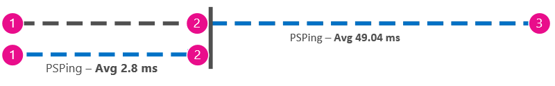

# Prestaties afstemmen van Office 365 met basislijnen en prestatie geschiedenisOffice 365 performance tuning using baselines and performance history

Er zijn enkele eenvoudige manieren om de prestaties van de verbinding tussen Office 365 en uw bedrijf te controleren, zodat u een grove basislijn van uw verbinding kunt maken.There are some simple ways to check the connection performance between Office 365 and your business that will let you establish a rough baseline of your connectivity. Door de prestatie geschiedenis van de clientcomputer verbindingen op te lossen, kunt u de meest opkomende problemen vroegtijdig detecteren, identificeren en voorspellen.Knowing the performance history of your client computer connections can help you detect emerging issues early, identify, and predict problems.
  
Dit artikel is bedoeld om u te helpen bij het maken van een aantal veelgestelde vragen, zoals hoe u weet dat het probleem niet is opgelost en geen Office 365-service-incident is.If you're not used to working on performance issues, this article is designed to help you consider some common questions, like How do you know the problem you're seeing is a performance issue and not an Office 365 service incident? Hoe kunt u de prestaties van een goede periode plannen?How can you plan for good performance, long term? Hoe zorgt u ervoor dat u de prestaties kunt verbeteren?How can you keep an eye on performance? Als uw team of clients trage prestaties zien wanneer u Office 365 gebruikt en u zich afvraagt over een van deze vragen, lees dan verder.If your team or clients are seeing slow performance while using Office 365, and you wonder about any of these questions, read on.
  
> [!IMPORTANT]
> **Hebt u nu een prestatieprobleem tussen de client en Office 365?****Have a performance issue between your client and Office 365 right now?** Voer de stappen uit die worden beschreven in het [prestatieprobleem oplossen van Office 365](performance-troubleshooting-plan.md).Follow the steps outlined in the [Performance troubleshooting plan for Office 365](performance-troubleshooting-plan.md). 
    
## Wat u moet weten over de prestaties van Office 365Something you should know about Office 365 performance

Office 365 valt binnen een gespecialiseerde, gespecialiseerde, gespecialiseerde Microsoft-netwerken die niet alleen op basis van automatisering worden gecontroleerd, maar ook door echte personen.Office 365 lives inside a high-capacity, dedicated Microsoft network that is steadily monitored not just by automation, but by real people. Deel van de rol van het behoud van de Office 365-wolk maakt het optimaliseren van de prestaties en het stroomlijnen.Part of the role of maintaining the Office 365 cloud is building-in performance tuning and streamlining where it's possible. Aangezien clients van de cloud van Office 365 verbinding willen hebben via internet, is er een voortdurende inspanningen om de prestaties van Office 365-services te verfijnen.Since clients of the Office 365 cloud have to connect across the Internet, there is a continuous effort to fine-tune the performance across Office 365 services too. Prestatieverbeteringen worden nooit langer in de Cloud beëindigd en er is een heleboel geaccumuleerde ervaring met het behoud van de cloud in orde en snel.Performance improvements never really stop in the cloud, and there is a lot of accumulated experience with keeping the cloud healthy and quick. Als u problemen ondervindt bij het maken van de verbinding vanaf uw locatie met Office 365, kunt u het beste beginnen met een ondersteuningsaanvraag.Should you experience a performance issue connecting from your location to Office 365, it's best not to start with, and wait on, a Support case. In plaats daarvan dient u eerst te beginnen met het onderzoek van het probleem.Instead, you should begin investigating the problem from 'the inside out'. U kunt dus in uw netwerk beginnen en verder werken naar Office 365.That is, start inside of your network, and work your way out to Office 365. Voordat u een zaak opent met ondersteuning voor Office 365, kunt u gegevens verzamelen en acties ondernemen waarmee u het probleem kunt verhelpen.Before you open a case with Office 365 Support, you can gather data and take actions that will explore, and may resolve, your problem.
  
> [!IMPORTANT]
> Let op de capaciteitsplanning en limieten in Office 365.Be aware of capacity planning and limits in Office 365. Deze informatie zet u vóór de bocht wanneer u probeert een prestatieprobleem op te lossen.That information will put you ahead of the curve when trying to resolve a performance issue. Hier ziet u een koppeling naar de beschrijvingen van de [Services van Microsoft 365 en Office 365](https://docs.microsoft.com/office365/servicedescriptions/office-365-service-descriptions-technet-library).Here's a link to the [Microsoft 365 and Office 365 service descriptions](https://docs.microsoft.com/office365/servicedescriptions/office-365-service-descriptions-technet-library). Dit is een spil hub en alle services die worden aangeboden door Office 365 hebben een koppeling die van hieruit overgaat op hun eigen service beschrijvingen.This is a central hub, and all the services offered by Office 365 have a link that goes to their own Service Descriptions from here. Dat betekent dat u de standaardlimieten voor SharePoint Online moet zien, bijvoorbeeld door te klikken op [Beschrijving van SharePoint Online service](https://technet.microsoft.com/library/sharepoint-online-service-description.aspx) en de [sectie limieten voor SharePoint Online](https://go.microsoft.com/fwlink/p/?LinkID=856113)te zoeken.That means, should you need to see the standard limits for SharePoint Online, for example, you would click [SharePoint Online Service Description](https://technet.microsoft.com/library/sharepoint-online-service-description.aspx) and locate its [SharePoint Online Limits section](https://go.microsoft.com/fwlink/p/?LinkID=856113). 
  
Zorg ervoor dat u de problemen oplost met de werking van de schuif schaal, het maakt niet uit een ideaal bedrag te bezorgen en de handmatig te onderhouden (als u van mening bent dat dit geen gevolgen heeft voor een groot aantal gebruikers of als grote gegevens migraties zeer lang zijn), dan moet u ervoor zorgen dat u de prestatie beïnvloedt.Make sure you go into your troubleshooting with the understanding that performance is a sliding scale, it's not about achieving an idealized value and maintaining it permanently (if you believe this is so, then occasional high-bandwidth tasks like on-boarding a large number of users, or doing large data migrations will be very stressful -- so do plan for performance impacts then). En wel, en wel, een goede indruk te hebben van de prestatiedoelstellingen, maar een groot aantal variabelen voor de prestaties is dus verschillend.You can, and should, have a rough idea of your performance targets, but a lot of variables play into performance, therefore, performance varies. Dat is de aard van de prestaties.That's the nature of performance. 
  
Problemen bij het oplossen van problemen is niet te weten over het bereiken van specifieke doelstellingen en het bijhouden van deze nummers, het verbeteren van bestaande activiteiten, gegeven aan alle variabelen.Performance troubleshooting isn't about meeting specific goals and maintaining those numbers indefinitely, it's about improving existing activities, given all the variables. 
  
## Hoe ziet een prestatieprobleem eruit?Okay, what does a performance problem look like?

U dient eerst te controleren of het probleem een prestatieprobleem is en niet een service-incident.First, you need to make sure that what you are experiencing is indeed a performance issue and not a service incident. Een prestatieprobleem is niet hetzelfde als een service-incident in Office 365.A performance problem is different from a service incident in Office 365. U kunt deze als volgt opzeggen.Here's how to tell them apart.
  
Als de Office 365-serviceproblemen ondervindt, is dit een service-incident.If the Office 365 service is having issues, that's a service incident. U ziet de rode of gele pictogrammen onder **huidige status** in het microsoft 365-Beheercentrum, maar u kunt ook vertragingen in de prestaties van clientcomputers die verbinding maken met Office 365.You will see red or yellow icons under **Current health** in the Microsoft 365 admin center, you may also notice slow performance on client computers connecting to Office 365. Als u bijvoorbeeld de statusrapporten van de huidige status meldt en u **onderzoek** uitziet naast Exchange, kunt u vervolgens ook een aantal oproepen ontvangen van personen in uw organisatie die voorkomen dat Exchange Online met Exchange Online werken.For example, if Current health reports a red icon and you see **Investigating** beside Exchange, you might then also receive a bunch of calls from people in your organization who complain that client mailboxes that use Exchange Online are performing badly. In dat geval is het redelijk om te voorkomen dat de prestaties van Exchange Online het slachtoffer van problemen binnen de service werden.In that case, it's reasonable to assume that your Exchange Online performance just became a victim of issues within the Service. 
  

  
Op dit moment moet u, de Office 365-beheerder, de **huidige status** controleren en vervolgens **Details en geschiedenis**, vaak raadplegen om het onderhoud van de werkstroom te behouden.At this point, you, the Office 365 admin, should check **Current health** and then **View details and history**, frequently, to keep up to date on maintenance we perform on the system. De **huidige status** dashboard werd gemaakt voor het bijwerken van de wijzigingen in en problemen in de service.The **Current health** dashboard was made to update you about changes to, and problems in, the service. De opmerkingen en uitleg die zijn geschreven naar de status geschiedenis, beheerder aan beheerder, zijn er om u te helpen uw gevolgen te meten en te zorgen dat u over lopend werk blijft.The notes and explanations written to health history, admin to admin, are there to help you gauge your impact, and to keep you posted about ongoing work. 
  

  
Een prestatieprobleem is geen service-incident, zelfs niet als incidenten de prestaties kunnen veroorzaken.A performance issue isn't a service incident, even though incidents can cause slow performance. Een prestatieprobleem ziet er als volgt uit:A performance issue looks like this:
  
- Een prestatieprobleem treedt op, ongeacht wat de **huidige status** van het Beheercentrum voor de service is.A performance issue occurs no matter what the admin center **Current health** is reporting for the service. 
    
-  Functies die eerder relatief naadloos werden gebruikt, duren nu erg lang en worden niet uitgevoerd.A behavior that used to be relatively seamless takes a long time to complete or never completes. 
    
- Als u de juiste reeks stappen uitvoert, kunt u het probleem ook repliceren of, ten minste.You can replicate the problem too, or, at least, you know it will happen if you do the right series of steps.
    
-  Als het probleem zich blijft voordoen, wordt er nog steeds een patroon weergegeven, bijvoorbeeld: u weet dat er in 10:00 is dat u gesprekken voert van gebruikers die geen betrouwbare toegang hebben tot Office 365 en dat de oproepen niet langer dan 12:00 worden.If the problem is intermittent, there is still a pattern, for example, you know that by 10:00 AM you will have calls from users who can't reliably access Office 365, and that the calls will die down around noon. 
    
Dit klinkt waarschijnlijk bekend; misschien bekend.This probably sounds familiar; maybe too familiar. Wanneer u weet dat het een prestatieprobleem is, wordt de vraag ' wat doet u verder? ' weergegeven?Once you know it's a performance problem, the question becomes, "What do you do next?" De rest van dit artikel helpt u exact te bepalen.The rest of this article helps you determine exactly that.
  
## Hoe definieert en test u een prestatieprobleem?How to define and test the performance problem

De prestaties zijn vaak te vaak achter de tijd, zodat u het feitelijke probleem moeilijk kunt definiëren.Performance issues often emerge over time, so it can be challenging to define the actual problem. U moet een goed overzicht van de problemen en een goed idee van de probleem context maken en dan moet u de stappen voor het uitvoeren van tests herhalen om de dag te winnen.You need to create a good problem statement and a good idea of issue context, and then you need to repeatable testing steps to win the day. Anders, vanwege geen storing van uw eigen, gaat u mogelijk verloren.Otherwise, through no fault of your own, you may be lost. Waarom?Why? Hier volgen enkele voorbeelden van probleem verklaringen die niet voldoende informatie leveren:Well, here are some examples of problems statements that don't provide enough information:
  
- Overstappen van mijn postvak in op mijn agenda werd gebruikt om iets te doen dat ik niet heb opgemerkt, en het is nu een koffie-einde.Switching from my Inbox to my Calendar used to be something I didn't notice, and now it's a coffee-break. Kunt u ervoor zorgen dat de toepassing op de gebruikte manier functioneert?Can you make it act like it used to?
    
- Het uploaden van mijn bestanden naar SharePoint Online duurt altijd.Uploading my files to SharePoint Online is taking forever. Waarom is de middag traag, maar nog steeds snel?Why is it slow in the afternoon, but any other time, it's fast? Is het niet zo snel?Can't it just be fast?
    
De hierboven genoemde probleem verklaringen vormen diverse grote uitdagingen.There are several large challenges posed by the problem statements above. Met name is er een groot aantal ambiguïteiten waarop u kunt handelen.Specifically, there are a lot of ambiguities to deal with. voorbeeld:for example:
  
- Het is niet duidelijk hoe het schakelen tussen het postvak in en de agenda die wordt gebruikt om op de laptop te reageren.It's unclear how switching between Inbox and Calendar used to act on the laptop.
    
- Als de gebruiker zegt: "kan het niet snel snel zijn", wat is dan "snel"?When the user says, "Can't it just be fast", what's "fast"?
    
- Hoe lang is ' permanent '?How long is "forever"? Is er enkele seconden of minuten, of kan de gebruiker tien minuten nadat de gebruiker weer is geworden, voltooien.Is that several seconds, or minutes, or could the user go to lunch and it would finish up ten minutes after the user got back?
    
Dit houdt in dat de beheerder en de probleemoplosser niet op de hoogte zijn van een groot aantal informatie van probleem overzichten zoals deze.All of this is without considering that the admin and troubleshooter can't be aware of many details from problem statements like these. Als het probleem zich bijvoorbeeld voordoet, Of de gebruiker werkt vanaf thuis en ziet maar ooit overstappen op een thuisnetwerk. De gebruiker moet meerdere andere geheugenintensieve toepassingen op de lokale client uitvoeren, of de gebruiker voert een ouder besturingssysteem uit of geen recente updates uit.For example, when the problem started happening; That the user works from home and only ever sees slow switching while on a home network; That the user must run several other RAM intensive applications on the local client, or the user is running an older operating system or hasn't run recent updates.
  
Wanneer gebruikers een prestatieprobleem rapporteren, zijn er veel gegevens om te verzamelen.When users report a performance problem, there's a lot of information to collect. Het verzamelen van deze gegevens maakt deel uit van het proces dat de naam van het probleem aanroept of het onderzoek doet.Collecting this information is part of a process called scoping the issue, or investigating it. Hieronder ziet u een eenvoudige lijst met scopes die u kunt gebruiken om informatie te verzamelen over uw prestatieprobleem.The following is a basic scoping list you can use to collect information about your performance issue. Deze lijst is niet volledig, maar het is een plek waar u een van uw eigen kunt beginnen:This list is not exhaustive, but it's a place to start one of your own: 
  
- Op welke datum is het probleem opgetreden en op welk tijdstip van de dag of 's nachts?On what date did the issue happen, and around what time of day or night?
    
- Welk type clientcomputer gebruikt u en hoe maakt u verbinding met het bedrijfsnetwerk (VPN, bedraad, draadloos)?What kind of client computer were you using, and how does it connect to the business network (VPN, Wired, Wireless)?
    
- Werkte u op afstand of was u op kantoor?Were you working remotely or were you in the office?
    
- Hebt u dezelfde acties op een andere computer uitgevoerd en hetzelfde gedrag weergegeven?Did you try the same actions on another computer and see the same behavior?
    
- Doorloop de stappen die de problemen veroorzaken, zodat u de ingevoerde acties kunt schrijven.Walk through the steps that are giving you the trouble so that you can write the actions you take down.
    
- Hoe lang duurt de vertraging (in seconden of minuten)?How slow in seconds or minutes is the performance?
    
- Waar ter wereld bevindt u zich?Where in the world are you located?
    
Sommige vragen zijn duidelijker dan andere vragen.Some of these questions are more obvious than others. De meeste iedereen begrijpt inzicht in de juiste stappen om het probleem te reproduceren.Most everyone will understand a troubleshooter needs the exact steps to reproduce the issue. Vervolgens kunt u nog meer op de gewenste manier vastleggen wat er mis is en hoe u nog meer kunt testen of het probleem is opgelost?After all, how else can you record what's wrong, and how else can you test if the issue is fixed? Minder duidelijk: wat voor datum en tijd hebt u het probleem zien? "en" waar ter wereld u zich bevindt? ", informatie die u overal kunt gebruiken.Less obvious are things like "What date and time did you see the issue?", and "Where in the world are you located?", information that can be used in tandem. Afhankelijk van het moment dat de gebruiker werkte, kan het onderhoud een paar uur lang duren voordelen van het netwerk van uw bedrijf.Depending on when the user was working, a few hours of time difference may mean maintenance is already underway on parts of your company's network. Als uw bedrijf bijvoorbeeld een hybride implementatie heeft, zoals een hybride SharePoint-zoektoepassing waarmee zoekindexen kunnen worden gezocht in zowel SharePoint Online als een on-premises SharePoint Server-exemplaar van 2013, zijn er mogelijk updates beschikbaar in de on-premises farm.If, for example, your company has a hybrid implementation, like a hybrid SharePoint Search, which can query search indexes in both SharePoint Online and an On-premises SharePoint Server 2013 instance, updates may be underway in the on-premises farm. Als uw bedrijf in de Cloud staat, kan systeemonderhoud gebruikmaken van netwerkhardware, het implementeren van updates die in het hele bedrijf zijn, of het aanbrengen van wijzigingen in DNS of andere basisinfrastructuur.If your company is all in the cloud, system maintenance may include adding or removing network hardware, rolling out updates that are company-wide, or making changes to DNS, or other core infrastructure.
  
Als u problemen ondervindt bij het oplossen van problemen, moet u een goede en observant om de conclusies van het bewijs te tekenen.When you're troubleshooting a performance problem, it's a bit like a crime scene, you need to be precise and observant to draw any conclusions from the evidence. U kunt dit alleen doen als u een goed overzicht van de problemen met het verzamelen van bewijsmateriaal ontvangt.In order to do this, you must get a good problem statement by gathering evidence. De computer context moet de context van de computer bevatten, de context van de gebruiker, wanneer het probleem is begonnen, en de exacte stappen die het prestatieprobleem hebben veroorzaakt.It should include the computer's context, the user's context, when the problem began, and the exact steps that exposed the performance issue. Dit probleem kan worden opgelost en de bovenste pagina in uw notities bewaard blijft.This problem statement should be, and stay, the topmost page in your notes. Door de foutmelding weer te geven nadat u aan de oplossing hebt gewerkt, voert u de stappen uit die u moet uitvoeren om te controleren of de acties die u uitvoert het probleem hebben opgelost.By walking through the problem statement again after you work on the resolution, you are taking the steps to test and prove whether the actions you take have resolved the issue. Dit is belangrijk om te weten wanneer uw werk, daar, klaar is.This is critical to knowing when your work, there, is done.
  
## Weet u wat de prestaties waren wanneer een goede werking werd gekeken?Do you know how performance used to look when it was good?

Als u unlucky hebt, weet niemand.If you're unlucky, nobody knows. Niemand heeft getallen.Nobody had numbers. Dat betekent dat niemand de eenvoudige vraag kan beantwoorden, wat het kost om een postvak in Office 365 in Office? ' of ' hoe lang het duurt voordat de leidinggevenden een Lync online-vergadering hadden? ', wat een veelvoorkomend scenario is voor veel bedrijven.That means nobody can answer the simple question "About how many seconds did it used to take to bring up an Inbox in Office 365?", or "How long did it used to take when the Executives had a Lync Online meeting?", which is a common scenario for many companies.
  
Wat hier ontbreekt is een basislijn voor prestaties.What's missing here is a performance baseline.
  
Met basislijnen beschikt u over een context voor uw prestaties.Baselines give you a context for your performance. Afhankelijk van de behoeften van uw bedrijf moet u de basislijn regelmatig instellen.You should take a baseline occasionally to frequently, depending on the needs of your company. Als u een groter bedrijf bent, kunnen uw activiteiten team al basislijnen maken voor uw on-premises omgeving.If you are a larger company, your Operations team may take baselines for your on-premises environment already. Als u bijvoorbeeld alle Exchange-servers op de eerste maandag van de maand, en al uw SharePoint-servers op de derde maandag bijwerkt, bevat uw activiteiten team waarschijnlijk een lijst met taken en scenario's waarin de post-patch wordt uitgevoerd om te bewijzen dat de kritieke functies operationeel zijn.For example, if you patch all the Exchange servers on the first Monday of the month, and all your SharePoint servers on the third Monday, your Operations team probably has a list of tasks and scenarios it runs post-patching, to prove that critical functions are operational. U kunt bijvoorbeeld het postvak in openen, op verzenden/ontvangen klikken en ervoor zorgen dat de mappen worden bijgewerkt, of, in SharePoint, doorbladeren op de hoofdpagina van de site, naar de pagina Enterprise Search gaan en een zoekopdracht uitvoeren om resultaten te retourneren.For example, opening the Inbox, clicking Send/Receive, and making sure the folders update, or, in SharePoint, browsing the main page of the site, going into the enterprise Search page, and doing a search that returns results.
  
Als uw toepassingen deel uitmaken van Office 365, kunt u een aantal van de belangrijkste basislijnen voor het meten van de tijd (in milliseconden) van de clientcomputer in uw netwerk, een uitgangspunt of het punt waar u het netwerk verlaten en naar Office 365 gaan.If your applications are in Office 365, some of the most fundamental baselines you can take measure the time (in milliseconds) from a client computer inside your network, to an egress point, or the point where you leave your network and go out to Office 365. Hier volgen een aantal handige basislijnen die u kunt onderzoeken en opnemen:Here are some helpful baselines that you can investigate and record:
  
- Identificeer de apparaten tussen de clientcomputer en het uitgangspunt, bijvoorbeeld uw proxyserver.Identify the devices between your client computer and your egress point, for example, your proxy server.
    
  - U moet uw apparaten kennen, zodat u een context hebt (IP-adressen, type apparaat, et enzovoort tot) voor de prestatieproblemen die zich voordoen.You need to know your devices so that you have context (IP addresses, type of device, et cetera) for performance problems that arise.
    
  - Proxy servers zijn algemene uitgangspunten, dus kijk in uw browser welke proxyserver er is ingesteld om te worden gebruikt, indien van toepassing.Proxy servers are common egress points, so you can check your web browser to see what proxy server it is set to use, if any.
    
  - Er bestaan hulpprogramma's van derden waarmee u uw netwerk kunt vaststellen en in kaart brengen, maar u kunt het beste vragen aan een lid van uw netwerkteam.There are third party tools that can discover and map your network, but the safest way to know your devices is to ask a member of your network team.
    
- Neem contact op met uw internetprovider (ISP), noteer de contactgegevens en vraag hoeveel circuits hoeveel bandbreedte u hebt.Identify your Internet service provider (ISP), write down their contact information, and ask how many circuits how much bandwidth you have.
    
- Identificeer binnen uw bedrijf de resources tussen de client en het uitgangspunt, of zoek een contactpersoon voor noodgevallen met wie u over netwerkproblemen kunt praten.Inside your company, identify resources for the devices between your client and the egress point, or identify an emergency contact to talk to about networking issues.
    
Hier volgen enkele basislijnen die eenvoudig testen met hulpprogramma's voor u kunnen worden berekend:Here are some baselines that simple testing with tools can calculate for you:
  
- Tijd van de clientcomputer naar uw uitgangspunt (in milliseconden)Time from your client computer to your egress point in milliseconds
    
- Tijd van uw uitgangspunt naar Office 365 in millisecondenTime from your egress point to Office 365 in milliseconds
    
- Locatie in de wereld van de server die de URL'S voor Office 365 oplost wanneer u bladertLocation in the world of the server that resolves the URLS for Office 365 when you browse
    
- De snelheid van de DNS-resolutie van uw INTERNETPROVIDER in milliseconden, inconsistentie van pakket ontvangst (netwerk-jitter), uploaden en downloaden van millisecondenThe speed of your ISP's DNS resolution in milliseconds, inconsistencies in packet arrival (network jitter), upload and download times in milliseconds
    
Als u niet weet hoe u deze stappen moet uitvoeren, gaat u naar meer informatie in dit artikel.If you're unfamiliar with how to carry out these steps, we'll go into more detail in this article. 
  
## Wat is een basislijn?What is a baseline?

U weet wat de gevolgen zijn wanneer het slecht is, maar als u de historische prestatiegegevens niet weet, is het niet mogelijk om een context te hebben voor de manier waarop de fout is opgegroeid en wanneer.You'll know the impact when it goes bad, but if you don't know your historical performance data, it's not possible to have a context for how bad it may have become, and when. Dus als u geen basislijn hebt, mist u de belangrijkste aanwijzingen om de puzzel op te lossen: de afbeelding in het vak puzzel.So without a baseline, you're missing the key clue to solve the puzzle: the picture on the puzzle box. Voor het oplossen van prestaties hebt u een  *vergelijkings*  punt nodig.In performance troubleshooting, you need a point of  *comparison*  . Eenvoudige basislijnen voor de prestaties zijn niet moeilijk te ondernemen.Simple performance baselines aren't difficult to take. U kunt een operationeel team met een planning maken.Your Operations team can be tasked with carrying these out on a schedule. Stel dat uw verbinding er bijvoorbeeld zo uitziet:For example, let's say your connection looks like this: 
  

  
Dat betekent dat u bij uw netwerkteam hebt gekeken en dat u uw bedrijf voor het Internet verlaat via een proxyserver, en dat de proxy zorgt voor alle verzoeken waarop de clientcomputer naar de Cloud wordt verzonden.That means you've checked with your network team and found out that you leave your company for the Internet through a proxy server, and that proxy handles all the requests your client computer sends to the cloud. In dit geval moet u een vereenvoudigde versie van de verbinding tekenen met alle tussenliggende apparaten.In this case, you should draw a simplified version of your connection that lists all the intervening devices. Voeg nu hulpmiddelen voor invoegen die u kunt gebruiken om de prestaties van de client te testen, het uitgangspunt (waar u het netwerk voor Internet gebruikt) en de Office 365-wolk.Now, insert tools that you can use to test the performance between the client, the egress point (where you leave your network for the Internet), and the Office 365 cloud.
  

  
De opties zijn **eenvoudig** en **Geavanceerd** , vanwege de hoeveelheid expertise die u nodig hebt om de prestatiegegevens te vinden.The options are listed as **Simple** and **Advanced** because of the amount of expertise you need in order to find the performance data. Een netwerktracering kan veel tijd in beslag nemen, vergeleken met actieve opdrachtregelprogramma's, zoals PsPing en TraceTCP.A network trace will take a lot of time, compared to running command-line tools like PsPing and TraceTCP. Deze twee opdrachtregelprogramma's zijn gekozen omdat ze geen ICMP-pakketten gebruiken, die worden geblokkeerd door Office 365 en omdat ze de tijd in milliseconden aangeven dat het duurt voordat de clientcomputer of proxyserver overblijft (als u toegang hebt) en arriveert bij Office 365.These two command-line tools were chosen because they don't use ICMP packets, which will be blocked by Office 365, and because they give the time in milliseconds that it takes to leave the client computer, or proxy server (if you have access) and arrive at Office 365. Elke afzonderlijke hop van de ene computer naar een andere, eindigt met een tijdwaarde en dat is uitstekend voor basislijnen.Each individual hop from one computer to another will end up with a time value, and that's great for baselines! Op deze manier kunt u op deze manier een poortnummer toevoegen aan de opdracht door in Office 365 via poort 443 door Office te communiceren, dat wil zeggen de gebruikte poort van Secure Sockets Layer en Transport Layer Security (SSL en TLS).Just as importantly, these command-line tools allow you to add a port number onto the command, this is useful because Office 365 communicates over port 443, which is the port used by Secure Sockets Layer and Transport Layer Security (SSL and TLS). Andere hulpprogramma's van derden kunnen echter betere oplossingen zijn voor uw situatie.However, other third-party tools may be better solutions for your situation. Microsoft biedt geen ondersteuning voor al deze hulpmiddelen, dus als u om wat voor reden dan ook geen PsPing-en TraceTCP-werk kunt doen, gaat u naar een netwerktracering met een programma zoals Netmon.Microsoft doesn't support all of these tools, so if, for some reason, you can't get PsPing and TraceTCP working, move on to a network trace with a tool like Netmon. 
  
U kunt een basislijn vóór kantooruren, opnieuw tijdens een intensief gebruik, en daarna weer na uur weer doen.You can take a baseline before business hours, again during heavy use, and then again after hours. Dat betekent dat u mogelijk een mapstructuur ziet die er ongeveer zo uitziet als die in het einde:This means you may have a folder structure that looks a bit like this in the end:
  

  
U dient ook een naamconventie te kiezen voor uw bestanden.You should also pick a naming convention your files. Dit zijn enkele voorbeelden:Here are some examples:
  
- Feb_09_2015_9amPST_PerfBaseline_Netmon_ClientToEgress_NormalFeb_09_2015_9amPST_PerfBaseline_Netmon_ClientToEgress_Normal
    
- Jan_10_2015_3pmCST_PerfBaseline_PsPing_ClientToO365_bypassProxy_SLOWJan_10_2015_3pmCST_PerfBaseline_PsPing_ClientToO365_bypassProxy_SLOW
    
- Feb_08_2015_2pmEST_PerfBaseline_BADPerfFeb_08_2015_2pmEST_PerfBaseline_BADPerf
    
- Feb_08_2015_8-30amEST_PerfBaseline_GoodPerfFeb_08_2015_8-30amEST_PerfBaseline_GoodPerf
    
U kunt dit op tal van verschillende manieren doen, maar het gebruik van de notatie **\<dateTime\>\<what's happening in the test\>** is een goede plek om te beginnen.There are lots of different ways to do this, but using the format **\<dateTime\>\<what's happening in the test\>** is a good place to start. Dit helpt een heleboel wanneer u later problemen probeert op te lossen.Being diligent about this will help a lot when you are trying to troubleshoot issues later. Later kunt u zeggen dat ik twee sporen heb gemaakt op 8 februari, één vertoont een goede prestaties en een vertoonde fout, zodat we ze kunnen vergelijken.Later, you'll be able to say "I took two traces on February 8th, one showed good performance and one showed bad, so we can compare them". Dit is een zeer handige oplossing voor het oplossen van problemen.This is extremely helpful for troubleshooting. 
  
U moet een georganiseerde manier hebben om uw historische basislijnen te behouden.You need to have an organized way to keep your historical baselines. In dit voorbeeld zijn de eenvoudige methoden met drie opdrachtregels-uitvoer en de resultaten als schermafbeeldingen verzameld, maar mogelijk hebt u in plaats daarvan een netwerk opnamebestanden gemaakt.In this example, the simple methods produced three command line outputs and the results were collected as screen shots, but you may have network capture files instead. Gebruik de methode die het meest geschikt is voor u.Use the method that works best for you. Sla uw historische basislijnen op en vermeld ze op punten waar u de wijzigingen aanbrengt in de werking van Online Services.Store your historical baselines and refer to them at points where you notice changes in the behavior of online services. 
  
## Waarom zou u prestatiegegevens verzamelen tijdens een testfase?Why collect performance data during a pilot?

U kunt geen basislijnen meer maken dan tijdens een pilot van de Office 365-service.There is no better time to start making baselines than during a pilot of the Office 365 service. Uw Office kan duizenden gebruikers, honderden duizenden gebruikers of vijf, maar zelfs met een klein aantal gebruikers, kunt u testen uitvoeren om fluctuaties in prestaties te meten.Your office may have thousands of users, hundreds of thousands, or it may have five, but even with a small number of users, you can perform tests to measure fluctuations in performance. In het geval van een groot bedrijf kan een representatieve steekproef van verschillende honderd gebruikers die Office 365 testen, naar buiten geprojecteerd worden, zodat u weet waar de problemen zich voordoen.In the case of a large company, a representative sample of several hundred users piloting Office 365 can be projected outward to several thousands so you know where issues might arise before they happen.
  
In het geval van een klein bedrijf waarbij aan boord wordt aangegeven dat alle gebruikers tegelijk naar de service gaan en dat er geen pilot is, behoud de prestatie maatregelen zodat u de gegevens kunt weergeven aan iedereen die mogelijk problemen heeft met een verkeerd uitvoeren van de werkstroom.In the case of a small company, where on-boarding means that all users go to the service at the same time and there is no pilot, keep performance measures so that you have data to show to anyone who may have to troubleshoot a badly performing operation. Als u bijvoorbeeld merkt dat u het gebouw in de loop van de tijd kunt omlopen wanneer het gaat om een middelgrote afbeelding te uploaden, zodat de afbeelding zeer snel verloopt.For example, if you notice that all of a sudden you can walk around your building in the time it takes to upload a medium-sized graphic where it used to happen very quickly.
  
## Basislijnen verzamelenHow to collect baselines

Voor alle plannen voor het oplossen van problemen moet u het volgende doen:For all troubleshooting plans you need to identify these things at a minimum:
  
- De clientcomputer die u gebruikt (het type computer of apparaat, een IP-adres en de acties die het probleem hebben veroorzaakt)The client computer you're using (the type of computer or device, an IP address, and the actions that caused the issue)
    
- Waarbij de clientcomputer zich bevindt in de wereld (bijvoorbeeld of deze gebruiker met een VPN-verbinding op het netwerk, extern of via het bedrijfsintranet werkt)Where the client computer is located in the world (for example, whether this user on a VPN to the network, working remotely, or on the company intranet)
    
- Het uitgangspunt dat door de clientcomputer wordt gebruikt vanuit uw netwerk (het punt waarop verkeer uw bedrijf verlaat voor een INTERNETPROVIDER of Internet)The egress point the client computer uses from your network (the point at which traffic leaves your business for an ISP or the Internet)
    
 U kunt de indeling van uw netwerk achterhalen via de netwerkbeheerder.You can find out the layout of your network from the network administrator. Als u een klein netwerk gebruikt, kijk dan eens naar de apparaten die u verbindt met internet en neem contact op met uw INTERNETPROVIDER als u vragen hebt over de lay-out.If you're on a small network, take a look at the devices connecting you to the Internet, and call your ISP if you have questions about the layout. Maak een afbeelding van de uiteindelijke indeling voor uw verwijzing.Create a graphic of the final layout for your reference. 
  
Deze sectie is opgetreden in eenvoudige opdrachtregelprogramma's en-methoden, en meer geavanceerde extra opties.This section is broken into simple command-line tools and methods, and more advanced tools options. We bieden eerst eenvoudige methoden aan.We'll cover simple methods first. Als u nu een prestatieprobleem hebt, moet u op geavanceerde methoden overstappen en de voorbeelden van het gebruik van de programmeer kwaliteit oplossen.But if you've got a performance problem right now, you should jump to advanced methods and try out the sample performance-troubleshooting action plan.
  
### Eenvoudige methodenSimple methods

Het doel van deze eenvoudige methoden is om te leren hoe u eenvoudige onderhoudskosten in de loop van de tijd maakt, begrijpt en juist opslaat, zodat u op de hoogte wordt gesteld van de prestaties van Office 365.The objective of these simple methods is to learn to take, understand, and properly store simple performance baselines over time so that you are informed about Office 365 performance. Dit is een eenvoudig diagram voor eenvoudige functies, zoals u dit eerder hebt gezien:Here's the very simple diagram for simple, as you've seen before:
  

  
> [!NOTE]
> TraceTCP is opgenomen in deze schermafbeelding omdat dit een handig hulpmiddel is voor het weergeven van de hoeveelheid tijd die nodig is voor het verwerken van een aanvraag en hoeveel netwerk hops of verbindingen van de ene computer naar de volgende gaan, dat de aanvraag een bestemming bereikt.TraceTCP is included in this screen shot because it's a useful tool for showing, in milliseconds, how long a request takes to process, and how many network hops, or connections from one computer to the next, that the request takes to reach a destination. Met TraceTCP kunt u ook de namen opgeven van servers die worden gebruikt tijdens de hops en die handig kunnen zijn voor een probleem met Microsoft Office 365 in de ondersteuning.TraceTCP can also give the names of servers used during hops, which can be useful to a Microsoft Office 365 troubleshooter in Support. > TraceTCP-opdrachten kunnen heel eenvoudig zijn, bijvoorbeeld: >  `tracetcp.exe outlook.office365.com:443`> vergeet het poortnummer in de opdracht op te nemen.> TraceTCP commands can be very simple, such as: >  `tracetcp.exe outlook.office365.com:443`> Remember to include the port number in the command! > [TraceTCP](https://simulatedsimian.github.io/tracetcp_download.html) is gratis te downloaden, maar is afhankelijk van Wincap. > [TraceTCP](https://simulatedsimian.github.io/tracetcp_download.html) is a free download, but relies on Wincap. Wincap is een tool dat ook wordt gebruikt en geïnstalleerd door Netmon.Wincap is a tool that is also used and installed by Netmon. U kunt netmon ook gebruiken in de sectie Geavanceerde methoden.We also use Netmon in the advanced methods section. 
  
 Als u meerdere kantoren hebt, moet u ook op elk van deze locaties een set gegevens van een client bewaren.If you have multiple offices, you'll need to keep a set of data from a client in each of those locations as well. Met deze test wordt de latentie gemeten, wat in dit geval een waarde is die het aantal seconden aangeeft tussen een client die een aanvraag verzendt naar Office 365 en Office 365 op de aanvraag reageert.This test measures latency, which, in this case, is a number value that describes the amount of time between a client sending a request to Office 365, and Office 365 responding to the request. De test bevindt zich op een clientcomputer en ziet een afronding binnen uw netwerk, vanaf een uitgangspunt, via internet naar Office 365 en terug.The testing originates inside your domain on a client computer, and looks to measure a round trip from inside your network, out through an egress point, across the Internet to Office 365, and back. 
  
U kunt op een aantal manieren omgaan met het uitgangspunt, in dit geval de proxyserver.There are a few ways to deal with the egress point, in this case, the proxy server. U kunt een waarde opgeven van 1 naar 2 en vervolgens 2 tot 3, en de getallen in milliseconden optellen om het uiteindelijke totaal van de rand van het netwerk te bepalen.You can either trace from 1 to 2 and then 2 to 3, and then add the numbers in milliseconds to get a final total to the edge of your network. U kunt ook de verbinding configureren om de proxy voor Office 365-adressen over te slaan.Or, you can configure the connection to bypass the proxy for Office 365 addresses. In een groter netwerk met een firewall, omgekeerde proxy of een combinatie van beide, moet u mogelijk een uitzondering op de proxyserver maken waarmee verkeer wordt toegestaan voor veel Url's.In a larger network with a firewall, reverse proxy, or some combination of the two, you may need to make exceptions on the proxy server that will allow traffic to pass for a lot of URLs. Zie [url's en IP-](https://support.office.com/article/8548a211-3fe7-47cb-abb1-355ea5aa88a2)adresbereiken voor Office 365 voor de lijst met eindpunten die worden gebruikt door Office 365.For the list of endpoints used by Office 365, see [Office 365 URLs and IP address ranges](https://support.office.com/article/8548a211-3fe7-47cb-abb1-355ea5aa88a2). Als u een verificatie proxy hebt, moet u eerst uitzonderingen testen voor de volgende bewerkingen:If you have an authenticating proxy, begin by testing exceptions for the following:
  
- Poorten 80 en 443Ports 80 and 443
    
- TCP en HTTPsTCP and HTTPs
    
- Uitgaande verbindingen naar een van deze Url's:Connections that are outbound to any of these URLs:
    
- \*. microsoftonline.com\*.microsoftonline.com
    
- \*. microsoftonline-p.com\*.microsoftonline-p.com
    
- \*. sharepoint.com\*.sharepoint.com
    
- \*. outlook.com\*.outlook.com
    
- \*. lync.com\*.lync.com
    
- osub.microsoft.comosub.microsoft.com
    
Alle gebruikers moeten gemachtigd zijn om toegang te krijgen tot deze adressen, zonder proxy storing of verificatie.All users need to be allowed to get to these addresses without any proxy interference or authentication. In een kleiner netwerk moet u deze toevoegen aan de lijst met genegeerde proxy's in uw webbrowser.On a smaller network, you should add these to your proxy bypass list in your web browser. 
  
Als u deze wilt toevoegen aan de lijst met negeren van de proxy in Internet Explorer, gaat u naar **extra** \> **Internet opties** \> **verbindingen** \> **LAN-instellingen** \> **uitgebreid**.To add these to your proxy bypass list in Internet Explorer, go to **Tools** \> **Internet Options** \> **Connections** \> **LAN settings** \> **Advanced**. Op het tabblad Geavanceerd kunt u ook de poort van de proxyserver en de proxyserver vinden.The advanced tab is also where you will find your proxy server and proxy server port. Mogelijk moet u op het selectievakje klikken om **een proxyserver voor het LAN-netwerk te gebruiken voor**toegang tot de knop **Geavanceerd** .You may need to click the checkbox **Use a proxy server for your LAN**, to access the **Advanced** button. Zorg ervoor dat **proxyserver negeren voor lokale adressen** is ingeschakeld.You'll want to make sure that **Bypass proxy server for local addresses** is checked. Wanneer u op **Geavanceerd**klikt, ziet u een tekstvak waarin u uitzonderingen kunt invoeren.Once you click **Advanced**, you'll see a text box where you can enter exceptions. Scheid de Url's van de jokertekens met puntkomma's, bijvoorbeeld:Separate the wildcard URLs listed above with semi-colons, for example:
  
\*. microsoftonline.com; \*. SharePoint.com\*.microsoftonline.com; \*.sharepoint.com
  
Als u de proxy niet meer weet, moet u ping of PsPing rechtstreeks op een URL van Office 365.Once you bypass your proxy, you should be able to use ping or PsPing directly on an Office 365 URL. De volgende stap is het testen van de ping **Outlook.office365.com**.The next step will be to test ping **outlook.office365.com**. Als u gebruikmaakt van PsPing of een ander hulpmiddel waarmee u een poortnummer moet opgeven voor de opdracht, kunt PsPing tegen **Portal.microsoftonline.com:443** de gemiddelde retourtijd in milliseconden zien.Or, if you're using PsPing or another tool that will let you supply a port number to the command, PsPing against **portal.microsoftonline.com:443** to see the average round trip time in milliseconds. 
  
De retourtijd, of de RTT, is een waarde die bepalen hoe lang het duurt om een HTTP-aanvraag naar een server te verzenden, zoals outlook.office365.com, en het vragen van de server erkent.The round trip time, or RTT, is a number value that measures how long it takes to send a HTTP request to a server like outlook.office365.com and get a response back that acknowledges the server knows that you did it. U ziet soms dit afkort weergeven als RTT.You'll sometimes see this abbreviated as RTT. Dit moet een relatief kort tijdsduur zijn.This should be a relatively short amount of time.
  
U moet [PSPing](https://technet.microsoft.com/sysinternals/jj729731.aspx) of een ander hulpprogramma gebruiken die geen ICMP-pakketten gebruikt die worden geblokkeerd door Office 365, zodat u deze test kunt uitvoeren.You have to use [PSPing](https://technet.microsoft.com/sysinternals/jj729731.aspx) or another tool that does not use ICMP packets which are blocked by Office 365 in order to do this test. 
  
 **Het gebruik van PsPing rechtstreeks vanuit een Office 365-URL voor een algemene retourtijd in milliseconden****How to use PsPing to get an overall round trip time in milliseconds directly from an Office 365 URL**
  
1. Voer een opdrachtprompt met verhoogde bevoegdheid uit door deze stappen uit te voeren:Run an elevated command prompt by completing these steps:
    
1. Klik op **Start**.Click **Start**.
    
2. Typ cmd in het vak **zoekopdracht starten** en druk op CTRL + SHIFT + ENTER.In the **Start Search** box, type cmd, and then press CTRL+SHIFT+ENTER.
    
3. Als het dialoogvenster **Gebruikersaccountbeheer** wordt weergegeven, bevestigt u of de actie die wordt weergegeven, is wat u wilt en klikt u vervolgens op **Doorgaan**.If the **User Account Control** dialog box appears, confirm that the action it displays is what you want, and then click **Continue**.
    
2. Ga naar de map met het hulpprogramma (in dit geval PsPing) en test deze Office 365-Url's:Navigate to the folder where the tool (in this case PsPing) is installed and test these Office 365 URLs:
    
  - psping portal.office.com:443psping portal.office.com:443
    
  - psping microsoft-my.sharepoint.com:443psping microsoft-my.sharepoint.com:443
    
  - psping outlook.office365.com:443psping outlook.office365.com:443
    
  - psping www.yammer.com:443psping www.yammer.com:443
    
    
  
Zorg ervoor dat u het poortnummer van 443 opneemt.Be sure to include the port number of 443. Houd er rekening mee dat Office 365 werkt op een versleuteld kanaal.Remember that Office 365 works on an encrypted channel. Als u PsPing zonder poortnummer, mislukt uw aanvraag.If you PsPing without the port number, your request will fail. Als u de kortste lijst hebt gepingt, kijkt u naar de gemiddelde tijd in milliseconden (MS).Once you've pinged your short list, look for the Average time in milliseconds (ms). Dat is wat u wilt opnemen.That is what you want to record!
  

  
Als u niet bekend bent met het negeren van de proxy en u wilt een stap voor stap volgen, moet u eerst de naam van uw proxyserver achterhalen.If you're not familiar with proxy bypass, and prefer to take things step-by-step, you need to first find out the name of your proxy server. Ga in Internet Explorer naar **extra** \> **Internet Options** \> **Connections** \> **LAN-instellingen voor LAN** -verbindingen \> **Advanced**.In Internet Explorer go to **Tools** \> **Internet Options** \> **Connections** \> **LAN settings** \> **Advanced**. Op het tabblad **Geavanceerd** kunt u de naam van uw proxyserver weergeven.The **Advanced** tab is where you will see your proxy server listed. Ping met behulp van de volgende taak met de opdrachtprompt:Ping that proxy server at a command prompt by completing this task: 
  
 **De proxyserver pingen en een waarde voor de retourwaarde in milliseconden voor fase 1 en 2 aanvragen****To ping the proxy server and get a round trip value in milliseconds for stage 1 to 2**
  
1. Voer een opdrachtprompt met verhoogde bevoegdheid uit door deze stappen uit te voeren:Run an elevated command prompt by completing these steps:
    
1. Klik op **Start**.Click **Start**.
    
2. Typ cmd in het vak **zoekopdracht starten** en druk op CTRL + SHIFT + ENTER.In the **Start Search** box, type cmd, and then press CTRL+SHIFT+ENTER.
    
3. Als het dialoogvenster **Gebruikersaccountbeheer** wordt weergegeven, bevestigt u of de actie die wordt weergegeven, is wat u wilt en klikt u vervolgens op **Doorgaan**.If the **User Account Control** dialog box appears, confirm that the action it displays is what you want, and then click **Continue**.
    
2. Typ ping \<the name of the proxy server your browser uses, or the IP address of the proxy server\> en druk vervolgens op ENTER.Type ping \<the name of the proxy server your browser uses, or the IP address of the proxy server\> and then press ENTER. Als u een PsPing of een ander hulpprogramma hebt geïnstalleerd, kunt u dat programma gebruiken in plaats hiervan.If you have PsPing, or some other tool, installed, you can choose to use that tool instead. 
    
    De opdracht kan er als een van deze voorbeelden uitzien:Your command may look like any of these examples: 
    
  - ping ourproxy.ourdomain.industry.business.comping ourproxy.ourdomain.industry.business.com
    
  - ping 155.55.121.55ping 155.55.121.55
    
  - ping onzeproxyping ourproxy
    
  - psping ourproxy.ourdomain.industry.business.com:80psping ourproxy.ourdomain.industry.business.com:80
    
  - psping 155.55.121.55:80psping 155.55.121.55:80
    
  - psping onzeproxy: 80psping ourproxy:80
    
3. Wanneer de tracering stopt met het verzenden van testpakketten, krijgt u een kleine samenvatting met een gemiddelde, in milliseconden, en dat is de waarde die u hebt.When the trace stops sending test packets, you'll get a small summary that lists an average, in milliseconds, and that's the value you're after. Neem een schermafbeelding van de prompt en sla deze op met de naamgevingsconventie.Take a screen shot of the prompt and save it using your naming convention. Op dit moment kan het ook handig zijn om het diagram in te vullen met de waarde.At this point it may also help to fill in the diagram with the value.
    
Misschien hebt u een tracering in de loop van de tijd genomen, en de client kan de proxy (of de server voor het opsporen van Internet) snel weer verlaten.Maybe you've taken a trace in the early morning, and your client can get to the proxy (or whatever egress server exits to the Internet) quickly. In dit geval kunnen uw nummers er als volgt uitzien:In this case, your numbers may look like this:
  

  
Als de clientcomputer een van de selectievakjes met toegang tot de proxy-of uitvoerende server is, kunt u de volgende arm van de test uitvoeren door een externe verbinding met die computer uit te voeren, waarna u de opdrachtprompt uitvoert om vanaf de computer te PsPing naar een URL van Office 365.If your client computer is one of the select few with access to the proxy (or egress) server, you can run the next leg of the test by remotely connecting to that computer, running the command prompt to PsPing to an Office 365 URL from there. Als u geen toegang hebt tot die computer, kunt u contact opnemen met uw netwerkbronnen voor hulp bij de volgende etappe en de getallen op die manier exact weergeven.If you don't have access to that computer, you can contact your network resources for help with the next leg and get exact numbers that way. Als dat niet mogelijk is, kunt u een PsPing voor de URL van Office 365 in kwestie en vergelijkt u deze met de PsPing of ping-tijd voor uw proxyserver.If that's not possible, take a PsPing against the Office 365 URL in question and compare it to the PsPing or Ping time against your proxy server. 
  
Als u bijvoorbeeld 51,84 milliseconden van de client hebt voor de URL van Office 365 en 2,8 u de milliseconden van de client hebt voor de proxy (of uitgangspunt), 49,04 hebt u de bewerkings punten van de 365 Office-app.For example, if you have 51.84 milliseconds from the client to the Office 365 URL, and you have 2.8 milliseconds from the client to the proxy (or egress point), then you have 49.04 milliseconds from the egress to Office 365. Ook als u een PsPing van 12,25 milliseconden van de client voor de proxy hebt en 62,01 milliseconden van de client naar de Office 365-URL, dan wordt uw gemiddelde waarde voor de proxy-uituitgang voor de Office 365-URL 49,76 milliseconden.Likewise, if you have a PsPing of 12.25 milliseconds from the client to the proxy during the height of the day, and 62.01 milliseconds from the client to the Office 365 URL, then your average value for the proxy egress to the Office 365 URL is 49.76 milliseconds.
  

  
Ter voorbereiding van het oplossen van problemen, is het mogelijk dat u iets interessant vindt.In terms of troubleshooting, you may find something interesting just from keeping these baselines. Als u bijvoorbeeld merkt dat u meestal over 40 tot 59 milliseconden van de latentie van de proxy of uitgangspunt naar de URL van Office 365 gaat, en een client de latentie van een client voor proxy of uitgangspunt willen hebben van 3 tot 7 milliseconden (afhankelijk van het aantal netwerkverkeer dat u tijdens de laatste tijd) ziet, want u weten dat iets mis is als de laatste drie client-naar-proxy-of uitgangs basislijnen een latentie van 45 milliseconds aangeven.For example, if you find that you generally have about 40 to 59 milliseconds of latency from the proxy or egress point to the Office 365 URL, and have a client to proxy or egress point latency of about 3 to 7 milliseconds (depending on the amount network traffic you're seeing during that time of day) then you will surely know something is problematic if your last three client to proxy or egress baselines show a latency of 45 milliseconds.
  
### Geavanceerde methodenAdvanced methods

Als u wilt weten wat er gebeurt met uw Internet verzoeken naar Office 365, moet u bekend zijn met de netwerk traceringen.If you really want to know what is happening with your Internet requests to Office 365, you need to become familiar with network traces. Het maakt niet uit welke hulpmiddelen u wilt gebruiken voor deze tracering, HTTPWatch, Netmon, Message Analyzer, wireshark, Fiddler, dashboard dashboard, of andere taken kunnen worden uitgevoerd, zolang dit hulpprogramma netwerkverkeer kan vastleggen en filteren.It does not matter which tools you prefer for these traces, HTTPWatch, Netmon, Message Analyzer, Wireshark, Fiddler, Developer Dashboard tool or any other will do as long as that tool can capture and filter network traffic. In deze sectie wordt het beste om meer dan een van deze hulpmiddelen uit te voeren voor een compleetere foto van het probleem.You'll see in this section that it's beneficial to run more than one of these tools to get a more complete picture of the problem. Wanneer u gaat testen, kunnen sommige van deze hulpmiddelen ook in eigen gevallen fungeren als proxy's.When you're testing, some of these tools also act as proxies in their own right. De hulpprogramma's die worden gebruikt in het Companion-artikel [prestatieproblemen met het oplossen van Office 365](performance-troubleshooting-plan.md), waaronder [Netmon 3,4](https://www.microsoft.com/download/details.aspx?id=4865), [HTTPWatch](https://www.httpwatch.com/download/)of [WireShark](https://www.wireshark.org/).Tools used in the companion article, [Performance troubleshooting plan for Office 365](performance-troubleshooting-plan.md), include [Netmon 3.4](https://www.microsoft.com/download/details.aspx?id=4865), [HTTPWatch](https://www.httpwatch.com/download/), or [WireShark](https://www.wireshark.org/).
  
Het maken van een prestatie lijn is de eenvoudige kant van deze methode en veel van de stappen zijn dezelfde als wanneer u een prestatieprobleem verhelpt.Taking a performance baseline is the simple part of this method, and many of the steps are the same as when you troubleshoot a performance issue. Voor de geavanceerdere methoden voor het maken van basislijnen moet u netwerk sporen maken en opslaan.The more advanced methods of creating baselines for performance requires you to take and store network traces. In de meeste van de voorbeelden in dit artikel wordt SharePoint Online gebruikt, maar u moet een lijst met veelgebruikte acties ontwikkelen op de Office 365-Services waarop u zich kunt abonneren op testen en opnemen.Most of the examples in this article use SharePoint Online, but you should develop a list of common actions across the Office 365 services to which you subscribe to test and record. Dit is een voorbeeld van basislijn:Here is a baseline example:
  
- Lijst met basislijnen voor SPO-\* \* stap 1: \* \* Blader naar de startpagina van de SPO-website en voer een netwerk spoor.Baseline list for SPO - \*\* Step 1: \*\* Browse the home page of the SPO website and do a network trace. Sla de tracering op.Save the trace. 
    
- Basislijn lijst voor SPO- **stap 2:** Zoek een term (zoals uw bedrijfsnaam) via Enterprise Search en voer een netwerktracering uit.Baseline list for SPO - **Step 2:** Search for a term (such as your company name) via Enterprise Search and do a network trace. Sla de tracering op.Save the trace. 
    
- Lijst met basislijnen voor SPO: **stap 3:** een groot bestand uploaden naar een SharePoint Online-documentbibliotheek en een netwerktracering uitvoeren.Baseline list for SPO - **Step 3:** Upload a large file to a SharePoint Online document library and do a network trace. Sla de tracering op.Save the trace. 
    
- Lijst met basislijnen voor SPO- **stap 4:** browsen op de startpagina van de OneDrive-website en voer een netwerk spoor.Baseline list for SPO - **Step 4:** Browse the home page of the OneDrive website and do a network trace. Sla de tracering op.Save the trace. 
    
Deze lijst bevat de belangrijkste veelvoorkomende acties die gebruikers uitvoeren op SharePoint Online.This list should include the most important common actions that users take against SharePoint Online. De laatste stap voor het aanwijzen van gaan naar OneDrive voor bedrijven, versies van de SharePoint Online-Startpagina (die vaak door bedrijven is aangepast) en de startpagina van OneDrive voor bedrijven, wat niet helemaal is aangepast.Notice that the last step, to trace going to OneDrive for Business, builds-in a comparison between the load of the SharePoint Online home page (which is often customized by companies) and OneDrive for Business home page, which is seldom customized. Dit is een zeer eenvoudige proef wanneer het gaat om een langzaamere laad site van SharePoint Online.This is a very basic test when it comes to a slow-loading SharePoint Online site. U kunt in uw tests een record maken van dit verschil.You can build a record of this difference into your testing.
  
Als u zich in het midden van een prestatieprobleem voordoet, zijn veel van de stappen hetzelfde als bij het maken van een basislijn.If you are in the middle of a performance problem, many of the steps are the same as when taking a baseline. Netwerktracering wordt kritiek geworden, dus we gaan *how* de belangrijkste punten ernaast gaan volgen.Network traces become critical, so we'll handle  *how*  to take the important traces next. 
  
Om een prestatieprobleem  *op te sporen, moet*  u op het moment van tracering een tracering ondernemen wanneer u de prestaties van het prestatieprobleem ondervindt.To tackle a performance problem,  *right now*  , you need to be taking a trace at the time you are experiencing the performance issue. U moet beschikken over de juiste hulpprogramma's voor het verzamelen van Logboeken, en u hebt een actieplan nodig, dat wil zeggen een lijst met stappen voor het oplossen van de beste informatie die u kunt nemen.You need to have the proper tools available to gather logs, and you need an action plan, that is, a list of troubleshooting actions to take to gather the best information that you can. Allereerst moet u de datum en tijd van de test vastleggen, zodat de bestanden kunnen worden opgeslagen in een map die de tijdsinstelling weerspiegelt.The first thing to do is record the date and time of the test so that the files can be saved in a folder that reflect the timing. Verfijn vervolgens de probleem stappen zelf.Next, narrow down to the problem steps themselves. Dit zijn de exacte stappen die u moet uitvoeren om te testen.These are the exact steps you will use for testing. De basisbeginselen voor het maken van de basisversie: als het probleem zich alleen met Outlook voordoet, moet u opnemen dat het gedrag van het probleem optreedt in slechts één Office 365-service.Don't forget the basics: if the issue is only with Outlook, make sure to record that the problem behavior happens in only one Office 365 service. Om het bereik van dit probleem te beperken, kunt u zich richten op iets wat u kunt oplossen.Narrowing down the scope of this issue will help you to focus on something you can resolve. 
  
## Zie ookSee also

[Office 365-eindpunten beherenManaging Office 365 endpoints](https://support.office.com/article/99cab9d4-ef59-4207-9f2b-3728eb46bf9a)

