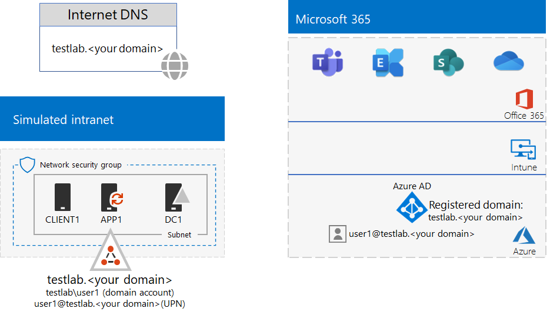

# <a name="identity-and-device-access-prerequisites-for-password-hash-synchronization-in-your-microsoft-365-test-environment"></a>Vereisten voor identiteits- en apparaattoegang voor wachtwoord-hash-synchronisatie in uw Microsoft 365-testomgeving.

*Deze testlaborator kan alleen worden gebruikt Microsoft 365 voor bedrijfstestomgevingen.*

[Configuraties voor identiteits-](../security/office-365-security/microsoft-365-policies-configurations.md) en apparaattoegang zijn een set configuraties en beleid voor voorwaardelijke toegang om de toegang tot alle services in Microsoft 365 voor ondernemingen die zijn geïntegreerd met Azure Active Directory (Azure AD) te beschermen.

In dit artikel wordt beschreven hoe u een Microsoft 365-testomgeving configureert die voldoet aan de vereisten van de hybride configuratie met wachtwoordhashsynchronisatievereisten voor identiteits- en apparaattoegang. [](../security/office-365-security/identity-access-prerequisites.md#prerequisites)

Er zijn tien fasen voor het instellen van deze testomgeving:

1. Een gesimuleerde onderneming maken met een testomgeving voor wachtwoord-hash-synchronisatie
2. Naadloze eenmalige Azure AD-aanmelding configureren
3. Benoemde locaties configureren
4. Wachtwoord terugschrijven configureren
5. Self-service voor wachtwoordherstel configureren voor alle gebruikersaccounts
6. Meervoudige verificatie configureren voor alle gebruikersaccounts
7. Automatische apparaatregistratie van domeingevoegde Windows inschakelen
8. Azure AD-wachtwoordbeveiliging configureren 
9. Azure AD Identity Protection inschakelen
10. Moderne verificatie inschakelen voor Exchange Online en Skype voor Bedrijven Online

## <a name="phase-1-build-out-your-simulated-enterprise-with-password-hash-sync-microsoft-365-test-environment"></a>Fase 1: Uw gesimuleerde onderneming uitbreiden met een Microsoft 365-testomgeving met wachtwoord-hash-synchronisatie

Volg de instructies in [de test labhandleiding voor wachtwoordhashsynchronisatie.](password-hash-sync-m365-ent-test-environment.md)
Dit is de resulterende configuratie.


 
## <a name="phase-2-configure-azure-ad-seamless-single-sign-on"></a>Fase 2: Naadloze eenmalige Azure AD-aanmelding configureren

Volg de instructies in [Fase 2 van testlabrichtlijn Naadloze eenmalige Azure AD-aanmelding](single-sign-on-m365-ent-test-environment.md#phase-2-configure-azure-ad-connect-on-app1-for-azure-ad-seamless-sso).

## <a name="phase-3-configure-named-locations"></a>Fase 3: Benoemde locaties configureren

Bepaal eerst de openbare IP-adressen of adresbereiken die worden gebruikt door uw organisatie.

Volg daarna de instructies in [Benoemde locaties configureren in Azure Active Directory](/azure/active-directory/reports-monitoring/quickstart-configure-named-locations) om de adressen of adresbereiken als benoemde locaties toe te voegen. 

## <a name="phase-4-configure-password-writeback"></a>Fase 4: Wachtwoord terugschrijven configureren

Volg de instructies in [Fase 2 van testlabrichtlijn Wachtwoord terugschrijven](password-writeback-m365-ent-test-environment.md#phase-2-enable-password-writeback-for-the-testlab-ad-ds-domain).

## <a name="phase-5-configure-self-service-password-reset"></a>Fase 5: Self-service voor wachtwoordherstel configureren

Volg de instructies in [Fase 3 van testlabrichtlijn Wachtwoordherstel](password-reset-m365-ent-test-environment.md#phase-3-configure-and-test-password-reset). 

Wanneer u wachtwoordherstel inschakelt voor de accounts in een specifieke Azure AD-groep, voegt u deze accounts toe aan de groep **Wachtwoord opnieuw instellen**:

- Gebruiker 2
- Gebruiker 3
- Gebruiker 4
- Gebruiker 5

Test wachtwoordherstel alleen voor het Gebruiker 2-account.

## <a name="phase-6-configure-multi-factor-authentication"></a>Fase 6: Meervoudige verificatie configureren

Volg de instructies in [Fase 2 van testlabrichtlijn Meervoudige verificatie](multi-factor-authentication-microsoft-365-test-environment.md#phase-2-enable-and-test-multi-factor-authentication-for-the-user-2-account) voor de volgende gebruikersaccounts:

- Gebruiker 2
- Gebruiker 3
- Gebruiker 4
- Gebruiker 5

Test meervoudige verificatie alleen voor het Gebruiker 2-account.

## <a name="phase-7-enable-automatic-device-registration-of-domain-joined-windows-computers"></a>Fase 7: Automatische apparaatregistratie van domeingevoegde Windows inschakelen 

Volg [deze instructies om](/azure/active-directory/devices/hybrid-azuread-join-plan) automatische apparaatregistratie van domeingevoegde Windows inschakelen.

## <a name="phase-8-configure-azure-ad-password-protection"></a>Fase 8: Azure AD-wachtwoordbeveiliging configureren 

Volg [deze instructies om](/azure/active-directory/authentication/concept-password-ban-bad) bekende zwakke wachtwoorden en hun varianten te blokkeren.

## <a name="phase-9-enable-azure-ad-identity-protection"></a>Fase 9: Azure AD Identity Protection inschakelen

Volg de instructies in [Fase 2 van testlabrichtlijn Azure AD Identity Protection](azure-ad-identity-protection-microsoft-365-test-environment.md#phase-2-use-azure-ad-identity-protection). 

## <a name="phase-10-enable-modern-authentication-for-exchange-online-and-skype-for-business-online"></a>Fase 10: Moderne verificatie inschakelen voor Exchange Online en Skype voor Bedrijven Online

Volg voor Exchange Online [deze instructies](/Exchange/clients-and-mobile-in-exchange-online/enable-or-disable-modern-authentication-in-exchange-online#enable-or-disable-modern-authentication-in-exchange-online-for-client-connections-in-outlook-2013-or-later). 

Voor Skype voor Bedrijven Online:

1. Maak verbinding met [Skype voor Bedrijven Online](/SkypeForBusiness/set-up-your-computer-for-windows-powershell/set-up-your-computer-for-windows-powershell).

2. Voer deze opdracht uit.

  ```powershell
  Set-CsOAuthConfiguration -ClientAdalAuthOverride Allowed
  ```

3. Controleer of het wijzigen met behulp van deze opdracht is gelukt.

  ```powershell
  Get-CsOAuthConfiguration
  ```

Het resultaat is een testomgeving die voldoet aan de vereisten van de [configuratie van de vereisten van Active Directory met wachtwoord-hash-synchronisatie](../security/office-365-security/identity-access-prerequisites.md#prerequisites) voor identiteits- en apparaattoegang. 

## <a name="next-step"></a>Volgende stap

Gebruik [algemeen beleid voor identiteits- en apparaattoegang](../security/office-365-security/identity-access-policies.md) voor het configureren van het beleid dat is gebaseerd op de vereisten, en bescherm identiteiten en apparaten.

## <a name="see-also"></a>Zie ook

[Aanvullende testlabrichtlijnen voor identiteit](m365-enterprise-test-lab-guides.md#identity)

[Routekaart voor identiteit](identity-roadmap-microsoft-365.md)

[Microsoft 365 Enterprise-testlabrichtlijnen](m365-enterprise-test-lab-guides.md)

[Overzicht van Microsoft 365 voor ondernemingen](microsoft-365-overview.md)

[Microsoft 365 enterprise-documentatie](/microsoft-365-enterprise/)
