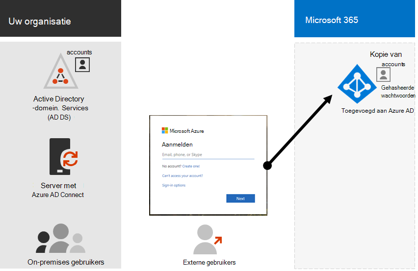
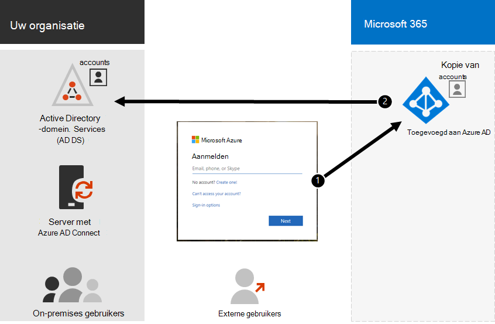

# Hybrid Identity en Directory Synchronization for Microsoft 365

*Dit artikel is van toepassing op Microsoft 365 Enterprise en Office 365 Enterprise.*

Afhankelijk van de behoeften van uw bedrijf en de technische vereisten, is dit de meest voorkomende optie voor Enterprise-klanten die Microsoft 365 aannemen. Met adreslijstsynchronisatie kunt u identiteiten beheren in uw Active Directory Domain Services (AD DS) en alle updates voor gebruikersaccounts, groepen en contactpersonen worden gesynchroniseerd met de Azure AD-Tenant (Azure Active Directory) van uw Microsoft-abonnement voor Microsoft 365.

>[!Note]
>Wanneer Active Directory-gebruikersaccounts voor de eerste keer worden gesynchroniseerd, wordt er niet automatisch een Microsoft 365-licentie toegewezen en geen toegang tot Microsoft 365-Services, zoals e-mail. U moet ze eerst een gebruikslocatie toewijzen. Vervolgens kunt u een licentie toewijzen aan deze gebruikersaccounts, hetzij afzonderlijk of dynamisch via groepslidmaatschap.
>

## Verificatie voor hybride identiteit

Er zijn twee typen verificatie wanneer u het Hybrid Identity model gebruikt:

- Beheerde verificatie

  Azure AD lost het authenticatieproces op met een lokaal opgeslagen hash-versie van het wachtwoord of verzendt de referenties naar een on-premises programma-agent om te worden geverifieerd door de on-premises AD DS.

- Federatieve verificatie

  Azure AD stuurt de clientcomputer om authenticatie vragen aan een andere identiteitsprovider.

### Beheerde verificatie

Er zijn twee typen beheerde verificatie:

- Synchronisatie van wachtwoord hash (PHS)

  Azure AD voert de authenticatie zelf uit.

- Pass Through-verificatie (PTA)

  Azure AD Active Directory heeft de authenticatie uitvoeren.

#### Synchronisatie van wachtwoord hash (PHS)

Met PHS synchroniseert u uw AD DS-gebruikersaccounts met Microsoft 365 en beheert u de gebruikers on-premises. Hashes van gebruikerswachtwoorden worden gesynchroniseerd vanuit uw AD DS naar Azure AD, zodat de gebruikers hetzelfde wachtwoord en on-premises hebben in de Cloud. Dit is de eenvoudigste manier om authenticatie voor AD DS-identiteiten in te schakelen in azure AD. 

Wanneer wachtwoorden worden gewijzigd of on-premises opnieuw instellen, worden de nieuwe wachtwoord hashwaarden gesynchroniseerd met Azure AD, zodat uw gebruikers altijd hetzelfde wachtwoord gebruiken voor Cloud bronnen en on-premises resources. De wachtwoorden van gebruikers worden nooit naar Azure AD verzonden of opgeslagen in azure AD als gewone tekst. Voor sommige Premium-functies van Azure AD, zoals identiteitsbeveiliging, is PHS vereist, ongeacht welke verificatiemethode is geselecteerd.
  
Zie voor meer informatie [de juiste verificatiemethode kiezen](https://docs.microsoft.com/azure/active-directory/hybrid/choose-ad-authn) .
  
#### Pass Through-verificatie (PTA)

PTA biedt een eenvoudige wachtwoordvalidatie voor Azure AD Authentication-Services met behulp van een software-agent die op een of meer on-premises servers wordt uitgevoerd om de gebruikers direct met uw AD DS te valideren. Met PTA synchroniseert u Active Directory-gebruikersaccounts met Microsoft 365 en beheert u de gebruikers on-premises. 

Met behulp van PTA kunnen uw gebruikers zich aanmelden bij zowel on-premises als Microsoft 365-bronnen en-toepassingen met behulp van hun on-premises account en wachtwoord. Deze configuratie valideert gebruikerswachtwoorden rechtstreeks op uw on-premises AD DS, zonder wachtwoord hashwaarden op te slaan in azure AD. 

PTA is ook bedoeld voor organisaties met een beveiligings verplichting om direct on-premises statussen van gebruikersaccounts, wachtwoordbeleidsregels en aanmeldingstijden af te dwingen. 
  
Zie voor meer informatie [de juiste verificatiemethode kiezen](https://docs.microsoft.com/azure/active-directory/hybrid/choose-ad-authn) .
  
### Federatieve verificatie

Federatieve verificatie is hoofdzakelijk voor grote Enterprise-organisaties met meer ingewikkelde verificatievereisten. AD DS-identiteiten worden gesynchroniseerd met Microsoft 365 en gebruikersaccounts worden on-premises beheerd. Met federatieve verificatie hebben gebruikers hetzelfde wachtwoord en wel in de Cloud en hoeven ze zich niet opnieuw aan te melden voor het gebruik van Microsoft 365. 

Federatieve authenticatie biedt ondersteuning voor extra verificatievereisten, zoals smartcardverificatie of een meervoudige verificatie van derden, en is meestal vereist wanneer organisaties een authenticatie vereiste niet voor de ondersteuning van Azure AD ondersteunen.
 
Zie voor meer informatie [de juiste verificatiemethode kiezen](https://docs.microsoft.com/azure/active-directory/hybrid/choose-ad-authn) .
  
#### Verificatie-en identiteitsproviders van derden

On-premises adreslijst objecten kunnen worden gesynchroniseerd met Microsoft 365 en toegang tot de Cloud wordt hoofdzakelijk beheerd door een externe identiteitsprovider (IdP). Als uw organisatie gebruikmaakt van een Federatie oplossing van derden, kunt u aanmelden met die oplossing voor Microsoft 365, mits de Federatie oplossing van derden compatibel is met Azure AD.
  
Zie de [lijst met compatibiliteit van Azure AD Federation](https://docs.microsoft.com/azure/active-directory/connect/active-directory-aadconnect-federation-compatibility) voor meer informatie.
  
## AD DS-voorbereiding

Voor een naadloze overgang naar Microsoft 365 met behulp van synchronisatie moet u eerst uw Active Directory-forest voorbereiden voordat u met de implementatie van Microsoft 365 Directory Synchronization begint.
  
Het voorbereiden van de adreslijst moet u richten op de volgende taken:

- Verwijder dubbele kenmerken van **proxyAddress** en **userPrincipalName** .
- Lege en ongeldige **userPrincipalName** -kenmerken bijwerken met geldige **userPrincipalName** -kenmerken.
- Verwijder ongeldige en dubieuze tekens in de kenmerken **benaming**, achternaam ( **sn** ), **sAMAccountName**, **DisplayName**, **mail**, **proxyAddresses**, **mailNickname**en **userPrincipalName** . Zie [lijst met kenmerken die worden gesynchroniseerd met het Azure Active Directory-synchronisatieprogramma](https://go.microsoft.com/fwlink/p/?LinkId=396719)voor meer informatie over het voorbereiden van kenmerken.

    > [!NOTE]
    > Dit zijn dezelfde kenmerken die Azure AD Connect synchroniseren. 
  
## Aandachtspunten voor de implementatie van meerdere forests

Voor meerdere forests en opties voor eenmalige aanmelding gebruikt u een [aangepaste installatie van Azure AD Connect](https://go.microsoft.com/fwlink/p/?LinkId=698430).
  
Als uw organisatie meerdere forests heeft voor verificatie (aanmeldings bossen), is het raadzaam het volgende te doen:
  
- **Overweeg om uw forests samen te voegen.** In het algemeen zijn er meer extra kosten nodig om meerdere forests te onderhouden. U moet uw on-premises omgeving vereenvoudigen, tenzij uw organisatie beveiligingsbeperkingen heeft die de noodzaak voor afzonderlijke forests kunnen dicteren.
- **Alleen gebruiken in uw primaire aanmeldings forest.** Overweeg Microsoft 365 alleen te implementeren in uw primaire aanmeldingsdomein voor uw eerste implementatie van Microsoft 365. 

Als u de AD DS-implementatie van meerdere forests niet kunt samenvoegen of andere adreslijstservices gebruikt voor het beheren van identiteiten, kunt u deze mogelijk synchroniseren met de Help van Microsoft of een partner.
  
Zie [topologieën voor Azure AD Connect](https://docs.microsoft.com/azure/active-directory/hybrid/plan-connect-topologies) voor meer informatie.
  
## Functies die afhankelijk zijn van adreslijstsynchronisatie
  
Adreslijstsynchronisatie is vereist voor de volgende functies en functionaliteit:
  
- Eenmalige aanmelding met Azure AD (SSO)
- Skype-samenwerking
- Hybride implementatie van Exchange, waaronder:
  - Volledig gedeelde algemene adreslijst (GAL) tussen uw on-premises Exchange-omgeving en Microsoft 365.
  - GAL-gegevens van andere e-mail systemen synchroniseren.
  - De mogelijkheid om gebruikers toe te voegen aan en te verwijderen uit serviceaanbiedingen van Microsoft 365. Hiervoor hebt u het volgende nodig:
  - Synchronisatie in twee gevallen moet worden geconfigureerd tijdens het instellen van adreslijstsynchronisatie. Standaard is Directory-synchronisatie hulpprogramma's alleen beschikbaar voor Directory-informatie in de Cloud. Wanneer u synchronisatie in twee richting configureert, schakelt u de functie write-back functie in, zodat een beperkt aantal objectkenmerken uit de Cloud wordt gekopieerd en vervolgens weer naar uw lokale AD DS wordt geschreven. Write-back wordt ook wel de hybride modus van Exchange genoemd. 
  - Een on-premises hybride implementatie van Exchange
  - De mogelijkheid om sommige postvakken van gebruikers te verplaatsen naar Microsoft 365 en andere postvakken van gebruikers on-premises te houden.
  - De on-premises veilige afzenders en geblokkeerde afzenders worden gerepliceerd naar Microsoft 365.
  - Basis overdracht en de functies voor het verzenden van e-mail.
  - U hebt een geïntegreerde on-premises smartcard of een oplossing voor meervoudige verificatie.
- Synchronisatie van Foto's, miniaturen, vergaderruimten en beveiligingsgroepen

## Volgende stap

Wanneer u klaar bent om de Hybrid Identity te implementeren, raadpleegt u [voorbereiden voor Directory-synchronisatie](prepare-for-directory-synchronization.md).
  
