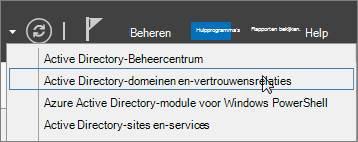
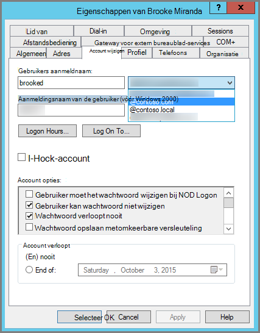

# <a name="prepare-a-non-routable-domain-for-directory-synchronization"></a>Een niet-routeerbaar domein voorbereiden op adreslijstsynchronisatie
Wanneer u uw on-premises adreslijst synchroniseert met Microsoft 365, hebt u een geverifieerd domein in azure Active Directory (Azure AD). Alleen de UPN (User Principal Names) die zijn gekoppeld aan het on-premises domein, worden gesynchroniseerd. Elke UPN die een niet-routeerbaar domein bevat, bijvoorbeeld. lokaal (zoals billa@contoso. lokaal), wordt wel gesynchroniseerd met een. onmicrosoft.com-domein (zoals billa@contoso.onmicrosoft.com). 

Als u momenteel een. local-domein gebruikt voor uw gebruikersaccounts in Active Directory Domain Services (AD DS), wordt u aangeraden ze te wijzigen voor gebruik van een geverifieerd domein (bijvoorbeeld billa@contoso.com) om correct te kunnen synchroniseren met uw Microsoft 365-domein.
  
## <a name="what-if-i-only-have-a-local-on-premises-domain"></a>Wat moet ik doen als ik alleen het on-premises domein. lokaal heb?

De naam van de meest recente tool die u kunt gebruiken voor het synchroniseren van uw Active Directory naar Azure AD heet Azure AD Connect. Zie voor meer informatie [uw on-premises Id's integreren met Azure AD](https://docs.microsoft.com/azure/architecture/reference-architectures/identity/azure-ad).
  
Azure AD Connect synchroniseert de UPN en het wachtwoord van uw gebruikers, zodat gebruikers zich kunnen aanmelden met dezelfde referenties als ze on-premises worden gebruikt. Met Azure AD Connect worden echter alleen gebruikers gesynchroniseerd met domeinen die zijn geverifieerd door Microsoft 365. Dit betekent dat het domein ook is geverifieerd door Azure AD omdat Microsoft 365-identiteiten worden beheerd door Azure AD. Het domein moet dus een geldig Internet domein zijn (bijvoorbeeld. com,. org, .net,. us, enzovoort). Als uw interne AD DS alleen gebruikmaakt van een niet-routeerbaar domein (bijvoorbeeld. lokaal), kan dit niet overeenkomen met het geverifieerde domein dat u hebt op Microsoft 365. U kunt dit probleem oplossen door het primaire domein te wijzigen in uw on-premises AD DS, of door een of meer UPN-achtervoegsels toe te voegen.
  
### <a name="change-your-primary-domain"></a>**Uw primaire domein wijzigen**

Uw primaire domein wijzigen in een domein dat u hebt geverifieerd in Microsoft 365, bijvoorbeeld contoso.com. Elke gebruiker met het domein contoso. local wordt vervolgens bijgewerkt naar contoso.com. Zie de werking van [domeinnamen](https://go.microsoft.com/fwlink/p/?LinkId=624174)voor instructies. Dit is een zeer dicht proces en een eenvoudiger oplossing wordt beschreven in de volgende sectie.
  
### <a name="add-upn-suffixes-and-update-your-users-to-them"></a>**UPN-achtervoegsels toevoegen en de gebruikers hieraan bijwerken**

U kunt het probleem oplossen door het nieuwe UPN-achtervoegsel of achtervoegsels in AD DS te registreren, zodat het overeenkomt met het domein of de domeinen die u hebt geverifieerd in Microsoft 365. Nadat u het nieuwe achtervoegsel hebt geregistreerd, moet u de gebruikers-Upn's bijwerken om de naam van de gebruiker door te vervangen door de nieuwe domeinnaam, bijvoorbeeld zodat een gebruikersaccount eruit ziet zoals billa@contoso.com.
  
Nadat u de Upn's hebt bijgewerkt voor gebruik met het geverifieerde domein, kunt u uw on-premises AD DS synchroniseren met Microsoft 365.
  
 **Stap 1: het nieuwe UPN-achtervoegsel toevoegen**
  
1. Kies op de AD DS-domeincontroller in Server beheer de optie **hulpmiddelen** voor \> **Active Directory-domeinen en vertrouwensrelaties**.
    
    **Of, als u niet over Windows Server 2012 beschikt**
    
    Druk op de **Windows-toets + R** om het dialoogvenster **uitvoeren** te openen, typ vervolgens Domain. msc en kies vervolgens **OK**.
    
    
  
2. Klik in het venster **Active Directory-domeinen en vertrouwensrelaties** met de rechtermuisknop op **Active Directory-domeinen en vertrouwensrelaties**en kies **Eigenschappen**.
    
    
  
3. Op het tabblad **UPN-achtervoegsels** , in het vak **andere UPN-achtervoegsels** , typt u het nieuwe UPN-achtervoegsel of achtervoegsels **en kiest u** vervolgens \> **toepassen**.
    
    
  
    Kies **OK** wanneer u klaar bent met het toevoegen van achtervoegsels. 
    
 **Stap 2: het UPN-achtervoegsel voor bestaande gebruikers wijzigen**
  
1. Kies op de AD DS-domeincontroller in Server beheer de optie **hulpprogramma's** \> **Active Directory: gebruikers en computers**.
    
    **Of, als u niet over Windows Server 2012 beschikt**
    
    Druk op de **Windows-toets + R** om het dialoogvenster **uitvoeren** te openen, typ vervolgens in dsa. msc en klik vervolgens op **OK** .
    
2. Selecteer een gebruiker, klik hierop met de rechtermuisknop en kies **Eigenschappen**.
    
3. Op het tabblad **account** , in de vervolgkeuzelijst met UPN-achtervoegsels, kiest u het nieuwe UPN-achtervoegsel en kiest u vervolgens **OK**.
    
    
  
4. Voer deze stappen voor elke gebruiker uit.
    
   
### <a name="you-can-also-use-windows-powershell-to-change-the-upn-suffix-for-all-users"></a>**U kunt ook Windows PowerShell gebruiken om het UPN-achtervoegsel voor alle gebruikers te wijzigen**

Als u veel gebruikers hebt om bij te werken, is het eenvoudiger om Windows PowerShell te gebruiken. In het volgende voorbeeld worden de cmdlets [Get-ADUser](https://go.microsoft.com/fwlink/p/?LinkId=624312) en [set-ADUser](https://go.microsoft.com/fwlink/p/?LinkId=624313) gebruikt om alle contoso. lokaal achtervoegsels te wijzigen in contoso.com. 

Foe voorbeeld: u kunt de volgende Windows PowerShell-opdrachten uitvoeren om alle contoso. lokaal achtervoegsels bij te werken met contoso.com:
    
  ```powershell
  $LocalUsers = Get-ADUser -Filter "UserPrincipalName -like '*contoso.local'" -Properties userPrincipalName -ResultSetSize $null
  $LocalUsers | foreach {$newUpn = $_.UserPrincipalName.Replace("@contoso.local","@contoso.com"); $_ | Set-ADUser -UserPrincipalName $newUpn}
  ```

Zie [Active Directory Windows PowerShell-module](https://go.microsoft.com/fwlink/p/?LinkId=624314) voor meer informatie over het gebruik van Windows PowerShell in AD DS. 

