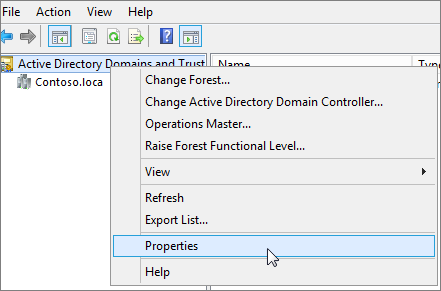

# <a name="prepare-a-non-routable-domain-for-directory-synchronization"></a><span data-ttu-id="064b4-103">Een niet-routeerbaar domein voorbereiden op adreslijstsynchronisatie</span><span class="sxs-lookup"><span data-stu-id="064b4-103">Prepare a non-routable domain for directory synchronization</span></span>
<span data-ttu-id="064b4-104">Wanneer u uw on-premises adreslijst synchroniseert met Microsoft 365, hebt u een geverifieerd domein in azure Active Directory (Azure AD).</span><span class="sxs-lookup"><span data-stu-id="064b4-104">When you synchronize your on-premises directory with Microsoft 365 you have to have a verified domain in Azure Active Directory (Azure AD).</span></span> <span data-ttu-id="064b4-105">Alleen de UPN (User Principal Names) die zijn gekoppeld aan het on-premises domein, worden gesynchroniseerd.</span><span class="sxs-lookup"><span data-stu-id="064b4-105">Only the User Principal Names (UPN) that are associated with the on-premises domain are synchronized.</span></span> <span data-ttu-id="064b4-106">Elke UPN die een niet-routeerbaar domein bevat, bijvoorbeeld. lokaal (zoals billa@contoso. lokaal), wordt wel gesynchroniseerd met een. onmicrosoft.com-domein (zoals billa@contoso.onmicrosoft.com).</span><span class="sxs-lookup"><span data-stu-id="064b4-106">However, any UPN that contains an non-routable domain, for example .local (like billa@contoso.local), will be synchronized to an .onmicrosoft.com domain (like billa@contoso.onmicrosoft.com).</span></span> 

<span data-ttu-id="064b4-107">Als u momenteel een. local-domein gebruikt voor uw gebruikersaccounts in Active Directory Domain Services (AD DS), wordt u aangeraden ze te wijzigen voor gebruik van een geverifieerd domein (bijvoorbeeld billa@contoso.com) om correct te kunnen synchroniseren met uw Microsoft 365-domein.</span><span class="sxs-lookup"><span data-stu-id="064b4-107">If you currently use a .local domain for your user accounts in Active Directory Domain Services (AD DS) it's recommended that you change them to use a verified domain (like billa@contoso.com) in order to properly sync with your Microsoft 365 domain.</span></span>
  
## <a name="what-if-i-only-have-a-local-on-premises-domain"></a><span data-ttu-id="064b4-108">Wat moet ik doen als ik alleen het on-premises domein. lokaal heb?</span><span class="sxs-lookup"><span data-stu-id="064b4-108">What if I only have a .local on-premises domain?</span></span>

<span data-ttu-id="064b4-109">De naam van de meest recente tool die u kunt gebruiken voor het synchroniseren van uw Active Directory naar Azure AD heet Azure AD Connect.</span><span class="sxs-lookup"><span data-stu-id="064b4-109">The most recent tool you can use for synchronizing your AD DS to Azure AD is named Azure AD Connect.</span></span> <span data-ttu-id="064b4-110">Zie voor meer informatie [uw on-premises Id's integreren met Azure AD](https://docs.microsoft.com/azure/architecture/reference-architectures/identity/azure-ad).</span><span class="sxs-lookup"><span data-stu-id="064b4-110">For more information, see [Integrating your on-premises identities with Azure AD](https://docs.microsoft.com/azure/architecture/reference-architectures/identity/azure-ad).</span></span>
  
<span data-ttu-id="064b4-111">Azure AD Connect synchroniseert de UPN en het wachtwoord van uw gebruikers, zodat gebruikers zich kunnen aanmelden met dezelfde referenties als ze on-premises worden gebruikt.</span><span class="sxs-lookup"><span data-stu-id="064b4-111">Azure AD Connect synchronizes your users' UPN and password so that users can sign in with the same credentials they use on-premises.</span></span> <span data-ttu-id="064b4-112">Met Azure AD Connect worden echter alleen gebruikers gesynchroniseerd met domeinen die zijn geverifieerd door Microsoft 365.</span><span class="sxs-lookup"><span data-stu-id="064b4-112">However, Azure AD Connect only synchronizes users to domains that are verified by Microsoft 365.</span></span> <span data-ttu-id="064b4-113">Dit betekent dat het domein ook is geverifieerd door Azure AD omdat Microsoft 365-identiteiten worden beheerd door Azure AD.</span><span class="sxs-lookup"><span data-stu-id="064b4-113">This means that the domain also is verified by Azure AD because Microsoft 365 identities are managed by Azure AD.</span></span> <span data-ttu-id="064b4-114">Het domein moet dus een geldig Internet domein zijn (bijvoorbeeld. com,. org, .net,. us, enzovoort).</span><span class="sxs-lookup"><span data-stu-id="064b4-114">In other words, the domain has to be a valid Internet domain (for example, .com, .org, .net, .us, etc.).</span></span> <span data-ttu-id="064b4-115">Als uw interne AD DS alleen gebruikmaakt van een niet-routeerbaar domein (bijvoorbeeld. lokaal), kan dit niet overeenkomen met het geverifieerde domein dat u hebt op Microsoft 365.</span><span class="sxs-lookup"><span data-stu-id="064b4-115">If your internal AD DS only uses a non-routable domain (for example, .local), this can't possibly match the verified domain you have on Microsoft 365.</span></span> <span data-ttu-id="064b4-116">U kunt dit probleem oplossen door het primaire domein te wijzigen in uw on-premises AD DS, of door een of meer UPN-achtervoegsels toe te voegen.</span><span class="sxs-lookup"><span data-stu-id="064b4-116">You can fix this issue by either changing your primary domain in your on premises AD DS, or by adding one or more UPN suffixes.</span></span>
  
### <a name="change-your-primary-domain"></a><span data-ttu-id="064b4-117">**Uw primaire domein wijzigen**</span><span class="sxs-lookup"><span data-stu-id="064b4-117">**Change your primary domain**</span></span>

<span data-ttu-id="064b4-118">Uw primaire domein wijzigen in een domein dat u hebt geverifieerd in Microsoft 365, bijvoorbeeld contoso.com.</span><span class="sxs-lookup"><span data-stu-id="064b4-118">Change your primary domain to a domain you have verified in Microsoft 365, for example, contoso.com.</span></span> <span data-ttu-id="064b4-119">Elke gebruiker met het domein contoso. local wordt vervolgens bijgewerkt naar contoso.com.</span><span class="sxs-lookup"><span data-stu-id="064b4-119">Every user that has the domain contoso.local is then updated to contoso.com.</span></span> <span data-ttu-id="064b4-120">Zie de werking van [domeinnamen](https://go.microsoft.com/fwlink/p/?LinkId=624174)voor instructies.</span><span class="sxs-lookup"><span data-stu-id="064b4-120">For instructions, see [How Domain Rename Works](https://go.microsoft.com/fwlink/p/?LinkId=624174).</span></span> <span data-ttu-id="064b4-121">Dit is een zeer dicht proces en een eenvoudiger oplossing wordt beschreven in de volgende sectie.</span><span class="sxs-lookup"><span data-stu-id="064b4-121">This is a very involved process, however, and an easier solution is described in the following section.</span></span>
  
### <a name="add-upn-suffixes-and-update-your-users-to-them"></a><span data-ttu-id="064b4-122">**UPN-achtervoegsels toevoegen en de gebruikers hieraan bijwerken**</span><span class="sxs-lookup"><span data-stu-id="064b4-122">**Add UPN suffixes and update your users to them**</span></span>

<span data-ttu-id="064b4-123">U kunt het probleem oplossen door het nieuwe UPN-achtervoegsel of achtervoegsels in AD DS te registreren, zodat het overeenkomt met het domein of de domeinen die u hebt geverifieerd in Microsoft 365.</span><span class="sxs-lookup"><span data-stu-id="064b4-123">You can solve the .local problem by registering new UPN suffix or suffixes in AD DS to match the domain (or domains) you verified in Microsoft 365.</span></span> <span data-ttu-id="064b4-124">Nadat u het nieuwe achtervoegsel hebt geregistreerd, moet u de gebruikers-Upn's bijwerken om de naam van de gebruiker door te vervangen door de nieuwe domeinnaam, bijvoorbeeld zodat een gebruikersaccount eruit ziet zoals billa@contoso.com.</span><span class="sxs-lookup"><span data-stu-id="064b4-124">After you register the new suffix, you update the user UPNs to replace the .local with the new domain name for example so that a user account looks like billa@contoso.com.</span></span>
  
<span data-ttu-id="064b4-125">Nadat u de Upn's hebt bijgewerkt voor gebruik met het geverifieerde domein, kunt u uw on-premises AD DS synchroniseren met Microsoft 365.</span><span class="sxs-lookup"><span data-stu-id="064b4-125">After you have updated the UPNs to use the verified domain, you are ready to synchronize your on-premises AD DS with Microsoft 365.</span></span>
  
 <span data-ttu-id="064b4-126">**Stap 1: het nieuwe UPN-achtervoegsel toevoegen**</span><span class="sxs-lookup"><span data-stu-id="064b4-126">**Step 1: Add the new UPN suffix**</span></span>
  
1. <span data-ttu-id="064b4-127">Kies op de AD DS-domeincontroller in Server beheer de optie **hulpmiddelen** voor \> **Active Directory-domeinen en vertrouwensrelaties**.</span><span class="sxs-lookup"><span data-stu-id="064b4-127">On the AD DS domain controller, in the Server Manager choose **Tools** \> **Active Directory Domains and Trusts**.</span></span>
    
    <span data-ttu-id="064b4-128">**Of, als u niet over Windows Server 2012 beschikt**</span><span class="sxs-lookup"><span data-stu-id="064b4-128">**Or, if you don't have Windows Server 2012**</span></span>
    
    <span data-ttu-id="064b4-129">Druk op de **Windows-toets + R** om het dialoogvenster **uitvoeren** te openen, typ vervolgens Domain. msc en kies vervolgens **OK**.</span><span class="sxs-lookup"><span data-stu-id="064b4-129">Press **Windows key + R** to open the **Run** dialog, and then type in Domain.msc, and then choose **OK**.</span></span>
    
    
  
2. <span data-ttu-id="064b4-131">Klik in het venster **Active Directory-domeinen en vertrouwensrelaties** met de rechtermuisknop op **Active Directory-domeinen en vertrouwensrelaties**en kies **Eigenschappen**.</span><span class="sxs-lookup"><span data-stu-id="064b4-131">On the **Active Directory Domains and Trusts** window, right-click **Active Directory Domains and Trusts**, and then choose **Properties**.</span></span>
    
    
  
3. <span data-ttu-id="064b4-133">Op het tabblad **UPN-achtervoegsels** , in het vak **andere UPN-achtervoegsels** , typt u het nieuwe UPN-achtervoegsel of achtervoegsels **en kiest u** vervolgens \> **toepassen**.</span><span class="sxs-lookup"><span data-stu-id="064b4-133">On the **UPN Suffixes** tab, in the **Alternative UPN Suffixes** box, type your new UPN suffix or suffixes, and then choose **Add** \> **Apply**.</span></span>
    
    
  
    <span data-ttu-id="064b4-135">Kies **OK** wanneer u klaar bent met het toevoegen van achtervoegsels.</span><span class="sxs-lookup"><span data-stu-id="064b4-135">Choose **OK** when you're done adding suffixes.</span></span> 
    
 <span data-ttu-id="064b4-136">**Stap 2: het UPN-achtervoegsel voor bestaande gebruikers wijzigen**</span><span class="sxs-lookup"><span data-stu-id="064b4-136">**Step 2: Change the UPN suffix for existing users**</span></span>
  
1. <span data-ttu-id="064b4-137">Kies op de AD DS-domeincontroller in Server beheer de optie **hulpprogramma's** \> **Active Directory: gebruikers en computers**.</span><span class="sxs-lookup"><span data-stu-id="064b4-137">On the AD DS domain controller, in the Server Manager choose **Tools** \> **Active Directory Users and Computers**.</span></span>
    
    <span data-ttu-id="064b4-138">**Of, als u niet over Windows Server 2012 beschikt**</span><span class="sxs-lookup"><span data-stu-id="064b4-138">**Or, if you don't have Windows Server 2012**</span></span>
    
    <span data-ttu-id="064b4-139">Druk op de **Windows-toets + R** om het dialoogvenster **uitvoeren** te openen, typ vervolgens in dsa. msc en klik vervolgens op **OK** .</span><span class="sxs-lookup"><span data-stu-id="064b4-139">Press **Windows key + R** to open the **Run** dialog, and then type in Dsa.msc, and then click **OK**</span></span>
    
2. <span data-ttu-id="064b4-140">Selecteer een gebruiker, klik hierop met de rechtermuisknop en kies **Eigenschappen**.</span><span class="sxs-lookup"><span data-stu-id="064b4-140">Select a user, right-click, and then choose **Properties**.</span></span>
    
3. <span data-ttu-id="064b4-141">Op het tabblad **account** , in de vervolgkeuzelijst met UPN-achtervoegsels, kiest u het nieuwe UPN-achtervoegsel en kiest u vervolgens **OK**.</span><span class="sxs-lookup"><span data-stu-id="064b4-141">On the **Account** tab, in the UPN suffix drop-down list, choose the new UPN suffix, and then choose **OK**.</span></span>
    
    
  
4. <span data-ttu-id="064b4-143">Voer deze stappen voor elke gebruiker uit.</span><span class="sxs-lookup"><span data-stu-id="064b4-143">Complete these steps for every user.</span></span>
    
   
### <a name="you-can-also-use-windows-powershell-to-change-the-upn-suffix-for-all-users"></a><span data-ttu-id="064b4-144">**U kunt ook Windows PowerShell gebruiken om het UPN-achtervoegsel voor alle gebruikers te wijzigen**</span><span class="sxs-lookup"><span data-stu-id="064b4-144">**You can also use Windows PowerShell to change the UPN suffix for all users**</span></span>

<span data-ttu-id="064b4-145">Als u veel gebruikers hebt om bij te werken, is het eenvoudiger om Windows PowerShell te gebruiken.</span><span class="sxs-lookup"><span data-stu-id="064b4-145">If you have a lot of users to update, it is easier to use Windows PowerShell.</span></span> <span data-ttu-id="064b4-146">In het volgende voorbeeld worden de cmdlets [Get-ADUser](https://go.microsoft.com/fwlink/p/?LinkId=624312) en [set-ADUser](https://go.microsoft.com/fwlink/p/?LinkId=624313) gebruikt om alle contoso. lokaal achtervoegsels te wijzigen in contoso.com.</span><span class="sxs-lookup"><span data-stu-id="064b4-146">The following example uses the cmdlets [Get-ADUser](https://go.microsoft.com/fwlink/p/?LinkId=624312) and [Set-ADUser](https://go.microsoft.com/fwlink/p/?LinkId=624313) to change all contoso.local suffixes to contoso.com.</span></span> 

<span data-ttu-id="064b4-147">Foe voorbeeld: u kunt de volgende Windows PowerShell-opdrachten uitvoeren om alle contoso. lokaal achtervoegsels bij te werken met contoso.com:</span><span class="sxs-lookup"><span data-stu-id="064b4-147">Foe example, you could run the following Windows PowerShell commands to update all contoso.local suffixes to contoso.com:</span></span>
    
  ```powershell
  $LocalUsers = Get-ADUser -Filter "UserPrincipalName -like '*contoso.local'" -Properties userPrincipalName -ResultSetSize $null
  $LocalUsers | foreach {$newUpn = $_.UserPrincipalName.Replace("@contoso.local","@contoso.com"); $_ | Set-ADUser -UserPrincipalName $newUpn}
  ```

<span data-ttu-id="064b4-148">Zie [Active Directory Windows PowerShell-module](https://go.microsoft.com/fwlink/p/?LinkId=624314) voor meer informatie over het gebruik van Windows PowerShell in AD DS.</span><span class="sxs-lookup"><span data-stu-id="064b4-148">See [Active Directory Windows PowerShell module](https://go.microsoft.com/fwlink/p/?LinkId=624314) to learn more about using Windows PowerShell in AD DS.</span></span> 

