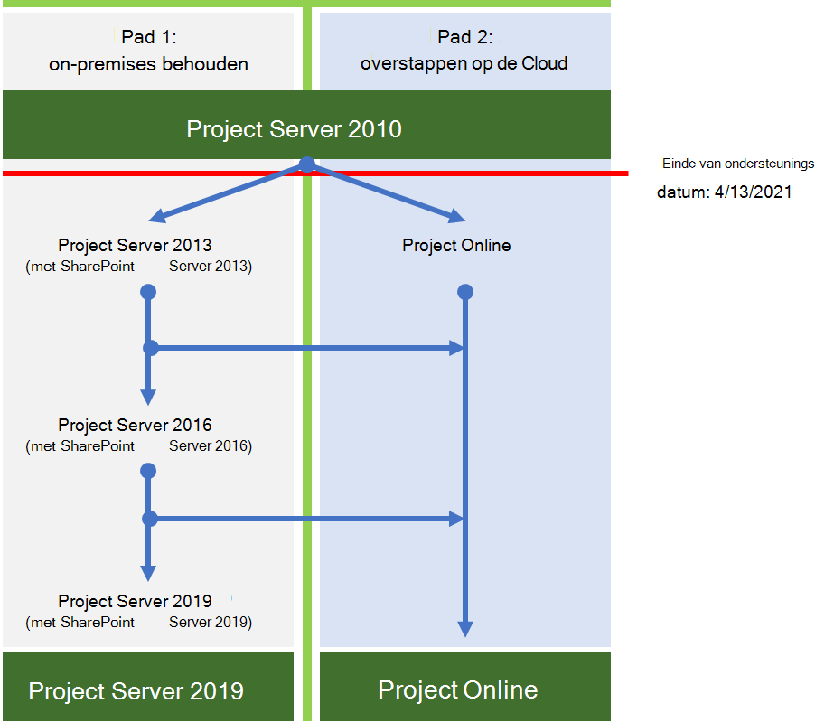

# Project Roadmap voor het einde van ondersteuning van Server 2010Project Server 2010 end of support roadmap

*Dit artikel is van toepassing op Microsoft 365 Enterprise en Office 365 Enterprise.**This article applies to both Microsoft 365 Enterprise and Office 365 Enterprise.*

Project Server 2010 eindigt op **13 april 2021** op het einde van de ondersteuning.Project Server 2010 will reach end of support on **April 13, 2021**. Deze datum is verlengd vanaf de vorige einddatum van ondersteuning van 13 oktober 2020.This date was extended from the previous end-of-support date of October 13, 2020. Als u op dit moment Project Server 2010 gebruikt, moet u er rekening mee houden dat deze gerelateerde producten de volgende datums voor het einde van de ondersteuning hebben:If you're currently using Project Server 2010, note that these related products have the following end-of-support dates:

|ProductProduct |Eind van de ondersteuningsdatumEnd of support date|
|---|---|
|Project 2010 StandardProject 2010 Standard|13 oktober 2020October 13, 2020|
|Project 2010 ProfessionalProject 2010 Professional|13 oktober 2020October 13, 2020|

Zie Upgraden van Office [2010-servers en clientproducten](plan-upgrade-previous-versions-office.md)voor meer informatie over het bereiken van het einde van de ondersteuning.For more information about reaching end of support, see [Upgrade from Office 2010 servers and client products](plan-upgrade-previous-versions-office.md).

## Wat betekent *het einde van de ondersteuning?*What does *end of support* mean?

Bijna alle Microsoft-producten hebben een ondersteuningslevenscyclus, waarin ze nieuwe functies, bugfixes en beveiligingsupdates krijgen.Almost all Microsoft products have a support lifecycle, during which they get new features, bug fixes, and security updates. Deze levenscyclus duurt meestal tien jaar vanaf de eerste release van het product.This lifecycle typically lasts for 10 years from the product's initial release. Het einde van deze levenscyclus wordt het einde van de ondersteuning van het product genoemd.The end of this lifecycle is known as the product's end of support. Nadat Project server 2010 op 13 april 2021 het einde van de ondersteuning heeft bereikt, biedt Microsoft niet meer:After Project Server 2010 reaches its end of support on April 13, 2021, Microsoft will no longer provide:

- Technische ondersteuning voor problemen die kunnen optreden.Technical support for problems that may occur.

- Bug fixes for issues that are discovered and that may impact the stability and usability of the server.Bug fixes for issues that are discovered and that may impact the stability and usability of the server.

- Beveiligingsfixes voor beveiligingsproblemen die worden ontdekt en die de server kwetsbaar kunnen maken voor beveiligingslekken.Security fixes for vulnerabilities that are discovered and that may make the server vulnerable to security breaches.

- Tijdzone-updates.Time zone updates.

De installatie van Project Server 2010 blijft na deze datum worden uitgevoerd.Your installation of Project Server 2010 will continue to run after this date. Vanwege de eerder genoemde wijzigingen raden we u echter ten zeerste aan zo snel mogelijk te migreren van Project Server 2010.But, because of the changes listed previously, we strongly recommend that you migrate from Project Server 2010 as soon as possible.

## Wat zijn mijn opties?What are my options?

Uw migratieopties zijn:Your migration options are:

- Migreren naar Project OnlineMigrate to Project Online

- Migreren naar een nieuwere on-premises versie van Project Server (bij voorkeur Project Server 2019)Migrate to a newer on-premises version of Project Server (preferably Project Server 2019)

Hier volgen de twee paden die u kunt volgen om het einde van de ondersteuning voor Project Server 2010 te voorkomen.Here are the two paths you can take to avoid the end of support for Project Server 2010.

|Waarom zou ik liever migreren naar Project Server 2019?Why would I prefer to migrate to Project Server 2019?|Waarom zou ik liever migreren naar Project Online?Why would I prefer to migrate to Project Online?|
|---|---|
|Met bedrijfsregels kan ik mijn bedrijf niet in de cloud bedienen.Business rules restrict me from operating my business in the cloud.      Ik heb controle nodig over updates voor mijn omgeving.I need control of updates to my environment.|Ik heb mobiele of externe gebruikers.I have mobile or remote users.    Kosten voor het migreren van on-premises servers zijn een belangrijk probleem (hardware, software, tijd en moeite om te implementeren, etc.).Costs to migrate on-premises servers are a significant concern (hardware, software, time and effort to implement, and so on.).     Na de migratie zijn de kosten voor het onderhouden van mijn omgeving een probleem (bijvoorbeeld automatische updates, gegarandeerde uptime, etc.).After migration, costs to maintain my environment are a concern (for example, automatic updates, guaranteed uptime, and so on).|

> [!NOTE]
> Zie Resources voor meer informatie over uw migratieopties om u te helpen bij het upgraden van Office [2010-servers en -clients.](upgrade-from-office-2010-servers-and-products.md)For more information about your migration options, see [Resources to help you upgrade from Office 2010 servers and clients](upgrade-from-office-2010-servers-and-products.md). Houd er rekening Project server geen ondersteuning biedt voor hybride configuratie omdat Project Server en Project Online niet dezelfde resourcegroep kunnen delen.Note that Project Server doesn't support hybrid configuration because Project Server and Project Online can't share the same resource pool.

### Wat zijn mijn opties voor Project client?What are my options for Project client?

Als u 2010 Project Professional 2010 of Project Standard 2010 gebruikt, zijn uw opties:If you're using Project Professional 2010 or Project Standard 2010, your options are:

- Naar een nieuwere versie van Project Professional of Project StandardMove to a newer version of Project Professional or Project Standard
- Naar een onlineoplossing gaan, zoals Project Online of Project voor het webMove to an online solution, such as Project Online or Project for the web

#### Naar een nieuwere versie van de Project gaanMove to a newer version of Project client

Als u migreert van Project Standard 2010, kunt u naar een nieuwere versie van Project Standard (Project Standard 2016 of Project Standard 2019) gaan.If you're migrating from Project Standard 2010, you can move to a newer version of Project Standard (Project Standard 2016 or Project Standard 2019). U wordt aangeraden naar de nieuwste versie te gaan om te profiteren van de nieuwste functies.We recommend you move to the newest version to take advantage of the latest features. Als u migreert naar een minder recente versie (Project Standard 2016) moet u ook eerder opnieuw migreren.Migrating to a less-current version (Project Standard 2016) also means you'll need to migrate again sooner.

Als u migreert van Project Professional 2010, kunt u ook naar een nieuwere versie gaan (Project Professional 2019 of Project Professional 2016).Similarly, if you're migrating from Project Professional 2010, you can move to a newer version (Project Professional 2019 or Project Professional 2016). Ga nogmaals naar de nieuwste versie, indien mogelijk.Again, move to the newest version if possible. Als u Project Professional gebruikt om verbinding te maken met Project Server, moet u migreren naar een versie van Project Professional die verbinding maakt met de versie van Project Server die u gebruikt.If you use Project Professional to connect to Project Server, make sure you migrate to a version of Project Professional that connects with the version of Project Server that you use.

Project Professional 2010 kunnen gebruikers ook migreren naar de Project Online Desktopclient, een abonnementsversie van Project Professional 2019.Project Professional 2010 users can also migrate to the Project Online Desktop client, which is a subscription-based version of Project Professional 2019. Het is opgenomen in Project Abonnement 3 en Project Abonnement 5 abonnementen.It's included in Project Plan 3 and Project Plan 5 subscriptions.

#### Naar een onlineoplossing gaanMove to an online solution

U kunt ook migreren van Project Professional 2010 of Project Standard 2010 naar een Project op abonnement gebaseerde onlineoplossing.You can also migrate from Project Professional 2010 or Project Standard 2010 to a Project subscription-based online solution. Zowel Project Abonnement 3 als Plan 5 bevatten Project Online en de nieuwste cloudaanbieding, [Project voor het web.](https://support.office.com/article/what-can-you-do-with-project-for-the-web-b30f5442-be5f-43d2-9072-c95bff778ea1)Both Project Plan 3 and Plan 5 include Project Online and the latest cloud offering, [Project for the web](https://support.office.com/article/what-can-you-do-with-project-for-the-web-b30f5442-be5f-43d2-9072-c95bff778ea1). Beide bieden nieuwe functies en voordelen die het verkennen waard zijn.Both offer new features and benefits that are worth exploring.

Zie voor meer informatie over functies en licenties [Microsoft Project servicebeschrijving.](/office365/servicedescriptions/project-online-service-description/project-online-service-description)For more information about features and licenses, see [Microsoft Project service description](/office365/servicedescriptions/project-online-service-description/project-online-service-description).

## Belangrijke aandachtspunten voor het migreren van Project Server 2010Important considerations for migrating from Project Server 2010

Houd rekening met het volgende wanneer u van plan bent te migreren van Project Server 2010:Consider the following when you plan to migrate from Project Server 2010:

- **Hulp krijgen van een Microsoft-oplossingsprovider:** een upgrade van Project Server 2010 kan een uitdaging zijn.**Get help from a Microsoft solution provider** - An upgrade from Project Server 2010 can be a challenge. Het vereist veel voorbereiding en planning.It requires much preparation and planning. Het kan vooral lastig zijn als u niet de persoon bent die oorspronkelijk Project Server 2010.It can be especially challenging if you weren't the person who originally set up Project Server 2010. Microsoft-oplossingsproviders zijn beschikbaar voor hulp, ongeacht of u van plan bent te migreren naar Project Server 2019 of om Project Online.Microsoft solution providers are available to help, whether you plan to migrate to Project Server 2019 or to Project Online. Zoek naar een oplossingsprovider in het [Microsoft-centrum voor oplossingsproviders.](https://go.microsoft.com/fwlink/p/?linkid=841249)Search for a solution provider in the [Microsoft solution provider center](https://go.microsoft.com/fwlink/p/?linkid=841249).

- **Uw aanpassingen** plannen: aanpassingen in uw Project Server 2010-omgeving werken mogelijk niet wanneer u migreert naar Project Server 2019 of Project Online.**Plan for your customizations** - Customizations  in your Project Server 2010 environment might not work when you migrate to Project Server 2019 or Project Online. Er zijn aanzienlijke verschillen in Project serverarchitectuur tussen versies.There are significant differences in Project Server architecture between versions. Ook verschillen de vereiste besturingssystemen, databaseservers en webbrowsers die met de versies werken.Also, the required operating systems, database servers, and web browsers that work with the versions differ. Hebt u een plan voor het testen of opnieuw opbouwen van uw aanpassingen in de nieuwe omgeving.Have a plan on how to test or rebuild your customizations in the new environment. Maak van deze gelegenheid gebruik om te bepalen of er nog specifieke aanpassingen nodig zijn.Take this opportunity to determine if specific customizations are still needed. Zie Een plan maken voor huidige aanpassingen tijdens de upgrade naar SharePoint [2013 voor meer informatie.](/SharePoint/upgrade-and-update/create-a-plan-for-current-customizations-during-upgrade-to-sharepoint-2013)For more information, see [Create a plan for current customizations during upgrade to SharePoint 2013](/SharePoint/upgrade-and-update/create-a-plan-for-current-customizations-during-upgrade-to-sharepoint-2013).

- **Tijd en geduld:** het plannen, uitvoeren en testen van een upgrade kost veel tijd en moeite, met name voor een upgrade naar Project Server 2019.**Time and patience** - Upgrade planning, execution, and testing will take considerable time and effort, especially for an upgrade to Project Server 2019. Als u migreert van Project Server 2010 naar Project Server 2019, moet u eerst migreren naar Project Server 2013, uw gegevens controleren, vervolgens migreren naar Project Server 2016 en vervolgens naar Project Server 2019.If you're migrating from Project Server 2010 to Project Server 2019, you must first migrate to Project Server 2013, check your data, then migrate to Project Server 2016, and then to Project Server 2019. Misschien wilt u contact op nemen met een Microsoft-oplossingsprovider voor een tijdsbestek en de geschatte kosten voor hulp.You might want to check with a Microsoft solution provider for a time frame and estimated cost for them to assist.

## Migreren naar Project OnlineMigrate to Project Online

Als u ervoor kiest om te migreren van Project Server 2010 naar Project Online, kunt u de volgende stappen volgen om uw projectplangegevens handmatig te migreren:If you choose to migrate from Project Server 2010 to Project Online, you can follow these steps to manually migrate your project plan data:

1. Sla uw projectplannen op van Project Server 2010 naar .mpp-indeling.Save your project plans from Project Server 2010 to .mpp format.

2. Met Project Professional 2016, Project Professional 2019 of de Project Online-bureaubladclient opent u elk MPP-bestand en vervolgens op en publiceert u het in Project Online.Using Project Professional 2016, Project Professional 2019, or the Project Online Desktop Client, open each .mpp file, and then save and publish it to Project Online.

U kunt handmatig uw PWA maken in Project Online (bijvoorbeeld de benodigde aangepaste velden of bedrijfsagenda's opnieuw maken).You can manually create your PWA configuration in Project Online (for example, recreate any needed custom fields or enterprise calendars). Microsoft-oplossingsproviders kunnen ook helpen met dit proces.Microsoft solution providers can also help with this process.

Belangrijke bronnen:Key resources:

|ResourceResource|BeschrijvingDescription|
|---|---|
|[Aan de slag met Project OnlineGet started with Project Online](https://support.office.com/article/e3e5f64f-ada5-4f9d-a578-130b2d4e5f11)|Het instellen en gebruiken van Project OnlineHow to set up and use Project Online|
|[Servicebeschrijving van Project OnlineProject Online Service Description](/office365/servicedescriptions/project-online-service-description/project-online-service-description)|Informatie over de verschillende Project Online beschikbare abonnementenInformation about the different Project Online plans available|

## Migreren naar een nieuwere on-premises versie van Project ServerMigrate to a newer on-premises version of Project Server

We zijn ervan overtuigd dat u de beste waarde en gebruikerservaring krijgt door te migreren naar Project Online.We strongly believe that you get the best value and user experience by migrating to Project Online. Maar we begrijpen ook dat sommige organisaties projectgegevens on-premises moeten houden.But we also understand some organizations need to keep project data on-premises. Als u ervoor kiest om uw projectgegevens on-premises te houden, kunt u uw Project Server 2010-omgeving migreren naar Project Server 2013, Project Server 2016 of Project Server 2019.If you choose to keep your project data on-premises, you can migrate your Project Server 2010 environment to Project Server 2013, Project Server 2016, or Project Server 2019.

Als u niet kunt migreren naar Project Online, raden we u aan te migreren naar Project Server 2019.If you can't migrate to Project Online, we recommend that you migrate to Project Server 2019. Project Server 2019 bevat de meeste belangrijke functies in eerdere versies van Project Server.Project Server 2019 includes most of the key features in previous releases of Project Server. En het komt het meest overeen met de ervaring die beschikbaar is met Project Online, hoewel sommige functies alleen beschikbaar zijn in Project Online.And it most closely matches the experience available with Project Online, although some features are available only in Project Online.

Nadat u elke migratie hebt voltooid, moet u ervoor zorgen dat uw gegevens zijn gemigreerd.After you complete each migration, make sure that your data migrated successfully.

> [!NOTE]
> Als u beperkt bent tot een on-premises oplossing en alleen wilt migreren naar Project Server 2013, moet u er rekening mee houden dat deze versie nog maar een paar jaar ondersteuning heeft.If you're limited to an on-premises solution and considering only migrating to Project Server 2013, beware that this version only has a few more years of support left. Het einde van de ondersteuningsdatum Project Server 2013 met Service Pack 2 oktober 13, 2023.The end of support date for Project Server 2013 with Service Pack 2 October 13, 2023. Zie [Microsoft Product Lifecycle Policy (Microsoft Product Lifecycle Policy)](/lifecycle/)voor meer informatie over einddatums van ondersteuning.For more information about end-of-support dates, see [Microsoft Product Lifecycle Policy](/lifecycle/).

### Hoe kan ik migreren naar Project Server 2019?How do I migrate to Project Server 2019?

De architecturale verschillen tussen Project Server 2010 en Project Server 2019 voorkomen een direct migratiepad.The architectural differences between Project Server 2010 and Project Server 2019 prevent a direct migration path. U moet dus de gegevens van Project Server 2010 migreren naar elke opeenvolgende versie van Project Server totdat u Project Server 2019 bereikt.So you'll need to migrate your Project Server 2010 data to each successive version of Project Server until you reach Project Server 2019. Stappen voor het upgraden Project Server 2010 naar Project Server 2019:Steps to upgrade Project Server 2010 to Project Server 2019:

1. Migreren naar Project Server 2013.Migrate to Project Server 2013.

2. Migreren van Project Serve 2013 naar Project Server 2016.Migrate from Project Serve 2013 to Project Server 2016.

3. Migreren van Project Server 2016 naar Project Server 2019.Migrate from Project Server 2016 to Project Server 2019.

Nadat u elke migratie hebt voltooid, moet u ervoor zorgen dat uw gegevens zijn gemigreerd.After you complete each migration, make sure that your data migrated successfully.

### Stap 1: Migreren naar Project Server 2013Step 1: Migrate to Project Server 2013

Zie Upgraden naar Project Server 2013 voor uitgebreide informatie over het upgraden van Project Server 2010 naar Project [Server 2013.](/project/upgrade-to-project-server-2016)For a comprehensive information about upgrading from Project Server 2010 to Project Server 2013, see [Upgrade to Project Server 2013](/project/upgrade-to-project-server-2016).

Belangrijke bronnen:Key resources:

- [Overzicht van het upgradeproces Project Server 2013Overview of the Project Server 2013 upgrade process](/project/upgrade-to-project-server-2016)

  Krijg een overzicht op hoog niveau van hoe u een upgrade kunt uitvoeren van Project Server 2010 naar Project Server 2013.Get a high-level overview of how to upgrade from Project Server 2010 to Project Server 2013.
- [Een upgrade naar Project Server 2013 plannenPlan to upgrade to Project Server 2013](/project/plan-for-upgrade-to-project-server-2016)

  Bekijk planningsoverwegingen bij het upgraden van Project Server 2010 naar Project Server 2013, inclusief systeemvereisten.Look at planning considerations when upgrading from Project Server 2010 to Project Server 2013, including system requirements.

- [Nieuw in de upgrade Project Server 2013](/project/what-s-new-in-project-server-2013-upgrade) bevat belangrijke wijzigingen voor deze versie, waaronder:[What's new in Project Server 2013 upgrade](/project/what-s-new-in-project-server-2013-upgrade) covers important changes for this version, including:

   - Er is geen in-place upgrade naar Project Server 2013.There's no in-place upgrade to Project Server 2013. De methode database-attach is de enige ondersteunde manier om te upgraden van Project Server 2010 naar Project Server 2013.The database-attach method is the only supported way to upgrade from Project Server 2010 to Project Server 2013.

   - Tijdens het upgradeproces worden niet alleen uw Project Server 2010-gegevens ge converteerd naar de Project Server 2013-indeling, maar worden ook de vier Project Server 2010-databases samengevoegd tot één Project Web App-database.The upgrade process will not only convert your Project Server 2010 data to Project Server 2013 format but will also consolidate the four Project Server 2010 databases into a single Project Web App database.

   - Zowel SharePoint Server 2013 als Project Server 2013 is gewijzigd in verificatie op basis van claims uit de vorige versie.Both SharePoint Server 2013 and Project Server 2013 changed to claims-based authentication from the previous version. Als u klassieke verificatie gebruikt, moet u dit overwegen bij het upgraden.If you're using classic authentication, you'll need to consider this when you upgrade. Zie Migreren van de klassieke modus naar verificatie op basis van claims in SharePoint [2013 voor meer informatie.]( /sharepoint/upgrade-and-update/migrate-from-classic-mode-to-claims-based-authentication-in-sharepoint-2013)For more information, see [Migrate from classic-mode to claims-based authentication in SharePoint 2013]( /sharepoint/upgrade-and-update/migrate-from-classic-mode-to-claims-based-authentication-in-sharepoint-2013).

Belangrijke bronnen:Key resources:

- [Overzicht van het upgradeproces Project Server 2013Overview of the upgrade process to Project Server 2013](/project/overview-of-the-project-server-2016-upgrade-process)

- [Upgrade uw databases en Project Web App-siteverzamelingen (Project Server 2013)Upgrade your databases and Project Web App site collections (Project Server 2013)](/project/upgrading-to-project-server-2016)

- [Microsoft Project Procesdiagram serverupgradeMicrosoft Project Server upgrade process diagram](https://go.microsoft.com/fwlink/p/?linkid=841270)

- [De grote databaseconsolidatie, Project Server 2010-2013-migratie in 8 eenvoudige stappenThe Great Database Consolidation, Project Server 2010 to 2013 Migration in 8 Easy Steps](https://go.microsoft.com/fwlink/p/?linkid=841271)

### Stap 2: Migreren naar Project Server 2016Step 2: Migrate to Project Server 2016

Nadat u naar Project Server 2013 bent overgeslagen en hebt gecontroleerd of uw gegevens zijn gemigreerd, is de volgende stap om te migreren naar Project Server 2016.After you move to Project Server 2013 and verify that your data has migrated successfully, the next step is to migrate to Project Server 2016.

Zie Upgraden naar [Project Server 2016.](/Project/upgrade-to-project-server-2016)For more information, see [Upgrade to Project Server 2016](/Project/upgrade-to-project-server-2016).

Belangrijke bronnen:Key resources:

- [Overzicht van het Project Server 2016 upgradeprocesOverview of the Project Server 2016 upgrade process](/Project/overview-of-the-project-server-2016-upgrade-process)

  Begrijp wat u moet doen om een upgrade uit Project Server 2013 naar Project Server 2016.Understand what you need to do to upgrade from Project Server 2013 to Project Server 2016.

- [Plan een upgrade naar Project Server 2016Plan for upgrade to Project Server 2016](/Project/plan-for-upgrade-to-project-server-2016)

  Bekijk de planningsoverwegingen die u moet maken bij het upgraden van Project Server 2013 naar Project Server 2016.Look at  the planning considerations to make when upgrading from Project Server 2013 to Project Server 2016.

[Wat u moet weten over Project Server 2016 upgrade,](/project/plan-for-upgrade-to-project-server-2016#thingknow) gaat over belangrijke wijzigingen voor het upgraden naar deze versie, waaronder:[Things you need to know about Project Server 2016 upgrade](/project/plan-for-upgrade-to-project-server-2016#thingknow) covers important changes for upgrading to this version, which include:

- Wanneer u uw Project Server 2016 maakt, moet u er rekening mee houden dat de Project Server 2016 installatiebestanden zijn opgenomen in SharePoint Server 2016.When you create your Project Server 2016 environment, note that the Project Server 2016 installation files are included in SharePoint Server 2016. Zie Implementatie van [Project Server 2016.](/project/deploy-project-server-2016)For more information, see [Deploy Project Server 2016](/project/deploy-project-server-2016).

- Resourceplannen worden afgeschaft in Project Server 2016.Resource plans are deprecated in Project Server 2016. Uw Project Server 2013-resourceplannen worden gemigreerd naar Resourceafspraak in Project Server 2016 en in Project Online.Your Project Server 2013 resource plans will be migrated to Resource Engagements in Project Server 2016 and in Project Online. Zie [Overzicht: Resourceafspraak voor](https://support.office.com/article/73eefb5a-81fe-42bf-980e-9532b1bdc870) meer informatie.See [Overview: Resource engagements](https://support.office.com/article/73eefb5a-81fe-42bf-980e-9532b1bdc870) for more information.

### Stap 3: Migreren naar Project Server 2019Step 3: Migrate to Project Server 2019

Nadat u naar Project Server 2016 en controleert of uw gegevens zijn gemigreerd, is de volgende stap het migreren van uw gegevens naar Project Server 2019.After you migrate to Project Server 2016 and verify that your data migrated successfully, the next step is to migrate your data to Project Server 2019.

Zie Upgraden naar Project Server 2019 voor meer informatie over wat u moet doen om te upgraden van Project Server 2016 naar Project [Server 2019.](/Project/upgrade-to-project-server-2016)To learn what you need to do to upgrade from Project Server 2016 to Project Server 2019, see [Upgrade to Project Server 2019](/Project/upgrade-to-project-server-2016).

Belangrijke bronnen:Key resources:

- [Overzicht van het upgradeproces Project Server 2019Overview of the Project Server 2019 upgrade process](/project/overview-of-the-project-server-2019-upgrade-process)

  Krijg op hoog niveau inzicht in wat u moet doen om te upgraden van Project Server 2013 naar Project Server 2016.Get a high-level understanding of what you need to do to upgrade from Project Server 2013 to Project Server 2016.

- [Upgrade plannen naar Project Server 2019Plan for upgrade to Project Server 2019](/project/plan-for-upgrade-to-project-server-2019)

  Bekijk planningsoverwegingen voor het upgraden van Project Server 2016 naar Project Server 2019.Look at planning considerations for upgrading from Project Server 2016 to Project Server 2019.

- [Dingen die u moet weten over Project Server 2019-upgradeThings you need to know about Project Server 2019 upgrade](/project/plan-for-upgrade-to-project-server-2016)  Meer informatie over belangrijke wijzigingen voor het upgraden naar deze versie, waaronder:Learn about important changes for upgrading to this version, which include:

   - Tijdens het upgradeproces worden uw gegevens gemigreerd van Project Server 2016 database naar de SharePoint Server 2019 inhoudsdatabase.The upgrade process will migrate your data from your Project Server 2016 database to the SharePoint Server 2019 Content database.  Project Server 2019 maakt geen eigen serverdatabase meer Project serverdatabase in de SharePoint Serverfarm.Project Server 2019 will no longer create its own Project Server database in the SharePoint Server farm.

   - Let na de upgrade op verschillende wijzigingen in Project Web App.After the upgrade, be aware of several changes in Project Web App.  Zie Nieuw in [Project Server 2019 voor meer informatie.](/project/what-s-new-for-it-pros-in-project-server-2019#PWAChanges)For details, see [What's new in Project Server 2019](/project/what-s-new-for-it-pros-in-project-server-2019#PWAChanges).

**Andere bronnen:****Other resources**:

- [Project Online Servicebeschrijvingen:](/office365/servicedescriptions/project-online-service-description/project-online-service-description)Bekijk de functies voor portfoliobeheer die zijn opgenomen in Project Server 2016 en Project Online Premium.[Project Online Service Descriptions](/office365/servicedescriptions/project-online-service-description/project-online-service-description): See the portfolio management features included with Project Server 2016 and Project Online Premium.

- [Microsoft Office Project Portfolio Server 2010-migratiehandleidingMicrosoft Office Project Portfolio Server 2010 migration guide](https://go.microsoft.com/fwlink/p/?linkid=841279)

## Overzicht van opties voor Office 2010-client en -servers en Windows 7Summary of options for Office 2010 client and servers and Windows 7

Zie het einde van de ondersteuningsposter voor een visueel overzicht van de upgrade, migreren en verplaatsen naar de cloudopties voor Office 2010-clients en -servers en Windows 7.For a visual summary of the upgrade, migrate, and move-to-the-cloud options for Office 2010 clients and servers and Windows 7, see the [end of support poster](../downloads/Office2010Windows7EndOfSupport.pdf).

Deze poster illustreert de verschillende paden die u kunt volgen om het einde van de ondersteuning voor client- en serverproducten van Office 2010 en Windows 7 te voorkomen, met voorkeurspaden en optieondersteuning in Microsoft 365 Enterprise gemarkeerd.This poster illustrates the various paths you can take to avoid end of support for Office 2010 client and server products and Windows 7, with preferred paths and option support in Microsoft 365 Enterprise highlighted.

U kunt deze [poster ook](https://github.com/MicrosoftDocs/microsoft-365-docs/raw/public/microsoft-365/downloads/Office2010Windows7EndOfSupport.pdf) downloaden en afdrukken in de notatie letter, legal of tabloid (11 x 17).You can also [download](https://github.com/MicrosoftDocs/microsoft-365-docs/raw/public/microsoft-365/downloads/Office2010Windows7EndOfSupport.pdf) this poster and print it in letter, legal, or tabloid (11 x 17) format.

## Verwante onderwerpenRelated topics

[Upgraden vanaf SharePoint 2010Upgrading from SharePoint 2010](upgrade-from-sharepoint-2010.md)

[Upgrade van Office 2010-servers en -clientsUpgrade from Office 2010 servers and clients](upgrade-from-office-2010-servers-and-products.md)