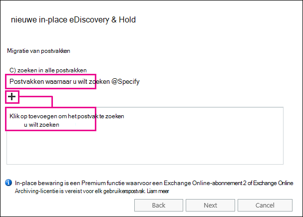

# Verwijderde items herstellen in het postvak van een gebruiker

**Dit artikel is bedoeld voor beheerders. Probeert u verwijderde items in uw eigen postvak te herstellen?** Voer een van de volgende handelingen uit:
- [Verwijderde items herstellen in Outlook voor Windows](https://support.office.com/article/49e81f3c-c8f4-4426-a0b9-c0fd751d48ce)
- [Verwijderde items of e-mail herstellen in Outlook Web app](https://support.office.com/article/c3d8fc15-eeef-4f1c-81df-e27964b7edd4)
- [Verwijderde e-mailberichten terugzetten in de webversie van Outlook](https://support.office.com/article/a8ca78ac-4721-4066-95dd-571842e9fb11)
- [Outlook.com](https://go.microsoft.com/fwlink/p/?LinkID=623435)
   
Heeft een gebruiker items permanent uit een postvak van Outlook verwijderd? De gebruiker wil ze weer, maar kan ze niet herstellen. Mogelijk kunt u de verwijderde items herstellen als deze niet permanent zijn verwijderd uit het postvak van de gebruiker. Dit doet u met het hulpprogramma in-place eDiscovery in Exchange Online om te zoeken naar verwijderde e-mailberichten en andere items, zoals contactpersonen, agenda-afspraken en taken, in het postvak van een gebruiker. Als u de verwijderde items hebt gevonden, kunt u deze exporteren naar een PST-bestand (ook wel een Outlook-gegevensbestand genoemd) dat de gebruiker vervolgens kan gebruiken om de items terug te zetten naar hun postvak.
  
Dit zijn de stappen voor het herstellen van verwijderde items in het postvak van een gebruiker. Hoe lang duurt het? Het eerste tijdstip kan 20 of 30 minuten duren voordat u alle stappen hebt uitgevoerd, afhankelijk van het aantal items dat u wilt herstellen.
  
> [!NOTE]
> U moet een beheerder van **Exchange** of **globale beheerder** zijn in Microsoft 365 of lid zijn van de rollen groep Organisatiebeheer in Exchange Online om de stappen in dit artikel uit te voeren. Zie [Over beheerdersrollen in Microsoft 365](https://support.office.com/article/da585eea-f576-4f55-a1e0-87090b6aaa9d) voor meer informatie. 
  
## Stap 1: uzelf machtigingen voor eDiscovery toewijzen

De eerste stap is om uzelf de benodigde machtigingen toe te wijzen in Exchange Online, zodat u het hulpmiddel in-place eDiscovery kunt gebruiken om in het postvak van een gebruiker te zoeken. U hoeft dit maar één keer te doen. Als u in de toekomst een ander postvak moet doorzoeken, kunt u deze stap overslaan.
  
1. [Waar u zich kunt aanmelden bij Microsoft 365 voor bedrijven](https://support.microsoft.com/office/where-to-sign-into-microsoft-365-for-business-e9eb7d51-5430-4929-91ab-6157c5a050b4) met uw werk-of schoolaccount. 
    
2. Selecteer het pictogram voor het startprogramma  in de linkerbovenhoek en klik op **beheerder**.
    
3. Vouw in het linker navigatieonderdeel in het Microsoft 365-Beheercentrum **admin Centers**uit en klik op **Exchange**.
    
    
  
4. Klik in het Exchange Admin Center op **machtigingen**en vervolgens op **beheerdersrollen**.
    
5. Selecteer **Discovery-beheer**in de lijstweergave en klik vervolgens op **Edit**  .
    
    
  
6. In **rollen groep**, onder **leden** **, klikt u**op  .
    
7. Selecteer in de lijst **leden**de optie uzelf in de lijst met namen, klik op **toevoegen**en klik vervolgens op **OK**.
    
    > [!NOTE]
    > U kunt ook een groep toevoegen waarvan u lid bent, zoals Organisatiebeheer of TenantAdmins. Als u een groep toevoegt, worden aan andere leden van de groep de juiste machtigingen toegewezen voor het uitvoeren van het hulpprogramma in-place eDiscovery. 
  
8. Klik in **rollen groep**op **Opslaan**.
    
9. Meld u af bij Microsoft 365.
    
    U moet zich afmelden voordat u aan de volgende stap begint, zodat de nieuwe machtigingen van kracht worden.
    
> [!CAUTION]
> Leden van de rollen groep Discovery-beheer hebben toegang tot gevoelige berichtinhoud. Dit geldt ook voor het zoeken van alle postvakken in uw organisatie, het bekijken van de zoekresultaten (en andere postvak items), het kopiëren van de resultaten naar een Discovery-postvak en het exporteren van de zoekresultaten naar een PST-bestand. 
  
[Return to top](recover-deleted-items-in-a-mailbox.md)
  
## Stap 2: zoeken naar verwijderde items in het postvak van de gebruiker

Wanneer u een in-place eDiscovery-zoekopdracht uitvoert, wordt de map herstelbare items in het postvak dat u zoekt, automatisch opgenomen in de zoekfunctie. De map herstelbare items is de locatie waar permanent verwijderde items worden opgeslagen totdat ze permanent worden verwijderd uit het postvak. Als een item niet is opgeschoond, moet u dit mogelijk vinden met behulp van het hulpprogramma in-place eDiscovery.
  
1. [Waar u zich kunt aanmelden bij Microsoft 365 voor bedrijven](https://support.microsoft.com/office/where-to-sign-into-microsoft-365-for-business-e9eb7d51-5430-4929-91ab-6157c5a050b4) met uw werk-of schoolaccount. 
    
2. Selecteer het pictogram voor het startprogramma  in de linkerbovenhoek en klik op **beheerder**.
    
3. Vouw in het linkernavigatievenster in het Microsoft 365-Beheercentrum **beheerder**uit en klik op **Exchange**.
    
4. Klik in het Exchange-Beheercentrum op **nalevings beheer**, klik op **in-place eDiscovery- &amp; bewaring**en klik vervolgens op **Nieuw**  .
    
    
  
5. Typ op de pagina **naam en beschrijving** een naam voor de zoekactie (zoals de naam van de gebruiker voor wie u e-mail wilt terugzetten), een optionele beschrijving en klik vervolgens op **volgende**.
    
6. Klik op de pagina **postvakken** op **postvakken opgeven om in te zoeken**en klik **vervolgens op**  .
    
    
  
7. Selecteer de naam van de gebruiker waarvoor u verwijderde e-mail terugzet, klik op **toevoegen**en klik vervolgens op **OK**.
    
8. Klik op **Volgende**.
    
    De pagina **zoekquery** wordt weergegeven. Hier definieert u de zoekcriteria die u helpen bij het vinden van de ontbrekende items in het postvak van de gebruiker. 
    
9. Vul op de pagina **zoekquery** de volgende velden in: 
    
  - **Alle inhoud opnemen** Selecteer deze optie als u alle inhoud in het postvak van de gebruiker wilt opnemen in de zoekresultaten. Als u deze optie selecteert, kunt u geen extra zoekcriteria opgeven. 
    
  - **Filteren op basis van criteria** Selecteer deze optie om de zoekcriteria op te geven, inclusief trefwoorden, begin-en einddatums, adressen van afzenders en geadresseerden, en bericht typen. 
    
    
  
|**Veld**|**Gebruik dit om...**|
|:-----|:-----|
|             |Geef trefwoorden, datumbereik, geadresseerden en bericht typen op.    |
|             |Zoek op berichten met trefwoorden of zinsdelen en gebruik logische operatoren, zoals **and** of **or**.    |
|             |Zoek op berichten die binnen een bepaald datumbereik zijn verzonden of ontvangen.    |
|             |Zoek op berichten die naar bepaalde personen zijn verzonden of die naar bepaalde personen zijn verzonden.    |
|             |Zoek op alle bericht typen of selecteer bepaalde bericht typen.    |
   
   > [!TIP]
   >  Hier volgen enkele tips voor het maken van een zoekquery voor het zoeken naar ontbrekende items. U kunt meer informatie krijgen van de gebruiker om een zoekquery te maken, zodat u kunt vinden wat u zoekt. Als u niet zeker weet hoe u een ontbrekend bericht kunt vinden, kunt u overwegen de optie **alle inhoud opnemen** te gebruiken. De zoekresultaten bevatten alle items in de map herstelbare items van de gebruiker, waaronder de verborgen map (de map opruimen) die items bevatten die door de gebruiker zijn verwijderd. Vervolgens gaat u naar stap 3, kopieert u de resultaten naar een Discovery-postvak en kijkt u of het bericht in de map verborgen is. Als u wilt weten wanneer het ontbrekende bericht oorspronkelijk door de gebruiker is verzonden of ontvangen, gebruikt u de opties **begindatum opgeven** en **einddatum opgeven** om een datumbereik op te geven. Hierdoor worden alle berichten weergegeven die door de gebruiker in dat datumbereik zijn verzonden of ontvangen. Het opgeven van een datumbereik is een zeer goede manier om de zoekresultaten te verfijnen. Als u weet wie de ontbrekende e-mail heeft verzonden, kunt u de afzender in het vak **van** opgeven. Als u de zoekresultaten wilt beperken tot verschillende typen postvak items, klikt u op **bericht typen selecteren**, klikt **u op Selecteer de bericht typen die u wilt zoeken**en kiest u een specifiek berichttype waarnaar u wilt zoeken. U kunt bijvoorbeeld alleen zoeken naar agenda-items of contactpersonen. Dit is een schermafbeelding van de verschillende bericht typen waarnaar u kunt zoeken. de standaardinstelling is om alle bericht typen te zoeken. 
  
   Klik op **volgende** wanneer u klaar bent met de pagina **zoekquery** . 
    
10. Klik op de pagina **instellingen voor in-place bewaring** op **Voltooien** om de zoekopdracht te starten. Als u verwijderde e-mail wilt herstellen, kunt u het postvak van de gebruiker in de wacht zetten. 
    
    Wanneer u de zoekopdracht hebt gestart, wordt in Exchange een schatting weergegeven van de totale grootte en het aantal items dat wordt geretourneerd door de zoekopdracht op basis van de criteria die u hebt opgegeven.
    
11. Selecteer de zoekactie die u zojuist hebt gemaakt **en klik op**  om de informatie in het deelvenster Details bij te werken. De status van de **geraamde raming** geeft aan dat de zoekactie is voltooid. Exchange geeft ook een schatting weer van het totale aantal items (en hun grootte) die zijn gevonden met de zoekopdracht op basis van de zoekcriteria die u hebt opgegeven in stap 9. 
    
12. Klik in het detailvenster op **voorbeeld van zoekresultaten** om de items weer te geven die zijn gevonden. Dit kan u helpen om te bepalen welke items u zoekt. Als u het item dat u wilt herstellen ziet, gaat u naar stap 4 om de zoekresultaten naar een PST-bestand te exporteren. 
    
    
  
13. Als u niet kunt vinden wat u zoekt, kunt u uw zoekcriteria wijzigen door de zoekopdracht te selecteren, op Bewerk pictogram **bewerken**te klikken  en vervolgens te klikken op **zoekquery**. Wijzig de zoekcriteria en voer de zoekopdracht opnieuw uit.
    
[Return to top](recover-deleted-items-in-a-mailbox.md)
  
## Option Stap 3: de zoekresultaten naar een Discovery-postvak kopiëren

Als u een item niet kunt vinden door een voorbeeld van de zoekresultaten weer te geven of als u wilt zien welke items zich bevinden in de map herstelbare items van de gebruiker, kunt u de zoekresultaten naar een speciaal postvak kopiëren (een Discovery-postvak genoemd) en dit postvak vervolgens openen in de webversie van Outlook om de werkelijke items weer te geven. De beste reden voor het kopiëren van de zoekresultaten is dat u de items in de map herstelbare items van de gebruiker kunt weergeven. Het is mogelijk dat het item dat u wilt herstellen zich bevindt in de submap opgeschoond. 
  
1. Ga in het Exchange Admin Center naar **nalevings beheer** \> **in-place eDiscovery- &amp; bewaring**.
    
2. Selecteer in de lijst met zoekopdrachten de opdracht die u in stap 2 hebt gemaakt.
    
3. Klik **op zoeken**  en klik in de vervolgkeuzelijst op **Zoekresultaten kopiëren** . 
    
    
  
4. Klik op de pagina **Zoekresultaten kopiëren** op **Bladeren**.
    
    
  
5. Klik onder **weergavenaam**op **Discovery Search mailbox**en klik vervolgens op **OK**.
    
    
  
    > [!NOTE]
    > Discovery Search mailbox is een standaarddiscovery-postvak dat automatisch wordt gemaakt in uw Microsoft 365-organisatie. 
  
6. Weer op de pagina **Zoekresultaten kopiëren** klikt u op **kopiëren** om het proces te starten waarmee de zoekresultaten naar Discovery Search mailbox worden gekopieerd. 
    
    
  
7. Klik op Vernieuwen **vernieuwen**  om de informatie over de Kopieer status bij te werken die in het detailvenster wordt weergegeven. 
    
8. Wanneer het kopiëren is voltooid, klikt u op **openen** om Discovery Search mailbox te openen om de zoekresultaten te bekijken. 
    
    
  
    De zoekresultaten die worden gekopieerd naar de Discovery Search mailbox, worden opgeslagen in een map met dezelfde naam als de in-place eDiscovery-zoekopdracht. U kunt op een map klikken om de items in die map weer te geven.
    
    
  
    Wanneer u een zoekopdracht uitvoert, wordt de map herstelbare items van de gebruiker ook gezocht. Dat betekent dat als de items in de map herstelbare items voldoen aan de zoekcriteria, ze worden opgenomen in de zoekresultaten. Items in de map Verwijderde items zijn items die de gebruiker permanent heeft verwijderd (door een item uit de map Verwijderde items te verwijderen of door het item te selecteren en op **Shift + Delete**te drukken. Gebruikers kunnen het hulpprogramma verwijderde items herstellen in Outlook of de webversie van Outlook gebruiken om items in de map Verwijderde items te herstellen. Items in de map Verwijderde items zijn items die de gebruiker heeft verwijderd met behulp van het hulpprogramma verwijderde items herstellen of items die zijn toegevoegd aan het postvak. In beide gevallen kan alleen een beheerder items in de map Verwijderde items herstellen. 
    
    > [!TIP]
    > Als een gebruiker een verwijderd item niet kan vinden met behulp van het hulpprogramma herstelbare items, maar dat item nog steeds herstelbaar is (wat betekent dat het niet permanent is verwijderd uit het Postvak), is het meer dan waarschijnlijk in de map Verwijderde items. Kijk in de map Verwijderde items naar het item dat u wilt herstellen voor een gebruiker. 
  
[Return to top](recover-deleted-items-in-a-mailbox.md)
  
## Stap 4: de zoekresultaten naar een PST-bestand exporteren

Wanneer u het item vindt dat u wilt herstellen voor een gebruiker, kunt u de resultaten van de zoekopdracht exporteren naar een PST-bestand. De gebruiker gebruikt in de volgende stap het PST-bestand om het verwijderde item terug te zetten naar het bijbehorende postvak.
  
1. Ga in het Exchange Admin Center naar **nalevings beheer** \> **in-place eDiscovery- &amp; bewaring**.
    
2. Selecteer in de lijst met zoekopdrachten de opdracht die u in stap 2 hebt gemaakt.
    
3. Klik op **exporteren naar een PST-bestand**.
    
    
  
4. Als u wordt gevraagd het hulpprogramma eDiscovery-export te installeren, klikt u op **uitvoeren**.
    
5. Klik in het hulpprogramma voor het exporteren van eDiscovery-PST-bestanden op **Bladeren** om de locatie op te geven waar u het PST-bestand wilt downloaden. 
    
    
  
    U kunt de opties voor ontdubbeling en het opnemen van niet-doorzoekbaar items negeren.
    
6. Klik op **starten** om het PST-bestand naar uw computer te downloaden. 
    
    Met het **hulpprogramma** voor het exporteren van EDISCOVERY-pst wordt statusinformatie over het exportproces weergegeven. Wanneer het exporteren is voltooid, kunt u het bestand openen op de locatie waar het is gedownload. 
    
[Return to top](recover-deleted-items-in-a-mailbox.md)
  
## Stap 5: de herstelde items herstellen in het postvak van de gebruiker

De laatste stap bestaat uit het PST-bestand dat in stap 4 is geëxporteerd om de herstelde items te herstellen in het postvak van de gebruiker. Nadat u het PST-bestand naar de gebruiker hebt verzonden, wordt de rest van deze stap uitgevoerd door de gebruiker om het PST-bestand te openen en vervolgens de herstelde items te verplaatsen naar een andere map in het postvak. U kunt de gebruiker ook een koppeling sturen naar dit onderwerp: [Outlook-gegevensbestanden (. PST) openen en sluiten](https://support.office.com/article/381b776d-7511-45a0-953a-0935c79d24f2)voor stapsgewijze instructies. U kunt de gebruiker ook een koppeling sturen naar het gedeelte [Verwijderde items terugzetten naar een postvak via een sectie van het PST-bestand](recover-deleted-items-in-a-mailbox.md#restoredeleteditems) en vragen om deze stappen uit te voeren. 
  
 **Het PST-bestand naar de gebruiker verzenden**
  
Voor de laatste stap die u moet uitvoeren, wordt het PST-bestand dat u in stap 4 hebt geëxporteerd, naar de gebruiker verzonden. U kunt dit op een aantal manieren doen:
  
- Voeg het PST-bestand toe aan een e-mailbericht. Als Outlook is geconfigureerd voor het blokkeren van PST-bestanden, moet u het bestand zip zip en toevoegen aan het bericht. Hier ziet u hoe dat gaat:
    
1. Blader in Windows Verkenner of bestandenverkenner naar het PST-bestand.
    
2. Klik met de rechtermuisknop op het bestand en selecteer **verzenden naar** \> **gecomprimeerde (gezipte) map**. Windows maakt een nieuw. zip-bestand en geeft het dezelfde naam als het PST-bestand.
    
3. Voeg het PST-bestand toe aan een e-mailbericht en stuur dit naar de gebruiker, die het bestand kan decomprimeren door erop te klikken.
    
- Kopieer het PST-bestand naar een gedeelde map waar de gebruiker het bestand kan openen en ophalen.
    
De stappen in de volgende sectie worden uitgevoerd door de gebruiker om de verwijderde items in het postvak van de verwijderde items te herstellen.
  
 
**Verwijderde items terugzetten naar een postvak met behulp van een PST-bestand**
  
U moet de bureaubladtoepassing van Outlook gebruiken om een verwijderd item te herstellen met een PST-bestand. U kunt Outlook Web app of de webversie van Outlook niet gebruiken voor het openen van een PST-bestand.
  
1. In Outlook 2013 of Outlook 2016, klikt u op het tabblad **bestand** . 
    
2. Klik **op &amp; export openen**en vervolgens op **Outlook-gegevensbestand openen**.
    
3. Blader naar de locatie waar u het PST-bestand hebt opgeslagen dat u van de beheerder hebt ontvangen.
    
4. Selecteer het PST-bestand en klik op **openen**.
    
    Het PST-bestand wordt weergegeven in de linkernavigatiebalk in Outlook.
    
    
  
5. Klik op de pijlen om het PST-bestand en de onderliggende mappen uit te vouwen om het item te zoeken dat u wilt herstellen.
    
    
  
    > [!TIP]
    > Zoek in de map Verwijderde items naar het item dat u wilt herstellen. Dit is een verborgen map waarin verwijderde items worden verplaatst naar. Het is waarschijnlijk dat het item dat de beheerder heeft hersteld zich in deze map bevindt. 
  
6. Klik met de rechtermuisknop op het item dat u wilt terugzetten **Move** en klik vervolgens op \> **andere map**verplaatsen.
    
    
  
7. Als u het item naar uw postvak in wilt verplaatsen, klikt u op **Postvak in**en vervolgens op **OK**.
    
    **Tip:** Als u een ander type item wilt herstellen, voert u een van de volgende handelingen uit: 
    
  - Als u een agenda-item wilt herstellen, klikt u er met de **Move** rechtermuisknop op en klikt u vervolgens op \> **andere map** \> **agenda**verplaatsen.
    
  - Als u een contactpersoon wilt herstellen, klikt u er met de **Move** rechtermuisknop op en klikt u vervolgens op \> **andere map** \> **contactpersonen**verplaatsen.
    
  - Als u een taak wilt herstellen, klikt u er met de rechter **Move** muisknop op en klikt u vervolgens op \> **andere maptaken** verplaatsen \> **Tasks**.
    

  
   > [!NOTE]
   > Agenda-items, contactpersonen en taken bevinden zich direct in de map Verwijderde items, niet in een submap van de map Agenda, contactpersonen of taken. U kunt echter sorteren op **type** om vergelijkbare soorten items te groeperen. 
    
8. Wanneer u klaar bent met het terugzetten van verwijderde items, klikt u met de rechtermuisknop op het PST-bestand in de linkernavigatiebalk en selecteert u **' naam van PST-bestand ' sluiten**.
    
[Return to top](recover-deleted-items-in-a-mailbox.md)
  
## Meer informatie

- Het kan voorkomen dat een gebruiker een permanent verwijderd item kan herstellen als de bewaarperiode voor het item niet is verlopen. Als beheerder kunt u opgegeven hoelang items in de map herstelbare items beschikbaar zijn voor herstel. Het kan voorkomen dat er een beleid is waarmee de map Verwijderde items van een gebruiker 30 dagen in de map Verwijderde items van een gebruiker wordt verwijderd, en een ander beleid waarmee gebruikers items in de map herstelbare items gedurende een andere 14 dagen kunnen herstellen. Na deze 14 dagen kunt u mogelijk nog steeds een item in het postvak van een gebruiker herstellen met behulp van de procedures in dit onderwerp.
    
- Gebruikers kunnen een verwijderd item herstellen als het niet is opgeschoond en de bewaarperiode van het verwijderde item voor dat item niet is verlopen. Om gebruikers te helpen met het herstellen van verwijderde items in hun postvak, wijst u ze toe aan een van de volgende onderwerpen:
    
  - [Verwijderde items herstellen in Outlook voor Windows](https://support.office.com/article/49e81f3c-c8f4-4426-a0b9-c0fd751d48ce)
    
  - [Verwijderde items herstellen in Outlook 2010](https://support.office.com/article/cd9dfe12-8e8c-4a21-bbbf-4bd103a3f1fe)
    
  - [Verwijderde items of e-mail herstellen in Outlook Web app](https://support.office.com/article/c3d8fc15-eeef-4f1c-81df-e27964b7edd4)
    
  - [Verwijderde e-mailberichten terugzetten in de webversie van Outlook](https://support.office.com/article/a8ca78ac-4721-4066-95dd-571842e9fb11)
    
  - [Een verwijderde contactpersoon in Outlook herstellen](https://support.office.com/article/51c83288-6888-4dcd-8c99-4932daabf643)
    
  - [Verwijderde e-mailberichten in Outlook.com herstellen](https://go.microsoft.com/fwlink/p/?LinkID=623435)
    
[Return to top](recover-deleted-items-in-a-mailbox.md)
  

