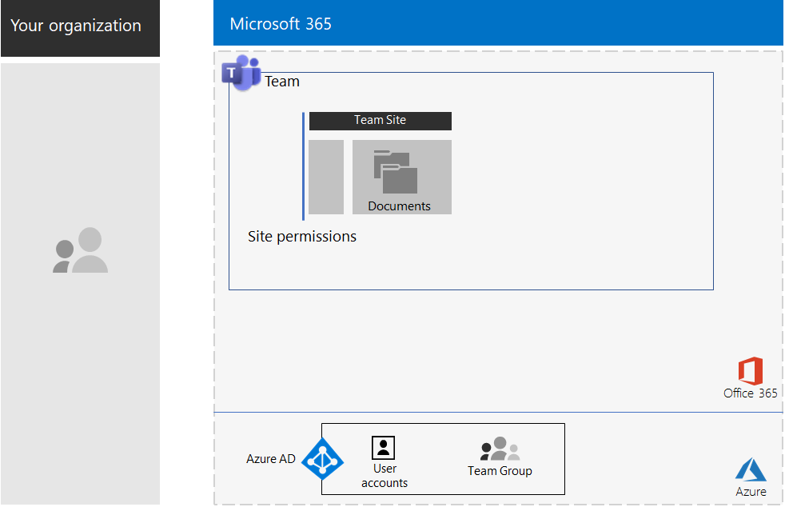
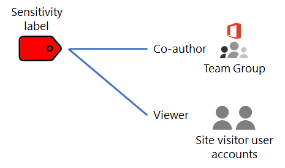

# Teams voor sterk gereglementeerde gegevensTeams for highly regulated data

Dit artikel bevat aanbevelingen en stappen voor het configureren van een privéteam in Microsoft Teams waarmee alleen toegang wordt verleend tot Teams-functies, zoals chats, vergaderingen en bestanden, aan leden en eigenaren van de Office 365-groep voor het team.This article provides you with recommendations and steps to configure a private team in Microsoft Teams that locks down access to Teams features—such as chats, meetings, and files—to only members and owners of the Office 365 group for the team. 

Naast de privétoegang op basis van de Office 365-groep, wordt in dit artikel beschreven hoe u de onderliggende SharePoint-privéteamsite configureert die u kunt openen vanuit de sectie **Bestanden** van een teamkanaal, voor de extra beveiliging die nodig is voor het opslaan van sterk gereglementeerde gegevens.Beyond the private access based on the Office 365 group, this article describes how to configure the underlying private SharePoint team site, which you can access from the **Files** section of a team channel, for the additional security needed to store highly regulated data. Op deze SharePoint-teamsite kunt u bestanden, pagina's, een gedeelde agenda, taken, een notitieblok en lijsten opslaan en hieraan samenwerken.On this SharePoint team site, you can store and collaborate on files, pages, a shared calendar, tasks, a notebook, and lists.

>[!Note]
> Een vergelijkbaar scenario waarin SharePoint wordt gebruikt, vindt u [hier](teams-sharepoint-online-sites-highly-regulated-data.md).A similar scenario using SharePoint is [here](teams-sharepoint-online-sites-highly-regulated-data.md).
>

De elementen van de configuratie van een team voor sterk gereglementeerde gegevens zijn:The elements of configuration for a team for highly regulated data are:

- Een privéteam met een bijbehorende Office 365-groep met gebruikersaccounts voor eigenaren en leden.A private team with a corresponding Office 365 group that has owner and member user accounts.
- Extra beveiliging voor de onderliggende SharePoint-site voor het team waarmee:Additional security on the underlying SharePoint site for the team that:
  - Wordt voorkomen dat leden van de site toegang verlenen aan anderen.Prevents members of the site from granting access to others.
  - Wordt voorkomen dat niet-leden van de site toegang tot de site vragen.Prevents non-members of the site from requesting access to the site.
- Een Office 365-retentielabel voor de onderliggende SharePoint-site dat automatisch wordt toegepast op nieuwe bestanden op de site als standaardmethode voor het definiëren van bewaarbeleid.An Office 365 retention label for the underlying SharePoint site that is automatically applied to new files on the site as a default way to define retention policies.
- Een beleid voor preventie van gegevensverlies (DLP) waarbij het retentielabel wordt gebruikt en gebruikers de bestanden niet kunnen delen of buiten de organisatie kunnen verzenden.A Data Loss Prevention (DLP) policy that uses the retention label and blocks users from sharing or sending files outside the organization.
- Een Office 365-gevoeligheidslabel of een sublabel van een sterk gereglementeerd label waarvoor versleuteling is ingeschakeld en machtigingen voor Medeauteurs zijn ingesteld voor de Office 365-groep van het team.An Office 365 sensitivity label or a sublabel of a highly regulated label that has encryption enabled and Co-Author permissions for the Office 365 group of the team. Gebruikers passen het label of sublabel toe op bestanden die zijn opgeslagen in de sectie **Bestanden** van het team met de optie **Gevoeligheid** op de menubalk in Word, Excel en PowerPoint.Users apply the label or sublabel to files stored in **Files** section of the team from the **Sensitivity** menu bar option in Word, Excel, and PowerPoint.

Hier ziet u de resulterende configuratie met een gevoeligheidslabel.Here is the resulting configuration with a sensitivity label.

Bekijk deze korte video voor een kort overzicht.For a quick overview, watch this short video.

> [!VIDEO https://www.microsoft.com/videoplayer/embed/RE4mGHf]

Zie de [Poster voor Teams voor sterk gereglementeerde gegevens](../media/secure-teams-highly-regulated-data-scenario/TeamsHighlyRegulatedData.pdf) voor een overzicht van één pagina van dit scenario.For a 1-page summary of this scenario, see the [Teams for highly regulated data poster](../media/secure-teams-highly-regulated-data-scenario/TeamsHighlyRegulatedData.pdf).

U kunt deze poster ook downloaden in [PDF-](https://github.com/MicrosoftDocs/microsoft-365-docs/raw/public/microsoft-365/media/secure-teams-highly-regulated-data-scenario/TeamsHighlyRegulatedData.pdf) of [PowerPoint-](https://github.com/MicrosoftDocs/microsoft-365-docs/raw/public/microsoft-365/media/secure-teams-highly-regulated-data-scenario/Teams-Highly-Regulated-Data-Poster.pptx) indeling en deze afdrukken op papier met formaat Letter, Legal of Tabloid (27,9 x 43,2 cm).You can also download this poster in [PDF](https://github.com/MicrosoftDocs/microsoft-365-docs/raw/public/microsoft-365/media/secure-teams-highly-regulated-data-scenario/TeamsHighlyRegulatedData.pdf) or [PowerPoint](https://github.com/MicrosoftDocs/microsoft-365-docs/raw/public/microsoft-365/media/secure-teams-highly-regulated-data-scenario/Teams-Highly-Regulated-Data-Poster.pptx) formats and print it on letter, legal, or tabloid (11 x 17)-sized paper.

## Fase 1: Een team configureren voor sterk gereglementeerde gegevensPhase 1: Configure a team for highly regulated data

De configuratie van de end-to-end-servers bestaat uit de volgende stappen:The end-to-end configuration consists of these steps:

1. Identiteit en apparaattoegang configureren.Configure identity and device access.
2. Een privéteam maken.Create a private team.
3. De onderliggende SharePoint-site configureren voor extra beveiliging.Configure the underlying SharePoint site for additional security.
4. Een retentielabel en DLP-beleid maken.Create a retention label and DLP policy.
5. Het label of sublabel van het sterk gereglementeerde label maken.Create the label or sublabel of the highly regulated label.

### Stap 1: identiteit en apparaattoegang configurerenStep 1: Configure identity and device access

Als u de toegang tot het team en de SharePoint-site wilt beveiligen, zorgt u ervoor dat u [identiteits- en apparaattoegangsbeleid](https://docs.microsoft.com/microsoft-365/enterprise/identity-access-policies) en het aanbevolen [SharePoint Online-toegangsbeleid](https://docs.microsoft.com/microsoft-365/enterprise/sharepoint-file-access-policies) hebt geconfigureerd.To protect access to the team and its underlying SharePoint site, ensure that you have configured [identity and device access policies](https://docs.microsoft.com/microsoft-365/enterprise/identity-access-policies) and the recommended [SharePoint Online access policies](https://docs.microsoft.com/microsoft-365/enterprise/sharepoint-file-access-policies).

### Stap 2: een privéteam makenStep 2: Create a private team

Volg [deze instructies](https://support.office.com/article/create-a-team-from-scratch-174adf5f-846b-4780-b765-de1a0a737e2b) om een privéteam te maken.Use [these instructions](https://support.office.com/article/create-a-team-from-scratch-174adf5f-846b-4780-b765-de1a0a737e2b) to create a private team.

Wanneer u een privéteam maakt, zijn dit de standaardmachtigingen:When you create a private team, here are the default permissions:

- De Office 365-groep voor het team (de teamgroep) heeft groepseigenaren en groepsledenThe Office 365 group for the team (the Team Group) has group owners and group members
- Voor de onderliggende SharePoint-site voor het team (de teamsite):For the underlying SharePoint site for the team (the Team Site):
  - De beheerders van de siteverzameling zijn geconfigureerd als de eigenaren van de teamgroepThe Site Collection Administrators is configured for the Team Group owners
  - Voor de teamsite:For the Team Site: 
    - De SharePoint-groep met teamsite-eigenaren, met het machtigingsniveau Volledig beheer, is ingesteld op de eigenaren van de teamgroepThe Team Site Owners SharePoint group—with the Full Control permission level—is set to the Team Group owners
    - De SharePoint-groep met teamsiteleden, met het machtigingsniveau Bewerken, is ingesteld op de leden van de teamgroepThe Team Site Members SharePoint group—with the Edit permission level—is set to the Team Group members
    - De SharePoint-groep met bezoekers van de teamsite, met het machtigingsniveau Lezen, heeft geen groepen of gebruikersaccounts.The Team Site Visitors SharePoint group—with the Read permission level—has no groups or user accounts

Dit zijn de standaardmachtigingen voor de teamsite.Here are the default permissions for the Team Site.

 
>[!Note]
>Als u de \<teamnaam > SharePoint-groep Eigenaren bekijkt voor het machtigingsniveau Bewerken, wordt \<teamnaam > Eigenaren niet weergegeven.If you view the \<team name> Owners SharePoint group for the Edit permission level, it does not display \<team name> Owners.
>

Met de resulterende machtigingen kunnen:The resulting permissions allow:

- Eigenaren van de teamgroep de site beheren en beschikken over volledige controle over de inhoud van de site.Team Group owners to administer the site and have full control over the site contents.
- Leden van de teamgroep bestanden op de site maken en bewerken.Team Group members to create and edit files on the site. 

Het onderhoud van machtigingen is hetzelfde als het onderhoud van teamleden en eigenaren.Permissions maintenance is the same as team member and owner maintenance.

Dit is de resulterende configuratie tot nu toe.Here’s the resulting configuration so far.

 
### Stap 3: de onderliggende SharePoint-site configureren voor extra beveiligingStep 3: Configure the underlying SharePoint site for additional security

Configureer deze machtigingsinstellingen vanaf de teamsite.From the Team Site, configure these permission settings.

1. Klik in de werkbalk op het pictogram Instellingen en vervolgens op **Site-machtigingen**.In the tool bar, click the settings icon, and then click **Site permissions**.
2. Klik in het deelvenster **Site-machtigingen**, onder **Instellingen voor delen** op **Instellingen voor delen wijzigen**.In the **Site permissions** pane, under **Sharing Settings**, click **Change sharing settings**.
3. Kies onder **Machtigingen voor delen**, **Alleen site-eigenaren kunnen bestanden, mappen en de site delen**.Under **Sharing permissions**, choose **Only site owners can share files, folders, and the site**.
4. Schakel **Toegangsaanvragen toestaan** uit en klik op **Opslaan**.Turn off **Allow access requests**, and then click **Save**.

Met deze instellingen kunnen leden van de teamsite de teamsite niet delen met andere leden en kunnen niet-leden geen toegang tot de site aanvragen.With these settings, the ability for Team Group members to share the Team Site with other members or for non-members to request access to the Team Site is disabled.

Dit is de resulterende configuratie tot nu toe.Here’s the resulting configuration so far.

 
### Stap 4: een retentielabel en DLP-beleid makenStep 4: Create a retention label and DLP policy

Volg [deze instructies](https://docs.microsoft.com/microsoft-365/security/office-365-security/deploy-teams-retention-dlp) om:Use [these instructions](https://docs.microsoft.com/microsoft-365/security/office-365-security/deploy-teams-retention-dlp) to:

1. Een retentielabel voor sterk gereglementeerde gegevens (indien nodig) te maken en te publiceren.Create and publish a retention label for highly regulated data (if needed).
2. De teamsite te configureren voor het in stap 1 gemaakte retentielabel.Configure the Team Site for the retention label created in step 1.
3. DLP-beleid te maken voor sterk gereglementeerde gegevens die het in stap 2 gemaakte retentielabel gebruiken en waarmee gebruikers bestanden niet buiten de organisatie kunnen verzenden.Create a DLP policy for highly regulated data that uses the retention label created in step 2 and blocks users from sending files outside the organization. U kunt het beleid ook configureren voor aanvullende vereisten, zoals die voor de regelgeving voor gezondheidsinstanties en de financiële sector, op basis van [DLP-beleidssjablonen](https://docs.microsoft.com/microsoft-365/compliance/data-loss-prevention-policies#dlp-policy-templates).You can also configure the policy for additional requirements, such as those for health and financial industry regulations, based on [DLP policy templates](https://docs.microsoft.com/microsoft-365/compliance/data-loss-prevention-policies#dlp-policy-templates).

Dit is de resulterende configuratie tot nu toe.Here’s the resulting configuration so far.

 
### Stap 5: een gevoeligheidslabel of een sublabel maken van het sterk gereglementeerde gevoeligheidslabelStep 5: Create a sensitivity label or a sublabel of the highly regulated sensitivity label

Een beveiligd team heeft, in tegenstelling tot een gevoeligheidslabel voor sterk gereglementeerde gegevens die iedereen op een bestand kan toepassen, een eigen label of sublabel nodig, zodat toegewezen bestanden:Unlike a sensitivity label for highly regulated data that anyone can apply to any file, a secure team needs its own label or sublabel so that assigned files:

- Zijn versleuteld en de versleuteling wordt meeverplaatst met het bestand.Are encrypted and the encryption travels with the file.
- Aangepaste machtigingen bevatten, zodat alleen leden van de teamgroep ze kunnen openen.Contain custom permissions so that only members of the Team Group can open it.

Om dit extra beveiligingsniveau te halen voor bestanden die zijn opgeslagen op de teamsite, moet u een nieuw gevoeligheidslabel configureren dat een afzonderlijk label is of een sublabel van het algemene label voor sterk gereglementeerde bestanden.To accomplish this additional level of security for files stored in the Team Site, you must configure a new sensitivity label that is either its own label a sublabel of the general label for highly regulated files. Alleen leden van de teamgroep zien dit in hun lijst met labels.Only Team Group members will see it in their list of labels.

Gebruik een gevoeligheidslabel wanneer u een klein aantal labels nodig hebt voor zowel algemeen gebruik als afzonderlijke privéteams.Use a sensitivity label when you need a small number of labels for both global use and individual private teams. Gebruik een gevoeligheidssublabel wanneer u een groot aantal labels nodig hebt of als u labels wilt organiseren voor privéteams onder het sterk gereglementeerde label.Use a sensitivity sublabel when you have a large number of labels or want to organize labels for private teams under the highly regulated label.

[Gebruik deze instructies](https://docs.microsoft.com/microsoft-365/compliance/encryption-sensitivity-labels) om een afzonderlijk label of sublabel met de volgende instellingen te configureren:[Use these instructions](https://docs.microsoft.com/microsoft-365/compliance/encryption-sensitivity-labels) to configure a separate label or a sublabel with the following settings:

- De naam van het label bevat de naam van het teamThe name of the label contains the name of the team
- Versleuteling is ingeschakeldEncryption is enabled
- De sitegroep heeft machtigingen voor MedeauteursThe Team Group has Co-Author permissions

Hier ziet u de resulterende configuratie met het nieuwe label.Here’s the resulting configuration with the new label.

Hier ziet u de relatie tussen het gevoeligheidslabel en de teamgroep.Here’s the relationship between the sensitivity label and the Team Group.

>[!Note]
>Als u het gevoeligheidslabel of -sublabel configureert voor door de gebruiker gedefinieerde machtigingen of met een vervaldatum, kunt u het bestand niet openen vanuit Teams of SharePoint.If you configure the sensitivity label or sublabel for user-defined permissions or with an expiration date, you cannot open the file from Teams or SharePoint. U moet een Office-app gebruiken.You must use an Office app.
>

### Aangepaste machtigingenCustom permissions

U kunt ook aangepaste SharePoint-sitemachtigingen configureren voor de teamsite en zo nodig ook het bijbehorende gevoeligheidslabel.You can also configure custom SharePoint site permissions for the Team Site and, if needed, its corresponding sensitivity label. Hier volgen twee voorbeelden.Here are two examples.

#### Voorbeeld 1: het beheer van SharePoint-sites delegerenExample 1: Delegating SharePoint site administration

Als de teameigenaar geen ervaring heeft met het beheer van SharePoint of het beheer van de teamsite wil delegeren, kan hij of zij het gebruikersaccount van een SharePoint-beheerder toevoegen aan de lijst met teameigenaren.If the team owner does not have SharePoint administration experience or wants to delegate administration of the Team Site, they could add the user account of a SharePoint administrator to the list of team owners. De SharePoint-beheerder heeft dan echter volledige toegang tot het team en alle bijbehorende resources en kan bestanden openen waarop het gevoeligheidslabel is toegepast.But then the SharePoint administrator would have full access to the team and all its resources and would be able to open a file with the sensitivity label applied. 

Om te voorkomen dat er te veel bevoegdheden worden verleend, voegt u het gebruikersaccount van de SharePoint-beheerder toe aan de SharePoint-groep met teamsite-eigenaren in de geavanceerde machtigingsinstellingen van de site.To prevent this over-granting of privileges, add the user account of the SharePoint administrator to the Team Site Owners SharePoint group in the advanced permissions settings of the site. De SharePoint-beheerder kan de site beheren, maar heeft geen toegang tot het team of de bijbehorende resources en kan de bestanden waaraan het gevoeligheidslabel is toegewezen, niet openen.The SharePoint administrator can administer the site but will not be able to access the team and any of its resources or open the files with the sensitivity label assigned.

#### Voorbeeld 2: alleen-lezen toegang tot bestanden met een label toestaanExample 2: Allowing view-only access to labeled files

Als sommige medewerkers alleen de inhoud van gelabelde bestanden op de teamsite hoeven te bekijken, voegt u hun individuele gebruikersaccounts toe aan de:If some staff only need to view the contents of labeled files in the Team Site, add their individual user accounts to the:

- \<teamnaam > groep SharePoint-bezoekers, die standaard het machtigingsniveau Lezen heeft.\<team name> Visitors SharePoint group, which by default has the Read permission level. 
- Het gevoeligheidslabel met de machtigingen voor bezoekers.The sensitivity label with the Viewer permissions.

Dit zijn de resulterende machtigingen voor het label.Here are the resulting permissions on the label.

 
De sitebezoekers hebben rechtstreeks toegang tot de teamsite en kunnen de inhoud bekijken van bestanden waarop het sublabel is toegepast.The site visitors will be able to access the Team Site directly and view the contents of files that have the sublabel applied. Maar omdat ze geen lid zijn van de teamgroep, hebben ze geen toegang tot het team of de bijbehorende resources.But because they are not members of the Team Group, they will not be able to access the team or any of its resources.

## Fase 2: Ingebruikname door teamleden bevorderenPhase 2: Drive user adoption for team members

Nu het team is ingesteld, is het tijd om de ingebruikname van dit team en de extra beveiliging voor teamleden te stimuleren.With the team in place, it’s time to drive the adoption of this team and its additional security to team members.

### Stap 1: uw gebruikers trainenStep 1: Train your users

Leden van de teamgroep hebben toegang tot het team en alle bijbehorende resources, inclusief chats, vergaderingen en andere apps.Members of the Team Group can access the team and all of its resources, including chats, meetings, and other apps. Wanneer u werkt met bestanden in de sectie **Bestanden** van een kanaal, moeten leden van de teamgroep het gevoeligheidslabel of -sublabel toewijzen aan bestanden die zijn gemaakt voor het beveiligde team.When working with files from the **Files** section of a channel, members of the Team Group must assign the sensitivity label or sublabel to files created for the secure team. Hier ziet u een voorbeeld.Here’s an example.

 
Wanneer het label wordt toegepast op het bestand, is het beveiligd.When the label gets applied to the file it is secured. Leden van de teamgroep kunnen het bestand openen in Teams en in realtime samenwerken.Members of the Team Group can open it in Teams and collaborate in real time. Het bestand is versleuteld en de machtigingen voor medeauteurs zijn ingesteld op de leden van de teamgroep.It is encrypted and includes the Co-Author permissions set to the Team Group members. Als het bestand de site verlaat en wordt doorgestuurd naar een kwaadwillende gebruiker, moet hij of zij referenties opgeven voor een gebruikersaccount dat lid is van de teamgroep om het bestand te openen en de inhoud te bekijken.If the file leaves the site and gets forwarded to a malicious user, they will have to supply credentials of a user account that is member of the Team Group to open the file and view its contents. 

Leer uw teamleden:Train your team members:

- het belang van het gebruik van het nieuwe team voor chats, vergaderingen, bestanden en de andere resources van de teamsite en de consequenties van een gegevenslek van sterk gereglementeerde gegevens, zoals juridische gevolgen, boetes, ransomware of verlies van concurrentievoordeel.On the importance of using the new team for chats, meetings, files, and the other resources of the Team Site and the consequences of a highly regulated data leak, such as legal ramifications, regulatory fines, ransomware, or loss of competitive advantage.
- hoe ze toegang hebben tot het team.How to access the team.
- hoe ze nieuwe bestanden op de site kunnen maken en nieuwe bestanden kunnen uploaden die lokaal zijn opgeslagen.How to create new files on the site and upload new files stored locally.
- hoe het DLP-beleid voorkomt dat ze bestanden extern delen.How the DLP policy blocks them from sharing files externally.
- hoe ze het aangepaste label of sublabel voor het team kunnen toepassen op bestanden.How to label files with the custom label or sublabel for the team.
- hoe het label of sublabel bestanden beschermt, zelfs wanneer deze buiten de site worden gelekt.How the label or sublabel protects files even when they are leaked off the site.

Bij deze training horen praktijkoefeningen, zodat de teamleden deze functies en de resultaten ervan kunnen ervaren.This training should include hands-on exercises so that your team members can experience these capabilities and their results.

### Stap 2: periodiek het gebruik bekijken en feedback van teamleden verwerkenStep 2: Conduct periodic reviews of usage and address team member feedback

In de weken na de training:In the weeks after training:

- Verwerk de feedback van teamleden snel en verfijn beleidsregels en configuraties.Quickly address team member feedback and fine tune polices and configurations.
- Analyseer het gebruik van het team en vergelijk dit met gebruiksverwachtingen.Analyze usage for the team and compare it with usage expectations.
- Verifieer dat gereglementeerde bestanden juist zijn gelabeld met het aangepaste gevoeligheidslabel of sublabel.Verify that highly regulated files have been properly labeled with the custom sensitivity label or sublabel.

  U kunt zien welke bestanden een label hebben door een map te bekijken in SharePoint en de kolom **Gevoeligheid** toe te voegen met de optie **Kolommen weergeven/verbergen** of **Kolom toevoegen**.You can see which files have a label assigned by viewing a folder in SharePoint and adding the **Sensitivity** column through the **Show/hide columns** option of **Add column**.

School de gebruikers indien nodig bij.Retrain your users as needed.

## Laat dit zien in een testomgevingDemonstrate this in a test environment

Zie [deze instructies](https://docs.microsoft.com/microsoft-365/security/office-365-security/secure-team-for-files-in-a-dev-test-environment) als u uw eigen testomgeving wilt maken om teams te testen op gevoelige en zeer vertrouwelijke bestanden.To build out your own test environment to test teams for sensitive and highly confidential files, see [these instructions](https://docs.microsoft.com/microsoft-365/security/office-365-security/secure-team-for-files-in-a-dev-test-environment). 

## Hoe Contoso Corporation een beveiligd team gebruikte voor een zeer geheim projectHow the Contoso Corporation used a secure team for a top-secret project

De Contoso Corporation is een fictief maar representatief wereldwijd productieconglomeraat.The Contoso Corporation is a fictional but representative global manufacturing conglomerate. Bekijk hoe Contoso de ingebruikname van een [beveiligd team](contoso-team-for-top-secret-project.md) heeft gestimuleerd voor een zeer geheim project waarin nieuwe producten en services werden ontwikkeld en op de markt gebracht.See how Contoso configured and drove the adoption of a [secure team](contoso-team-for-top-secret-project.md) for a top secret project to develop and bring to market a new set of products and services. 

## Zie ookSee also

[SharePoint-sites voor sterk gereglementeerde gegevensSharePoint sites for highly regulated data](teams-sharepoint-online-sites-highly-regulated-data.md)

[Microsoft 365 Enterprise-bedrijfsworkloads en -scenario'sMicrosoft 365 Enterprise workloads and scenarios](deploy-workloads.md)

[Microsoft 365 Productivity Library](https://aka.ms/productivitylibrary) (https://aka.ms/productivitylibrary)[Microsoft 365 Productivity Library](https://aka.ms/productivitylibrary) (https://aka.ms/productivitylibrary)

[ImplementatiehandleidingDeployment guide](deploy-microsoft-365-enterprise.md)
