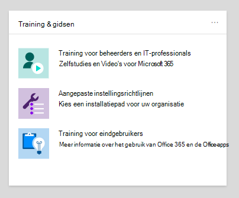
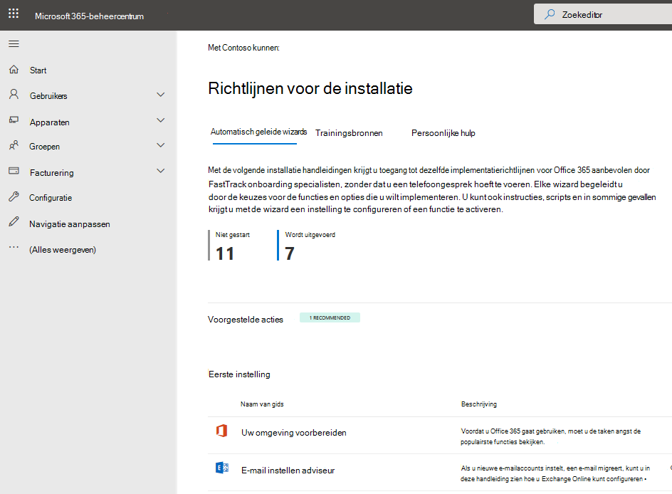
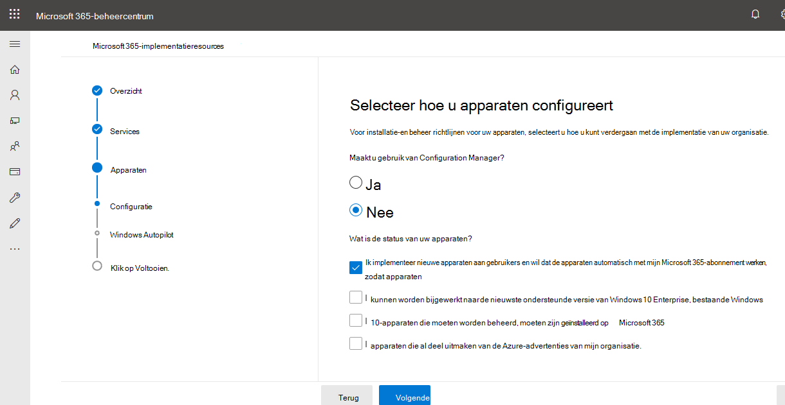

# Installatie handleidingen voor Microsoft 365 en Office 365-Services

Met behulp van de installatie handleidingen voor Microsoft 365 en Office 365 krijgt u informatie over richtlijnen en bronnen voor het plannen en implementeren van uw Tenant, apps en services. Deze gidsen worden gemaakt met behulp van de aanbevolen procedures voor het delen van [FastTrack van Microsoft 365](https://www.microsoft.com/fasttrack/microsoft-365) met behulp van zelfstandige interacties en zijn beschikbaar voor alle beheerders in het microsoft 365-Beheercentrum. Hiermee geeft u informatie over de productinstallatie, het inschakelen van beveiligingsfuncties, het implementeren van samenwerkingsprogramma's en het verschaffen van scripts waarmee u geavanceerde implementaties kunt versnellen.

## Installatie handleidingen openen in het Microsoft 365-Beheercentrum

De installatie handleidingen zijn toegankelijk via de pagina [Setup-richt](https://aka.ms/setupguidance) lijnen in het microsoft 365-Beheercentrum. U kunt de status van uw voortgang bijhouden en u kunt op elk gewenst moment terugkeren naar een handleiding. U komt als volgt op de pagina met de **installatie-instructies** :

1. Ga in het [Microsoft 365-Beheercentrum](https://admin.microsoft.com/)naar de **Start** pagina.

2. Zoek de kaart **& gids voor trainingen** . 

   

3. Selecteer **aangepaste instellingsrichtlijnen**.

   

>[!NOTE]
>Beheerdersmachtigingen voor tenants zijn vereist voor toegang tot het Microsoft 365-Beheercentrum.

## Hoe werken installatie gidsen in het Microsoft 365-Beheercentrum?

Elke handleiding biedt u stapsgewijze instructies, informatiebronnen, artikelen, en indien nodig kunt u scripts gebruiken om wijzigingen aan te brengen in de configuratie. Deze gidsen bieden u de keuzen die de specifieke behoeften van zowel kleine als grote organisaties weerspiegelt. Daarnaast biedt de richtlijnen ondersteuning voor zowel nieuwe als meer ervaren beheerders.

U kunt de hulplijnen gebruiken om meer te weten te komen over specifieke functies van Microsoft 365 en Office 365 tijdens de planningsfase, tijdens de implementatie en implementatie, of om deze opnieuw te bekijken nadat u een implementatie hebt voltooid om een instelling te wijzigen.

## Handleidingen voor de eerste installatie

### Uw omgeving voorbereiden

De handleiding de [omgeving voorbereiden](https://aka.ms/prepareyourenvironment) helpt bij het voorbereiden van uw organisatie omgeving voor microsoft 365 en Office 365-Services. Ongeacht uw doelstellingen, zijn er taken die u moet uitvoeren om ervoor te zorgen dat u een succesvolle implementatie uitvoert. Om fouten te voorkomen tijdens het voorbereiden van uw omgeving, kunt u stapsgewijze instructies volgen voor het verbinden van uw domein, het toevoegen van gebruikers, het toewijzen van licenties, het instellen van e-mail met Exchange Online en het installeren of implementeren van Office-apps. 

### E-mail instellen adviseur

De [e-mailinstellingen adviseur](https://aka.ms/office365setup) biedt u de stapsgewijze instructies voor het configureren van Exchange Online voor uw organisatie. Dit omvat het instellen van nieuwe e-mailaccounts, het migreren van e-mailberichten en het configureren van e-mail beveiliging. Voor een geslaagde e-mail configuratie gebruikt u deze adviseur en ontvangt u de aanbevolen migratiemethode op basis van het huidige e-mailsysteem van uw organisatie, het aantal te migreren postvakken en de manier waarop u gebruikers en hun toegang wilt beheren.

### Gmail-contactpersonen en agenda adviseur

Wanneer u het postvak van een Gmail-gebruiker migreert naar Microsoft 365, worden e-mailberichten gemigreerd, maar niet de contacten en agenda-items. De [Gmail-contactpersonen en de agenda adviseur](https://aka.ms/gmailcontactscalendar) bevat stappen voor het importeren van Google-contactpersonen en Google agenda-items in microsoft 365 met behulp van de import-en exportmethoden van Outlook.com, de Outlook-client of PowerShell.

### Microsoft 365 Deployment adviseur

De [Microsoft 365 Deployment adviseur](https://aka.ms/microsoft365setupguide) bevat richtlijnen voor het instellen van productiviteitsprogramma's, beveiligingsbeleid en mogelijkheden voor Apparaatbeheer. Met een Microsoft 365 Business Premium-of Microsoft 365 voor Enterprise-abonnement, kunt u deze adviseur gebruiken voor het instellen en configureren van de apparaten van uw organisatie. 

U ontvangt richtlijnen en toegang tot bronnen voor het inschakelen van de cloudservices, het bijwerken van apparaten naar de nieuwste ondersteunde versie van Windows 10 en het deelnemen aan Azure Active Directory (Azure AD), allemaal op één centrale locatie.

### Installatiehandleiding voor extern werken

De [Installatiehandleiding voor extern werken](https://aka.ms/remoteworksetup) biedt organisaties de tips en bronnen die nodig zijn om ervoor te zorgen dat uw gebruikers extern kunnen werken, uw gegevens zijn beveiligd en de referenties van gebruikers worden beveiligd. 

U ontvangt richtlijnen voor het optimaliseren van het verkeer van externe werknemers aan Microsoft 365-bronnen in de Cloud en het netwerk van uw organisatie, waardoor de naam van de RAS VPN-infrastructuur wordt beperkt. 

### Installatiehandleiding voor Windows virtueel bureaublad

Windows virtueel bureaublad is een uitgebreide bureaublad-en app-virtualisatiesoftware die wordt uitgevoerd in de Cloud. Het is de enige VDI (Virtual Desktop Infrastructure) voor eenvoudiger beheer, meervoudige Windows 10, optimalisering voor Microsoft 365-apps en ondersteuning voor RDS-omgevingen (Remote Desktop Services). Implementeer en schaal uw Windows-bureaubladen en-apps in een paar minuten en profiteer van de ingebouwde functies voor beveiliging en naleving. 

De [Installatiehandleiding voor het Windows-bureaublad](https://aka.ms/wvdsetupguide) biedt beheerders ondersteuning voor het plannen van bronnen en de vereisten voor implementatie, installatie-instructies en aanvullende bronnen. 

## Handleidingen voor verificatie en toegang

### Installatiehandleiding voor Azure AD

De [Installatiehandleiding voor Azure AD](https://aka.ms/aadpguidance) biedt informatie waarmee u ervoor kunt zorgen dat uw organisatie een sterke beveiligings basis heeft. In deze handleiding zet u de eerste functies, zoals Azure op rollen gebaseerd toegangsbeheer (Azure RBAC) voor beheerders, Azure AD Connect voor uw on-premises adreslijst en Azure AD Connect Health, zodat u de status van uw hybride identiteit tijdens automatische synchronisatie kunt controleren. 

Dit omvat ook belangrijke informatie over het inschakelen van het instellen van selfservice wachtwoorden, voorwaardelijke toegang en geïntegreerde aanmelding van derden, waaronder optionele geavanceerde identiteitsbeveiliging en automatisering van gebruikers inrichten.

### Uw implementatie met een wachtwoord plannen

Upgrade naar een andere aanmeldingsprocedure waarmee gebruikers veilig toegang hebben tot hun apparaten via een van de volgende Authenticatiemethoden met een wachtwoord: 

- Windows Hello voor Bedrijven
- De Microsoft Authenticator-app
- Beveiligingssleutels 

Gebruik de [wizard voor het instellen van uw wachtwoord](https://aka.ms/passwordlesssetup) om de meest geschikte verificatiemethoden te vinden voor het gebruik en de manier waarop u ze implementeert. 

### Uw selfservice voor het opnieuw instellen van wachtwoorden (SSPR) plannen

Gebruikers de mogelijkheid bieden hun wachtwoord apart te wijzigen of opnieuw in te stellen, als hun account is vergrendeld, of ze het wachtwoord vergeten hebben, zonder dat ze contact hoeven op te nemen met een helpdesk Engineer. 

Gebruik de [wizard uw selfservice voor het zelf opnieuw instellen van wachtwoorden](https://aka.ms/SSPRSetupGuide) om relevante artikelen en instructies te ontvangen voor het configureren van de juiste opties voor Azure-Portal waarmee u SSPR kunt implementeren in uw omgeving.

### Active Directory Federation Services (AD FS) Deployment adviseur

De [AD FS-implementatie adviseur](https://aka.ms/adfsguidance) biedt u stapsgewijze instructies voor het implementeren van een on-PREMISES AD FS-infrastructuur die gebruikers verifieert voor microsoft 365 en Office 365-Services. Met deze handleiding kan uw organisatie AD FS-onderdelen en-vereisten beoordelen, de SSL-certificaten verkrijgen en installeren die nodig zijn voor de implementatie, en de vereiste webtoepassingsproxy-server installeren. 

## Handleidingen voor beveiliging en compliance

### Microsoft Defender Advanced Threat Protection (ATP) adviseur

De [Microsoft Defender Advanced Threat Protection-adviseur](https://aka.ms/mdatpsetup) biedt instructies waarmee uw Enterprise-netwerk helpt bij het voorkomen, detecteren, onderzoeken en beantwoorden van geavanceerde bedreigingen. Maak een weloverwogen beoordeling van het beveiligingslek van uw organisatie en bepaal welke implementatiepakket-en configuratiemethoden het best zijn. 

>[!NOTE]
>Een Microsoft volume licentie is vereist voor Microsoft Defender ATP.

### Installatiehandleiding voor Exchange Online Protection

Microsoft Exchange Online Protection (EOP) is een op de cloud gebaseerde e-mail filterservice voor beveiliging tegen spam en malware, met functies om uw organisatie te beschermen tegen schendingen van het bericht beleid. 

Gebruik de [Installatiehandleiding voor Exchange Online Protection](https://aka.ms/EOPguidance) om EOP in te stellen door te kiezen welke drie &mdash; on-premises on-premises postvakken, hybride (mix van on-premises en Cloud) postvakken, of alle Cloud postvakken &mdash; binnen uw organisatie passen. De handleiding biedt informatie en bronnen voor het instellen en controleren van de licenties van gebruikers, het toewijzen van machtigingen in het Microsoft 365-Beheercentrum en het beleid voor anti-malware en spam van uw organisatie in het beveiligings & nalevings centrum. 

### Office 365 Advanced Threat Protection-adviseur

De [Office 365 Advanced Threat Protection-adviseur](https://aka.ms/oatpsetup) beschermt uw organisatie tegen kwaadaardige bedreigingen die uw omgeving kan tegenkomen via e-mailberichten, koppelingen en samenwerkingsprogramma's van derden. In deze handleiding vindt u informatie over het voorbereiden en identificeren van het Advanced Threat Protection-abonnement op de behoeften van uw organisatie. 

### Installatiehandleiding voor Microsoft Information Protection

Bekijk een overzicht van de mogelijkheden die u kunt toepassen op uw strategie voor informatiebeveiliging, zodat u zeker weet dat u vertrouwelijke informatie beschermt. Gebruik een cyclus van vier fasen waarbij u gevoelige informatie opsporen, classificeren, beveiligen en beheren. De [Installatiehandleiding voor Microsoft Information Protection](https://aka.ms/mipsetupguide) bevat richtlijnen voor het uitvoeren van deze stappen.

### Installatiehandleiding voor Microsoft Information governance

De [Installatiehandleiding voor Microsoft Information governance](https://aka.ms/migsetupguide) biedt de informatie die u nodig hebt om de beheer strategie van uw organisatie in te stellen en te beheren, om ervoor te zorgen dat uw gegevens worden geclassificeerd en beheerd overeenkomstig de specifieke levenscyclus richtlijnen die u hebt ingesteld. Met deze handleiding leert u hoe u etiketten, etiketten, beleidsregels en bewaarbeleid maakt, automatisch toepast of publiceert die gelden voor herbruikbare inhoud en compliance-records van uw organisatie. U krijgt ook informatie over het importeren van CSV-bestanden met een bestandsplan voor bulk scenario's of voor het handmatig toepassen op afzonderlijke documenten. 

## Handleidingen voor samenwerking

### Microsoft 365 apps Deployment adviseur

Met de [Microsoft 365 apps Deployment adviseur](https://aka.ms/OPPquickstartguide) kunt u de apparaten van uw gebruikers de nieuwste versie van Office-producten zoals Word, Excel, PowerPoint en OneNote laten uitvoeren. U krijgt richtlijnen voor de verschillende implementatiemethoden, waaronder eenvoudig te installeren opties voor Enterprise-implementaties met beheerprogramma's. De instructies helpen u uw omgeving te beoordelen, uw specifieke implementatievereisten te achterhalen en de benodigde ondersteuningsprogramma's te implementeren om te zorgen voor een succesvolle installatie. 

### Configuratie-assistent van Office Mobile-apps

De [installatie-assistent van Office Mobile apps](https://aka.ms/officeappguidance) biedt instructies voor het downloaden en installeren van Office-apps op mobiele apparaten met Windows, Ios en Android. Deze handleiding bevat stapsgewijze informatie over het downloaden en installeren van Microsoft 365 en Office 365-apps op uw telefoon en Tablet apparaten.

### Installatiehandleiding voor Microsoft teams

Met de [Installatiehandleiding voor Microsoft teams](https://aka.ms/teamsguidance) beschikt u over richtlijnen voor het instellen van team werkruimten waarmee u realtime-gesprekken kunt voeren via berichten, gesprekken en audio-of videovergaderingen voor zowel team als privécommunicatie. U ontvangt de instructies voor het bepalen van de netwerkvereisten van uw organisatie met behulp van het hulpprogramma netwerk planner en teams adviseur in het Beheercentrum van teams. Wanneer de implementatie is voltooid, bevat de gids nuttige bronnen om aan de slag te gaan met teams.

### Installatiehandleiding voor SharePoint

De [Installatiehandleiding voor SharePoint](https://aka.ms/spoguidance) helpt u bij het instellen van uw opslag-en inhoudsbeheer voor SharePoint-documenten, het maken van sites, het configureren van extern delen, het migreren van gegevens en het configureren van gebruikers van de gebruikers binnen uw organisatie. U volgt stappen voor het configureren van uw machtigingsbeleid voor het delen van inhoud, kies de hulpmiddelen voor migratie synchronisatie, en schakel de beveiligingsinstellingen voor uw SharePoint-omgeving in. 

### Installatiehandleiding voor OneDrive

Gebruik de [onedrive-installatiehandleiding](https://aka.ms/ODfBquickstartguide) om aan de slag te gaan met onedrive voor bestandsopslag, delen, samenwerken en synchroniseren. OneDrive biedt een centrale locatie waar gebruikers hun bestanden van Microsoft 365-apps kunnen synchroniseren, extern delen configureren, gebruikersgegevens migreren en geavanceerde instellingen voor de beveiliging en het openen van apparaten configureren. De Installatiehandleiding voor OneDrive kan worden geïmplementeerd met een OneDrive-abonnement of een standalone OneDrive-abonnement. 

### Yammer-implementatie adviseur

Maak verbinding met Yammer en deel ze binnen uw organisatie. [Yammer Deployment adviseur](https://aka.ms/yammerdeploymentguide) bereidt uw Yammer-netwerk voor, door domeinen toe te voegen, beheerders te definiëren en Yammer-netwerken te combineren. U krijgt richtlijnen voor het implementeren van Yammer, het uiterlijk aanpassen, beveiliging en compliance configureren en de instellingen verfijnen.

## Geavanceerde wizards

### In-place upgrade met Configuration Manager

Gebruik de [in-place upgrade met Configuration Manager-handleiding](https://aka.ms/win10upgradedemo) wanneer u een upgrade uitvoert van Windows 7 en Windows 8,1 naar de nieuwste versie van Windows 10. U gebruikt het script om de vereisten te controleren en een in-place upgrade automatisch te configureren.

### Office implementeren voor uw gebruikers

Implementeer Office-apps vanuit de Cloud met de mogelijkheid om uw installatie aan te passen met behulp van het Office-implementatieprogramma. Met de [handleiding Office implementeren voor uw gebruikers ](https://aka.ms/proplusodt) kunt u een aangepaste Office-configuratie maken met geavanceerde instellingen, of u kunt een vooraf ingebouwde aanbevolen configuratie gebruiken. Of uw gebruikers zelf een zelfstandige installatie uitvoeren of u de gebruikers afzonderlijk of bulksgewijs implementeren, met deze geavanceerde wizard hebt u stapsgewijze instructies voor het geven van gebruikers een Office-installatie op maat.

### Office implementeren voor externe gebruikers

Nu ze extern werken, moeten gebruikers de Office-instellingen van uw organisatie ontvangen wanneer ze geen verbinding hebben met het interne netwerk of wanneer ze hun eigen apparaten gebruiken. 

Met de [handleiding Office implementeren voor externe gebruikers](https://aka.ms/officeremoteinstall) een aangepaste Office-installatie maken en vervolgens gebruikers een gegenereerd PowerShell-script verzenden waarmee Office naadloos wordt geïnstalleerd met uw configuratie.

### Microsoft 365-Apps implementeren en bijwerken met Configuration Manager

Voor organisaties die gebruikmaken van Configuration Manager, kunt u [Microsoft 365-Apps implementeren en bijwerken met behulp van Configuration Manager-adviseur](https://aka.ms/oppinstall) voor het genereren van een script waarmee u automatisch uw implementatie van microsoft 365-apps kunt configureren met behulp van aanbevolen procedures. Gebruik deze handleiding om uw implementatie groepen samen te stellen, uw Office-apps en-functies aan te passen, dynamische of Lean-installaties te configureren en vervolgens het script uit te voeren om de toepassingen, automatische implementatie regels en verzamelingen te maken waarop u de implementatie moet richten. 
