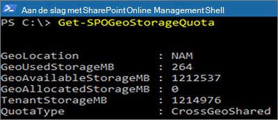

# SharePoint-opslag quota's in meerdere geografische omgevingen

Standaard delen alle geografische locaties van een multi-geografische omgeving het beschikbare opslagquotum voor de Tenant.

Met de instelling SharePoint geo Storage target kunt u de opslagquota voor elke geografische locatie beheren. Wanneer u een opslagquotum voor een geografische locatie toewijst, wordt dit de maximale hoeveelheid opslagruimte voor die geografische locatie en wordt de beschikbare opslagquota van de Tenant afgetrokken. De resterende beschikbare opslagquota voor de Tenant wordt vervolgens gedeeld via de geconfigureerde geo-locaties waarvoor geen specifiek opslagquotum is toegewezen.

De SharePoint Online-beheerder kan het SharePoint-opslagquotum voor een Geo Location toewijzen door verbinding te maken met de centrale locatie. Geo-beheerders voor satelliet locaties kunnen de opslagquota bekijken maar deze niet toewijzen.

## Een opslagquotum configureren voor een geografische locatie

Gebruik de [module Microsoft SharePoint Online](https://www.microsoft.com/download/details.aspx?id=35588 ) en maak verbinding met de centrale locatie om het opslagquotum voor een geografische locatie toe te wijzen. 

Voer cmdlet uit om het opslagquotum voor een locatie toe te wijzen:

`Set-SPOGeoStorageQuota -GeoLocation <geolocationcode> -StorageQuotaMB <value>`

Voer het volgende uit om de opslag quota voor de huidige geografische locatie weer te geven:

`Get-SPOGeoStorageQuota`

Voer het volgende uit om het opslagquotum voor alle geografische locaties weer te geven:

`Get-SPOGeoStorageQuota -AllLocations`

Als u het toegewezen opslagquotum voor een geografische locatie wilt verwijderen, stelt u het `StorageQuota value = 0` volgende in:

`Set-SPOGeoStorageQuota -GeoLocation <geolocationcode> -StorageQuotaMB 0`
