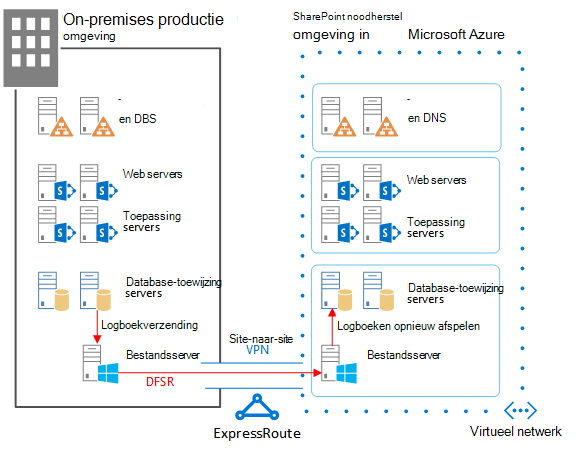
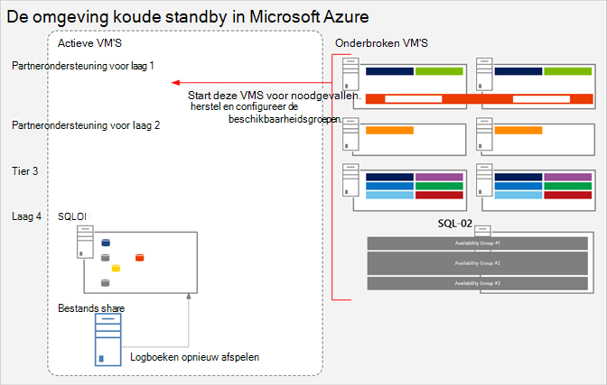
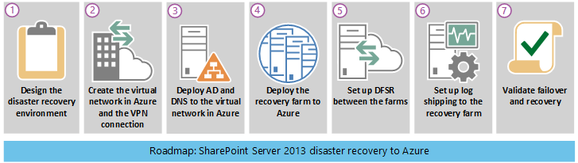
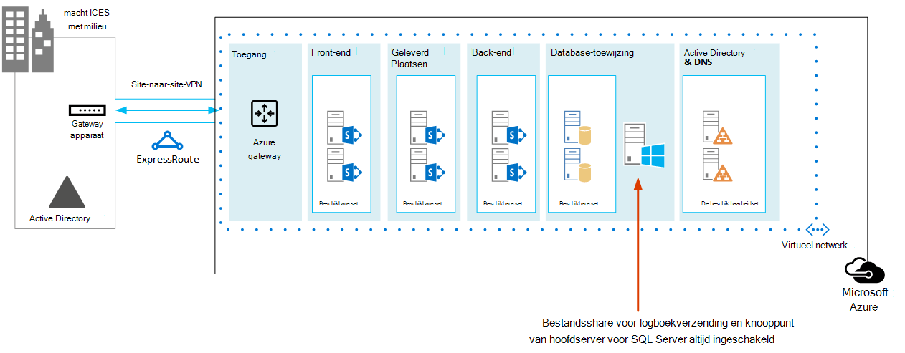

# <a name="sharepoint-server-2013-disaster-recovery-in-microsoft-azure"></a>Calamiteitenherstel SharePoint Server 2013 in Microsoft Azure

 Met Azure kunt u een omgeving voor herstel na noodherstel maken voor uw on-premises SharePoint farm. In dit artikel wordt beschreven hoe u deze oplossing ontwerpt en implementeert.

 **Bekijk de SharePoint overzichtsvideo over herstel na noodherstel van Server 2013**
> [!VIDEO https://www.microsoft.com/videoplayer/embed/1b73ec8f-29bd-44eb-aa3a-f7932784bfd9?autoplay=false]
  
 Wanneer er een ramp is SharePoint on-premises omgeving, is het de hoogste prioriteit om het systeem snel weer aan de slag te laten gaan. Herstel na nood SharePoint is sneller en eenvoudiger wanneer er al een back-upomgeving in de Microsoft Azure. In deze video worden de belangrijkste concepten van een SharePoint een warme failover-omgeving beschreven en worden de volledige details in dit artikel beschreven.
  
Gebruik dit artikel met het volgende oplossingsmodel: **SharePoint Rampherstel in Microsoft Azure.**
  
[](https://go.microsoft.com/fwlink/p/?LinkId=392555)
  
 [PDF](https://go.microsoft.com/fwlink/p/?LinkId=392555) |  [Visio](https://go.microsoft.com/fwlink/p/?LinkId=392554)
  
## <a name="use-azure-infrastructure-services-for-disaster-recovery"></a>Azure Infrastructure Services gebruiken voor herstel na nood

Veel organisaties hebben geen omgeving voor noodherstel voor SharePoint, wat duur kan zijn om on-premises te bouwen en te onderhouden. Azure Infrastructure Services biedt aantrekkelijke opties voor omgevingen voor noodherstel die flexibeler en goedkoper zijn dan de on-premises alternatieven.
  
De voordelen voor het gebruik van Azure Infrastructure Services zijn:
  
- **Minder kostbare resources** Onderhoud en betaal voor minder resources dan on-premises omgevingen voor noodherstel. Het aantal resources is afhankelijk van welke omgeving voor noodherstel u kiest: koud stand-by, warm stand-by of hot standby.
    
- **Betere resourceflexibiliteit** In geval van een ramp kunt u eenvoudig uw herstelplan SharePoint om te voldoen aan de belastingsvereisten. Schaal in wanneer u de resources niet meer nodig hebt.
    
- **Lagere datacenterverplichting** Gebruik Azure Infrastructure Services in plaats van te investeren in een secundair datacenter in een andere regio.
    
Er zijn minder complexe opties voor organisaties die net aan de slag gaan met herstel na nood en geavanceerde opties voor organisaties met hoge tolerantievereisten. De definities voor koude, warme en warme standby-omgevingen zijn iets anders wanneer de omgeving wordt gehost op een cloudplatform. In de volgende tabel worden deze omgevingen beschreven voor het bouwen SharePoint herstelfarm in Azure.
  
**Tabel: Herstelomgevingen**

|**Type herstelomgeving**|**Beschrijving**|
|:-----|:-----|
|Hot  <br/> |Een volledig formaat farm is ingericht, bijgewerkt en wordt uitgevoerd op stand-by.  <br/> |
|Warm  <br/> |De farm is gebouwd en virtuele machines worden uitgevoerd en bijgewerkt.  <br/> Herstel omvat het koppelen van inhoudsdatabases, het inrichten van servicetoepassingen en het crawlen van inhoud.  <br/> De farm kan een kleinere versie van de productiefarm zijn en vervolgens worden opgeschaald om het volledige gebruikersbestand te bedienen.  <br/> |
|Koud  <br/> |De farm is volledig gebouwd, maar de virtuele machines worden gestopt.  <br/> Het onderhouden van de omgeving omvat het van tijd tot tijd starten van de virtuele machines, het patchen, bijwerken en verifiëren van de omgeving.  <br/> Start de volledige omgeving in geval van een ramp.  <br/> |
   
Het is belangrijk om de doelstellingen voor hersteltijd (RTOs) en herstelpuntdoelstellingen (RPOs) van uw organisatie te evalueren. Aan de hand van deze vereisten wordt bepaald welke omgeving de meest geschikte investering is voor uw organisatie.
  
In de richtlijnen in dit artikel wordt beschreven hoe u een warme stand-by-omgeving implementeert. U kunt de omgeving ook aanpassen aan een koude stand-by-omgeving, hoewel u aanvullende procedures moet volgen om dit soort omgevingen te ondersteunen. In dit artikel wordt niet beschreven hoe u een hot standby-omgeving implementeert.
  
Zie Concepten voor hoge beschikbaarheid en noodherstel [in SharePoint 2013](/SharePoint/administration/high-availability-and-disaster-recovery-concepts) en Kies een strategie voor herstel na noodherstel voor SharePoint [2013](/SharePoint/administration/plan-for-disaster-recovery)voor meer informatie over oplossingen voor noodherstel.
  
## <a name="solution-description"></a>Beschrijving van oplossing

Voor de oplossing voor het herstellen van noodscenario's met warme stand-by is de volgende omgeving vereist:
  
- Een on-premises SharePoint productiefarm
    
- Een herstelfarm SharePoint azure
    
- Een SITE-naar-site VPN-verbinding tussen de twee omgevingen
    
In de volgende afbeelding worden deze drie elementen geïllustreerd.
  
**Afbeelding: Elementen van een warme standby-oplossing in Azure**


  
SQL Server logboekverzending met DFSR (Distributed File System Replication) wordt gebruikt om databaseback-ups en transactielogboeken te kopiëren naar de herstelfarm in Azure: 
  
- DFSR brengt logboeken over van de productieomgeving naar de herstelomgeving. In een WAN-scenario is DFSR efficiënter dan het rechtstreeks verzenden van de logboeken naar de secundaire server in Azure.
    
- Logboeken worden opnieuw afgespeeld in de SQL Server in de herstelomgeving in Azure.
    
- U koppelt logboekverleverde databases SharePoint inhoudsdatabases in de herstelomgeving pas als er een hersteloefening is uitgevoerd.
    
Voer de volgende stappen uit om de farm te herstellen:
  
1. Stoppen met het verzenden van logboeken.
    
2. Stop met het accepteren van verkeer naar de primaire farm.
    
3. De uiteindelijke transactielogboeken opnieuw afspelen.
    
4. Voeg de inhoudsdatabases toe aan de farm.
    
5. Herstel servicetoepassingen uit de gerepliceerde servicesdatabases.
    
6. Dns-records (Domain Name System) bijwerken om naar de herstelfarm te wijzen.
    
7. Start een volledige verkenning.
    
U wordt aangeraden deze stappen regelmatig te oefenen en deze te documenteren om ervoor te zorgen dat uw live herstel soepel verloopt. Het koppelen van inhoudsdatabases en het herstellen van servicetoepassingen kan enige tijd duren en vereist meestal een handmatige configuratie.
  
Nadat een herstel is uitgevoerd, bevat deze oplossing de items die in de volgende tabel worden vermeld.
  
**Tabel: Doelstellingen voor oplossingsherstel**

|**Item**|**Beschrijving**|
|:-----|:-----|
|Sites en inhoud  <br/> |Sites en inhoud zijn beschikbaar in de herstelomgeving.  <br/> |
|Een nieuw exemplaar van zoeken  <br/> |In deze warme standby-oplossing wordt zoeken niet hersteld vanuit zoekdatabases. Zoekonderdelen in de herstelfarm zijn zo zo mogelijk geconfigureerd voor de productiefarm. Nadat de sites en inhoud zijn hersteld, wordt een volledige verkenning gestart om de zoekindex opnieuw op te bouwen. U hoeft niet te wachten totdat de verkenning is voltooid om de sites en inhoud beschikbaar te maken.  <br/> |
|Services  <br/> | Services die gegevens opslaan in databases, worden teruggezet uit de databases die zijn verzonden. Services die geen gegevens opslaan in databases, worden gewoon gestart. <br/>  Niet alle services met databases hoeven te worden hersteld. De volgende services hoeven niet te worden hersteld uit databases en kunnen gewoon worden gestart na een failover: <br/>  Gegevensverzameling gebruik en status <br/>  State service <br/>  Word-automatisering <br/>  Een andere service die geen database gebruikt <br/> |
   
U kunt samenwerken met Microsoft Consulting Services (MCS) of een partner om complexere hersteldoelstellingen aan te pakken. Deze worden samengevat in de volgende tabel.
  
**Tabel: Andere items die kunnen worden geadresseerd door MCS of een partner**

|**Item**|**Beschrijving**|
|:-----|:-----|
|Aangepaste farmoplossingen synchroniseren  <br/> |In het ideale ideaalbeeld is de configuratie van de herstelfarm identiek aan de productiefarm. U kunt samenwerken met een consultant of partner om te evalueren of aangepaste farmoplossingen worden gerepliceerd en of het proces is gebruikt om de twee omgevingen gesynchroniseerd te houden.  <br/> |
|On-premises verbindingen met gegevensbronnen  <br/> |Het is mogelijk niet handig om verbindingen met back-endgegevenssystemen te repliceren, zoals BDC-verbindingen (Backup Domain Controller) en zoekinhoudsbronnen.  <br/> |
|Scenario's voor zoeken herstellen  <br/> |Omdat zoekimplementaties voor ondernemingen meestal vrij uniek en complex zijn, is het herstellen van zoekopdrachten uit databases een grotere investering vereist. U kunt samenwerken met een consultant of partner om scenario's voor het herstellen van zoekopdrachten te identificeren en te implementeren die uw organisatie mogelijk nodig heeft.  <br/> |
   
De richtlijnen in dit artikel gaan ervan uit dat de on-premises farm al is ontworpen en geïmplementeerd.
  
## <a name="detailed-architecture"></a>Gedetailleerde architectuur

Idealiter is de configuratie van de herstelfarm in Azure identiek aan de on-premises productiefarm, inclusief de volgende:
  
- Dezelfde weergave van serverrollen
    
- Dezelfde configuratie van aanpassingen
    
- Dezelfde configuratie van zoekonderdelen
    
De omgeving in Azure kan een kleinere versie van de productiefarm zijn. Als u van plan bent om de herstelfarm uit te schalen na een failover, is het belangrijk dat elk type serverrol in eerste instantie wordt weergegeven.
  
Sommige configuraties zijn mogelijk niet praktisch om te repliceren in de failover-omgeving. Test de failoverprocedures en -omgeving om ervoor te zorgen dat de failoverfarm het verwachte serviceniveau biedt.
  
Deze oplossing schrijft geen specifieke topologie voor voor een SharePoint farm. De focus van deze oplossing ligt op het gebruik van Azure voor de failoverfarm en het implementeren van logboekverzending en DFSR tussen de twee omgevingen.
  
### <a name="warm-standby-environments"></a>Warme standby-omgevingen

In een warme standby-omgeving worden alle virtuele machines in de Azure-omgeving uitgevoerd. De omgeving is klaar voor een failover-oefening of gebeurtenis.
  
In de volgende afbeelding ziet u een oplossing voor noodherstel van een on-premises SharePoint-farm tot een azure-SharePoint-farm die is geconfigureerd als een warme standby-omgeving.
  
**Afbeelding: Topologie en belangrijke elementen van een productiefarm en een warm standby-herstelfarm**


  
In dit diagram:
  
- Twee omgevingen worden naast elkaar geïllustreerd: de on-premises SharePoint farm en de warme standby-farm in Azure.
    
- Elke omgeving bevat een bestands delen.
    
- Elke farm bevat vier lagen. Als u hoge beschikbaarheid wilt bereiken, bevat elke laag twee servers of virtuele machines die identiek zijn geconfigureerd voor een specifieke rol, zoals front-endservices, gedistribueerde cache, back-endservices en databases. Het is niet belangrijk om in deze afbeelding specifieke onderdelen uit te roepen. De twee farms zijn identiek geconfigureerd.
    
- De vierde laag is de databaselaag. Logboekverzending wordt gebruikt om logboeken van de secundaire databaseserver in de on-premises omgeving te kopiëren naar de bestands delen in dezelfde omgeving.
    
- DFSR kopieert bestanden uit de bestands delen in de on-premises omgeving naar de bestands delen in de Azure-omgeving.
    
- Logboekverzending herhaalt de logboeken van het bestandsdeel in de Azure-omgeving naar de primaire replica in de SQL Server AlwaysOn-beschikbaarheidsgroep in de herstelomgeving.
    
### <a name="cold-standby-environments"></a>Koude stand-by-omgevingen

In een koude stand-by omgeving kunnen de meeste SharePoint virtuele farm-machines worden uitgeschakeld. (Het is raadzaam om af en toe de virtuele machines te starten, bijvoorbeeld om de twee weken of eenmaal per maand, zodat elke virtuele machine kan worden gesynchroniseerd met het domein.) De volgende virtuele machines in de Azure-herstelomgeving moeten actief blijven om ervoor te zorgen dat logboekverzending en DFSR continu worden uitgevoerd:
  
- Het bestand delen
    
- De primaire databaseserver
    
- Ten minste één virtuele computer met Windows Server Active Directory Domain Services en DNS
    
In de volgende afbeelding ziet u een Azure-failoveromgeving waarin de virtuele computer voor het delen van bestanden en de SharePoint virtuele database worden uitgevoerd. Alle andere SharePoint virtuele machines worden gestopt. De virtuele computer die wordt uitgevoerd Windows Server Active Directory en DNS wordt niet weergegeven.
  
**Afbeelding: Cold standby recovery farm with running virtual machines**


  
Na een failover naar een koude stand-by-omgeving worden alle virtuele machines gestart en moet de methode voor een hoge beschikbaarheid van de databaseservers worden geconfigureerd, zoals SQL Server AlwaysOn-beschikbaarheidsgroepen.
  
Als meerdere opslaggroepen worden geïmplementeerd (databases zijn verspreid over meer dan één SQL Server set met hoge beschikbaarheid), moet de primaire database voor elke opslaggroep worden uitgevoerd om de logboeken te accepteren die zijn gekoppeld aan de opslaggroep.
  
### <a name="skills-and-experience"></a>Vaardigheden en ervaring

Er worden meerdere technologieën gebruikt in deze oplossing voor noodherstel. Om ervoor te zorgen dat deze technologieën werken zoals verwacht, moet elk onderdeel in de on-premises en Azure-omgeving correct zijn geïnstalleerd en geconfigureerd. Het is raadzaam dat de persoon of het team die deze oplossing in stelt, beschikt over een sterke kennis van en hands-on vaardigheden met de technologieën die in de volgende artikelen worden beschreven:
  
- [DFS-replicatieservices (Distributed File System)](/previous-versions/windows/it-pro/windows-server-2012-R2-and-2012/jj127250(v=ws.11))
    
- [Windows Server Failover Clustering (WSFC) met SQL Server](/sql/sql-server/failover-clusters/windows/windows-server-failover-clustering-wsfc-with-sql-server)
    
- [AlwaysOn Availability Groups (SQL Server)](/sql/database-engine/availability-groups/windows/always-on-availability-groups-sql-server)
    
- [Back-up maken en herstellen van SQL Server databases](/sql/relational-databases/backup-restore/back-up-and-restore-of-sql-server-databases)
    
- [SharePoint Server 2013-installatie en farmimplementatie](/SharePoint/install/installation-and-configuration-overview)
    
- [Microsoft Azure](/azure/)
    
Ten slotte raden we u aan scripts te maken die u kunt gebruiken om taken die aan deze technologieën zijn gekoppeld te automatiseren. Het is mogelijk om de beschikbare gebruikersinterfaces te gebruiken om alle taken uit te voeren die in deze oplossing worden beschreven. Een handmatige benadering kan echter tijdrovend en foutgevoelig zijn en levert inconsistente resultaten op.
  
Naast Windows PowerShell zijn er ook Windows PowerShell bibliotheken voor SQL Server, SharePoint Server en Azure. Vergeet T-SQL niet, waardoor u ook minder tijd hebt om uw omgeving voor herstel na noodherstel te configureren en te onderhouden.
  
## <a name="disaster-recovery-roadmap"></a>Routekaart voor herstel na ramp


  
In deze roadmap wordt ervan uitgenomen dat u al een SharePoint Server 2013-farm hebt geïmplementeerd in productie.
  
**Tabel: Routekaart voor herstel na ramp**

|**Fase**|**Beschrijving**|
|:-----|:-----|
|Fase 1  <br/> |Ontwerp de herstelomgeving voor rampen.  <br/> |
|Fase 2  <br/> |Maak de virtuele Azure-netwerk- en VPN-verbinding.  <br/> |
|Fase 3  <br/> |Implementeer Windows Active Directory en Domain Name Services naar het virtuele Azure-netwerk.  <br/> |
|Fase 4  <br/> |Implementeer de SharePoint herstelfarm in Azure.  <br/> |
|Fase 5  <br/> |Stel DFSR in tussen de farms.  <br/> |
|Fase 6  <br/> |Logboekzending instellen voor de herstelfarm.  <br/> |
|Fase 7  <br/> | Valideer failover- en hersteloplossingen. Dit omvat de volgende procedures en technologieën: <br/>  Stoppen met het verzenden van logboeken. <br/>  Herstel de back-ups. <br/>  Inhoud crawlen. <br/>  Services herstellen. <br/>  DNS-records beheren. <br/> |
   
## <a name="phase-1-design-the-disaster-recovery-environment"></a>Fase 1: De herstelomgeving voor rampen ontwerpen

Gebruik de richtlijnen in [Microsoft Azure Architecturen voor SharePoint 2013](microsoft-azure-architectures-for-sharepoint-2013.md) om de omgeving voor herstel na noodherstel te ontwerpen, inclusief de SharePoint herstelfarm. U kunt de afbeeldingen in de SharePoint Oplossing voor noodherstel [in Azure](https://go.microsoft.com/fwlink/p/?LinkId=392554) Visio gebruiken om het ontwerpproces te starten. U wordt aangeraden de hele omgeving te ontwerpen voordat u begint met werken in de Azure-omgeving.
  
Naast de richtlijnen in Microsoft Azure Architecturen voor [SharePoint 2013](microsoft-azure-architectures-for-sharepoint-2013.md) voor het ontwerpen van het virtuele netwerk, vpn-verbinding, Active Directory en SharePoint-farm, moet u een rol voor het delen van bestanden toevoegen aan de Azure-omgeving.
  
Als u het verzenden van logboeken in een oplossing voor noodherstel wilt ondersteunen, wordt een virtuele computer voor bestands delen toegevoegd aan het subnet waar de databaserollen zich bevinden. Het bestandsdeel fungeert ook als het derde knooppunt van een knooppuntmeerderheid voor de SQL Server AlwaysOn-beschikbaarheidsgroep. Dit is de aanbevolen configuratie voor een standaardfarm SharePoint die gebruikmaakt van SQL Server AlwaysOn-beschikbaarheidsgroepen. 
  
> [!NOTE]
> Het is belangrijk dat u de vereisten voor een database bekijkt om deel te nemen aan een SQL Server AlwaysOn-beschikbaarheidsgroep. Zie Vereisten, Beperkingen en Aanbevelingen [voor AlwaysOn Availability Groups voor meer informatie.](/sql/database-engine/availability-groups/windows/prereqs-restrictions-recommendations-always-on-availability) 
  
**Afbeelding: Plaatsing van een bestandsserver die wordt gebruikt voor een oplossing voor noodherstel**


  
In dit diagram wordt een virtuele computer voor het delen van bestanden toegevoegd aan hetzelfde subnet in Azure dat de databaseserverrollen bevat. Voeg de virtuele computer voor het delen van bestanden niet toe aan een beschikbaarheidsset met andere serverrollen, zoals de SQL Server rollen.
  
Als u zich zorgen maakt over de hoge beschikbaarheid van de logboeken, kunt u een andere benadering kiezen door een back-up te gebruiken SQL Server back-up te maken en te herstellen met [Azure Blob Storage Service.](/sql/relational-databases/backup-restore/sql-server-backup-and-restore-with-microsoft-azure-blob-storage-service) Dit is een nieuwe functie in Azure waarmee logboeken rechtstreeks worden opgeslagen in een BLOB-opslag-URL. Deze oplossing bevat geen richtlijnen voor het gebruik van deze functie.
  
Wanneer u de herstelfarm ontwerpt, moet u er rekening mee houden dat een succesvolle omgeving voor herstel na noodherstel nauwkeurig de productiefarm wedt die u wilt herstellen. De grootte van de herstelfarm is niet het belangrijkste in het ontwerp, de implementatie en het testen van de herstelfarm. De schaal van de farm verschilt per organisatie op basis van bedrijfsvereisten. Het is mogelijk om een geschaalde farm te gebruiken voor een korte uitval of totdat u de farm moet schalen door prestatie- en capaciteitseisen.
  
Configureer de herstelfarm zo identiek mogelijk met de productiefarm, zodat deze voldoet aan uw SLA-vereisten (Service Level Agreement) en de functionaliteit biedt die u nodig hebt om uw bedrijf te ondersteunen. Wanneer u de herstelomgeving voor noodscenario's ontwerpt, bekijkt u ook uw wijzigingsbeheerproces voor uw productieomgeving. U wordt aangeraden het wijzigingsbeheerproces uit te breiden naar de herstelomgeving door de herstelomgeving met hetzelfde interval als de productieomgeving bij te werken. Als onderdeel van het proces voor wijzigingsbeheer wordt u aangeraden een gedetailleerde inventaris van uw farmconfiguratie, -toepassingen en -gebruikers bij te houden. 
  
## <a name="phase-2-create-the-azure-virtual-network-and-vpn-connection"></a>Fase 2: Het virtuele Azure-netwerk en de VPN-verbinding maken

[Verbinding maken een on-premises](connect-an-on-premises-network-to-a-microsoft-azure-virtual-network.md) netwerk naar een Microsoft Azure virtueel netwerk laat zien hoe u het virtuele netwerk in Azure kunt plannen en implementeren en hoe u de VPN-verbinding kunt maken. Volg de richtlijnen in het onderwerp om de volgende procedures uit te voeren:
  
- Plan de privé-IP-adresruimte van het virtuele netwerk.
    
- Plan de wijzigingen in de routeringsinfrastructuur voor het virtuele netwerk.
    
- Plan firewallregels voor verkeer van en naar het on-premises VPN-apparaat.
    
- Maak het cross-premises virtuele netwerk in Azure.
    
- Routering configureren tussen uw on-premises netwerk en het virtuele netwerk.
    
## <a name="phase-3-deploy-active-directory-and-domain-name-services-to-the-azure-virtual-network"></a>Fase 3: Active Directory- en domeinnaamservices implementeren in het virtuele Azure-netwerk

Deze fase omvat het implementeren van zowel Windows Server Active Directory als DNS naar het virtuele netwerk in een hybride scenario zoals beschreven in Microsoft Azure Architecturen voor [SharePoint 2013](microsoft-azure-architectures-for-sharepoint-2013.md) en zoals wordt geïllustreerd in de volgende afbeelding.
  
**Afbeelding: Hybride Active Directory-domeinconfiguratie**


  
In de afbeelding worden twee virtuele machines geïmplementeerd op hetzelfde subnet. Deze virtuele machines hosten elk twee rollen: Active Directory en DNS.
  
Voordat u Active Directory implementeert in Azure, leest u Richtlijnen voor het implementeren [van Windows Server Active Directory op Azure Virtual Machines.](/windows-server/identity/ad-ds/introduction-to-active-directory-domain-services-ad-ds-virtualization-level-100) Met deze richtlijnen kunt u bepalen of u een andere architectuur of andere configuratie-instellingen voor uw oplossing nodig hebt.
  
Zie Een Replica Active Directory-domeincontroller installeren in Azure Virtual Networks voor gedetailleerde instructies over het instellen [van een domeincontroller in Azure.](/windows-server/identity/ad-ds/introduction-to-active-directory-domain-services-ad-ds-virtualization-level-100)
  
Vóór deze fase hebt u geen virtuele machines geïmplementeerd in het virtuele netwerk. De virtuele machines voor het hosten van Active Directory en DNS zijn waarschijnlijk niet de grootste virtuele machines die u nodig hebt voor de oplossing. Voordat u deze virtuele machines implementeert, maakt u eerst de grootste virtuele machine die u wilt gebruiken in uw virtuele netwerk. Dit helpt ervoor te zorgen dat uw oplossing op een tag in Azure terecht komt die de grootste grootte mogelijk maakt die u nodig hebt. U hoeft deze virtuele computer momenteel niet te configureren. Maak het gewoon en zet het opzij. Als u dit niet doet, loopt u mogelijk een beperking op wanneer u later grotere virtuele machines probeert te maken, wat een probleem was op het moment dat dit artikel werd geschreven. 
  
## <a name="phase-4-deploy-the-sharepoint-recovery-farm-in-azure"></a>Fase 4: De herstelfarm SharePoint implementeren in Azure

Implementeer de SharePoint in uw virtuele netwerk volgens uw ontwerpplannen. Het kan handig zijn om planning voor SharePoint [2013](/previous-versions/azure/dn275958(v=azure.100)) op Azure Infrastructure Services te bekijken voordat u SharePoint in Azure implementeert.
  
Houd rekening met de volgende procedures die we hebben geleerd door onze proof of concept-omgeving te bouwen:
  
- Maak virtuele machines met behulp van de Azure-portal of PowerShell.
    
- Azure en Hyper-V ondersteunen geen dynamisch geheugen. Zorg ervoor dat dit wordt meegenomen in uw prestatie- en capaciteitsplannen.
    
- Start virtuele machines opnieuw op via de Azure-interface, niet vanaf de virtuele computer die zich aanlogt. Het gebruik van de Azure-interface werkt beter en is voorspelbaarder.
    
- Als u een virtuele machine wilt afsluiten om kosten te besparen, gebruikt u de Azure-interface. Als u de aanmelding voor de virtuele computer uitzet, blijven de kosten toenemen.
    
- Gebruik een naamgevingsconventie voor de virtuele machines.
    
- Let op welke datacenterlocatie de virtuele machines worden geïmplementeerd.
    
- De functie automatische schaal in Azure wordt niet ondersteund voor SharePoint rollen.
    
- Configureer geen items in de farm die worden hersteld, zoals siteverzamelingen. 
    
## <a name="phase-5-set-up-dfsr-between-the-farms"></a>Fase 5: DFSR instellen tussen de farms

Als u bestandsreplicatie wilt instellen met DFSR, gebruikt u de module DNS Management. Vóór de DFSR-installatie moet u zich echter aanmelden bij uw on-premises bestandsserver en Azure-bestandsserver en de service inschakelen in Windows.
  
Volg de volgende stappen in het serverbeheerdashboard:
  
- Configureer de lokale server.
    
- Start de **wizard Rollen en functies toevoegen.**
    
- Open het **knooppunt Bestand en Storage Services.**
    
- Selecteer **DFS-naamruimten en** **DFS-replicatie.**
    
- Klik **op Volgende** om de wizardstappen te voltooien.
    
De volgende tabel bevat koppelingen naar DFSR-naslagartikelen en blogberichten.
  
**Tabel: Naslagartikelen voor DFSR**

|**Title**|**Beschrijving**|
|:-----|:-----|
|[Replicatie](/previous-versions/windows/it-pro/windows-server-2008-R2-and-2008/cc770278(v=ws.11)) <br/> |DFS Management TechNet-onderwerp met koppelingen voor replicatie  <br/> |
|[DFS-replicatie: survivalhandleiding](https://go.microsoft.com/fwlink/p/?LinkId=392737) <br/> |Wiki met koppelingen naar DFS-informatie  <br/> |
|[DFS-replicatie: veelgestelde vragen](/previous-versions/windows/it-pro/windows-server-2003/cc773238(v=ws.10)) <br/> |Onderwerp DFS-replicatie TechNet  <br/> |
|[Blog van Jose Barreto](/archive/blogs/josebda/) <br/> |Blog geschreven door een Principal Program Manager in het File Server-team bij Microsoft  <br/> |
|[The Storage Team bij Microsoft - File Cabinet Blog](https://go.microsoft.com/fwlink/p/?LinkId=392740) <br/> |Blog over bestandsservices en opslagfuncties in Windows Server  <br/> |
   
## <a name="phase-6-set-up-log-shipping-to-the-recovery-farm"></a>Fase 6: Logboekzending instellen voor de herstelfarm

Logboekzending is het kritieke onderdeel voor het instellen van herstel na noodherstel in deze omgeving. U kunt logboekverzending gebruiken om automatisch transactielogboekbestanden voor databases van een primaire databaseserver-exemplaar naar een secundaire databaseserver-exemplaar te verzenden. Zie Logboekzending configureren in SharePoint [2013 voor](/sharepoint/administration/configure-log-shipping)het instellen van logboekzending. 
  
> [!IMPORTANT]
> Ondersteuning voor het verzenden van logboeken in SharePoint Server is beperkt tot bepaalde databases. Zie Ondersteunde opties voor hoge beschikbaarheid en herstel na noodherstel voor SharePoint [databases (SharePoint 2013) voor meer informatie.](/SharePoint/administration/supported-high-availability-and-disaster-recovery-options-for-sharepoint-databas) 
  
## <a name="phase-7-validate-failover-and-recovery"></a>Fase 7: Failover en herstel valideren

Het doel van deze laatste fase is om te controleren of de oplossing voor noodherstel werkt zoals gepland. Maak hiervoor een failovergebeurtenis die de productiefarm sluit en de herstelfarm start als vervanging. U kunt handmatig een failover-scenario starten of scripts gebruiken.
  
De eerste stap is het stoppen van inkomende gebruikersaanvragen voor farmservices of -inhoud. U kunt dit doen door DNS-vermeldingen uit te sluiten of door de front-endwebservers af te sluiten. Nadat de farm 'down' is, kunt u niet naar de herstelfarm gaan.
  
### <a name="stop-log-shipping"></a>Het verzenden van logboeken stoppen

U moet de verzending van logboeken stoppen voordat u de farm herstelt. Stop eerst de logboekverzending op de secundaire server in Azure en stop deze vervolgens op de on-premises primaire server. Gebruik het volgende script om eerst de logboekverzending op de secundaire server te stoppen en vervolgens op de primaire server. De databasenamen in het script kunnen verschillen, afhankelijk van uw omgeving.
  
```
-- This script removes log shipping from the server.
-- Commands must be executed on the secondary server first and then on the primary server.

SET NOCOUNT ON
DECLARE  @PriDB nvarchar(max)
,@SecDB nvarchar(250)
,@PriSrv nvarchar(250)
,@SecSrv nvarchar(250)

Set @PriDB= ''
SET @PriDB = UPPER(@PriDB)
SET @PriDB = REPLACE(@PriDB, ' ', '')
SET @PriDB = '''' + REPLACE(@PriDB, ',', ''', ''') + ''''

Set @SecDB = @PriDB

Exec ( 'Select  ''exec master..sp_delete_log_shipping_secondary_database '' + '''''''' + prm.primary_database +  ''''''''   
from msdb.dbo.log_shipping_monitor_primary prm INNER JOIN msdb.dbo.log_shipping_primary_secondaries sec  ON  prm.primary_database=sec.secondary_database
where prm.primary_database in ( ' + @PriDB + ' )')

Exec ( 'Select  ''exec master..sp_delete_log_shipping_primary_secondary '' + '''''''' + prm.Primary_Database + '''''', '''''' + sec.Secondary_Server + '''''', '''''' + sec.Secondary_database + ''''''''   
from msdb.dbo.log_shipping_monitor_primary prm INNER JOIN msdb.dbo.log_shipping_primary_secondaries sec  ON  prm.primary_database=sec.secondary_database
where prm.primary_database in ( ' + @PriDB + ' )')

Exec ( 'Select  ''exec master..sp_delete_log_shipping_primary_database '' + '''''''' + prm.primary_database +  ''''''''   
from msdb.dbo.log_shipping_monitor_primary prm INNER JOIN msdb.dbo.log_shipping_primary_secondaries sec  ON  prm.primary_database=sec.secondary_database
where prm.primary_database in ( ' + @PriDB + ' )')

Exec ( 'Select  ''exec master..sp_delete_log_shipping_secondary_primary '' + '''''''' + prm.primary_server + '''''', '''''' + prm.primary_database +  ''''''''   
from msdb.dbo.log_shipping_monitor_primary prm INNER JOIN msdb.dbo.log_shipping_primary_secondaries sec  ON  prm.primary_database=sec.secondary_database
where prm.primary_database in ( ' + @PriDB + ' )')

```

### <a name="restore-the-backups"></a>Back-ups herstellen

Back-ups moeten worden hersteld in de volgorde waarin ze zijn gemaakt. Voordat u een bepaalde back-up van een transactielogboek kunt herstellen, moet u eerst de volgende eerdere back-ups herstellen zonder niet-gecomprimeerd transacties terug te draaien (dat wil zeggen met behulp van  `WITH NORECOVERY` ):
  
- De volledige databaseback-up en de laatste differentiële back-up: herstel deze back-ups, indien aanwezig, die vóór de specifieke back-up van het transactielogboek zijn gemaakt. Voordat de meest recente volledige of differentiële databaseback-up werd gemaakt, gebruikte de database het volledige herstelmodel of bulksgewijs vastgelegde herstelmodel.
    
- Alle back-ups van het transactielogboek: herstel eventuele back-ups van het transactielogboek die zijn gemaakt na de volledige databaseback-up of de differentiële back-up (als u er een herstelt) en vóór de specifieke back-up van het transactielogboek. Logboekback-ups moeten worden toegepast in de volgorde waarin ze zijn gemaakt, zonder hiaten in de logboekketen.
    
Als u de inhoudsdatabase op de secundaire server wilt herstellen zodat de sites worden weergegeven, verwijdert u alle databaseverbindingen vóór herstel. Als u de database wilt herstellen, moet u de volgende SQL uitvoeren.
  
```
restore database WSS_Content with recovery

```

> [!IMPORTANT]
> Wanneer u T-SQL gebruikt, geeft u in elke RESTORE-instructie met **NOHERSTEL of** **MET HERSTEL** in elke RESTORE-instructie de ambiguïteit op. Dit is erg belangrijk bij het schrijven van scripts. Nadat de volledige en differentiële back-ups zijn hersteld, kunnen de transactielogboeken worden hersteld in SQL Server Management Studio. Omdat het verzenden van logboeken al is gestopt, bevindt de inhoudsdatabase zich in de stand-bystand, dus moet u de status wijzigen in volledige toegang.
  
Klik SQL Server Management Studio met de rechtermuisknop op de **WSS_Content-database,** wijs Taken herstellen aan en klik vervolgens op Transactielogboek (als u de volledige back-up niet hebt hersteld, is dit   >  niet  beschikbaar). Zie Back-up[van een transactielogboek herstellen (SQL Server) voor meer informatie.](/sql/relational-databases/backup-restore/restore-a-transaction-log-backup-sql-server)
  
### <a name="crawl-the-content-source"></a>De inhoudsbron crawlen

U moet een volledige verkenning voor elke inhoudsbron starten om de zoekservice te herstellen. Houd er rekening mee dat u bepaalde analysegegevens van de on-premises farm kwijt bent, zoals zoekaanbevelingen. Voordat u de volledige verkenningen start, gebruikt u de Windows PowerShell-cmdlet **Restore-SPEnterpriseSearchServiceApplication** en geeft u de database voor logboekverhuur en gerepliceerd zoekbeheer **op, Search_Service__DB_. <GUID>** Deze cmdlet bevat de zoekconfiguratie, het schema, beheerde eigenschappen, regels en bronnen en maakt een standaardset van de andere onderdelen.
  
Als u een volledige verkenning wilt starten, gaat u als volgt te werk:
  
1. Ga in SharePoint 2013 Centraal beheer naar **Application Management** Service Applications Manage service applications en klik vervolgens op de zoekservicetoepassing die  >    >  u wilt crawlen.
    
2. Klik op **de pagina Zoekbeheer** op **Inhoudsbronnen,** wijs de gezochte inhoudsbron aan, klik op de pijl en klik vervolgens op Volledige verkenning **starten.**
    
### <a name="recover-farm-services"></a>Farmservices herstellen

In de volgende tabel ziet u hoe u services kunt herstellen die zijn verzonden met logboekdatabases, de services die databases bevatten, maar niet worden aanbevolen om te herstellen met logboekverzending en de services die geen databases hebben.
  
> [!IMPORTANT]
> Als u een on-premises SharePoint in de Azure-omgeving herstelt, worden geen SharePoint services hersteld die u nog niet handmatig in Azure hebt geïnstalleerd. 
  
**Tabel: Databaseverwijzing servicetoepassing**

|**Deze services herstellen uit databases met logboeken**|**Deze services hebben databases, maar we raden u aan deze services te starten zonder hun databases te herstellen**|**Deze services slaan geen gegevens op in databases. deze services starten na failover**|
|:-----|:-----|:-----|
| MachineVertalingsservice <br/>  Beheerde metagegevensservice <br/>  Secure Store-service <br/>  Gebruikersprofiel. (Alleen de databases Profiel en Sociaal labelen worden ondersteund. De synchronisatiedatabase wordt niet ondersteund.) <br/>  Microsoft SharePoint Foundation Subscription Instellingen Service <br/> | Gegevensverzameling gebruik en status <br/>  State service <br/>  Word-automatisering <br/> | Excel Services <br/>  PerformancePoint Services <br/>  PowerPoint Conversie <br/>  Visio Graphics Service <br/>  Werkbeheer <br/> |
   
In het volgende voorbeeld ziet u hoe u de service Beheerde metagegevens uit een database kunt herstellen.
  
Hiervoor wordt de bestaande Managed_Metadata_DB database gebruikt. Deze database is logboek verzonden, maar er is geen actieve servicetoepassing op de secundaire farm, dus deze moet worden verbonden nadat de servicetoepassing is gemaakt.
  
Gebruik eerst de schakelknop en geef de naam van de  `New-SPMetadataServiceApplication`  `DatabaseName` herstelde database op.
  
Configureer vervolgens de nieuwe servicetoepassing voor beheerde metagegevens op de secundaire server als volgt:
  
- Naam: Beheerde metagegevensservice
    
- Databaseserver: de databasenaam uit het verzonden transactielogboek
    
- Databasenaam: Managed_Metadata_DB
    
- Toepassingsgroep: SharePoint Servicetoepassingen 
    
### <a name="manage-dns-records"></a>DNS-records beheren

U moet handmatig DNS-records maken om naar uw SharePoint wijzen.
  
In de meeste gevallen waarin u meerdere front-endwebservers hebt, is het zinvol om te profiteren van de functie Netwerkbelasting balanceren in Windows Server 2012 of een hardware load balancer om aanvragen te distribueren tussen de web-front-endservers in uw farm. Netwerkbelastingsverdeling kan ook de risico's verminderen door aanvragen te distribueren naar de andere servers als een van uw web-front-endservers mislukt. 
  
Wanneer u netwerkladingsverdeling instelt, krijgt uw cluster meestal één IP-adres toegewezen. Vervolgens maakt u een DNS-hostrecord in de DNS-provider voor uw netwerk die naar het cluster wijst. (Voor dit project hebben we een DNS-server in Azure gezet voor tolerantie in geval van een on-premises datacenterfout.) U kunt bijvoorbeeld een DNS-record maken, in DNS Manager in Active Directory, bijvoorbeeld , die naar het IP-adres voor uw geladen  `https://sharepoint.contoso.com` cluster wijst.
  
Voor externe toegang tot uw SharePoint-farm kunt u een hostrecord maken op een externe DNS-server met dezelfde URL die clients op uw intranet gebruiken (bijvoorbeeld) die naar een extern IP-adres in uw `https://sharepoint.contoso.com` firewall wijst. (In dit voorbeeld is het een goede gewoonte om gesplitste DNS zo in te stellen dat de interne DNS-server gezaghebbend is voor en aanvragen rechtstreeks naar de SharePoint farmcluster doorstult in plaats van DNS-aanvragen naar uw externe `contoso.com` DNS-server te routeren.) Vervolgens kunt u het externe IP-adres in kaart brengen aan het interne IP-adres van uw on-premises cluster, zodat clients de resources vinden die ze zoeken.
  
Hier ziet u mogelijk een aantal verschillende scenario's voor het herstel van rampen:
  
 **Voorbeeldscenario: de on-premises SharePoint farm is niet beschikbaar vanwege hardwarefout in de on-premises SharePoint farm.** In dit geval kunt u, nadat u de stappen voor failover naar de Azure SharePoint-farm hebt voltooid, de netwerkladingsverdeling configureren op de web-front-endservers van de recovery-SharePoint farm, net zoals u deed met de on-premises farm. Vervolgens kunt u de hostrecord in uw interne DNS-provider omleiden om het IP-adres van de herstelfarm aan te wijzen. Houd er rekening mee dat het enige tijd kan duren voordat DNS-records in de cache op clients worden vernieuwd en de herstelfarm worden aanwijzer.
  
 **Voorbeeldscenario: Het on-premises datacenter gaat volledig verloren.** Dit scenario kan optreden als gevolg van een natuurramp, zoals een brand of een vloedgolf. In dit geval wordt voor een onderneming waarschijnlijk een secundair datacenter gehost in een andere regio, evenals uw Azure-subnet met eigen adreslijstservices en DNS. Net als in het vorige rampscenario kunt u uw interne en externe DNS-records omleiden om te wijzen naar de Azure SharePoint farm. Houd er nogmaals rekening mee dat het doorgeven van DNS-records enige tijd kan duren.
  
Als u siteverzamelingen met een hostnaam gebruikt, zoals aanbevolen in de architectuur en implementatie van de siteverzameling met hostnaam [(SharePoint 2013),](/SharePoint/administration/host-named-site-collection-architecture-and-deployment)worden er mogelijk verschillende siteverzamelingen gehost door dezelfde webtoepassing in uw SharePoint-farm, met unieke DNS-namen (bijvoorbeeld en `https://sales.contoso.com` `https://marketing.contoso.com` ). In dit geval kunt u DNS-records maken voor elke siteverzameling die naar uw CLUSTER-IP-adres wijzen. Nadat een aanvraag uw web-front-endservers SharePoint, worden alle aanvragen naar de juiste siteverzameling gestuurd.
  
## <a name="microsoft-proof-of-concept-environment"></a>Microsoft proof-of-concept-omgeving

We hebben voor deze oplossing een proof-of-concept-omgeving ontworpen en getest. Het ontwerpdoel voor onze testomgeving was het implementeren en herstellen van een SharePoint farm die we mogelijk vinden in een klantomgeving. We hebben verschillende aannames gedaan, maar we wisten dat de farm alle functionaliteit van de out-of-the-box moest leveren zonder aanpassingen. De topologie is ontworpen voor hoge beschikbaarheid met behulp van richtlijnen voor best practice van de veld- en productgroep.
  
In de volgende tabel worden de virtuele Hyper-V-machines beschreven die we hebben gemaakt en geconfigureerd voor de on-premises testomgeving.
  
**Tabel: Virtuele machines voor on-premises test**

|**Servernaam**|**Rol**|**Configuratie**|
|:-----|:-----|:-----|
|DC1  <br/> |Domeincontroller met Active Directory.  <br/> |Twee processors  <br/> Van 512 MB tot 4 GB RAM  <br/> Harde schijf van 1 x 127 GB  <br/> |
|RRAS  <br/> |Server die is geconfigureerd met de RRAS-rol (Routing and Remote Access Service).  <br/> |Twee processors  <br/> 2-8 GB RAM-GEHEUGEN  <br/> Harde schijf van 1 x 127 GB  <br/> |
|FS1  <br/> |Bestandsserver met aandelen voor back-ups en een eindpunt voor DFSR.  <br/> |Vier processors  <br/> 2-12 GB RAM  <br/> Harde schijf van 1 x 127 GB  <br/> 1 x 1 TB harde schijf (SAN)  <br/> Harde schijf van 1 x 750 GB  <br/> |
|SP-WFE1, SP-WFE2  <br/> |Front-endwebservers.  <br/> |Vier processors  <br/> 16 GB RAM  <br/> |
|SP-APP1, SP-APP2, SP-APP3  <br/> |Toepassingsservers.  <br/> |Vier processors  <br/> 2-16 GB RAM  <br/> |
|SP-SQL-HA1, SP-SQL-HA2  <br/> |Databaseservers, geconfigureerd met SQL Server 2012 AlwaysOn beschikbaarheidsgroepen om hoge beschikbaarheid te bieden. Deze configuratie gebruikt SP-SQL-HA1 en SP-SQL-HA2 als primaire en secundaire replica's.  <br/> |Vier processors  <br/> 2-16 GB RAM  <br/> |
   
In de volgende tabel worden schijfconfiguraties beschreven voor de virtuele Hyper-V-machines die we hebben gemaakt en geconfigureerd voor de front-endweb- en toepassingsservers voor de on-premises testomgeving.
  
**Tabel: Vereisten voor virtuele machinestation voor de front-endweb- en toepassingsservers voor de on-premises test**

|**Brief van station**|**Grootte**|**Adreslijstnaam**|**Pad**|
|:-----|:-----|:-----|:-----|
|C  <br/> |80  <br/> |Systeemstation  <br/> |<DriveLetter>: \\ Programmabestanden \\ Microsoft SQL Server\\  <br/> |
|E  <br/> |80  <br/> |Logboekstation (40 GB)  <br/> |<DriveLetter>: \\ Program Files Microsoft SQL Server \\ \\ MSSQL10_50.MSSQLSERVER \\ MSSQL \\ DATA  <br/> |
|F  <br/> |80  <br/> |Pagina (36 GB)  <br/> |<DriveLetter>: \\ Program Files Microsoft SQL Server \\ \\ MSSQL \\ DATA  <br/> |
   
In de volgende tabel worden schijfconfiguraties beschreven voor de virtuele Hyper-V-machines die zijn gemaakt en geconfigureerd als de on-premises databaseservers. Ga op **de pagina Database Engine Configuration** naar het tabblad Gegevens **directories** om de instellingen in te stellen en te bevestigen die in de volgende tabel worden weergegeven.
  
**Tabel: Vereisten voor virtuele machinestation voor de databaseserver voor de on-premises test**

|**Brief van station**|**Grootte**|**Adreslijstnaam**|**Pad**|
|:-----|:-----|:-----|:-----|
|C  <br/> |80  <br/> |Adreslijst met gegevenswortels  <br/> |<DriveLetter>: \\ Programmabestanden \\ Microsoft SQL Server\\  <br/> |
|E  <br/> |500  <br/> |Gebruikersdatabasemap  <br/> |<DriveLetter>: \\ Program Files Microsoft SQL Server \\ \\ MSSQL10_50.MSSQLSERVER \\ MSSQL \\ DATA  <br/> |
|F  <br/> |500  <br/> |Gebruikersdatabaselogboekmap  <br/> |<DriveLetter>: \\ Program Files Microsoft SQL Server \\ \\ MSSQL10_50.MSSQLSERVER \\ MSSQL \\ DATA  <br/> |
|G  <br/> |500  <br/> |Temp DB-adreslijst  <br/> |<DriveLetter>: \\ Program Files Microsoft SQL Server \\ \\ MSSQL10_50.MSSQLSERVER \\ MSSQL \\ DATA  <br/> |
|H  <br/> |500  <br/> |Logboekmap temp DB  <br/> |<DriveLetter>: \\ Program Files Microsoft SQL Server \\ \\ MSSQL10_50.MSSQLSERVER \\ MSSQL \\ DATA  <br/> |
   
### <a name="setting-up-the-test-environment"></a>De testomgeving instellen

Tijdens de verschillende implementatiefasen heeft het testteam meestal eerst aan de on-premises architectuur gewerkt en vervolgens aan de bijbehorende Azure-omgeving. Dit komt overeen met de algemene reële gevallen waarin in-house productiebedrijven al actief zijn. Wat nog belangrijker is, is dat u de huidige productiebelasting, capaciteit en normale prestaties moet kennen. Naast het maken van een herstelmodel voor noodscenario's dat aan de bedrijfsvereisten kan voldoen, moet u de herstelfarmservers zo groot mogelijk maken om een minimaal serviceniveau te leveren. In een koude of warme standby-omgeving is een herstelfarm meestal kleiner dan een productiefarm. Nadat de herstelfarm stabiel is en in productie is, kan de farm worden opgeschaald en uitgeschaald om te voldoen aan de vereisten voor werkbelasting.
  
We hebben onze testomgeving geïmplementeerd in de volgende drie fasen:
  
- De hybride infrastructuur instellen
    
- De servers inrichten
    
- De SharePoint implementeren
    
#### <a name="set-up-the-hybrid-infrastructure"></a>De hybride infrastructuur instellen

Deze fase betrof het instellen van een domeinomgeving voor de on-premises farm en voor de herstelfarm in Azure. Naast de normale taken die zijn gekoppeld aan het configureren van Active Directory, heeft het testteam een routeringsoplossing en een VPN-verbinding tussen de twee omgevingen geïmplementeerd.
  
#### <a name="provision-the-servers"></a>De servers inrichten

Naast de farmservers was het nodig om servers voor de domeincontrollers in te stellen en een server te configureren voor het verwerken van RRAS en de SITE-to-site VPN. Er zijn twee bestandsservers ingericht voor de DFSR-service en verschillende clientcomputers zijn ingericht voor testers.
  
#### <a name="deploy-the-sharepoint-farms"></a>De SharePoint implementeren

De SharePoint zijn in twee fasen geïmplementeerd om de omgevingsstabilisatie en probleemoplossing zo nodig te vereenvoudigen. Tijdens de eerste fase is elke farm geïmplementeerd op het minimum aantal servers voor elke laag van de topologie ter ondersteuning van de vereiste functionaliteit.
  
We hebben de databaseservers gemaakt SQL Server geïnstalleerd voordat we de SharePoint 2013 maken. Omdat dit een nieuwe implementatie was, hebben we de beschikbaarheidsgroepen gemaakt voordat we SharePoint. We hebben drie groepen gemaakt op basis van mcs-richtlijnen voor best practice. 
  
> [!NOTE]
> Maak tijdelijke aanduidingendatabases zodat u beschikbaarheidsgroepen kunt maken vóór de SharePoint installatie. Zie Configure [SQL Server 2012 AlwaysOn Availability Groups for SharePoint 2013](/SharePoint/administration/configure-an-alwayson-availability-group) voor meer informatie.
  
We hebben de farm gemaakt en hebben in de volgende volgorde aanvullende servers samengevoegd:
  
- Inrichting SP-SQL-HA1 en SP-SQL-HA2.
    
- Configureer AlwaysOn en maak de drie beschikbaarheidsgroepen voor de farm. 
    
- Sp-APP1 inrichten om Centraal beheer te hosten.
    
- Inrichting SP-WFE1 en SP-WFE2 om de gedistribueerde cache te hosten. 
    
We hebben de  _parameter SkipRegisterAsDistributedCachehost_ gebruiktpsconfig.exe **de** opdrachtregel. Zie Plannen voor feeds en de distributed [cache-service in SharePoint Server 2013 voor meer informatie.](/sharepoint/administration/plan-for-feeds-and-the-distributed-cache-service) 
  
We hebben de volgende stappen in de herstelomgeving herhaald:
  
- Inrichting AZ-SQL-HA1 en AZ-SQL-HA2.
    
- Configureer AlwaysOn en maak de drie beschikbaarheidsgroepen voor de farm.
    
- Inrichting AZ-APP1 voor het hosten van Centraal beheer.
    
- Inrichting AZ-WFE1 en AZ-WFE2 om de gedistribueerde cache te hosten.
    
Nadat we de gedistribueerde cache hebben geconfigureerd en testgebruikers en testinhoud hebben toegevoegd, zijn we gestart met fase twee van de implementatie. Dit vereist het uitschalen van de lagen en het configureren van de farmservers ter ondersteuning van de topologie met hoge beschikbaarheid die in de farmarchitectuur wordt beschreven.
  
In de volgende tabel worden de virtuele machines, subnetten en beschikbaarheidssets beschreven die we voor onze herstelfarm hebben ingesteld.
  
**Tabel: Herstelfarminfrastructuur**

|**Servernaam**|**Rol**|**Configuratie**|**Subnet**|**Beschikbaarheidsset**|
|:-----|:-----|:-----|:-----|:-----|
|spDRAD  <br/> |Domeincontroller met Active Directory  <br/> |Twee processors  <br/> Van 512 MB tot 4 GB RAM  <br/> Harde schijf van 1 x 127 GB  <br/> |sp-ADservers  <br/> ||
|AZ-SP-FS  <br/> |Bestandsserver met aandelen voor back-ups en een eindpunt voor DFSR  <br/> | A5-configuratie: <br/>  Twee processors <br/>  14 GB RAM <br/>  Harde schijf van 1 x 127 GB <br/>  Harde schijf van 1 x 135 GB <br/>  Harde schijf van 1 x 127 GB <br/>  Harde schijf van 1 x 150 GB <br/> |sp-databaseservers  <br/> |DATA_SET  <br/> |
|AZ-WFE1, AZ -WFE2  <br/> |Front End-webservers  <br/> | A5-configuratie: <br/>  Twee processors <br/>  14 GB RAM <br/>  Harde schijf van 1 x 127 GB <br/> |sp-webservers  <br/> |WFE_SET  <br/> |
|AZ -APP1, AZ -APP2, AZ -APP3  <br/> |Toepassingsservers  <br/> | A5-configuratie: <br/>  Twee processors <br/>  14 GB RAM <br/>  Harde schijf van 1 x 127 GB <br/> |sp-applicationservers  <br/> |APP_SET  <br/> |
|AZ -SQL-HA1, AZ -SQL-HA2  <br/> |Databaseservers en primaire en secundaire replica's voor AlwaysOn-beschikbaarheidsgroepen  <br/> | A5-configuratie: <br/>  Twee processors <br/>  14 GB RAM <br/> |sp-databaseservers  <br/> |DATA_SET  <br/> |
   
### <a name="operations"></a>Operations

Nadat het testteam de farmomgevingen heeft gestabiliseerd en functionele tests heeft voltooid, zijn de volgende bewerkingen uitgevoerd die nodig zijn om de on-premises herstelomgeving te configureren:
  
- Volledige en differentiële back-ups configureren.
    
- Configureer DFSR op de bestandsservers die transactielogboeken overbrengen tussen de on-premises omgeving en de Azure-omgeving.
    
- Logboekverzending configureren op de primaire databaseserver.
    
- Stabiliseren, valideren en probleemoplossing voor het verzenden van logboeken, indien vereist. Dit omvatte het identificeren en documenteren van gedrag dat problemen kan veroorzaken, zoals netwerklatentie, waardoor logboekverzending of DFSR-bestandssynchronisatiefouten zouden veroorzaken.
    
### <a name="databases"></a>Databases

Bij onze failovertests zijn de volgende databases betrokken: 
  
- WSS_Content
    
- ManagedMetadata
    
- Profiel DB
    
- DB synchroniseren
    
- Sociale DB
    
- Hub inhoudstype (een database voor een speciale Hub voor syndicatie van inhoudstype)
    
## <a name="troubleshooting-tips"></a>Tips voor probleemoplossing

In de sectie worden de problemen uitgelegd die we hebben ondervonden tijdens het testen en hun oplossingen. 
  
### <a name="using-the-term-store-management-tool-caused-the-error-the-managed-metadata-store-or-connection-is-currently-not-available"></a>Met behulp van het hulpprogramma voor beheer van het Term Store is de fout opgetreden: 'Het beheerde metagegevensopslag- of verbindingsbeheer is momenteel niet beschikbaar'.

Zorg ervoor dat het account voor de groep toepassingen dat door de webtoepassing wordt gebruikt, de machtiging Leestoegang tot het termstore heeft.
  
### <a name="custom-term-sets-are-not-available-in-the-site-collection"></a>Aangepaste termsets zijn niet beschikbaar in de siteverzameling

Controleer of er een ontbrekende servicetoepassingsverzameling is tussen uw inhoudssiteverzameling en uw hub voor inhoudstype. Zorg er bovendien voor dat deze optie is ingeschakeld onder het scherm Beheerde metagegevens **- <site collection name>** Verbindingseigenschappen: Deze servicetoepassing is de standaardopslaglocatie voor **kolomspecifieke termsets.**
  
### <a name="the-get-adforest-windows-powershell-command-generates-the-error-the-term-get-adforest-is-not-recognized-as-the-name-of-a-cmdlet-function-script-file-or-operable-program"></a>De Get-ADForest Windows PowerShell genereert de fout 'Get-ADForest' wordt niet herkend als de naam van een cmdlet, functie, scriptbestand of bedienbaar programma.'

Wanneer u gebruikersprofielen instelt, hebt u de active directory-forestnaam nodig. Controleer in de wizard Rollen en functies toevoegen of u de Active Directory-module voor Windows PowerShell hebt ingeschakeld (onder de sectie Hulpprogramma's voor extern serverbeheer>Hulpmiddelen voor rollenbeheer>de sectie **AD DS- en AD LDS-hulpprogramma's).** Voer bovendien de volgende opdrachten uit voordat u **Get-ADForest** gebruikt om ervoor te zorgen dat uw softwareafhankelijkheden worden geladen.
  
```
Import-module servermanager
Import-module activedirectory

```

### <a name="availability-group-creation-fails-at-starting-the-alwayson_health-xevent-session-on-server-name"></a>Het maken van beschikbaarheidsgroep mislukt bij Het starten van de 'AlwaysOn_health' XEvent-sessie op <server name> '

Zorg ervoor dat beide knooppunten van uw failovercluster zich in de status 'Up' en niet 'Onderbroken' of 'Gestopt' hebben. 
  
### <a name="sql-server-log-shipping-job-fails-with-access-denied-error-trying-to-connect-to-the-file-share"></a>SQL Server taak voor het verzenden van logboeken mislukt met fout bij toegang geweigerd om verbinding te maken met de bestands delen

Controleer of uw SQL Server agent wordt uitgevoerd onder netwerkreferenties, in plaats van de standaardreferenties.
  
### <a name="sql-server-log-shipping-job-indicates-success-but-no-files-are-copied"></a>SQL Server taak voor het verzenden van logboeken geeft aan dat het gelukt is, maar er worden geen bestanden gekopieerd

Dit gebeurt omdat de standaardvoorkeur voor een back-up voor een beschikbaarheidsgroep **De voorkeur geeft aan Secundair**. Controleer of u de taak voor het verzenden van logboeken vanaf de secundaire server voor de beschikbaarheidsgroep in plaats van de primaire taak hebt uitgevoerd. anders mislukt de taak in stilte. 
  
### <a name="managed-metadata-service-or-other-sharepoint-service-fails-to-start-automatically-after-installation"></a>De service Beheerde metagegevens (of andere SharePoint service) kan niet automatisch worden begonnen na de installatie

Het kan enkele minuten duren voordat services zijn begonnen, afhankelijk van de prestaties en de huidige belasting van uw SharePoint Server. Klik handmatig op **Start** voor de service en geef voldoende tijd om op te starten terwijl u af en toe het scherm Services op Server ververst om de status ervan te controleren. Als de service niet meer wordt SharePoint, probeert u de service opnieuw te starten en controleert u het logboek op fouten. Zie Diagnostische logboekregistratie configureren in SharePoint [2013](/sharepoint/administration/configure-diagnostic-logging) voor meer informatie.
  
### <a name="after-changing-dns-to-the-azure-failover-environment-client-browsers-continue-to-use-the-old-ip-address-for-the-sharepoint-site"></a>Nadat dns is veranderd in de Azure Failover-omgeving, blijven clientbrowsers het oude IP-adres voor de SharePoint gebruiken

Uw DNS-wijziging is mogelijk niet direct zichtbaar voor alle clients. Voer in een testclient de volgende opdracht uit vanuit een verhoogde opdrachtprompt en probeer de site opnieuw te openen.
  
```
Ipconfig /flushdns
```

## <a name="additional-resources"></a>Aanvullende bronnen

[Ondersteunde opties voor hoge beschikbaarheid en herstel na noodherstel voor SharePoint databases](/sharepoint/administration/supported-high-availability-and-disaster-recovery-options-for-sharepoint-databas)
  
[Configureer SQL Server 2012 AlwaysOn Availability Groups for SharePoint 2013](/SharePoint/administration/configure-an-alwayson-availability-group)
  
## <a name="see-also"></a>Zie ook

[Microsoft 365-oplossings- en -architectuurcentrum](../solutions/index.yml)