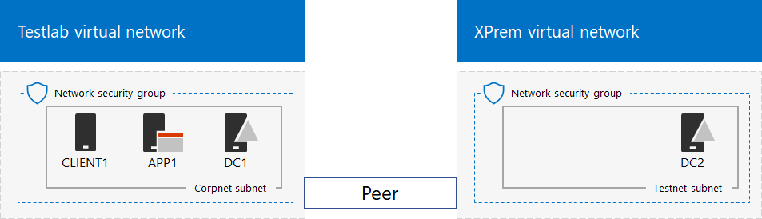
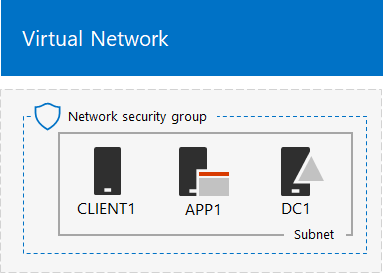

# <a name="simulated-cross-premises-virtual-network-in-a-microsoft-365-test-environment"></a><span data-ttu-id="33d94-103">Gesimuleerd cross-premises virtueel netwerk in een Microsoft 365-testomgeving</span><span class="sxs-lookup"><span data-stu-id="33d94-103">Simulated cross-premises virtual network in a Microsoft 365 test environment</span></span>

<span data-ttu-id="33d94-104">*Deze testlaborator kan worden gebruikt voor zowel Microsoft 365 voor bedrijven als Office 365 Enterprise testomgevingen.*</span><span class="sxs-lookup"><span data-stu-id="33d94-104">*This Test Lab Guide can be used for both Microsoft 365 for enterprise and Office 365 Enterprise test environments.*</span></span>

<span data-ttu-id="33d94-105">In dit artikel wordt stapsgewijs uitgelegd hoe u een gesimuleerde hybride cloudomgeving met Microsoft Azure maakt met behulp van twee virtuele Azure-netwerken.</span><span class="sxs-lookup"><span data-stu-id="33d94-105">This article steps you through creating a simulated hybrid cloud environment with Microsoft Azure using two Azure virtual networks.</span></span> <span data-ttu-id="33d94-106">Dit is de resulterende configuratie.</span><span class="sxs-lookup"><span data-stu-id="33d94-106">Here is the resulting configuration.</span></span> 
  

  
<span data-ttu-id="33d94-108">Hiermee wordt een Azure IaaS-productieomgeving met een hybride cloud gesimuleerd. Deze bestaat uit:</span><span class="sxs-lookup"><span data-stu-id="33d94-108">This simulates an Azure IaaS hybrid cloud production environment and consists of:</span></span>
  
- <span data-ttu-id="33d94-109">Een gesimuleerd en vereenvoudigd on-premises netwerk dat wordt gehost in een virtueel Azure-netwerk (het virtuele netwerk van TestLab).</span><span class="sxs-lookup"><span data-stu-id="33d94-109">A simulated and simplified on-premises network hosted in an Azure virtual network (the TestLab virtual network).</span></span>
    
- <span data-ttu-id="33d94-110">Een gesimuleerd cross-premises virtueel netwerk dat wordt gehost in Azure (XPrem).</span><span class="sxs-lookup"><span data-stu-id="33d94-110">A simulated cross-premises virtual network hosted in Azure (XPrem).</span></span>
    
- <span data-ttu-id="33d94-111">Een VNet-peeringrelatie tussen de twee virtuele netwerken.</span><span class="sxs-lookup"><span data-stu-id="33d94-111">A VNet peering relationship between the two virtual networks.</span></span>
    
- <span data-ttu-id="33d94-112">Een secundaire domeincontroller in het virtuele XPrem-netwerk.</span><span class="sxs-lookup"><span data-stu-id="33d94-112">A secondary domain controller in the XPrem virtual network.</span></span>
    
<span data-ttu-id="33d94-113">Dit biedt een basis en een gemeenschappelijk startpunt van waaruit u kunt:</span><span class="sxs-lookup"><span data-stu-id="33d94-113">This provides a basis and common starting point from which you can:</span></span> 
  
- <span data-ttu-id="33d94-114">Toepassingen in een gesimuleerde Azure IaaS hybride cloud-omgeving ontwikkelen en testen.</span><span class="sxs-lookup"><span data-stu-id="33d94-114">Develop and test applications in a simulated Azure IaaS hybrid cloud environment.</span></span>
    
- <span data-ttu-id="33d94-115">Testconfiguraties van computers maken, sommige binnen het virtuele TestLab-netwerk en sommige binnen het virtuele XPrem-netwerk, om hybride cloudgebaseerde IT-workloads te simuleren.</span><span class="sxs-lookup"><span data-stu-id="33d94-115">Create test configurations of computers, some within the TestLab virtual network and some within the XPrem virtual network, to simulate hybrid cloud-based IT workloads.</span></span>
    
<span data-ttu-id="33d94-116">Er zijn drie belangrijke fasen om deze testomgeving in te stellen:</span><span class="sxs-lookup"><span data-stu-id="33d94-116">There are three major phases to setting up this test environment:</span></span>
  
1. <span data-ttu-id="33d94-117">Het virtuele TestLab-netwerk configureren.</span><span class="sxs-lookup"><span data-stu-id="33d94-117">Configure the TestLab virtual network.</span></span>
    
2. <span data-ttu-id="33d94-118">Het cross-premises virtuele netwerk maken.</span><span class="sxs-lookup"><span data-stu-id="33d94-118">Create the cross-premises virtual network.</span></span>
    
3. <span data-ttu-id="33d94-119">DC2 configureren.</span><span class="sxs-lookup"><span data-stu-id="33d94-119">Configure DC2.</span></span>
    
> [!NOTE]
> <span data-ttu-id="33d94-120">Voor deze configuratie is een betaald Azure-abonnement vereist.</span><span class="sxs-lookup"><span data-stu-id="33d94-120">This configuration requires a paid Azure subscription.</span></span> 

<span data-ttu-id="33d94-121">U kunt de resulterende omgeving gebruiken [](https://www.microsoft.com/microsoft-365/enterprise) om de functies en functionaliteit van Microsoft 365 voor bedrijven te testen met extra [Test Lab Guides](m365-enterprise-test-lab-guides.md) of alleen.</span><span class="sxs-lookup"><span data-stu-id="33d94-121">You can use the resulting environment to test the features and functionality of [Microsoft 365 for enterprise](https://www.microsoft.com/microsoft-365/enterprise) with additional [Test Lab Guides](m365-enterprise-test-lab-guides.md) or on your own.</span></span>


> [!TIP]
> <span data-ttu-id="33d94-123">Ga naar [Microsoft 365 voor enterprise Test Lab Guide Stack](../downloads/Microsoft365EnterpriseTLGStack.pdf) voor een visuele kaart van alle artikelen in de Microsoft 365 voor enterprise Test Lab Guide stack.</span><span class="sxs-lookup"><span data-stu-id="33d94-123">Go to [Microsoft 365 for enterprise Test Lab Guide Stack](../downloads/Microsoft365EnterpriseTLGStack.pdf) for a visual map to all the articles in the Microsoft 365 for enterprise Test Lab Guide stack.</span></span>

## <a name="phase-1-configure-the-testlab-virtual-network"></a><span data-ttu-id="33d94-124">Fase 1: het virtuele TestLab-netwerk configureren.</span><span class="sxs-lookup"><span data-stu-id="33d94-124">Phase 1: Configure the TestLab virtual network</span></span>

<span data-ttu-id="33d94-125">Gebruik de instructies in **fase 1** van de [gesimuleerde enterprise base-configuratie](simulated-ent-base-configuration-microsoft-365-enterprise.md) om de DC1-, APP1- en CLIENT1-computers in het virtuele Azure-netwerk met de naam TestLab te configureren.</span><span class="sxs-lookup"><span data-stu-id="33d94-125">Use the instructions in **Phase 1** of the [simulated enterprise base configuration](simulated-ent-base-configuration-microsoft-365-enterprise.md) to configure the DC1, APP1, and CLIENT1 computers in the Azure virtual network named TestLab.</span></span>
  
<span data-ttu-id="33d94-126">Dit is de huidige configuratie.</span><span class="sxs-lookup"><span data-stu-id="33d94-126">This is your current configuration.</span></span> 
  

  
## <a name="phase-2-create-the-xprem-virtual-network"></a><span data-ttu-id="33d94-128">Fase 2: het virtuele netwerk XPrem maken</span><span class="sxs-lookup"><span data-stu-id="33d94-128">Phase 2: Create the XPrem virtual network</span></span>

<span data-ttu-id="33d94-129">In deze fase maakt en configureert u het nieuwe virtuele netwerk XPrem en verbindt u het vervolgens door middel van VNet-peering met het virtuele netwerk van TestLab.</span><span class="sxs-lookup"><span data-stu-id="33d94-129">In this phase, you create and configure the new XPrem virtual network and then connect it to the TestLab virtual network with VNet peering.</span></span>
  
<span data-ttu-id="33d94-130">Start eerst een Azure PowerShell-prompt op uw lokale computer.</span><span class="sxs-lookup"><span data-stu-id="33d94-130">First, start an Azure PowerShell prompt on your local computer.</span></span>
  
> [!NOTE]
> <span data-ttu-id="33d94-131">De volgende opdrachtsets gebruiken de nieuwste versie van Azure PowerShell.</span><span class="sxs-lookup"><span data-stu-id="33d94-131">The following command sets use the latest version of Azure PowerShell.</span></span> <span data-ttu-id="33d94-132">Zie [Aan de slag met Azure PowerShell-cmdlets](/powershell/azureps-cmdlets-docs/).</span><span class="sxs-lookup"><span data-stu-id="33d94-132">See [Get started with Azure PowerShell cmdlets](/powershell/azureps-cmdlets-docs/).</span></span> 
  
<span data-ttu-id="33d94-133">Meld u aan bij uw Azure-account met behulp van de volgende opdracht.</span><span class="sxs-lookup"><span data-stu-id="33d94-133">Sign in to your Azure account with this command.</span></span>
  
```powershell
Connect-AzAccount
```

<span data-ttu-id="33d94-134">Haal de naam van uw abonnement op met behulp van de volgende opdracht.</span><span class="sxs-lookup"><span data-stu-id="33d94-134">Get your subscription name using this command.</span></span>
  
```powershell
Get-AzSubscription | Sort Name | Select Name
```

<span data-ttu-id="33d94-135">Stel uw Azure-abonnement in.</span><span class="sxs-lookup"><span data-stu-id="33d94-135">Set your Azure subscription.</span></span> <span data-ttu-id="33d94-136">Vervang alles binnen de aanhalingstekens, inclusief de \< and >-tekens, met de juiste namen.</span><span class="sxs-lookup"><span data-stu-id="33d94-136">Replace everything within the quotes, including the \< and > characters, with the correct names.</span></span>
  
```powershell
$subscrName="<subscription name>"
Select-AzSubscription -SubscriptionName $subscrName
```

<span data-ttu-id="33d94-137">Maak vervolgens het virtuele XPrem-netwerk en beveilig dit met een netwerkbeveiligingsgroep met deze opdrachten.</span><span class="sxs-lookup"><span data-stu-id="33d94-137">Next, create the XPrem virtual network and protect it with a network security group with these commands.</span></span>
  
```powershell
$rgName="<name of the resource group that you used for your TestLab virtual network>"
$locName=(Get-AzResourceGroup -Name $rgName).Location
$Testnet=New-AzVirtualNetworkSubnetConfig -Name "Testnet" -AddressPrefix 192.168.0.0/24
New-AzVirtualNetwork -Name "XPrem" -ResourceGroupName $rgName -Location $locName -AddressPrefix 192.168.0.0/16 -Subnet $Testnet -DNSServer 10.0.0.4
$rule1=New-AzNetworkSecurityRuleConfig -Name "RDPTraffic" -Description "Allow RDP to all VMs on the subnet" -Access Allow -Protocol Tcp -Direction Inbound -Priority 100 -SourceAddressPrefix Internet -SourcePortRange * -DestinationAddressPrefix * -DestinationPortRange 3389
New-AzNetworkSecurityGroup -Name "Testnet" -ResourceGroupName $rgName -Location $locName -SecurityRules $rule1
$vnet=Get-AzVirtualNetwork -ResourceGroupName $rgName -Name XPrem
$nsg=Get-AzNetworkSecurityGroup -Name "Testnet" -ResourceGroupName $rgName
Set-AzVirtualNetworkSubnetConfig -VirtualNetwork $vnet -Name "Testnet" -AddressPrefix 192.168.0.0/24 -NetworkSecurityGroup $nsg
$vnet | Set-AzVirtualNetwork
```

<span data-ttu-id="33d94-138">Vervolgens maakt u met de volgende opdrachten de VNet-peeringrelatie tussen het TestLab en XPrem VNets.</span><span class="sxs-lookup"><span data-stu-id="33d94-138">Next, you create the VNet peering relationship between the TestLab and XPrem VNets with these commands.</span></span>
  
```powershell
$rgName="<name of the resource group that you used for your TestLab virtual network>"
$vnet1=Get-AzVirtualNetwork -ResourceGroupName $rgName -Name TestLab
$vnet2=Get-AzVirtualNetwork -ResourceGroupName $rgName -Name XPrem
Add-AzVirtualNetworkPeering -Name TestLab2XPrem -VirtualNetwork $vnet1 -RemoteVirtualNetworkId $vnet2.Id
Add-AzVirtualNetworkPeering -Name XPrem2TestLab -VirtualNetwork $vnet2 -RemoteVirtualNetworkId $vnet1.Id
```

<span data-ttu-id="33d94-139">Dit is de huidige configuratie.</span><span class="sxs-lookup"><span data-stu-id="33d94-139">This is your current configuration.</span></span> 
  

  
## <a name="phase-3-configure-dc2"></a><span data-ttu-id="33d94-141">Fase 3: DC2 configureren</span><span class="sxs-lookup"><span data-stu-id="33d94-141">Phase 3: Configure DC2</span></span>

<span data-ttu-id="33d94-142">In deze fase maakt u de virtuele DC2-machine in het virtuele XPrem-netwerk en configureert u deze vervolgens als een replicadomeincontroller.</span><span class="sxs-lookup"><span data-stu-id="33d94-142">In this phase, you create the DC2 virtual machine in the XPrem virtual network and then configure it as a replica domain controller.</span></span>
  
<span data-ttu-id="33d94-143">Maak eerst een virtuele machine voor DC2.</span><span class="sxs-lookup"><span data-stu-id="33d94-143">First, create a virtual machine for DC2.</span></span> <span data-ttu-id="33d94-144">Voer deze opdrachten uit vanaf de opdrachtprompt van Azure PowerShell op uw lokale computer.</span><span class="sxs-lookup"><span data-stu-id="33d94-144">Run these commands at the Azure PowerShell command prompt on your local computer.</span></span>
  
```powershell
$rgName="<your resource group name>"
$locName=(Get-AzResourceGroup -Name $rgName).Location
$vnet=Get-AzVirtualNetwork -Name XPrem -ResourceGroupName $rgName
$pip=New-AzPublicIpAddress -Name DC2-PIP -ResourceGroupName $rgName -Location $locName -AllocationMethod Dynamic
$nic=New-AzNetworkInterface -Name DC2-NIC -ResourceGroupName $rgName -Location $locName -SubnetId $vnet.Subnets[0].Id -PublicIpAddressId $pip.Id -PrivateIpAddress 192.168.0.4
$vm=New-AzVMConfig -VMName DC2 -VMSize Standard_A2_V2
$cred=Get-Credential -Message "Type the name and password of the local administrator account for DC2."
$vm=Set-AzVMOperatingSystem -VM $vm -Windows -ComputerName DC2 -Credential $cred -ProvisionVMAgent -EnableAutoUpdate
$vm=Set-AzVMSourceImage -VM $vm -PublisherName MicrosoftWindowsServer -Offer WindowsServer -Skus 2016-Datacenter -Version "latest"
$vm=Add-AzVMNetworkInterface -VM $vm -Id $nic.Id
$vm=Set-AzVMOSDisk -VM $vm -Name "DC2-OS" -DiskSizeInGB 128 -CreateOption FromImage -StorageAccountType "Standard_LRS"
$diskConfig=New-AzDiskConfig -AccountType "Standard_LRS" -Location $locName -CreateOption Empty -DiskSizeGB 20
$dataDisk1=New-AzDisk -DiskName "DC2-DataDisk1" -Disk $diskConfig -ResourceGroupName $rgName
$vm=Add-AzVMDataDisk -VM $vm -Name "DC2-DataDisk1" -CreateOption Attach -ManagedDiskId $dataDisk1.Id -Lun 1
New-AzVM -ResourceGroupName $rgName -Location $locName -VM $vm
```

<span data-ttu-id="33d94-145">Maak vervolgens verbinding met de nieuwe virtuele DC2-machine vanuit de [Microsoft Azure-portal](https://portal.azure.com) met de naam en het wachtwoord van de lokale beheerdersaccount.</span><span class="sxs-lookup"><span data-stu-id="33d94-145">Next, connect to the new DC2 virtual machine from the [Azure portal](https://portal.azure.com) using its local administrator account name and password.</span></span>
  
<span data-ttu-id="33d94-146">Configureer vervolgens een Windows Firewall-regel om verkeer toe te staan voor elementaire connectiviteitstests.</span><span class="sxs-lookup"><span data-stu-id="33d94-146">Next, configure a Windows Firewall rule to allow traffic for basic connectivity testing.</span></span> <span data-ttu-id="33d94-147">Voer deze opdrachten uit vanaf een Windows PowerShell-opdrachtprompt op beheerdersniveau op DC2.</span><span class="sxs-lookup"><span data-stu-id="33d94-147">From an administrator-level Windows PowerShell command prompt on DC2, run these commands.</span></span> 
  
```powershell
Set-NetFirewallRule -DisplayName "File and Printer Sharing (Echo Request - ICMPv4-In)" -enabled True
ping dc1.corp.contoso.com
```

<span data-ttu-id="33d94-148">Het ping-commando moet resulteren in vier succesvolle antwoorden vanaf IP-adres 10.0.0.4.</span><span class="sxs-lookup"><span data-stu-id="33d94-148">The ping command should result in four successful replies from IP address 10.0.0.4.</span></span> <span data-ttu-id="33d94-149">Dit is een test van het verkeer binnen de VNet-peering-relatie.</span><span class="sxs-lookup"><span data-stu-id="33d94-149">This is a test of traffic across the VNet peering relationship.</span></span> 
  
<span data-ttu-id="33d94-150">Voeg vervolgens de extra gegevensschijf toe als een nieuw volume met de stationsletter F: met deze opdracht vanaf de opdrachtprompt van Windows PowerShell op DC2.</span><span class="sxs-lookup"><span data-stu-id="33d94-150">Next, add the extra data disk as a new volume with the drive letter F: with this command from the Windows PowerShell command prompt on DC2.</span></span>
  
```powershell
Get-Disk | Where PartitionStyle -eq "RAW" | Initialize-Disk -PartitionStyle MBR -PassThru | New-Partition -AssignDriveLetter -UseMaximumSize | Format-Volume -FileSystem NTFS -NewFileSystemLabel "WSAD Data"
```

<span data-ttu-id="33d94-151">Configureer vervolgens DC2 als een replicadomeincontroller voor het corp.contoso.com-domein.</span><span class="sxs-lookup"><span data-stu-id="33d94-151">Next, configure DC2 as a replica domain controller for the corp.contoso.com domain.</span></span> <span data-ttu-id="33d94-152">Voer deze opdrachten uit vanaf de Windows PowerShell-opdrachtprompt op DC2.</span><span class="sxs-lookup"><span data-stu-id="33d94-152">Run these commands from the Windows PowerShell command prompt on DC2.</span></span>
  
```powershell
Install-WindowsFeature AD-Domain-Services -IncludeManagementTools
Install-ADDSDomainController -Credential (Get-Credential CORP\User1) -DomainName "corp.contoso.com" -InstallDns:$true -DatabasePath "F:\NTDS" -LogPath "F:\Logs" -SysvolPath "F:\SYSVOL"
```

<span data-ttu-id="33d94-153">Merk op dat u wordt gevraagd om zowel het CORP\\ User1-wachtwoord als een Directory Services Restore Mode (DSRM) -wachtwoord op te geven en DC2 opnieuw te starten.</span><span class="sxs-lookup"><span data-stu-id="33d94-153">Note that you are prompted to supply both the CORP\\User1 password and a Directory Services Restore Mode (DSRM) password, and to restart DC2.</span></span> 
  
<span data-ttu-id="33d94-154">Nu het virtuele XPrem-netwerk een eigen DNS-server (DC2) heeft, moet u het virtuele XPrem-netwerk configureren om deze DNS-server te gebruiken.</span><span class="sxs-lookup"><span data-stu-id="33d94-154">Now that the XPrem virtual network has its own DNS server (DC2), you must configure the XPrem virtual network to use this DNS server.</span></span> <span data-ttu-id="33d94-155">Voer deze opdrachten uit vanaf de opdrachtprompt van Azure PowerShell op uw lokale computer.</span><span class="sxs-lookup"><span data-stu-id="33d94-155">Run these commands from the Azure PowerShell command prompt on your local computer.</span></span>
  
```powershell
$vnet=Get-AzVirtualNetwork -ResourceGroupName $rgName -name "XPrem"
$vnet.DhcpOptions.DnsServers="192.168.0.4" 
Set-AzVirtualNetwork -VirtualNetwork $vnet
Restart-AzVM -ResourceGroupName $rgName -Name "DC2"
```

<span data-ttu-id="33d94-156">Maak vanuit de Microsoft Azure-portal op uw lokale computer verbinding met DC1 met de CORP\\User1-referenties.</span><span class="sxs-lookup"><span data-stu-id="33d94-156">From the Azure portal on your local computer, connect to DC1 with the CORP\\User1 credentials.</span></span> <span data-ttu-id="33d94-157">Om het CORP-domein zo te configureren dat computers en gebruikers hun lokale domeincontroller gebruiken voor verificatie, voert u deze opdrachten uit vanaf een Windows PowerShell-opdrachtprompt op beheerdersniveau op DC1.</span><span class="sxs-lookup"><span data-stu-id="33d94-157">To configure the CORP domain so that computers and users use their local domain controller for authentication, run these commands from an administrator-level Windows PowerShell command prompt on DC1.</span></span>
  
```powershell
New-ADReplicationSite -Name "TestLab" 
New-ADReplicationSite -Name "XPrem"
New-ADReplicationSubnet -Name "10.0.0.0/8" -Site "TestLab"
New-ADReplicationSubnet -Name "192.168.0.0/16" -Site "XPrem"
```

<span data-ttu-id="33d94-158">Dit is de huidige configuratie.</span><span class="sxs-lookup"><span data-stu-id="33d94-158">This is your current configuration.</span></span> 
  

  
<span data-ttu-id="33d94-160">De gesimuleerde Azure hybride cloudomgeving is nu gereed om getest te worden.</span><span class="sxs-lookup"><span data-stu-id="33d94-160">Your simulated Azure hybrid cloud environment is now ready for testing.</span></span>
  
<span data-ttu-id="33d94-161">U bent nu klaar om te experimenteren met extra functies van [Microsoft 365 voor bedrijven.](https://www.microsoft.com/microsoft-365/enterprise)</span><span class="sxs-lookup"><span data-stu-id="33d94-161">You are now ready to experiment with additional features of [Microsoft 365 for enterprise](https://www.microsoft.com/microsoft-365/enterprise).</span></span>
  
## <a name="next-steps"></a><span data-ttu-id="33d94-162">Volgende stappen</span><span class="sxs-lookup"><span data-stu-id="33d94-162">Next steps</span></span>

<span data-ttu-id="33d94-163">Verken de volgende extra sets testlabrichtlijnen:</span><span class="sxs-lookup"><span data-stu-id="33d94-163">Explore these additional sets of Test Lab Guides:</span></span>
  
- [<span data-ttu-id="33d94-164">Identiteit</span><span class="sxs-lookup"><span data-stu-id="33d94-164">Identity</span></span>](m365-enterprise-test-lab-guides.md#identity)
- [<span data-ttu-id="33d94-165">Mobile Device Management</span><span class="sxs-lookup"><span data-stu-id="33d94-165">Mobile device management</span></span>](m365-enterprise-test-lab-guides.md#mobile-device-management)
- [<span data-ttu-id="33d94-166">Gegevensbeveiliging</span><span class="sxs-lookup"><span data-stu-id="33d94-166">Information protection</span></span>](m365-enterprise-test-lab-guides.md#information-protection)

## <a name="see-also"></a><span data-ttu-id="33d94-167">Zie ook</span><span class="sxs-lookup"><span data-stu-id="33d94-167">See also</span></span>

[<span data-ttu-id="33d94-168">Microsoft 365 Enterprise-testlabrichtlijnen</span><span class="sxs-lookup"><span data-stu-id="33d94-168">Microsoft 365 for enterprise Test Lab Guides</span></span>](m365-enterprise-test-lab-guides.md)

[<span data-ttu-id="33d94-169">Overzicht van Microsoft 365 voor ondernemingen</span><span class="sxs-lookup"><span data-stu-id="33d94-169">Microsoft 365 for enterprise overview</span></span>](microsoft-365-overview.md)

[<span data-ttu-id="33d94-170">Microsoft 365 enterprise-documentatie</span><span class="sxs-lookup"><span data-stu-id="33d94-170">Microsoft 365 for enterprise documentation</span></span>](/microsoft-365-enterprise/)