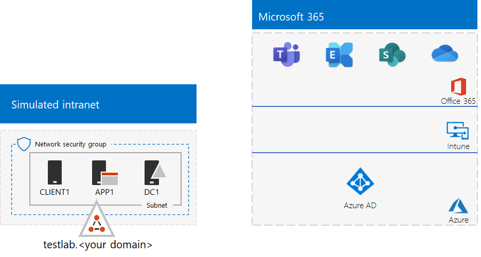
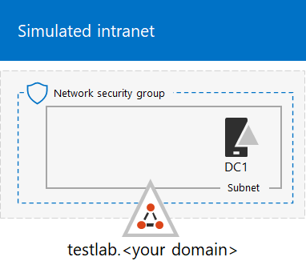

# <a name="the-simulated-enterprise-base-configuration"></a><span data-ttu-id="69b12-103">De basisconfiguratie voor een gesimuleerde Enterprise</span><span class="sxs-lookup"><span data-stu-id="69b12-103">The simulated enterprise base configuration</span></span>

<span data-ttu-id="69b12-104">*U kunt deze test lab-handleiding gebruiken voor zowel Microsoft 365 voor Enterprise als Office 365 Enterprise test omgevingen.*</span><span class="sxs-lookup"><span data-stu-id="69b12-104">*This Test Lab Guide can be used for both Microsoft 365 for enterprise and Office 365 Enterprise test environments.*</span></span>

<span data-ttu-id="69b12-105">In dit artikel wordt uitgelegd hoe u een vereenvoudigde omgeving maakt voor Microsoft 365 for Enterprise, waaronder:</span><span class="sxs-lookup"><span data-stu-id="69b12-105">This article describes how to create a simplified environment for Microsoft 365 for enterprise that includes:</span></span>

- <span data-ttu-id="69b12-106">Een proef- of betaald abonnement op Microsoft 365 E5.</span><span class="sxs-lookup"><span data-stu-id="69b12-106">A Microsoft 365 E5 trial or paid subscription.</span></span>
- <span data-ttu-id="69b12-107">Een eenvoudiger organisatie intranet, dat verbonden is met internet, bestaande uit drie virtuele machines op een virtueel Azure-netwerk (DC1, APP1 en CLIENT1).</span><span class="sxs-lookup"><span data-stu-id="69b12-107">A simplified organization intranet connected to the internet, consisting of three virtual machines on an Azure virtual network (DC1, APP1, and CLIENT1).</span></span>
 


<span data-ttu-id="69b12-109">Het maken van een vereenvoudigde testomgeving bestaat uit twee fasen:</span><span class="sxs-lookup"><span data-stu-id="69b12-109">Creating a simplified test environment involves two phases:</span></span>
- [<span data-ttu-id="69b12-110">Fase 1: Creëer een gesimuleerd intranet</span><span class="sxs-lookup"><span data-stu-id="69b12-110">Phase 1: Create a simulated intranet</span></span>](#phase-1-create-a-simulated-intranet)
- [<span data-ttu-id="69b12-111">Fase 2: Maak uw abonnement op Microsoft 365 E5</span><span class="sxs-lookup"><span data-stu-id="69b12-111">Phase 2: Create your Microsoft 365 E5 subscription</span></span>](#phase-2-create-your-microsoft-365-e5-subscription)

<span data-ttu-id="69b12-112">U kunt de beschikbare omgeving gebruiken om de functies en functionaliteit van [Microsoft 365 te testen voor Enterprise](https://www.microsoft.com/microsoft-365/enterprise) met extra testlab- [handleidingen](m365-enterprise-test-lab-guides.md) of zelf een eigen omgeving.</span><span class="sxs-lookup"><span data-stu-id="69b12-112">You can use the resulting environment to test the features and functionality of [Microsoft 365 for enterprise](https://www.microsoft.com/microsoft-365/enterprise) with additional [Test Lab Guides](m365-enterprise-test-lab-guides.md) or on your own.</span></span>


> [!TIP]
> <span data-ttu-id="69b12-114">Ga naar [Microsoft 365 for Enterprise test lab Guide](../downloads/Microsoft365EnterpriseTLGStack.pdf)van een visuele kaart voor alle artikelen in de stack microsoft 365 for Enterprise test lab Guide.</span><span class="sxs-lookup"><span data-stu-id="69b12-114">For a visual map to all the articles in the Microsoft 365 for enterprise Test Lab Guide stack, go to [Microsoft 365 for enterprise Test Lab Guide Stack](../downloads/Microsoft365EnterpriseTLGStack.pdf).</span></span>

## <a name="phase-1-create-a-simulated-intranet"></a><span data-ttu-id="69b12-115">Fase 1: Creëer een gesimuleerd intranet</span><span class="sxs-lookup"><span data-stu-id="69b12-115">Phase 1: Create a simulated intranet</span></span>

<span data-ttu-id="69b12-116">In deze fase maakt u een gesimuleerd intranet in azure-infrastructuurservices die een Active Directory Domain Services (AD DS)-domeincontroller, een toepassingsserver en een clientcomputer omvat.</span><span class="sxs-lookup"><span data-stu-id="69b12-116">In this phase, build a simulated intranet in Azure infrastructure services that includes an Active Directory Domain Services (AD DS) domain controller, an application server, and a client computer.</span></span>

<span data-ttu-id="69b12-117">U gebruikt deze computers in extra [Microsoft 365 voor Enterprise test lab-handleidingen voor](m365-enterprise-test-lab-guides.md) het configureren en demonstreren van de Hybrid Identity en andere mogelijkheden.</span><span class="sxs-lookup"><span data-stu-id="69b12-117">You'll use these computers in additional [Microsoft 365 for enterprise Test Lab Guides](m365-enterprise-test-lab-guides.md) to configure and demonstrate hybrid identity and other capabilities.</span></span>

### <a name="method-1-build-your-simulated-intranet-with-an-azure-resource-manager-template"></a><span data-ttu-id="69b12-118">Methode 1: Maak uw gesimuleerde intranet met een Azure Resource Manager-sjabloon</span><span class="sxs-lookup"><span data-stu-id="69b12-118">Method 1: Build your simulated intranet with an Azure Resource Manager template</span></span>

<span data-ttu-id="69b12-119">Bij deze methode gebruikt u een Azure Resource Manager-sjabloon om de gesimuleerde intranet samen te stellen.</span><span class="sxs-lookup"><span data-stu-id="69b12-119">In this method, you use an Azure Resource Manager template to build out the simulated intranet.</span></span> <span data-ttu-id="69b12-120">Azure Resource Manager-sjablonen bevatten alle instructies voor het maken van de infrastructuur van Azure-netwerken, de virtuele machines en hun configuratie.</span><span class="sxs-lookup"><span data-stu-id="69b12-120">Azure Resource Manager templates contain all of the instructions to create the Azure networking infrastructure, the virtual machines, and their configuration.</span></span>

<span data-ttu-id="69b12-121">Lees voordat u de sjabloon implementeert, de [Leesmij-pagina voor sjablonen](https://github.com/maxskunkworks/TLG/tree/master/tlg-base-config_3-vm.m365-ems) en de volgende informatie:</span><span class="sxs-lookup"><span data-stu-id="69b12-121">Before deploying the template, read through the [template README page](https://github.com/maxskunkworks/TLG/tree/master/tlg-base-config_3-vm.m365-ems) and have the following information ready:</span></span>

- <span data-ttu-id="69b12-122">De openbare DNS-domeinnaam van uw testomgeving (testlab.\<*your public domain*>).</span><span class="sxs-lookup"><span data-stu-id="69b12-122">The public DNS domain name of your test environment (testlab.\<*your public domain*>).</span></span> <span data-ttu-id="69b12-123">U typt deze naam in het veld **domain name** van de pagina **Custom Deployment** .</span><span class="sxs-lookup"><span data-stu-id="69b12-123">You'll enter this name in the **Domain Name** field of the **Custom deployment** page.</span></span>
- <span data-ttu-id="69b12-124">Een DNS-label voorvoegsel voor de Url's van de openbare IP-adressen van uw virtuele machines.</span><span class="sxs-lookup"><span data-stu-id="69b12-124">A DNS label prefix for the URLs of the public IP addresses of your virtual machines.</span></span> <span data-ttu-id="69b12-125">U moet dit label invoeren in het veld **DNS-label voorvoegsel** van de pagina **Aangepaste implementatie**.</span><span class="sxs-lookup"><span data-stu-id="69b12-125">You'll need to enter this label in the **Dns Label Prefix** field of the **Custom deployment** page.</span></span>

<span data-ttu-id="69b12-126">Nadat u de instructies hebt gelezen, selecteert u **implementeren naar Azure** op de [Leesmij-pagina](https://github.com/maxskunkworks/TLG/tree/master/tlg-base-config_3-vm.m365-ems) van het sjabloon om aan de slag te gaan.</span><span class="sxs-lookup"><span data-stu-id="69b12-126">After you read through the instructions, select **Deploy to Azure** on the [template README page](https://github.com/maxskunkworks/TLG/tree/master/tlg-base-config_3-vm.m365-ems) to get started.</span></span>

>[!Note]
><span data-ttu-id="69b12-127">Voor een gesimuleerd intranet dat is gemaakt met de Azure Resource Manager-sjabloon is een betaald Azure-abonnement vereist.</span><span class="sxs-lookup"><span data-stu-id="69b12-127">The simulated intranet built by the Azure Resource Manager template requires a paid Azure subscription.</span></span>

<span data-ttu-id="69b12-128">Wanneer de sjabloon is voltooid, ziet de configuratie er als volgt uit:</span><span class="sxs-lookup"><span data-stu-id="69b12-128">After the template is complete, your configuration looks like this:</span></span>


### <a name="method-2-build-your-simulated-intranet-with-azure-powershell"></a><span data-ttu-id="69b12-130">Methode 2: Maak uw gesimuleerde intranet met Azure PowerShell</span><span class="sxs-lookup"><span data-stu-id="69b12-130">Method 2: Build your simulated intranet with Azure PowerShell</span></span>

<span data-ttu-id="69b12-131">Bij deze methode gebruikt u Windows PowerShell en de Azure PowerShell-module om de netwerkinfrastructuur, de virtuele machines en de configuratie ervan op te bouwen.</span><span class="sxs-lookup"><span data-stu-id="69b12-131">In this method, you use Windows PowerShell and the Azure PowerShell module to build out the networking infrastructure, the virtual machines, and their configuration.</span></span>

<span data-ttu-id="69b12-132">Gebruik deze methode als u ervaring wilt opdoen met het stap voor stap maken van elementen van de Azure-infrastructuur met PowerShell.</span><span class="sxs-lookup"><span data-stu-id="69b12-132">Use this method if you want to get experience creating elements of Azure infrastructure one step at a time with PowerShell.</span></span> <span data-ttu-id="69b12-133">Vervolgens kunt u de PowerShell-opdrachtblokken aanpassen voor uw eigen implementatie van andere virtuele machines in Azure.</span><span class="sxs-lookup"><span data-stu-id="69b12-133">You can then customize the PowerShell command blocks for your own deployment of other virtual machines in Azure.</span></span>

#### <a name="step-1-create-dc1"></a><span data-ttu-id="69b12-134">Stap 1: DC1 maken</span><span class="sxs-lookup"><span data-stu-id="69b12-134">Step 1: Create DC1</span></span>

<span data-ttu-id="69b12-135">In deze stap maakt u een virtueel Azure-netwerk en voegt u DC1, een virtuele machine met een domeincontroller voor een AD DS-domein toe.</span><span class="sxs-lookup"><span data-stu-id="69b12-135">In this step, you create an Azure virtual network and add DC1, a virtual machine that is a domain controller for an AD DS domain.</span></span>

<span data-ttu-id="69b12-136">Begin met het aanmaken van een Windows PowerShell-opdrachtprompt op uw lokale computer.</span><span class="sxs-lookup"><span data-stu-id="69b12-136">First, start a Windows PowerShell command prompt on your local computer.</span></span>
  
> [!NOTE]
> <span data-ttu-id="69b12-137">Met de volgende opdrachtsets wordt de meest recente versie van Azure PowerShell gebruikt.</span><span class="sxs-lookup"><span data-stu-id="69b12-137">The following command sets use the latest version of Azure PowerShell.</span></span> <span data-ttu-id="69b12-138">Zie [Aan de slag met Azure PowerShell-cmdlets](https://docs.microsoft.com/powershell/azureps-cmdlets-docs/).</span><span class="sxs-lookup"><span data-stu-id="69b12-138">See [Get started with Azure PowerShell cmdlets](https://docs.microsoft.com/powershell/azureps-cmdlets-docs/).</span></span> 
  
<span data-ttu-id="69b12-139">Meld u aan bij uw Azure-account met behulp van de volgende opdracht.</span><span class="sxs-lookup"><span data-stu-id="69b12-139">Sign in to your Azure account with the following command.</span></span>
  
```powershell
Connect-AzAccount
```

<span data-ttu-id="69b12-140">Haal de naam van uw abonnement op met de volgende opdracht.</span><span class="sxs-lookup"><span data-stu-id="69b12-140">Get your subscription name using the following command.</span></span>
  
```powershell
Get-AzSubscription | Sort Name | Select Name
```

<span data-ttu-id="69b12-141">Stel uw Azure-abonnement in.</span><span class="sxs-lookup"><span data-stu-id="69b12-141">Set your Azure subscription.</span></span> <span data-ttu-id="69b12-142">Vervang alles tussen de aanhalingstekens, inclusief de punthaken ("<" en ">"), met de juiste naam.</span><span class="sxs-lookup"><span data-stu-id="69b12-142">Replace everything within the quotation marks, including the angle brackets ("<" and ">"), with the correct name.</span></span>
  
```powershell
$subscr="<subscription name>"
Get-AzSubscription -SubscriptionName $subscr | Select-AzSubscription
```

<span data-ttu-id="69b12-143">Maak vervolgens een nieuwe resourcegroep aan voor uw gesimuleerde Enterprise-testlab.</span><span class="sxs-lookup"><span data-stu-id="69b12-143">Next, create a new resource group for your simulated enterprise test lab.</span></span> <span data-ttu-id="69b12-144">Als u de naam van een unieke resourcegroep wilt bepalen, gebruikt u deze opdracht om uw bestaande resourcegroepen weer te geven.</span><span class="sxs-lookup"><span data-stu-id="69b12-144">To determine a unique resource group name, use this command to list your existing resource groups.</span></span>
  
```powershell
Get-AzResourceGroup | Sort ResourceGroupName | Select ResourceGroupName
```

<span data-ttu-id="69b12-145">Maak uw nieuwe resourcegroep aan met deze opdrachten.</span><span class="sxs-lookup"><span data-stu-id="69b12-145">Create your new resource group with these commands.</span></span> <span data-ttu-id="69b12-146">Vervang alles tussen de aanhalingstekens, inclusief de punthaken, en de juiste namen.</span><span class="sxs-lookup"><span data-stu-id="69b12-146">Replace everything within the quotation marks, including the angle brackets, with the correct names.</span></span>
  
```powershell
$rgName="<resource group name>"
$locName="<location name, such as West US>"
New-AzResourceGroup -Name $rgName -Location $locName
```

<span data-ttu-id="69b12-147">Vervolgens maakt u een TestLab virtueel netwerk dat het subnet van het bedrijfsnetwerk van de gesimuleerde bedrijfsomgeving host, en Beveilig dit met een netwerkbeveiligingsgroep.</span><span class="sxs-lookup"><span data-stu-id="69b12-147">Next, create the TestLab virtual network that will host the corporate network subnet of the simulated enterprise environment and protect it with a network security group.</span></span> <span data-ttu-id="69b12-148">Vul de naam van uw resourcegroep in en voer deze opdrachten uit bij de opdrachtprompt van PowerShell op uw lokale computer.</span><span class="sxs-lookup"><span data-stu-id="69b12-148">Fill in the name of your resource group and run these commands at the PowerShell command prompt on your local computer.</span></span>
  
```powershell
$rgName="<name of your new resource group>"
$locName=(Get-AzResourceGroup -Name $rgName).Location
$corpnetSubnet=New-AzVirtualNetworkSubnetConfig -Name Corpnet -AddressPrefix 10.0.0.0/24
New-AzVirtualNetwork -Name TestLab -ResourceGroupName $rgName -Location $locName -AddressPrefix 10.0.0.0/8 -Subnet $corpnetSubnet -DNSServer 10.0.0.4
$rule1=New-AzNetworkSecurityRuleConfig -Name "RDPTraffic" -Description "Allow RDP to all VMs on the subnet" -Access Allow -Protocol Tcp -Direction Inbound -Priority 100 -SourceAddressPrefix Internet -SourcePortRange * -DestinationAddressPrefix * -DestinationPortRange 3389
New-AzNetworkSecurityGroup -Name Corpnet -ResourceGroupName $rgName -Location $locName -SecurityRules $rule1
$vnet=Get-AzVirtualNetwork -ResourceGroupName $rgName -Name TestLab
$nsg=Get-AzNetworkSecurityGroup -Name Corpnet -ResourceGroupName $rgName
Set-AzVirtualNetworkSubnetConfig -VirtualNetwork $vnet -Name Corpnet -AddressPrefix "10.0.0.0/24" -NetworkSecurityGroup $nsg
$vnet | Set-AzVirtualNetwork
```

<span data-ttu-id="69b12-149">Vervolgens maakt u de DC1-virtuele machine en configureert u deze als een domeincontroller voor het **testlab.**\<your public domain></span><span class="sxs-lookup"><span data-stu-id="69b12-149">Next, you create the DC1 virtual machine and configure it as a domain controller for the **testlab.**\<your public domain></span></span> <span data-ttu-id="69b12-150">AD DS-domein en een DNS-server voor de virtuele machines van het Testlab-virtuele netwerk.</span><span class="sxs-lookup"><span data-stu-id="69b12-150">AD DS domain and a DNS server for the virtual machines of the TestLab virtual network.</span></span> <span data-ttu-id="69b12-151">Als de naam van uw openbare domein bijvoorbeeld **<span>contoso</span>. com** is, is de DC1-virtuele machine een domeincontroller voor het **<span>testlab</span>. contoso.com**-domein.</span><span class="sxs-lookup"><span data-stu-id="69b12-151">For example, if your public domain name is **<span>contoso</span>.com**, the DC1 virtual machine will be a domain controller for the **<span>testlab</span>.contoso.com** domain.</span></span>
  
<span data-ttu-id="69b12-152">Als u een virtuele machine van Azure wilt aanmaken voor DC1, vult u de naam van uw resourcegroep in en voert u deze opdrachten uit bij de opdrachtprompt van PowerShell op uw lokale computer.</span><span class="sxs-lookup"><span data-stu-id="69b12-152">To create an Azure virtual machine for DC1, fill in the name of your resource group and run these commands at the PowerShell command prompt on your local computer.</span></span>
  
```powershell
$rgName="<resource group name>"
$locName=(Get-AzResourceGroup -Name $rgName).Location
$vnet=Get-AzVirtualNetwork -Name TestLab -ResourceGroupName $rgName
$pip=New-AzPublicIpAddress -Name DC1-PIP -ResourceGroupName $rgName -Location $locName -AllocationMethod Dynamic
$nic=New-AzNetworkInterface -Name DC1-NIC -ResourceGroupName $rgName -Location $locName -SubnetId $vnet.Subnets[0].Id -PublicIpAddressId $pip.Id -PrivateIpAddress 10.0.0.4
$vm=New-AzVMConfig -VMName DC1 -VMSize Standard_A2_V2
$cred=Get-Credential -Message "Type the name and password of the local administrator account for DC1."
$vm=Set-AzVMOperatingSystem -VM $vm -Windows -ComputerName DC1 -Credential $cred -ProvisionVMAgent -EnableAutoUpdate
$vm=Set-AzVMSourceImage -VM $vm -PublisherName MicrosoftWindowsServer -Offer WindowsServer -Skus 2016-Datacenter -Version "latest"
$vm=Add-AzVMNetworkInterface -VM $vm -Id $nic.Id
$vm=Set-AzVMOSDisk -VM $vm -Name "DC1-OS" -DiskSizeInGB 128 -CreateOption FromImage
$diskConfig=New-AzDiskConfig -AccountType "Standard_LRS" -Location $locName -CreateOption Empty -DiskSizeGB 20
$dataDisk1=New-AzDisk -DiskName "DC1-DataDisk1" -Disk $diskConfig -ResourceGroupName $rgName
$vm=Add-AzVMDataDisk -VM $vm -Name "DC1-DataDisk1" -CreateOption Attach -ManagedDiskId $dataDisk1.Id -Lun 1
New-AzVM -ResourceGroupName $rgName -Location $locName -VM $vm
```

<span data-ttu-id="69b12-153">U wordt gevraagd om een gebruikersnaam en wachtwoord voor het lokale Administrator-account op DC1 aan te maken.</span><span class="sxs-lookup"><span data-stu-id="69b12-153">You will be prompted for a user name and password for the local administrator account on DC1.</span></span> <span data-ttu-id="69b12-154">Gebruik een sterk wachtwoord en sla de naam en het wachtwoord op een veilige locatie op.</span><span class="sxs-lookup"><span data-stu-id="69b12-154">Use a strong password and record both the name and password in a secure location.</span></span>
  
<span data-ttu-id="69b12-155">Maak vervolgens verbinding met de virtuele computer van DC1:</span><span class="sxs-lookup"><span data-stu-id="69b12-155">Next, connect to the DC1 virtual machine:</span></span>
  
1. <span data-ttu-id="69b12-156">Selecteer in de [Azure](https://portal.azure.com)-Portal **resource groepen** > <***de naam van uw nieuwe resource groep***> > **DC1**  >  **verbinden**.</span><span class="sxs-lookup"><span data-stu-id="69b12-156">In the [Azure portal](https://portal.azure.com), select **Resource Groups** > <***the name of your new resource group***> > **DC1** > **Connect**.</span></span>
    
2. <span data-ttu-id="69b12-157">Selecteer in het deelvenster openen de optie **RDP-bestand downloaden**.</span><span class="sxs-lookup"><span data-stu-id="69b12-157">In the open pane, select **Download RDP file**.</span></span> <span data-ttu-id="69b12-158">Open het bestand DC1. RDP dat is gedownload en selecteer vervolgens **verbinding maken**.</span><span class="sxs-lookup"><span data-stu-id="69b12-158">Open the DC1.rdp file that is downloaded, and then select **Connect**.</span></span>
    
3. <span data-ttu-id="69b12-159">Geef de naam van het lokale administrator-account van DC1 op:</span><span class="sxs-lookup"><span data-stu-id="69b12-159">Specify the DC1 local administrator account name:</span></span>
    
   - <span data-ttu-id="69b12-160">Voor Windows 7:</span><span class="sxs-lookup"><span data-stu-id="69b12-160">For Windows 7:</span></span>
    
     <span data-ttu-id="69b12-161">Selecteer in het dialoogvenster **Windows-beveiliging** de optie **een ander account gebruiken**.</span><span class="sxs-lookup"><span data-stu-id="69b12-161">In the **Windows Security** dialog box, select **Use another account**.</span></span> <span data-ttu-id="69b12-162">Voer in **gebruikersnaam** \*\*DC1 \\ \*\*van < *lokale beheerdersaccount* in>.</span><span class="sxs-lookup"><span data-stu-id="69b12-162">In **User name**, enter **DC1\\**<*local administrator account name*>.</span></span>
    
   - <span data-ttu-id="69b12-163">Voor Windows 8 of Windows 10:</span><span class="sxs-lookup"><span data-stu-id="69b12-163">For Windows 8 or Windows 10:</span></span>
    
     <span data-ttu-id="69b12-164">Selecteer in het dialoogvenster **Windows** -beveiliging **meer opties**en selecteer vervolgens **een ander account gebruiken**.</span><span class="sxs-lookup"><span data-stu-id="69b12-164">In the **Windows Security** dialog box, select **More choices**, and then select **Use a different account**.</span></span> <span data-ttu-id="69b12-165">Voer in **gebruikersnaam** \*\*DC1 \\ \*\*van < *lokale beheerdersaccount* in>.</span><span class="sxs-lookup"><span data-stu-id="69b12-165">In **User name**, enter **DC1\\**<*local administrator account name*>.</span></span>
    
4. <span data-ttu-id="69b12-166">Voer bij **wachtwoord**het wachtwoord van het lokale beheerdersaccount in en selecteer **OK**.</span><span class="sxs-lookup"><span data-stu-id="69b12-166">In **Password**, enter the password of the local administrator account, and then select **OK**.</span></span>
    
5. <span data-ttu-id="69b12-167">Selecteer **Ja**wanneer u daarom wordt gevraagd.</span><span class="sxs-lookup"><span data-stu-id="69b12-167">When prompted, select **Yes**.</span></span>
    
<span data-ttu-id="69b12-168">Voeg vervolgens een extra gegevensschijf toe als een nieuw volume met de stationsaanduiding F: met deze opdracht met een opdrachtprompt op het beheerdersniveau van Windows PowerShell op DC1.</span><span class="sxs-lookup"><span data-stu-id="69b12-168">Next, add an extra data disk as a new volume with the drive letter F: with this command at an administrator-level Windows PowerShell command prompt on DC1.</span></span>
  
```powershell
Get-Disk | Where PartitionStyle -eq "RAW" | Initialize-Disk -PartitionStyle MBR -PassThru | New-Partition -AssignDriveLetter -UseMaximumSize | Format-Volume -FileSystem NTFS -NewFileSystemLabel "WSAD Data"
```

<span data-ttu-id="69b12-169">Configureer DC1 vervolgens als een domeincontroller en DNS-server voor het **testlab.**\<*your public domain*></span><span class="sxs-lookup"><span data-stu-id="69b12-169">Next, configure DC1 as a domain controller and DNS server for the **testlab.**\<*your public domain*></span></span> <span data-ttu-id="69b12-170">-domein.</span><span class="sxs-lookup"><span data-stu-id="69b12-170">domain.</span></span> <span data-ttu-id="69b12-171">Geef de naam op van uw openbare domein, verwijder de punthaken en voer deze opdrachten uit op een beheerdersniveau Windows PowerShell-opdrachtprompt op DC1.</span><span class="sxs-lookup"><span data-stu-id="69b12-171">Specify your public domain name, remove the angle brackets, and then run these commands at an administrator-level Windows PowerShell command prompt on DC1.</span></span>
  
```powershell
$yourDomain="<your public domain>"
Install-WindowsFeature AD-Domain-Services -IncludeManagementTools
Install-ADDSForest -DomainName testlab.$yourDomain -DatabasePath "F:\NTDS" -SysvolPath "F:\SYSVOL" -LogPath "F:\Logs"
```
<span data-ttu-id="69b12-172">U zult een beheerderswachtwoord moeten opgeven voor de veilige modus.</span><span class="sxs-lookup"><span data-stu-id="69b12-172">You will need to specify a safe mode administrator password.</span></span> <span data-ttu-id="69b12-173">Sla dit wachtwoord op een veilige locatie op.</span><span class="sxs-lookup"><span data-stu-id="69b12-173">Store this password in a secure location.</span></span>
  
<span data-ttu-id="69b12-174">Houd er rekening mee dat deze opdrachten een paar minuten in beslag nemen.</span><span class="sxs-lookup"><span data-stu-id="69b12-174">Note that these commands can take a few minutes to complete.</span></span>
  
<span data-ttu-id="69b12-175">Nadat DC1 opnieuw is gestart, maakt u opnieuw verbinding met de DC1-virtuele machine.</span><span class="sxs-lookup"><span data-stu-id="69b12-175">After DC1 restarts, reconnect to the DC1 virtual machine.</span></span>
  
1. <span data-ttu-id="69b12-176">Selecteer in de [Azure](https://portal.azure.com)-Portal **resource groepen** > <*de naam van de resource groep*> > **DC1**  >  **verbinden**.</span><span class="sxs-lookup"><span data-stu-id="69b12-176">In the [Azure portal](https://portal.azure.com), select **Resource Groups** > <*your resource group name*> > **DC1** > **Connect**.</span></span>
    
2. <span data-ttu-id="69b12-177">Voer het bestand DC1. RDP uit en selecteer vervolgens **verbinding maken**.</span><span class="sxs-lookup"><span data-stu-id="69b12-177">Run the DC1.rdp file that is downloaded, and then select **Connect**.</span></span>
    
3. <span data-ttu-id="69b12-178">Selecteer in **Windows**-beveiliging **een ander account gebruiken**.</span><span class="sxs-lookup"><span data-stu-id="69b12-178">In **Windows Security**, select **Use another account**.</span></span> <span data-ttu-id="69b12-179">Voer in **gebruikersnaam**de naam van het \*\*TESTLAB \\ \*\*- < *account voor lokale beheerders*>.</span><span class="sxs-lookup"><span data-stu-id="69b12-179">In **User name**, enter **TESTLAB\\**<*local administrator account name*>.</span></span>
    
4. <span data-ttu-id="69b12-180">Voer in het vak **wachtwoord** het wachtwoord van het lokale beheerdersaccount in en selecteer **OK**.</span><span class="sxs-lookup"><span data-stu-id="69b12-180">In the **Password** box, enter the password of the local administrator account, and then select **OK**.</span></span>
    
5. <span data-ttu-id="69b12-181">Selecteer **Ja**wanneer u daarom wordt gevraagd.</span><span class="sxs-lookup"><span data-stu-id="69b12-181">When prompted, select **Yes**.</span></span>
    
<span data-ttu-id="69b12-182">Vervolgens maakt u een gebruikersaccount in Active Directory die wordt gebruikt wanneer u zich aanmeldt bij TESTLAB-domein lidcomputers.</span><span class="sxs-lookup"><span data-stu-id="69b12-182">Next, create a user account in Active Directory that will be used when signing in to TESTLAB domain member computers.</span></span> <span data-ttu-id="69b12-183">Voer deze opdracht uit op een Windows PowerShell-opdrachtprompt op beheerdersniveau.</span><span class="sxs-lookup"><span data-stu-id="69b12-183">Run this command at an administrator-level Windows PowerShell command prompt.</span></span>
  
```powershell
New-ADUser -SamAccountName User1 -AccountPassword (read-host "Set user password" -assecurestring) -name "User1" -enabled $true -PasswordNeverExpires $true -ChangePasswordAtLogon $false
```

<span data-ttu-id="69b12-184">Met deze opdracht wordt u gevraagd het wachtwoord van het Gebruiker1-account te verstrekken.</span><span class="sxs-lookup"><span data-stu-id="69b12-184">Note that this command prompts you to supply the User1 account password.</span></span> <span data-ttu-id="69b12-185">Deze account wordt gebruikt voor externe bureaubladverbindingen voor alle TESTLAB-domein lidcomputers, dus kies een sterk wachtwoord.</span><span class="sxs-lookup"><span data-stu-id="69b12-185">This account will be used for remote desktop connections for all TESTLAB domain member computers, so choose a strong password.</span></span> <span data-ttu-id="69b12-186">Noteer het wachtwoord van het Gebruiker1-account en sla het op een beveiligde locatie op.</span><span class="sxs-lookup"><span data-stu-id="69b12-186">Record the User1 account password and store it in a secured location.</span></span>
  
<span data-ttu-id="69b12-187">Configureer vervolgens het nieuwe Gebruiker1-account als een domein-, enterprise- en schemabeheerder.</span><span class="sxs-lookup"><span data-stu-id="69b12-187">Next, configure the new User1 account as a domain, enterprise, and schema administrator.</span></span> <span data-ttu-id="69b12-188">Voer deze opdracht uit op de Windows PowerShell-opdrachtprompt op beheerdersniveau.</span><span class="sxs-lookup"><span data-stu-id="69b12-188">Run this command at the administrator-level Windows PowerShell command prompt.</span></span>
  
```powershell
$yourDomain="<your public domain>"
$domainName = "testlab."+$yourDomain
$userName="user1@" + $domainName
$userSID=(New-Object System.Security.Principal.NTAccount($userName)).Translate([System.Security.Principal.SecurityIdentifier]).Value
$groupNames=@("Domain Admins","Enterprise Admins","Schema Admins")
ForEach ($name in $groupNames) {Add-ADPrincipalGroupMembership -Identity $userSID -MemberOf (Get-ADGroup -Identity $name).SID.Value}
```

<span data-ttu-id="69b12-189">Sluit de Extern bureaublad-sessie met DC1 en maak opnieuw verbinding via het \\Gebruiker1-account van TESTLAB.</span><span class="sxs-lookup"><span data-stu-id="69b12-189">Close the Remote Desktop session with DC1 and then reconnect using the TESTLAB\\User1 account.</span></span>
  
<span data-ttu-id="69b12-190">Voer deze opdracht uit op een Windows PowerShell-opdrachtprompt op beheerdersniveau om verkeer voor het Ping-hulpprogramma toe te staan.</span><span class="sxs-lookup"><span data-stu-id="69b12-190">Next, to allow traffic for the Ping tool, run this command at an administrator-level Windows PowerShell command prompt.</span></span>
  
```powershell
Set-NetFirewallRule -DisplayName "File and Printer Sharing (Echo Request - ICMPv4-In)" -enabled True
```

<span data-ttu-id="69b12-191">De huidige configuratie ziet er als volgt uit:</span><span class="sxs-lookup"><span data-stu-id="69b12-191">Your current configuration looks like this:</span></span>
  

  
#### <a name="step-2-configure-app1"></a><span data-ttu-id="69b12-193">Stap 2: APP1 configureren</span><span class="sxs-lookup"><span data-stu-id="69b12-193">Step 2: Configure APP1</span></span>

<span data-ttu-id="69b12-194">Bij deze stap maakt en configureert u APP1, een toepassingsserver die in eerste instantie Services biedt voor het delen van bestanden.</span><span class="sxs-lookup"><span data-stu-id="69b12-194">In this step, you create and configure APP1, which is an application server that initially provides web and file sharing services.</span></span>

<span data-ttu-id="69b12-195">Om een virtuele machine van Azure voor APP1 aan te maken, vult u de naam van uw resourcegroep in en voert u deze opdrachten uit bij de opdrachtprompt op uw lokale computer.</span><span class="sxs-lookup"><span data-stu-id="69b12-195">To create an Azure Virtual Machine for APP1, fill in the name of your resource group and run these commands at the  command prompt on your local computer.</span></span>
  
```powershell
$rgName="<resource group name>"
$locName=(Get-AzResourceGroup -Name $rgName).Location
$vnet=Get-AzVirtualNetwork -Name TestLab -ResourceGroupName $rgName
$pip=New-AzPublicIpAddress -Name APP1-PIP -ResourceGroupName $rgName -Location $locName -AllocationMethod Dynamic
$nic=New-AzNetworkInterface -Name APP1-NIC -ResourceGroupName $rgName -Location $locName -SubnetId $vnet.Subnets[0].Id -PublicIpAddressId $pip.Id
$vm=New-AzVMConfig -VMName APP1 -VMSize Standard_A2_V2
$cred=Get-Credential -Message "Type the name and password of the local administrator account for APP1."
$vm=Set-AzVMOperatingSystem -VM $vm -Windows -ComputerName APP1 -Credential $cred -ProvisionVMAgent -EnableAutoUpdate
$vm=Set-AzVMSourceImage -VM $vm -PublisherName MicrosoftWindowsServer -Offer WindowsServer -Skus 2016-Datacenter -Version "latest"
$vm=Add-AzVMNetworkInterface -VM $vm -Id $nic.Id
$vm=Set-AzVMOSDisk -VM $vm -Name "APP1-OS" -DiskSizeInGB 128 -CreateOption FromImage
New-AzVM -ResourceGroupName $rgName -Location $locName -VM $vm
```

<span data-ttu-id="69b12-196">Vervolgens maakt u verbinding met de APP1-virtuele machine met de naam en het wachtwoord van het lokale APP1-administratoraccount en opent u een Windows PowerShell-opdrachtprompt.</span><span class="sxs-lookup"><span data-stu-id="69b12-196">Next, connect to the APP1 virtual machine using the APP1 local administrator account name and password, and then open a Windows PowerShell command prompt.</span></span>
  
<span data-ttu-id="69b12-197">Als u de naamresolutie en de netwerkcommunicatie tussen APP1 en DC1 wilt controleren, voert u de opdracht **ping dc1. testlab.**\<*your public domain name*></span><span class="sxs-lookup"><span data-stu-id="69b12-197">To check name resolution and network communication between APP1 and DC1, run the **ping dc1.testlab.**\<*your public domain name*></span></span> <span data-ttu-id="69b12-198">uit en controleert u of er vier antwoorden zijn.</span><span class="sxs-lookup"><span data-stu-id="69b12-198">command and verify that there are four replies.</span></span>
  
<span data-ttu-id="69b12-199">Vervolgens voegt u de APP1-virtuele machine toe aan het TESTLAB-domein met deze opdrachten bij de Windows PowerShell-prompt.</span><span class="sxs-lookup"><span data-stu-id="69b12-199">Next, join the APP1 virtual machine to the TESTLAB domain with these commands at the Windows PowerShell prompt.</span></span>
  
```powershell
$yourDomain="<your public domain name>"
Add-Computer -DomainName ("testlab." + $yourDomain)
Restart-Computer
```

<span data-ttu-id="69b12-200">Wanneer u de opdracht **add-computer** hebt uitgevoerd, moet u de domeinreferenties voor het TESTLAB- \\ account opgeven.</span><span class="sxs-lookup"><span data-stu-id="69b12-200">Note that you after you run the **Add-Computer** command, you must supply the TESTLAB\\User1 domain account credentials.</span></span>
  
<span data-ttu-id="69b12-201">Nadat APP1 opnieuw is gestart, maakt u verbinding met het bestand met behulp van het \\Gebruiker1-account van TESTLAB en opent u vervolgens een Windows PowerShell-opdrachtprompt op beheerdersniveau.</span><span class="sxs-lookup"><span data-stu-id="69b12-201">After APP1 restarts, connect to it using the TESTLAB\\User1 account, and then open an administrator-level Windows PowerShell command prompt.</span></span>
  
<span data-ttu-id="69b12-202">Vervolgens maakt u APP1 een webserver door deze opdracht uit te voeren op een Windows PowerShell-opdrachtprompt op beheerdersniveau op APP1.</span><span class="sxs-lookup"><span data-stu-id="69b12-202">Next, make APP1 a web server with this command at an administrator-level Windows PowerShell command prompt on APP1.</span></span>
  
```powershell
Install-WindowsFeature Web-WebServer -IncludeManagementTools
```

<span data-ttu-id="69b12-203">Maak vervolgens een gedeelde map aan en een tekstbestand in de map op APP1 met deze PowerShell-opdrachten.</span><span class="sxs-lookup"><span data-stu-id="69b12-203">Next, create a shared folder and a text file within the folder on APP1 with these PowerShell commands.</span></span>
  
```powershell
New-Item -path c:\files -type directory
Write-Output "This is a shared file." | out-file c:\files\example.txt
New-SmbShare -name files -path c:\files -changeaccess TESTLAB\User1
```

<span data-ttu-id="69b12-204">De huidige configuratie ziet er als volgt uit:</span><span class="sxs-lookup"><span data-stu-id="69b12-204">Your current configuration looks like this:</span></span>
  

  
#### <a name="step-3-configure-client1"></a><span data-ttu-id="69b12-206">Stap 3: CLIENT1 configureren</span><span class="sxs-lookup"><span data-stu-id="69b12-206">Step 3: Configure CLIENT1</span></span>

<span data-ttu-id="69b12-207">In deze stap maakt en configureert u CLIENT1, die fungeert als een normale laptop, tablet of desktopcomputer op het intranet.</span><span class="sxs-lookup"><span data-stu-id="69b12-207">In this step, you create and configure CLIENT1, which acts as a typical laptop, tablet, or desktop computer on the intranet.</span></span>

> [!NOTE]  
> <span data-ttu-id="69b12-208">Met de volgende opdrachtsets maakt u CLIENT1 met Windows Server 2016 Datacenter, wat kan worden uitgevoerd voor alle typen Azure-abonnementen.</span><span class="sxs-lookup"><span data-stu-id="69b12-208">The following command set creates CLIENT1 running Windows Server 2016 Datacenter, which can be done for all types of Azure subscriptions.</span></span> <span data-ttu-id="69b12-209">Als u een Azure-abonnement hebt op basis van Visual Studio, kunt u CLIENT1 met Windows 10 maken met behulp van de [Azure-portal](https://portal.azure.com).</span><span class="sxs-lookup"><span data-stu-id="69b12-209">If you have a Visual Studio-based Azure subscription, you can create CLIENT1 running Windows 10 with the [Azure portal](https://portal.azure.com).</span></span>
  
<span data-ttu-id="69b12-210">Als u een virtuele Azure-computer wilt maken voor CLIENT1, vult u de naam van de resourcegroep in en voert u deze opdrachten uit bij de opdrachtprompt op uw lokale computer.</span><span class="sxs-lookup"><span data-stu-id="69b12-210">To create an Azure Virtual Machine for CLIENT1, fill in the name of your resource group and run these commands at the command prompt on your local computer.</span></span>
  
```powershell
$rgName="<resource group name>"
$locName=(Get-AzResourceGroup -Name $rgName).Location
$vnet=Get-AzVirtualNetwork -Name TestLab -ResourceGroupName $rgName
$pip=New-AzPublicIpAddress -Name CLIENT1-PIP -ResourceGroupName $rgName -Location $locName -AllocationMethod Dynamic
$nic=New-AzNetworkInterface -Name CLIENT1-NIC -ResourceGroupName $rgName -Location $locName -SubnetId $vnet.Subnets[0].Id -PublicIpAddressId $pip.Id
$vm=New-AzVMConfig -VMName CLIENT1 -VMSize Standard_A2_V2
$cred=Get-Credential -Message "Type the name and password of the local administrator account for CLIENT1."
$vm=Set-AzVMOperatingSystem -VM $vm -Windows -ComputerName CLIENT1 -Credential $cred -ProvisionVMAgent -EnableAutoUpdate
$vm=Set-AzVMSourceImage -VM $vm -PublisherName MicrosoftWindowsServer -Offer WindowsServer -Skus 2016-Datacenter -Version "latest"
$vm=Add-AzVMNetworkInterface -VM $vm -Id $nic.Id
$vm=Set-AzVMOSDisk -VM $vm -Name "CLIENT1-OS" -DiskSizeInGB 128 -CreateOption FromImage
New-AzVM -ResourceGroupName $rgName -Location $locName -VM $vm
```

<span data-ttu-id="69b12-211">Vervolgens maakt u verbinding met de CLIENT1-virtuele machine met de naam en het wachtwoord van het lokale CLIENT1-administratoraccount en opent u een Windows PowerShell-opdrachtprompt.</span><span class="sxs-lookup"><span data-stu-id="69b12-211">Next, connect to the CLIENT1 virtual machine using the CLIENT1 local administrator account name and password, and then open an administrator-level Windows PowerShell command prompt.</span></span>
  
<span data-ttu-id="69b12-212">Als u de naamresolutie en de netwerkcommunicatie tussen CLIENT1 en DC1 wilt controleren, voert u de opdracht **ping dc1. testlab.**\<*your public domain name*></span><span class="sxs-lookup"><span data-stu-id="69b12-212">To check name resolution and network communication between CLIENT1 and DC1, run the **ping dc1.testlab.**\<*your public domain name*></span></span> <span data-ttu-id="69b12-213">uit via de opdrachtprompt van Windows PowerShell en controleert u of er vier antwoorden zijn.</span><span class="sxs-lookup"><span data-stu-id="69b12-213">command at a Windows PowerShell command prompt and verify that there are four replies.</span></span>
  
<span data-ttu-id="69b12-214">Vervolgens voegt u de CLIENT1-virtuele machine toe aan het TESTLAB-domein met deze opdrachten bij de Windows PowerShell-prompt.</span><span class="sxs-lookup"><span data-stu-id="69b12-214">Next, join the CLIENT1 virtual machine to the TESTLAB domain with these commands at the Windows PowerShell prompt.</span></span>
  
```powershell
$yourDomain="<your public domain name>"
Add-Computer -DomainName ("testlab." + $yourDomain)
Restart-Computer
```

<span data-ttu-id="69b12-215">Houd er rekening mee dat u de gegevens van het \\Gebruiker1-domeinaccount van TESTLAB op moet geven nadat u de opdracht **Add-computer** hebt uitgevoerd.</span><span class="sxs-lookup"><span data-stu-id="69b12-215">Note that you must supply your TESTLAB\\User1 domain account credentials after running the **Add-Computer** command.</span></span>
  
<span data-ttu-id="69b12-216">Nadat CLIENT1 opnieuw is gestart, maakt u verbinding met het bestand met behulp van het \\Gebruiker1-account van TESTLAB en opent u vervolgens een Windows PowerShell-opdrachtprompt op beheerdersniveau.</span><span class="sxs-lookup"><span data-stu-id="69b12-216">After CLIENT1 restarts, connect to it using the TESTLAB\\User1 account name and password, and then open an administrator-level Windows PowerShell command prompt.</span></span>
  
<span data-ttu-id="69b12-217">Controleer vervolgens of u toegang hebt tot web- en bestandssharebronnen op APP1 vanuit CLIENT1.</span><span class="sxs-lookup"><span data-stu-id="69b12-217">Next, verify that you can access web and file share resources on APP1 from CLIENT1.</span></span>
  
1. <span data-ttu-id="69b12-218">Selecteer in Server beheer in het deelvenster Structuur de optie **lokale server**.</span><span class="sxs-lookup"><span data-stu-id="69b12-218">In Server Manager, in the tree pane, select **Local Server**.</span></span>
    
2. <span data-ttu-id="69b12-219">**Selecteer bij** **Eigenschappen voor CLIENT1**de optie naast **verbeterde beveiligingsinstellingen van Internet Explorer**.</span><span class="sxs-lookup"><span data-stu-id="69b12-219">In **Properties for CLIENT1**, select **On** next to **IE Enhanced Security Configuration**.</span></span>
    
3. <span data-ttu-id="69b12-220">Bij **Verbeterde beveiliging van Internet Explorer**, selecteert u **uit** voor **beheerders** en **gebruikers**en selecteert u vervolgens **OK**.</span><span class="sxs-lookup"><span data-stu-id="69b12-220">In **Internet Explorer Enhanced Security Configuration**, select **Off** for **Administrators** and **Users**, and then select **OK**.</span></span>
    
4. <span data-ttu-id="69b12-221">Selecteer **Internet Explorer**in het Start scherm en selecteer vervolgens **OK**.</span><span class="sxs-lookup"><span data-stu-id="69b12-221">From the Start screen, select **Internet Explorer**, and then select **OK**.</span></span>
    
5. <span data-ttu-id="69b12-222">Voer in de adresbalk **http<span>://</span>app1. testab**in \<*your public domain name*> **/** en druk vervolgens op **Enter**.</span><span class="sxs-lookup"><span data-stu-id="69b12-222">In the address bar, enter **http<span>://</span>app1.testab.**\<*your public domain name*>**/**, and then press **Enter**.</span></span> <span data-ttu-id="69b12-223">U ziet nu de standaardwebpagina voor Internet Information Services voor APP1.</span><span class="sxs-lookup"><span data-stu-id="69b12-223">You should see the default Internet Information Services web page for APP1.</span></span>
    
6. <span data-ttu-id="69b12-224">Selecteer op de bureaublad taakbalk het pictogram Verkenner.</span><span class="sxs-lookup"><span data-stu-id="69b12-224">On the desktop taskbar, select the File Explorer icon.</span></span>
    
7. <span data-ttu-id="69b12-225">Voer in de adresbalk \*\* \\ \\ app1 \\ bestanden\*\*in en druk vervolgens op **Enter**.</span><span class="sxs-lookup"><span data-stu-id="69b12-225">In the address bar, enter **\\\\app1\\Files**, and then press **Enter**.</span></span> <span data-ttu-id="69b12-226">Er wordt een mappenvenster met de inhoud van de map met gedeelde bestanden weergegeven.</span><span class="sxs-lookup"><span data-stu-id="69b12-226">You should see a folder window with the contents of the Files shared folder.</span></span>
    
8. <span data-ttu-id="69b12-227">Dubbelklik in het venster van de map met **Gedeelde bestanden** op het bestand **Voorbeeld.txt**.</span><span class="sxs-lookup"><span data-stu-id="69b12-227">In the **Files** shared folder window, double-click the **Example.txt** file.</span></span> <span data-ttu-id="69b12-228">U ziet nu de inhoud van het bestand Voorbeeld.txt.</span><span class="sxs-lookup"><span data-stu-id="69b12-228">You should see the contents of the Example.txt file.</span></span>
    
9. <span data-ttu-id="69b12-229">Sluit het **Voorbeeld.txt - Notepad** en de map met **Gedeelde bestanden**.</span><span class="sxs-lookup"><span data-stu-id="69b12-229">Close the **example.txt - Notepad** and the **Files** shared folder windows.</span></span>
    
<span data-ttu-id="69b12-230">De huidige configuratie ziet er als volgt uit:</span><span class="sxs-lookup"><span data-stu-id="69b12-230">Your current configuration looks like this:</span></span>
  


## <a name="phase-2-create-your-microsoft-365-e5-subscription"></a><span data-ttu-id="69b12-232">Fase 2: Maak uw abonnement op Microsoft 365 E5</span><span class="sxs-lookup"><span data-stu-id="69b12-232">Phase 2: Create your Microsoft 365 E5 subscription</span></span>

<span data-ttu-id="69b12-233">In deze fase maakt u een nieuw Microsoft 365 E5-abonnement aan dat gebruikmaakt van een nieuwe Azure AD-tenant, die losstaat van uw productieabonnement.</span><span class="sxs-lookup"><span data-stu-id="69b12-233">In this phase, you create a new Microsoft 365 E5 subscription that uses a new Azure AD tenant, one that is separate from your production subscription.</span></span> <span data-ttu-id="69b12-234">U kunt dit op twee manieren doen:</span><span class="sxs-lookup"><span data-stu-id="69b12-234">You can do this in two ways:</span></span>

- <span data-ttu-id="69b12-235">Gebruik een proefabonnement op Microsoft 365 E5.</span><span class="sxs-lookup"><span data-stu-id="69b12-235">Use a trial subscription of Microsoft 365 E5.</span></span>

  <span data-ttu-id="69b12-236">Het proefabonnement op Microsoft 365 E5 duurt 30 dagen en kan gemakkelijk tot 60 dagen worden verlengd.</span><span class="sxs-lookup"><span data-stu-id="69b12-236">The Microsoft 365 E5 trial subscription is 30 days, which can be easily extended to 60 days.</span></span> <span data-ttu-id="69b12-237">Wanneer het proefabonnement is verlopen, moet u dit omzetten naar een betaald abonnement of een nieuw proefabonnement starten.</span><span class="sxs-lookup"><span data-stu-id="69b12-237">When the trial subscription expires, you must either convert it to a paid subscription or create a new trial subscription.</span></span> <span data-ttu-id="69b12-238">Het starten van nieuwe proefabonnementen houdt in dat u uw configuratie achterlaat, inclusief eventuele ingewikkelde scenario's.</span><span class="sxs-lookup"><span data-stu-id="69b12-238">Creating new trial subscriptions means you will leave your configuration, which could include complex scenarios, behind.</span></span>  

- <span data-ttu-id="69b12-239">Gebruik een afzonderlijk productieabonnement op Microsoft 365 E5 met een beperkt aantal licenties.</span><span class="sxs-lookup"><span data-stu-id="69b12-239">Use a separate production subscription of Microsoft 365 E5 with a small number of licenses.</span></span>

  <span data-ttu-id="69b12-240">Dit is een extra kosten, maar zorgt ervoor dat u een testomgeving hebt die niet verloopt. Hierin kunt u functies, configuraties en scenario's proberen.</span><span class="sxs-lookup"><span data-stu-id="69b12-240">This is an additional cost, but ensures that you have a working test environment that doesn't expire; in it, you can try features, configurations, and scenarios.</span></span> <span data-ttu-id="69b12-241">U kunt dezelfde testomgeving op de lange termijn gebruiken voor de proefversies van concepten, demonstraties voor collega's en het beheer, en voor het ontwikkelen en testen van toepassingen.</span><span class="sxs-lookup"><span data-stu-id="69b12-241">You can use the same test environment over the long term for proofs of concept, demonstration to peers and management, and application development and testing.</span></span> <span data-ttu-id="69b12-242">Dit is de aanbevolen methode.</span><span class="sxs-lookup"><span data-stu-id="69b12-242">This is the recommended method.</span></span>

### <a name="sign-up-for-an-office-365-e5-trial-subscription"></a><span data-ttu-id="69b12-243">Registreer u voor een proefabonnement op Office 365 E5</span><span class="sxs-lookup"><span data-stu-id="69b12-243">Sign up for an Office 365 E5 trial subscription</span></span>

<span data-ttu-id="69b12-244">Maak via de Azure-Portal verbinding met CLIENT1 met het CORP\User1-account.</span><span class="sxs-lookup"><span data-stu-id="69b12-244">From the Azure portal, connect to CLIENT1 with the CORP\User1 account.</span></span>

<span data-ttu-id="69b12-245">Als u een nieuw Office 365 E5-proefabonnement wilt maken, volgt u de instructies uit [Fase 1](lightweight-base-configuration-microsoft-365-enterprise.md#phase-1-create-your-microsoft-365-e5-subscription) van de Testlabrichtlijnen voor eenvoudige basisconfiguratie.</span><span class="sxs-lookup"><span data-stu-id="69b12-245">To create a new Office 365 E5 trial subscription, perform the instructions in [Phase 1](lightweight-base-configuration-microsoft-365-enterprise.md#phase-1-create-your-microsoft-365-e5-subscription) of the lightweight base configuration Test Lab Guide.</span></span>

<span data-ttu-id="69b12-246">Als u uw nieuwe Office 365 E5-proefabonnement wilt maken, volgt u de instructies uit [Fase 2](lightweight-base-configuration-microsoft-365-enterprise.md#phase-2-configure-your-office-365-trial-subscription) van de Testlabrichtlijnen voor eenvoudige basisconfiguratie.</span><span class="sxs-lookup"><span data-stu-id="69b12-246">To configure your new Office 365 E5 trial subscription, perform the instructions in [Phase 2](lightweight-base-configuration-microsoft-365-enterprise.md#phase-2-configure-your-office-365-trial-subscription) of the lightweight base configuration Test Lab Guide.</span></span>

#### <a name="using-an-office-365-e5-test-environment"></a><span data-ttu-id="69b12-247">Een Office 365 E5-testomgeving gebruiken</span><span class="sxs-lookup"><span data-stu-id="69b12-247">Using an Office 365 E5 test environment</span></span>

<span data-ttu-id="69b12-248">Als u alleen een Office 365-testomgeving nodig hebt, hoeft u de rest van dit artikel niet te lezen.</span><span class="sxs-lookup"><span data-stu-id="69b12-248">If you need only an Office 365 test environment, you do not need to read the rest of this article.</span></span>

<span data-ttu-id="69b12-249">Zie [Microsoft 365 voor Enterprise test lab-handleidingen](m365-enterprise-test-lab-guides.md)voor extra test lab-gidsen die van toepassing zijn op microsoft 365 en Office 365.</span><span class="sxs-lookup"><span data-stu-id="69b12-249">For additional Test Lab Guides that apply to both Microsoft 365 and Office 365, see [Microsoft 365 for enterprise Test Lab Guides](m365-enterprise-test-lab-guides.md).</span></span>

### <a name="add-a-microsoft-365-e5-trial-subscription"></a><span data-ttu-id="69b12-250">Een Microsoft 365 E5-proefabonnement toevoegen.</span><span class="sxs-lookup"><span data-stu-id="69b12-250">Add a Microsoft 365 E5 trial subscription</span></span>

<span data-ttu-id="69b12-251">Als u een Microsoft 365 E5-proefabonnement wilt toevoegen en uw gebruikersaccounts met een licentie wilt configureren, voert u de instructies uit in [fase 3](lightweight-base-configuration-microsoft-365-enterprise.md#phase-3-add-a-microsoft-365-e5-trial-subscription) van de Lightweight Base configuration test lab-gids.</span><span class="sxs-lookup"><span data-stu-id="69b12-251">To add a Microsoft 365 E5 trial subscription and configure your users accounts with licenses, perform the instructions in [Phase 3](lightweight-base-configuration-microsoft-365-enterprise.md#phase-3-add-a-microsoft-365-e5-trial-subscription) of the lightweight base configuration Test Lab Guide.</span></span>

  
## <a name="results"></a><span data-ttu-id="69b12-252">Resultaten</span><span class="sxs-lookup"><span data-stu-id="69b12-252">Results</span></span>

<span data-ttu-id="69b12-253">Uw testomgeving heeft nu:</span><span class="sxs-lookup"><span data-stu-id="69b12-253">Your test environment now has:</span></span>
  
- <span data-ttu-id="69b12-254">Microsoft 365 E5-proefabonnement.</span><span class="sxs-lookup"><span data-stu-id="69b12-254">Microsoft 365 E5 trial subscription.</span></span>
- <span data-ttu-id="69b12-255">Al uw geschikte gebruikersaccounts kunnen Microsoft 365 E5 gebruiken.</span><span class="sxs-lookup"><span data-stu-id="69b12-255">All your appropriate user accounts are enabled to use Microsoft 365 E5.</span></span>
- <span data-ttu-id="69b12-256">Een gesimuleerd en vereenvoudigd intranet.</span><span class="sxs-lookup"><span data-stu-id="69b12-256">A simulated and simplified intranet.</span></span>
    
<span data-ttu-id="69b12-257">De laatste configuratie ziet er als volgt uit:</span><span class="sxs-lookup"><span data-stu-id="69b12-257">Your final configuration looks like this:</span></span>
  

  
<span data-ttu-id="69b12-259">U bent nu klaar om te experimenteren met de extra functies van [Microsoft 365 for Enterprise](https://www.microsoft.com/microsoft-365/enterprise).</span><span class="sxs-lookup"><span data-stu-id="69b12-259">You are now ready to experiment with additional features of [Microsoft 365 for enterprise](https://www.microsoft.com/microsoft-365/enterprise).</span></span>
  
## <a name="next-steps"></a><span data-ttu-id="69b12-260">Volgende stappen</span><span class="sxs-lookup"><span data-stu-id="69b12-260">Next steps</span></span>

<span data-ttu-id="69b12-261">Verken de volgende extra sets testlabrichtlijnen:</span><span class="sxs-lookup"><span data-stu-id="69b12-261">Explore these additional sets of Test Lab Guides:</span></span>
  
- [<span data-ttu-id="69b12-262">Identiteit</span><span class="sxs-lookup"><span data-stu-id="69b12-262">Identity</span></span>](m365-enterprise-test-lab-guides.md#identity)
- [<span data-ttu-id="69b12-263">Mobile Device Management</span><span class="sxs-lookup"><span data-stu-id="69b12-263">Mobile device management</span></span>](m365-enterprise-test-lab-guides.md#mobile-device-management)
- [<span data-ttu-id="69b12-264">Gegevensbeveiliging</span><span class="sxs-lookup"><span data-stu-id="69b12-264">Information protection</span></span>](m365-enterprise-test-lab-guides.md#information-protection)

## <a name="see-also"></a><span data-ttu-id="69b12-265">Zie ook</span><span class="sxs-lookup"><span data-stu-id="69b12-265">See also</span></span>

[<span data-ttu-id="69b12-266">Microsoft 365 Enterprise-testlabrichtlijnen</span><span class="sxs-lookup"><span data-stu-id="69b12-266">Microsoft 365 for enterprise Test Lab Guides</span></span>](m365-enterprise-test-lab-guides.md)

[<span data-ttu-id="69b12-267">Overzicht van Microsoft 365 voor ondernemingen</span><span class="sxs-lookup"><span data-stu-id="69b12-267">Microsoft 365 for enterprise overview</span></span>](microsoft-365-overview.md)

[<span data-ttu-id="69b12-268">Documentatie voor Microsoft 365 for Enterprise</span><span class="sxs-lookup"><span data-stu-id="69b12-268">Microsoft 365 for enterprise documentation</span></span>](https://docs.microsoft.com/microsoft-365-enterprise/)
