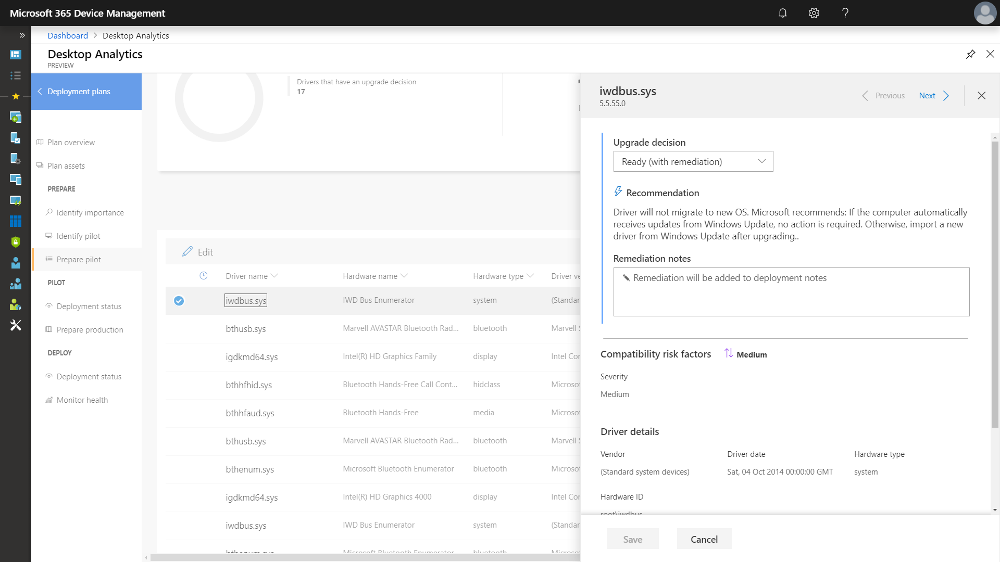
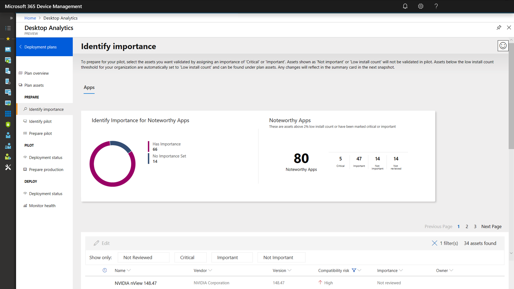
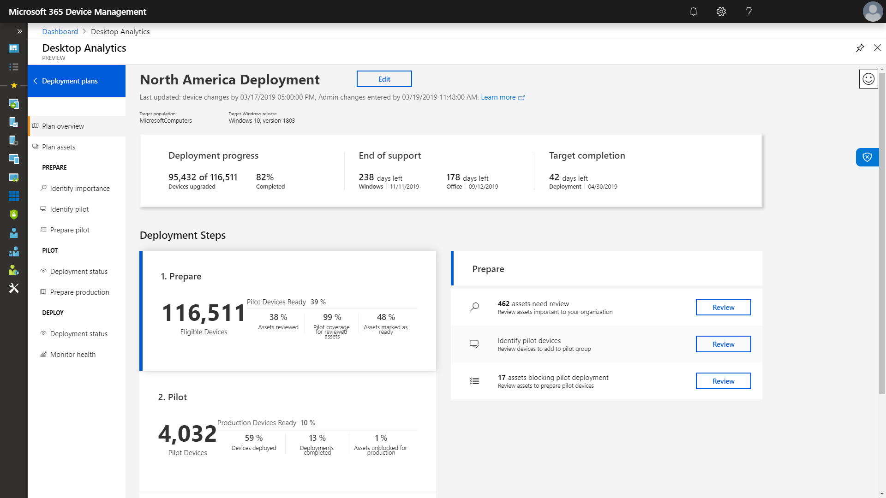

# Stap 1: apparaat- en app-gereedheidStep 1: Device and App Readiness

<table>
<thead>
<td></td>
<td>
<strong>Stap 1: apparaat- en app-gereedheid</strong><strong>Step 1: Device and App Readiness</strong>

Start het implementatieproject van uw desktop met een inventaris van uw apparaten en apps, geef prioriteit aan wat u nodig hebt en test apps en apparaten met prioriteit. Vervolgens kunt u herstellen wat nodig is voor de implementatie.Begin your desktop deployment project with an inventory of your devices and apps, prioritize what you need to move forward, test prioritized apps and devices, then remediate what’s needed to get ready for deployment.
</td>
<td></td>
</thead>
</table>

>[!NOTE]
>De apparaat- en app-gereedheid is de eerste stap in ons aanbevolen implementatieproces door de holistische aspecten van de toepassings- en hardwarecompatibiliteit te behandelen.Device and App Readiness is the first step in our recommended deployment process wheel by covering the holistic aspects of application and hardware compatibility. Ga naar het [Implementatiecentrum voor desktops](https://aka.ms/HowToShift) om het volledige desktop-implementatieproces te zien.To see the full desktop deployment process, visit the [Desktop Deployment Center](https://aka.ms/HowToShift).
>

In het verleden was toepassings- en hardwarecompatibiliteit een belangrijke horde voor het upgraden van de desktops van gebruikers.In the past, a major hurdle to upgrading the users’ desktops is application and hardware compatibility. Het goede nieuws bij het plannen van uw overstap naar Windows 10 en Microsoft 365-apps voor ondernemingen is dat zo ongeveer elke toepassing die in de afgelopen 10 jaar is geschreven, kan worden uitgevoerd op Windows 10. De eventuele COM-invoegtoepassingen en VBA-macro's van uw organisatie die werden gebruikt in versies van Office die teruggaan tot Office 2010 blijven werken met de nieuwste versies van Office, zonder aanpassingen.The good news as you plan your shift to Windows 10 and Microsoft 365 Apps for enterprise, is just about any application written in the last 10 years will run on Windows 10, and any COM add-ins and VBA macros your organization used on versions of Office dating back to Office 2010, will continue to work on the latest versions of Office, without modification.

Dit gezegd hebbende, afhankelijk van de grootte en leeftijd van uw organisatie, is het controleren van de compatibiliteit van toepassingen en hardware waarschijnlijk nog steeds een belangrijke stap in het aanbevolen implementatieproces van acht fasen.That said, depending on the size and age of your organization, verifying application and hardware compatibility is likely still an essential initial step in our recommended 8-phase deployment process.

In dit artikel wordt u begeleid bij de eerste fase: apparaat- en app-gereedheid. U gebruikt hiervoor de Microsoft Readiness Assessment tools, waaronder de Desktop Analytics, een intelligente cloud-oplossing die beschikbaar is in uw Windows-licentie.In this article we take you through that first phase – Device and App Readiness – using Microsoft readiness assessment tools including the Desktop Analytics, an intelligent cloud-based solution available with your Windows license.

## Compatibiliteitsscan voor Windows 10Windows 10 Compatibility Scan

Voordat u Windows 10 implementeert, wordt u aangeraden de gereedheid van de bestaande apparaten met Windows 7 of 8/8.1 te controleren.Before deploying Windows 10 Microsoft recommends checking the readiness of your existing devices running Windows 7 or 8/8.1. De Installatiemedia voor Windows 10 ondersteunen een opdrachtregelschakeloptie voor het uitvoeren van het setup.exe, waarbij alleen op compatibiliteit wordt gecontroleerd en de upgrade zelf niet wordt uitgevoerd.Windows 10 installation media supports a command line switch for the setup.exe to run the upgrade but only check for compatibility, not actually perform the upgrade. ScanOnly kan worden uitgevoerd als een batchbestand met een script of worden geïntegreerd in een taakreeks van Microsoft Endpoint Configuration Manager, met inbegrip van de mogelijkheid om ScanOnly rechtstreeks vanuit het netwerk uit te voeren, zodat de Windows 10-installatiemedia niet naar het lokale apparaat worden gestreamd.ScanOnly can be run as a scripted batch file or integrated into a Microsoft Endpoint Configuration Manager task sequence, including the ability to run the ScanOnly directly from the network so the Windows 10 installation media isn't streamed down to the local device. Wanneer ScanOnly is voltooid, worden de resultaten via retourcodes geretourneerd in logboekbestanden die worden gegenereerd door Setup.EXE.When ScanOnly completes the results are returned via return codes in log files generated by Setup.EXE.   

Een voorbeeld van een ScanOnly-opdrachtregel waarmee de compatibiliteitsscan op de achtergrond wordt uitgevoerd, ziet er ongeveer als volgt uit:A sample ScanOnly command line that completes the compatibility scan silently would look like the below:

    Setup.EXE /Auto Upgrade /Quiet /NoReboot /Compat ScanOnly

Voor meer informatie over ScanOnly en andere opdrachtschakelopties voor Windows Setup, raadpleegt u de [Opdrachtregelopties voor Windows Setup](https://aka.ms/setupswitches).For more information on ScanOnly and other Windows setup command switches please review the [Windows Setup Command-line Options](https://aka.ms/setupswitches).

## Aanbevolen tool: Desktop AnalyticsRecommended Tool: Desktop Analytics

Desktop Analytics biedt veel voordelen ten opzichte van traditionele bureaubladbeheersystemen en is onze aanbevolen tool.Desktop Analytics offers many advantages over traditional desktop management systems and is our recommended tool. De tool werkt zonder agent en begeleidt u door de benodigde stappen waarbij gebruik wordt gemaakt van informatie over toepassings- en stuurprogramma-compatibiliteit die is verzameld via het upgraden van honderden miljoenen consumentencomputers.It is agentless and guides you through what needs to be done making use of application and driver compatibility information gathered through the upgrade of hundreds of millions of consumer PCs. Met deze informatie krijgt u een gedetailleerde analyse, met de gevonden compatibiliteitsproblemen die mogelijk uw upgrade verhinderen en ondersteund met koppelingen naar voorgestelde oplossingen die bij Microsoft bekend zijn.This information gives you a detailed assessment, identifying compatibility issues that might block your upgrade, supported with links to suggested fixes known to Microsoft.

Als u Desktop Analytics wilt instellen, moet u eerst een Azure-abonnement instellen waarin een werkruimte voor Azure Log Analytics is opgenomen.To set up Desktop Analytics you’ll first need to set up an Azure subscription and include an Azure Log Analytics workspace to that. Wanneer u beschikt over Desktop Analytics kunt u vervolgens elk Windows 7 SP1-apparaat of nieuwer apparaat registreren via Groepsbeleidsinstellingen. Zo eenvoudig is het.Once you have the Desktop Analytics service running, you can then enroll any Internet-connected Windows 7 SP1 or newer device via Group Policy settings - it’s that simple. Er zijn geen agenten om te implementeren en de visuele werkstroom van Desktop Analytics helpt u bij de implementatie van pilot- tot productimplementatie.There are no agents to deploy, and Desktop Analytics’ visual workflow guides you from pilot to production deployment. Als u wilt, kunt u gegevens uit Desktop Analytics exporteren naar hulpprogramma's voor software-implementatie, zoals Microsoft Endpoint Configuration Manager (Current Branch), om doel-pc's rechtstreeks aan te pakken en om verzamelingen te maken wanneer ze klaar zijn voor implementatie.If you wish, you can export data from Desktop Analytics to software deployment tools such as Microsoft Endpoint Configuration Manager (Current Branch), to target PCs directly and build collections as they become ready for deployment.

Als u op dit moment Desktop Analytics niet hebt ingesteld voor uw omgeving of als u zich wilt registreren voor een proefversie, gaat u naar de pagina Desktop Analytics](https://www.aka.ms/desktopanalytics) en gaat u aan de slag.If you don’t currently have Desktop Analytics set up for your environment or would like to sign up for a trial, go the Desktop Analytics page](https://www.aka.ms/desktopanalytics) and get started.

## Het apparaat- en app-gereedheidsprocesDevice and App Readiness Process

Apparaat- en app-gereedheid bestaat uit vier stappen: 1.Device and App Readiness is comprised of four steps: 1. Inventaris: 2Inventory, 2. Prioriteiten stellen 3.Prioritize, 3. Testen, 4.Test, 4. Herstellen.Remediate. Laten we deze stap voor stap doornemen.Let’s look at each of these in turn.

### 1\.1\. InventarisInventory

Desktop Analytics gebruikt een proces zonder agent om de computers en toepassingen in uw pc-infrastructuur te inventariseren.Desktop Analytics uses an agent-less process to inventory the computers and applications across your desktop estate. Daarnaast biedt de tool rapporten over veelbezochte internetsites, apps en intranetlocaties om u te helpen de compatibiliteit ervan later te testen.It also provides reports on highly visited Internet sites, apps, and Intranet locations to help you with compatibility testing later.

### 2\.2\. Prioriteiten stellenPrioritize

Na de afgeronde inventarisatie gebruikt u Desktop Analytics om de meestgebruikte apps en hardware van uw organisatie te identificeren en hieraan prioriteit te geven. U moet ook kijken naar het beschikbaar maken van zo veel mogelijk computers voor de implementatie.With inventory taken, Desktop Analytics helps you to identify and prioritize the most common apps and hardware used in your organization, as well as what to focus on to unblock as many PCs as possible for deployment.

De tool biedt ook richtlijnen om te evalueren welke updates nodig zijn voor het oplossen van problemen tijdens de volgende stap: testen.It also provides guidance to help you assess the updates necessary to resolve issues during the next step: testing.

### 3\.3\. TestenTesting

U zult merken dat de meeste geïnventariseerde toepassingen, stuurprogramma's en invoegtoepassingen gewoon blijven werken.You will find that most of the applications, drivers, and add-ins inventoried will work as-is. Voor items waarvoor Desktop Analytics problemen verwacht, krijgt u de beschikking over de bekende informatie, waaronder waar u versie-updates kunt vinden om compatibiliteitsproblemen op te lossen.For items Desktop Analytics assesses to have issues, it provides you with known information including where to find version updates to resolve compatibility problems. In plaats van tijd en geld te spenderen aan het oplossen van ingewikkelde problemen bij niet-kritieke, weinig ingezette toepassingen en oudere apparaten, kunt u in plaats daarvan ervoor kiezen om met gebruikers samen te werken om deze items buiten gebruik te stellen en te vervangen.Rather than devoting time and resource resolving complex issues in non-critical, sparsely deployed applications and older devices, you may choose instead to work with users to retire and replace these items.

U kunt Desktop Analytics ook gebruiken om de compatibiliteitsproblemen met de browser te evalueren: stel vast welke door gebruikers gebruikte websites en webapps nog steeds ActiveX-besturingselementen, browserhelperobjecten, VBScript of andere verouderde technologie gebruiken die niet worden ondersteund door de browser Microsoft Edge.You can use Desktop Analytics to assess browser-based compatibility issues too, identifying websites and web apps accessed by users still using ActiveX controls, Browser Helper Objects, VBScript, or other legacy technology not supported by the Microsoft Edge browser. Uw gebruikers moeten nog steeds Internet Explorer 11 gebruiken voor deze sites en u kunt deze toevoegen aan de [sitelijst voor Ondernemingsmodus](https://docs.microsoft.com/microsoft-edge/deploy/emie-to-improve-compatibility) met behulp van Sitelijstbeheer van ondernemingsmodus.Your users will still need to use Internet Explorer 11 for these sites, and you can add them to the [Enterprise Mode site list](https://docs.microsoft.com/microsoft-edge/deploy/emie-to-improve-compatibility), using the Enterprise Mode Site List Manager.

Om u te helpen bij het overstappen naar Microsoft 365-apps voor ondernemingen, kunt u gebruikmaken van de [Readiness Toolkit voor Office](https://docs.microsoft.com/deployoffice/use-the-readiness-toolkit-to-assess-application-compatibility-for-office-365-pro) voor het testen van de compatibiliteit van uw invoegtoepassingen en VBA-macro's (Microsoft Visual Basic for Applications).Additionally, to assist in your move to Microsoft 365 Apps for enterprise, you may wish to make use of the [Readiness Toolkit for Office](https://docs.microsoft.com/deployoffice/use-the-readiness-toolkit-to-assess-application-compatibility-for-office-365-pro) to test the compatibility of your add-ins and Microsoft Visual Basic for Applications (VBA) macros.

### 4\.4\. HerstellenRemediation

De laatste fase van de apparaat- en app-gereedheid is 'herstellen'.The final phase of device and app readiness is to ‘remediate’. Hier wilt u de vereiste software- of stuurprogrammapakketten verzamelen. U gaat deze namelijk gebruiken om oudere versies te vervangen of bij te werken als onderdeel van het implementatieproces.Here you’ll want to collect the required software or driver packages; you are going to use these to supersede or update older versions as part of the deployment process.

Naarmate u door de lijst gaat en problemen oplost, ziet u dat er meer en meer pc's 'gereed voor implementatie' worden.As you work through the list remediating issues, you’ll see that more and more PCs become “Ready for Deployment”. Dit betekent dat zowel de stuurprogramma's als de apps op de pc's compatibel zijn met de versie van Windows 10 die u gaat gebruiken voor implementatie.This means that both the drivers and apps on the PCs are noted as compatible with the version of Windows 10 you are targeting for deployment.

### Software-inventarisatie in Configuration Manager voor het prioriteit geven aan toepassingenConfiguration Manager Software Inventory for Application Prioritization

Software-inventarisatie in Configuration Manager is een alternatief voor het gebruik van analyse-oplossingen in de cloud voor apparaat- en app-gereedheid.Configuration Manager software inventory is an alternative to using cloud-based analytics solutions for device and app readiness. U kunt het aantal installaties gebruiken en u richten op specifieke computers om prioriteit te geven aan compatibiliteitstests en -validatie en toepassingspakketten in te stellen die compatibel zijn met Windows 10 via pakketinstellingen.You can use installation counts and drill into specific computers to help prioritize compatibility testing and validation and set application packages as compatible with Windows 10 via package settings. Hoewel u met deze optie geen bekende compatibiliteitsgegevens kunt vergelijken met de analytische services van Microsoft, kan dit een effectieve oplossing zijn voor het instellen van een kleinere set apps met prioriteit voor handmatig testen.While this option does not offer the ability to compare known compatibility information with Microsoft’s analytics services, it can be an effective solution to target a smaller set of prioritized apps for manual testing. 

Raadpleeg voor meer informatie [Inleiding tot software-inventarisatie in Configuration Manager](https://docs.microsoft.com/configmgr/core/clients/manage/inventory/introduction-to-software-inventory) en voor het instellen van platformvereisten in toepassingspakketten [Pakketten en programma's in Configuration Manager](https://docs.microsoft.com/configmgr/apps/deploy-use/packages-and-programs).For more information, see [Introduction to software inventory in Configuration Manager](https://docs.microsoft.com/configmgr/core/clients/manage/inventory/introduction-to-software-inventory) and setting platform requirements in application packages in [Packages and programs in Configuration Manager](https://docs.microsoft.com/configmgr/apps/deploy-use/packages-and-programs).

## App AssureApp Assure

Een andere tool voor het oplossen van compatibiliteit met Windows 10 en de app van Microsoft 365-apps voor ondernemingen is het programma [App Assure](https://aka.ms/appassure) dat beschikbaar is via het FastTrack Center.Another tool to help with Windows 10 and Microsoft 365 Apps for enterprise app compatibility is the [App Assure](https://aka.ms/appassure) program available through the FastTrack Center. Bij geldige toepassingsproblemen biedt een technicus van Microsoft ondersteuning zonder extra kosten voor u bij het herstellen van de compatibiliteit van toepassingen via App Assure.In the event of valid application issues, a Microsoft engineer with work with you at no additional cost through App Assure to help remediate the application incompatibility.

## Voortgezet gebruik van Hulpprogramma's voor diagnostische gegevensContinued Use of Diagnostic Data Tools

Desktop Analytics is niet alleen een tool waarmee u kunt overstappen naar Windows 10 en Microsoft 365-apps voor ondernemingen.Desktop Analytics isn’t just a tool to help you shift to Windows 10 and Microsoft 365 Apps for enterprise. Wanneer u eenmaal desktops op Windows 10 en Office 365 hebt draaien, kunt u deze gebruiken om uw implementatie te onderhouden en de halfjaarlijkse functie-updates te beheren, zodat u actueel kunt blijven.Once you have desktops running on Windows 10 and Office 365 you can use it to help maintain your deployment and manage semi-annual Feature Updates so that you can stay current.

## Volgende stapNext Step 

## [Stap 2: gereedheid van directory en netwerkStep 2: Directory and Network Readiness](https://aka.ms/mdd2)
