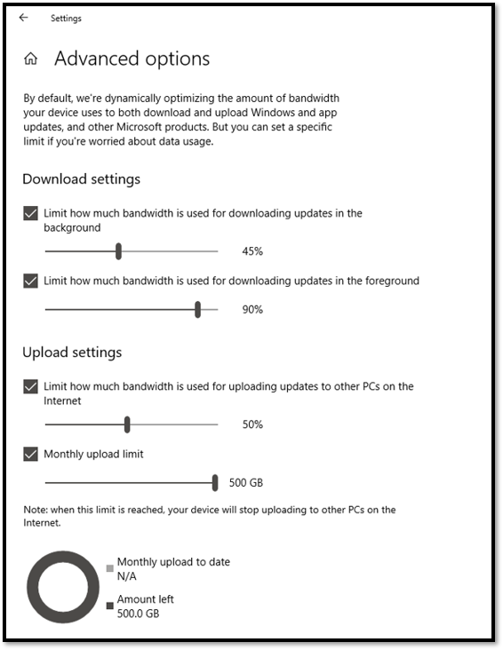

# Stap 2: gereedheid van directory en netwerkStep 2: Directory and Network Readiness

Zorg ervoor dat uw directory en het netwerk zijn geconfigureerd en klaar zijn om uw overstap naar Windows 10 en Office 365 ProPlus te ondersteunen.Ensure your directory and the network are configured and ready to support to your shift to Windows 10 and Office 365 ProPlus. Dit vereist dat Azure Active Directory Services zijn ingesteld voor gebruikers en moet uw netwerk de capaciteit hebben om zowel het reguliere verkeer als de verplaatsing van mogelijk grote hoeveelheden gegevens af te handelen wanneer pc's worden bijgewerkt en de bestanden, instellingen en applicaties van gebruikers worden hersteld.This will require Azure Active Directory Services to be in place for users, and your network must have the capacity to handle both its regular traffic and the movement of potentially vast amounts of data as PCs are upgraded, and users’ files, settings and applications are restored.

<table>
<thead>
<td></td>
<td>
<strong>Stap 2: gereedheid van directory en netwerk</strong><strong>Step 2: Directory and Network Readiness</strong>

Voor cloud-verbonden services in Office 365 ProPlus en nieuwe implementatie-opties zoals Windows Autopilot is Azure Active Directory vereist.Cloud connected services in Office 365 ProPlus and new deployment options like Windows Autopilot require Azure Active Directory. Uw netwerk en connectiviteit zijn ook belangrijke zaken om te plannen bij het verplaatsen van Windows-afbeeldingen, apps, stuurprogramma's en gerelateerde bestanden naar uw pc's.Your network and connectivity are also important areas to plan when moving Windows images, apps, drivers and related files to your PCs. Lees hoe u met nieuwe hulpprogramma's en implementatieopties netwerkverkeer vermindert en stroomlijnt.Learn how new tools and deployment options reduce and streamline network traffic.
</td>
<td></td>
</thead>
</table>

>[!NOTE]
>Directory- en netwerkgereedheid is de tweede stap in het aanbevolen implementatieproces dat zich richt op Azure Active Directory en netwerkoptimalisatie.Directory and Network Readiness is the second step in our recommended deployment process wheel focusing on Azure Active Directory and optimizing the network. Ga naar het [Implementatiecentrum voor desktops](https://aka.ms/HowToShift) om het volledige desktop-implementatieproces te zien.To see the full desktop deployment process, visit the [Desktop Deployment Center](https://aka.ms/HowToShift).
>

Directory- en netwerkgereedheid is van fundamenteel belang voor een vlotte implementatie van besturingssystemen en desktops.Directory and Network readiness is fundamental to ensuring a smooth OS and desktop deployment. Zoals bij elke geautomatiseerde implementatie is het belangrijk om ervoor te zorgen dat uw bestandsshares kunnen worden bereikt en dat uw netwerk de overdracht van zeer grote bestanden, mogelijk naar honderden of zelfs duizenden pc's tegelijk, ondersteunt.As with any automated deployment, it is important to ensure your file shares can be reached, and your network will need to be able to support the transfer of very large files, possibly to hundreds or even thousands of PCs at a time.

Met de overstap naar Windows 10 en Office 365 ProPlus moet u er ook voor zorgen dat de cloudgebaseerde identiteit is ingesteld met Azure Active Directory.With your shift to Windows 10 and Office 365 ProPlus you also now need to make sure that cloud-based identity is set up with Azure Active Directory. Dit is niet alleen bedoeld voor het activeren van Office 365 ProPlus, het stelt u ook in staat te profiteren van moderne provisioning-oplossingen zoals Windows Autopilot.This is key not only to activating Office 365 ProPlus, it also allows you to take advantage of modern provisioning solutions like Windows Autopilot.

In dit artikel vindt u informatie over de tools en opties om uw directoryservices en gebruikers- en apparaatrechten voor te bereiden, gereed voor implementatie in Windows 10 en Office 365 ProPlus.In this article we’ll explore the tools and options to prepare your directory services, and user and device permissions, ready for deployment to Windows 10 and Office 365 ProPlus.

## Azure Active Directory toevoegenAdding Azure Active Directory

Als uw organisatie al Office 365, Exchange Online, Microsoft Intune of andere Microsoft Online-services gebruikt, is het goede nieuws dat u al Azure Active Directory gebruikt.If your organization already uses Office 365, Exchange Online, Microsoft Intune, or other Microsoft Online services, the good news is you are already using Azure Active Directory. Als dat het geval is hoeft u er alleen maar voor te zorgen dat de gebruikers waarvoor u een desktopimplementatie wilt uitvoeren, zich in uw Azure Active Directory bevinden en dat er licenties zijn toegewezen.If you are, you just need to ensure that the users you are targeting for desktop deployment are in your Azure Active Directory and that licenses have been assigned.

Als u momenteel Azure Active Directory niet gebruikt, zijn er [talloze bronnen](https://docs.microsoft.com/azure/active-directory/) om u te helpen bij het instellen ervan.If you are not currently using Azure Active Directory, there are [numerous resources](https://docs.microsoft.com/azure/active-directory/) to help you set it up. U kunt in aanmerking komen voor persoonlijke hulp via Microsoft FastTrack, als onderdeel van uw Office 365-licentie.You may well qualify for personalized assistance via Microsoft FastTrack, as part of your Office 365 license. U vindt [hier](https://fasttrack.microsoft.com) meer informatie over Microsoft FastTrack.You can check out more about Microsoft Fastrack [here](https://fasttrack.microsoft.com).

Zodra u Azure Active Directory hebt geïnstalleerd, kunnen uw gebruikers zich aanmelden en hun Office 365 ProPlus-apps activeren. U kunt Microsoft Intune of Windows Autopilot-implementatie gebruiken voor de geautomatiseerde implementatie van apps en beleid.Once you have Azure Active Directory in place, your users can sign in to and activate their Office 365 ProPlus apps, and you can use Microsoft Intune or Windows Autopilot deployment for automated deployment of apps and policy.

## NetwerkgereedheidNetwork Readiness

Bij het plannen van uw implementaties moet u rekening houden met de bandbreedtevereisten.You must consider bandwidth requirements when planning your deployments. Er zijn drie hoofdonderdelen in een implementatie die van invloed zijn op uw netwerk: pc-imaging, software-updates en gebruikerspersonalisatie.There are three main components in a deployment that will have an impact on your network – PC imaging, software updates, and user personalization. Samen kan dit meer dan 20 GB per pc betekenen voor de eerste migratie, en vaak 1 GB of meer per maand per pc om up-to-date te blijven.Between them, this can mean in excess of 20 GB per PC for the initial migration, and often 1 GB or more per month per PC to stay up-to-date.

Laten we eerst de vereisten van elk van deze drie hoofdonderdelen verkennen:Let’s start by exploring the requirements of each of these three main components:

### PC-imagingPC Imaging

Voor Windows-afbeeldingen zonder aanpassingen moet u normaal gesproken 3 GB per pc plannen, terwijl u voor aangepaste afbeeldingen met apps mogelijk 6 GB of meer moet toestaan.For Windows Images with no customization you should plan typically for 3GB per PC, while for customized images with apps you may need to allow 6GB, or more. Het is ook mogelijk dat u stuurprogrammapakketten moet overwegen. Deze kunnen enkele honderden megabytes per pc groot zijn, soms tot 1 GB.You may also need to consider Driver packages; these can be a few hundred megabytes per PC, sometimes up to 1GB.

### Software-updatesSoftware Updates

U moet de netwerkbandbreedte voor software-updates plannen.You’ll need to plan network bandwidth for software updates. Windows 10 en Office 365 ProPlus gebruiken een nieuw servicemodel met maandelijkse en halfjaarlijkse updates.Windows 10 and Office 365 ProPlus use a new servicing model delivering monthly and semi-annual updates. Als u nog niet eerder met dit model hebt gewerkt, kunt u [hier](https://docs.microsoft.com/windows/deployment/update/waas-overview) meer lezen over hoe dit werkt.If you are new to this model, you can learn more about how this works [here](https://docs.microsoft.com/windows/deployment/update/waas-overview).

Het nieuwe servicemodel omvat tweemaal per jaar functie-updates voor Windows, Office halfjaarlijkse kanaalupdates en maandelijkse kwaliteitsupdates.The new servicing model includes Feature Updates for Windows twice a year, Office Semi-Annual Channel Updates, and monthly Quality Updates. Functie-updates zijn doorgaans 2-4 GB groot en Office halfjaarlijkse kanaalupdates zijn 300-400 MB per update.Feature Updates are typically 2 – 4GB in size, and Office Semi-Annual Channel updates are 300 – 400 MB per update. Dan zijn er de maandelijkse kwaliteitsupdates.Then there are the monthly Quality Updates. Deze variëren van een paar honderd megabyte tot meer dan een gigabyte.These may range from a few hundred megabytes to over a gigabyte. Dit komt omdat maandelijkse updates cumulatief zijn, dus deze nemen in omvang toe gedurende de levensduur van elke Windows 10-versie.This is because monthly updates are cumulative, so these increase in size over the servicing lifetime for each Windows 10 version. Dat gezegd hebbende, er zijn hulpprogramma‘s die kunnen helpen de hoeveelheid gegevens te verminderen die over het netwerk moeten gaan om updates te implementeren.That said, there are tools that can help reduce the amount of data that must pass over the network to implement updates. Hieronder vindt u meer informatie hierover.We will cover this in more detail below.

### GebruikerspersonalisatieUser Personalization

Het derde onderdeel dat moet worden overwogen, is de aanpassing aan de gebruiker.The third component to consider is user personalization. Hier moet u de netwerkbandbreedte plannen om het herstel van gebruikersbestanden, hun instellingen en hun toepassingen mogelijk te maken als onderdeel van het proces voor het vernieuwen of vervangen van de pc.Here you need to plan network bandwidth to accommodate the restoring of user files, their settings, and their applications as part of the PC refresh or replacement process. Samen zijn deze items vaak groter dan 20 GB per pc; voor sommige gebruikers kunnen deze meer dan 100 GB bedragen.Together, these items often exceed 20 GB per PC; for some users these may exceed 100 GB.

## BandbreedtebeperkingLimiting Bandwidth

Een manier om de impact van implementatie-gerelateerd verkeer op het netwerk te beperken, is door het te beperken met behulp van de BITS-instelling (Background Intelligent Transfer Service) op clients.One way to limit the impact of deployment-related traffic on the network is to throttle it using the BITS (Background Intelligent Transfer Service) setting on clients. BITS gebruikt een adaptieve bitsnelheid (ABR) om de bandbreedte voor implementatiedoeleinden aan te passen. De service kan met Groepsbeleid worden geconfigureerd op clients.BITS uses an Adaptive Bit Rate (ABR) to adjust bandwidth available for deployment purposes; it can be configured on clients using Group Policy.

[Informatie over BITSAbout BITS](https://docs.microsoft.com/windows/desktop/bits/about-bits)

Als u Microsoft Endpoint Configuration Manager (huidige tak) gebruikt, kunt u ook BITS-compatibele distributiepunten configureren of multicast inschakelen met WDS.If you use Microsoft Endpoint Configuration Manager (Current Branch), you can also configure BITS-enabled Distribution Points or enable multicast with WDS.

Het beperken van specifiek verkeer betekent dat normaal netwerkverkeer minder wordt beïnvloed door pc's die updates en applicaties downloaden.Throttling specific traffic means that normal network traffic is less impacted by PCs downloading updates and applications. Als u een bepaald percentage van de bandbreedte voor deze taken reserveert, zorgt u ervoor dat de productiviteit niet wordt beïnvloed door de implementatie van Windows of Office en dat processen blijven draaien zoals nodig. Het kan echter de implementatie-gerelateerde downtime verergeren, waarbij gebruikers hun pc's niet kunnen gebruiken terwijl een implementatie wordt uitgevoerd.But carving out a certain percentage of bandwidth for these tasks helps ensure productivity isn’t impacted by Windows or Office deployment and processes continue to run as needed, it can worsen deployment-related downtime, with users locked out of their PCs while a deployment runs.

Gelukkig zijn er nieuwe hulpmiddelen waarmee u de netwerkimpact van een grootschalige desktopimplementatie gemakkelijker kunt beheren, waaronder LEDBAT om het gebruik van de beschikbare bandbreedte te optimaliseren, en peer-to-peer (P2P) -opties om het implementatieverkeer te verplaatsen van het midden van het netwerk naar de buitenrandFortunately, there are new tools to make it easier for you to manage the network impact of a large-scale desktop deployment, including LEDBAT to optimize use of available bandwidth, and peer-to-peer (P2P) options to move deployment traffic away from the center of the network and out to the perimeter

## Bandbreedte opruimenScavenging Bandwidth

Latency-geoptimaliseerd achtergrondtransport (LEDBAT) wordt ondersteund in Windows Server 2019 en Microsoft Endpoint Configuration Manager (huidige tak) en is ontworpen om het netwerkverkeer naar Windows-clients te optimaliseren.Low Extra Delay Background Transport (LEDBAT), supported in Windows Server 2019 and Microsoft Endpoint Configuration Manager (Current Branch), is designed to optimize network traffic to Windows clients.

[Top 10 netwerkfuncties in Windows Server 2019:\# 9 LEDBAT - Latency-geoptimaliseerd achtergrondtransportTop 10 Networking Features in Windows Server 2019: \#9 LEDBAT – Latency Optimized Background Transport](https://blogs.technet.microsoft.com/networking/2018/07/25/ledbat/)

In tegenstelling tot de traditionele manier van netwerkverkeer beperken, kan LEDBAT alle beschikbare netwerkbandbreedte inzetten als een achtergrondtaak, wat onmiddellijk bandbreedte oplevert wanneer ander verkeer daarom vraagt.Unlike traditional throttling, LEDBAT can use all available network bandwidth as a background task, instantly yielding bandwidth when other traffic requests it. In tegenstelling tot BITS is er geen vertraging. Alles is geautomatiseerd, er is geen handmatige afstemming of planning vereist, en alles wordt aan de serverzijde ingesteld.Unlike BITS there is no delay; everything is automated – no manual tuning or scheduling required, and everything is setup server side. Dit biedt mogelijk aanzienlijke prestatieverbeteringen.This affords potentially massive performance gains.

## Opties voor peer-to-peerPeer-to-Peer options

Peer-to-peer-opties worden steeds vaker gebruikt bij migraties van Windows 10, voor pc-imaging, software-updates en gebruikersaanpassingen.Peer-to-Peer options are increasingly being used in Windows 10 migrations, for PC imaging, software updates and user personalization. Ze zijn ook handig bij het vergemakkelijken van build-to-build-upgrades na uw eerste implementatie van Windows 10.They are also valuable in facilitating build-to-build upgrades after your initial Windows 10 deployment. Hier vindt u een aantal voorbeelden die laten zien hoe Windows 10 en Office-gerelateerd verkeer weg kan worden geleid van het midden van het netwerk, waardoor de noodzaak van klassieke beperkingsbenaderingen wordt verminderd. PC's kunnen de updatebestanden vinden bij peers in hun lokale netwerk in plaats van ze te downloaden vanaf een distributiepunt of internet.Here we will cover several examples to help move Windows 10 and Office-related traffic away from the center of the network, reducing the need for classic throttling approaches, and allowing PCs to find the update files they need on peers in their local network rather than downloading them from a distribution point or the internet.

**BranchCache** kan u helpen bij het downloaden van inhoud in gedistribueerde omgevingen zonder het netwerk te verzadigen.**BranchCache** can help you download content in distributed environments without saturating the network. Er zijn twee opties: gehoste cache modus, waarmee u lokale servers kunt gebruiken om inhoud te cachen, en gedistribueerde cache modus (een modus die wordt ondersteund in Configuration Manager), waarmee klanten reeds gedownloade inhoud met elkaar kunnen delen.It comes in two options: Hosted Cache Mode, which lets you use local servers to cache content, and Distributed Cache Mode (a mode supported in Configuration Manager), which lets clients share already downloaded content with each other.

**Peer Cache** clients die door Configuration Manager worden ondersteund, kunnen ook gebruikmaken van Peer Cache.**Peer Cache** Clients supported by Configuration Manager can also make use of Peer Cache. Hierdoor kunnen pc's die betrouwbaar beschikbaar zijn op het netwerk de bron vormen voor de distributie van inhoud.This allows PCs that are reliably available on the network to host source for content distribution. U wilt dit niet op al uw pc's inschakelen, gebruik alleen apparaten met betrouwbare netwerkverbindingen als hosts (bijv. bureaublad, mini-tower of tower-pc's).You won’t want to enable this all of your PCs – only target devices with reliable network connections as hosts (e.g. desktop, mini-tower, or tower PCs). Peer Cache kan zelfs worden gebruikt voor implementatietaken die tijdens de installatie in Windows PE-fasen worden uitgevoerd.Peer Cache can even work for deployment tasks running in Windows PE phases during setup.

Opmerking: BranchCache en Peer Cache zijn complementair en kunnen in dezelfde omgeving samenwerken.Note: BranchCache and Peer Cache are complementary and can work together in the same environment.

[BranchCache vs. Peer CacheBranchCache vs. Peer Cache](https://blogs.technet.microsoft.com/swisspfe/2018/01/25/branch-cache-vs-peer-cache/)

**Delivery Optimization** Delivery Optimization is een andere peer-to-peer cachetechnologie die netwerkgebaseerde controles biedt voor implementaties.**Delivery Optimization** Delivery Optimization is another peer-to-peer caching technology, providing network-based controls for deployments. Windows 10 Delivery Optimization om ingebouwde UWP-apps bij te werken, om applicaties uit de Microsoft Store te installeren en voor software-updates die Express Updates gebruiken.Windows 10 Delivery Optimization to update built-in UWP apps, also to install applications from the Microsoft Store, and for software updates using Express Updates. Deze is beschikbaar sinds eerdere versies van Windows 10, hoewel het pas onlangs is geïntegreerd met Microsoft Endpoint Configuration Manager (huidige tak).It has been available since early versions of Windows 10, though it has only recently integrated with Microsoft Endpoint Configuration Manager (Current Branch). Vanaf Windows 10 versie 1803 kunt u met nieuwe configuratie-opties onafhankelijk bandbreedtelimieten instellen voor achtergrondupdates en voorgrondtaken, zoals een app-installatie vanuit de Store.Since Windows 10 version 1803 new configuration options mean you can now independently set bandwidth limits for background updates and foreground jobs such as an app install from the Store. Windows Delivery Optimization ondersteunt nu ook Office 365 ProPlus tijdens clientupdates, beschikbaar in alle ondersteunde updatekanalen voor Office 365-clients.Windows Delivery Optimization now also supports Office 365 ProPlus during client updates, available in all supported Office 365 client update channels. Ondersteuning voor Windows Delivery Optimization tijdens de eerste installatie van de Office 365-client is binnenkort beschikbaar.Support for Windows Delivery Optimization during Office 365 client initial installation will be coming soon.  

**Aanvullende aandachtspunten voor Office 365 ProPlus****Additional Considerations for Office 365 ProPlus**

Naast het gebruik van Delivery Optimization, zijn hier drie items die u helpen uw netwerkbelasting te verminderen als gevolg van Office 365 ProPlus-implementaties.In addition to leveraging Delivery Optimization, here are three items that will help reduce your network load due to Office 365 ProPlus deployments.

**Binaire Delta-compressie** Office 365 ProPlus gebruikt Binaire Delta-compressie om de bandbreedte die wordt verbruikt door software-updates te verminderen bij het bijwerken van de meest recente versie van Office 365 ProPlus naar de volgende release.**Binary Delta Compression** Office 365 ProPlus uses Binary Delta Compression to reduce bandwidth consumed by software updates when updating from the most recent release of Office 365 ProPlus to the next release. Door alleen de veranderingen op binair niveau op te halen uit de vorige versie, wordt de invloed van de cumulatieve updates geminimaliseerd.By only pulling the binary level changes from the previous release, the impact from month-over-month growth of cumulative updates is minimized. Dit kan elke maand honderden megabytes aan gegevens per pc besparen.This has the potential of saving several hundred megabytes of data, per PC, each month. Om deze functie te kunnen gebruiken, kunt u geen releases overslaan.In order to use this capability though, you cannot skip releases. Als u dat doet, moet de volledige cumulatieve update worden gedownload.If you do, then the full cumulative update must be downloaded.

[Updates voor Office 365 downloadenDownloading Updates for Office 365](https://docs.microsoft.com/deployoffice/overview-of-the-update-process-for-office-365-proplus#download-the-updates-for-office-365-proplus)

**Outlook-gegevensbestanden** Outlook is vaak geconfigureerd om het hele postvak van gebruikers lokaal in de cache op te slaan voor offline gebruik.**Outlook Data Files** Outlook is often configured to cache users’ entire mailbox locally for use offline. In elke Windows-implementatie, behalve een interne upgrade, moeten de Outlook-gegevensbestanden van de gebruiker na de upgrade opnieuw worden opgebouwd.In any Windows deployment, except an in-place upgrade, that requires the users’ Outlook Data Files to rebuild themselves after the upgrade. Dit is een geautomatiseerd proces, maar met Outlook-postvaklimieten die doorgaans zijn ingesteld op maximaal 100 GB, betekent het opnieuw lokaal cachen van het hele postvak voor alle gebruikers veel gegevensoverdracht.This is an automated process, but with Outlook mailbox limits typically set to up to 100GB, re-caching the entire mailbox locally for all users means a lot of data transfer. Om de netwerkbelasting te verminderen, kunt u overwegen groepsbeleid te gebruiken om de instelling 'Mail offline bewaren' te verlagen.To reduce the network load you may want to consider using Group Policy to reduce the “Mail to keep offline” setting. In Office 365 ProPlus of Office 2016 is de standaardwaarde voor Outlook ingesteld op 12 maanden.In Office 365 ProPlus or Office 2016 the default value for Outlook is set to 12 months. Om de impact op het netwerk te verminderen, kunt u overwegen om de offlinecache in te stellen tussen 1 en 6 maanden.In order to reduce network impact consider setting the offline cache to last between 1 to 6 months. Het wijzigen van deze instelling heeft geen invloed op de grootte van het online postvak en het hele postvak kan nog steeds online worden doorzocht via Outlook.Changing this setting does not affect the size of the online mailbox, and the entire mailbox can still be searched via Outlook when online.

**OneDrive Files on Demand en bekende map verplaatsen** OneDrive is een geweldige manier om gebruikersbestanden te synchroniseren en weg te houden van pc's en andere apparaten in de cloud.**OneDrive Files on Demand and Known Folder Move** OneDrive is a great way to synchronize and protect user files from PCs and other devices in the cloud. Met Bekende mapverplaatsing kunt u bestandssynchronisatie naar OneDrive afdwingen van de gebruikersmappen Bureaublad, Documenten en Afbeeldingen, zodat die bestanden beschikbaar zijn wanneer men zich aanmeldt bij een nieuw apparaat of een opnieuw ingerichte pc.With Known Folder Move, you can enforce file sync from a user’s Desktop, Documents, and Pictures folders to OneDrive making those files available when signing into a new device a or reimaged PC. Onthoud echter dat u, vanwege de enorme omvang en het aantal bestanden op de locaties Bureaublad, Documenten en Afbeeldingen, planmatig wilt zijn met de implementatie van beleid dat OneDrive op uw pc's inschakelt en afdwingt.Remember though, due to the sheer size and number of files kept in Desktop, Documents, and Pictures locations, you’ll want to be planful with the rollout of policies enabling and enforcing OneDrive on your PCs. Een optie is om de netwerkbesturingselementen voor groepsbeleid te gebruiken om de bandbreedte die door de OneDrive-synchronisatieservice wordt gebruikt, te beperken.One option is to use Group Policy Network controls to throttle bandwidth used by the OneDrive sync service.

[Bekende map verplaatsenSetup Known Folder Move](https://techcommunity.microsoft.com/t5/Microsoft-OneDrive-Blog/Migrate-Your-Files-to-OneDrive-Easily-with-Known-Folder-Move/ba-p/207076)

[On-Demand OneDrive-bestandenOneDrive Files on Demand](https://www.microsoft.com/microsoft-365/blog/2017/05/11/introducing-onedrive-files-on-demand-and-additional-features-making-it-easier-to-access-and-share-files/)

Als je OneDrive nog niet hebt geïmplementeerd, is de overstap van Windows 7 naar Windows 10 een perfecte gelegenheid om OneDrive in te schakelen en naadloos Office 365 ProPlus te integreren.If you haven’t already rolled out OneDrive, the shift from Windows 7 to Windows 10 is a perfect opportunity to enable OneDrive and it integrates seamlessly Office 365 ProPlus. U kunt overwegen om deze implementatie te starten terwijl u de apps en apparaten gereed maakt.Consider starting this roll-out while working through your app and device readiness. Dit geeft bestandssynchronisatie een voorsprong voordat u begint met het verplaatsen van Windows-afbeeldingen en het implementeren van apps via uw netwerk.This will give file sync a head start before you start moving Windows images and deploying apps over your network.

## Volgende stapNext Step 

## [Stap 3: levering van Office- en LOB-appsStep 3: Office and LOB App Delivery](https://aka.ms/mdd3)

## Vorige stap:Previous Step:

## [Stap 1: gereedheid van apparaten en appsStep 1: Device and App Readiness](https://aka.ms/mdd1)

## FeedbackFeedback

We zijn benieuwd naar uw feedback.We'd love to hear your thoughts. Kies het type site dat u wilt bieden:Choose the type you'd like to provide:

Productfeedback Meld u aan om documentatiefeedback te gevenProduct feedback Sign in to give documentation feedback

Ons nieuwe feedbacksysteem is gebouwd op GitHub Issues.Our new feedback system is built on GitHub Issues. Lees meer over deze wijziging in ons blogbericht.Read about this change in our blog post.
