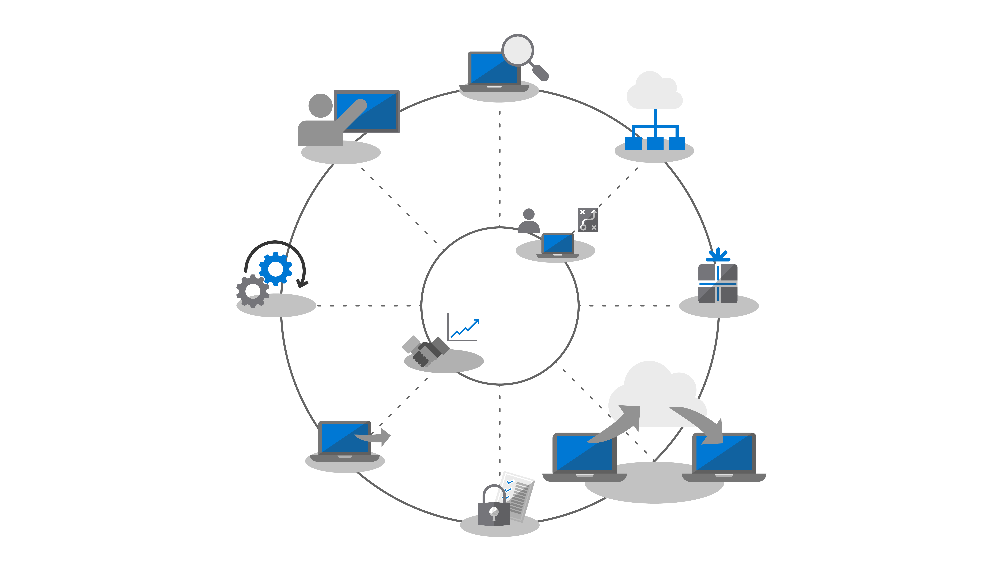

# Stap 4: migratie van gebruikersbestanden en -instellingen

Het verplaatsen van bestanden en instellingen van gebruikers naar hun nieuwe of vernieuwde pc's is een belangrijk proces dat niet fout mag gaan. U kunt elke pc handmatig migreren of u kunt het proces op verschillende manieren automatiseren. Ongeacht welke migratiemethode u kiest, zijn er drie aandachtspunten: de overdracht van de bestanden van gebruikers, hun instellingen, en het beheren van de indelingen van de start- en taakbalk van Windows 10.

<table>
<thead>
<td></td>
<td>
<strong>Stap 4: gebruikersbestanden en -instellingen</strong>

Bij het vernieuwen of vervangen van pc's kunt u tijd besparen door een back-up te maken van de gebruikersstatus en deze terug te zetten. Met de nieuwe opties voor bestandssynchronisatie in de cloud kunt u per gebruiker de mappen van de desktop, documenten en afbeeldingen in OneDrive synchroniseren voor naadloze toegang tot bestanden vanuit nieuwe Windows-installaties.
</td>
<td></td>
</thead>
</table>

>[!NOTE]
>Hoewel u de migratieprocessen kunt blijven gebruiken die u in het verleden hebt gebruikt, raden we u aan om bij uw overstap naar Microsoft 365-apps voor ondernemingen gebruik te maken van OneDrive ‘Known Folder Move’ (zie hieronder). Ga naar het [Implementatiecentrum voor desktops](https://aka.ms/HowToShift) om het volledige desktop-implementatieproces te zien.
>

Een van de lastigste en vaak meest handmatige taken van een grootschalige implementatie is het overzetten van de bestanden en instellingen van uw gebruikers. In dit artikel vindt u de beschikbare opties voor het migreren van gebruikers naar nieuwe, vernieuwde en herstelde pc's.

## Handmatige migratie

Als het aankomt op het bepalen wat er moet worden behouden bij het overstappen op een nieuwe pc of een nieuwe versie van Windows, willen sommige gebruikers wellicht alles behouden, terwijl anderen van de mogelijkheid gebruikmaken om hun schijf op te ruimen. Sommige IT-afdelingen kiezen er daarom voor om de migratie van gebruikersbestanden handmatig uit te voeren, soms door ondersteuningsteams de gebruikers te laten bezoeken, soms door ondersteuningscentra op te zetten zodat gebruikers hun pc's naar het ondersteuningsteam toe kunnen brengen. Op beide manieren worden gebruikers betrokken bij het bepalen welke gegevens moeten worden overgebracht en wat er kan worden verwijderd.

Of dit binnen uw organisatie mogelijk is, is afhankelijk van de schaal van de migratie die u plant. Het is duidelijk dat er veel tijd en handelingen nodig zijn om rechtstreeks met gebruikers te werken, hun behoeften te begrijpen en de bestanden te kopiëren naar de nieuwe of bijgewerkte pc.

Als u voor een handmatige migratie kiest, kunt u een van de hieronder vermelde geautomatiseerde opties gebruiken of meer personen om hulp vragen.

## Geautomatiseerde migratie met behulp van USMT 

Voor grootschalige implementaties kunt u veel van de stappen automatiseren met behulp van op takenreeks gebaseerde automatiseringshulpmiddelen voor de implementatie, zoals Microsoft Endpoint Configuration Manager of de Microsoft Deployment Toolkit (MDT). Voor beide oplossingen wordt het hulpprogramma voor migratie van gebruikersstatus (USMT) gebruikt als onderdeel van het volledige implementatieproces. USMT maakt deel uit van de [Windows Assessment and Deployment Kit (Windows ADK)](https://docs.microsoft.com/windows-hardware/get-started/adk-install)

Met USMT worden gebruikersaccounts, gebruikersbestanden, instellingen van het besturingssysteem en toepassingsinstellingen vastgelegd en gemigreerd naar een nieuwe Windows-installatie. Bovendien biedt het u, de IT-beheerder, controle over wat er precies wordt gemigreerd en kan het, optioneel, ongewenste bestandstypen uitsluiten, zoals bijvoorbeeld audio- en videobestanden of uitvoerbare bestanden.

Tijdens het migratieproces moet u over voldoende serveropslagruimte beschikken die als tijdelijke migratieopslag kan fungeren. Hiervoor heeft USMT twee belangrijke functies. Ten eerste kan het een schatting maken van de hoeveelheid opslagruimte die u per pc nodig hebt. Ten tweede kan het de migratieopslag versleutelen, wat het risico op aantasting van gegevens bij het opslaan op bestandsservers verkleint.

Wanneer u een pc wilt vernieuwen en de primaire Windows-partitie niet opnieuw wilt formatteren, kunt u met USMT ook een migratieopslag met een harde koppeling gebruiken. Met dit proces behoudt u de gebruikersstatus op de pc, terwijl het oude besturingssysteem en de apps worden verwijderd en vernieuwd. Wanneer het terugzetproces afkomstig is van dezelfde lokale partitie, biedt deze optie aanzienlijke verbeteringen in de prestaties en wordt het netwerkverkeer beperkt.

[Overzicht User State Migration Tool (USMT)](https://docs.microsoft.com/windows/deployment/usmt/usmt-overview)

## Verplaatsen van bekende mappen in OneDrive

Als uw gebruikers zich bevinden in OneDrive of u OneDrive toevoegt als onderdeel van deze implementatie, is er een nieuwe optie voor u beschikbaar. Wanneer u de cloud gebruikt voor het synchroniseren van gebruikersbestanden, biedt de functie 'Known Folder Move' van OneDrive een niveau van flexibiliteit dat niet wordt bereikt bij de opties voor bestandsmigratie via een lokaal netwerk. Als deze optie voorafgaand aan de migratie wordt ingeschakeld, krijgt u beveiligde toegang tot nieuwe of vernieuwde pc's en is het niet meer nodig om een tijdelijke migratieopslag te maken op uw eigen servers. Het is ook mogelijk om het volledig transparant te maken voor de gebruiker.

[Bekende Windows-mappen omleiden en verplaatsen naar OneDrive](https://docs.microsoft.com/onedrive/redirect-known-folders)

Als u OneDrive al gebruikt, weet u dat gebruikers de mappen en locaties kunnen selecteren die ze willen synchroniseren vanaf OneDrive of SharePoint naar hun apparaat, maar daarmee ligt de verantwoordelijkheid voor het instellen bij de eindgebruiker. Met Known Folder Move kunt u de mappen met documenten, desktop en afbeeldingen binnen een gebruikersprofiel aanwijzen en deze allemaal op OneDrive beveiligen. Een gebruiker kan dit zelf doen of, belangrijk voor dit scenario, u kunt [dit afdwingen met instellingen voor groepsbeleid](https://docs.microsoft.com/onedrive/use-group-policy?redirectSourcePath=%252fen-us%252farticle%252fUse-Group-Policy-to-control-OneDrive-sync-client-settings-0ecb2cf5-8882-42b3-a6e9-be6bda30899c).

Met Known Folder Move wordt de workflow van gebruikers niet gewijzigd. Alles ziet er voorafgaand, tijdens of na voltooiing van de synchronisatie met OneDrive hetzelfde uit. Via groepsbeleid kunt u zelfs kiezen of u wilt dat gebruikers al dan niet worden gewaarschuwd dat hun documenten, afbeeldingen en desktop worden beveiligd in OneDrive. Als u dit niet doet, wordt alles op de achtergrond uitgevoerd. De gebruikers merken dit alleen wanneer ze de nieuwe pc in gebruik nemen of wanneer de pc wordt vernieuwd. Zodra ze zich aanmelden bij hun OneDrive-account, zijn deze bestanden weer beschikbaar en worden ze teruggezet naar de nieuwe pc. En uiteraard kunnen ze hun bestanden met OneDrive ook op elk gewenst moment op een veilige manier opslaan op hun telefoon en andere apparaten.

Verificatie voor OneDrive wordt mogelijk gemaakt door Azure Active Directory, dus voor extra beveiliging kunt u eenvoudig meervoudige verificatie inschakelen en beleid instellen om de upload- en downloadbandbreedte te beheren die door OneDrive wordt gebruikt om netwerkactiviteit te beperken.

U hoeft niet elk gebruik direct te migreren. U kunt de instellingen van het groepsbeleid gefaseerd implementeren of [bestandssynchronisatie beperken tot pc's die lid zijn van een domein](https://docs.microsoft.com/powershell/module/sharepoint-online/Set-SPOTenantSyncClientRestriction?view=sharepoint-ps).

## Aanpassen van het startmenu en de taakbalk

OneDrive is ontworpen voor het synchroniseren en beveiligen van bestanden en mappen, er worden geen toepassings- of Windows-instellingen gesynchroniseerd. In het verleden hebt u mogelijk de methode voor het kopiëren van het profiel gebruikt om standaardindelingen van de startmenu's en taakbalkinstellingen van gebruikers te configureren. In Windows 10 Pro, Enterprise en Education kunt u groepsbeleid, MDM, PowerShell of inrichtingspakketten gebruiken om [aangepaste indelingen voor start- en taakbalken](https://docs.microsoft.com/windows/configuration/windows-10-start-layout-options-and-policies) te implementeren. Er is geen reimaging vereist en de indeling kan eenvoudig worden bijgewerkt door het .xml-bestand met de lay-out te overschrijven.

Als u een nieuwe indeling wilt maken, hoeft u alleen maar een voorbeeldsysteem te configureren en gebruikt u de PowerShell-cmdlet [Export-StartLayout](https://docs.microsoft.com/powershell/module/startlayout/export-startlayout?view=win10-ps) om een XML-bestand te genereren. Vervolgens plaatst u dit bestand op een netwerkshare of slaat u het lokaal op als onderdeel van de implementatievolgorde. Het hoeft enkel als Alleen-lezen bestand beschikbaar te zijn wanneer de gebruiker zich aanmeldt. U kunt vervolgens beleid of de [Import-StartLayout](https://docs.microsoft.com/powershell/module/startlayout/import-startlayout?view=win10-ps)-cmdlet gebruiken om naar dit bestand te verwijzen.

## Ongewenste apps in het vak verwijderen

Windows 10 bevat een groot aantal handige, ingebouwde apps als onderdeel van de standaardinstallatie. U kunt een deel van deze apps verwijderen van uw beheerde pc's en de installatie zelfs zo configureren dat deze apps, zoals bijvoorbeeld XBOX of Zune-muziek, niet terugkeren. U kunt een lijst van deze apps opvragen met de opdracht [PowerShell Get-AppxPackage](https://technet.microsoft.com/library/hh856044.aspx) en degene die u niet wilt verwijderen met de opdracht [Remove-AppxPackage](https://technet.microsoft.com/library/hh856038.aspx). U kunt er ook voor kiezen om het Windows-installatiekopiebestand (.img) voorafgaand aan de implementatie offline te zetten en pakketten die u niet wilt gebruiken te verwijderen met behulp van het hulpmiddel voor de opdrachtregel van [Deployment Image Servicing and Management (DISM)](https://docs.microsoft.com/windows-hardware/manufacture/desktop/what-is-dism) en de opdracht [Remove-AppxProvisionedPackage](https://docs.microsoft.com/powershell/module/dism/remove-appxprovisionedpackage?view=win10-ps).

## Volgende stap

## [Stap 5: overwegingen met betrekking tot beveiliging en compliance](https://aka.ms/mdd5)

## Vorige stap

## [Stap 3: levering van Office- en LOB-apps](https://aka.ms/mdd3)
