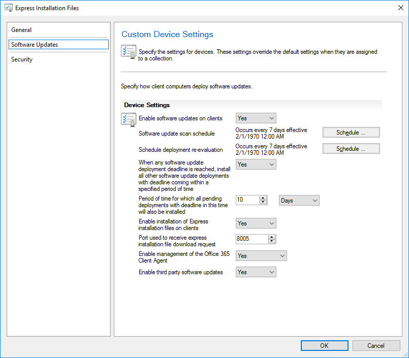
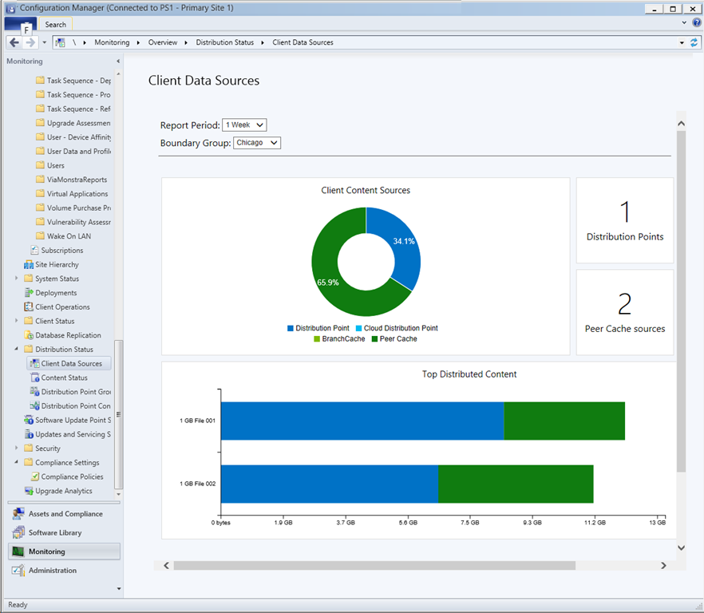
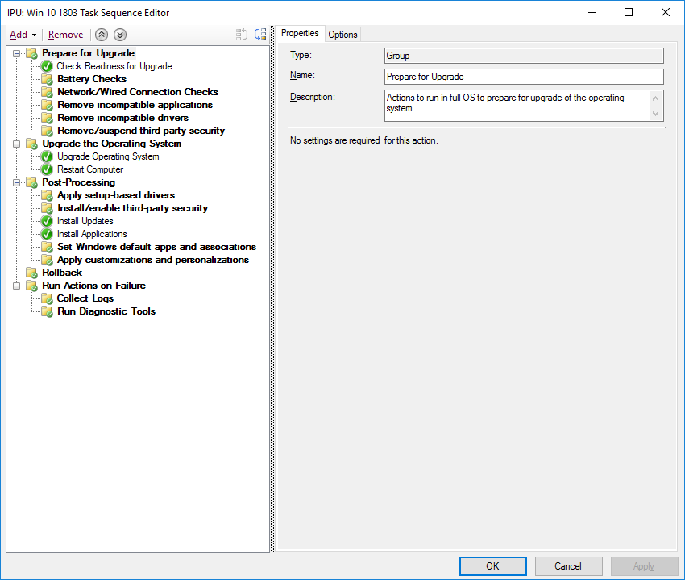

# Stap 7: Service van Windows en OfficeStep 7: Windows and Office Servicing

<table>
<thead>
<td></td>
<td>
<strong>Stap 7: Service van Windows en Office</strong><strong>Step 7: Windows and Office Servicing</strong>

Er worden continu nieuwe mogelijkheden toegevoegd aan zowel Windows 10 als Office 365 ProPlus om gebruikerservaringen en de beveiliging te blijven bijwerken met de nieuwste innovaties.Both Windows 10 and Office 365 ProPlus continually add new capabilities to keep bringing user experiences and security forward with the latest innovations. Lees hoe u uw versie actueel houdt met de halfjaarlijkse en maandelijkse updates, hoe het nieuwe servicemodel werkt en welke hulpmiddelen en opties u hebt.Learn how to stay current with semi-annual and monthly updates, how the new servicing model works and the tools and options you have.
</td>
<td></td>
</thead>
</table>

>[!NOTE]
>Windows en Office onderhouden is de zevende stap in ons aanbevolen implementatieproces. In deze stap wordt de planningsaspecten van het voorbereiden van halfjaarlijkse update van functies behandeld.Windows and Office Servicing is the seventh step in our recommended deployment process wheel covering the planning aspects of preparing for semi-annual updates to features. Ga naar het [Implementatiecentrum voor desktops](https://aka.ms/HowToShift) om het volledige desktop-implementatieproces te zien.To see the full desktop deployment process, visit the [Desktop Deployment Center](https://aka.ms/HowToShift).
>

In zowel Windows 10 als Office 365 ProPlus worden nieuwe onderhoudsopties, ondersteuningsmodellen en updatetijdlijnen geïntroduceerd.Both Windows 10 and Office 365 ProPlus introduce new servicing options, support models, and update timelines. Deze wijzigingen vereenvoudigen het proces om naar nieuwste functies bij te werken.These changes simplify the process for staying current on the latest features. Behalve deze updates zijn er ook nieuwe configuratieopties voor serviceabonnementen die aan uw behoeften voldoen.Along with these updates are new configuration options to enable servicing plans that meet your needs. We bekijken hoe u kunt voorbereiden op Semi-annual-kanaalupdates die nieuwe functies en mogelijkheden voor Windows 10 en Office 365 ProPlus bieden en hoe u tegelijkertijd de nieuwe functies in Microsoft Endpoint Configuration Manager (huidige vertakking) kunt inzetten.Let's learn how to prepare for semi-annual channel updates offering new features and capabilities in Windows 10 and Office 365 ProPlus while leveraging new features within Microsoft Endpoint Configuration Manager (Current Branch).

[Klanten helpen met de overstap naar Windows 10 en Office 365 ProPlusHelping customers shift to Windows 10 and Office 365 ProPlus](https://www.microsoft.com/microsoft-365/blog/2018/09/06/helping-customers-shift-to-a-modern-desktop/)

## Soorten updatesUpdate Types

Updates worden onderverdeeld in twee hoofdcategorieën: functie-updates en vervolgens op kwaliteits- en beveiligingsupdates die cumulatieve beveiligings-, betrouwbaarheids- en bugfixes bevatten.Updates fall into two main categories, feature updates and then quality and security updates which contain cumulative security, reliability and bug fixes. Wat de frequentie betreft, hanteren zowel Windows als Office een Semi-annual-kanaal. Nieuwe functies worden twee keer per jaar rond maart en september geleverd, maar de kwaliteits- en de beveiligingsupdates vinden maandelijks plaats.In terms of cadence both Windows and Office deliver a semi-annual channel which delivers new features twice per year around March and September while quality and security Updates occur Monthly. Bovendien bieden we, exclusief voor Office 365-toepassingen, een optie voor een Monthly-kanaal met volledig ondersteuning, waarbij updates zowel nieuwe functies als kwaliteitsupdates bevatten.Additionally, unique to Office 365 applications, we offer a fully-supported Monthly Channel option where updates contain both new features and quality updates.

Als u gewend bent aan een langere cyclus tussen updates voor uw desktopbesturingssysteem en apps, vraagt u zich misschien af:If you’re used to a longer cycle between desktop OS and app updates, you might be wondering;

  - Zijn de updates compatibel?Will the updates be compatible?

  - Moet ik mijn gebruikers steeds opnieuw trainen?Will I need to keep retraining my users?

  - En wat zijn de risico's?And what are the risks?

Om deze vragen te beantwoorden en voor de logica achter het vaker leveren van nieuwe mogelijkheden, leggen we een paar voordelen van deze benadering uit.To answer those questions and the rationale for delivering new capabilities more frequently, we’ll some of the advantages of this approach

### Voordelen van functie-updatesFeature Update Benefits

Allereerst zijn we afgestapt van het oude model waarbij elke drie jaar grote wijzigingsgolven werden geïntroduceerd en voeren we nu twee keer per jaar periodieke kleinere wijzigingen met functie-updates uit.First, we’ve moved away from the model of the past that would introduce huge waves of change around every three years to now incremental smaller changes with feature updates twice per year. Waarom?Why? Doordat technologische trends zo snel gaan en gepaard gaan met snel veranderende beveiligingsrisico's blijven gebruikservaringen en bescherming hierdoor actueel.With technology trends moving so fast in addition to rapidly evolving security threats, this keeps experiences and protections current. Sommige beveiligingsupdates kunnen bijvoorbeeld niet gewoon worden geleverd als maandelijkse beveiligingsupdates of virusdefinitiebestanden. Het gaat mogelijk om kleine wijzingen aan het platform, zoals beveiliging op basis van virtualisatie.Some of the security related updates for example can’t just be delivered by monthly security updates or antivirus signature files; they may be low-level changes platform, like virtualization-based security.

[Snelgids voor Windows als een serviceQuick guide to Windows as a service](https://docs.microsoft.com/windows/deployment/update/waas-quick-start)

[Risico's beperken met beveiligingsfuncties van Windows 10Mitigate threats by using Windows 10 security features](https://docs.microsoft.com/windows/security/threat-protection/overview-of-threat-mitigations-in-windows-10%20%20)

### Voordelen van een cumulatief updatemodelCumulative Update Model Benefits

Ten tweede worden veel van de problemen uit het verleden gecorrigeerd wanneer kwaliteits- en beveiligingsupdates als een cumulatief updatepakket worden geleverd.Second delivering quality and security updates as a cumulative update package corrects many of the issues of the past. Vroeger kon het zijn dat u iedere maand kon kiezen uit een dozijn of meer maandelijks updates voor zowel Windows als Office.It used to be that you might pick and choose sometimes from a dozen updates or more each month for both Windows and Office. Zoals u zich kunt voorstellen, zorgde dit voor u een nagenoeg onmogelijk aantal testmatrixen voor ondersteuning.As you can imagine, this creates a nearly impossible set of test matrices for support. Als u bovendien een versie van Windows of Office van een jaar of langer geleden installeert, kan het uren tot soms dagen duren om alle updates sinds deze versie werd uitgebracht, uit te voeren.Also, if you install a version of Windows or Office that is a year or more old, it might take hours or sometimes days to apply all updates delivered since that version was released.

Met het cumulatieve model bent u altijd met één update weer up-to-date en hiermee wordt het aantal te implementeren maandelijkse updates beperkt.With the cumulative model, you’re always one update away from being current and in doing so the number of monthly updates that you need to deploy is reduced. Elke update bouwt verder op de updates van voorgaande maanden en bevat alle oplossingen die u nodig hebt om up-to-date te blijven.Each update builds upon updates from previous months and contains all of the fixes that you need to get current. Cumulatieve updates zijn vooral handig als pc's gedurende een paar maanden zijn uitgeschakeld, omdat de updates klaar liggen om opnieuw aan een andere gebruiker te worden toegewezen.Cumulative updates are especially helpful when PCs has been turned off for several months because they are in storage waiting to be reassigned to a different user.

### Uitgebreide validatie van updatesExpanded Validation of Updates

Een ander voordeel is dat, voordat we de updates voor algemene implementatie uitrollen, deze eerst kunnen worden uitgebracht via de Insider-Programma's voor [Office](https://products.office.com/office-insider?tab=Windows-Desktop) en [Windows](https://insider.windows.com/). Hierdoor kunnen we diagnostische gegevens verzamelen en feedback ontvangen nog voordat we de updates voor iedereen uitbrengen.Another advantage is that, before we roll out updates for broad deployment, we first release builds via the Insider programs for [Office](https://products.office.com/office-insider?tab=Windows-Desktop) and [Windows](https://insider.windows.com/), and this allows us to gather diagnostic data and feedback ahead of us releasing updates broadly. De Insider-Programma's zijn nu voor iedereen toegankelijk, zodat u de updates al eerder kunt begrijpen.Now the Insider programs are open to everyone so that you can get ahead of understanding the updates. Tegen de tijd dat we updates uitbrengen, hebben we reeds diagnostische gegevens ontvangen van miljoenen configuraties, dus wanneer er updates worden uitgebracht, is de kwaliteit nu aanzienlijk voorspelbaarderBy the time we release updates we will have received diagnostic data from millions of configurations, so when we do roll out updates, quality is now inherently more predictable

En wat daar nog bij komt, omdat de Monthly-kanaalupdates worden meegenomen in de builds van Office 365 ProPlus Insider, als u een Semi-Annual-kanaal voor Office gebruikt om twee keer per jaar de functie-updates te krijgen, kunt u deze builds al vroeg valideren en de gerichte versies van het Semi-Annual-kanaal gebruiken.AND one more thing, because Office 365 ProPlus Insider builds reflect monthly channel updates, if you are using semi-annual channel for Office to deliver feature updates twice per year aligned to Windows, you can validate those builds early as well using the semi-annual channel targeted releases.

### Ondersteunende beheerprogramma’sSupporting Management Tools

We hebben ook nagedacht hoe we de implementatie van updates voor u zo gemakkelijk mogelijk kunnen maken.We've also thought through how to make the deployment of updates seamless to you. Configuration Manager (huidige vertakking) wordt regelmatig bijgewerkt om de implementatie van deze updates voor Windows en Office en eventuele nieuwe mogelijkheden te ondersteunen.Configuration Manager (Current Branch) is updated frequently to support the roll-out of these updates to Windows and Office and any new capabilities.

[Windows 10-updates implementeren met Configuration ManagerDeploy Windows 10 updates using Configuration Manager](https://docs.microsoft.com/windows/deployment/update/waas-manage-updates-configuration-manager)

[Office 365 ProPlus met Configuration Manager beherenManage Office 365 ProPlus with Configuration Manager](https://docs.microsoft.com/configmgr/sum/deploy-use/manage-office-365-proplus-updates)

## Overzicht van Windows- en Office-kanalenOverview of Windows and Office Channels

Windows 10 biedt drie servicekanalen:Windows 10 offers three servicing channels:

- Met het [**Windows Insider-programma**](https://docs.microsoft.com/windows/deployment/update/waas-overview#windows-insider) voor organisaties kunnen zij functies die worden geleverd bij de volgende functie-updates testen en feedback erover geven[**Windows Insider Program**](https://docs.microsoft.com/windows/deployment/update/waas-overview#windows-insider) for organizations to test and provide feedback on features shipped in the next feature update
- **Semi-Annual-kanaal** biedt tweemaal per jaar nieuwe functies met functie-updates**Semi-Annual Channel** provides new functionality with Feature Update releases twice per year
- **Long Term Servicing Channel** is alleen bedoeld voor gespecialiseerde apparaten die een langerlopende servicefunctie nodig hebben.**Long Term Servicing Channel** is designed only for specialized devices needing a longer servicing option

Office 365 biedt vier servicekanalen:Office 365 offers four servicing channels:

- Met het [**Office Insider-programma**](https://support.office.com/article/What-is-Office-Insider-f4208185-b63a-4b68-9c7a-9a32d2411c16) voor organisaties kunnen zij de nieuwste Office-functies en -functionaliteiten die nog in ontwikkeling zijn, testen en feedback erover geven[**Office Insider Program**](https://support.office.com/article/What-is-Office-Insider-f4208185-b63a-4b68-9c7a-9a32d2411c16) for organizations to test and provide feedback on the newest Office features and functionalities still in development
- **Monthly-kanaal** om gebruikers te voorzien van de nieuwste Office-functies zodra deze beschikbaar zijn**Monthly Channel** to provide users with the newest Office features as soon as they're available
- **Semi-annual-kanaal** biedt slechts tweemaal per jaar nieuwe functies met functie-updates**Semi-Annual Channel** provides new functionality with new features only twice per year
- **Semi-annual-kanaal (targeted)** is een volledig ondersteunde build van Office die pilot-gebruikers en testers van toepassingscompatibiliteit de mogelijkheid biedt het volgende Semi-annual-kanaal te testen en te valideren.**Semi-Annual Channel (Targeted)** is a fully supported build of Office that enables pilot users and application compatibility testers to test and validate the next Semi-Annual Channel

Voor meer informatie over de Windows- en Office-servicekanalen raadpleegt u de onderstaande documentatie:For detailed information about Windows and Office servicing channels please review the below documentation:

- [Overzicht van Windows als een serviceOverview of Windows as a Service](https://docs.microsoft.com/windows/deployment/update/waas-overview#servicing-channels)
- [Overzicht van de updatekanalen voor Office 365 ProPlusOverview of Update Channels for Office 365 ProPlus](https://docs.microsoft.com/DeployOffice/overview-of-update-channels-for-office-365-proplus#BKMK_SAC)

## Gefaseerde implementatie van updatesPhased Deployment of Updates

We gaan nu in op de manier waarop u deze updates gaat uitrollen.Now let’s shift gears to how you will roll out these updates. Voor elke versie adviseren we ten minste drie implementatiefasen voor IT: validatie, pilot en algemene productimplementatie.For any release, we recommend at least three deployment phases for IT – validation, piloting and broad production deployment. Zodra u eenmaal werkt met Windows 10 en Office 365 ProPlus, gebruikt u het maandelijkse onderhoud om met de kritieke beveiligings- en kwaliteitsupdates actueel te blijven. Vervolgens gaat u naar het semi-annual-onderhoud voor nieuwe functies.Once you’re up and running on Windows 10 and Office 365 ProPlus, you'll use monthly servicing to stay current with critical security and quality updates, then you’ll move to semi-annual servicing for new features.

### Maandelijkse updatesMonthly Updating

Het servicemodel is zo ontworpen dat u ervoor kunt kiezen om de uitrollen van de nieuwe functies te beperken tot twee keer per jaar en zo nodig kunt u zelfs een semi-annual-update overslaan en kwaliteits- en beveiligingsupdates blijven ontvangen.The service model is designed so you can choose to limit the roll-out of new features to twice per year, and if needed you can even skip a semi-annual update and continue receiving quality and security updates. Zoals gezegd, betekent de cumulatieve aard van de maandelijkse updates dat ze elke maand groter worden.As mentioned, the cumulative nature of monthly updates means each will increase in size per month.

#### Expres-updatesExpress Updates

Door gebruik te maken van een technologie genaamd 'Expres-updates' in Windows en binaire delta-compressie in Office kunnen we de downloadgrootte aanzienlijk verkleinen.Using a technology called "Express Updates" in Windows and Binary Delta Compression in Office, we can reduce the download size significantly. Bij beide benaderingen maakt de update-engines een vergelijking met wat er op de PC staat en zoekt alleen de aanwezige verschillen die moeten worden bijgewerkt.In both approaches, the update engines compare what’s on the PC and finds only the differentials needed to update what’s there.

[Kwaliteitsupdates voor Windows 10 uitgelegd & het einde van Delta-updatesWindows 10 quality updates explained & the end of delta updates](https://techcommunity.microsoft.com/t5/Windows-IT-Pro-Blog/Windows-10-quality-updates-explained-amp-the-end-of-delta/ba-p/214426)

Windows Update voor Bedrijven en Windows Server Update Services ondersteunen al lange tijd Expres-updates, maar we hebben dit nu uitgebreid met ondersteuning voor Microsoft Endpoint Configuration Manager (huidige vertakking), zodat deze ook Expres-updates kan gebruiken.Windows Update for Business and Windows Server Update Services have supported express updates for a long time, but we've now extended that support to Microsoft Endpoint Configuration Manager (Current Branch) so that it can also use Express Updates.

#### Binaire delta-compressieBinary Delta Compression

Binaire delta-compressie in Office wordt alleen gebruikt als u vanuit de recentste versie van Office 365 ProPlus bijwerkt. De benadering werkt dus alleen als u vanuit de vorige build gaat bijwerken en u kunt geen updates overslaan.Binary Delta Compression in Office is only used if you're updating from the most recent version of Office 365 ProPlus-- so to use this approach you need to be updating from the previous build and can’t skip updates.

U kunt kanalen voor Windows- en Office-updates beheren via Configuration Manager met gebruik van het standaardproces voor goedkeuring en doelprocessen.Windows and Office update channels can be managed via Configuration Manager using the standard approval and targeting process. U kunt ook beleidsinstellingen in Office en Windows gebruiken om gebruikte updatekanalen af te dwingen, evenals gerelateerde instellingen.Additionally, you can use policy settings in Office and Windows to enforce update channels used, as well as related settings.

### Semi-annual-updatesSemi-Annual Updates

Dit zijn de overwegingen voor maandelijkse updates. Dan nu de grotere, halfjaarlijkse updates.So those are your considerations for monthly updates, now let’s move to the larger, semi-annual updates.

Zoals we bij Gereedheid van apparaten en apps hebben behandeld, dient u de voorbereiding van deze grotere updates te beginnen met dezelfde gereedheidshulpprogramma's die we hebben ingesteld in stap 1 van het implementatieproces.As we covered in Device and App Readiness, you’ll want to begin your preparation for these larger updates using the same readiness tools we set up in Step 1 of the deployment process wheel.

Wat de tools betreft, kunt u beleidsinstellingen gebruiken bij Windows Update voor Bedrijven, software-updatebeheer via Microsoft Endpoint Configuration Manager (huidige vertakking), Windows Server Update Services (WSUS) of beleid bijwerken dat is ingesteld door Microsoft Intune.As for tooling, you can use policy settings with Windows Update for Business, software update management via Microsoft Endpoint Configuration Manager (Current Branch), Windows Server Update Services (WSUS), or update policies set by Microsoft Intune. Als u zich zorgen maakt over de netwerkbandbreedte, raadpleegt u Stap 2: Gereedheid van mappen en netwerken voor meer informatie over de opties om netwerkverkeer te beperken via Delivery Optimization en andere peer-to-peer-cachetechnologieën.If you are concerned about network bandwidth, see Step 2: Directory and Network Readiness, to learn about your options to reduce network traffic via Delivery Optimization and other peer to peer caching technologies.

[Semi-annual-kanaal voor WindowsWindows Semi-Annual Channel](https://docs.microsoft.com/windows/deployment/update/waas-overview#semi-annual-channel)

[Semi-annual-kanaal voor Office 365 ProPlusSemi-Annual Channel for Office 365 ProPlus](https://docs.microsoft.com/DeployOffice/overview-of-update-channels-for-office-365-proplus#BKMK_SAC)

#### Takenreeksen upgradenUpgrade Task Sequences

De installatie van de grotere functie-updates via standaard routines voor software-updates is een ondersteunde optie, maar veel organisaties verkiezen een Upgrade takenreeks te gebruiken met Microsoft Endpoint Configuration Manager (huidige vertakking) of de Microsoft Deployment Toolkit.Installing the larger feature updates via standard software update management routines is a supported option, but many organizations will opt to use an Upgrade Task Sequence with Microsoft Endpoint Configuration Manager (Current Branch) or the Microsoft Deployment Toolkit.

Met een Takenreeks kunt u aangepaste controles of taken maken VOORDAT u de functie-update installeert en kunt u aangepaste taken uitvoeren NADAT de update-installatie zelf is voltooid: taken na de update zijn mogelijk waar nodig de services tijdelijk onderbreken tijdens de update, stuurprogramma's installeren en vervangen, upgrades van toepassingen of de taakbalk en van personalisatie-instellingen voor Windows 10 Start.A Task Sequence allows you to create custom checks or tasks BEFORE to the installing the Feature Update and allows you to perform custom tasks AFTER the update installation itself has completed – post-update tasks might include temporarily suspending services if needed during the update, driver installation and replacement, application upgrades or taskbar and Windows 10 Start personalization settings.

Als u al takenreeksen gebruikt om uw Windows 7-computers naar Windows 10 te migreren en ervaring hebt met deze hulpmiddelen goed, is dit een prima startpunt en hebt u complete controle.If you’re already using task sequences to migrate your Windows 7 machines to Windows 10 and are well-versed with those tools, this is a great place to start and provides ultimate control. Hoewel u één takenreeks voor de gehele upgrade kunt gebruiken, is het heel gebruikelijk dat organisaties twee takenreeksen gebruiken.While you can use a single task sequence for the entire upgrade, it is quite common that organizations use two task sequences. Eén takenreeks zorgt ervoor dat de computers gereed zijn voor de upgrade, waarbij alle vereiste installatiebestanden op doelcomputers in stilte worden voorbereid, en één om de daadwerkelijke upgrade uit te voeren.One task sequence for making sure the machines are ready for the upgrade, that silently pre-stages all the required setup files on target computers, and one to do the actual upgrade. Op deze manier zorgt u ervoor dat de productiviteit van uw gebruikers minder wordt beïnvloed.This approach ensures that your user productivity is less impacted.

[Een taakreeks maken voor het upgraden van een besturingssysteem in Configuration ManagerCreate a task sequence to upgrade an OS in Configuration Manager](https://docs.microsoft.com/configmgr/osd/deploy-use/create-a-task-sequence-to-upgrade-an-operating-system)

#### Ondersteuning met een Semi-annual-kanaal voor functie-updatesSemi-annual channel support for feature updates

[Zoals aangekondigd in september 2018](https://www.microsoft.com/microsoft-365/blog/2018/09/06/helping-customers-shift-to-a-modern-desktop/), wordt er in de ondersteuningsperiode voor de semi-annual-kanaalupdates het volgende model gebruikt.[As announced in September 2018](https://www.microsoft.com/microsoft-365/blog/2018/09/06/helping-customers-shift-to-a-modern-desktop/), support timeline for semi-annual channel updates will use the following model.

  - Alle momenteel ondersteunde functie-updates van Windows 10 Enterprise en Education, te beginnen met versie 1607, worden gedurende 30 maanden na de oorspronkelijke releasedatum ondersteund.All currently supported feature updates of Windows 10 Enterprise and Education, starting with version 1607, will be supported for 30 months from their original release date.

  - Alle toekomstige functie-updates, te beginnen met 1809, die voor september zijn bedoeld, worden gedurende 30 maanden na de releasedatum ondersteund.All future feature updates, starting with 1809, with a targeting September will be supported for 30 months from their release date.

  - Toekomstige functie-updates die voor maart zijn bedoeld en te beginnen met 1903, worden nog 18 maanden na de releasedatum ondersteund.Future feature updates targeting March and starting with 1903 will continue to be supported for 18 months from their release date.

  - Halfjaarlijkse updates voor Office 365 ProPlus worden nog 18 maanden ondersteundOffice 365 ProPlus semi-annual updates continue to be supported for 18 months

#### Aanvullende automatiseringsopties voor het instellen buiten de takenreeksenAdditional setup automation options outside of task sequences

Als u geen Upgrade takenreeks gebruikt, kunt u nu aangepaste acties uitvoeren of stuurprogrammabestanden toepassen tijdens de functie-updates in de fase voorafgaand aan de installatie (dus voordat de compatibiliteitscontrole wordt uitgevoerd door de installatie) of in de fase voordat het definitief wordt (voordat de upgrade wordt uitgevoerd).If you don’t use Upgrade Task Sequences, you can now run custom actions or apply driver files during feature updates in the Pre-install phase – before setup runs its compatibility checks – or in the pre-commit phase – before the upgrade is applied.

[Wat is er nieuw in de installatie van Windows 10, versie 1803What's new in Windows 10 setup, version 1803](https://docs.microsoft.com/windows/whats-new/whats-new-windows-10-version-1803%23windows-setup)

## Volgende stapNext Step 

## [Stap 8: Communicatie en training voor gebruikersStep 8: User Communications and Training](https://aka.ms/mdd8)

## Vorige stapPrevious Step 

## [Stap 6: implementatie van besturingssysteem en functie-updatesStep 6 OS Deployment and Feature Updates](https://aka.ms/mdd6)
