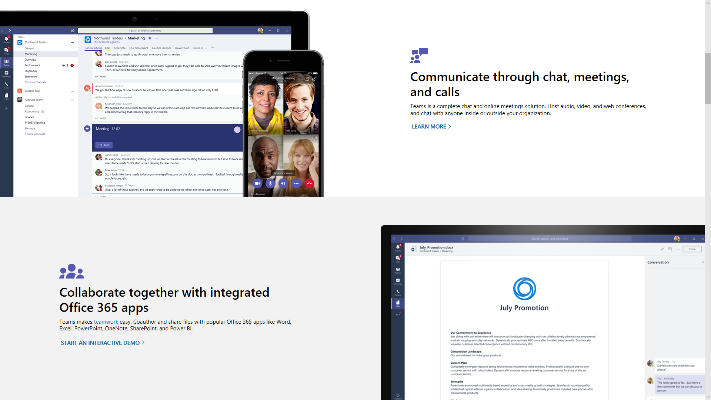
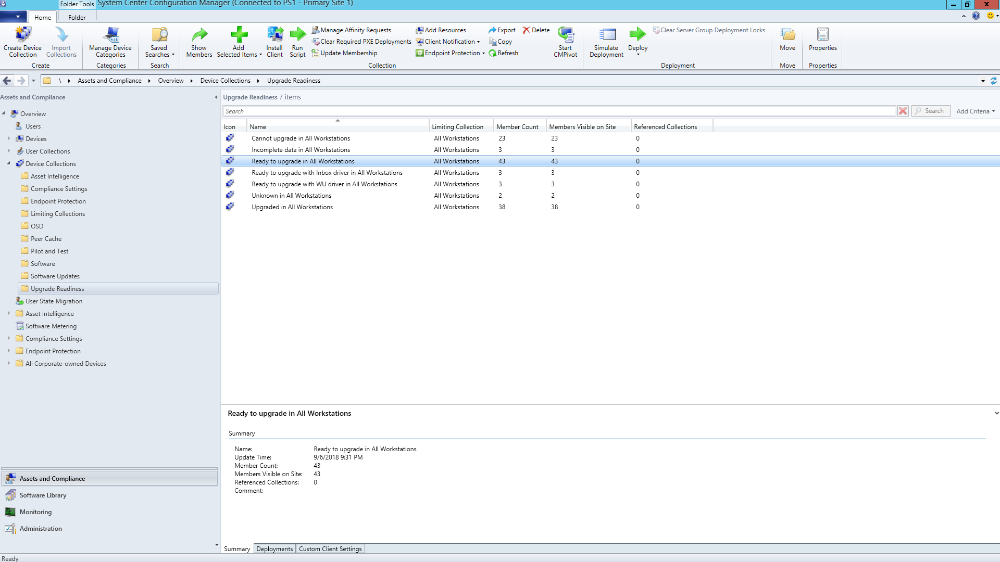
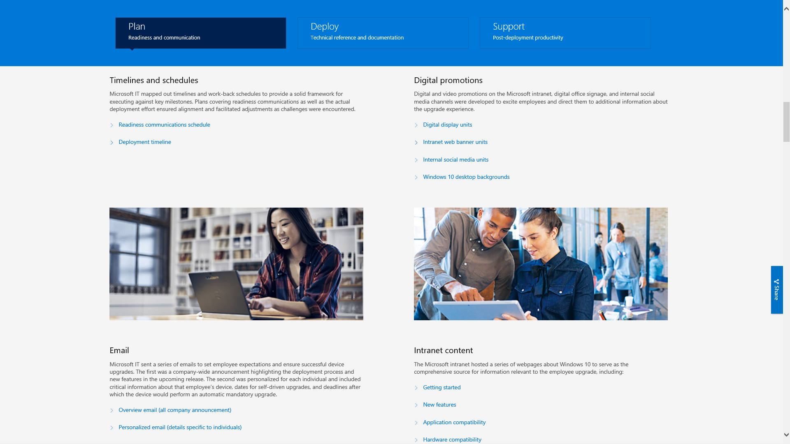

# Stap 8: Communicatie en training voor gebruikers

<table>
<thead>
<td></td>
<td>
<strong>Stap 8 - Communicatie en training voor gebruikers</strong>

Zorg ervoor dat uw gebruikers op de hoogte zijn van nieuwe functies en nieuwe manieren om te werken terwijl u uw pc's naar Windows 10 en Office 365 ProPlus overzet. Lees meer over het gebruik van gebruikersondersteuning met Microsoft FastTrack, trainingsmateriaal en communicatiesjablonen. Daarnaast kunt u de gebruikersacceptatie en het gebruik bewaken.
</td>
<td></td>
</thead>
</table>

>[!NOTE]
>Communicatie en training voor gebruikers is de achtste stap in ons aanbevolen implementatieproces door tips en aanbevelingen aan te geven om gebruikers op de hoogte te stellen en voor te bereiden. Ga naar het [Implementatiecentrum voor desktops](https://aka.ms/HowToShift) om het volledige desktop-implementatieproces te zien.
>

Om uw gebruikers te informeren en voor te bereiden op een moderne werkplekervaring, is het belangrijk om ervoor te zorgen dat Office 365, Windows 10 en de nieuwe beveiligings- en compliance-besturingselementen van Azure Active Directory worden gebruikt. Als sommige gebruikers vrezen dat hun productiviteit wordt aangetast, hun werkstroom wordt verstoord of als ze nieuwe dingen moeten leren, zijn er manieren hoe u het beste updates kunt introduceren.

Het goede nieuws is als u overstapt van Windows 7 en Office 2010 of Office 2013, zijn al veel mensen bekend met Windows 10 en nieuwere versies van Office op hun persoonlijke apparaten. Hierdoor worden de gevolgen van de wijziging beperkt.

## Voorbereidingen treffen voor nieuwe ervaringen

Als u Office 365 ProPlus voor de eerste keer installeert, is dit het moment om de voordelen te communiceren van het aanmelden bij Office-apps en het bestanden opslaan in OneDrive of SharePoint. Hiermee kunt u eenvoudiger delen, vermindert u bestandsvertakkingen en kunt cocreatie in realtime inschakelen.

Er zijn gedetailleerde sjablonen voor communicatie en training beschikbaar voor deze en andere lokale of browser-apps, zoals Teams en Planner.

We bieden ook aanwijzingen voor nieuwe in-app-functies, zoals het toevoegen van gekoppelde OneDrive-bestanden in Outlook of het gebruik van de nieuwe morphing en Designer-functies in PowerPoint.

Voor Windows 10 is het handig om uw gebruikers te introduceren met optionele en standaardmogelijkheden als Windows Hello om op veilige manier aan te melden door middel van biometrie, Start updates om uw Windows-ervaring te personaliseren, Timeline om eenvoudig terug te gaan naar uw eerdere werk, Cortana en meer.

Er zijn ook zichtbare besturingselementen voor beveiliging en compliance waaraan uw gebruikers wellicht worden blootgesteld. Enterprise Mobility + Security, dat Azure AD en Microsoft Intune omvat, integreert extra functies in Windows 10 en Office 365 die u kunt instellen voor het upgraden van uw bureaublad.

[Microsoft Enterprise Mobility + Security](https://www.microsoft.com/cloud-platform/enterprise-mobility-security)

Als u bijvoorbeeld meervoudige verificatie geeft ingeschakeld, gebruikt deze Azure AD en beschermt gebruikersaanmelding door het gebruik van een telefoon-app of PIN om veilig van diensten gebruik te kunnen maken.  Azure Information Protection maakt het eenvoudig voor gebruikers om documenten te classificeren en te labelen.

[Meervoudige verificatie voor Office 365-gebruikers instellen](https://support.office.com/article/set-up-multi-factor-authentication-for-office-365-users-8f0454b2-f51a-4d9c-bcde-2c48e41621c6)

Dit zijn slechts één van de nieuwe mogelijkheden die door uw gebruikers zullen worden ervaren. Sommigen zullen als verrassend worden gezien, ofwel positief of minder positief. Deze verrassingen kunnen leiden tot meer telefoontjes en vragen voor uw helpdesk, vooral als het hun normale workflow verandert.

## Proactieve voorbereiding en stap-voor-stap uitrol

We adviseren twee complementaire benaderingen om het risico te beperken bij wijzigingen in de gebruikerservaring:

  - Proactieve communicatie met uw gebruikers, zodat ze weten wat ze kunnen verwachten

  - Gebruik van implementatie-ringen om de implementatiefrequentie te beheersen

### Gefaseerde implementatie

Gefaseerde implementatie met behulp van implementatie-ringen is het concept om te beginnen met een kleine groep en dan stap-voor-stap op grotere schaal uit te rollen. Zodra een communicatie-en trainingsplan wordt opgesteld, moeten deze ringen en de bijbehorende leden worden geformuleerd. Op deze manier kunt u risico's beperken en uw benadering valideren naarmate u verder implementeert, of activiteiten pauzeert indien nodig, bijvoorbeeld wanneer er meer helpdesk-oproepen binnenkomen dan verwacht.

Implementatieringen zijn het meest geschikt voor samenwerking met business units en hun managers. Het is belangrijk dat u belangrijke datums en tijden op een rij hebt om te vermijden voor de implementatie of bij het aanbrengen van wijzigingen. Zonder een zorgvuldige planning en steun van belanghebbenden, is het lastig om gebruikers aan boord te krijgen en vertrouwd te raken met de wijzigingen die eraan komen.

### Fase 1: het IT-team en Early Adopter Insiders 

Het is doorgaans het beste om uw implementatie te beginnen met het IT-team en early adopters die in een vroeg stadium willen meedoen. Met deze 'insiders' kunt u uw communicatie, de gevolgen van de veranderingen en de effectiviteit van uw communicatie en training testen. Tijdens deze fase voert IT kleine testfases uit. U leert problemen oplossen en automatiseringstechnieken voor de implementatie op grotere schaal.

Het is belangrijk dat u toegewijde deelnemers in de eerste fase gebruikt om ervoor te zorgen dat ze hun opmerkingen documenteren en in het proces worden meegenomen. Het is ook een goed idee om enthousiaste mensen buiten het IT-team te hebben om te helpen bij de mond-tot-mond communicatie over de nieuwe mogelijkheden. Deze mensen zullen vaak het eerste aanspreekpunt zijn als gebruikers in latere fasen hulp nodig hebben.

### Fase 2: testfase 

Zodra u tevreden bent over de eerste fase, kunt u zich richten op een grotere groep gebruikers voor uw tweede testfase. Dit moet een representatieve groep zijn van gebruikersrollen, apparaattypen, Windows-apps en Office-invoegtoepassingen. De gegevens die uit deze groepen komen, worden in Analytics gebruikt voor fase 3, de implementatie op grotere schaal.

Houd er rekening mee dat alle pc's in deze en toekomstige fasen moeten zijn aangemeld bij de Analytics-service. Zo verzamelt u diagnostische gegevens over apparaten en de status van de app, bandbreedte van de Delivery Optimization en het gebruik van Windows Hello-aanmelding.

Voor deze fase is het met name belangrijk om wijzigingen te communiceren en gebruikers te helpen met de nieuwe mogelijkheden. Gebruikers kunnen vaak een e-mailbericht of andere communicatie van IT naast zich neerleggen. Het is dus verstandig om met management af te stemmen bij het communiceren en het doorvoeren van de nieuwe hulpprogramma's en technologie.

U moet ook weten welk tijdsbestek te vermijden, zodat u de onderbreking voor gebruikers minimaliseert. Het is bijvoorbeeld mogelijk dat de financiële afdeling niet staat te springen aan het einde van het fiscale kwartaal of het productontwikkelingsteam ten tijde van een productlancering.

Om apparaten, gebruikers, afdelingen en tijdlijnen zo goed mogelijk te plannen, kunt u beginnen met het maken van uw communicatie- en trainingsplannen, inhoud verzamelen of het inhuren van externe bronnen om gebruikers te helpen.

#### Microsoft FastTrack 

Om u te helpen bij het verzamelen van trainingsinhoud, hebt u toegang tot een uitgebreide reeks korte videotrainingen met stapsgewijze instructies voor het werken met de Microsoft FastTrack Productivity Library.

[Microsoft FastTrack Productivity Library](https://www.microsoft.com/microsoft-365/success/?rtc=2)

Er zijn honderden onderwerpen gebaseerd op wat belangrijk is voor uw organisatie, waaronder: het creëren van betere inhoud, het delen van sites en inhoud, het transformeren van teamwork en het ontgrendelen van de productiviteit met moderne apparaten.

Als u Microsoft 365 of Office 365 gebruikt, is er ook een goede kans dat u in aanmerking komt voor hulp bij de gebruikersacceptatie via de FastTrack-service van Microsoft. Vertegenwoordigers begeleiden u bij de aanbevolen procedures voor het implementeren van het Microsoft 365-Windows-, Office-en EMS-uitrolproces.

#### Microsoft IT Showcase 

De Microsoft IT Showcase is een andere geweldige bron voor de implementatie van Windows 10. Het omvat tijdlijnen en planningen, sjablonen voor digitale promotie, e-mail sjablonen en intranet inhoud. Deze zijn gebaseerd op materiaal dat werd gebruikt voor de eigen implementatie van Microsoft voor Windows 10 en is aangepast voor elke organisatie.

[De organisatie voorbereiden voor een naadloze Windows 10-implementatie](https://www.microsoft.com/itshowcase/windows10deployment)

Deze onderdelen en services kunnen tijdens de testfase nauwkeurig worden afgestemd. Zodra u doorkrijgt wat er resoneert met gebruikers aan de trainingskant, op welke apparaten moeten worden gericht en via Analytics, welke apparaten of gebruikersgroepen u moet vermijden of uitstellen, kunt u de implementatie op grotere schaal uitbreiden op basis van gegevens en ervaringen van gebruikers.

Naarmate uw testfase uitbreidt, wilt u regelmatig veelgestelde vragen en selfservice-inhoud documenteren en publiceren om vragen en helpdesk activiteiten proactief te verminderen.

### Fase 3 en verder: implementatie op grote schaal 

Zodra u de implementatie op grote schaal fase bereikt, hebt u uw processen, communicatie, training en selfservice-hulpmiddelen verfijnd. U kunt nu de diagnostische gegevens die worden verzameld, gebruiken om meer en meer pc's te bereiken.

Implementeer met een snelheid die kan worden beheerd door de IT-afdeling, de helpdesk, gebruikers en de netwerkcapaciteit. U kunt altijd teruggaan naar stap 2 van het implementatieproces om uw netwerk nog verder te optimaliseren door peer-to-peercache, LEDBAT en andere technieken om een snellere overdracht van de implementatiegegevens mogelijk te maken.

Naast de diagnostische gegevens die u met behulp van de analysehulpprogramma's bewaakt, kunt u ook het gebruik van Office 365 en Microsoft 365 gedetailleerd controleren met behulp van gebruikersrapporten in de werkbelasting in het beheercentrum en de admin-dashboards via Power BI. Dit zijn handige hulpmiddelen om doelstellingen te bepalen en bij te houden terwijl u nieuwe hulpmiddelen voor samenwerking uitrolt, zoals Microsoft Teams, of nieuwe manieren om bestanden te delen, zoals OneDrive.

De acceptatie en implementatie van nieuwe technologie gaat nog lang door nadat elke pc in uw organisatie Windows 10 en Office 365 ProPlus heeft geïnstalleerd. Gebruikers zullen niet zomaar hun werkwijze veranderen, zonder dat u de tijd neemt om hen op de hoogte te stellen van nieuwe mogelijkheden en ze te trainen. En dankzij de nieuwe servicemodellen die elk halfjaar doorlopend nieuwe functionaliteiten bieden voor Windows en optioneel op maandbasis voor Office, zal communicatie blijven doorgaan.

## Vorige stap 

## [Stap 7: Service van Windows en Office](https://aka.ms/mdd7)
