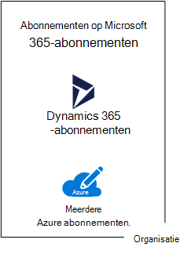
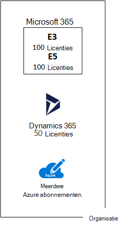
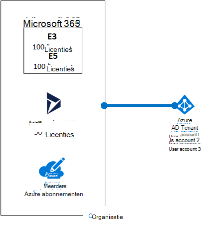
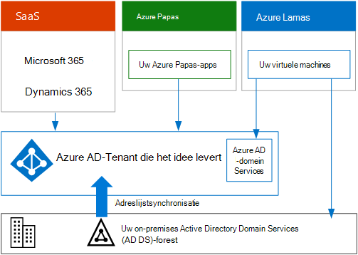

# Abonnementen, licenties, accounts en tenants voor cloudaanbiedingen van Microsoft

Microsoft biedt een hiërarchie van organisaties, abonnementen, licenties en gebruikersaccounts voor een consistent gebruik van identiteiten en facturering voor de Cloud-aanbiedingen:
  
- Microsoft 365 en Microsoft Office 365
- Microsoft Azure
- Microsoft Dynamics 365

## Elementen van de hiërarchie

Dit zijn de elementen van de hiërarchie:
  
### Organisatie

Een organisatie vertegenwoordigt een zakelijke entiteit die gebruikmaakt van Microsoft-Cloud aanbiedingen, meestal aangeduid door een of meer DNS-domeinnamen (openbare DNS), zoals contoso.com. De organisatie is een container voor abonnementen.
  
### Abonnementen

Een-abonnement is een overeenkomst met Microsoft voor het gebruik van een of meer Microsoft cloudplatformen of-services, waarvoor kosten worden berekend op basis van licentiekosten per gebruiker of op het resourceverbruik op de Cloud. 

- Software van Microsoft als een service (SaaS)-cloudaanbieding (Microsoft 365 en Dynamics 365) brengt licentiekosten per gebruiker in rekening. 
- Het platform van Microsoft als een service (PaaS) en infrastructuur als service (IaaS)-Cloud-aanbiedingen (Azure) op basis van het verbruik van de cloudresource.
 
U kunt ook een proefabonnement gebruiken, maar het abonnement verloopt na een bepaalde tijd of verbruikte kosten. U kunt een proefabonnement omzetten naar een betaald abonnement.
  
Organisaties kunnen meerdere abonnementen hebben voor de cloud van Microsoft. Afbeelding 1 toont één organisatie met meerdere Microsoft 365-abonnementen, een Dynamics 365-abonnement en meerdere Azure-abonnementen.

**Afbeelding 1: voorbeeld van meerdere abonnementen voor een organisatie**

  
### Licenties

Voor Microsoft SaaS-cloudaanbiedingen kan een licentie een specifiek gebruikersaccount gebruiken om de services van de cloud te gebruiken. Er worden kosten in rekening gebracht als onderdeel van uw abonnement. Beheerders kunnen licenties toewijzen aan afzonderlijke gebruikersaccounts in het abonnement. Voor het voorbeeld in afbeelding 2 heeft Contoso Corporation een Microsoft 365 E5-abonnement met 100 licenties, waarmee maximaal 100 afzonderlijke gebruikersaccounts kunnen worden gebruikt voor de functies en services van Microsoft 365 E5.
  
**Afbeelding 2: licenties in de op SaaS gebaseerde abonnementen voor een organisatie**

>[!Note]
>Volgens goed beveiligingsgebruik worden aparte gebruikersaccounts gebruikt die elk specifieke rollen toegewezen krijgen voor administratieve functies. Deze toegewezen beheerdersaccounts hoeven geen licentie toegewezen krijgen voor de cloudservices die ze beheren. Een SharePoint-servicebeheerdersaccount hoeft bijvoorbeeld niet toegewezen zijn aan een Microsoft 365-licentie.
>

Voor Azure PaaS-cloudservices zijn softwarelicenties ingebouwd in de serviceprijzen.
  
Voor Azure IaaS-virtuele machines zijn er mogelijk extra licenties vereist voor het gebruik van de software of toepassing die op een virtuele machine-afbeelding zijn geïnstalleerd. Voor sommige virtuele-machine beelden zijn gelicentieerde versies van software geïnstalleerd en de kosten worden opgenomen in de prijs per minuut voor de server. Voorbeelden zijn de virtuele machines voor SQL Server 2014 en SQL Server 2016. 
  
Voor sommige virtuele-machine beelden zijn proefversies van-toepassingen geïnstalleerd en u hebt aanvullende software licenties nodig voor gebruik na de proefperiode. Bijvoorbeeld, de installatiekopie van de evaluatieversie van SharePoint Server 2016 bevat bijvoorbeeld een evaluatieversie van SharePoint Server 2016 vooraf geïnstalleerd. Als u SharePoint Server 2016 wilt blijven gebruiken na de vervaldatum van het proefabonnement, moet u een licentie voor SharePoint Server 2016 en clientlicenties bij Microsoft aanschaffen. Deze kosten staan los van het Azure-abonnement en de prijs per minuut voor de virtuele machine is nog steeds van toepassing.
  
### Gebruikersaccounts

Gebruikersaccounts voor alle cloudaanbiedingen van Microsoft worden opgeslagen in een Azure Active Directory-Tenant (Azure AD) die gebruikersaccounts en groepen bevat. Een Azure AD-Tenant kan worden gesynchroniseerd met uw bestaande AD DS-accounts (Active Directory Domain Services) via Azure AD Connect, een Windows Server-service. Dit wordt ook wel adreslijstsynchronisatie genoemd.
  
In afbeelding 3 ziet u een voorbeeld van meerdere abonnementen van een organisatie met een gemeenschappelijke Azure AD-Tenant met de accounts van de organisatie.
  
**Afbeelding 3: meerdere abonnementen van een organisatie die dezelfde Azure AD-Tenant gebruiken**

  
### Tenants

Voor SaaS-cloudaanbiedingen is de tenant de regionale locatie die de servers bevat die cloudservices bieden. De Contoso Corporation koos bijvoorbeeld voor de Europese regio om de Microsoft 365-, EMS- en Dynamics 365-abonnementen te hosten voor de 15.000 werknemers in hun hoofdkantoor in Parijs.
  
Azure PaaS-Services en werkbelastingen voor virtuele machines die worden gehost in Azure IaaS kunnen in een Azure-datacenter overal ter wereld zijn. U geeft het Azure-datacenter op dat wordt aangeduid als de locatie, wanneer u de Azure PaaS-app of-service of het element van een IaaS-werkbelasting maakt.
  
Een Azure AD-tenant is een specifiek exemplaar van Azure AD dat accounts en groepen bevat. Betaalde of proefabonnementen van Microsoft 365 of Dynamics 365 bevatten een gratis Azure AD-Tenant. De Azure AD-tenant omvat geen andere Azure-Services en is niet hetzelfde als een (proef)abonnement van Azure.
  
### Samenvatting van de hiërarchie

Dit is een snelle samenvatting:
  
- Een organisatie kan meerdere abonnementen hebben.
    
  - Een abonnement kan meerdere licenties hebben
    
  - U kunt licenties toewijzen aan afzonderlijke gebruikersaccounts.
    
  - Gebruikersaccounts worden opgeslagen in een Azure AD-tenant
    
Hieronder ziet u een voorbeeld van de relatie tussen organisaties, abonnementen, licenties en gebruikersaccounts:
  
- Een organisatie die is geïdentificeerd met de openbare domeinnaam.
    
  - Een Microsoft 365 E3-abonnement met gebruikerslicenties.
    
    Een Microsoft 365 E5-abonnement met gebruikerslicenties.
    
    Een Microsoft 365 abonnement met gebruikerslicenties.
    
    Meerdere Azure abonnementen.
    
  - De gebruikersaccounts van de organisatie in een gemeenschappelijke Azure AD-tenant.
    
Voor meerdere Microsoft cloudabonnementen kan dezelfde Azure AD-tenant worden gebruikt als voor een algemene identiteitsprovider. Een centraal Azure AD-tenant met de gesynchroniseerde accounts van uw on-premises AD DS biedt cloudidentiteit als een service (IDaaS) voor uw organisatie. 
  
**Afbeelding 4: gesynchroniseerde on-premises accounts en IDaaS voor een organisatie**

  
In afbeelding 4 ziet u hoe een gemeenschappelijke Azure AD-Tenant wordt gebruikt door SaaS-cloudaanbiedingen van Microsoft, Azure PaaS-apps en virtuele machines in Azure IaaS die Azure AD Domain Services gebruiken. Met Azure AD Connect wordt het on-premises AD DS-forest gesynchroniseerd met de Azure AD-tenant.
  
## Abonnementen combineren voor meerdere Microsoft cloudaanbiedingen

In de volgende tabel wordt beschreven hoe u meerdere Microsoft cloudaanbiedingen kunt combineren op basis van het al hebben van een abonnement voor één type cloudaanbieding (de labels lopen af in de eerste kolom) en een abonnement voor een andere Cloud aanbieding toe te voegen aan de hand van de kolommen.
  
||**Microsoft 365**|**Azure**|**Dynamics 365**|
|:-----|:-----|:-----|:-----|:-----|
|**Microsoft 365**   |N.v.t.    |U voegt een Azure-abonnement toe aan uw organisatie vanuit het Azure Portal.    |In het Microsoft 365-Beheercentrum voegt u een Dynamics 365-abonnement toe aan uw organisatie.    |
|**Azure**   |U voegt een Microsoft 365-abonnement toe aan uw organisatie.    |N.v.t.    |U voegt een Dynamics 365-abonnement toe aan uw organisatie.    |
|**Dynamics 365**   |U voegt een Microsoft 365-abonnement toe aan uw organisatie.    |U voegt een Azure-abonnement toe aan uw organisatie vanuit het Azure Portal.    |N.v.t.    |
   
Een eenvoudige manier om abonnementen toe te voegen aan uw organisatie voor op Microsoft SaaS gebaseerde services, is via het Beheercentrum:
  
1. Meld u aan in het Microsoft 365-beheercentrum ([https://admin.microsoft.com](https://admin.microsoft.com)) met uw globale beheerdersaccount.
    
2. Klik vanaf de linkernavigatiebalk van de startpagina van het **Beheercentrum** op **Facturering**, en vervolgens op **Diensten aanschaffen**.
    
3. Koop de nieuwe abonnementen op de pagina **aanschaffen Services**.
    
Het Beheercentrum wijst de organisatie en de Azure AD-tenant van uw Microsoft 365-abonnement toe aan de nieuwe abonnementen voor op SaaS gebaseerde Cloud-aanbiedingen.
  
Om een Azure-abonnement met dezelfde organisatie en Azure AD tenant toe te voegen als uw Microsoft 365-abonnement:
  
1. Meld u aan in het Azure Portal ([https://portal.azure.com](https://portal.azure.com)) met uw Microsoft 365 globale beheerdersaccount.
    
2. In het linkernavigatievenster kiest u **Abonnementen** en klik dan op **Toevoegen**.
    
3. Selecteer op de pagina **Abonnement toevoegen** een aanbieding en voltooi de betalingsgegevens en de overeenkomst.
    
Als u de abonnementen Azure en Microsoft 365 afzonderlijk hebt aangeschaft en u de Microsoft 365 Azure AD-tenant wilt openen vanuit uw Azure-abonnement, raadpleeg dan de instructies in[Een bestaand Azure-abonnement aan uw Azure Active Directory-tenant toevoegen](/azure/active-directory/fundamentals/active-directory-how-subscriptions-associated-directory).
 
## Zie ook

[Microsoft Cloud voor Enterprise Architects](../solutions/cloud-architecture-models.md)
  
[Architectuurmodellen voor SharePoint, Exchange, Skype voor Bedrijven en Lync](architectural-models-for-sharepoint-exchange-skype-for-business-and-lync.md)
  
[Hybride oplossingen](hybrid-solutions.md)

## Volgende stap

[Microsoft 365-netwerkverbindingen evalueren](assessing-network-connectivity.md)
