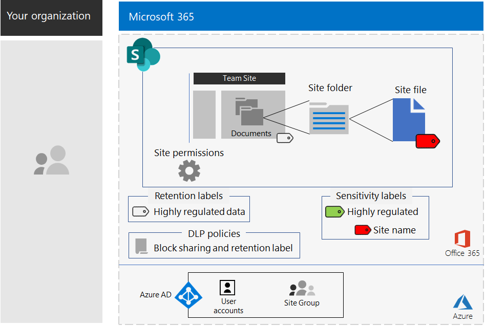

# SharePoint-sites voor sterk gereglementeerde gegevens

*Dit scenario geldt voor zowel E3- als E5-versies van Microsoft 365 Enterprise*

Microsoft 365 Enterprise heeft onder meer een volledige suite van cloudservices zodat u uw sterk gereglementeerde gegevens kunt maken, opslaan, beveiligen en beheren. Dit zijn onder meer gegevens die:

- onderhevig zijn aan regionale regelgeving.
- de meest waardevolle gegevens voor uw organisatie bevatten, zoals handelsgeheimen, informatie over financiën of personeel en de organisatorische strategie.

>[!Note]
> [Hier](secure-teams-highly-regulated-data-scenario.md) vindt u een vergelijkbaar scenario met Microsoft Teams.
>

Een Microsoft 365 Enterprise-cloudscenario dat aan deze bedrijfsbehoefte voldoet, vereist dat u:

- bestanden (documenten, diapresentaties, spreadsheets, enz.) opslaat op een SharePoint-teamsite.
- Vergrendel de site om te voorkomen dat:
  - Toegang tot gebruikers die geen deel uitmaken van de Microsoft 365-groep voor de site.
  - leden van de site toegang verlenen aan anderen.
  - niet-leden van de site toegang verzoeken tot de site.
- Configureer een retentielabel voor uw SharePoint-sites als standaardmanier om te voorkomen dat gebruikers bestanden verzenden buiten het bedrijf.
- Versleutel de meest gevoelige bestanden van de site met versleuteling die met het bestand wordt meeverplaatst.
- Voeg machtigingen toe aan de meest gevoelige bestanden, zodat het openen van het bestand, zelfs als dat wordt gedeeld buiten de site, nog steeds geldige machtigingen vereist van een gebruikersaccount met toegang.

De volgende tabel zet de vereisten voor dit scenario uit in een functie van Microsoft 365 Enterprise.

|||
|:-------|:-----|
| **Vereiste** | **Microsoft 365 Enterprise feature** |
| Bestanden opslaan | SharePoint-teamsites |
| De site vergrendelen | Microsoft 365-groepen en machtigingen voor SharePoint-Team sites |
| De bestanden van een site een label geven | Microsoft 365-retentielabels |
| Gebruikers blokkeren wanneer zij bestanden buiten het bedrijf verzenden | Beleid voor preventie van gegevensverlies (DLP) |
| Alle bestanden van de site versleutelen | Microsoft 365-gevoeligheidslabels of -sublabels |
| Machtigingen toevoegen aan de bestanden van de site | Microsoft 365-gevoeligheidslabels of -sublabels |
|||

Hier vindt u een voorbeeldconfiguratie voor een beveiligde SharePoint-site.

Voor dit scenario moet het volgende al zijn geïmplementeerd:

- De [Identiteits](identity-infrastructure.md)-fase en stap 1 en 2 van de [Informatiebeveiligings](infoprotect-infrastructure.md)-fase van de basisinfrastructuur. 
- [SharePoint](sharepoint-online-onedrive-workload.md).

In de volgende fasen wordt u stapsgewijs begeleid bij het ontwerpen, configureren en stimuleren van acceptatie van SharePoint-sites voor sterk gereglementeerde gegevens.

Zie de [Poster voor SharePoint-sites voor sterk gereglementeerde gegevens](../media/teams-sharepoint-online-sites-highly-regulated-data/SharePointSitesHighlyRegulatedData.pdf) voor een overzicht van één pagina van dit scenario.

U kunt deze poster ook downloaden in [PDF-](https://github.com/MicrosoftDocs/microsoft-365-docs/raw/public/microsoft-365/media/teams-sharepoint-online-sites-highly-regulated-data/SharePointSitesHighlyRegulatedData.pdf) of [PowerPoint-](https://github.com/MicrosoftDocs/microsoft-365-docs/raw/public/microsoft-365/media/teams-sharepoint-online-sites-highly-regulated-data/SharePoint-Sites-Highly-Regulated-Data.pptx) indeling en deze afdrukken op papier met formaat Letter, Legal of Tabloid (27,9 x 43,2 cm).

## Vereisten voor identiteits- en apparaattoegang

Als u de toegang tot de SharePoint-site wilt beveiligen, zorg er dan voor dat u [identiteits- en apparaattoegangsbeleid](identity-access-policies.md) en het [Aanbevolen SharePoint-toegangsbeleid](sharepoint-file-access-policies.md) hebt geconfigureerd.

## Fase 1: Ontwerp

Om een SharePoint-site voor sterk gereglementeerde gegevens te maken, moet u eerst het doelstelling ervan vaststellen. Als bijvoorbeeld de onderzoeks- en ontwikkelafdeling van een productiebedrijf een SharePoint-site nodig heeft om de huidige ontwerpspecificaties voor bestaande producten op te slaan en een plaats om samen te werken aan nieuw producten. Alleen leden van de afdeling Onderzoek en Ontwikkeing en geselecteerde leidinggevenden krijgen toegang tot deze site.

Die doelstelling is bepalend voor de vaststelling van essentiële configuratie-items, zoals:

- Het bewaarlabel dat moet worden toegewezen aan het gedeelte Documenten van de site en het DLP-beleid voor het label
- De instellingen van een gevoeligheidslabel dat gebruikers toepassen op zeer gevoelige bestanden die op de site zijn opgeslagen

Wanneer dat is vastgesteld, gebruikt u deze instellingen om de site te configureren in Fase 2. 

### Stap 1 Microsoft 365-retentielabels en DLP-beleid

Retentielabels bieden een standaardmethode om alle op de site opgeslagen bestanden te classificeren wanneer ze worden toegepast op het documentgedeelte van een SharePoint-teamsite.
 
Voor SharePoint-sites voor sterk gereglementeerde gegevens moet u vaststellen welk retentielabel wordt gebruikt.

Zie [Microsoft 365-classificatie en -labels](https://docs.microsoft.com/office365/securitycompliance/secure-sharepoint-online-sites-and-files#office-365-retention-labels) voor het bepalen van het ontwerp van de labels.

Om gevoelige gegevens te beschermen en het (on)opzettlijk vrijgeven ervan te voorkomen, gebruikt u DLP-beleid. Zie dit [overzicht](https://docs.microsoft.com/office365/securitycompliance/data-loss-prevention-policies) voor meer informatie.

Voor SharePoint-sites moet u DLP-beleid configureren voor het retentielabel dat wordt toegepast op de site, om gebruikers te blokkeren wanneer zij proberen bestanden te delen met externe gebruikers. 

### Stap 2: uw Microsoft 365-gevoeligheidssublabel

Om versleuteling en een verzameling machtigingen toe te passen op uw gevoeligste bestanden moeten gebruikers een gevoeligheidslabel of -sublabel toepassen. Een sublabel bestaat onder een bestaand label. 

Gebruik een gevoeligheidslabel wanneer u een klein aantal labels nodig hebt voor zowel algemeen gebruik als individuele besloten teams. Gebruik een gevoeligheidssublabel wanneer u een groot aantal labels nodig hebt of als u labels wilt instellen voor beveiligde sites onder uw sterk gereglementeerde label. 

De instellingen van het toegepaste label of sublabel worden verplaatst met het bestand. Zelfs als het uitlekt buiten de site kunnen alleen geverifieerde gebruikersaccounts met machtigingen het openen.

### Ontwerpresultaten

U hebt het volgende vastgesteld:

- Het juiste retentielabel en het DLP-beleid dat is gekoppeld aan het label
- De instellingen van het gevoeligheidssublabel met versleuteling en machtigingen

## Fase 2: Configureren

In deze fase implementeert u de instellingen die zijn bepaald in Fase 1 om een SharePoint-site voor sterk gereglementeerde gegevens te maken.

### Stap 1: een besloten SharePoint-teamsite maken met eigenaren en leden van de bijbehorende Microsoft 365-groep

Volg [deze instructies]( https://support.office.com/article/create-a-site-in-sharepoint-online-4d1e11bf-8ddc-499d-b889-2b48d10b1ce8) om een besloten SharePoint-teamsite te maken.

### Stap 2: aanvullende machtigingsinstellingen configureren voor de SharePoint-teamsite

Configureer deze machtigingsinstellingen vanuit de SharePoint-site.

1. Klik in de werkbalk op het pictogram Instellingen en vervolgens op **Site-machtigingen**.
2. Klik in het deelvenster **Site-machtigingen**, onder **Instellingen voor delen** op **Instellingen voor delen wijzigen**.
3. Kies onder **Machtigingen voor delen**, **Alleen site-eigenaren kunnen bestanden, mappen en de site delen**.
4. Schakel **Toegangsaanvragen toestaan** uit en klik op **Opslaan**.

Met deze instellingen word de mogelijkheid uitgeschakeld voor site-groepsleden om de site met andere leden te delen of voor niet-leden om toegang tot de site aan te vragen.

### Stap 3: de site configureren voor een retentielabel

Gebruik de instructies in [SharePoint-bestanden beveiligen met labels en DLP](https://docs.microsoft.com/office365/enterprise/protect-sharepoint-online-files-with-office-365-labels-and-dlp) om:

1. Een retentielabel voor sterk gereglementeerde gegevens (indien nodig) te maken en te publiceren.
2. de site te configureren voor het in stap 1 gemaakte retentielabel.
3. DLP-beleid te maken voor sterk gereglementeerde gegevens die het in stap 2 gemaakte retentielabel gebruiken en het verzenden blokkeert van bestanden buiten het bedrijf door gebruikers.

#### Stap 4: een gevoeligheidssublabel maken voor de site

Een beveiligde site heeft, in tegenstelling tot een gevoeligheidslabel voor sterk gereglementeerde gegevens die iedereen op een bestand kan toepassen, een eigen sublabel nodig, zodat bestanden met het toegepaste sublabel:

- versleuteld zijn en dat de versleuteling wordt meeverplaatst met het bestand.
- aangepaste machtigingen bevatten, zodat alleen leden van de sitegroep ze kunnen openen.

Om dit extra beveiligingsniveau te halen voor bestanden die zijn opgeslagen op de site, moet u een nieuw gevoeligheidslabel of een sublabel van het algemene label voor de sterk gereglementeerde bestanden configureren. Alleen groepsleden van de site zullen het zien in de lijst met sublabels voor de sterk gereglementeerde bestanden.

Gebruik de instructies [hier](https://docs.microsoft.com/microsoft-365/compliance/encryption-sensitivity-labels) om een label of sublabel van het label dat u gebruikt voor sterk gereglementeerde bestanden te configureren met de volgende instellingen:

- de naam van het label of sublabel bevat de naam van de site voor eenvoudige koppeling wanneer het label of sublabel wordt toegepast op een bestand.
- versleuteling is ingeschakeld.
- de sitegroep heeft Cocreatie-machtigingen.

### Configuratieresultaten

U hebt het volgende geconfigureerd:

- meer beperkende machtigingsinstellingen op de SharePoint-site
- Een bewaarlabel dat is toegewezen aan het documentgedeelte van de SharePoint-site
- Een DLP-beleid voor het retentielabel
- Een gevoeligheidslabel of-sublabel dat door gebruikers kan worden gebruikt voor de meest gevoelige bestanden die zijn opgeslagen op de site. Hierdoor wordt het bestand versleuteld en wordt alleen cocreatie-toegang verleent aan leden van de teamsitegroep. 

Hier ziet u de resulterende configuratie die een sublabel van het label Sterk gereglementeerd gebruikt.

Hier ziet u een voorbeeld van een gebruiker die het sublabel heeft toegepast op een bestand dat is opgeslagen op de site.

## Fase 3: gebruikersacceptatie stimuleren

Een SharePoint-site voor sterk gereglementeerde gegevens kan alleen de gegevens beveiligen als die consequent wordt gebruikt voor de opslag en toegang tot gevoelige bestanden. Dit is de moeilijkste fase, omdat het afhankelijk is van gebruikers die hun gewoonten en voorkeuren moeten veranderen. 

Medewerkers die bijvoorbeeld gewend zijn gevoelige bestanden op te slaan op USB-sticks of op persoonlijke cloudopslagoplossingen moeten die nu exclusief opslaan op een SharePoint-site voor sterk gereglementeerde gegevens.

### Stap 1: uw gebruikers onderwijzen

Onderwijs na het voltooien van de configuratie de gebruikers die lid zijn van de site:

- over het belang van het gebruik van de nieuwe site om waardevolle bestanden te beveiligen en de consequenties van een gegevenslek van sterk gereglementeerde gegevens, zoals juridische gevolgen, boetes, ransomware of verlies van concurrentievoordeel.
- hoe ze de site en de bijbehorende bestanden kunnen openen.
- hoe ze nieuwe bestanden op de site kunnen maken en nieuwe bestanden kunnen uploaden die lokaal zijn opgeslagen.
- hoe het DLP-beleid voorkomt dat ze bestanden extern delen.
- hoe ze de meest gevoelige bestanden moeten labelen met het label of sublabel voor de site.
- hoe het label of sublabel een bestand beschermt, zelfs wanneer het is gelekt buiten de site. 

Bij deze scholing horen praktijkoefeningen, zodat de gebruikers deze acties en de resultaten ervan kunnen ervaren.

### Stap 2: periodiek het gebruik en de bestanden bekijken

De SharePoint-beheerder van de SharePoint-site kan in de weken na de scholing het volgende doen:

- het gebruik van de site analyseren en vergelijken met gebruiksverwachtingen.
- verifiëren dat gevoelige bestanden juist zijn gelabeld met het gevoeligheidslabel of sublabel.

  U kunt zien welke bestanden een label hebben door een map te bekijken in SharePoint en de kolom **Gevoeligheid** toe te voegen met de optie **Kolommen weergeven/verbergen** of **Kolom toevoegen**.

School de gebruikers indien nodig bij.

### Resultaten van gebruikersacceptatie

Sterk gereglementeerde bestanden worden exclusief opgeslagen op SharePoint-sites voor sterk gereglementeerde gegevens en de meest gevoelige bestanden hebben het gevoeligheidslabel of sublabel voor de site.

## Hoe de Contoso Corporation een SharePoint-site gebruikt voor sterk gereglementeerde gegevens

De Contoso Corporation is een fictief maar representatief wereldwijd productieconglomeraat. Bekijk hoe Contoso een [beveiligde SharePoint-site](contoso-sharepoint-online-site-for-highly-confidential-assets.md) voor hun onderzoeksteams in Parijs, Moskou, New York, Beijing en Bengaluru ontwierp, configureerde en vervolgens de acceptatie stimuleerde. 

## Zie ook

[Teams voor sterk gereglementeerde gegevens](secure-teams-highly-regulated-data-scenario.md)

[Microsoft 365 Enterprise-bedrijfsworkloads en -scenario's](deploy-workloads.md)

[Microsoft 365 Productivity Library](https://aka.ms/productivitylibrary) (https://aka.ms/productivitylibrary)

[Implementatiehandleiding](deploy-microsoft-365-enterprise.md)
