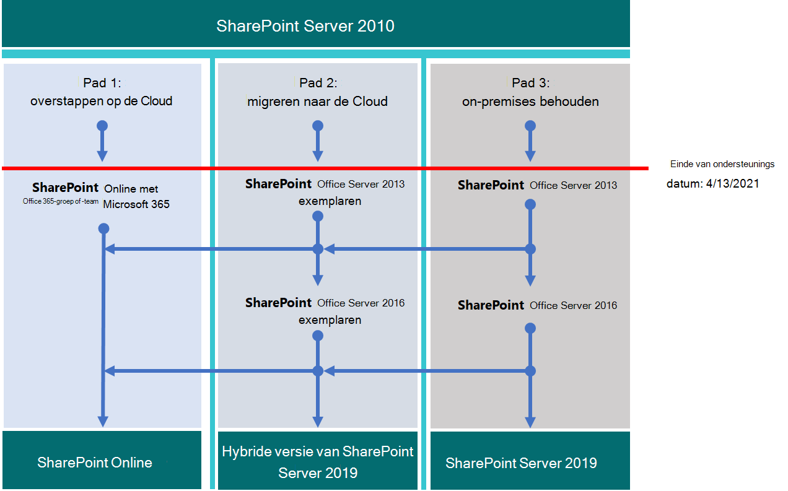

# Een upgrade uitvoeren van SharePoint 2010

*Dit artikel is van toepassing op Microsoft 365 Enterprise en Office 365 Enterprise.*

Microsoft SharePoint 2010 en SharePoint Server 2010 wordt beëindigd met de ondersteuning op **13 April 2021**. In dit artikel vindt u informatie over bronnen voor het migreren van uw bestaande SharePoint Server 2010-gegevens naar SharePoint Online in Microsoft 365 of voert u een upgrade uit naar uw on-premises SharePoint Server 2010-omgeving.
  
## Wat is het einde van de ondersteuning?

Wanneer de software van SharePoint Server 2010 en SharePoint Foundation 2010 het einde van de ondersteuningscyclus bereikt (de tijd waarop Microsoft nieuwe functies biedt, oplossingen voor beveiligingsfixes, beveiligingsoplossingen, enzovoort), wordt dit de software ' einde van ondersteuning ' genoemd, of soms is het ' buiten gebruik '. Wanneer het einde van de ondersteuning (of EOS) van een product gaat, wordt er niets in de praktijk beëindigd maar aan het einde van de ondersteuning van software biedt Microsoft niet langer:
  
- Technische ondersteuning voor problemen die kunnen optreden;
    
- Oplossingen voor ontdekte problemen die gevolgen kunnen hebben voor de stabiliteit en bruikbaarheid van de server;
    
- Beveiligingscorrecties voor ontdekte beveiligingsproblemen die de server kwetsbaar kunnen maken voor beveiligingsproblemen.
    
- Tijdzone-updates.
    
Dat betekent dat er geen updates, patches of fixes worden verzonden voor het product (waaronder beveiligingspatches/fixes), en de ondersteuning van Microsoft voor de ondersteuning van de ondersteuning voor meer recente versies. Als het einde van de ondersteuning van SharePoint Server 2010, kunt u het beste gebruikmaken van verkoopkansen om gegevens te wissen die u niet meer nodig hebt voordat u een upgrade van het product uitvoert, en/of uw belangrijke gegevens te migreren.
  
> [!NOTE]
> Een software levenscyclus duurt doorgaans tien jaar vanaf de datum van de eerste versie van het product. U kunt zoeken naar [leveranciers van Microsoft-oplossingen](https://go.microsoft.com/fwlink/?linkid=841249) die u kunnen helpen bij het upgraden naar de volgende versie van de software, of met microsoft 365-migratie (of beide). Houd er rekening mee dat u de datum van de ondersteunings datum op de kritieke technologieën en vooral van de versie van SQL Server die u met SharePoint gebruikt, weet. Meer [informatie over de](https://support.microsoft.com/help/14085) levenscyclus van producten in detail.
  
## Wat zijn mijn mogelijkheden?

Ga eerst naar de datum waarop de ondersteuning eindigt op de [product levenscyclus site](https://support.microsoft.com/lifecycle/search?alpha=SharePoint%20Server%202010). Zorg er vervolgens voor dat u de upgrade of migratie tijd plant met kennis van deze datum. Houd er rekening mee dat uw product  *niet stopt*  op de vermelde datum en u kunt doorgaan met het gebruik ervan, maar dit is een strategie waarmee u een betere overgang van de volgende versie van het product kunt versoepeld maken. 
  
In deze matrix kunt u een cursus uitzetten wanneer u de productfuncties en gebruikersgegevens gaat migreren:
  
| Einde van ondersteunings product | Uitstekend | Doen |
|:-----|:-----|:-----|
|SharePoint Server 2010    |SharePoint Server 2013 (on-premises)    |SharePoint Online    |
||SharePoint Server 2013 Hybrid met SharePoint Online    |SharePoint Server 2016 (on-premises)    |
| | |Hybride zoeken voor de SharePoint-Cloud    |
   
Als u opties aan het lage einde van de schaal wilt kiezen (goede opties), moet u eerst plannen voor een nieuwe upgrade voordat u de migratie van SharePoint Server 2010 voltooid. 

Dit zijn de drie paden die u kunt nemen om te voorkomen dat de ondersteuning van SharePoint Server 2010 wordt beëindigd.

>[!Note]
>Einde van de ondersteuning voor SharePoint Server 2010 en SharePoint Foundation 2010 is gepland voor 13 april 2021 *, maar u moet altijd* de [product levenscyclus site](https://support.microsoft.com/lifecycle) voor de meest recente datum controleren.
>

  
## Waar moet ik volgende stap gaan?

SharePoint Server 2013 en SharePoint Foundation 2013 kunnen on-premises worden geïnstalleerd op uw eigen servers. Anders kunt u SharePoint Online gebruiken, een online service die onderdeel is van Microsoft 365. U kunt kiezen voor:
  
- Migreren naar SharePoint Online
    
- On-premises upgrade van SharePoint Server of SharePoint Foundation
    
- Beide hierboven
    
- Een [hybride SharePoint-](https://docs.microsoft.com/sharepoint/hybrid/hybrid) oplossing implementeren 
    
Let op de kosten die zijn gekoppeld aan het onderhoud van een serverfarm, het doorsturen, onderhouden of migreren van aanpassingen, en upgraden van de hardware waarvan SharePoint Server afhankelijk is. Als u er zeker van bent dat u dit al dan niet kent, is het eenvoudiger om verder te gaan met het upgraden van de on-premises versie. Als u de farm uitvoert op oudere SharePoint-servers zonder een zware aanpassing, kunt u gebruikmaken van een geplande migratie naar SharePoint Online. Het is ook mogelijk dat u voor uw on-premises SharePoint Server-omgeving bepaalde gegevens wilt opnemen in SharePoint Online, zodat u de hoeveelheid hardware-Management kunt verlagen waarmee al uw gegevens on-premises worden gebruikt. Het kan rendabeler zijn om bepaalde gegevens te verplaatsen naar SharePoint Online.
  
> [!NOTE]
> SharePoint-beheerders kunnen een abonnement op Microsoft 365 maken, een nieuwe SharePoint Online-site instellen en vervolgens van SharePoint Server 2010 wissen en de nieuwste documenten met de nieuwe SharePoint Online-sites wissen. Vervolgens kunnen de resterende gegevens van de SharePoint Server 2010-site worden verwaterd in on-premises archieven. 
  
|**SharePoint Online**|**SharePoint Server on-premises**|
|:-----|:-----|
|Hoge kosten voor tijd (planning/uitvoering/verificatie)    |Hoge kosten voor tijd (planning/uitvoering/verificatie)    |
|Lagere kosten voor financiële middelen (geen hardware aankopen)    |Hogere kosten in fondsen (hardware aankopen)    |
|Eenmalige kosten in migratie    |Eenmalige kosten die worden herhaald per toekomstige migratie    |
|Lage totale eigendomskosten/onderhoud    |Grote totale eigendomskosten/onderhoud    |
   
Wanneer u migreert naar Microsoft 365, heeft de eenmalige verplaatsing een dikker bedrag voor de tijd die is besteed aan de planning, de voorkant (terwijl u gegevens organiseert en opgeeft wat u naar de Cloud moet doen en wat u achter elkaar wilt plaatsen). Wanneer uw gegevens zijn gemigreerd, worden de upgrades echter automatisch vanaf dat punt weergegeven, omdat u niet langer de hardware-en software-updates hoeft te beheren en de meest recente versie van uw farm wordt ondersteund door een micro[soft-service](https://go.microsoft.com/fwlink/?linkid=843153)overeenkomst.
  
### Migreren naar SharePoint Online

Zorg ervoor dat SharePoint Online alle functies biedt die u nodig hebt door de [servicebeschrijving](https://docs.microsoft.com/office365/servicedescriptions/sharepoint-online-service-description/sharepoint-online-service-description)te bekijken.
  
Er is op dit moment geen middelen waarmee u rechtstreeks kunt migreren van SharePoint Server 2010 (of SharePoint Foundation 2010) naar SharePoint Online, zodat veel van het werk handmatig is. Hiermee kunt u gegevens en sites die niet meer nodig zijn, archiveren en weghalen, voorafgaand aan de verhuizing. U kunt andere gegevens in de opslag archivering. Houd er rekening mee dat niet alle SharePoint-Server 2010 en SharePoint Foundation 2010 meer aan het einde van de ondersteuning werken, zodat beheerders een periode kunnen hebben waarop SharePoint nog steeds wordt uitgevoerd als hun klanten vergeten zijn sommige gegevens te verplaatsen.
  
Als u een upgrade uitvoert naar SharePoint Server 2013 of SharePoint Server 2016 en ervoor kiest om gegevens op te slaan in SharePoint Online, kan de overstap ook gebruikmaken van de [SharePoint MIGRATION API](https://support.office.com/article/Upload-on-premises-content-to-SharePoint-Online-using-PowerShell-cmdlets-555049c6-15ef-45a6-9a1f-a1ef673b867c?ui=en-US&amp;rs=en-US&amp;ad=US) (voor het migreren van gegevens naar OneDrive voor bedrijven). 
  
|**SharePoint Online-voordeel**|**Nadeel voor SharePoint Online**|
|:-----|:-----|
|Microsoft levert SPO-hardware en al het beheer van de hardware.    |De beschikbare functies kunnen verschillen van SharePoint Server on-premises en SPO.    |
|U bent de globale beheerder van uw abonnement en u kunt beheerders aan SPO-sites toewijzen.    |Sommige acties die voor een farm beheerder in SharePoint Server on-premises beschikbaar zijn, bestaan niet (of zijn niet nodig) in de SharePoint-beheerdersrol in Microsoft 365, maar SharePoint-beheer, beheer van de siteverzameling en site eigendom zijn lokale voor uw organisatie.    |
|Patches, oplossingen en updates in onderliggende hardware en software worden door Microsoft toegepast, waaronder SQL-servers waarop SharePoint Online wordt uitgevoerd.    |Aangezien er geen toegang is tot het onderliggende bestandssysteem in de service, worden sommige aanpassingen beperkt.    |
|Microsoft publiceert [Service Level Agreements](https://go.microsoft.com/fwlink/?linkid=843153) en zet snel de serviceniveau.    |Back-up-en herstelopties en andere opties voor herstellen worden automatisch door de service in SharePoint Online-back-ups overschreven, indien niet gebruikt.    |
|Het testen van de beveiliging en het afstemmen van de serverprestaties worden in de service doorlopend uitgevoerd door Microsoft.    |Wijzigingen in de gebruikersinterface en andere SharePoint-functies worden geïnstalleerd door de service en moeten mogelijk worden in-of uitgeschakeld.    |
|Microsoft 365 voldoet aan een groot aantal industriestandaarden: [Microsoft compliance-aanbiedingen](https://go.microsoft.com/fwlink/?linkid=843165).    |[FastTrack](https://go.microsoft.com/fwlink/?linkid=518597) hulp voor migratie is beperkt.    Veel van de upgrade is handmatig, of via de SPO-migratie-API, beschreven in de [SharePoint Online-en OneDrive Migration content-routekaart](https://go.microsoft.com/fwlink/?linkid=843184).    |
|Microsoft-ondersteuningsmedewerkers en werknemers in het datacenter hebben geen beperkte beheerderstoegang tot uw abonnement.    |Er kunnen extra kosten zijn als de hardware-infrastructuur moet worden bijgewerkt voor de ondersteuning van de nieuwere versie van SharePoint, of als een secundaire Farm is vereist voor de upgrade.    |
|Solution Providers kunnen helpen met de eenmalige taak van het migreren van uw gegevens naar SharePoint Online.    |Niet alle wijzigingen in SharePoint Online zijn binnen uw besturingselement. Na de migratie kunnen ontwerp verschillen in menu's, Bibliotheken en andere functies tijdelijk van invloed zijn op de bruikbaarheid.    |
|Online producten worden automatisch bijgewerkt in de service, wat betekent dat hoewel de functies die kunnen worden teruggegeven, geen echt ondersteunings levensduur oplevert.    |Er is een einde van de ondersteunings levensduur voor SharePoint Server (of SharePoint Foundation) en onderliggende SQL servers.    |
   
Als u hebt besloten een nieuwe Microsoft 365-site te maken en deze zo nodig handmatig te migreren, kunt u de [Opties van Microsoft 365](https://www.microsoft.com/microsoft-365/)bekijken.
  

  
### SharePoint Server on-premises upgraden

Als van de nieuwste versie van het on-premises product van SharePoint (SharePoint Server 2019), moet upgrades van SharePoint Server worden  *geserialiseerd*, wat betekent dat er geen manier is om een upgrade van SharePoint Server 2010 naar SharePoint Server 2016 of naar sharepoint 2019 rechtstreeks uit te voeren. 
  
Serieel upgrade traject: 

- SharePoint Server 2010 \> SharePoint server 2013 \> SharePoint Server 2016
   
Als u ervoor kiest om het volledige pad van SharePoint 2010 naar SharePoint Server 2016 te volgen, wordt dit tijd en gepland. Voor de upgrades zijn kosten in rekening gebracht met de bijgewerkte hardware (Houd er rekening mee dat SQL-servers ook moeten worden geüpgraded), software en beheer. Het kan ook zijn dat aanpassingen moeten worden bijgewerkt of zelfs moeten worden afgebroken. Zorg ervoor dat u notities verzamelt over al uw kritieke aanpassingen voordat u de SharePoint-server farm bijwerkt.
  
> [!NOTE]
> Het is mogelijk om de einde van de ondersteuning van SharePoint 2010 Farm te behouden, een SharePoint Server 2016-Farm te installeren op nieuwe hardware (zodat de afzonderlijke Farms tegelijkertijd worden uitgevoerd) en vervolgens een handmatige migratie van inhoud plannen en uitvoeren (bijvoorbeeld om inhoud te downloaden en opnieuw te uploaden). Deze handmatige verplaatsingen zijn mogelijk voor deze handmatige verplaatsingen (zoals documenten die beschikbaar zijn op 2010 met het huidige laatst gewijzigde account met de alias van het account dat het handmatig verstuurt), en een taak moet eerder plaatsvinden (het opnieuw maken van sites, subsites, machtigingen en lijst structuren). Het is een goed idee om te overwegen welke gegevens u in de opslagruimte kunt zetten of niet langer nodig hebt. Dit kan de gevolgen van de migratie verminderen. Maak de omgeving van beide gevallen schoon voordat u de upgrade uitvoert. Voordat u een upgrade uitvoert, moet u ervoor zorgen dat uw bestaande farm functioneel is voordat u de upgrade uitvoert. 
  
Vergeet niet de **ondersteunde en niet-ondersteunde upgradepaden**te controleren: 
  
- [SharePoint Server 2010](https://go.microsoft.com/fwlink/?linkid=843156)
    
- [SharePoint Server 2013](https://go.microsoft.com/fwlink/?linkid=843157)
    
Als u **aanpassingen**hebt, is het essentieel dat u voor elke stap in het migratieplan een plan voor de upgrade hebt: 
  
- [SharePoint Server 2010](https://go.microsoft.com/fwlink/?linkid=843160)
    
- [SharePoint Server 2013](https://go.microsoft.com/fwlink/?linkid=843162)
    
|**On-premises voordeel**|**Nadeel van on-premises**|
|:-----|:-----|
|Volledig beheer van alle aspecten van uw SharePoint-farm (en de SQL) van de server.    |Alle onderbrekingen en fixes vormen de verantwoordelijkheid van uw bedrijf (maar u kunt de ondersteuning van Microsoft bellen als uw product niet wordt beëindigd):    |
|Volledige functieset van SharePoint Server on-premises met de mogelijkheid om via hybride verbinding te maken tussen uw on-premises Farm en een SharePoint Online-abonnement.    |Upgrade, patches, beveiligingsoplossingen, hardware-upgrades en onderhoud van SharePoint Server en de SQL-Farm van de SQL-farm worden on-premises beheerd.    |
|Volledige toegang voor betere aanpassingsopties dan met SharePoint Online.    |[Microsoft compliance-aanbiedingen](https://go.microsoft.com/fwlink/?linkid=843165) moeten handmatig on-premises worden geconfigureerd.    |
|Het testen van de beveiliging en het afstemmen van de serverprestaties, die worden uitgevoerd op uw locatie (onder uw besturingselement).    |In Microsoft 365 kunnen functies voor SharePoint Online beschikbaar worden gemaakt die niet compatibel zijn met SharePoint Server on-premises    |
|Solution Providers kunnen helpen met het migreren van gegevens naar de volgende versie van SharePoint Server (en daarbuiten).    |Op uw SharePoint Server-sites worden niet automatisch [SSL/TLS-](https://go.microsoft.com/fwlink/?linkid=843167) certificaten gebruikt zoals deze worden weergegeven in SharePoint Online.    |
|Volledig beheer van de naamgevingsconventies, back-up en herstel, en andere herstelopties in SharePoint Server on-premises.    |SharePoint Server on-premises is gevoelig voor product levenscyclus.    |
   
### Bronnen voor upgraden

Begin met het vergelijken van hardware-en softwarevereisten. Als u niet voldoet aan de basisvereisten voor de upgrade van de huidige hardware, moet u de hardware eerst upgraden in de farm of SQL servers, of wilt u een deel van de sites naar de hardware met de ' groen '-hardware van SharePoint Online verplaatsen. Wanneer u de beoordeling hebt uitgevoerd, kunt u de ondersteunde upgradepaden en-methoden volgen.
  
- **Hardware-en softwarevereisten voor**: 
    
    [SharePoint Server 2010](https://go.microsoft.com/fwlink/?linkid=843204)  |  [SharePoint Server 2013](https://go.microsoft.com/fwlink/?linkid=843206)  |  [SharePoint Server 2016](https://go.microsoft.com/fwlink/?linkid=843207)
    
- **Software grenzen en-limieten voor**: 
    
    [SharePoint Server 2010](https://go.microsoft.com/fwlink/?linkid=843247)  |  [SharePoint Server 2013](https://go.microsoft.com/fwlink/?linkid=843248)  |  [SharePoint Server 2016](https://go.microsoft.com/fwlink/?linkid=843249)
    
- **Overzicht van het upgradeproces voor**: 
    
    [SharePoint Server 2010](https://go.microsoft.com/fwlink/?linkid=843251)  |  [SharePoint Server 2013](https://go.microsoft.com/fwlink/?linkid=843252)  |  [SharePoint Server 2016](https://go.microsoft.com/fwlink/?linkid=843359)
    
### Een hybride SharePoint-oplossing maken tussen on-premises SharePoint Online en SharePoint Server

U kunt ook een hybride versie van SharePoint Server 2013 of 2016 of 2019 met SharePoint Online verbinden met SharePoint Online voor het maken van een hybride SharePoint- [oplossing: meer informatie over hybride share](https://support.office.com/article/4c89a95a-a58c-4fc1-974a-389d4f195383.aspx)Point-oplossingen.
  
Als u besluit een hybride SharePoint-server farm uw migratie doelstelling te plannen, moet u eerst plannen welke sites en gebruikers u online moet zetten en welke on-premises moeten blijven staan. Een beoordeling en rang van de inhoud van de SharePoint server-farm (bepalen welke gegevens hoog, normaal of laag van invloed zijn op uw bedrijf) is handig om deze beslissing te nemen. Het kan zijn dat u wilt delen met SharePoint Online (a) gebruikersaccounts om u aan te melden, en (b) de SharePoint Server Search-index, en dat is mogelijk niet van toepassing op de manier waarop uw sites worden gebruikt. Als uw bedrijf later besluit om al uw inhoud te migreren naar SharePoint Online, kunt u alle resterende accounts en gegevens online verplaatsen en uw on-premises farm buiten gebruik stellen, en het beheer/beheer van de SharePoint-farm wordt uitgevoerd via Microsoft 365-consoles van dat punt.
  
Zorg ervoor dat u vertrouwd bent met de bestaande hybride typen en hoe u de verbinding configureert tussen de lokale SharePoint-farm en uw abonnement op Microsoft 365.

| Optie | Beschrijving |
|:-----|:-----|
|[Microsoft compliance-aanbiedingen](https://go.microsoft.com/fwlink/?linkid=843165).    |[FastTrack](https://www.microsoft.com/fasttrack/microsoft-365) hulp voor migratie is beperkt.    Veel van de upgrade is handmatig, of via de SPO-migratie-API, beschreven in de [SharePoint Online-en OneDrive Migration content-routekaart](https://go.microsoft.com/fwlink/?linkid=843184).    |
|Microsoft-ondersteuningsmedewerkers en werknemers in het datacenter hebben geen beperkte beheerderstoegang tot uw abonnement.    |Er kunnen extra kosten zijn als de hardware-infrastructuur moet worden bijgewerkt voor de ondersteuning van de nieuwere versie van SharePoint, of als een secundaire Farm is vereist voor de upgrade.    |
|Partners kunnen helpen met de eenmalige taak van het migreren van uw gegevens naar SharePoint Online.    ||
|Online producten worden automatisch bijgewerkt in de service, wat betekent dat hoewel de functies die kunnen worden teruggegeven, geen enkel einde van de ondersteuning biedt.    ||
   
Als u hebt besloten een nieuwe Microsoft 365-site te maken en deze zo nodig handmatig te migreren, kunt u de [Opties van Microsoft 365](https://www.microsoft.com/microsoft-365/)bekijken.
  
### SharePoint Server on-premises upgraden

Er is historisch geen enkele manier om versies van SharePoint-upgrades over te slaan, ten minste niet vanaf de release van SharePoint Server 2016. Dit betekent dat als upgrades serieel gaat:
  
- SharePoint 2007 \> SharePoint server 2010 \> SharePoint Server 2013 \> sharepoint server 2016
   
U kunt als volgt het volledige pad van SharePoint 2007 naar SharePoint Server 2016 verduidelijken, zodat er sprake is van een aanzienlijke investering in de loop van de tijd. Aanpassingen moeten worden bijgewerkt of gestaakt, op basis van de ernst van de functie.
  
> [!NOTE]
> Het is mogelijk om de einde-van de SharePoint-versie van SharePoint 2007 te behouden, een SharePoint Server 2016-Farm te installeren op nieuwe hardware (zodat de afzonderlijke Farms gelijktijdig worden weergegeven) en vervolgens een handmatige migratie van inhoud plannen en uitvoeren (bijvoorbeeld om de inhoud te downloaden en opnieuw te uploaden). Let op een deel van de weetjes van handmatige verhuizingen (zoals het verplaatsen van documenten die het laatst gewijzigd account vervangen door de alias van het account dat het handmatig verplaatst) en het werk dat vóór de tijd moet worden uitgevoerd (zoals het opnieuw maken van sites, subsites, machtigingen en lijst structuren). Nogmaals, dit is de tijd die u kunt nemen om te bepalen welke gegevens u kunt overzetten naar de opslagruimte of niet langer, een actie waarmee de gevolgen van de migratie kunnen worden verminderd.
  
Maak de omgeving van beide gevallen schoon voordat u de upgrade uitvoert. Voordat u een upgrade uitvoert, moet u ervoor zorgen dat uw bestaande farm functioneel is voordat u de upgrade uitvoert. 
  
Vergeet niet de **ondersteunde en niet-ondersteunde upgradepaden**te controleren: 
  
- [SharePoint Server 2007](https://go.microsoft.com/fwlink/?linkid=843156)
    
- [SharePoint Server 2010](https://go.microsoft.com/fwlink/?linkid=843156)
    
- [SharePoint Server 2013](https://go.microsoft.com/fwlink/?linkid=843157)
    
Als u **aanpassingen**hebt, is het essentieel dat u voor elke stap in het migratieplan een plan voor de upgrade hebt: 
  
- [SharePoint 2007](https://go.microsoft.com/fwlink/?linkid=843158)
    
- [SharePoint Server 2010](https://go.microsoft.com/fwlink/?linkid=843160)
    
- [SharePoint Server 2013](https://go.microsoft.com/fwlink/?linkid=843162)
    
|**On-premises Pro**|**On-premises con**|
|:-----|:-----|
|Volledig beheer van alle aspecten van uw SharePoint-farm, vanaf de serverhardware.    |Alle onderbrekingen en fixes zijn de verantwoordelijkheid van uw bedrijf (de ondersteuning van Microsoft betaalde Microsoft-ondersteuning als uw product niet aan het einde van de ondersteuning valt):    |
|Volledige functieset van SharePoint Server on-premises met de mogelijkheid om via hybride verbinding te maken tussen uw on-premises Farm en een SharePoint Online-abonnement.    |Upgrades, patches, beveiligingsoplossingen en alles onderhoud van SharePoint Server worden on-premises beheerd.    |
|Volledige toegang voor betere aanpassingen.    |[Microsoft compliance-aanbiedingen](https://go.microsoft.com/fwlink/?linkid=843165) moeten handmatig on-premises worden geconfigureerd.    |
|Het testen van de beveiliging en het afstemmen van de serverprestaties, die worden uitgevoerd op uw locatie (onder uw besturingselement).    |In Microsoft 365 kunnen functies voor SharePoint Online beschikbaar worden gemaakt die niet compatibel zijn met SharePoint Server on-premises    |
|Partners kunnen helpen met het migreren van gegevens naar de volgende versie van SharePoint Server (en daarbuiten).    |Op uw SharePoint Server-sites worden niet automatisch [SSL/TLS-](https://go.microsoft.com/fwlink/?linkid=843167) certificaten gebruikt zoals deze worden weergegeven in SharePoint Online.    |
|Volledig beheer van de naamgevingsconventies, back-up en herstel, en andere herstelopties in SharePoint Server on-premises.    |SharePoint Server on-premises is gevoelig voor productlevenscyclus.    |
   
### Bronnen voor upgraden

U moet eerst weten dat u aan de hardware-en softwarevereisten voldoet en vervolgens de ondersteunde upgrademethoden kunt volgen.
  
- **Hardware-en softwarevereisten voor**: 
    
    [SharePoint Server 2010](https://go.microsoft.com/fwlink/?linkid=843204)  |  [SharePoint Server 2010](https://go.microsoft.com/fwlink/?linkid=843204)  |  [SharePoint Server 2013](https://go.microsoft.com/fwlink/?linkid=843206)  |  [SharePoint Server 2016](https://go.microsoft.com/fwlink/?linkid=843207)
    
- **Software grenzen en-limieten voor**: 
    
    [SharePoint Server 2007](https://go.microsoft.com/fwlink/?linkid=843245)  |  [SharePoint Server 2010](https://go.microsoft.com/fwlink/?linkid=843247)  |  [SharePoint Server 2013](https://go.microsoft.com/fwlink/?linkid=843248)  |  [SharePoint Server 2016](https://go.microsoft.com/fwlink/?linkid=843249)
    
- **Overzicht van het upgradeproces voor**: 
    
    [SharePoint Server 2007](https://go.microsoft.com/fwlink/?linkid=843250)  |  [SharePoint Server 2010](https://go.microsoft.com/fwlink/?linkid=843251)  |  [SharePoint Server 2013](https://go.microsoft.com/fwlink/?linkid=843252)  |  [SharePoint Server 2016](https://go.microsoft.com/fwlink/?linkid=843359)
    
### Een hybride SharePoint-oplossing maken tussen SharePoint Online en on-premises

Als het antwoord op uw migratie behoefte zich bevindt tussen het zelf bestuur dat wordt aangeboden via on-premises, en de lagere eigendomskosten van SharePoint Online kunt u met SharePoint Server 2013 of 2016 Farms met SharePoint Online, via hybride verbindingen, verbinden met SharePoint Online. [Meer informatie over hybride SharePoint-oplossingen](https://support.office.com/article/4c89a95a-a58c-4fc1-974a-389d4f195383.aspx)
  
Als u besluit dat een hybride SharePoint-server farm uw bedrijf zal voorstellen, kunt u vertrouwd raken met de bestaande typen Hybrid en hoe u de verbinding configureert tussen uw on-premises SharePoint-farm en uw Microsoft 365-abonnement.
  
Een goede manier om te zien hoe dit werkt is door een Microsoft 365-omgeving voor ontwikkelaars/testen te maken, die u kunt instellen met [test lab-handleidingen](m365-enterprise-test-lab-guides.md). Wanneer u een proefabonnement hebt aangeschaft of Microsoft 365 hebt aangeschaft, kunt u de siteverzamelingen, webs en documentbibliotheken maken in SharePoint Online, waar u gegevens kunt migreren (handmatig, met behulp van de migratie-API, of-als u mijn site-inhoud wilt migreren naar OneDrive voor bedrijven – via de Hybrid wizard).
  
> [!NOTE]
> Als u de hybride optie wilt gebruiken, moet u eerst een upgrade van SharePoint Server 2010-Farm uitvoeren naar SharePoint Server 2013 of SharePoint Server 2016. SharePoint Foundation 2010 en SharePoint Foundation 2013 kan geen hybride verbindingen maken met SharePoint Online. 

## Overzicht van opties voor Office 2010-client en-servers en Windows 7

Voor een visueel overzicht van de opties voor de upgrade, migratie en verplaatsen van een upgrade, migratie en migratie van Office 2010-clients en-servers en Windows 7, raadpleegt u het [einde van de ondersteunings poster](../downloads/Office2010Windows7EndOfSupport.pdf).

Deze poster van één pagina is een snelle manier om inzicht te krijgen in de verschillende paden die u kunt nemen om te voorkomen dat Office 2010-client-en Server producten en Windows 7 niet meer worden ondersteund, met voorkeurs paden en optie ondersteuning in Microsoft 365 Enterprise gemarkeerd.

U kunt deze poster ook [downloaden](https://github.com/MicrosoftDocs/microsoft-365-docs/raw/public/microsoft-365/media/migration-microsoft-365-enterprise-workload/Office2010Windows7EndOfSupport.pdf) en afdrukken in de indelingen letter, Legal en tabloid (11 x 17 inch).
        
## Verwante onderwerpen

[Bronnen om u te helpen bij het upgraden van Office 2007 of 2010-servers en-clients](upgrade-from-office-2010-servers-and-products.md)
  
[Overzicht van het upgradeproces van SharePoint 2010 naar SharePoint 2013](https://technet.microsoft.com/library/mt493301%28v=office.16%29.aspx)
  
[Aanbevolen procedures voor het uitvoeren van een upgrade van SharePoint 2010 naar SharePoint 2013](https://technet.microsoft.com/library/mt493305%28v=office.16%29.aspx)
  
[Problemen met het upgraden van een database in SharePoint 2013](https://go.microsoft.com/fwlink/?linkid=843195)
  
[Zoek naar Microsoft Solution Providers om u te helpen bij de upgrade](https://go.microsoft.com/fwlink/?linkid=841249)
  
[Bijgewerkt product onderhoudsbeleid voor SharePoint 2013](https://technet.microsoft.com/library/mt493253%28v=office.16%29.aspx)
  
[Bijgewerkt product onderhoudsbeleid voor SharePoint Server 2016](https://technet.microsoft.com/library/mt782882%28v=office.16%29.aspx)
  

