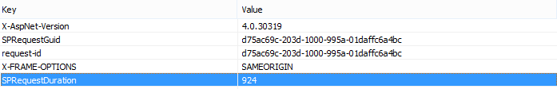
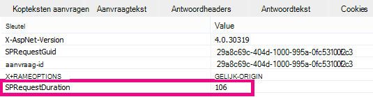

# Webonderdeel Inhoud zoeken gebruiken in plaats van webonderdeel Inhoudsquery om de prestaties in SharePoint Online

In dit artikel wordt beschreven hoe u de prestaties kunt verbeteren door het webonderdeel Inhoudsquery te vervangen door het webonderdeel Inhoud zoeken in SharePoint Server 2013 en SharePoint Online.
  
Een van de krachtigste nieuwe functies van SharePoint Server 2013 en SharePoint Online is het webonderdeel Inhoud zoeken (WEBWP). In dit webonderdeel wordt de zoekindex gebruikt om snel resultaten op te halen die aan de gebruiker worden weergegeven. Gebruik het webonderdeel Inhoud zoeken in plaats van het webonderdeel Inhoudsquery (CQWP) op uw pagina's om de prestaties voor uw gebruikers te verbeteren.
  
Als u een webonderdeel Inhoud zoeken gebruikt via een webonderdeel Inhoudsquery, resulteert dit bijna altijd in aanzienlijk betere laadprestaties voor pagina's op SharePoint Online. Er is een beetje extra configuratie om de juiste query te krijgen, maar de voordelen zijn verbeterde prestaties en gelukkiger gebruikers.
  
## De prestaties van het webonderdeel Inhoud zoeken vergelijken in plaats van webonderdeel Inhoudsquery

In de volgende voorbeelden ziet u de relatieve prestatieverbeteringen die u kunt ontvangen wanneer u een webonderdeel Inhoud zoeken gebruikt in plaats van een webonderdeel Inhoudsquery. De effecten zijn duidelijker met een complexe sitestructuur en zeer brede inhoudsquery's.
  
Deze voorbeeldsite heeft de volgende kenmerken:
  
- 8 niveaus met subsites.
    
- Lijsten met een aangepast inhoudstype 'fruit'.
    
- In het webonderdeel is de inhoudsquery breed en worden alle items met het inhoudstype 'fruit' als resultaat gebruikt.
    
- In het voorbeeld worden slechts 50 items op de 8 sites gebruikt. De effecten zijn nog duidelijker voor sites met meer inhoud.
    
Hier ziet u een schermafbeelding van de resultaten van het webonderdeel Inhoudsquery.
  

  
Gebruik in Internet Explorer het **tabblad Netwerk** van de hulpprogramma's voor F12-ontwikkelaars om de details van de antwoordkop te bekijken. In de volgende schermafbeelding is de waarde voor **de SPRequestDuration** voor deze paginabelasting 924 milliseconden. 
  

  
 **SPRequestDuration** geeft de hoeveelheid werk aan die op de server wordt uitgevoerd om de pagina voor te bereiden. Als u van inhoud op query wisselt Webonderdelen inhoud op zoekfunctie, Webonderdelen de tijd die nodig is om de pagina weer te geven aanzienlijk. Een pagina met een vergelijkbaar webonderdeel Inhoud zoeken, die hetzelfde aantal resultaten retourneert, heeft daarentegen een **SPRequestDuration-waarde** van 106 milliseconden, zoals wordt weergegeven in deze schermafbeelding: 
  

  
## Een webonderdeel Inhoud zoeken toevoegen in SharePoint Online

Het toevoegen van een webonderdeel Inhoud zoeken lijkt sterk op een gewoon webonderdeel Inhoudsquery. Zie de sectie *'Een webonderdeel* Inhoud zoeken toevoegen' in Een webonderdeel Inhoud zoeken [configureren in SharePoint.](https://support.office.com/article/Configure-a-Content-Search-Web-Part-in-SharePoint-0dc16de1-dbe4-462b-babb-bf8338c36c9a)
  
## De juiste zoekquery maken voor het webonderdeel Inhoud zoeken

Nadat u een webonderdeel Inhoud zoeken hebt toegevoegd, kunt u de zoekopdracht verfijnen en de gezochte items retourneren. Zie de sectie 'Inhoud weergeven door een geavanceerde *query in* een webonderdeel Inhoud zoeken te configureren' in Een webonderdeel Inhoud zoeken configureren [in](https://support.office.com/article/Configure-a-Content-Search-Web-Part-in-SharePoint-0dc16de1-dbe4-462b-babb-bf8338c36c9a)SharePoint.
  
## Hulpprogramma voor het maken en testen van query's

Zie het hulpprogramma Zoekquery op Codeplex voor een hulpprogramma voor het maken en testen van complexe query's.  
  

