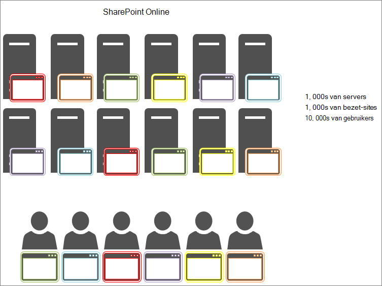

# De objectcache gebruiken met SharePoint Online

In dit artikel wordt het verschil uitgelegd tussen het gebruik van de objectcache in on-premises SharePoint Server 2013 on-premises en SharePoint Online.
  
De objectcache van de SharePoint Online-implementatie bevat aanzienlijke negatieve gevolgen. Afhankelijk van de objectcache in SharePoint Online, wordt de betrouwbaarheid van de pagina verkleind. 
  
## Werking van de objectcache van SharePoint Online en SharePoint Server 2013

Wanneer SharePoint Server 2013 on-premises wordt gehost, heeft de klant persoonlijke front-end webservers die de objectcache host. Dit betekent dat de cache specifiek is voor één klant en beperkt is tot de hoeveelheid geheugen en die aan de objectcache is toegewezen. Aangezien slechts één klant in het on-premises scenario wordt geplaatst, hebben de front-endwebservers meestal gebruikers die aanvragen doen voor dezelfde site. Dit betekent dat de cache volledig snel wordt en de lijst queryresultaten en SharePoint-objecten die uw gebruikers regelmatig aanvragen.
  

  
Daardoor wordt de pagina sneller geladen wanneer een gebruiker een pagina voor het eerst bezoekt. Na minimaal vier geladen pagina's wordt de pagina in de cache opgeslagen op alle front-endwebservers.
  
In SharePoint Online hebt u daarentegen veel meer servers, maar ook veel meer sites. Elke gebruiker kan verbinding maken met een andere front-endwebserver waarvan de cache niet is ingevuld. Of misschien is de cache gevuld voor een server, maar de volgende gebruiker aan die front-endwebserver vraagt een pagina van een andere site. Of zelfs als de volgende gebruiker op dezelfde pagina op het vorige bezoek vraagt, wordt deze in evenwicht gebracht met een andere front-endwebserver die niet over de pagina in de cache beschikt. In dit laatste geval kan de gebruiker de cache niet helpen.
  
In de volgende afbeelding staat elk punt voor een pagina die een gebruiker aanvraagt en waar deze is opgeslagen. Verschillende kleuren vertegenwoordigen verschillende klanten die een gedeeld gebruik van de SaaS-infrastructuur verrichten.
  

  
Zoals u kunt zien in het diagram, kan de kans van een bepaalde gebruiker een server aanwijzen met de in de cache geplaatste versie van de pagina. Ook vanwege de grote doorvoer en feit dat de servers worden gedeeld tussen veel sites, is de cache niet langer lang omdat er slechts voldoende ruimte beschikbaar is voor de beschikbare cache.
  
Voor al deze redenen is het feit dat gebruikers afhankelijk zijn van objecten die in de cache zijn opgeslagen, geen efficiënte manier voor het garanderen van een kwaliteit voor de gebruikerservaring en het laden van pagina's in SharePoint Online.
  
## Wat kunnen we gebruiken in plaats van de objectcache om de prestaties te verbeteren in SharePoint Online?

Aangezien u niet hoeft te vertrouwen met cache in SharePoint Online, moet u alternatieve ontwerp benaderingen voor SharePoint-aanpassingen evalueren die de objectcache gebruiken. Dit houdt in dat u aanpakt voor de prestatieproblemen die niet afhankelijk zijn van de objectcache, zodat u goede resultaten voor gebruikers kunt produceren. Dit wordt beschreven in enkele van de andere artikelen in deze reeks en bevat:
  
- [Navigatieopties voor SharePoint Online](navigation-options-for-sharepoint-online.md)
    
- [Minification en bundeling in SharePoint Online](minification-and-bundling-in-sharepoint-online.md)
    
- [Het Office 365 Content Delivery Network (CDN) gebruiken met SharePoint Online](use-microsoft-365-cdn-with-spo.md)
    
- [Laden van afbeeldingen en JavaScript vertragen in SharePoint Online](delay-loading-images-and-javascript-in-sharepoint-online.md)
    

