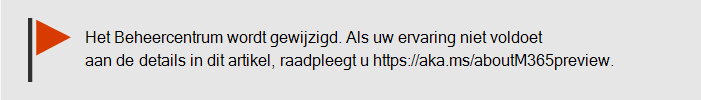
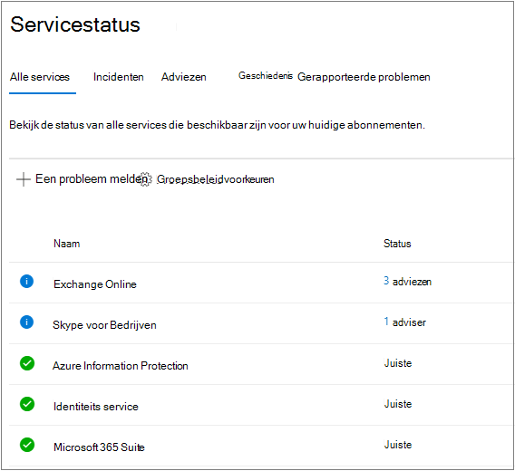
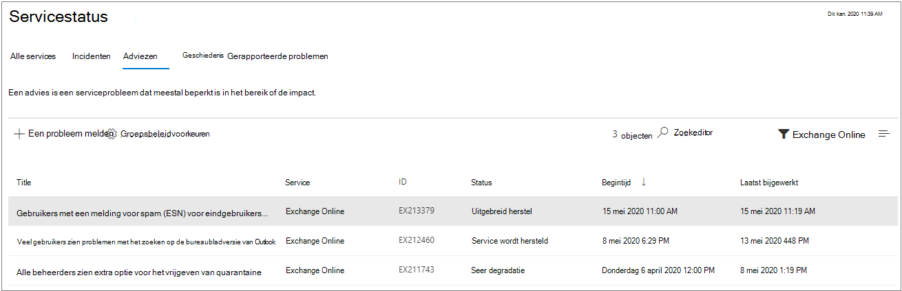
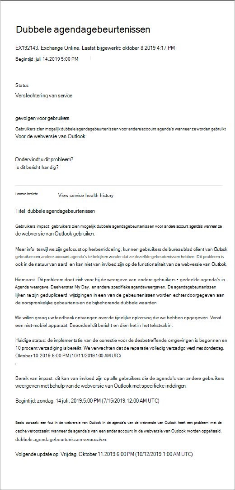

# De service Microsoft 365 controleren

U kunt de status van uw Microsoft-services, waaronder webversie van Office, Yammer, Microsoft Dynamics CRM en cloudservices voor mobiel apparaatbeheer, bekijken op de pagina **Service-status** in [de Microsoft 365-beheercentrum.](https://go.microsoft.com/fwlink/p/?linkid=2024339) Als u problemen ondervindt met een cloudservice, kunt u de service-status controleren om te bepalen of dit een bekend probleem is met een oplossing in uitvoering voordat u de ondersteuning belt of tijd besteedt aan het oplossen van problemen.

Als u zich niet kunt aanmelden bij het beheercentrum, kunt u de [pagina servicestatus](https://status.office365.com) gebruiken om te controleren op bekende problemen waardoor u zich niet kunt aanmelden bij uw tenant.  Meld u ook aan om ons te [volgen @MSFT365status](https://twitter.com/MSFT365Status) op Twitter om informatie over bepaalde gebeurtenissen te zien.

## Servicestatus controleren

1. Ga naar de Microsoft 365-beheercentrum [https://admin.microsoft.com](https://go.microsoft.com/fwlink/p/?linkid=2024339) bij en meld u aan met een beheerdersaccount.

    > [!NOTE]
    > Personen aan wie de rol globale beheerder of serviceondersteuningsbeheerder is toegewezen, kunnen de servicetoestand bekijken. Beheerders van Exchange, SharePoint en Skype voor Bedrijven dient de rol servicebeheerder te zijn toegewezen om de servicestatus te kunnen bekijken. Zie Over beheerdersrollen voor meer informatie over rollen die de status van de service [kunnen weergeven.](../admin/add-users/about-admin-roles.md?preserve-view=true&view=o365-worldwide#commonly-used-microsoft-365-admin-center-roles)

2. Als u de servicetoestand wilt bekijken, gaat u in het beheercentrum naar **Health** Service Health of selecteert u de  >   **service-statuskaart** op het **dashboard Start.** De dashboardkaart geeft aan of er een actief serviceprobleem is en koppelingen naar de gedetailleerde **pagina Service-status.**

3. Op de **pagina Service-status** wordt de status van elke cloudservice weergegeven in een tabelindeling.

   

Op **het tabblad Alle services** (de standaardweergave) worden alle services, de huidige status en eventuele actieve incidenten of adviezen weergegeven. Een pictogram en status in de kolom **Status** geven de status van elke service aan.

Als er een actief incident of advies voor een service is, worden deze rechtstreeks onder de servicenaam weergegeven in een geneste tabel. U kunt de geneste tabel samenvuilen om de incidenten of adviezen in deze weergave te verbergen door te klikken op het punthaakpictogram links van de servicenaam.   

Als u de weergave wilt filteren om alleen alle actieve incidenten weer te geven, selecteert u het tabblad **Incidenten** boven aan de pagina. Als u **het tabblad Adviseurs** selecteert, worden alleen alle actieve adviezen weergegeven die zijn gepost.

Op **het** tabblad Geschiedenis ziet u alle incidenten en adviezen die zijn opgelost in de afgelopen zeven of dertig dagen.

Als u een probleem ondervindt met een Microsoft 365-service en u dit niet ziet op de pagina **Service-status,** laat het ons dan weten door **Een** probleem melden te selecteren en het korte formulier in te vullen. We bekijken gerelateerde gegevens en rapporten van andere organisaties om te zien hoe wijdverspreid het probleem is en of het afkomstig is van onze service. Als dit het wel is gebeurd, voegen we het toe als een nieuw incident of advies op de **pagina Service-status,** waar u de resolutie kunt bijhouden. Op **de pagina Gemelde** problemen worden alle problemen weergegeven die uw tenant heeft gerapporteerd vanuit dit formulier en de status.

Als u de weergave wilt aanpassen van welke services op het dashboard worden weergeven, selecteert u Aangepaste weergave Voorkeuren en schakelt u de selectievakjes uit voor de services die u wilt filteren uit de  >  dashboardweergave Service health. Controleer of het selectievakje is ingeschakeld voor elke service die u wilt controleren.

Als u zich wilt registreren voor e-mailmeldingen van nieuwe incidenten die van invloed zijn op uw tenant en statuswijzigingen voor een actief incident, selecteert u Voorkeuren E-mail, klikt u op Meldingen over service heide verzenden per e-mail en geeft u het volgende  >  op: 

- Maximaal twee e-mailadressen.
- Of u nu meldingen voor incidenten of adviezen wilt
- De services waarvoor u een melding wilt ontvangen

U kunt zich ook abonneren op e-mailmeldingen voor afzonderlijke gebeurtenissen in plaats van op elke gebeurtenis voor een service. Als u dit wilt doen, selecteert u het actieve probleem voor wie u updates voor e-mailmeldingen wilt ontvangen, selecteert u Meldingen beheren voor **dit probleem** en geeft u het volgende op: 
- Maximaal twee e-mailadressen.

> [!NOTE]
> Elke beheerder kan zijn voorkeuren instellen en de bovenstaande limiet van twee e-mailadressen is per beheerdersaccount.

> [!TIP]
> U kunt ook de [Microsoft 365-beheer app](https://go.microsoft.com/fwlink/p/?linkid=627216) op uw mobiele apparaat gebruiken om service-status weer te geven. Dit is een uitstekende manier om op de hoogte te blijven van pushmeldingen.

### Details bekijken van geposte servicestatus

Selecteer in **de weergave** Alle services de titel van het probleem om de pagina met probleemdetails weer te geven, met meer informatie over het probleem, inclusief een feed van alle berichten die zijn gepost terwijl we aan een oplossing werken. 

Het overzicht met het advies of incident bevat de volgende informatie:

- **Titel** - Een overzicht van het probleem.
- **ID** - Een numerieke id voor het probleem.
- **Service:** de naam van de betreffende service.
- **Laatst bijgewerkt:** de laatste keer dat het bericht over de service-status is bijgewerkt.
- **Geschatte begintijd:** de geschatte tijd waarop het probleem is begonnen.
- **Status:** hoe dit probleem van invloed is op de service.
- **Gebruikerseffect:** een korte beschrijving van de gevolgen van dit probleem voor de eindgebruiker.
- **Alle updates:** we plaatsen veelgebruikte berichten om u te laten weten wat de voortgang is bij het toepassen van een oplossing.

### Details servicestatus vertalen

We gebruiken automatische vertaling om berichten automatisch weer te geven in uw gewenste taal. Lees [Taalvertaling voor berichten in het berichtencentrum](/microsoft-365/admin/manage/language-translation-for-message-center-posts) voor meer informatie over het instellen van uw taal.

### Definities

Meestal worden services als gezond weergegeven zonder verdere informatie. Als er een probleem met een status is, wordt het als een advies of een incident geïdentificeerd en wordt de huidige status weergegeven.

> [!TIP]
> In de servicestatus wordt geen gepland onderhoud weergegeven. U kunt gepland onderhoud volgen via het **Berichtencentrum**. U kunt filteren op berichten in de categorie Wijzigingsplanning om erachter te komen wanneer de wijziging plaatsvindt, wat het effect is en hoe u zich erop moet voorbereiden. Zie [Berichtencentrum in Microsoft 365](https://support.office.com/article/38fb3333-bfcc-4340-a37b-deda509c2093) voor meer informatie.

### Incidenten en adviezen

| Pictogram | Omschrijving |
|:-----|:-----|
||Als voor een service een advies wordt getoond, is er een probleem bekend waarvan een aantal gebruikers last heeft, maar de service is nog wel beschikbaar. Een advies biedt meestal een tijdelijke oplossing voor het probleem. Het probleem kan af en toe optreden of het bereik ervan of het aantal getroffen gebruikers is beperkt.    |
||Als voor een service een incident wordt getoond, gaat het om een kritiek probleem en is de service of een belangrijke functie ervan niet beschikbaar. Gebruikers kunnen bijvoorbeeld geen e-mail meer verzenden en ontvangen en kunnen zich niet aanmelden. Incidenten zijn van merkbare invloed op gebruikers. Wanneer er een incident wordt uitgevoerd, bieden we updates over het onderzoek, risicobeperking en bevestiging van de oplossing in het dashboard voor servicestatus.    |

### Statusdefinities

| Status | Definitie |
|:-----|:-----|
|**Onderzoeken** | Wij zijn op de hoogte van een potentieel probleem en verzamelen meer informatie over wat er aan de hand is en wat de mogelijke gevolgen zijn. |
|**Verslechtering van service** | Wij hebben bevestigd dat er een probleem is dat van invloed kan zijn op een service of functie. U krijgt deze status te zien als bijvoorbeeld een service langzamer presteert dan normaal, er onregelmatige onderbrekingen zijn of als een functie niet werkt. |
|**Serviceonderbreking** | U krijgt deze status te zien als is vastgesteld dat gebruikers als gevolg van een probleem de service niet kunnen gebruiken. In dit geval is het probleem aanzienlijk en kan telkens worden gereproduceerd. |
|**Service wordt hersteld** | De oorzaak van het probleem is achterhaald; er is bekend welke herstelactie er moeten worden ondernomen en er wordt aan gewerkt om de service weer in orde te maken. |
|**Uitgebreid herstel** | Deze status geeft aan dat er een herstelactie gaande is om de service voor de meeste gebruikers weer toegankelijk te maken. Het kan enige tijd duren voordat alle getroffen systemen weer in orde zijn. Mogelijk ziet u deze status ook als we een tijdelijke oplossing hebben gemaakt om het effect te beperken totdat we klaar zijn om een permanente oplossing toe te passen. |
|**Onderzoek opgeschort** | Als uitgebreid onderzoek van een mogelijk probleem aanvullende informatie van klanten vereist voor nader onderzoek, krijgt u deze status te zien. Als wij u vragen actie te ondernemen, laten we u weten welke gegevens of logboeken we nodig hebben. |
|**Service hersteld** | Wij hebben bevestigd dat een herstelactie het onderliggende probleem heeft opgelost en dat de service geheel is hersteld. Bekijk de details van het probleem als u wilt weten wat er is misgegaan. |
|**Onwaar positief** | Na een uitgebreid onderzoek hebben we bevestigd dat de service gezond is en volgens de ontwerpstijl werkt. Er is geen invloed op de service waargenomen of de oorzaak van het incident is buiten de service ontstaan. |
|**Rapport na incident gepubliceerd** | We hebben een postincidentrapport gepubliceerd voor een specifiek probleem dat informatie over hoofdoorzaken bevat en de volgende stappen om ervoor te zorgen dat een soortgelijk probleem niet opnieuw wordt veroorzaakt. |

### Berichtposttypen

| Type | Definitie |
|:-----|:-----|
|**Snelle update** | Korte en frequente incrementele updates voor incidenten die een grote impact hebben, beschikbaar voor alle klanten. |
|**Aanvullende details** | Deze extra berichten bieden uitgebreidere technische en oplossingsdetails om meer inzicht te krijgen in de afhandeling van incidenten. Dit is beschikbaar voor tenants die voldoen aan dezelfde vereisten die worden beschreven voor [Exchange Online monitoring](/microsoft-365/enterprise/microsoft-365-exchange-monitoring?view=o365-worldwide#requirements), |

### Geschiedenis

Met servicestatus kunt u uw huidige status bekijken en de geschiedenis bekijken van serviceadviseurs en incidenten die uw tenant in de afgelopen 30 dagen hebben beïnvloed. Als u de status van alle services in het verleden wilt weergeven, **selecteert** u Geschiedenisweergave.

Zie Transparante bewerkingen van Microsoft 365 voor meer informatie over onze inzet [voor uptime.](/office365/servicedescriptions/office-365-platform-service-description/service-health-and-continuity)

## Gerelateerde onderwerpen

[Activiteitenoverzichten in het Microsoft 365-beheercentrum](https://support.office.com/article/0d6dfb17-8582-4172-a9a9-aed798150263)

[Voorkeuren voor berichtencentrum](../admin/manage/message-center.md?preserve-view=true&view=o365-worldwide#preferences)

[De status van Windows in het beheercentrum controleren](/windows/deployment/update/check-release-health)
