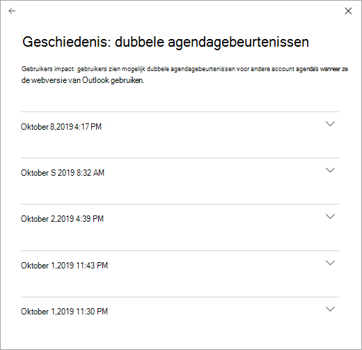

# De servicestatus van Microsoft 365 controleren

U kunt de status van uw Microsoft-services bekijken, waaronder Office op internet, Yammer, Microsoft Dynamics CRM en Mobile Device Management cloudservices, op de pagina **service status** in het [Microsoft 365-Beheercentrum](https://go.microsoft.com/fwlink/p/?linkid=2024339). Als u problemen ondervindt met een cloudservice, kunt u de servicestatus controleren om na te gaan of dit een bekend probleem is met een oplossing die al wordt uitgevoerd voordat u de ondersteuning belt of tijd hebt om problemen op te lossen.

Als u zich niet kunt aanmelden bij de Service Portal, kunt u op de [pagina servicestatus](https://status.office365.com) klikken op bekende problemen die u niet kunt aanmelden bij uw Tenant.
  
### Servicestatus controleren

1. Ga op de site van het Microsoft 365-Beheercentrum [https://admin.microsoft.com](https://go.microsoft.com/fwlink/p/?linkid=2024339) en meld u aan met een beheerdersaccount.

    > [!NOTE]
    > Personen aan wie de rol globale beheerder of servicebeheerder is toegewezen, kunnen de servicestatus bekijken. Beheerders van Exchange, SharePoint en Skype voor Bedrijven dient de rol servicebeheerder te zijn toegewezen om de servicestatus te kunnen bekijken. Zie [informatie over beheerdersrollen](https://docs.microsoft.com/microsoft-365/admin/add-users/about-admin-roles?view=o365-worldwide&preserve-view=true#roles-available-in-the-microsoft-365-admin-center)voor meer informatie over rollen die de servicestatus kunnen weergeven.
  
2. Als u niet werkt met het nieuwe Beheercentrum, selecteert u op de **Start** pagina de wisselknop **het nieuwe Beheercentrum uitproberen** in de rechterbovenhoek.

3. Als u de status van de service wilt weergeven, gaat **u naar**het Beheercentrum en gaat u naar status  >  **servicestatus**of selecteert u de kaart **servicestatus** in het **Dashboard voor thuis**gebruik. De dashboard kaart geeft aan of er een actief serviceprobleem is en dat er koppelingen naar de pagina gedetailleerde **servicestatus** .
  
4. Op de pagina **service status** wordt de status van elke Cloud service weergegeven in een tabelindeling.

   

Op het tabblad **alle services** (de standaardweergave) worden alle services en de huidige status status weergegeven. Met een pictogram en de kolom **status** wordt de status van elke service aangegeven. 

Als u de weergave wilt filteren op Services die momenteel een incident ondervinden, selecteert u het tabblad **incidenten** bovenaan de pagina. Als u het tabblad **adviseurs** selecteert, worden alleen de services getoond waarop momenteel een advies is gepubliceerd. 

Het tabblad **geschiedenis** toont de geschiedenis van incidenten en adviseurs die zijn opgelost.

Als u een probleem hebt met een Microsoft 365-service en dit niet wordt weergegeven op de pagina **servicestatus** , laat het ons weten door **een probleem melden**te selecteren en het korte formulier in te vullen. We bekijken de gerelateerde gegevens en rapporten van andere organisaties om te zien hoe het probleem zich verhoudt en of het van toepassing is op onze service. Als dit het geval is, voegen we het toe als een nieuw incident of advies op de pagina **service status** , waar u de resolutie kunt bijhouden. Als u het probleem niet in de lijst ziet staan, moet u contact opnemen met de ondersteuning om dit probleem op te lossen.

Als u de weergave van de services die u wilt weergeven op **Preferences**het dashboard wilt aanpassen, selecteert u  >  **aangepaste weergave**voorkeuren en schakelt u de selectievakjes uit voor de services die u wilt filteren in de dashboardweergave voor de service status. Zorg ervoor dat het selectievakje is ingeschakeld voor elke service die u wilt controleren.    

Als u zich wilt registreren voor e-mail meldingen van nieuwe incidenten die van invloed zijn op de Tenant en statuswijzigingen voor een actief incident, selecteert u **Voorkeuren**  >  **e-mail**, klikt u op meldingen over de **Servicemelding verzenden in e-mail**en geeft u het volgende op:

- Maximaal twee e-mailadressen.
- Of u meldingen wilt ontvangen voor incidenten of adviseurs
- De services waarvoor u een melding wilt ontvangen

> [!NOTE]
> Alle beheerders kunnen hun voorkeuren instellen en de limiet van twee e-mailadressen is per beheerdersaccount ingesteld.

> [!TIP]
> U kunt ook de [Microsoft 365 admin-app](https://go.microsoft.com/fwlink/p/?linkid=627216) op uw mobiele apparaat gebruiken om de service status te bekijken, een prima manier om op de hoogte te blijven van pushmeldingen. 
  
### Details bekijken van geposte servicestatus

Als u in de weergave **alle services** de servicestatus selecteert, wordt er een overzichtsweergave van adviseurs of incidenten geopend.
  

Het overzicht met het advies of incident bevat de volgende informatie:

- **Titel** : een samenvatting van het probleem.
- **Service** : de naam van de betreffende service.
- **Id** : een numerieke id voor het probleem.
- **Status** : dit probleem is van invloed op de service.
- **Begintijd** -de tijd waarop het probleem is begonnen.
- **Laatst bijgewerkt** : de laatste keer dat het servicestatus bericht is bijgewerkt. We plaatsen vaak berichten om u te laten weten dat we een oplossing toepassen.

Selecteer de naam van het probleem om de pagina met detail details weer te geven, waarin meer informatie wordt weergegeven over het probleem, waaronder de [geschiedenis](#history) van alle berichten die tijdens het werken aan een oplossing zijn gepost.

### Details servicestatus vertalen

De beschrijvingen van de servicestatussen worden in realtime gepost, dus ze worden niet automatisch in uw eigen taal vertaald. De details van een servicegebeurtenis zijn alleen in het Engels. Ga als volgt te werk als u een beschrijving wilt vertalen:
  
1. Ga naar [Translator](https://www.bing.com/translator/).

2. Selecteer op de pagina **Servicestatus** een incident of advies. Kopieer onder **Details weergeven** de tekst over het probleem.

3. Plak de tekst in Translator en kies **Vertalen**.

### Definities

Meestal wordt de dienst in orde weergegeven als ongewijzigd zonder verdere informatie. Als er een probleem met een status is, wordt het als een advies of een incident geïdentificeerd en wordt de huidige status weergegeven.
  
> [!TIP]
> In de servicestatus wordt geen gepland onderhoud weergegeven. U kunt gepland onderhoud volgen via het **Berichtencentrum**. U kunt filteren op berichten in de categorie Wijzigingsplanning om erachter te komen wanneer de wijziging plaatsvindt, wat het effect is en hoe u zich erop moet voorbereiden. Zie [berichtencentrum in Microsoft 365](https://support.office.com/article/38fb3333-bfcc-4340-a37b-deda509c2093) voor meer informatie.
  
### Incidenten en adviezen

| Pictogram | Beschrijving |
|:-----|:-----|
||Als voor een service een advies wordt getoond, is er een probleem bekend waarvan een aantal gebruikers last heeft, maar de service is nog wel beschikbaar. Een advies biedt meestal een tijdelijke oplossing voor het probleem. Het probleem kan af en toe optreden of het bereik ervan of het aantal getroffen gebruikers is beperkt.    |
||Als voor een service een incident wordt getoond, gaat het om een kritiek probleem en is de service of een belangrijke functie ervan niet beschikbaar. Gebruikers kunnen bijvoorbeeld geen e-mail meer verzenden en ontvangen en kunnen zich niet aanmelden. Incidenten zijn van merkbare invloed op gebruikers. Wanneer er een incident wordt uitgevoerd, bieden we updates over het onderzoek, risicobeperking en bevestiging van de oplossing in het dashboard voor servicestatus.    |

### Statusdefinities

| Status | Definitie |
|:-----|:-----|
|**In onderzoek** | Wij zijn op de hoogte van een potentieel probleem en verzamelen meer informatie over wat er aan de hand is en wat de mogelijke gevolgen zijn. |
|**Verslechtering van service** | Wij hebben bevestigd dat er een probleem is dat van invloed kan zijn op een service of functie. U krijgt deze status te zien als bijvoorbeeld een service langzamer presteert dan normaal, er onregelmatige onderbrekingen zijn of als een functie niet werkt. |
|**Serviceonderbreking** | U krijgt deze status te zien als is vastgesteld dat gebruikers als gevolg van een probleem de service niet kunnen gebruiken. In dit geval is het probleem aanzienlijk en kan telkens worden gereproduceerd. |
|**Service wordt hersteld** | De oorzaak van het probleem is achterhaald; er is bekend welke herstelactie er moeten worden ondernomen en er wordt aan gewerkt om de service weer in orde te maken. |
|**Uitgebreid herstel** | Deze status geeft aan dat er een herstelactie gaande is om de service voor de meeste gebruikers weer toegankelijk te maken. Het kan enige tijd duren voordat alle getroffen systemen weer in orde zijn. Mogelijk ziet u deze status ook als we een tijdelijke oplossing hebben gemaakt om het effect te beperken totdat we klaar zijn om een permanente oplossing toe te passen. |
|**Onderzoek opgeschort** | Als uitgebreid onderzoek van een mogelijk probleem aanvullende informatie van klanten vereist voor nader onderzoek, krijgt u deze status te zien. Als wij u vragen actie te ondernemen, laten we u weten welke gegevens of logboeken we nodig hebben. |
|**Service hersteld** | Wij hebben bevestigd dat een herstelactie het onderliggende probleem heeft opgelost en dat de service geheel is hersteld. Bekijk de details van het probleem als u wilt weten wat er is misgegaan. |
|**Fout-positief** | Na een gedetailleerd onderzoek hebben we bevestigd dat de service gezond en operationeel is. Er werd geen gevolgen gemaakt voor de service of de oorzaak van het incident van buiten de dienst. |
|**Post-incident rapport gepubliceerd** | Er is een bericht voor het verzenden van een incident gepubliceerd voor een specifiek probleem met informatie over de basis oorzaak en volgende stappen om ervoor te zorgen dat er geen soortgelijk probleem optreedt. |

### Geschiedenis

Met de service status kunt u de huidige status bekijken en de geschiedenis van alle service adviseurs en incidenten die in de afgelopen 30 dagen van invloed zijn op uw Tenant. Als u de laatste status van alle services wilt bekijken, selecteert u **Geschiedenis weergeven** op de pagina Details van probleem.
  

  
Voor de geselecteerde periode wordt een lijst met alle servicestatusberichten weergegeven, zoals hieronder is te zien:
  

  
Een willekeurige rij uitvouwen om meer informatie over het probleem te zien.
  
Zie voor meer informatie over onze toezegging voor uw uptime de [doorzichtige bewerkingen in Microsoft 365](https://go.microsoft.com/fwlink/?linkid=848695).

## Verwante onderwerpen

[Activiteitenoverzichten in het Microsoft 365-Beheercentrum](https://support.office.com/article/0d6dfb17-8582-4172-a9a9-aed798150263) 
 [Voorkeuren voor het berichtencentrum](https://docs.microsoft.com/microsoft-365/admin/manage/message-center?view=o365-worldwide&preserve-view=true#preferences11)
