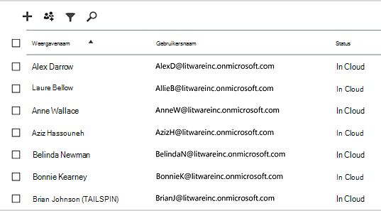
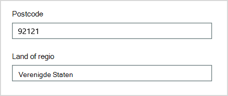
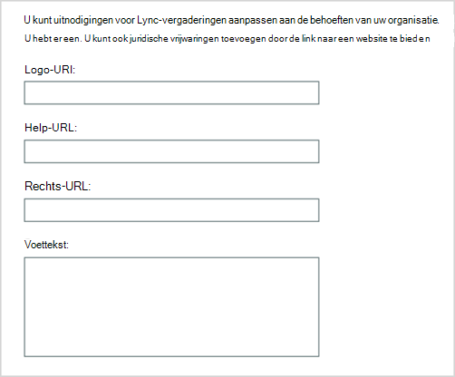
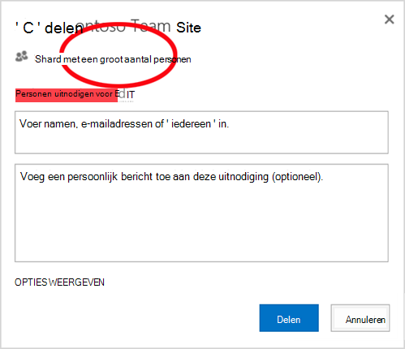
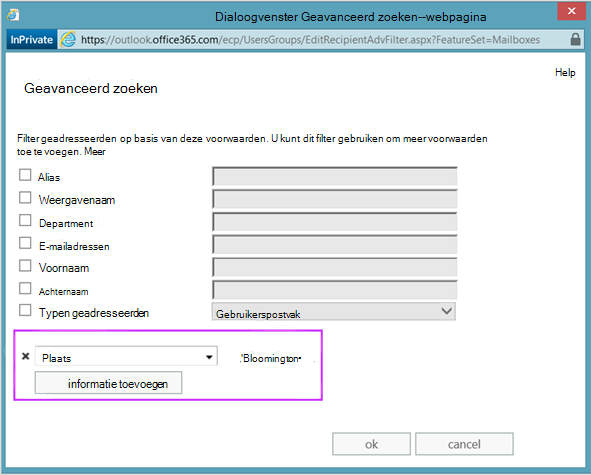
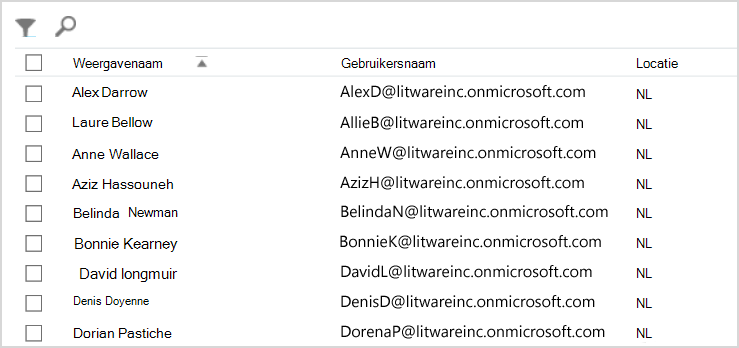
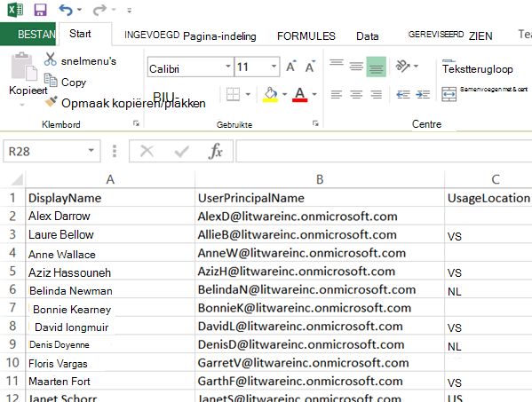

# <a name="why-you-need-to-use-powershell-for-microsoft-365"></a><span data-ttu-id="27fb3-103">Waarom u PowerShell moet gebruiken voor Microsoft 365</span><span class="sxs-lookup"><span data-stu-id="27fb3-103">Why you need to use PowerShell for Microsoft 365</span></span>

<span data-ttu-id="27fb3-104">*Dit artikel is van toepassing op Microsoft 365 Enterprise en Office 365 Enterprise.*</span><span class="sxs-lookup"><span data-stu-id="27fb3-104">*This article applies to both Microsoft 365 Enterprise and Office 365 Enterprise.*</span></span>

<span data-ttu-id="27fb3-105">Met de Microsoft 365-beheercentrum kunt u uw Microsoft 365 gebruikersaccounts en -licenties beheren.</span><span class="sxs-lookup"><span data-stu-id="27fb3-105">With the Microsoft 365 admin center, you can manage your Microsoft 365 user accounts and licenses.</span></span> <span data-ttu-id="27fb3-106">U kunt ook uw Microsoft 365 beheren, zoals Exchange Online, Teams en SharePoint Online.</span><span class="sxs-lookup"><span data-stu-id="27fb3-106">You can also manage your Microsoft 365 services, such as Exchange Online, Teams, and SharePoint Online.</span></span> <span data-ttu-id="27fb3-107">Als u in plaats daarvan PowerShell gebruikt om deze services te beheren, kunt u gebruikmaken van de taalomgeving voor opdrachtregel en scripting voor snelheid, automatisering en extra mogelijkheden.</span><span class="sxs-lookup"><span data-stu-id="27fb3-107">If you instead use PowerShell to manage these services, you can and take advantage of the command-line and scripting language environment for speed, automation, and additional capabilities.</span></span>

<span data-ttu-id="27fb3-108">In dit artikel wordt beschreven hoe u PowerShell kunt gebruiken om Microsoft 365 beheren:</span><span class="sxs-lookup"><span data-stu-id="27fb3-108">This article shows how to use PowerShell to manage Microsoft 365 to:</span></span>

- <span data-ttu-id="27fb3-109">Extra informatie die u niet kunt zien in de Microsoft 365-beheercentrum</span><span class="sxs-lookup"><span data-stu-id="27fb3-109">Reveal additional information that you can't see in the Microsoft 365 admin center</span></span>

- <span data-ttu-id="27fb3-110">Functies en instellingen configureren alleen mogelijk met PowerShell</span><span class="sxs-lookup"><span data-stu-id="27fb3-110">Configure features and settings only possible with PowerShell</span></span>

- <span data-ttu-id="27fb3-111">Bulkbewerkingen uitvoeren</span><span class="sxs-lookup"><span data-stu-id="27fb3-111">Do bulk operations</span></span>

- <span data-ttu-id="27fb3-112">Gegevens filteren</span><span class="sxs-lookup"><span data-stu-id="27fb3-112">Filter data</span></span>

- <span data-ttu-id="27fb3-113">Gegevens afdrukken of opslaan</span><span class="sxs-lookup"><span data-stu-id="27fb3-113">Print or save data</span></span>

- <span data-ttu-id="27fb3-114">Beheren in verschillende services</span><span class="sxs-lookup"><span data-stu-id="27fb3-114">Manage across services</span></span>

<span data-ttu-id="27fb3-115">Houd er rekening mee dat PowerShell voor Microsoft 365 een set modules is voor Windows PowerShell, een opdrachtregelomgeving voor Windows services en platforms.</span><span class="sxs-lookup"><span data-stu-id="27fb3-115">Keep in mind that PowerShell for Microsoft 365 is a set of modules for Windows PowerShell, which is a command-line environment for Windows-based services and platforms.</span></span> <span data-ttu-id="27fb3-116">In deze omgeving wordt een opdrachtshelltaal gemaakt die kan worden uitgebreid met extra modules.</span><span class="sxs-lookup"><span data-stu-id="27fb3-116">This environment creates a command-shell language that can be extended with additional modules.</span></span> <span data-ttu-id="27fb3-117">Het biedt een manier om eenvoudige of complexe opdrachten of scripts uit te voeren.</span><span class="sxs-lookup"><span data-stu-id="27fb3-117">It provides a way to execute simple or complex commands or scripts.</span></span> <span data-ttu-id="27fb3-118">Nadat u bijvoorbeeld de PowerShell voor Microsoft 365-modules hebt geïnstalleerd en verbinding hebt gemaakt met uw Microsoft 365-abonnement, kunt u de volgende opdracht uitvoeren om alle gebruikerspostvakken voor Microsoft Exchange Online:</span><span class="sxs-lookup"><span data-stu-id="27fb3-118">For example, after you install the PowerShell for Microsoft 365 modules and connect to your Microsoft 365 subscription, you can run the following command to list all the user mailboxes for Microsoft Exchange Online:</span></span>

```powershell
Get-Mailbox
```

<span data-ttu-id="27fb3-119">U kunt ook de lijst met postvakken krijgen met behulp van de Microsoft 365-beheercentrum, maar het tellen van de items in alle lijsten voor alle sites voor al uw web-apps is niet eenvoudig.</span><span class="sxs-lookup"><span data-stu-id="27fb3-119">You could also get the list of mailboxes by using the Microsoft 365 admin center but counting the items in all the lists for all the sites for all of your web apps isn't easy.</span></span>

<span data-ttu-id="27fb3-120">PowerShell voor Microsoft 365 is ontworpen om u te helpen uw Microsoft 365 te beheren, niet om de Microsoft 365-beheercentrum.</span><span class="sxs-lookup"><span data-stu-id="27fb3-120">PowerShell for Microsoft 365 is designed to help you manage Microsoft 365, not to replace the Microsoft 365 admin center.</span></span> <span data-ttu-id="27fb3-121">Beheerders moeten PowerShell kunnen gebruiken voor Microsoft 365 omdat er enkele configuratieprocedures zijn die alleen via PowerShell kunnen worden uitgevoerd voor Microsoft 365 opdrachten.</span><span class="sxs-lookup"><span data-stu-id="27fb3-121">Admins need to be able to use PowerShell for Microsoft 365 because there are some configuration procedures that can only be done through PowerShell for Microsoft 365 commands.</span></span> <span data-ttu-id="27fb3-122">Voor deze gevallen moet u weten hoe u:</span><span class="sxs-lookup"><span data-stu-id="27fb3-122">For these cases, you need to know how to:</span></span>

- <span data-ttu-id="27fb3-123">Installeer de PowerShell voor Microsoft 365 modules (slechts één keer uitgevoerd voor elke beheerderscomputer).</span><span class="sxs-lookup"><span data-stu-id="27fb3-123">Install the PowerShell for Microsoft 365 modules (done only one time for each administrator computer).</span></span>

- <span data-ttu-id="27fb3-124">Verbinding maken uw Microsoft 365 abonnement (één keer voor elke PowerShell-sessie).</span><span class="sxs-lookup"><span data-stu-id="27fb3-124">Connect to your Microsoft 365 subscription (one time for each PowerShell session).</span></span>

- <span data-ttu-id="27fb3-125">Verzamel de gegevens die nodig zijn om de vereiste PowerShell voor Microsoft 365 uitvoeren.</span><span class="sxs-lookup"><span data-stu-id="27fb3-125">Gather the information needed to run the required PowerShell for Microsoft 365 commands.</span></span>

- <span data-ttu-id="27fb3-126">PowerShell uitvoeren voor Microsoft 365 opdrachten.</span><span class="sxs-lookup"><span data-stu-id="27fb3-126">Run PowerShell for Microsoft 365 commands.</span></span>

<span data-ttu-id="27fb3-127">Nadat u deze basisvaardigheden hebt geleerd, hoeft u uw postvakgebruikers niet op te geven met behulp van de **opdracht Postvak** krijgen.</span><span class="sxs-lookup"><span data-stu-id="27fb3-127">After you learn these basic skills, you don't have to list your mailbox users by using the **Get-Mailbox** command.</span></span> <span data-ttu-id="27fb3-128">U hoeft ook niet te begrijpen hoe u een nieuwe opdracht maakt, zoals de opdracht die eerder is geciteerd om alle items in alle lijsten voor alle sites voor al uw web-apps te tellen.</span><span class="sxs-lookup"><span data-stu-id="27fb3-128">You also don't have to understand how to create a new command like the command cited previously to count all the items in all the lists for all the sites for all of your web apps.</span></span> <span data-ttu-id="27fb3-129">Microsoft en de community van beheerders kunnen u zo nodig helpen met dergelijke taken.</span><span class="sxs-lookup"><span data-stu-id="27fb3-129">Microsoft and the community of administrators can help you with such tasks as needed.</span></span>

## <a name="powershell-for-microsoft-365-can-reveal-information-that-you-cant-see-with-the-microsoft-365-admin-center"></a><span data-ttu-id="27fb3-130">PowerShell voor Microsoft 365 kan informatie onthullen die u niet kunt zien met de Microsoft 365-beheercentrum</span><span class="sxs-lookup"><span data-stu-id="27fb3-130">PowerShell for Microsoft 365 can reveal information that you can't see with the Microsoft 365 admin center</span></span>

<span data-ttu-id="27fb3-131">De Microsoft 365-beheercentrum bevat veel nuttige informatie.</span><span class="sxs-lookup"><span data-stu-id="27fb3-131">The Microsoft 365 admin center displays many useful information.</span></span> <span data-ttu-id="27fb3-132">Er worden echter niet alle mogelijke gegevens weergegeven die Microsoft 365 over gebruikers, licenties, postvakken en sites.</span><span class="sxs-lookup"><span data-stu-id="27fb3-132">But it doesn't display all the possible information that Microsoft 365 stores about users, licenses, mailboxes, and sites.</span></span> <span data-ttu-id="27fb3-133">Hier volgen een voorbeeld voor *gebruikers en groepen* in de Microsoft 365-beheercentrum:</span><span class="sxs-lookup"><span data-stu-id="27fb3-133">Here's an example for *users and groups* in the Microsoft 365 admin center:</span></span>



<span data-ttu-id="27fb3-135">Deze weergave bevat de informatie die u in veel gevallen nodig hebt.</span><span class="sxs-lookup"><span data-stu-id="27fb3-135">This view provides the information that you need in many cases.</span></span> <span data-ttu-id="27fb3-136">Er zijn echter momenten waarop u meer nodig hebt.</span><span class="sxs-lookup"><span data-stu-id="27fb3-136">However, there are times when you need more.</span></span> <span data-ttu-id="27fb3-137">De Microsoft 365 licenties (en de Microsoft 365 functies die beschikbaar zijn voor een gebruiker) zijn bijvoorbeeld deels afhankelijk van de geografische locatie van de gebruiker.</span><span class="sxs-lookup"><span data-stu-id="27fb3-137">For example, Microsoft 365 licensing (and the Microsoft 365 features available to a user) depends in part on the user's geographic location.</span></span> <span data-ttu-id="27fb3-138">Het beleid en de functies die u kunt uitbreiden naar een gebruiker die in de Verenigde Staten woont, zijn mogelijk niet hetzelfde als het beleid dat u kunt uitbreiden naar een gebruiker in India of België.</span><span class="sxs-lookup"><span data-stu-id="27fb3-138">The policies and features that you can extend to a user who lives in the United States might not be the same as those that you can extend to a user in India or Belgium.</span></span> <span data-ttu-id="27fb3-139">Volg deze stappen in het Microsoft 365-beheercentrum om de geografische locatie van een gebruiker te bepalen:</span><span class="sxs-lookup"><span data-stu-id="27fb3-139">Follow these steps in the Microsoft 365 admin center to determine a user's geographic location:</span></span>

1. <span data-ttu-id="27fb3-140">Dubbelklik op de weergavenaam **van de gebruiker.**</span><span class="sxs-lookup"><span data-stu-id="27fb3-140">Double-click the user's **Display Name**.</span></span>

2. <span data-ttu-id="27fb3-141">Selecteer details in het weergavevenster **gebruikerseigenschappen.**</span><span class="sxs-lookup"><span data-stu-id="27fb3-141">In the user properties display pane, select **details**.</span></span>

3. <span data-ttu-id="27fb3-142">Selecteer in de detailweergave **aanvullende details.**</span><span class="sxs-lookup"><span data-stu-id="27fb3-142">In the details display, select **additional details**.</span></span>

4. <span data-ttu-id="27fb3-143">Scroll totdat u de kop **Land of regio hebt gevonden:**</span><span class="sxs-lookup"><span data-stu-id="27fb3-143">Scroll until you find the heading **Country or region**:</span></span>

     

5. <span data-ttu-id="27fb3-145">Schrijf de weergavenaam en locatie van de gebruiker op een stuk papier of kopieer en plak deze in Kladblok.</span><span class="sxs-lookup"><span data-stu-id="27fb3-145">Write the user's display name and location on a piece of paper, or copy and paste it into Notepad.</span></span>

<span data-ttu-id="27fb3-146">U moet deze procedure voor elke gebruiker herhalen.</span><span class="sxs-lookup"><span data-stu-id="27fb3-146">You must repeat this procedure for each user.</span></span> <span data-ttu-id="27fb3-147">Als u veel gebruikers hebt, kan dit proces vervelend zijn.</span><span class="sxs-lookup"><span data-stu-id="27fb3-147">If you have many users, this process can be tedious.</span></span> <span data-ttu-id="27fb3-148">Met PowerShell voor Microsoft 365 kunt u deze informatie voor al uw gebruikers weergeven met de volgende opdracht:</span><span class="sxs-lookup"><span data-stu-id="27fb3-148">With PowerShell for Microsoft 365, you can display this information for all of your users by using the following command:</span></span>

```powershell
Get-AzureADUser | Select DisplayName, UsageLocation
```


>[!Note]
><span data-ttu-id="27fb3-149">PowerShell Core biedt geen ondersteuning voor de Microsoft Azure Active Directory module voor Windows PowerShell module en cmdlets met *Msol* in hun naam.</span><span class="sxs-lookup"><span data-stu-id="27fb3-149">PowerShell Core doesn't support the Microsoft Azure Active Directory Module for Windows PowerShell module and cmdlets that have *Msol* in their name.</span></span> <span data-ttu-id="27fb3-150">U moet deze cmdlets uitvoeren vanaf Windows PowerShell.</span><span class="sxs-lookup"><span data-stu-id="27fb3-150">You have to run these cmdlets from Windows PowerShell.</span></span>
>

<span data-ttu-id="27fb3-151">Hier volgen een voorbeeld van de resultaten:</span><span class="sxs-lookup"><span data-stu-id="27fb3-151">Here's an example of the results:</span></span>

```powershell
DisplayName                               UsageLocation
-----------                               -------------
Bonnie Kearney                            GB
Fabrice Canel                             BR
Brian Johnson (TAILSPIN)                  US
Anne Wallace                              US
Alex Darrow                               US
David Longmuir                            BR
```

<span data-ttu-id="27fb3-152">De interpretatie van deze PowerShell-opdracht is: Alle gebruikers in het huidige **Microsoft 365-abonnement (Get-AzureADUser)** krijgen, maar alleen de naam en locatie voor elke gebruiker weergeven **(Selecteer DisplayName, UsageLocation).**</span><span class="sxs-lookup"><span data-stu-id="27fb3-152">The interpretation of this PowerShell command is: Get all of the users in the current Microsoft 365 subscription (**Get-AzureADUser**), but only display the name and location for each user (**Select DisplayName, UsageLocation**).</span></span>

<span data-ttu-id="27fb3-153">Omdat PowerShell voor Microsoft 365 een opdrachtshelltaal ondersteunt, kunt u de gegevens die zijn verkregen met de **opdracht Get-AzureADUser verder** bewerken.</span><span class="sxs-lookup"><span data-stu-id="27fb3-153">Because PowerShell for Microsoft 365 supports a command-shell language, you can further manipulate the information obtained by the **Get-AzureADUser** command.</span></span> <span data-ttu-id="27fb3-154">Misschien wilt u deze gebruikers bijvoorbeeld sorteren op hun locatie, alle Braziliaanse gebruikers groeperen, alle Amerikaanse gebruikers bij elkaar, en ga zo maar door.</span><span class="sxs-lookup"><span data-stu-id="27fb3-154">For example, maybe you'd like to sort these users by their location, grouping all the Brazilian users together, all the United States users together, and so on.</span></span> <span data-ttu-id="27fb3-155">Hier is de opdracht:</span><span class="sxs-lookup"><span data-stu-id="27fb3-155">Here's the command:</span></span>

```powershell
Get-AzureADUser | Select DisplayName, UsageLocation | Sort UsageLocation, DisplayName
```

<span data-ttu-id="27fb3-156">Hier volgen een voorbeeld van de resultaten:</span><span class="sxs-lookup"><span data-stu-id="27fb3-156">Here's an example of the results:</span></span>

```powershell
DisplayName                                 UsageLocation
-----------                                 -------------
David Longmuir                              BR
Fabrice Canel                               BR
Bonnie Kearney                              GB
Alex Darrow                                 US
Anne Wallace                                US
Brian Johnson (TAILSPIN)                    US
```

<span data-ttu-id="27fb3-157">De interpretatie van deze PowerShell-opdracht is: Alle gebruikers in het huidige Microsoft 365-abonnement krijgen, maar alleen de naam en locatie voor elke gebruiker weergeven en ze eerst sorteren op hun locatie en vervolgens op hun naam **(Sort UsageLocation, DisplayName).**</span><span class="sxs-lookup"><span data-stu-id="27fb3-157">The interpretation of this PowerShell command is: Get all the users in the current Microsoft 365 subscription, but only display the name and location for each user and sort them first by their location and then their name (**Sort UsageLocation, DisplayName**).</span></span>

<span data-ttu-id="27fb3-158">U kunt ook extra filteren gebruiken.</span><span class="sxs-lookup"><span data-stu-id="27fb3-158">You can also use additional filtering.</span></span> <span data-ttu-id="27fb3-159">Als u bijvoorbeeld alleen informatie wilt zien over gebruikers die in Brazilië zijn gevestigd, gebruikt u deze opdracht:</span><span class="sxs-lookup"><span data-stu-id="27fb3-159">For example, if you only want to see information about users based in Brazil, use this command:</span></span>

```powershell
Get-AzureADUser | Where {$_.UsageLocation -eq "BR"} | Select DisplayName, UsageLocation
```

<span data-ttu-id="27fb3-160">Hier volgen een voorbeeld van de resultaten:</span><span class="sxs-lookup"><span data-stu-id="27fb3-160">Here's an example of the results:</span></span>

```powershell
DisplayName                                           UsageLocation
-----------                                           -------------
David Longmuir                                        BR
Fabrice Canel                                         BR
```

<span data-ttu-id="27fb3-161">De interpretatie van deze PowerShell-opdracht is: Alle gebruikers in het huidige abonnement Microsoft 365 waarvan de locatie Brazilië is (**Where {$ \_ . UsageLocation -eq "BR"}**) en geef vervolgens de naam en locatie weer voor elke gebruiker.</span><span class="sxs-lookup"><span data-stu-id="27fb3-161">The interpretation of this PowerShell command is: Get all the users in the current Microsoft 365 subscription whose location is Brazil (**Where {$\_.UsageLocation -eq "BR"}**) and then display the name and location for each user.</span></span>

 <span data-ttu-id="27fb3-162">**Een notitie over grote domeinen**</span><span class="sxs-lookup"><span data-stu-id="27fb3-162">**A note about large domains**</span></span>

<span data-ttu-id="27fb3-163">Als u een groot domein met tienduizenden gebruikers hebt, kan het proberen van enkele voorbeelden in dit artikel leiden tot beperking.</span><span class="sxs-lookup"><span data-stu-id="27fb3-163">If you have a large domain with tens of thousands of users, trying some of the examples we show in this article could lead to throttling.</span></span> <span data-ttu-id="27fb3-164">Op basis van factoren zoals rekenkracht en beschikbare netwerkbandbreedte probeert u mogelijk te veel tegelijk te doen.</span><span class="sxs-lookup"><span data-stu-id="27fb3-164">Based on factors like computing power and available network bandwidth, you may be trying to do too much at one time.</span></span> <span data-ttu-id="27fb3-165">Grote organisaties willen sommige van deze PowerShell-bewerkingen mogelijk splitsen in twee opdrachten.</span><span class="sxs-lookup"><span data-stu-id="27fb3-165">Large organizations might want to split some of these PowerShell operations into two commands.</span></span>

<span data-ttu-id="27fb3-166">De volgende opdracht retourneert bijvoorbeeld alle gebruikersaccounts en geeft de naam en locatie voor elk account weer:</span><span class="sxs-lookup"><span data-stu-id="27fb3-166">For example, the following command returns all the user accounts and shows the name and location for each:</span></span>

```powershell
Get-AzureADUser | Select DisplayName, UsageLocation
```

<span data-ttu-id="27fb3-167">Dat werkt prima voor kleinere domeinen.</span><span class="sxs-lookup"><span data-stu-id="27fb3-167">That works great for smaller domains.</span></span> <span data-ttu-id="27fb3-168">Maar in een grote organisatie kunt u deze bewerking opsplitsen in twee opdrachten: één opdracht om de gebruikersaccountgegevens op te slaan in een variabele en een andere opdracht om de benodigde informatie weer te geven.</span><span class="sxs-lookup"><span data-stu-id="27fb3-168">But in a large organization, you might want to split that operation into two commands: one command to store the user account information in a variable and another to display the needed information.</span></span> <span data-ttu-id="27fb3-169">Hier volgt een voorbeeld:</span><span class="sxs-lookup"><span data-stu-id="27fb3-169">Here's an example:</span></span>

```powershell
$x = Get-AzureADUser
$x | Select DisplayName, UsageLocation
```

<span data-ttu-id="27fb3-170">De interpretatie van deze set PowerShell-opdrachten is:</span><span class="sxs-lookup"><span data-stu-id="27fb3-170">The interpretation of this set of PowerShell commands is:</span></span>
1. <span data-ttu-id="27fb3-171">Alle gebruikers in het huidige abonnement Microsoft 365 en sla de gegevens op in een variabele met de naam $x (**$x = Get-AzureADUser**).</span><span class="sxs-lookup"><span data-stu-id="27fb3-171">Get all the users in the current Microsoft 365 subscription and store the information in a variable named $x (**$x = Get-AzureADUser**).</span></span>
1.  <span data-ttu-id="27fb3-172">De inhoud van de variabele $x *weergeven,* maar alleen de naam en locatie voor elke gebruiker (**$x | Selecteer DisplayName, UsageLocation**).</span><span class="sxs-lookup"><span data-stu-id="27fb3-172">Display the contents of the variable *$x*, but only include the name and location for each user (**$x | Select DisplayName, UsageLocation**).</span></span>

## <a name="microsoft-365-has-features-that-you-can-only-configure-with-powershell-for-microsoft-365"></a><span data-ttu-id="27fb3-173">Microsoft 365 functies die u alleen met PowerShell kunt configureren voor Microsoft 365</span><span class="sxs-lookup"><span data-stu-id="27fb3-173">Microsoft 365 has features that you can only configure with PowerShell for Microsoft 365</span></span>

<span data-ttu-id="27fb3-174">De Microsoft 365-beheercentrum is bedoeld om toegang te bieden tot algemene, nuttige beheertaken die van toepassing zijn op de meeste omgevingen.</span><span class="sxs-lookup"><span data-stu-id="27fb3-174">The Microsoft 365 admin center is intended to provide access to common, useful administrative tasks that apply to most environments.</span></span> <span data-ttu-id="27fb3-175">Met andere woorden, de Microsoft 365-beheercentrum zo ontworpen dat de gewone beheerder de meest voorkomende beheertaken kan uitvoeren.</span><span class="sxs-lookup"><span data-stu-id="27fb3-175">In other words, the Microsoft 365 admin center was designed so that the typical administrator can carry out the most-common management tasks.</span></span> <span data-ttu-id="27fb3-176">Er zijn echter enkele taken die niet kunnen worden uitgevoerd in het beheercentrum.</span><span class="sxs-lookup"><span data-stu-id="27fb3-176">But there are some tasks that can't be done in the admin center.</span></span>

<span data-ttu-id="27fb3-177">Het online-beheercentrum Skype voor Bedrijven biedt bijvoorbeeld een aantal opties voor het maken van aangepaste uitnodigingen voor een vergadering:</span><span class="sxs-lookup"><span data-stu-id="27fb3-177">For example, the Skype for Business Online admin center provides a few options for creating custom meeting invitations:</span></span>



<span data-ttu-id="27fb3-179">Met deze instellingen kunt u een vleugje persoonlijke instellingen en professionaliteit toevoegen aan uitnodigingen voor een vergadering.</span><span class="sxs-lookup"><span data-stu-id="27fb3-179">With these settings, you can add a touch of personalization and professionalism to meeting invitations.</span></span> <span data-ttu-id="27fb3-180">Maar er is meer aan instellingen voor vergaderingsconfiguraties dan alleen het maken van aangepaste uitnodigingen voor een vergadering.</span><span class="sxs-lookup"><span data-stu-id="27fb3-180">But there's more to meeting-configuration settings than simply creating custom meeting invitations.</span></span> <span data-ttu-id="27fb3-181">Vergaderingen staan bijvoorbeeld standaard het volgende toe:</span><span class="sxs-lookup"><span data-stu-id="27fb3-181">For example, by default, meetings allow:</span></span>

- <span data-ttu-id="27fb3-182">Anonieme gebruikers om automatisch toegang te krijgen tot elke vergadering.</span><span class="sxs-lookup"><span data-stu-id="27fb3-182">Anonymous users to gain automatic entrance to each meeting.</span></span>

- <span data-ttu-id="27fb3-183">Deelnemers om de vergadering op te nemen.</span><span class="sxs-lookup"><span data-stu-id="27fb3-183">Attendees to record the meeting.</span></span>

- <span data-ttu-id="27fb3-184">Alle gebruikers van uw organisatie die als presentator moeten worden aangewezen wanneer ze deelnemen aan de vergadering.</span><span class="sxs-lookup"><span data-stu-id="27fb3-184">All users from your organization to be designated as presenters when they join the meeting.</span></span>

<span data-ttu-id="27fb3-185">Deze instellingen zijn niet beschikbaar in het Skype voor Bedrijven Online-beheercentrum.</span><span class="sxs-lookup"><span data-stu-id="27fb3-185">These settings aren't available from the Skype for Business Online admin center.</span></span> <span data-ttu-id="27fb3-186">U kunt ze vanuit PowerShell voor Microsoft 365.</span><span class="sxs-lookup"><span data-stu-id="27fb3-186">You can control them from PowerShell for Microsoft 365.</span></span> <span data-ttu-id="27fb3-187">Hier is een opdracht die deze drie instellingen uit schakelt:</span><span class="sxs-lookup"><span data-stu-id="27fb3-187">Here's a command that disables these three settings:</span></span>

```powershell
Set-CsMeetingConfiguration -AdmitAnonymousUsersByDefault $False -AllowConferenceRecording $False -DesignateAsPresenter "None"
```

> [!NOTE]
> <span data-ttu-id="27fb3-188">Als u deze opdracht wilt uitvoeren, moet u de Skype voor Bedrijven [Online PowerShell-module installeren.](https://www.microsoft.com/download/details.aspx?id=39366)</span><span class="sxs-lookup"><span data-stu-id="27fb3-188">To run this command, you must install the [Skype for Business Online PowerShell Module](https://www.microsoft.com/download/details.aspx?id=39366).</span></span>

<span data-ttu-id="27fb3-189">De interpretatie van deze PowerShell-opdracht is:</span><span class="sxs-lookup"><span data-stu-id="27fb3-189">The interpretation of this PowerShell command is:</span></span>

1. <span data-ttu-id="27fb3-190">Schakel in de instellingen voor nieuwe Skype voor Bedrijven **Online-vergaderingen (Set-CsMeetingConfiguration)** uit dat anonieme gebruikers automatisch toegang krijgen tot vergaderingen (**-AdmitAnonymousUsersByDefault $False).**</span><span class="sxs-lookup"><span data-stu-id="27fb3-190">In the settings for new Skype for Business Online meetings (**Set-CsMeetingConfiguration**), disable allowing anonymous users to gain automatic entrance to meetings (**-AdmitAnonymousUsersByDefault $False**).</span></span>
2.  <span data-ttu-id="27fb3-191">De mogelijkheid uitschakelen voor deelnemers om vergaderingen op te nemen (**-AllowConferenceRecording $False).**</span><span class="sxs-lookup"><span data-stu-id="27fb3-191">Disable the ability for attendees to record meetings (**-AllowConferenceRecording $False**).</span></span>
3. <span data-ttu-id="27fb3-192">Wijs niet alle gebruikers uit uw organisatie aan als presentatoren (**-DesignateAsPresenter "None"**).</span><span class="sxs-lookup"><span data-stu-id="27fb3-192">Don't designate all users from your organization as presenters (**-DesignateAsPresenter "None"**).</span></span>

<span data-ttu-id="27fb3-193">Als u deze standaardinstellingen wilt herstellen (de opties inschakelen), gaat u als volgende opdracht te werk:</span><span class="sxs-lookup"><span data-stu-id="27fb3-193">To restore these default settings (enable the options), run this command:</span></span>

```powershell
Set-CsMeetingConfiguration -AdmitAnonymousUsersByDefault $True -AllowConferenceRecording $True -DesignateAsPresenter "Company"
```

<span data-ttu-id="27fb3-194">Er zijn ook andere vergelijkbare scenario's. Daarom moeten beheerders weten hoe ze PowerShell moeten uitvoeren voor Microsoft 365 opdrachten.</span><span class="sxs-lookup"><span data-stu-id="27fb3-194">There are other similar scenarios as well, which is why administrators should know how to run PowerShell for Microsoft 365 commands.</span></span>

## <a name="powershell-for-microsoft-365-is-great-for-bulk-operations"></a><span data-ttu-id="27fb3-195">PowerShell voor Microsoft 365 is zeer goed voor bulkbewerkingen</span><span class="sxs-lookup"><span data-stu-id="27fb3-195">PowerShell for Microsoft 365 is great for bulk operations</span></span>

<span data-ttu-id="27fb3-196">Visuele interfaces zoals de Microsoft 365-beheercentrum zijn het meest waardevol wanneer u één bewerking moet uitvoeren.</span><span class="sxs-lookup"><span data-stu-id="27fb3-196">Visual interfaces like the Microsoft 365 admin center are most valuable when you have a single operation to do.</span></span> <span data-ttu-id="27fb3-197">Als u bijvoorbeeld één gebruikersaccount wilt uitschakelen, kunt u het beheercentrum gebruiken om snel een selectievakje te zoeken en uit te schakelen.</span><span class="sxs-lookup"><span data-stu-id="27fb3-197">For example, if you need to disable one user account, you can use the admin center to quickly locate and clear a checkbox.</span></span> <span data-ttu-id="27fb3-198">Dit kan eenvoudiger zijn dan het uitvoeren van een soortgelijke bewerking in PowerShell.</span><span class="sxs-lookup"><span data-stu-id="27fb3-198">This may be easier than performing a similar operation in PowerShell.</span></span>

<span data-ttu-id="27fb3-199">Maar als u veel dingen of bepaalde geselecteerde dingen binnen een grote reeks andere dingen moet wijzigen, is Microsoft 365-beheercentrum mogelijk niet het beste hulpmiddel.</span><span class="sxs-lookup"><span data-stu-id="27fb3-199">But if you have to change many things or some selected things within a large set of other things, the Microsoft 365 admin center might not be the best tool.</span></span> <span data-ttu-id="27fb3-200">Stel dat u het voorvoegsel voor duizenden telefoonnummers moet wijzigen of de specifieke gebruiker *Ken Myer* van al uw onlinesites SharePoint verwijderen.</span><span class="sxs-lookup"><span data-stu-id="27fb3-200">For example, say you have to change the prefix on thousands of phone numbers or remove the specific user *Ken Myer* from all your SharePoint Online sites.</span></span> <span data-ttu-id="27fb3-201">Hoe zou u dat doen in de Microsoft 365-beheercentrum?</span><span class="sxs-lookup"><span data-stu-id="27fb3-201">How would you do that in the Microsoft 365 admin center?</span></span>

<span data-ttu-id="27fb3-202">In het laatste voorbeeld zegt u dat u enkele honderden SharePoint onlinesites hebt en u niet weet welke Ken Meyer lid is van.</span><span class="sxs-lookup"><span data-stu-id="27fb3-202">For the last example, say you have several hundred SharePoint Online sites, and you don't know which ones Ken Meyer is a member of.</span></span> <span data-ttu-id="27fb3-203">U moet beginnen bij de Microsoft 365-beheercentrum en vervolgens deze procedure voor elke site uitvoeren:</span><span class="sxs-lookup"><span data-stu-id="27fb3-203">You would have to start at the Microsoft 365 admin center and then perform this procedure for each site:</span></span>

1. <span data-ttu-id="27fb3-204">Selecteer de **URL** van de site.</span><span class="sxs-lookup"><span data-stu-id="27fb3-204">Select the **URL** of the site.</span></span>

2. <span data-ttu-id="27fb3-205">Selecteer in **het vak Eigenschappen van** de siteverzameling de koppeling Adres van **website** om de site te openen.</span><span class="sxs-lookup"><span data-stu-id="27fb3-205">In the **site collection properties** box, select the **Web Site Address** link to open the site.</span></span>

3. <span data-ttu-id="27fb3-206">Selecteer delen op **de** site.</span><span class="sxs-lookup"><span data-stu-id="27fb3-206">On the site, select **Share**.</span></span>

4. <span data-ttu-id="27fb3-207">Selecteer in **het** dialoogvenster Delen de koppeling met alle gebruikers met machtigingen voor de site:</span><span class="sxs-lookup"><span data-stu-id="27fb3-207">In the **Share** dialog box, select the link that shows all the users who have permissions to the site:</span></span>

     

5. <span data-ttu-id="27fb3-209">Selecteer geavanceerd **in het** dialoogvenster Gedeeld **met.**</span><span class="sxs-lookup"><span data-stu-id="27fb3-209">In the **Shared With** dialog box, select **Advanced**.</span></span>

6. <span data-ttu-id="27fb3-210">Schuif omlaag in de lijst met gebruikers, zoek en selecteer Ken Myer (ervan uitgaande dat hij machtigingen voor de site heeft) en selecteer **gebruikersmachtigingen verwijderen.**</span><span class="sxs-lookup"><span data-stu-id="27fb3-210">Scroll down the list of users, find and select Ken Myer (assuming he has permissions to the site), and then select **Remove User Permissions**.</span></span>

<span data-ttu-id="27fb3-211">Dit duurt lang *voor* enkele honderden sites.</span><span class="sxs-lookup"><span data-stu-id="27fb3-211">This would take a *long* time for several hundred sites.</span></span>

<span data-ttu-id="27fb3-212">Het alternatief is om de volgende opdracht uit te voeren in PowerShell Microsoft 365 Ken Myer van al uw sites te verwijderen:</span><span class="sxs-lookup"><span data-stu-id="27fb3-212">The alternative is to run the following command in PowerShell for Microsoft 365 to remove Ken Myer from all your sites:</span></span>

```powershell
Get-SPOSite | ForEach {Remove-SPOUser -Site $_.Url -LoginName "kenmyer@litwareinc.com"}
```

> [!NOTE]
> <span data-ttu-id="27fb3-213">Voor deze opdracht moet u de SharePoint [Online PowerShell-module installeren.](/powershell/sharepoint/sharepoint-online/connect-sharepoint-online?view=sharepoint-ps)</span><span class="sxs-lookup"><span data-stu-id="27fb3-213">This command requires that you install the [SharePoint Online PowerShell module](/powershell/sharepoint/sharepoint-online/connect-sharepoint-online?view=sharepoint-ps).</span></span>

<span data-ttu-id="27fb3-214">De interpretatie van deze PowerShell-opdracht is: Alle SharePoint-sites in het huidige **Microsoft 365-abonnement (Get-SPOSite)** en voor elke site verwijderen Ken Meyer uit de lijst met gebruikers die er toegang toe hebben (**ForEach {Remove-SPOUser -Site $ \_ . Url -LoginName "kenmyer \@ litwareinc.com"}**).</span><span class="sxs-lookup"><span data-stu-id="27fb3-214">The interpretation of this PowerShell command is: Get all of the SharePoint sites in the current Microsoft 365 subscription (**Get-SPOSite**) and for each site remove Ken Meyer from the list of users who can access it (**ForEach {Remove-SPOUser -Site $\_.Url -LoginName "kenmyer\@litwareinc.com"}**).</span></span>

<span data-ttu-id="27fb3-215">We vertellen Microsoft 365 Ken Meyer van elke site te verwijderen, inclusief de site waar hij geen toegang toe heeft.</span><span class="sxs-lookup"><span data-stu-id="27fb3-215">We tell Microsoft 365 to remove Ken Meyer from every site, including those that he doesn't have access to.</span></span> <span data-ttu-id="27fb3-216">In de resultaten worden dus fouten voor die sites weer te geven die hij niet kan gebruiken.</span><span class="sxs-lookup"><span data-stu-id="27fb3-216">So the results will show errors for those sites that he doesn't have access to.</span></span> <span data-ttu-id="27fb3-217">We kunnen een aanvullende voorwaarde voor deze opdracht gebruiken om Ken Meyer alleen te verwijderen van de sites met hem in hun aanmeldingslijst.</span><span class="sxs-lookup"><span data-stu-id="27fb3-217">We can use an additional condition on this command to remove Ken Meyer only from the sites that have him on their login list.</span></span> <span data-ttu-id="27fb3-218">Maar de fouten die worden geretourneerd, veroorzaken geen schade aan de sites zelf.</span><span class="sxs-lookup"><span data-stu-id="27fb3-218">But the errors that are returned cause no harm to the sites themselves.</span></span> <span data-ttu-id="27fb3-219">Het kan enkele minuten duren voordat deze opdracht wordt uitgevoerd op honderden sites, in plaats van uren te werken via de Microsoft 365-beheercentrum.</span><span class="sxs-lookup"><span data-stu-id="27fb3-219">This command might take a few minutes to run against hundreds of sites, rather than hours of working through the Microsoft 365 admin center.</span></span>

<span data-ttu-id="27fb3-220">Hier is nog een voorbeeld van bulkbewerking.</span><span class="sxs-lookup"><span data-stu-id="27fb3-220">Here's another bulk operation example.</span></span> <span data-ttu-id="27fb3-221">Gebruik deze opdracht om *Bonnie Kearney*, een nieuwe beheerder SharePoint, toe te voegen aan alle sites in de organisatie:</span><span class="sxs-lookup"><span data-stu-id="27fb3-221">Use this command to add *Bonnie Kearney*, a new SharePoint administrator, to all sites in the organization:</span></span>

```powershell
Get-SPOSite | ForEach {Add-SPOUser -Site $_.Url -LoginName "bkearney@litwareinc.com" -Group "Members"}
```

<span data-ttu-id="27fb3-222">De interpretatie van deze PowerShell-opdracht is: Haal alle SharePoint-sites in het huidige Microsoft 365-abonnement op en sta bonnie Kearney voor elke site toegang toe door haar aanmeldingsnaam toe te voegen aan de groep Leden van de site (**ForEach {Add-SPOUser -Site $ \_ . Url -LoginName "bkearney \@ litwareinc.com" -Group "Members"}**).</span><span class="sxs-lookup"><span data-stu-id="27fb3-222">The interpretation of this PowerShell command is: Get all the SharePoint sites in the current Microsoft 365 subscription and for each site allow Bonnie Kearney access by adding her login name to the Members group of the site (**ForEach {Add-SPOUser -Site $\_.Url -LoginName "bkearney\@litwareinc.com" -Group "Members"}**).</span></span>

## <a name="powershell-for-microsoft-365-is-great-at-filtering-data"></a><span data-ttu-id="27fb3-223">PowerShell voor Microsoft 365 is zeer goed in het filteren van gegevens</span><span class="sxs-lookup"><span data-stu-id="27fb3-223">PowerShell for Microsoft 365 is great at filtering data</span></span>

<span data-ttu-id="27fb3-224">De Microsoft 365-beheercentrum biedt verschillende manieren om uw gegevens te filteren om eenvoudig een gerichte subset met informatie te vinden.</span><span class="sxs-lookup"><span data-stu-id="27fb3-224">The Microsoft 365 admin center provides several ways to filter your data to easily locate a targeted subset of information.</span></span> <span data-ttu-id="27fb3-225">Met Exchange kunt u bijvoorbeeld eenvoudig filteren op vrijwel elke eigenschap van een gebruikerspostvak.</span><span class="sxs-lookup"><span data-stu-id="27fb3-225">For example, Exchange makes it easy to filter on practically any property of a user mailbox.</span></span> <span data-ttu-id="27fb3-226">Hier is bijvoorbeeld de lijst met postvakken voor alle gebruikers die in de stad Bloomington wonen:</span><span class="sxs-lookup"><span data-stu-id="27fb3-226">For example, here's the list of mailboxes for all the users who live in the city of Bloomington:</span></span>



<span data-ttu-id="27fb3-228&quot;>In Exchange beheercentrum kunt u ook filtercriteria combineren.</span><span class=&quot;sxs-lookup&quot;><span data-stu-id=&quot;27fb3-228&quot;>The Exchange Admin center also lets you combine filter criteria.</span></span> <span data-ttu-id=&quot;27fb3-229&quot;>U kunt bijvoorbeeld de postvakken vinden voor alle personen die in Bloomington wonen en op de afdeling Financiën werken.</span><span class=&quot;sxs-lookup&quot;><span data-stu-id=&quot;27fb3-229&quot;>For example, you can find the mailboxes for all the people who live in Bloomington and work in the Finance department.</span></span>

<span data-ttu-id=&quot;27fb3-230&quot;>Maar er zijn beperkingen voor wat u kunt doen in het Exchange beheercentrum.</span><span class=&quot;sxs-lookup&quot;><span data-stu-id=&quot;27fb3-230&quot;>But there are limitations to what you can do in the Exchange Admin center.</span></span> <span data-ttu-id=&quot;27fb3-231&quot;>U kunt bijvoorbeeld niet zo gemakkelijk de postvakken vinden van personen die in *Bloomington* of San Diego wonen, of de postvakken voor alle personen die niet in Bloomington wonen.</span><span class=&quot;sxs-lookup&quot;><span data-stu-id=&quot;27fb3-231&quot;>For example, you couldn't as easily find the mailboxes of people who live in Bloomington *or* San Diego, or the mailboxes for all people who don't live in Bloomington.</span></span>

<span data-ttu-id=&quot;27fb3-232&quot;>U kunt de volgende PowerShell voor Microsoft 365 opdracht gebruiken om een lijst met postvakken te krijgen voor alle personen die in Bloomington of San Diego wonen:</span><span class=&quot;sxs-lookup&quot;><span data-stu-id=&quot;27fb3-232&quot;>You can use the following PowerShell for Microsoft 365 command to get a list of mailboxes for all the people who live in Bloomington or San Diego:</span></span>

```powershell
Get-User | Where {$_.RecipientTypeDetails -eq &quot;UserMailbox&quot; -and ($_.City -eq &quot;San Diego&quot; -or $_.City -eq &quot;Bloomington")} | Select DisplayName, City
```

<span data-ttu-id="27fb3-233">Hier volgen een voorbeeld van de resultaten:</span><span class="sxs-lookup"><span data-stu-id="27fb3-233">Here's an example of the results:</span></span>

```powershell
DisplayName                              City
-----------                              ----
Alex Darrow                              San Diego
Bonnie Kearney                           San Diego
Julian Isla                              Bloomington
Rob Young                                Bloomington
```

<span data-ttu-id="27fb3-234">De interpretatie van deze PowerShell-opdracht is: Alle gebruikers in het huidige Microsoft 365-abonnement krijgen die een postvak hebben in de stad San Diego of Bloomington (**Where {$ \_ . RecipientTypeDetails -eq "UserMailbox" -and ($ \_ ). City -eq "San Diego" -of $ \_ . Plaats -eq "Bloomington")} )** en geef vervolgens de naam en de plaats weer voor elk **(Selecteer DisplayName, Plaats).**</span><span class="sxs-lookup"><span data-stu-id="27fb3-234">The interpretation of this PowerShell command is: Get all the users in the current Microsoft 365 subscription who have a mailbox in the city of San Diego or Bloomington (**Where {$\_.RecipientTypeDetails -eq "UserMailbox" -and ($\_.City -eq "San Diego" -or $\_.City -eq "Bloomington")}**), and then display the name and city for each (**Select DisplayName, City**).</span></span>

<span data-ttu-id="27fb3-235">En hier is de opdracht om alle postvakken weer te geven voor mensen die ergens wonen, behalve Bloomington:</span><span class="sxs-lookup"><span data-stu-id="27fb3-235">And here's the command to list all the mailboxes for people who live anywhere except Bloomington:</span></span>

```powershell
Get-User | Where {$_.RecipientTypeDetails -eq "UserMailbox" -and $_.City -ne "Bloomington"} | Select DisplayName, City
```

<span data-ttu-id="27fb3-236">Hier volgen een voorbeeld van de resultaten:</span><span class="sxs-lookup"><span data-stu-id="27fb3-236">Here's an example of the results:</span></span>

```powershell
DisplayName                               City
-----------                               ----
MOD Administrator                         Redmond
Alex Darrow                               San Diego
Allie Bellew                              Bellevue
Anne Wallace                              Louisville
Aziz Hassouneh                            Cairo
Belinda Newman                            Charlotte
Bonnie Kearney                            San Diego
David Longmuir                            Waukesha
Denis Dehenne                             Birmingham
Garret Vargas                             Seattle
Garth Fort                                Tulsa
Janet Schorr                              Bellevue
```

<span data-ttu-id="27fb3-237">De interpretatie van deze PowerShell-opdracht is: Alle gebruikers in het huidige Microsoft 365-abonnement krijgen die een postvak hebben dat zich niet in de stad Bloomington bevindt (**Where {$ \_ . RecipientTypeDetails -eq "UserMailbox" -and $ \_ . Plaats -ne "Bloomington"} )** en geef vervolgens de naam en de plaats weer voor elk.</span><span class="sxs-lookup"><span data-stu-id="27fb3-237">The interpretation of this PowerShell command is: Get all the users in the current Microsoft 365 subscription who have a mailbox not located in the city of Bloomington (**Where {$\_.RecipientTypeDetails -eq "UserMailbox" -and $\_.City -ne "Bloomington"}**), and then display the name and city for each.</span></span>

### <a name="use-wildcards"></a><span data-ttu-id="27fb3-238">Jokertekens gebruiken</span><span class="sxs-lookup"><span data-stu-id="27fb3-238">Use wildcards</span></span>

<span data-ttu-id="27fb3-239">U kunt ook jokertekens in uw PowerShell-filters gebruiken om een deel van een naam aan te passen.</span><span class="sxs-lookup"><span data-stu-id="27fb3-239">You can also use wildcard characters in your PowerShell filters to match part of a name.</span></span> <span data-ttu-id="27fb3-240">Stel dat u een gebruikersaccount zoekt.</span><span class="sxs-lookup"><span data-stu-id="27fb3-240">For example, suppose you're looking for a user account.</span></span> <span data-ttu-id="27fb3-241">Alles wat u zich kunt herinneren is dat de achternaam van de gebruiker *Was Anderson* of misschien *Henderson* of *Jorgenson.*</span><span class="sxs-lookup"><span data-stu-id="27fb3-241">All you can remember is that the user's last name was *Anderson* or maybe *Henderson* or *Jorgenson*.</span></span>

<span data-ttu-id="27fb3-242">U kunt deze gebruiker in de Microsoft 365-beheercentrum met behulp van het zoekprogramma en drie verschillende zoekopdrachten uitvoeren:</span><span class="sxs-lookup"><span data-stu-id="27fb3-242">You could track down that user in the Microsoft 365 admin center by using the search tool and carrying out three different searches:</span></span>

- <span data-ttu-id="27fb3-243">Een voor  *Anderson*</span><span class="sxs-lookup"><span data-stu-id="27fb3-243">One for  *Anderson*</span></span>

- <span data-ttu-id="27fb3-244">Een voor  *Henderson*</span><span class="sxs-lookup"><span data-stu-id="27fb3-244">One for  *Henderson*</span></span>

- <span data-ttu-id="27fb3-245">Een voor  *Jorgenson*</span><span class="sxs-lookup"><span data-stu-id="27fb3-245">One for  *Jorgenson*</span></span>

<span data-ttu-id="27fb3-246">Omdat alle drie deze namen eindigen op 'zoon', kunt u PowerShell vertellen dat alle gebruikers van wie de naam eindigt op 'zoon' moeten weergeven.</span><span class="sxs-lookup"><span data-stu-id="27fb3-246">Because all three of these names end in "son", you can tell PowerShell to display all the users whose name ends in "son".</span></span> <span data-ttu-id="27fb3-247">Hier is de opdracht:</span><span class="sxs-lookup"><span data-stu-id="27fb3-247">Here's the command:</span></span>

```powershell
Get-User -Filter '{LastName -like "*son"}'
```

<span data-ttu-id="27fb3-248">De interpretatie van deze PowerShell-opdracht is: Alle gebruikers in het huidige Microsoft 365-abonnement krijgen, maar gebruik een filter waarin alleen de gebruikers worden vermeld waarvan de achternamen eindigen op 'zoon' (**-Filter '{LastName -like " \* son"}'**).</span><span class="sxs-lookup"><span data-stu-id="27fb3-248">The interpretation of this PowerShell command is: Get all the users in the current Microsoft 365 subscription, but use a filter that only lists the users whose last names end in "son" (**-Filter '{LastName -like "\*son"}'**).</span></span> <span data-ttu-id="27fb3-249">De \* staat voor elke set tekens, die letters zijn in de achternaam van de gebruiker.</span><span class="sxs-lookup"><span data-stu-id="27fb3-249">The \* stands for any set of characters, which are letters in the user's last name.</span></span>

## <a name="powershell-for-microsoft-365-makes-it-easy-to-print-or-save-data"></a><span data-ttu-id="27fb3-250">PowerShell voor Microsoft 365 maakt het eenvoudig om gegevens af te drukken of op te slaan</span><span class="sxs-lookup"><span data-stu-id="27fb3-250">PowerShell for Microsoft 365 makes it easy to print or save data</span></span>

<span data-ttu-id="27fb3-251">Met Microsoft 365-beheercentrum kunt u lijsten met gegevens weergeven.</span><span class="sxs-lookup"><span data-stu-id="27fb3-251">The Microsoft 365 admin center lets you view lists of data.</span></span> <span data-ttu-id="27fb3-252">Hier is een voorbeeld van het Skype voor Bedrijven Online-beheercentrum met een lijst met gebruikers die zijn ingeschakeld voor Skype voor Bedrijven Online:</span><span class="sxs-lookup"><span data-stu-id="27fb3-252">Here's an example of the Skype for Business Online admin center displaying a list of users who have been enabled for Skype for Business Online:</span></span>



<span data-ttu-id="27fb3-254">Als u deze gegevens wilt opslaan in een bestand, moet u deze in een document of werkblad Microsoft Excel plakken.</span><span class="sxs-lookup"><span data-stu-id="27fb3-254">To save that information to a file, you must paste it into a document or Microsoft Excel worksheet.</span></span> <span data-ttu-id="27fb3-255">Voor beide gevallen is mogelijk extra opmaak vereist.</span><span class="sxs-lookup"><span data-stu-id="27fb3-255">Either case might require additional formatting.</span></span> <span data-ttu-id="27fb3-256">Bovendien biedt de Microsoft 365-beheercentrum geen manier om de weergegeven lijst rechtstreeks af te drukken.</span><span class="sxs-lookup"><span data-stu-id="27fb3-256">Additionally, the Microsoft 365 admin center doesn't provide a way to directly print the displayed list.</span></span>

<span data-ttu-id="27fb3-257">Gelukkig kunt u PowerShell gebruiken om niet alleen de lijst weer te geven, maar ook om deze op te slaan in een bestand dat eenvoudig kan worden geïmporteerd in Excel.</span><span class="sxs-lookup"><span data-stu-id="27fb3-257">Fortunately, you can use PowerShell to not only display the list but to save it to a file that can be easily imported into Excel.</span></span> <span data-ttu-id="27fb3-258">Hier ziet u een voorbeeldopdracht om Skype voor Bedrijven Online-gebruikersgegevens op te slaan in een CSV-bestand (door komma's gescheiden waarden), dat vervolgens eenvoudig kan worden geïmporteerd als een tabel in een Excel werkblad:</span><span class="sxs-lookup"><span data-stu-id="27fb3-258">Here's an example command to save Skype for Business Online user data to a comma-separated values (CSV) file, which can then be easily imported as a table in an Excel worksheet:</span></span>

```powershell
Get-CsOnlineUser | Select DisplayName, UserPrincipalName, UsageLocation | Export-Csv -Path "C:\Logs\SfBUsers.csv" -NoTypeInformation
```

<span data-ttu-id="27fb3-259">Hier volgen een voorbeeld van de resultaten:</span><span class="sxs-lookup"><span data-stu-id="27fb3-259">Here's an example of the results:</span></span>



<span data-ttu-id="27fb3-261">De interpretatie van deze PowerShell-opdracht is: Alle Skype voor Bedrijven Online-gebruikers in het huidige Microsoft 365 **(Get-CsOnlineUser);** alleen de gebruikersnaam, UPN en locatie verkrijgen (**Selecteer DisplayName, UserPrincipalName, UsageLocation**); en sla deze informatie vervolgens op in een CSV-bestand met de naam C: \\ Logs \\SfBUsers.csv (**Export-Csv -Path "C: \\ Logs \\SfBUsers.csv" -NoTypeInformation).**</span><span class="sxs-lookup"><span data-stu-id="27fb3-261">The interpretation of this PowerShell command is: Get all the Skype for Business Online users in the current Microsoft 365 subscription (**Get-CsOnlineUser**); obtain only the user name, UPN, and location (**Select DisplayName, UserPrincipalName, UsageLocation**); and then save that information in a CSV file named C:\\Logs\\SfBUsers.csv (**Export-Csv -Path "C:\\Logs\\SfBUsers.csv" -NoTypeInformation**).</span></span>

<span data-ttu-id="27fb3-262">U kunt ook opties gebruiken om deze lijst op te slaan als een XML-bestand of een HTML-pagina.</span><span class="sxs-lookup"><span data-stu-id="27fb3-262">You can also use options to save this list as an XML file or an HTML page.</span></span> <span data-ttu-id="27fb3-263">Met extra PowerShell-opdrachten kunt u deze zelfs rechtstreeks opslaan als een Excel bestand, met elke gewenste aangepaste opmaak.</span><span class="sxs-lookup"><span data-stu-id="27fb3-263">In fact, with additional PowerShell commands, you could save it directly as an Excel file, with any custom formatting you want.</span></span>

<span data-ttu-id="27fb3-264">U kunt ook de uitvoer van een PowerShell-opdracht verzenden waarin een lijst rechtstreeks wordt weergegeven naar de standaardprinter in Windows.</span><span class="sxs-lookup"><span data-stu-id="27fb3-264">You can also send the output of a PowerShell command that displays a list directly to the default printer in Windows.</span></span> <span data-ttu-id="27fb3-265">Hier is een voorbeeldopdracht:</span><span class="sxs-lookup"><span data-stu-id="27fb3-265">Here's an example command:</span></span>

```powershell
Get-CsOnlineUser | Select DisplayName, UserPrincipalName, UsageLocation | Out-Printer
```

<span data-ttu-id="27fb3-266">Het afgedrukte document ziet er als volgende uit:</span><span class="sxs-lookup"><span data-stu-id="27fb3-266">Here's what your printed document will look like:</span></span>


<span data-ttu-id="27fb3-268">De interpretatie van deze PowerShell-opdracht is: Alle Skype voor Bedrijven Online-gebruikers in het huidige Microsoft 365 krijgen; alleen de gebruikersnaam, UPN en locatie verkrijgen; en verzendt u deze gegevens naar de standaardprinter Windows printer **(Out-Printer).**</span><span class="sxs-lookup"><span data-stu-id="27fb3-268">The interpretation of this PowerShell command is: Get all the Skype for Business Online users in the current Microsoft 365 subscription; obtain only the user name, UPN, and location; and then send that information to the default Windows printer (**Out-Printer**).</span></span>

<span data-ttu-id="27fb3-269">Het afgedrukte document heeft dezelfde eenvoudige opmaak als de weergave in het PowerShell-opdrachtvenster.</span><span class="sxs-lookup"><span data-stu-id="27fb3-269">The printed document has the same simple formatting as the display in the PowerShell command window.</span></span> <span data-ttu-id="27fb3-270">Als u een kopie wilt downloaden, voegt u een | **Out-Printer** tot het einde van de opdracht.</span><span class="sxs-lookup"><span data-stu-id="27fb3-270">To get a hard copy, just add **| Out-Printer** to the end of the command.</span></span>

## <a name="powershell-for-microsoft-365-lets-you-manage-across-server-products"></a><span data-ttu-id="27fb3-271">Met PowerShell voor Microsoft 365 kunt u alle serverproducten beheren</span><span class="sxs-lookup"><span data-stu-id="27fb3-271">PowerShell for Microsoft 365 lets you manage across server products</span></span>

<span data-ttu-id="27fb3-272">De onderdelen die samen Microsoft 365 zijn ontworpen om samen te werken.</span><span class="sxs-lookup"><span data-stu-id="27fb3-272">The components that make up Microsoft 365 are designed to work together.</span></span> <span data-ttu-id="27fb3-273">Stel dat u een nieuwe gebruiker toevoegt aan Microsoft 365 en u dergelijke gegevens opgeeft, zoals de afdeling van de gebruiker en het telefoonnummer.</span><span class="sxs-lookup"><span data-stu-id="27fb3-273">For example, suppose you add a new user to Microsoft 365, and you specify such information as the user's department and phone number.</span></span> <span data-ttu-id="27fb3-274">Deze informatie is dan beschikbaar als u toegang hebt tot de gegevens van de gebruiker in een van de Microsoft 365-services: Skype voor Bedrijven Online, Exchange of SharePoint.</span><span class="sxs-lookup"><span data-stu-id="27fb3-274">That information will then be available if you access the user's information in any of the Microsoft 365 services: Skype for Business Online, Exchange, or SharePoint.</span></span>

<span data-ttu-id="27fb3-275">Maar dat is voor algemene informatie over de suite met producten.</span><span class="sxs-lookup"><span data-stu-id="27fb3-275">But that's for common information that spans the suite of products.</span></span> <span data-ttu-id="27fb3-276">Productspecifieke informatie, zoals informatie over het postvak van een gebruiker Exchange, is meestal niet beschikbaar in de suite.</span><span class="sxs-lookup"><span data-stu-id="27fb3-276">Product-specific information, such as information about a user's Exchange mailbox, isn't typically available across the suite.</span></span> <span data-ttu-id="27fb3-277">Informatie over het al dan niet inschakelen van het postvak van een gebruiker is bijvoorbeeld alleen beschikbaar in het Exchange beheercentrum.</span><span class="sxs-lookup"><span data-stu-id="27fb3-277">For example, information about whether a user's mailbox is enabled or not is available only in the Exchange admin center.</span></span>

<span data-ttu-id="27fb3-278">Stel dat u een rapport wilt maken met de volgende informatie voor al uw gebruikers:</span><span class="sxs-lookup"><span data-stu-id="27fb3-278">Suppose you'd like to make a report that shows the following information for all your users:</span></span>

- <span data-ttu-id="27fb3-279">De weergavenaam van de gebruiker</span><span class="sxs-lookup"><span data-stu-id="27fb3-279">The user's display name</span></span>

- <span data-ttu-id="27fb3-280">Of de gebruiker een licentie voor Microsoft 365</span><span class="sxs-lookup"><span data-stu-id="27fb3-280">Whether the user is licensed for Microsoft 365</span></span>

- <span data-ttu-id="27fb3-281">Of het postvak van Exchange gebruiker is ingeschakeld</span><span class="sxs-lookup"><span data-stu-id="27fb3-281">Whether the user's Exchange mailbox has been enabled</span></span>

- <span data-ttu-id="27fb3-282">Of de gebruiker is ingeschakeld voor Skype voor Bedrijven Online</span><span class="sxs-lookup"><span data-stu-id="27fb3-282">Whether the user is enabled for Skype for Business Online</span></span>

<span data-ttu-id="27fb3-283">U kunt een dergelijk rapport niet eenvoudig in de Microsoft 365-beheercentrum.</span><span class="sxs-lookup"><span data-stu-id="27fb3-283">You can't easily produce such a report in the Microsoft 365 admin center.</span></span> <span data-ttu-id="27fb3-284">In plaats daarvan moet u een afzonderlijk document maken om de gegevens op te slaan, zoals een Excel werkblad.</span><span class="sxs-lookup"><span data-stu-id="27fb3-284">Instead, you would have to create a separate document to store the information, such as an Excel worksheet.</span></span> <span data-ttu-id="27fb3-285">Haal vervolgens alle gebruikersnamen en licentiegegevens op van het Microsoft 365-beheercentrum, ontvang postvakgegevens van het Exchange-beheercentrum, haal Skype voor Bedrijven Online-informatie op in het Skype voor Bedrijven Online-beheercentrum en combineer deze gegevens.</span><span class="sxs-lookup"><span data-stu-id="27fb3-285">Then, get all the user names and licensing information from the Microsoft 365 admin center, get mailbox information from the Exchange Admin center, get Skype for Business Online information from the Skype for Business Online Admin center, and then combine that information.</span></span>

<span data-ttu-id="27fb3-286">Het alternatief is om een PowerShell-script te gebruiken om het rapport voor u samen te stellen.</span><span class="sxs-lookup"><span data-stu-id="27fb3-286">The alternative is to use a PowerShell script to compile the report for you.</span></span>

<span data-ttu-id="27fb3-287">Het volgende voorbeeldscript is ingewikkelder dan de opdrachten die u tot nu toe in dit artikel hebt gezien.</span><span class="sxs-lookup"><span data-stu-id="27fb3-287">The following example script is more complicated than the commands you've seen so far in this article.</span></span> <span data-ttu-id="27fb3-288">Maar het toont het potentieel van het gebruik van PowerShell om informatieweergaven te maken die anders moeilijk te verkrijgen zijn.</span><span class="sxs-lookup"><span data-stu-id="27fb3-288">But, it shows the potential of using PowerShell to create information views that are difficult to get otherwise.</span></span> <span data-ttu-id="27fb3-289">Hier ziet u het script om de lijst te compileren en weer te geven die u nodig hebt:</span><span class="sxs-lookup"><span data-stu-id="27fb3-289">Here's the script to compile and display the list you need:</span></span>

```powershell
$x = Get-AzureADUser

foreach ($i in $x)
    {
      $y = Get-Mailbox -Identity $i.UserPrincipalName
      $i | Add-Member -MemberType NoteProperty -Name IsMailboxEnabled -Value $y.IsMailboxEnabled

      $y = Get-CsOnlineUser -Identity $i.UserPrincipalName
      $i | Add-Member -MemberType NoteProperty -Name EnabledForSfB -Value $y.Enabled
    }

$x | Select DisplayName, IsLicensed, IsMailboxEnabled, EnabledforSfB
```

<span data-ttu-id="27fb3-290">Hier volgen een voorbeeld van de resultaten:</span><span class="sxs-lookup"><span data-stu-id="27fb3-290">Here's an example of the results:</span></span>

```powershell
DisplayName             IsLicensed   IsMailboxEnabled   EnabledForSfB
-----------             ----------   ----------------   --------------
Bonnie Kearney          True         True               True
Fabrice Canel           True         True               True
Brian Johnson           False        True               False
Anne Wallace            True         True               True
Alex Darrow             True         True               True
David Longmuir          True         True               True
Katy Jordan             False        True               False
Molly Dempsey           False        True               False
```

<span data-ttu-id="27fb3-291">De interpretatie van dit PowerShell-script is:</span><span class="sxs-lookup"><span data-stu-id="27fb3-291">The interpretation of this PowerShell script is:</span></span>

1. <span data-ttu-id="27fb3-292">Alle gebruikers in het huidige abonnement Microsoft 365 en sla de gegevens op in een variabele met de naam *$x* (**$x = Get-AzureADUser**).</span><span class="sxs-lookup"><span data-stu-id="27fb3-292">Get all the users in the current Microsoft 365 subscription and store the information in a variable that's named *$x* (**$x = Get-AzureADUser**).</span></span>
1. <span data-ttu-id="27fb3-293">Start een lus die wordt uitgevoerd over alle gebruikers in de variabele $x (**foreach ($i in $x)**).</span><span class="sxs-lookup"><span data-stu-id="27fb3-293">Start a loop that runs over all the users in the variable $x (**foreach ($i in $x)**).</span></span>
1. <span data-ttu-id="27fb3-294">Definieer een *variabele $y* en sla de postvakgegevens van de gebruiker in op ( $y =**Get-Mailbox -Identity $i.UserPrincipalName).**</span><span class="sxs-lookup"><span data-stu-id="27fb3-294">Define a variable named *$y* and store the user's mailbox information in it (**$y = Get-Mailbox -Identity $i.UserPrincipalName**).</span></span>
1. <span data-ttu-id="27fb3-295">Voeg een nieuwe eigenschap toe aan de gebruikersgegevens met de naam *IsMailBoxEnabled.*</span><span class="sxs-lookup"><span data-stu-id="27fb3-295">Add a new property to the user information that's named *IsMailBoxEnabled*.</span></span> <span data-ttu-id="27fb3-296">Stel deze in op de waarde van de eigenschap IsMailBoxEnabled van het postvak van de gebruiker **($i | Add-Member -MemberType NoteProperty -Name IsMailboxEnabled -Value $y.IsMailboxEnabled**).</span><span class="sxs-lookup"><span data-stu-id="27fb3-296">Set it to the value of the IsMailBoxEnabled property of the user's mailbox (**$i | Add-Member -MemberType NoteProperty -Name IsMailboxEnabled -Value $y.IsMailboxEnabled**).</span></span>
1. <span data-ttu-id="27fb3-297">Definieer een *variabele met* de naam $y en sla de Skype voor Bedrijven Online-gegevens van de gebruiker in op ( $y =**Get-CsOnlineUser -Identity $i.UserPrincipalName).**</span><span class="sxs-lookup"><span data-stu-id="27fb3-297">Define a variable named *$y*, and store the user's Skype for Business Online information in it (**$y = Get-CsOnlineUser -Identity $i.UserPrincipalName**).</span></span>
1. <span data-ttu-id="27fb3-298">Voeg een nieuwe eigenschap toe aan de gebruikersgegevens met de naam *EnabledForSfB.*</span><span class="sxs-lookup"><span data-stu-id="27fb3-298">Add a new property to the user information that's named *EnabledForSfB*.</span></span> <span data-ttu-id="27fb3-299">Stel deze in op de waarde van de eigenschap Enabled van de Skype voor Bedrijven Online-gegevens van de gebruiker (**$i | Add-Member -MemberType NoteProperty -Name EnabledForSfB -Value $y.Enabled**).</span><span class="sxs-lookup"><span data-stu-id="27fb3-299">Set it to the value of the Enabled property of the user's Skype for Business Online information (**$i | Add-Member -MemberType NoteProperty -Name EnabledForSfB -Value $y.Enabled**).</span></span>
1. <span data-ttu-id="27fb3-300">De lijst met gebruikers weergeven, maar alleen de naam, of ze een licentie hebben, en de twee nieuwe eigenschappen die aangeven of hun postvak is ingeschakeld en of ze zijn ingeschakeld voor Skype voor Bedrijven Online **($x | Selecteer DisplayName, IsLicensed, IsMailboxEnabled, EnabledforSfB**).</span><span class="sxs-lookup"><span data-stu-id="27fb3-300">Display the list of users, but include only their name, whether they are licensed, and the two new properties that indicate whether their mailbox is enabled and whether they are enabled for Skype for Business Online (**$x | Select DisplayName, IsLicensed, IsMailboxEnabled, EnabledforSfB**).</span></span>

## <a name="see-also"></a><span data-ttu-id="27fb3-301">Zie ook</span><span class="sxs-lookup"><span data-stu-id="27fb3-301">See also</span></span>

[<span data-ttu-id="27fb3-302">Aan de slag met PowerShell voor Microsoft 365</span><span class="sxs-lookup"><span data-stu-id="27fb3-302">Get started with PowerShell for Microsoft 365</span></span>](getting-started-with-microsoft-365-powershell.md)

[<span data-ttu-id="27fb3-303">Microsoft 365-gebruikersaccounts, -licenties en -groepen beheren met PowerShell</span><span class="sxs-lookup"><span data-stu-id="27fb3-303">Manage Microsoft 365 user accounts, licenses, and groups with PowerShell</span></span>](manage-user-accounts-and-licenses-with-microsoft-365-powershell.md)

[<span data-ttu-id="27fb3-304">Windows PowerShell gebruiken om rapporten te maken in Microsoft 365</span><span class="sxs-lookup"><span data-stu-id="27fb3-304">Use Windows PowerShell to create reports in Microsoft 365</span></span>](use-windows-powershell-to-create-reports-in-microsoft-365.md)