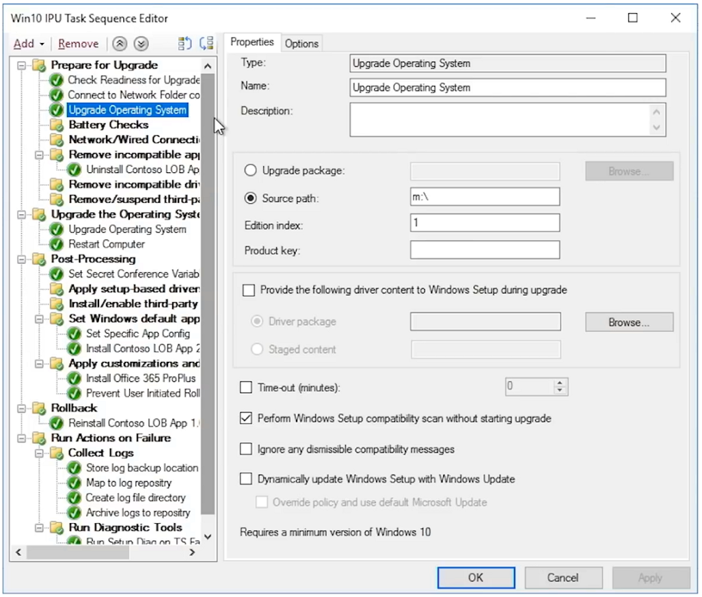

# Geautomatiseerde in-place upgrades van Windows 7 naar Windows 10 voor grote organisaties

Vanaf 14 januari 2020 worden de beveiligingsupdates en ondersteuning voor pc's met Windows 7 niet meer geleverd. Voor de overgang van Windows 7 naar Windows 10 met meerdere opties voor implementatie is een veelgestelde vraag in de IT-community: “Wat is de snelste manier om van Windows 7 over te stappen naar Windows 10?” Het korte antwoord is om in-place upgrades uit te voeren voor bestaande pc's, waarbij u de focus op verschillende aspecten van het implementatieproces van de desktop kunt verkleinen.

Bij het gebruiken van in-place upgrades worden verschillende implementatieprocessen van de desktop enorm beperkt in omvang, met name:

  - **Toepassingsverpakkingen** en het opnieuw leveren van benodigde Line of Business-apps - deze worden simpelweg overgebracht vanuit de Windows 7-omgeving

  - **Bestandsmigratie** en basisinstellingen voor gebruikers - deze worden ook overgenomen van de vorige installatie wanneer dezelfde gebruiker het apparaat behoudt

De grijs weergegeven taken in de bovenstaande afbeelding van het implementatieproces zijn geen items die u volledig kunt negeren, maar om tijd te besparen gaat dit er vanuit dat u uw beveiligingsconfiguratie doorstuurt en uw processen voor software-updates na de implementatie verandert. Wij gaan er vanuit dat de gebruikerstraining voor het Windows-onderdeel grotendeels thuis is uitgevoerd door uw gebruikers, aangezien privé gekochte Windows-computers sinds 2012 voor het grootste deel geen Windows 7 vooraf geïnstalleerd hadden en het grootste deel van de Windows 7-thuissystemen sinds de release van Windows 10 in 2015 ook zijn bijgewerkt naar Windows 10.

## Betrouwbaarheid, beveiliging en omvang van in-place upgrade

In-place upgrades voor Windows 10 zijn een betrouwbare aanpak voor het overzetten van een bestaand apparaat met Windows 7 of een nieuwere versie naar Windows 10, zonder dat bestandsmigratie of het opnieuw installeren van toepassingen nodig is. Na een in-place upgrade komen de bestanden, instellingen en beschikbare apps van de gebruiker overeen met de vorige Windows 7-installatie. Upgrades werken ook als u overstapt van vergelijkbare architecturen (32-bits naar 32-bits of 64-bits naar 64-bits) en vergelijkbare versies van Windows (Professional naar Pro of Enterprise naar Enterprise).

Tijdens het upgradeproces wordt standaard een reservekopie gemaakt van uw vorige Windows-installatie, dus als een upgrade mislukt of een apparaat of toepassing niet correct werkt, kan de computer terugkeren naar Windows 7. De standaardinstelling is dat er tien dagen zijn bijgewerkt. Dit betekent dat u de computer gedurende die periode indien nodig handmatig kunt terugzetten naar Windows 7.

In-place upgrades kunnen worden geautomatiseerd met behulp van implementatiehulpprogramma's voor besturingssystemen zoals [Microsoft Endpoint Configuration Manager](https://docs.microsoft.com/configmgr/osd/deploy-use/create-a-task-sequence-to-upgrade-an-operating-system) of de [Microsoft Deployment Toolkit](https://docs.microsoft.com/windows/deployment/upgrade/upgrade-to-windows-10-with-the-microsoft-deployment-toolkit). In dit artikel vindt u de geautomatiseerde benaderingen en optimalisaties alsook koppelingen naar verwante hulpmiddelen voor extra hulp.

## Een klein aantal computers upgraden

Voor een enkele of klein aantal computers, is de handmatige aanpak voor het upgraden vaak de beste optie ten opzicht van de meer geautomatiseerde methodes. U kunt de benodigde software en licenties vinden in de [Microsoft Store](https://go.microsoft.com/fwlink/p/?LinkId=808282), overige softwarewinkels of het [Volume Licensing Service Center](https://www.microsoft.com/licensing/servicecenter/default.aspx) als u volumelicenties hebt. Voor gedetailleerde informatie over het uitvoeren van een upgrade van een enkele pc naar Windows 10, evenals opties voor het terugzetten na de upgrade, raadpleegt u de [Stapsgewijze handleiding voor het handmatig upgraden van Windows 7 naar Windows 10](https://docs.microsoft.com/microsoft-365/enterprise/windows-7-to-windows-10-upgrade).

## Een upgrade uitvoeren op veel computers

Als u tientallen of duizenden computers beheert, kunt u het beste een in-place upgrade uitvoeren met behulp van geautomatiseerde takenreeksen in de Microsoft Endpoint Configuration Manager of de Microsoft Deployment Toolkit. Hoewel het proces in de meeste gevallen zeer betrouwbaar is, is het afhankelijk van het aantal pc's dat u bijwerkt toch handig om de nodige tests en controles uit te voeren om de upgrade op grote schaal succesvol te voltooien.

Dit houdt in dat u de Directory-gereedheid of taken met betrekking tot de levering van Azure Active Directory-, Office- en Line of Business-apps en verpakking en bestandsmigratie kunt overslaan, aangezien die aspecten worden behouden als onderdeel van de upgrade en de beveiliging op zijn minst doorgevoerd dient te worden. Deze onderdelen kunnen in de loop der tijd allemaal worden uitgebreid.

De optie voor upgrade-implementatie wordt besproken in de [OS Deployment and Feature Updates](https://www.aka.ms/mdd6) en hoewel u eenvoudig oplossingen met scripts kunt bouwen waardoor de installatie van Windows 10 op een geautomatiseerde manier wordt uitgevoerd met een minimale of geen beheerdersinteractie, krijgt u met een takenreeks nauwkeuriger controle voor het:

  - Uitvoeren van controles voorafgaand aan de implementatie,

  - Beheren van de schijfversleutelingsstatus voorafgaand aan de upgrade,

  - De-installeren van bekende problematische stuurprogramma's en apps voorafgaand aan de upgrade,

  - Installeren van aanvullende stuurprogramma's en apps na de upgrade,

  - Beheren van de schijfversleutelingsstatus na de upgrade,

  - Herstellen van een pc naar een vorige status - waar niet-geïnstalleerde apps of stuurprogramma's opnieuw worden geïnstalleerd - in het geval van een mislukte upgrade,

  - Samen met andere dingen die u moet configureren om de pc klaar te maken voor zakelijk gebruik

Onder de meest voorkomende redenen voor het niet-voltooien van een upgrade vallen:

  - Verouderde apparaatstuurprogramma's

  - Schijfversleuteling door derden

  - Code-oplossingen op laag niveau, zoals anit-malware, VPN of virtualisatie

[Sjablonen voor het upgraden van takenreeksen](https://docs.microsoft.com/configmgr/osd/deploy-use/create-a-task-sequence-to-upgrade-an-operating-system) zijn ingebouwd in Microsoft Endpoint Configuration Manager (huidige tak) en zijn beschikbaar voor verschillende versies. In recente versies zijn er belangrijke technologische verbeteringen aan Configuration Manager doorgevoerd, die het proces voor het bepalen van de gereedheid van het apparaat en de Office-compatibiliteit, het verkleinen van het netwerkverkeer en het configureren van nieuwe opties, zoals OneDrive-back-up, nog efficiënter maken. Bekijk deze [show van Microsoft-monteurs](https://youtu.be/CYRnAmCD7ls) voor meer informatie over recente updates voor implementatie van besturingssystemen met Configuration Manager.

Als u geen Microsoft Endpoint Configuration Manager gebruikt, kunt u de Microsoft Deployment Toolkit gebruiken om de takenreeksen voor implementatie van upgrades te maken en uit te voeren.

## Takenreeks upgrades voorafgaand aan de cache

Met de optie [voorafgaand aan de cache](https://docs.microsoft.com/configmgr/osd/deploy-use/create-a-task-sequence-to-upgrade-an-operating-system#configure-pre-cache-content) voor implementatie van de takenreeks van Configuration Manager kunnen clients relevante inhoud van het OS-upgradepakket downloaden voordat het besturingssysteem wordt bijgewerkt met behulp van de takenreeks. Voorheen resulteerde het starten van de takenreeks in het downloaden van pakketinhoud. Inhoud voorafgaand aan de cache geeft u ook de mogelijkheid om alleen het toepasselijke OS-upgradepakket en alle andere inhoud waarnaar wordt verwezen te downloaden, zodra de implementatie wordt ontvangen.

Takenreeksen voorafgaand aan de cache gecombineerd met compatibiliteitsscans

Naast het besparen van tijd bij het downloaden van het pakket, kunt u het upgradepakket vooraf opslaan en Windows Setup gebruiken om te controleren of de in-place upgrade kan worden uitgevoerd voordat de daadwerkelijke Windows-upgrade wordt uitgevoerd. U kunt de syntax voor de opdrachtregel gebruiken om de compatibiliteitsscan op de achtergrond uit te voeren en erachter te komen of het apparaat volgens Windows Setup gereed is voor de upgrade.

Vervolgens worden er logboeken verzonden naar het opgegeven serverpad en wordt Windows Setup niet automatisch weergegeven aan de gebruiker en kan het niet af worden gesloten zonder tussenkomst van de gebruiker.

De resultaten van de logboeken zelf zijn:

1.  Als Setup geen compatibiliteitsproblemen vindt en de pc aan alle vereisten lijkt te voldoen, wordt MOSETUP\_E\_COMPAT\_SCANONLY (0xC1900210) getoond

2.  Als Setup oplosbare compatibiliteitsproblemen vindt, zoals bekende incompatibele apps, wordt MOSETUP\_E\_COMPAT\_INSTALLREQ\_BLOCK (0xC1900208) getoond

3.  Als Setup oordeelt dat de pc niet in aanmerking komt voor Windows 10, wordt MOSETUP\_E\_COMPAT\_SYSREQ\_BLOCK (0xC1900200) getoond

4.  Als Setup oordeelt dat de pc niet voldoende ruimte beschikbaar heeft om te installeren, wordt MOSETUP\_E\_INSTALLDISKSPACE\_BLOCK (0xC190020E) getoond

Wanneer u de volgorde voorafgaande aan de cache met compatibiliteitsscans op een groot aantal pc's in een verzameling hebt geïmplementeerd, kunt u de logboekbestanden voor de gereedheid van het apparaat parseren. Met behulp van de bovengenoemde outputs, kan \#1 (0xC1900210) worden gezien als “klaar voor implementatie” en kan \#4 (0xC190020E) worden opgelost door schijfruimte vrij te maken. U moet voorzichtig zijn met het verwijderen van items, maar Windows Update Cleanup, de prullenbak en tijdelijke bestanden zijn een goede plek om te beginnen en maken in veel gevallen genoeg ruimte vrij om de upgrade te voltooien. Kan de compatibiliteitscontrole zo vaak als nodig uitgevoerd worden tot de pc gereed is voor de in-place upgrade. Meer informatie over de opdrachtregelopties voor Windows Setup vindt u op <https://aka.ms/setupswitches>

## [Desktop Deployment Center](https://aka.ms/howtoshift)
