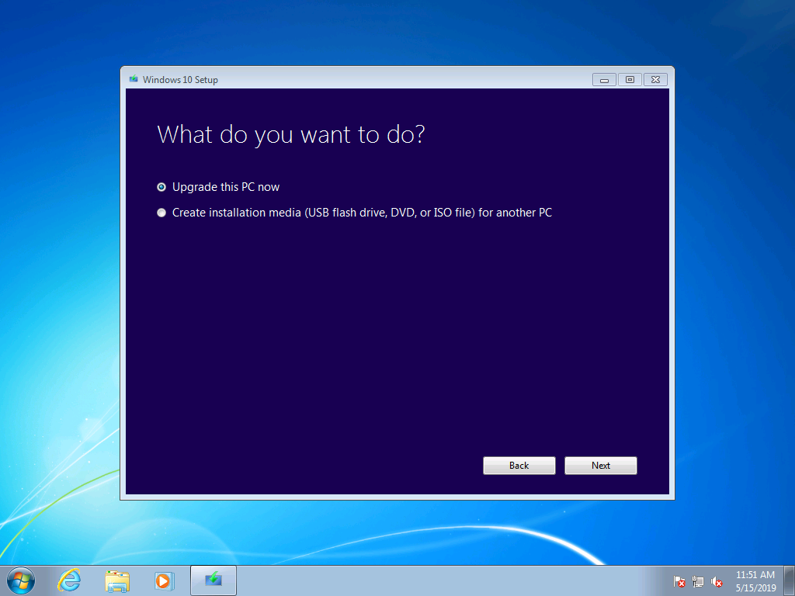
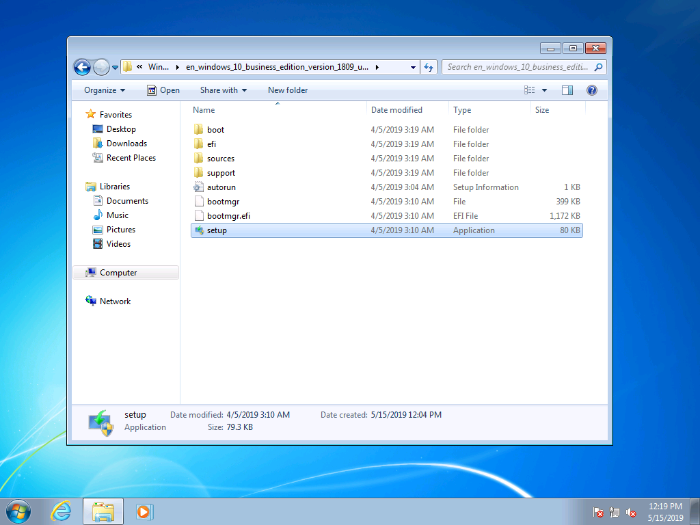
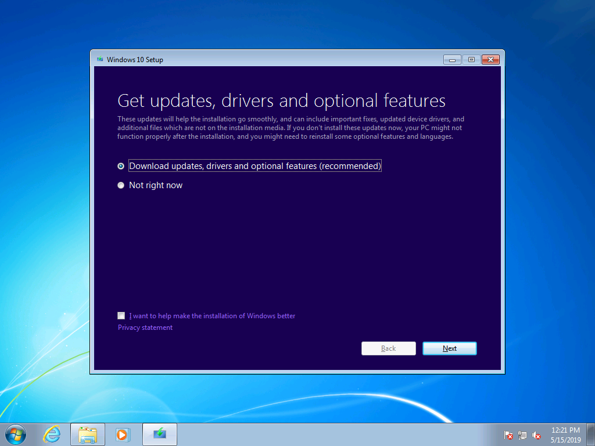
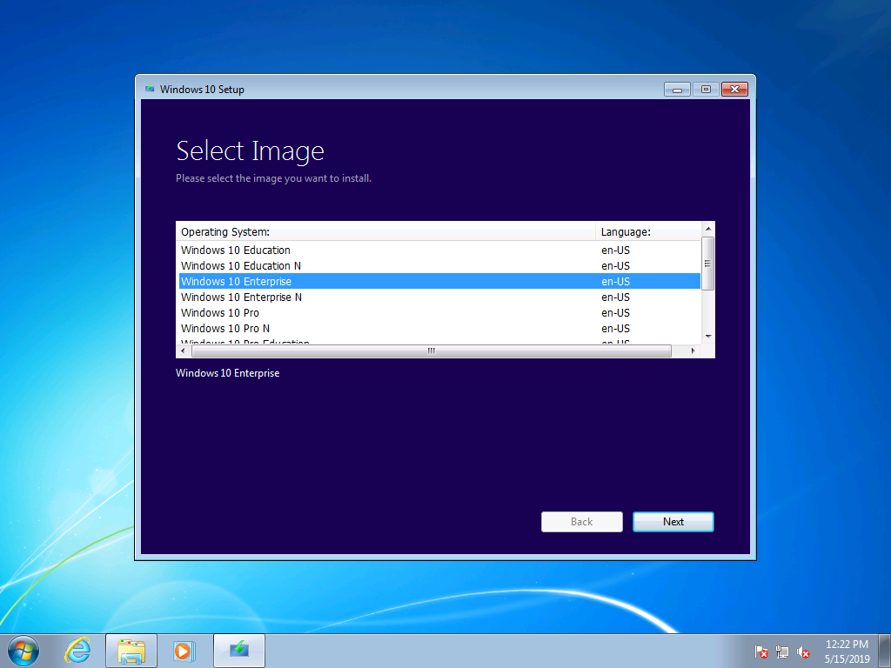
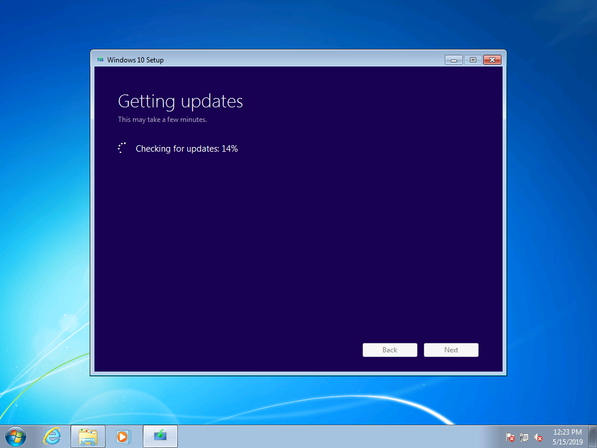
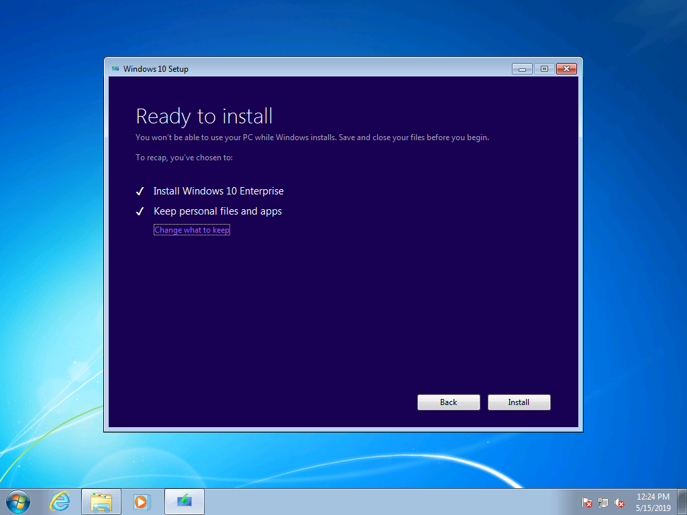
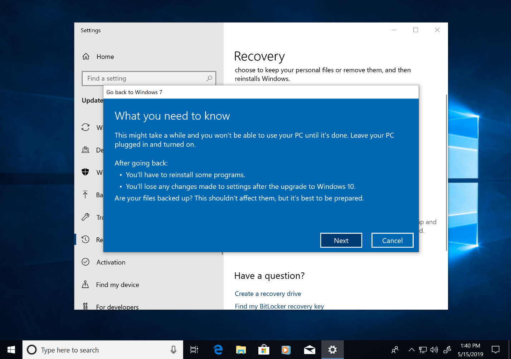
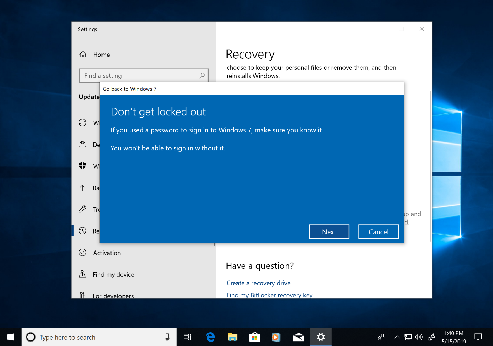

# Stapsgewijze handleiding voor handmatige upgrade van Windows 7 naar Windows 10.

In dit artikel wordt het proces beschreven voor het handmatig upgraden van een pc met Windows 7 Enterprise naar Windows 10 Enterprise. Voor andere Windows 7-versies, zoals Home en Professional, is het proces zeer vergelijkbaar, maar u kunt ook rechtstreeks een upgrade uitvoeren met het hulpprogramma voor het maken van media. Bij upgrades voor elke versie van Windows 7 naar Windows 10 is een geldige productcode en een overeenkomende of nieuwere editie van Windows vereist: u kunt bijvoorbeeld Windows 7 Professional upgraden naar Windows 10 Pro, maar niet naar Windows 10 Home. Windows 7 Ultimate moet worden geüpgraded naar Windows 10 Pro.

## Upgrades naar Windows 10 met behulp van het hulpprogramma voor het maken van media of ISO-bestanden

U kunt rechtstreeks een upgrade naar Windows 10 uitvoeren met behulp van het [hulpprogramma voor het maken van media](https://www.microsoft.com/software-download/windows10ISO) of dit gebruiken om Windows 10 als ISO-bestand te downloaden. U moet weten of uw huidige systeem 32- of 64-bits is, wat de standaardtaal van uw systeem is en de versie van Windows 7 (bijvoorbeeld Home, Professional of Enterprise). In Windows 7 vindt u deze informatie in het Configuratiescherm \>Systeem en beveiliging\> Systeem. Het hulpprogramma voor het maken van media biedt geen ondersteuning voor Windows 10 Enterprise voor upgrades, het maken van installatiemedia of het downloaden van ISO-bestanden. Windows 10 Enterprise is vereist als u een upgrade uitvoert voor Windows 7 Enterprise.

Wanneer u een upgrade uitvoert van Windows 7 Enterprise naar Windows 10 Enterprise, moet u het ISO-bestand voor uw taal en architectuur (32-bits of 64-bits) downloaden vanuit het [Servicecentrum Volumelicenties](https://www.microsoft.com/licensing/servicecenter/default.aspx).

Als u van plan bent om een upgrade uit te voeren met een ISO-bestand, moet u de bestanden in het ISO-bestand uitpakken naar uw lokale bestandssysteem, naar een verwisselbaar station of het ISO-bestand op een dvd branden. U kunt de installatiebestanden in het ISO-bestand uitpakken met een Windows 8-pc of een nieuwere pc en deze bestanden opslaan op een verwisselbaar USB-opslagapparaat of een toepassing gebruiken zoals [7zip](https://www.7-zip.org/) om de inhoud van uw ISO-bestand uit te pakken naar een map op uw lokale station in Windows 7.

Als u de installatiemedia in Windows 7 hebt geïnstalleerd, kunt u de upgrade starten door Setup.exe uit te voeren zoals hieronder weergegeven.

**Belangrijke tip: Voor een in-place upgrade waarin toepassingen en uw gegevens worden gemigreerd naar Windows 10, moet u het proces starten vanuit een actieve sessie met Windows 7. Als u vanaf een dvd of USB-station opstart, hebt u niet de mogelijkheid de apps en bestanden te behouden. In plaats daarvan wordt een schone installatie van Windows 10 uitgevoerd.**

In Windows 10 Setup wordt u begeleid bij het installatieproces. Het eerste scherm bevat een optie voor het downloaden van updates, stuurprogramma's en optionele functies. Dit wordt aanbevolen om het succes van de upgrade te garanderen

Zodra de updates zijn toegepast, gaat Windows 10 Setup naar de volgende fase: Installatiekopie selecteren. Hier moet u uw versie van Windows selecteren. In dit geval, aangezien Windows 7 Enterprise op de pc is geïnstalleerd, selecteert u Windows 10 Enterprise.

In het volgende scherm van Windows 10 Setup worden de toepasselijke kennisgevingen en licentievoorwaarden weergegeven. Wanneer u de kennisgevingen en voorwaarden hebt gelezen en begrepen, klikt u op 'Accepteren' om door te gaan of op 'Afwijzen' om te annuleren.

Nu wordt er gezocht naar extra updates door Windows 10.

Zodra de installatie is voltooid, is Windows 10 Setup gereed om te installeren en het is standaard geconfigureerd voor het installeren van Windows 10 en het behouden van uw persoonlijke bestanden en geïnstalleerde apps. Dit is de aanbevolen optie. Door op 'Wijzigen wat moet worden behouden' te klikken, ziet u extra opties. Klik anders op 'Installeren'.

Als u 'Wijzigen wat moet worden behouden' selecteert, worden de volgende opties weergegeven:

Met 'Alleen persoonlijke bestanden behouden' worden uw geïnstalleerde apps of instellingen van Windows 7 niet naar Windows 10 verplaatst. In plaats daarvan worden alleen uw bestanden en gebruikersaccounts verplaatst naar Windows. Apps moeten later opnieuw worden geïnstalleerd met deze optie. Gebruik deze optie alleen als u zeker weet dat u de vereiste apps opnieuw kunt installeren en configureren nadat Windows is geïnstalleerd, anders houdt u het bij de standaardoptie 'Persoonlijke bestanden en apps behouden'.

Met 'Niets' worden uw bestanden, apps en instellingen verwijderd en een schone installatie van Windows uitgevoerd. Gebruik deze optie alleen als u eerder een back-up hebt gemaakt van de gegevens die u wilt behouden en als u uw apps opnieuw kunt installeren.

Nu worden updates opnieuw opgehaald door Windows 10 Setup op basis van wat u hebt geselecteerd in het vorige scherm.

Windows 10 wordt nu gedurende enkele minuten geïnstalleerd en als u ervoor kiest om uw persoonlijke bestanden en apps te behouden, komt alles in dezelfde bestandslocatie voor en zijn uw apps nu beschikbaar in Windows 10.

## 

## Herstellen in Windows 10

Na de installatie van Windows 10 beschikt u met de optie Herstellen in Windows 10 over maximaal 10 dagen om terug te gaan naar Windows 7. Dit is handig als een apparaat of app op uw systeem niet correct werkt en u moet teruggaan naar de vorige installatie van Windows 7. Na 10 dagen wordt de ruimte die op de harde schijf wordt gebruikt door de herstelbestanden van Windows 7 standaard vrijgemaakt in Windows 10 en worden bestanden van de vorige installatie verwijderd. Hoewel Windows 7 na deze periode wordt verwijderd en Windows 7 niet meer kan worden hersteld, blijven uw apps en persoonlijke bestanden behouden in Windows 10.

Als u het proces om terug te gaan naar Windows 7 wilt starten, gaat u naar Instellingen \> Update & Beveiliging\> Herstel. Selecteer onder Terug naar Windows 7 de optie 'Aan de slag'.

In Windows 10 wordt u gevraagd waarom u terug wilt gaan. Als er een technische reden is, is dit handig om in te vullen om te helpen bij het oplossen van problemen en ervoor te zorgen dat anderen van uw ervaring kunnen leren.

In veel gevallen zijn er updates voor uw versie van Windows 10 uitgegeven. Hiermee kunnen technische problemen worden opgelost. Het wordt aanbevolen om te controleren of er updates zijn en nadat deze zijn gevonden en geïnstalleerd, controleert u vervolgens of de problemen die u ondervond, zijn opgelost.

Als er geen problemen worden opgelost met de updates en u wilt teruggaan naar de vorige installatie van Windows 7, is het mogelijk dat sommige apps opnieuw moeten worden geïnstalleerd, zoals elke app die is geïnstalleerd tijdens de periode dat u Windows 10 hebt gebruikt. Sommige instellingen kunnen mogelijk ook verloren gaan. Het is belangrijk te weten dat bestanden en documenten die u lokaal hebt opgeslagen tijdens het gebruik van Windows 10 blijven staan en voor u beschikbaar blijven zodra u weer in Windows 7 bent. 

Controleer voordat u aan de slag gaat of u een lokaal account of een domeinaccount en wachtwoord klaar hebt liggen van de vorige Windows 7-installatie.

Van hieruit kunt u het proces initiëren om terug te gaan naar Windows 7. Na een paar minuten wordt de PC weer opgestart in Windows 7 met dezelfde ervaring voordat u een upgrade naar Windows 10 uitvoerde.

## Overstappen naar Windows 10 op een nieuwe pc

Een andere aanbevolen optie is om over te stappen naar Windows 10 op een nieuwe pc. Als dit het geval is, kunt u uw bestanden van uw oude computer overbrengen met een back-up in [OneDrive](https://support.office.com/article/b5e918be-0fd4-4095-98da-bceed57f8e0c?ocid=MoveToWindows10), [In Windows ingebouwde back-ups maken en terugzetten](https://support.microsoft.com/help/4469209?ocid=MoveToWindows10), handmatig een [extern opslagapparaat](https://support.microsoft.com/help/4465814/windows-7-move-files-off-pc-with-an-external-storage-device?ocid=MoveToWindows10) gebruiken of hulpprogramma's zoals [PCmover Express van LapLink](https://www.microsoft.com/windows/transfer-your-data). Met een van deze opties moet u nog steeds eventuele vereiste toepassingen die geen deel uitmaken van Windows 10 opnieuw installeren. Als u meer wilt weten over de opties voor het handmatig overstappen van een bestaande pc met Windows 7 naar een nieuwe pc met Windows 10, raadpleegt u [Overstappen op een Windows 10-pc](https://support.microsoft.com/help/4229823?ocid=MoveToWindows10) in Windows-ondersteuning.

## [Desktop Deployment Center](https://aka.ms/howtoshift) (Implementatiecentrum voor desktops)
