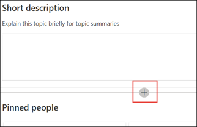

# Een nieuw onderwerp maken (preview)Create a new topic (Preview)

> [!Note] 
> De inhoud in dit artikel is bedoeld voor project cortex private preview.The content in this article is for Project Cortex Private Preview. [Meer informatie over Project Cortex](https://aka.ms/projectcortex).[Find out more about Project Cortex](https://aka.ms/projectcortex).

In het onderwerp kunt u een nieuw onderwerp maken als het niet is gevonden via indexeren of als de AI-technologie niet voldoende bewijs heeft gevonden om dit als onderwerp te verkrijgen.In Topic Experiences, you can create a new topic if one was not discovered through indexing or if the AI technology did not find enough evidence to establish it as a topic.

## VereistenRequirements

Als u een nieuw onderwerp wilt maken, moet u het volgende doen:To create a new topic, you need to:
- Laat een licentie.Have a Topic Experiences license.
- Machtigingen hebben voor [**wie onderwerpen kunnen maken of bewerken**](https://docs.microsoft.com/microsoft-365/knowledge/topic-experiences-user-permissions).Have permissions to [**Who can create or edit topics**](https://docs.microsoft.com/microsoft-365/knowledge/topic-experiences-user-permissions). Kennis beheerders kunnen aan deze machtiging gebruikers machtigen voor de instellingen van de machtigingen van het onderwerp van het kennis netwerk.Knowledge admins can give users this permission in the Knowledge Network topic permissions settings. 

> [!Note] 
> Gebruikers die gemachtigd zijn om onderwerpen te beheren in het onderwerp centrum (kennis beheerders), hebben al machtigingen voor het maken en bewerken van onderwerpen.Users who have permission to manage topics in the Topic center (knowledge managers) already have permissions to create and edit topics.

## Een nieuw onderwerp maken:To create a new topic:

1. Selecteer op de pagina onderwerp centrum de optie **Nieuw** en selecteer vervolgens **onderwerpenpagina**.On the Topic center page, select **New**, then select **Topic Page**. Als u de optie **Nieuw** niet ziet in het onderwerp centrum, beschikt u mogelijk niet over de vereiste machtigingen.If you are not able to see the **New** option in the Topic Center, you may not have the required permissions.

    

2. Op de nieuwe pagina voor het onderwerp kunt u de gegevens invullen van de nieuwe sjabloon:On the new topic page, you can fill in the information on the new topic template:

    - Typ in het gedeelte **naam van dit onderwerp** de naam van het nieuwe onderwerp.In the **Name this topic** section, type the name of the new topic.
    
    - Typ in de sectie **alternatieve namen** de namen of acroniemen die ook worden gebruikt om het onderwerp te raadplegen.In the **Alternate names** section, type names or acronyms that are also used to refer to the topic.
    
    - Typ in het gedeelte **korte beschrijving** de beschrijving van een of twee zinnen van het onderwerp.In the **Short description** section, type a one or two sentence description of the topic. Deze tekst wordt gebruikt voor het bijbehorende onderwerpvenster.This text will be used for the associated topic card.
    
    - Typ in de sectie **personen** de namen van de experts voor het onderwerp.In the **People** section, type the names of subject matter experts for the topic. Personen die u handmatig aan het onderwerp toevoegt, worden weergegeven op de onderwerpenpagina als **vastgemaakte personen**.People you manually add to the topic will display in the topic page as **Pinned people**.
    
    - Selecteer in de sectie **bestanden en pagina's** de optie **toevoegen** en op de volgende pagina kunt u de bijbehorende OneDrive-bestanden of SharePoint Online-pagina's selecteren.In the **Files and pages** section, select **Add** and then on the next page you can select associated OneDrive files or SharePoint Online pages.
    
    - Selecteer in de sectie **sites** de optie **toevoegen**.In the **Sites** section, select **Add**. Selecteer de sites die zijn gekoppeld aan het onderwerp in het deelvenster  **sites** dat wordt weergegeven.In the  **Sites** pane that displays, select the sites that are associated to the topic.

    
    
3. Als u andere onderdelen aan de pagina wilt toevoegen, zoals tekst, afbeeldingen, webonderdelen, koppelingen, enzovoort, selecteert u het canvas pictogram in het midden van de pagina om deze te zoeken en toe te voegen.If you need to add other components to the page, such as text, images, web parts, links, etc., select the canvas icon in the middle of the page to locate and add them.

    

4. Wanneer u klaar bent, selecteert u **publiceren** om de onderwerpenpagina te publiceren.When you are done, select **Publish** to publish the topic page. Gepubliceerde topic pagina's worden weergegeven op het tabblad **pagina's** .Published topic pages will display in the **Pages** tab.

Nadat u het artikel hebt gepubliceerd, worden de onderwerpnaam, de naam, de beschrijving en de vastgemaakte personen weergegeven aan alle gebruikers met een licentie die het artikel bekijken.After you publish the article, the topic name, alternate name, description, and pinned people will display to all licensed users who view the article. Bestanden, pagina's en sites worden alleen weergegeven op de onderwerpenpagina als de viewer Office 365-machtigingen voor het item heeft.Files, pages, and sites will only appear in the topic page if the viewer has Office 365 permissions to the item. 

De nieuwe topic wordt gemaakt van webonderdelen die bekend zijn met het *kennis netwerk*.The new topic page is made up of web parts that are *knowledge network aware*. Dit betekent dat zo veel meer informatie over het onderwerp wordt verzameld, maar de informatie in deze webonderdelen wordt bijgewerkt met suggesties om de pagina nuttiger te maken voor gebruikers.This means that as AI gathers more information on the topic, the information in these web parts will be updated with suggestions to make the page more useful to users.

## Zie ookSee also

  

