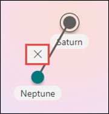

# Een nieuw onderwerp maken in Microsoft Viva-onderwerpen

In Viva-onderwerpen kunt u een nieuw onderwerp maken als een onderwerp niet wordt gevonden via indexering of als de AI-technologie onvoldoende bewijs heeft gevonden om het als een onderwerp vast te stellen.

> [!Note] 
> Hoewel de informatie in een onderwerp dat door AI [wordt](topic-experiences-security-trimming.md)verzameld, is bijgesneden in de beveiliging, moet u er rekening mee houden dat de beschrijving van het onderwerp en de informatie over personen in een handmatig gemaakt onderwerp zichtbaar is voor alle gebruikers die machtigingen hebben om het onderwerp te bekijken. 

## Vereisten

Als u een nieuw onderwerp wilt maken, moet u het volgende doen:
- Een licentie voor Viva-onderwerpen hebben.
- Machtigingen hebben om te [**Wie onderwerpen kunnen maken of bewerken.**](./topic-experiences-user-permissions.md) Kennisbeheerders kunnen gebruikers deze machtiging geven in de instellingen voor onderwerpmachtigingen van Viva Topics. 

> [!Note] 
> Gebruikers die zijn machtigingen voor het beheren van onderwerpen in het onderwerpcentrum (kennisbeheerders) hebben al machtigingen voor het maken en bewerken van onderwerpen.

## Een onderwerp maken

U kunt een nieuw onderwerp maken op twee locaties:

- Startpagina onderwerpcentrum: Elke gelicentieerde gebruiker met de **Wie** kan onderwerpenmachtigingen (inzenders) maken  of bewerken door het menu Nieuw te selecteren en de pagina Onderwerp te **selecteren.** 

      

- Pagina Onderwerpen beheren: Elke gelicentieerde gebruiker met **Wie** kan de machtiging onderwerpen (kennisbeheerders) beheren door een nieuw onderwerp te maken op de pagina Onderwerpen beheren in het onderwerpcentrum door Nieuwe onderwerppagina **te selecteren.** 

      

### Een nieuw onderwerp maken:

1. Selecteer de optie om een nieuwe onderwerppagina te maken op het lint op de pagina Onderwerpen beheren.

2.  Typ in **de sectie Naam** van dit onderwerp de naam van het nieuwe onderwerp.

      

3. Typ in **de sectie Alternatieve** namen eventuele andere namen waar het onderwerp naar kan worden verwezen. 

      

4. Typ in **de** sectie Beschrijving een paar zinnen waarin het onderwerp wordt beschreven. 

    

4. In de **sectie Vastgemaakte** personen kunt u een persoon 'vastmaken' om aan te geven dat deze een verbinding met het onderwerp heeft (bijvoorbeeld een eigenaar van een verbonden resource). Typ eerst de naam of het e-mailadres in het vak **Een** nieuwe gebruiker toevoegen en selecteer vervolgens de gebruiker die u wilt toevoegen in de zoekresultaten. U kunt ze ook 'losmaken' door het pictogram Verwijderen **uit lijst** op de gebruikerskaart te selecteren. U kunt de persoon ook naar een andere plaats in de lijst slepen.
 
    

5. In de **sectie Vastgemaakte** bestanden en pagina's kunt u een bestand of SharePoint sitepagina toevoegen of 'vastmaken' die aan het onderwerp is gekoppeld.

   
 
    Als u een nieuw bestand wilt toevoegen, selecteert u **Toevoegen,** selecteert u de SharePoint site op uw sites Frequent of Gevolgd en selecteert u het bestand in de documentbibliotheek van de site.

    U kunt ook de optie **Van een koppeling gebruiken** om een bestand of pagina toe te voegen door de URL op te geven. 

    > [!Note] 
    > Bestanden en pagina's die u toevoegt, moeten zich binnen dezelfde tenant Microsoft 365 bevinden. Als u een koppeling wilt toevoegen naar een externe resource in het onderwerp, kunt u deze toevoegen via het canvaspictogram in stap 8.

6.  In **de sectie Gerelateerde sites** ziet u sites met informatie over het onderwerp. 

    

    U kunt een gerelateerde site toevoegen door **Toevoegen** te selecteren en vervolgens naar de site te zoeken of deze te selecteren in uw lijst met veelgebruikte of recente sites.
    
    

7. In **de sectie Gerelateerde** onderwerpen ziet u verbindingen tussen onderwerpen. U kunt een verbinding met een ander onderwerp toevoegen door de Verbinding maken te selecteren op een gerelateerde **onderwerpknop** en vervolgens de naam van het gerelateerde onderwerp te typen en deze te selecteren in de zoekresultaten. 

     

    Vervolgens kunt u een beschrijving geven van de manier waarop de onderwerpen zijn gerelateerd en selecteert u **Bijwerken.**

    

   Het gerelateerde onderwerp dat u hebt toegevoegd, wordt weergegeven als een verbonden onderwerp.

    

   Als u een gerelateerd onderwerp wilt verwijderen, selecteert u het onderwerp dat u wilt verwijderen en selecteert u vervolgens het **pictogram Onderwerp** verwijderen.
 
     

   Selecteer vervolgens **Verwijderen.**

    

8. U kunt ook statische items toevoegen aan de pagina (zoals tekst, afbeeldingen of koppelingen) door het canvaspictogram te selecteren, dat u onder de korte beschrijving kunt vinden. Als u dit selecteert, wordt SharePoint de werkset geopend waaruit u het item kunt kiezen dat u aan de pagina wilt toevoegen.

    

9. Selecteer **Publiceren om** uw wijzigingen op te slaan. 

Nadat u de pagina hebt gepubliceerd, worden de onderwerpnaam, alternatieve naam, beschrijving en vastgemaakte personen weergegeven voor alle gelicentieerde gebruikers die het onderwerp bekijken. Specifieke bestanden, pagina's en sites worden alleen weergegeven op de onderwerppagina als de viewer Office 365 machtigingen voor het item heeft. 

## Zie ook

