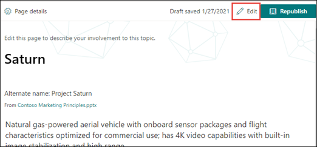
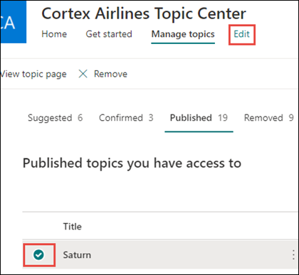
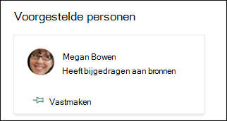
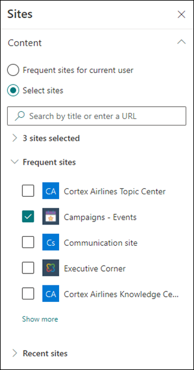

# Een bestaand onderwerp bewerken in Microsoft Viva-onderwerpen 

 

> [!VIDEO https://www.microsoft.com/videoplayer/embed/RE4LA4n]  

 

In Viva-onderwerpen kunt u een bestaand onderwerp bewerken. Mogelijk moet u dit doen als u aanvullende informatie wilt corrigeren of toevoegen aan een bestaande onderwerppagina. 

> [!Note] 
> Hoewel informatie in een onderwerp dat door AI [wordt](topic-experiences-security-trimming.md)verzameld, is bijgesneden in de beveiliging, zijn de onderwerpbeschrijving en de informatie over personen die u handmatig toevoegt bij het bewerken van een bestaand onderwerp zichtbaar voor alle gebruikers die over machtigingen voor het weergeven van onderwerpen zijn. 

## Vereisten

Als u een bestaand onderwerp wilt bewerken, moet u het volgende doen:
- Een licentie voor Viva-onderwerpen hebben.
- Hebt u machtigingen voor [het maken of bewerken van onderwerpen.](./topic-experiences-user-permissions.md) Kennisbeheerders kunnen gebruikers deze machtiging geven in de instellingen voor onderwerpmachtigingen van Viva Topics. 

> [!Note] 
> Gebruikers die zijn machtigingen voor het beheren van onderwerpen in het onderwerpcentrum (kennisbeheerders) hebben al machtigingen voor het maken en bewerken van onderwerpen.

## Een onderwerppagina bewerken

Gebruikers met de *Wie* kunnen onderwerpenmachtigingen maken of bewerken, kunnen een onderwerp bewerken door  de onderwerppagina te openen vanuit een onderwerp markeren en vervolgens de knop Bewerken rechtsboven op de onderwerppagina te selecteren. De onderwerppagina kan ook worden geopend vanaf de startpagina van het onderwerpcentrum, waar u alle onderwerpen kunt vinden waar u verbinding mee hebt.

      

Kennisbeheerders kunnen onderwerpen ook rechtstreeks bewerken vanaf **de pagina** Onderwerpen beheren door het onderwerp te selecteren en vervolgens Bewerken te **selecteren** op de werkbalk.

   

### Een onderwerppagina bewerken

1. Selecteer bewerken op de **onderwerppagina.** Op deze manier kunt u zo nodig wijzigingen aanbrengen in de onderwerppagina.

     

2. Typ in **de sectie Alternatieve** namen eventuele andere namen waar het onderwerp naar kan worden verwezen. 

    

3. Typ in **de** sectie Beschrijving een paar zinnen waarin het onderwerp wordt beschreven. Of als er al een beschrijving bestaat, kunt u deze indien nodig bijwerken.

     

4. In de **sectie Vastgemaakte** personen kunt u een persoon 'vastmaken' om aan te geven dat deze een verbinding heeft met het onderwerp (bijvoorbeeld een eigenaar van een verbonden resource). Typ eerst de naam of het e-mailadres in het vak **Nieuwe** gebruiker toevoegen en selecteer vervolgens de gebruiker die u wilt toevoegen in de zoekresultaten. U kunt ze ook 'losmaken' door het pictogram Verwijderen **uit lijst** op de gebruikerskaart te selecteren.
 
     

    In **de sectie Voorgestelde** personen ziet u gebruikers die denken dat AI mogelijk verbonden is met het onderwerp vanuit hun verbinding met bronnen over het onderwerp. U kunt de status wijzigen van Voorgesteld in Vastgemaakt door het pictogram vast te selecteren op de gebruikerskaart.

   

5. In de **sectie Vastgemaakte** bestanden en pagina's kunt u een bestand of SharePoint sitepagina toevoegen of 'vastmaken' die aan het onderwerp is gekoppeld.

   
 
    Als u een nieuw bestand wilt toevoegen, selecteert u **Toevoegen,** selecteert u de SharePoint site op uw sites Frequent of Gevolgd en selecteert u het bestand in de documentbibliotheek van de site.

    U kunt ook de optie **Van een koppeling gebruiken** om een bestand of pagina toe te voegen door de URL op te geven. 

   > [!Note] 
   > Bestanden en pagina's die u toevoegt, moeten zich binnen dezelfde tenant Microsoft 365 bevinden. Als u een koppeling wilt toevoegen naar een externe resource in het onderwerp, kunt u deze toevoegen via het canvaspictogram in stap 9.

6. In **de sectie Voorgestelde bestanden en** pagina's worden bestanden en pagina's weergegeven die volgens AI aan het onderwerp zijn gekoppeld.

   

    U kunt een voorgesteld bestand of pagina wijzigen in een vastgemaakt bestand of pagina door het vastgemaakte pictogram te selecteren.

7.  In de **sectie Vastgemaakte sites** kunt u een site toevoegen of 'vastmaken' die aan het onderwerp is gekoppeld. 

    

    Als u een nieuwe site wilt toevoegen, **selecteert** u Toevoegen en zoekt u naar de site of selecteert u deze in uw lijst met veelgebruikte of recente sites.
    
    

8. In **de sectie Voorgestelde** sites ziet u de sites die volgens AI aan het onderwerp zijn gekoppeld. 

     

    U kunt een voorgestelde site wijzigen in een vastgemaakte site door het vastgemaakte pictogram te selecteren.

<!---

7.  The <b>Related sites</b> section shows sites that have information about the topic. 

     

    You can add a related site by selecting <b>Add</b> and then either searching for the site, or selecting it from your list of Frequent or Recent sites. 
    
     

8. The <b>Related topics</b> section shows connections that exists between topics. You can add a connection to a different topic by selecting the <b>Connect to a related topic</b> button, and then typing the name of the related topic, and selecting it from the search results. 

      

    You can then give a description of how the topics are related, and select <b>Update</b>. 

     

   The related topic you added will display as a connected topic.

     

   To remove a related topic, select the topic you want to remove, then select the <b>Remove topic</b> icon. 
 
      

   Then select <b>Remove</b>. 

     

--->

9. U kunt ook statische items toevoegen aan de pagina, zoals tekst, afbeeldingen of koppelingen, door het canvaspictogram te selecteren, dat u onder de korte beschrijving kunt vinden. Als u dit selecteert, wordt SharePoint de werkset geopend waaruit u het item kunt kiezen dat u aan de pagina wilt toevoegen.

   

10. Selecteer **Publiceren of** Opnieuw publiceren **om** uw wijzigingen op te slaan. **Opnieuw publiceren** is de beschikbare optie als het onderwerp eerder is gepubliceerd.

