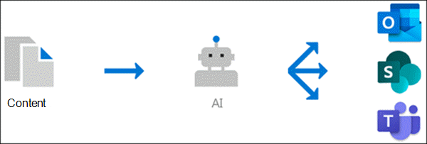

# Overzicht van kennisbeheer (preview)Knowledge management Overview (Preview)

> [!Note] 
> De inhoud in dit artikel is bedoeld voor project cortex private preview.The content in this article is for Project Cortex Private Preview. [Meer informatie over Project Cortex](https://aka.ms/projectcortex).[Find out more about Project Cortex](https://aka.ms/projectcortex).

Knowledge Management gebruikt Microsoft AI-technologie, Microsoft 365, Delve, Search en andere onderdelen en services voor het maken van een kennis netwerk in uw Microsoft 365-omgeving.Knowledge management uses Microsoft AI technology, Microsoft 365, Delve, Search, and other components and services to build a knowledge network in your Microsoft 365 environment. 

      

Het is van doel om informatie te verstrekken aan gebruikers in apps die ze dagelijks gebruiken, zoals Outlook, teams en SharePoint.It's goal is to deliver information to you users in apps they use everyday, such as Outlook, Teams, and SharePoint.

Gebruikers zien bijvoorbeeld onbekende voorwaarden in hun e-mailberichten, SharePoint-sites of in team gesprekken waarover ze meer willen weten.For example, users see unfamiliar terms in their emails, SharePoint sites, or in Teams conversations, that they want to know more about. Met de functie AI kunt u met AI automatisch zoeken naar en identificeren van deze onderwerpen, en informatie over deze **onderwerpen**samenstellen, zoals een korte beschrijving, onderhevige experts voor het onderwerp en sites, bestanden en pagina's die hieraan zijn gerelateerd.Knowledge management uses AI to automatically searches for and identifies these **topics**, and compiles information about them, such as a short description, subject matter experts on the topic, and sites, files, and pages that are related to it. U kunt ervoor kiezen om de informatie over het onderwerp naar wens bij te werken.You can choose to update the topic information as needed. Vervolgens kunt u de beschikbare onderwerpen voor uw gebruikers maken, wat inhoudt voor elk exemplaar van het onderwerp dat wordt weergegeven in apps zoals Outlook, teams en SharePoint, wordt de tekst gemarkeerd.You can then make the topics available to your users, which means that for every instance of the topic that appears in apps such as Outlook, Teams, and SharePoint, the text will be highlighted. Gebruikers kunnen kiezen om het onderwerp te selecteren, waarover u meer wilt weten over de details van het onderwerp.Users can choose to select the topic to learn more about it through the topic details.

## Onderwerp detecterenTopic discovery

Knowledge Management gebruikt Microsoft AI-technologie om te zoeken naar **onderwerpen** in uw Office 365-omgeving.Knowledge Management uses Microsoft AI technology to search for **topics** in your Office 365 environment.

Een onderwerp is een woordgroep of term die in de organisatie belangrijk of belangrijk is.A topic is a phrase or term that is organizationally significant or important. Deze heeft een specifieke betekenis van de organisatie en bevat bronnen die hieraan kunnen werken zodat ze meer informatie kunnen vinden.It has a specific meaning to the organization, and has resources related to it that can help people understand what it is and find more information about it.

Wanneer een onderwerp wordt gedetecteerd, wordt er een **onderwerp** gemaakt voor de site met informatie die is verzameld via de detectie van het onderwerp, zoals:When a topic is discovered, a **topic page** is created for it that contains information that was gathered through topic discovery, such as:

- Een korte beschrijving van het onderwerp.A short description of the topic.
- Gebruikers die misschien informatie willen over het onderwerp.Users who might be knowledgeable about the topic.
- Bestanden, pagina's en sites die zijn gerelateerd aan het onderwerp.Files, pages, and sites that are related to the topic.

## Onderwerp beherenTopic management

Het beheer van het onderwerp wordt uitgevoerd in het **onderwerp centrum**van uw organisatie.Topic management is done in your organization's **topic center**. De site centrum site wordt tijdens de installatie gemaakt en fungeert als uw kennis punt voor uw organisatie.The topic center site is created during setup and serves as your center of knowledge for your organization. Het bevat een lijst met alle onderwerpen die zijn gevonden in uw omgeving, en alle topic pagina's die zijn gemaakt voor deze onderwerpen.It will contain a list of all topics that were discovered in your environment, as well as all topic pages that were created for these topics. 

Gebruikers die de juiste machtigingen hebben, kunnen het volgende doen in het onderwerp:Users who are provided the correct permissions will be able to do the following in the topic center:

- Onderwerpen die zijn gevonden in de Tenant bevestigen of negeren.Confirm or reject topics that were discovered in your tenant.
- Maak handmatig nieuwe onderwerpen om zo nodig handmatig te maken (als u bijvoorbeeld niet voldoende informatie hebt opgegeven om te ontdekken via AI).Create new topics manually as needed (for example, if not enough information was provided for it to be discovered through AI).
- Bestaande topic pagina's bewerken.Edit existing topic pages. 

Zie [werken met onderwerpen in het onderwerp centrum](work-with-topics.md) voor meer informatie.See [Work with topic in the topic center](work-with-topics.md) for more information.  

## Beheerders besturingselementenAdmin controls

Met beheer besturingselementen in het Microsoft 365-Beheercentrum kunt u uw kennis netwerk beheren.Admin controls in the Microsoft 365 admin center  allow you to manage your knowledge network. Een Microsoft 365-beheerder of SharePoint-beheerder kan het volgende doen:They allow a Microsoft 365 global or SharePoint admin to:

- Bepalen welke gebruikers in uw organisatie de functies van de clienttoepassingen of in zoekresultaten van SharePoint mogen zien.Control which users in your organization are allowed to see topics in their client apps or in SharePoint search results.
- Bepalen welke SharePoint-sites worden verkend om naar onderwerpen te zoeken.Control which SharePoint sites will be crawled to search for topics.
- U kunt zoeken naar specifieke voorwaarden uitsluiten die u niet wilt opnemen in een onderwerp.Configure topic discovery to exclude specific terms that you don't want to be a topic.
- Bepalen welke gebruikers onderwerpen in het onderwerp centrum kunnen bevestigen of afwijzen.Control which users can to confirm or reject topics in the topic center.
- Bepalen welke gebruikers onderwerpen kunnen maken en bewerken in het onderwerp centrum.Control which users can create and edit topics in the topic center.

Zie [uw kennis netwerk beheren](manage-knowledge-network.md) voor meer informatie.See [Manage your knowledge network](manage-knowledge-network.md) for more information. 

## Onderwerp-curatorTopic curation

AI biedt voortdurend suggesties voor het verbeteren van uw onderwerpen wanneer er wijzigingen worden aangebracht in uw omgeving.AI will continually work to provide you suggestions to improve your topics as changes occur in your environment.

Gebruikers die u toegang wilt geven tot de onderwerpen op hun dagelijkse werk, kunnen suggesties doen om ze te verbeteren.Users who you allow access to see topics in their daily work are allowed to make suggestions to improve them. Als een gebruiker bijvoorbeeld de onderwerpenpagina weergeeft en informatie ziet die niet klopt of die moet worden toegevoegd, kunt u met een koppeling op de onderwerpenpagina een aanvraag indienen om de informatie bij te werken.For example, if a user views the topic page and sees information that is incorrect or needs to be added, a link on the topic page allows them to submit a request to update the information.

Daarnaast kunnen gebruikers met de juiste machtigingen items markeren zoals teams-gesprek dat relevant is voor een onderwerp en ze aan een specifiek onderwerp toevoegen.Additionally, users with proper permissions can tag items such as Teams conversation that are relevant to a topic, and add them to a specific topic.

## Zie ookSee also
[Kennisbeheer instellenSet up knowledge management](set-up-knowledge-network.md) 
[Overzicht van topic CenterTopic center overview](topic-center-overview.md)
