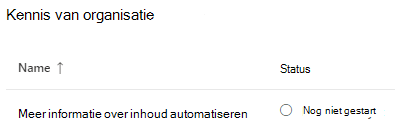
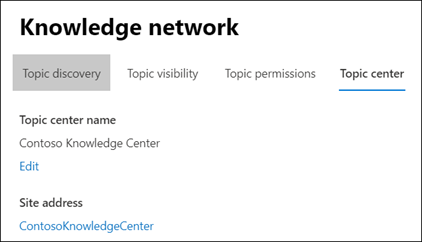
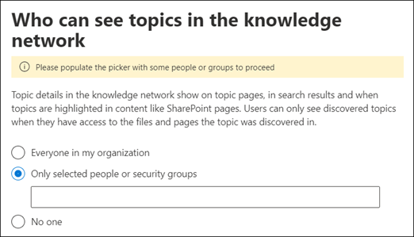

# Beheer uw kennisbeheernetwerk (Preview)

> [!Note] 
> De inhoud in dit artikel is voor Project Cortex Private Preview. [Lees meer over Project Cortex](https://aka.ms/projectcortex).

Nadat u kennisbeheer hebt [ingesteld,](set-up-knowledge-network.md)kan een beheerder op elk gewenst moment daarna uw configuratie-instellingen aanpassen via het Microsoft 365-beheercentrum.

Het kan bijvoorbeeld nodig zijn om uw instellingen aan te passen voor een van de volgende opties:
- Voeg nieuwe SharePoint-bronnen toe aan mijnonderwerpen.
- Wijzig welke gebruikers toegang hebben tot onderwerpen.
- Wijzig welke gebruikers machtigingen hebben om taken uit te voeren in het onderwerpcentrum.
- De naam van uw onderwerpcentrum wijzigen

## Vereisten 
U moet globale beheerders- of SharePoint-beheerdersmachtigingen hebben om toegang te krijgen tot het Microsoft 365-beheercentrum en organisatorische kennistaken te beheren.

## Ga alst u naar instellingen voor kennisbeheer:

1. Selecteer **Setup**in het Microsoft 365-beheercentrum en bekijk de sectie **Organisatiekennis.**
2. Klik in de sectie **Organisatorische kennis** op **Mensen verbinden met kennis.** 

      

3. Selecteer **beheren** om het deelvenster **Instellingen** voor kennis te openen op de pagina Personen verbinden **met kennis.** 

      

## Wijzigen hoe het kennisnetwerk onderwerpen kan vinden

Selecteer het tabblad **Onderwerpdetectie** als u uw keuzes voor SharePoint-onderwerpbronnen wilt bijwerken. Met deze instelling u de SharePoint-sites in uw tenant selecteren die worden gecrawld en gedolven voor onderwerpen.

1. Selecteer op het tabblad **Onderwerpdetectie** onder **SharePoint-onderwerpbronnen selecteren**de optie **Bewerken**.
2. Selecteer op de pagina **SharePoint-onderwerpbronnen** selecteren welke SharePoint-sites tijdens de detectie als bronnen voor uw onderwerpen worden gecrawld. Dit omvat: 
    a. **Alle sites:** Alle SharePoint-sites in uw tenant. Dit vangt huidige en toekomstige sites. 
    b. **Alles, behalve geselecteerde sites:** Typ de namen van de sites die u wilt uitsluiten.  U ook een lijst uploaden met sites die u wilt afmelden voor detectie. Sites die in de toekomst zijn gemaakt, worden opgenomen als bronnen voor onderwerpdetectie.  
    c. **Alleen geselecteerde sites**: Typ de namen van de sites die u wilt opnemen. U ook een lijst met sites uploaden. Sites die in de toekomst zijn gemaakt, worden niet opgenomen als bronnen voor onderwerpdetectie.  

      
   
    Als u een aantal sites hebt die u wilt uitsluiten (als u **Alles selecteert, behalve geselecteerde sites)** of opneemt (als u Alleen geselecteerde sites **hebt**geselecteerd), u ervoor kiezen om een CSV-bestand te uploaden met de sitenamen en URL's. U **sitesjabloon downloaden (csv)** selecteren als u het CSV-sjabloonbestand wilt gebruiken.

3. Klik op **Opslaan**.

##  Wijzigen wie onderwerpen in uw organisatie kan zien

Selecteer het tabblad **Onderwerpdetectie** als u wilt bijwerken wie in uw organisatie gedetecteerde onderwerpen in zoekresultaten kan zien en wanneer onderwerpen worden gemarkeerd in inhoud zoals SharePoint-pagina's.

1. Selecteer op het tabblad **Onderwerpdetectie** onder **Wie onderwerpen in het kennisnetwerk kan zien**de optie **Bewerken**.
2. Op de pagina Wie kan onderwerpen zien op de pagina **kennisnetwerk,** kiest u wie toegang heeft tot onderwerpdetails, zoals gemarkeerde onderwerpen, onderwerpkaarten, onderwerpantwoorden in zoekopdrachten en onderwerppagina's. U kiezen: 
    a. **Iedereen in uw organisatie** 
    b. **Alleen geselecteerde personen of beveiligingsgroepen** 
    c. **Niemand.** 

       
3. Klik op **Opslaan**.  
 
> [!Note] 
> Met deze instelling u een gebruiker in uw organisatie selecteren, maar alleen gebruikers die kennisbeheerlicenties aan hen hebben toegewezen, kunnen onderwerpen bekijken.

## Wijzigen wie machtigingen heeft om taken uit te voeren in het onderwerpcentrum

Selecteer het tabblad **Onderwerpmachtigingen** als u wilt bijwerken wie machtigingen heeft om het volgende te doen op de pagina met onderwerpcentrum:

- Welke gebruikers onderwerpen kunnen maken en bewerken: maak nieuwe onderwerpen die niet zijn gevonden tijdens de detectie of bewerk bestaande onderwerppaginadetails.
- Welke gebruikers onderwerpen kunnen beheren: Ontdekte onderwerpen bevestigen of afwijzen.

Ga als u aan de informatie over wie machtigingen heeft om onderwerpen te maken en te bewerken:

1. Selecteer op het tabblad **Onderwerpmachtigingen** onder **Wie onderwerpen kan maken en bewerken**de optie **Bewerken**. 
2. Op de pagina **Wie kan onderwerpen maken en bewerken,** u het: 
    a. **Iedereen in uw organisatie** 
    b. **Alleen geselecteerde personen of beveiligingsgroepen** 

       

3. Klik op **Opslaan**. 

Ga als u als gaat over het bijwerken van wie machtigingen heeft om onderwerpen te beheren:

1. Selecteer op het tabblad **Onderwerpmachtigingen** onder **Wie onderwerpen kan beheren**de optie **Bewerken**. 
2. Op de pagina **Wie kan onderwerpen beheren,** u het: 
    a. **Iedereen in uw organisatie** 
    b. **Geselecteerde personen of beveiligingsgroepen** 

       

3. Klik op **Opslaan**. 

##  De naam van het onderwerpcentrum bijwerken

Selecteer het tabblad **Onderwerpcentrum** als u de naam van het onderwerpcentrum wilt bijwerken. 

1. Selecteer op het tabblad **Onderwerpcentrum** onder **Naam van het onderwerpcentrum**de optie **Bewerken**.
2. Typ op de **pagina Onderwerpcentrumnaam bewerken** in het **vak Onderwerpcentrumnaam** de nieuwe naam voor het onderwerpcentrum.
3. Selecteer **Opslaan**

       

## Zie ook

  

