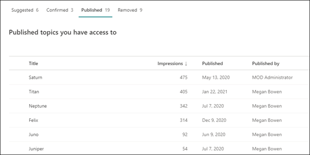

# Onderwerpen beheren in het onderwerpcentrum in Microsoft Viva-onderwerpen

 

> [!VIDEO https://www.microsoft.com/videoplayer/embed/RE4LxDx]  

 

In het onderwerpcentrum Viva-onderwerpen kan  een kennismanager de pagina Onderwerpen beheren bekijken om onderwerpen te bekijken die zijn geïdentificeerd op de bronlocaties, zoals opgegeven door uw kennisbeheerder.  

     

## Onderwerpfasen

Kennismanagers helpen bij het begeleiden van gevonden onderwerpen door de verschillende fasen van de levenscyclus van het onderwerp: **Voorgesteld**, **Bevestigd** **,** Gepubliceerd en **Verwijderd**.

    

- **Voorgesteld:** een onderwerp is geïdentificeerd door AI en heeft voldoende ondersteunende bronnen, verbindingen en eigenschappen. (Deze zijn gemarkeerd als een **voorgesteld onderwerp** in de gebruikersinterface.)

- **Bevestigd:** een onderwerp dat door AI is voorgesteld, wordt gevalideerd. Onderwerpvalidatie moet worden bevestigd door een kennismanager. Als u een onderwerp wilt bevestigen, moet er een netto van twee positieve stemmen zijn ontvangen van gebruikers die hebben gestemd met behulp van het feedbackmechanisme op de onderwerpkaart. Als bijvoorbeeld één gebruiker positief heeft gestemd en één gebruiker negatief heeft gestemd voor een bepaald onderwerp, hebt u nog twee positieve stemmen nodig om het onderwerp te bevestigen.
 
- **Gepubliceerd:** Een bevestigd onderwerp dat is samengesteld: er zijn handmatige wijzigingen aangebracht om de kwaliteit te verbeteren.

- **Verwijderd:** een onderwerp wordt geweigerd door een knowledge manager en is niet meer zichtbaar voor kijkers. Een onderwerp kan in elke staat worden verwijderd (voorgesteld, bevestigd of gepubliceerd). Als u een onderwerp wilt verwijderen, moet er een netto van twee negatieve stemmen zijn ontvangen van gebruikers die hebben gestemd met behulp van de feedbackmechanismen op de onderwerpkaart. Als bijvoorbeeld één gebruiker negatief heeft gestemd en één gebruiker positief heeft gestemd voor een bepaald onderwerp, moet u nog twee negatieve stemmen voor het onderwerp verwijderen. Wanneer een gepubliceerd onderwerp wordt verwijderd, moet de pagina met de samengestelde details handmatig worden verwijderd via de paginabibliotheek van het onderwerpcentrum.

> [!Note] 
> Op de **pagina Onderwerpen beheren** kan elke knowledge manager alleen onderwerpen zien waar ze toegang hebben tot de onderliggende bestanden en pagina's die aan het onderwerp zijn gekoppeld. Deze machtigings trimming wordt weergegeven in de lijst met onderwerpen die worden  weergegeven op de tabbladen **Voorgesteld,** **Bevestigd,** Gepubliceerd **en** Verwijderd. Het aantal onderwerpen geeft echter de totale tellingen in de organisatie weer, ongeacht de machtigingen.

## Vereisten

Als u onderwerpen in het onderwerpcentrum wilt beheren, moet u het volgende doen:
- Een licentie voor Viva-onderwerpen hebben.

- De machtiging [**Wie kan onderwerpen beheren.**](./topic-experiences-user-permissions.md) Kennisbeheerders kunnen gebruikers deze machtiging geven in de instellingen voor onderwerpmachtigingen van Viva Topics. 

U kunt de pagina  Onderwerpen beheren niet weergeven in het onderwerpcentrum, tenzij u de machtiging **Wie kan onderwerpen** beheren hebt.

In het onderwerpcentrum kan een kennisbeheerder onderwerpen bekijken die zijn geïdentificeerd op de bronlocaties die u hebt opgegeven en deze kunnen bevestigen of verwijderen. Een knowledge manager kan ook nieuwe onderwerppagina's maken en publiceren als deze niet zijn gevonden in onderwerpdetectie, of bestaande pagina's bewerken als ze moeten worden bijgewerkt.

## Voorgestelde onderwerpen bekijken

Op de **pagina Onderwerpen beheren** worden onderwerpen weergegeven die zijn gevonden in de opgegeven SharePoint-bronlocaties op het tabblad Voorgesteld.  Indien nodig kan een kennismanager onbevestigde onderwerpen bekijken en ervoor kiezen om deze te bevestigen of te verwijderen.

    

Een voorgesteld onderwerp bekijken:

1. Selecteer op **de pagina** Onderwerpen beheren het **tabblad** Voorgesteld en selecteer het onderwerp om de onderwerppagina te openen.

2. Bekijk de onderwerppagina op de onderwerppagina en selecteer **Bewerken** als u wijzigingen aan de pagina wilt aanbrengen. Als u wijzigingen publiceert, wordt dit onderwerp verplaatst naar **het tabblad** Gepubliceerd.

3. Ga na het bekijken van het onderwerp terug naar de **pagina Onderwerpen** beheren. Voor het geselecteerde onderwerp kunt u het volgende doen:

   - Selecteer het vinkje om het onderwerp te bevestigen.
    
   - Selecteer de **x** als u het onderwerp wilt verwijderen.

    Bevestigd onderwerpen worden verwijderd uit de lijst **Voorgesteld** en worden nu weergegeven in **de lijst** Bevestigd.

    Verwijderde onderwerpen worden verwijderd uit de lijst **Voorgesteld** en worden nu weergegeven op **het tabblad** Verwijderd.

### Kwaliteitsscore

Aan elk onderwerp dat wordt weergegeven op de pagina **Voorgestelde** onderwerpen is een kwaliteitsscore toegewezen. De kwaliteitsscore is een weerspiegeling van de hoeveelheid informatie die de gemiddelde gebruiker ziet voor de informatie over het onderwerp, rekening houdend met het feit dat elke gebruiker meer of minder informatie kan zien vanwege de machtigingen die ze wel of niet hebben over de informatie in een onderwerp. 

De kwaliteitsscore kan helpen inzicht te geven in de onderwerpen met de meeste informatie en kan handig zijn voor het vinden van onderwerpen die mogelijk handmatig moeten worden bewerkt. Een onderwerp met een lagere kwaliteitsscore kan bijvoorbeeld het resultaat zijn van sommige gebruikers die geen SharePoint-machtigingen hebben voor relevante bestanden of sites die AI in het onderwerp heeft opgenomen. Een inzender kan het onderwerp vervolgens bewerken om de informatie op te nemen (indien van toepassing), die vervolgens kan worden bekeken voor alle gebruikers die het onderwerp kunnen bekijken.

### Weergaven

In **de** kolom Weergaven wordt het aantal keren weergegeven dat een onderwerp is weergegeven aan eindgebruikers. Dit omvat weergaven via antwoordkaarten voor onderwerpen in zoekopdrachten en door onderwerpen. De doorklik op deze onderwerpen wordt niet weergegeven, maar het onderwerp is wel weergegeven. De **kolom** Weergaven wordt weergegeven voor onderwerpen op  de tabbladen **Voorgesteld,** **Bevestigd,** Gepubliceerd en Verwijderd op **de pagina Onderwerpen** beheren.

## Bevestigd onderwerpen

Op  de pagina Onderwerpen beheren worden onderwerpen die zijn gevonden in uw opgegeven SharePoint-bronlocaties en die zijn bevestigd door een knowledge manager of 'crowdsourced' die door een netto  twee of meer personen is bevestigd (waarbij negatieve gebruikersstemmen worden gebalanceerd tegen positieve gebruikersstemmen) via het feedbackmechanisme voor de kaart, weergegeven op het tabblad Bevestigd. Indien nodig kan een gebruiker met machtigingen voor het beheren van onderwerpen bevestigd onderwerpen bekijken en ervoor kiezen deze te weigeren.

Een bevestigd onderwerp controleren:

1. Selecteer op **het tabblad** Bevestigd het onderwerp om de onderwerppagina te openen.

2. Bekijk de onderwerppagina op de onderwerppagina en selecteer **Bewerken** als u wijzigingen aan de pagina wilt aanbrengen.

Houd er rekening mee dat u er nog steeds voor kunt kiezen om een bevestigd onderwerp te weigeren. Ga hiervoor naar het geselecteerde onderwerp  op het tabblad Bevestigd en selecteer de **x** als u het onderwerp wilt weigeren.

## Gepubliceerde onderwerpen

Gepubliceerde onderwerpen zijn bewerkt, zodat specifieke informatie altijd wordt weergegeven voor iedereen die de pagina tegenkomt. Handmatig gemaakte onderwerpen worden hier ook weergegeven.

   
