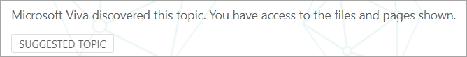
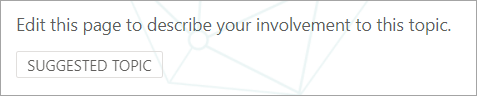
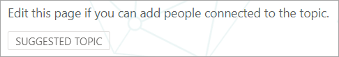

# Onderwerpen op schaal beheren in Microsoft Viva-onderwerpenManage topics at scale in Microsoft Viva Topics

Wanneer u uw SharePoint-sites of uw hele organisatie indexeert voor Viva-onderwerpen, kunnen er veel onderwerpen worden gegenereerd.When you index your SharePoint sites or your entire organization for Viva Topics, many topics might be generated. Wanneer dit gebeurt en u duizenden  voorgestelde onderwerpen ziet op de pagina Onderwerpen beheren, kan het lastig zijn om te weten waar u moet beginnen.When this happens and you see thousands of suggested topics on the **Manage topics** page, it can be challenging to know where to start. In dit artikel wordt beschreven hoe Viva Topics u helpt bij het optimaliseren van de onderwerpen en informatie die worden weergegeven aan gebruikers die informatie zoeken, zelfs in grote organisaties met grote aantallen onderwerpen.This article describes how Viva Topics helps you optimize which topics and information are shown to users who are searching for information, even in large organizations with large numbers of topics.

Eerst een herinnering aan de vier staten voor onderwerpen:First, a reminder of the four states for topics:

- **Voorgesteld:** een onderwerp is geïdentificeerd door AI en heeft voldoende ondersteunende bronnen, verbindingen en eigenschappen.**Suggested**: A topic has been identified by AI and has enough supporting resources, connections, and properties. (Deze zijn gemarkeerd als een **voorgesteld onderwerp** in de gebruikersinterface.)(These are marked as a **Suggested Topic** in the UI.)

- **Bevestigd:** een onderwerp dat door AI is voorgesteld, wordt gevalideerd.**Confirmed**: A topic that has been suggested by AI is validated. Onderwerpvalidatie moet worden bevestigd door een kennismanager.Topic validation must be confirmed by a knowledge manager. Als u een onderwerp wilt bevestigen, moet er een netto van twee positieve stemmen zijn ontvangen van gebruikers die hebben gestemd met behulp van het feedbackmechanisme op de onderwerpkaart.For a topic to be confirmed, there must be a net of two positive votes received from users who voted using the feedback mechanism on the topic card. Als bijvoorbeeld één gebruiker positief heeft gestemd en één gebruiker negatief heeft gestemd voor een bepaald onderwerp, hebt u nog twee positieve stemmen nodig om het onderwerp te bevestigen.For example, if one user voted positive and one user voted negative for a particular topic, you would still need two more positive votes for the topic to be confirmed.
 
- **Gepubliceerd:** Een bevestigd onderwerp dat is samengesteld: er zijn handmatige wijzigingen aangebracht om de kwaliteit te verbeteren.**Published**: A confirmed topic that has been curated: manual edits have been made to improve its quality.

- **Verwijderd:** een onderwerp wordt geweigerd door een knowledge manager en is niet meer zichtbaar voor kijkers.**Removed**: A topic is rejected by a knowledge manager and will no longer be visible to viewers. Een onderwerp kan in elke staat worden verwijderd (voorgesteld, bevestigd of gepubliceerd).A topic can be removed in any state (suggested, confirmed, or published). Als u een onderwerp wilt verwijderen, moet er een netto van twee negatieve stemmen zijn ontvangen van gebruikers die hebben gestemd met behulp van de feedbackmechanismen op de onderwerpkaart.For a topic to be removed, there must be a net of two negative votes received from users who voted using the feedback mechanisms on the topic card. Als bijvoorbeeld één gebruiker negatief heeft gestemd en één gebruiker positief heeft gestemd voor een bepaald onderwerp, moet u nog twee negatieve stemmen voor het onderwerp verwijderen.For example, if one user voted negative and one user voted positive for a particular topic, you would still need two more negative votes for the topic to be removed. Wanneer een gepubliceerd onderwerp wordt verwijderd, moet de pagina met de samengestelde details handmatig worden verwijderd via de paginabibliotheek van het onderwerpcentrum.When a published topic is removed, the page with the curated details will need to be deleted manually through the Pages Library of the topic center.

## Rol van Knowledge ManagerKnowledge manager role 

Wanneer u Viva-onderwerpen configureert, voegt u een groep gebruikers  toe die machtigingen krijgen om de ervaring Onderwerpen beheren in het onderwerpcentrum te zien.When you configure Viva Topics, you'll add a group of users who are granted permissions to see the **Manage topics** experience in the topic center. Deze wordt alleen weergegeven voor deze gebruikers die de rol van primaire curatie voor de onderwerpen hebben.It will appear only for these users who hold the role of primary curation for the topics. Ze hebben toegang tot gegevens over de onderwerpen en kunnen lijsten zien met alle onderwerpen die ze kunnen bekijken en curateren.They'll have access to data about the topics and will be able to see lists of all topics that they have access to review and curate.

Werknemers in deze rol moeten uitgebreide machtigingen hebben om een breed scala aan onderwerpen weer te geven.Employees in this role should have broad permissions to view a wide array of topics. Of als machtigingen zijn gesegmenteerd, wilt u mogelijk een groep gebruikers selecteren die verschillende gebieden van het bedrijf vertegenwoordigen en kunnen curaten voor hun eigen gebieden.Or if permissions are segmented, you might want to select a group of users that represent different areas of the business and can curate for their own areas.

Wanneer u onderwerpen voor het eerst bekijkt in het onderwerpcentrum, zijn voorgestelde onderwerpen puur AI-gedefinieerd.When you first review topics in the topic center, suggested topics are purely AI-defined. Kennisbeheerders willen ze misschien allemaal bekijken voordat ze Viva-onderwerpen uitrollen naar een brede gebruikersgemeenschap.Knowledge managers might want to review each one before rolling out Viva Topics to a broad user community. Wanneer u op schaal werkt, is deze benadering zelden praktisch vanwege de duizenden onderwerpen.When working at scale, this approach is rarely a practical because of the thousands of topics.

De aanbevolen methode is om een balans te vinden tussen de meest relevante of belangrijke onderwerpen voor uw eerste set gebruikers en de focus te leggen op de curatie van deze onderwerpen voordat Viva-onderwerpen worden uitgerold.The recommended approach is to find a balance of the most pertinent or important topics for your initial set of users and focus on curation of those topics before rollout of Viva Topics. Begin feedback te verzamelen van de gebruikers en sta crowdsourcing toe om het gebruik en de bijdragenpatronen van uw gebruikers te bepalen om de strategieën te informeren die in dit artikel worden voorgesteld.Begin to collect feedback from the users and allow crowdsourcing to determine the usage and contribution patterns of your users to inform the strategies suggested in this article.

Het is belangrijk om te herkennen dat het systeem alle gebruikers zowel door AI voorgestelde als door mensen samengestelde gepubliceerde onderwerpen identificeert en laat zien.It's important to recognize that the system will identify and show both AI-suggested and human-curated published topics to all users. Dit betekent echter niet dat elk voorgesteld onderwerp wordt weergegeven voor alle eindgebruikers.However, this doesn't mean that every suggested topic will be shown to all end users. In de beveiligingsinstellingen worden alleen de onderwerpen weer gegeven die elke werknemer kan openen op basis van de machtigingen die zijn ingesteld op de inhoud zelf.The security settings in place will show only the topics that each employee can access based on the permissions that are set on the content itself.

Als kennismanager met machtigingen  voor het weergeven van de pagina Onderwerpen beheren, wordt mogelijk een veel groter aantal onderwerpen weergegeven vanwege uw eigen verhoogde machtigingen, afhankelijk van uw rol in de organisatie en het toegangsniveau.As a knowledge manager with permissions to view the **Manage topics** page, you might see a much larger number of topics listed because of your own elevated permissions, depending on your role in the organization and level of access. U hebt ook toegang tot weergaven waarmee u onderwerpen op één locatie kunt zien in plaats van ze te openen met behulp van highlights of zoeken.You'll also have access to views that allow you see topics listed in a single location rather than accessing them by using highlights or search.

Daarnaast is er waarschijnlijk een kleiner percentage onderwerpen dat door de meeste gebruikers wordt bekeken en een grotere set meer onderwerpen die veel minder vaak worden gezien vanwege machtigingen.In addition, there is likely a smaller percentage of topics that will be viewed by most users and a larger set of more topics that will be seen much less frequently due to permissions. Het is daarom goed om alle curatietaken eerst te richten op de onderwerpen die het belangrijkst zijn voor uw organisatie en die het meest waarschijnlijk breder worden gezien.As a result, it is good to first focus any curation tasks on the topics that are the most important for your organization and that are the most likely to be seen more broadly.

In dit artikel worden enkele strategieën voor curatie beschreven.This article covers a few strategies for curation. Deze strategieën kunnen betekenen dat de minder vaak voorkomende of minder veelvoorkomende onderwerpen mogelijk niet volledig worden samengesteld door kennisbeheerders.These strategies might mean that the less frequent or less common topics might not be fully curated by knowledge managers. Deze voorgestelde onderwerpen blijven echter nuttig en kunnen een persoon inzicht of een aanwijzer geven, waardoor een werknemer uren kan besparen om naar een beginpunt te zoeken.However, these suggested topics remain useful and can provide insight or a pointer to a person, which can save an employee hours of looking for a starting point. Het toestaan van crowdsourced-updates voor onderwerpen is gunstig en biedt meer inhoud en dekking voor de minder algemene onderwerpen.Allowing crowdsourced updates to topics is beneficial and provides more content and coverage for the less common topics.

In dit artikel vindt u enkele richtlijnen en best practices voor het benaderen van onderwerpbeheer en curatie.This article provides some guidance and best practices to approach topic management and curation.

## Voorgestelde onderwerpen begrijpenUnderstanding suggested topics

Wanneer onderwerpen worden ontdekt door AI, worden ze gemarkeerd  als een voorgesteld onderwerp **,** zowel op de pagina Onderwerpen beheren als in de onderwerpkaarten die aan gebruikers worden gepresenteerd.When topics are discovered by AI, they're marked as a **Suggested Topic**, both on the **Manage topics** page, and in the topic cards that are presented to users. Elk onderwerp dat niet is gemarkeerd als verwijderd, wordt weergegeven aan gebruikers, waaronder bevestigd, gepubliceerd en voorgestelde onderwerpen.Any topic that hasn't been marked as removed will be shown to users—this includes confirmed, published, and suggested topics. Onderwerpen in alle drie de staten zijn beschikbaar voor eindgebruikers.Topics in all three states are available to end users.

Op een onderwerpkaart of pagina gebruiken we verschillende aanwijzingen om aan te geven hoe de AI de informatie heeft gegenereerd.Within a topic card or page, we use various cues to show how the AI has generated the information. Het systeem gebruikt diverse gegevens om de resources toe te voegen, voornamelijk via de inhoud zelf.The system uses a variety of evidence to add the resources, primarily through the content itself.

- Labels geven aan dat er een onderwerp wordt voorgesteld en dat het is ontdekt door Viva Topics.Labels show that a topic is suggested and that it was discovered by Viva Topics.  

   

- Informatie op de kaart geeft aan waar een definitie vandaan komt door de bron op te geven.Information on the card states where a definition has come from by specifying its source.

- Voorgestelde personen worden afgeleid door personen die documenten hebben geschreven of bewerkt te aggregeren met bewijs over het onderwerp.Suggested people are derived by aggregating people who have written or edited documents with topic evidence. Als een persoon een document schrijft met een onderwerpnaam in de titel en dat document veel weergaven heeft, is er mogelijk slechts één document nodig om de persoon vast te stellen als verwant.If a person writes a document that has a topic name in the title, and that document has many views, it might only require one document to establish the person as related. In veel gevallen is er echter meer bewijs beter en hebben personen die worden vermeld, aan meerdere documenten gewerkt.However, in many cases more evidence is better, and people who are listed have worked on multiple documents.  

   

- Voor de weergegeven bestanden en pagina's geeft het systeem aan hoe vaak het onderwerp in het document is vermeld, maar het onderwerp moet ook worden vermeld in een specifieke context waarin de verwijzing naar het onderwerp van specifiek type (zoals project of team) wordt aangegeven.For the files and pages shown, the system identifies how many times the topic has been mentioned in the document, but the topic also must be mentioned in a specific context that identifies the reference to the topic of specific type (such as project or team). Dit is wat telt als bewijs voor de AI.This is what counts as evidence for the AI. In het systeem wordt ook rekening houden met het voorkomen van een onderwerpnaam in de titels van documenten, typen documenten en andere analysefuncties (zoals weergaven).The system also considers the occurrence of a topic name in the titles of documents, types of documents, and other analytics features (such as views).

   

   

   

Deze kenmerken tonen aan dat de inhoud is toegevoegd door AI en hoe de AI deze bepaling heeft gemaakt.These attributes demonstrate that the content has been added by AI, and how the AI has made that determination.

### CommunicatieCommunication

Wanneer u met uw gebruikers over Viva-onderwerpen communiceert, is het belangrijk om het verschil te verduidelijken tussen AI-voorgestelde onderwerpen en inhoud en hun samengestelde equivalenten.When communicating to your users about Viva Topics, it's important to clarify the difference between AI-suggested topics and content and their curated equivalents.

Als lezer moet u voorgestelde onderwerpen met een kritischer oog bekijken.As a reader, you should view suggested topics with a more critical eye. Ze moeten niet worden gezien als gezaghebbende bronnen van organisatie-waarheid.They shouldn't be perceived as authoritative sources of organizational truth. Ze zijn eerder een hulpmiddel voor het vinden van wegwijsheid om toegang te krijgen tot stilzwijgende kennis die wordt gepresenteerd via de inhoud tot wie u toegang hebt.Rather, they're a way-finding tool to access tacit knowledge that is presented through the content that you have access to. De AI heeft het onderwerp ontdekt en heeft voldoende bewijs om het aan u weer te geven, maar de waarde ervan is niet bevestigd door een persoon.The AI has discovered the topic and has enough evidence to show it to you, but its value hasn't been confirmed by a person.

### Crowdsourced-besturingselementenCrowdsourced controls

Voorgestelde onderwerpen kunnen worden verbeterd door de pagina te cureren en door middel van crowdsourced feedback over het onderwerp.Suggested topics can be improved by curation of the page and through crowdsourced feedback on the topic.

Wanneer gebruikers werken met een voorgesteld onderwerp, wordt ze mogelijk een eenvoudige vraag gesteld in de gebruikersinterface.When users interact with a suggested topic, they might be asked a simple question in the UI. Bijvoorbeeld: *Was dit onderwerp relevant voor de pagina?*For example: *Was this topic relevant to the page?* *Is deze persoon relevant voor het onderwerp?**Is this person relevant for the topic?* *Was deze definitie nauwkeurig?**Was this definition accurate?* Door de feedback voor dergelijke vragen te gebruiken, kan de nauwkeurigheid van de onderwerpen toenemen zonder dat een benoemde persoon de pagina hoeft te curaçeren.By using the feedback to such questions, the accuracy of the topics can increase without the need for a named individual to curate the page.

De startpagina van een onderwerpcentrum is een andere locatie waar feedback over voorgestelde onderwerpen wordt verzameld.The home page of a topic center is another location where feedback on suggested topics is gathered. In het onderwerpcentrum kan een gebruiker de onderwerpen zien die aan hem of haar zijn gekoppeld en de optie krijgen om deze associatie te bevestigen of deze te laten verwijderen.In the topic center, a user can see the topics that they have been associated with and are given the option to either confirm this association or have it removed.

   

Wanneer u brede crowdsourcing van onderwerpen toestaat, moet u rekening houden met de volgende factoren:When you allow broad crowdsourcing of topics, you should consider the following factors:

-   Gebruikers zien de optie **Bewerken** op onderwerppagina's en kunnen de pagina's in dezelfde ervaring bewerken als andere moderne SharePoint-pagina's.Users will see the **Edit** option on topic pages and can edit the pages in the same experience as other modern SharePoint pages.

-   Sommige **webonderdelen voorgesteld** onderwerp kunnen niet worden verwijderd.Some **Suggested Topic** web parts can't be removed. De onderwerpnaam, alternatieve namen, definitie, voorgestelde personen en voorgestelde bronnen kunnen niet worden verwijderd.The topic name, alternate names, definition, suggested people, and suggested resources can't be removed.

-   Het kan enige tijd duren voor een voorgesteld of bevestigd onderwerp  dat is gepubliceerd, wordt verplaatst naar de lijst Gepubliceerd op de **pagina Onderwerpen** beheren.It can take some time for a suggested or confirmed topic that has been published to be moved to the **Published** list on the **Manage topics** page.

    -   De geschatte tijd dat een onderwerp wordt weergegeven in zoekopdrachten, highlights, hashtags of aantekeningen, is 2 uur.The estimated time for a topic to appear in search, highlights, hashtags, or annotations is 2 hours.

    -   De geschatte tijd voor een onderwerp  **in** de lijst Gepubliceerd op de pagina Beheerde onderwerpen is in de meeste gevallen niet meer dan 24 uur.The estimated time for a topic to appear in **Published** list on the **Managed topics** page is no more than 24 hours in most cases. U moet ze binnen 2 uur zien, maar omdat er elke 24 uur een volledige synchronisatie is, mag het wachten niet langer dan 24 uur duren.You should see them within 2 hours, but because there's a full sync every 24 hours, the wait shouldn't be longer than 24 hours.

-   Het is mogelijk dat een gebruiker een gepubliceerd onderwerp in een uitgecheckte of bewerkingstoestand achter laat.It's possible that a user might leave a published topic in a checked-out or editing state. Een kennisbeheerder kan deze zien in de paginabibliotheek van het onderwerpcentrum en kan de wijzigingen van de gebruiker negeren om het onderwerp opnieuw te publiceren of contact opnemen met die gebruiker om te vragen of hij of zij het onderwerp wil inchecken.A knowledge manager can see these in the Pages Library of the topic center and either can discard the user's changes to republish the topic or contact that user to request that they check in the topic.

### Zichtbaarheid en inhoud van onderwerp is gebaseerd op machtigingen van een gebruikerTopic visibility and content is based on a user's permissions

Wanneer u de lijst met voorgestelde onderwerpen als knowledge manager bekijkt, moet u er rekening mee houden dat de inhoud van een voorgesteld onderwerp dynamisch wordt gebaseerd op machtigingen.When you review the list of suggested topics as a knowledge manager, keep in mind that the contents on a suggested topic will be dynamically based on permissions. De voorgestelde inhoud en personen die aan u worden weergegeven, zijn mogelijk niet hetzelfde als personen die worden gepresenteerd aan een gebruiker of een andere knowledge manager.The suggested content and people that are shown to you might not be the same as those who are presented to any user or another knowledge manager.

Op basis van de machtigingen voor het weergeven van inhoud die is gekoppeld aan een onderwerp, kan elke gebruiker een andere set voorgestelde resources, personen, alternatieve namen en definitie zien.Based on the permissions to view content that is associated with a topic, each user might see a different set of suggested resources, people, alternative names, and definition.

## Prioriteit geven aan de onderwerpen voor curatiePrioritize the topics for curation

U kunt de volgende strategieën gebruiken om onderwerpen te identificeren die waarschijnlijk prominent aanwezig zijn en daarom goede kandidaten voor curatie zijn.You can use the following strategies to identify topics that are likely to be prominent, and therefore are good candidates for curation. 

### TaxonomieTaxonomies

Het gebruik van bestaande taxonomie kan een lijst met onderwerpen bevatten die waarschijnlijk prominent zijn voor gebruikers.Using existing taxonomies can provide a list of topics that are likely to be prominent for users. Dit kunnen bijvoorbeeld de volgende zijn:For example, these could be:

-   Producten en services die uw organisatie levertProducts and services that your organization provides

-   Teams in uw organisatieTeams in your organization

-   High-profile projectenHigh-profile projects

Deze benadering kan ook worden gebruikt op afdelings- of functioneel niveau, met deskundigen die dit gebied van uw organisatie begrijpen.This approach could also be taken on a departmental or functional level, with subject-matter experts who understand that area of your organization. Het is niet de bedoeling dat ze een selectie of alle onderwerpen bekijken.The goal isn't to have them review a selection or all of the topics. In plaats van dat ze hun eigen domeinkennis meenemen om selectieve curatie te begeleiden.Rather, they bring their own domain expertise to guide selective curation.

### ZoekenSearch

Veelgebruikte zoektermen worden vaak als onderwerpen gevonden.Common search terms are often discovered as topics. Met behulp van [de belangrijkste queryrapporten in Microsoft Search](/sharepoint/view-search-usage-reports)kunt u de meest voorkomende zoektermen in uw organisatie identificeren.By using the [top query reports in Microsoft Search](/sharepoint/view-search-usage-reports), you can identify the most frequent search terms in your organization. Als er onderwerpen zijn gevonden voor deze voorwaarden, zijn ze goede kandidaten voor curatie.If topics have been discovered for these terms, they're good candidates for curation. Deze onderwerpen kunnen worden gepresenteerd als antwoordkaarten in Microsoft Search.These topics can be presented as answer cards in Microsoft Search.

Als u momenteel Microsoft [Search-bladwijzers gebruikt,](/microsoftsearch/manage-bookmarks)kunt u overwegen welke van deze bladwijzers kunnen worden vervangen door een onderwerp.If you're currently using [Microsoft Search bookmarks](/microsoftsearch/manage-bookmarks), consider which of these can be replaced with a topic. Een bladwijzerantwoordkaart bevat een titel, beschrijving en URL.A bookmark answer card contains a title, description, and URL. In sommige gevallen kan een onderwerpkaart nuttiger zijn voor een gebruiker, en een onderwerpkaart bevat ook resources en personen.In some circumstances, a topic card might be more useful to a user, and a topic card also shows resources and people.

In de zoekervaring van de gebruiker, wanneer een gebruiker zoekt naar een term zoals *reizen,* worden zoekresultaten weergegeven in de volgende prioriteitsvolgorde in Microsoft Search:In the user's search experience, when a user searches for a term like *travel*, search results are displayed in the following priority order in Microsoft Search:

1.  Gepubliceerde of bevestigde onderwerpenPublished or confirmed topics

2.  BladwijzersBookmarks

3.  Voorgestelde onderwerpenSuggested topics

### Weergaven en kwaliteitsscoreImpressions and quality score

Het [aantal](manage-topics.md#impressions) weergaven en [de kwaliteitsscore](manage-topics.md#quality-score) zijn belangrijke meetwaarden voor het begrijpen van het gedrag van een onderwerp.The [impressions](manage-topics.md#impressions) count and [quality score](manage-topics.md#quality-score) are important metrics for understanding the behavior of a topic. De waarde van deze metrische gegevens wordt beperkt wanneer alleen kennismanagers of IT-teams toegang hebben tot onderwerpen.The value of these metrics will be limited when only knowledge managers or IT teams have access to topics. Door onderwerpen aan een testgroep gebruikers bloot te stellen, worden representatievere gegevens voor deze metingen gegenereerd.Exposing topics to a pilot group of users will generate more representative data for these measures.

Onderwerpen met een hoog aantal vertoningen worden waarschijnlijk vaker gebruikt.Topics with a high impression count are likely to be more frequently interacted with. De kwaliteitsscore voor deze onderwerpen geeft een idee van hoe rijk deze onderwerpen zijn.The quality score for these topics will give a sense of how rich those topics are. Onderwerpen met een hoog aantal vertoningen en een lage kwaliteitsscore zijn goede doelen voor curatie.Topics with a high impression count and a low quality score are good targets for curation.

### Belangrijke termen uit de informatiearchitectuur van grotere organisatiesitesKey terms from the information architecture of larger organizational sites

Grotere portalsites binnen uw organisatie hebben mogelijk tijd geïnvesteerd in het organiseren van hun informatiearchitectuur en het navigeren van hun site rond belangrijke onderwerpgebieden voor hun bedrijfseenheden, productlijnen, belangrijke projecten, en meer.Larger portal sites within your organization might have invested time in organizing their information architecture and the navigation of their site around key topic areas for their business units, product lines, major projects, and so on. Als u deze termen bekijkt en onderwerpen voor deze termen identificeert en cureert, kunnen gebruikers die op zoek zijn naar informatie over deze gebieden, worden geholpen.Reviewing these terms and identifying and curating topics for these terms can help users who are looking for information on these areas.

### Interne kennisbases of wikisites gebruikenLeverage internal knowledge bases or wiki sites

Als uw organisatie heeft geïnvesteerd in kennisbases of wikisites, kunnen deze een lijst met onderwerpen bieden die u kunt gebruiken voor uw eerste curatie-inspanningen.If your organization has invested in knowledge bases or wiki sites, these can provide a list of topics to use for your initial curation efforts. Als ze bijzonder groot zijn, selecteert u de meest bekeken of bewerkte onderwerpen als uitgangspunt.If they're particularly large, select the most viewed or edited topics as a starting point.

## Zie ookSee also

[Onderwerpen beheren in het onderwerpcentrumManage topics in the topic center](manage-topics.md)

[Overzicht van het onderwerpcentrumTopic center overview](topic-center-overview.md)
