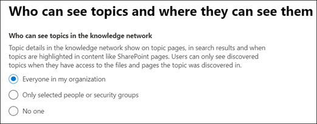
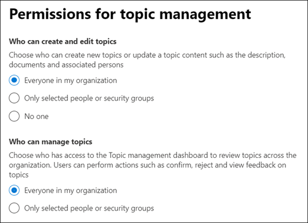
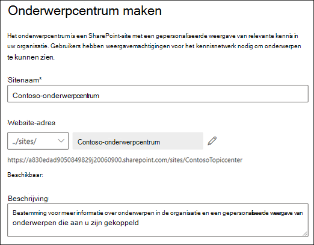

# Kennisbeheer instellen (preview)

> [!Note] 
> De inhoud in dit artikel is bedoeld voor project cortex private preview. [Lees meer over project cortex](https://aka.ms/projectcortex).

Met het Microsoft 365-Beheercentrum kunt u [kennisbeheer](knowledge-management-overview.md)instellen en configureren. 

> [!Important]
> Het is belangrijk dat u de beste manier voor het instellen van kennisbeheer in uw omgeving de beste manier plant en configureert. U moet bijvoorbeeld overwegingen voor het volgende doen:
- De SharePoint-sites die u voor onderwerpen wilt analyseren.
- De gebruikers van wie u de onderwerpen zichtbaar wilt maken.
- Welke gebruikers u machtigingen wilt geven om onderwerpen te beheren in het onderwerp centrum.
- Welke gebruikers u machtigingen wilt geven om onderwerpen te maken of te bewerken in het onderwerp centrum.
- De naam van het onderwerp dat u wilt geven.

> [!Note]
> Het kan handig zijn om beveiligingsgroepen te maken om uw gebruikers de benodigde machtigingen voor het weergeven van onderwerpen te zien, onderwerp te beheren en onderwerpen te maken en bewerken.

Een beheerder kan ook [op elk gewenst moment na de installatie wijzigingen aanbrengen](manage-knowledge-network.md) in de instellingen voorkennis beheer in het microsoft 365-Beheercentrum.

## Vereisten 
U moet een globale beheerder of SharePoint-beheerdersmachtigingen hebben om toegang te krijgen tot het Microsoft 365-Beheercentrum en om bedrijfsinformatie in te stellen.

## Uw kennis netwerk instellen

Het instellen van uw kennis netwerk begeleidt u door het volgende:

- Onderwerp detecteren: het selecteren van onderwerpen bronnen en onderwerpen voor het opzeggen van detectie.
- Onderwerp zichtbaar: wanneer u een gebruiker selecteert, kunt u deze onderwerpen als aandachtspunten weergeven op de tabbladen zoeken en onderwerp.
- Onderwerp machtigingen: selecteren wie onderwerpen kan maken, bewerken en beheren.
- Onderwerpen centrum: het onderwerpen centrum maken.
- Controleren: de instellingen controleren en toepassen.

Uw kennis netwerk instellen:

1. In het Microsoft 365-Beheercentrum (admin.microsoft.com), selecteert u **instellingen**en vervolgens de afdelings informatie van de **organisatie** weergeven.
2. Klik in de sectie **kennis van organisatie** op **personen verbinden met kennis**. 

      

3. Klik op de pagina **personen verbinden met kennis** op aan de slag om u door te **gaan** met het instellen van het installatieproces. 

      

4. Ga naar de pagina **Kies hoe u de pagina wilt zoeken** in het onderwerp: detectie van een kennis netwerk. Selecteer in de sectie **SharePoint-onderwerpen selecteren** welke SharePoint-sites worden verkend als bronnen voor uw onderwerpen tijdens de detectie. Dit omvat: 
    a. **Alle sites**: alle SharePoint-sites in de Tenant. Hiermee worden de huidige en toekomstige sites vastgelegd. 
    b. **Alles, met uitzondering van geselecteerde sites**: Typ de namen van de sites die u wilt uitsluiten.  U kunt ook een lijst uploaden met sites die u wilt afmelden bij ontdekking. Sites die in de toekomst zijn gemaakt, worden opgenomen als bronnen voor de detectie van het onderwerp.  
    c. **Alleen geselecteerde sites**: Typ de namen van de sites die u wilt opnemen. U kunt ook een lijst met sites uploaden. Sites die u later maakt, worden niet opgenomen als bronnen voor de detectie van het onderwerp.  

      
   
5. In de sectie **onderwerpen uitsluiten van naam** kunt u kiezen of u namen wilt opnemen van onderwerpen die u niet wilt opnemen in de gedetecteerde resultaten. Gebruik deze instelling om te voorkomen dat vertrouwelijke onderwerpen worden opgenomen als onderdeel van het kennis netwerk. De opties zijn: 
    a. **Geen onderwerpen uitsluiten**  
    b. **Onderwerp met deze voorwaarden uitsluiten**: als u onderwerpen hebt die u niet wilt weergeven aan gebruikers als onderdeel van het kennis netwerk.
   -De opgegeven sjabloon downloaden.
   -Voer de namen van de onderwerpen in die u wilt uitsluiten. U moet het type overeenkomst als gelijk of gedeeltelijk opgeven. Met exact vergelijken worden de onderwerpen die aan de exacte term voldoen, uitgesloten. Gedeeltelijke overeenkomst is strict, en houdt in dat onderwerpen die de term bevatten, niet worden uitgesloten. Als u bijvoorbeeld *doc* opgeeft als de naam van het onderwerp, wordt *document assemblage* uitgesloten voor de *dokweergave* . Onderwerp namen zijn hoofdlettergevoelig.  
        -Selecteer  **+**   deze optie om het voltooide CSV-bestand te importeren. Selecteer vervolgens **uploaden**. U ziet een groen vinkje als het bestand is verwerkt. Selecteer **Volgende**. 

6. In de pagina **wie kan de onderwerpen zien en waar ze deze kunnen zien** , wordt de zichtbaarheid van het onderwerp geconfigureerd. In de instelling **wie kan de onderwerpen zien in de instelling van het kennis netwerk** , kiest u wie toegang heeft tot de details van het onderwerp, zoals gemarkeerde onderwerpen, topic cards, onderwerp Answers in Search en topic Pages. U kunt kiezen voor: 
    a. **Iedereen in uw organisatie** 
    b. **Alleen geselecteerde personen of beveiligingsgroepen** 
    c. **Niemand** 

       

 > [!Note] 
 > Met deze instelling kunt u een gebruiker in de organisatie selecteren, zodat alleen gebruikers met een licentie voorkennis beheer die aan hen zijn toegewezen, onderwerpen kunnen weergeven. 

7. Op de pagina **machtigingen voor onderwerp beheren** kiest u wie onderwerpen kan maken, bewerken en beheren. In de sectie **wie kan onderwerpen maken en bewerken** , kunt u het volgende selecteren: 
    a. **Iedereen in uw organisatie** 
    b. **Alleen geselecteerde personen of beveiligingsgroepen** 
8. In de sectie **wie kan secties beheren** , kunt u het volgende selecteren: 
    a. **Iedereen in uw organisatie** 
    b. **Geselecteerde personen of beveiligingsgroepen** 

      

    Selecteer **Volgende**. 
9. Op de pagina **topic maken** kunt u de site van het onderwerp maken waarin de onderwerpen kunnen worden weergegeven en de onderwerpen kunnen worden beheerd.  Typ in het vak **naam van onderwerp centrum** een naam voor het onderwerp Center. U kunt desgewenst een korte beschrijving typen in het vak **Beschrijving van site** .  

Selecteer **Volgende**. 

      

10. Op de pagina **controleren en voltooien** ziet u de geselecteerde instelling en kiest u om wijzigingen aan te brengen. Als u tevreden bent met uw selecties, selecteert u **activeren**.

       

11. De pagina voor **geactiveerde kennis netwerk** wordt weergegeven en u wordt bevestigd dat het systeem nu begint met het analyseren van de geselecteerde sites voor onderwerpen en de site van de Knowledge Center-site maakt. Selecteer **Gereed**. 

       

12. U gaat terug naar de pagina contact **personen verbinden met kennis** . Op deze pagina kunt u **beheren** selecteren om wijzigingen aan te brengen in de configuratie-instellingen. 

         

> [!Note]
> Na de installatie kan een beheerder op elk moment [wijzigingen aanbrengen in uw geselecteerde instellingen voorkennis beheer](manage-knowledge-network.md) , door terug te gaan naar deze pagina.

## Zie ook

  

