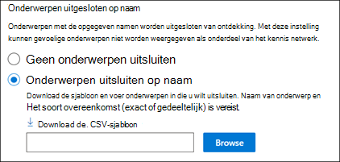

# Kennisbeheer instellen (preview)Set up Knowledge Management (Preview)

> [!Note] 
> De inhoud in dit artikel is bedoeld voor project cortex private preview.The content in this article is for Project Cortex Private Preview. [Meer informatie over Project Cortex](https://aka.ms/projectcortex).[Find out more about Project Cortex](https://aka.ms/projectcortex).

Met het Microsoft 365-Beheercentrum kunt u [kennisbeheer](knowledge-management-overview.md)instellen en configureren.You can use the Microsoft 365 admin center to set up and configure [Knowledge Management](knowledge-management-overview.md). 

> [!Important]
> Het is belangrijk dat u de beste manier voor het instellen van kennisbeheer in uw omgeving de beste manier plant en configureert.It is important to plan the best way to set up and configure Knowledge Management in your environment. U moet bijvoorbeeld overwegingen voor het volgende doen:For example, you will need to make considerations about the following:
- De SharePoint-sites die u voor onderwerpen wilt analyseren.Which SharePoint sites you want to analyze for topics.
- De gebruikers van wie u de onderwerpen zichtbaar wilt maken.Which users you want to make topics visible to.
- Welke gebruikers u machtigingen wilt geven om onderwerpen te beheren in het onderwerp centrum.Which users you want to give permissions to manage topics in the topic center.
- Welke gebruikers u machtigingen wilt geven om onderwerpen te maken of te bewerken in het onderwerp centrum.Which users you want to give permissions to create or edit topics in the topic center.
- De naam van het onderwerp dat u wilt geven.What name you want to give your topic center.

> [!Note]
> Het kan handig zijn om beveiligingsgroepen te maken om uw gebruikers de benodigde machtigingen voor het weergeven van onderwerpen te zien, onderwerp te beheren en onderwerpen te maken en bewerken.You may find it useful to create security groups to assign your users the permissions needed to view topics, manage topic, and create and edit topics.

Een beheerder kan ook [op elk gewenst moment na de installatie wijzigingen aanbrengen](topic-experiences-discovery.md) in de instellingen voorkennis beheer in het microsoft 365-Beheercentrum.An admin can also [make changes to your selected settings anytime after setup](topic-experiences-discovery.md) through the Knowledge Management settings in the Microsoft 365 admin center.

## VereistenRequirements 
U moet een globale beheerder of SharePoint-beheerdersmachtigingen hebben om toegang te krijgen tot het Microsoft 365-Beheercentrum en om bedrijfsinformatie in te stellen.You must have Global Admin or SharePoint admin permissions to be able to access the Microsoft 365 admin center and set up Organizational knowledge tasks.

## Uw kennis netwerk instellenSet up your knowledge network

Het instellen van uw kennis netwerk begeleidt u door het volgende:Setting up your knowledge network walks you through the following:

- Onderwerp detecteren: het selecteren van onderwerpen bronnen en onderwerpen voor het opzeggen van detectie.Topic discovery: Selecting topic sources and topics to  exclude from discovery.
- Onderwerp zichtbaar: wanneer u een gebruiker selecteert, kunt u deze onderwerpen als aandachtspunten weergeven op de tabbladen zoeken en onderwerp.Topic visibility: Selecting who can view topics as highlights, in search and topic pages.
- Onderwerp machtigingen: selecteren wie onderwerpen kan maken, bewerken en beheren.Topic permissions: Selecting who can create, edit, and manage topics.
- Onderwerpen centrum: het onderwerpen centrum maken.Topic center: Create your topic center.
- Controleren: de instellingen controleren en toepassen.Review: Check and apply your settings.

Uw kennis netwerk instellen:To set up your knowledge network:

1. In het Microsoft 365-Beheercentrum (admin.microsoft.com), selecteert u **instellingen** en vervolgens de afdelings informatie van de **organisatie** weergeven.In the Microsoft 365 admin center (admin.microsoft.com), select **Setup** , and then view the **Organizational Knowledge** section.
2. Klik in de sectie **kennis van organisatie** op **personen verbinden met kennis**.In the **Organizational Knowledge** section, click **Connect people to knowledge**. 

      

3. Klik op de pagina **personen verbinden met kennis** op aan de slag om u door te **gaan** met het instellen van het installatieproces.On the **Connect people to knowledge** page, click **Get started** to walk you through the setup process. 

      

4. Ga naar de pagina **Kies hoe u de pagina wilt zoeken** in het onderwerp: detectie van een kennis netwerk.On the **Choose how the knowledge network can find topics** page, you will configure topic discovery. Selecteer in de sectie **SharePoint-onderwerpen selecteren** welke SharePoint-sites worden verkend als bronnen voor uw onderwerpen tijdens de detectie.In the **Select SharePoint topic sources** section, select which SharePoint sites will be crawled as sources for your topics during discovery. Dit omvat:This includes: 
    a.a. **Alle sites** : alle SharePoint-sites in de Tenant.**All sites** : All SharePoint sites in your tenant. Hiermee worden de huidige en toekomstige sites vastgelegd.This captures current and future sites. 
    b.b. **Alles, met uitzondering van geselecteerde sites** : Typ de namen van de sites die u wilt uitsluiten.**All, except selected sites** : Type the names of the sites you want to exclude.  U kunt ook een lijst uploaden met sites die u wilt afmelden bij ontdekking.You can also upload a list of sites that you want to opt out from discovery. Sites die in de toekomst zijn gemaakt, worden opgenomen als bronnen voor de detectie van het onderwerp.Sites created in future will be included as sources for topic discovery.  
    c.c. **Alleen geselecteerde sites** : Typ de namen van de sites die u wilt opnemen.**Only selected sites** : Type the names of the sites you want to include. U kunt ook een lijst met sites uploaden.You can also upload a list of sites. Sites die u later maakt, worden niet opgenomen als bronnen voor de detectie van het onderwerp.Sites created in the future will not be included as sources for topic discovery.  

      
   
5. In de sectie **onderwerpen uitsluiten van naam** kunt u kiezen of u namen wilt opnemen van onderwerpen die u niet wilt opnemen in de gedetecteerde resultaten.In the **Exclude topics by name** section, you can choose to includes names of topics you don't want to be in the discovered results. Gebruik deze instelling om te voorkomen dat vertrouwelijke onderwerpen worden opgenomen als onderdeel van het kennis netwerk.Use this setting to prevent sensitive topics from being included as part of the knowledge network. De opties zijn:Your options include: 
    a.a. **Geen onderwerpen uitsluiten****Don't exclude any topics**  
    b.b. **Onderwerpen uitsluiten op naam** : als u onderwerpen hebt die u niet wilt weergeven aan gebruikers als onderdeel van het kennis netwerk.**Exclude topics by name** :  If you have topics you don’t want shown to users as part of the knowledge network. 

      

    #### Onderwerpen uitsluiten op naamHow to exclude topics by name    

    Als u onderwerpen wilt uitsluiten, selecteert u **de sjabloon. csv downloaden** als u **onderwerpen uitsluiten op naam** selecteert.If you need to exclude topics, after selecting **Exclude topics by name** , select **Download the .csv template**. Gebruik Excel. CSV-sjabloon voor een lijst met onderwerpen die u niet wilt opnemen in de resultaten van detectie.Use the Excel .CSV template to include a list of topics that you want to exclude from your discovery results.

      

    Voer de volgende informatie over de onderwerpen die u wilt uitsluiten in het CSV-sjabloon in:In the CSV template, enter the following information about the topics you want to exclude:

    - **Naam** : Typ de naam van het onderwerp dat u wilt uitsluiten.**Name** : Type the name of the topic you want to exclude. U kunt dit op twee manieren doen:There are two ways to do this: 
        - Exacte overeenkomst: u kunt de exacte naam of het acroniem opnemen, bijvoorbeeld *Contoso* of *ATL*.Exact match: You can include the exact name or acronym (for example, *Contoso* or *ATL* ). 
        - Gedeeltelijke overeenkomst: u kunt alle onderwerpen met een specifiek woord uitsluiten.Partial match: You can exclude all topics that have a specific word in it.  Met de *boog* worden bijvoorbeeld alle onderwerpen met het woord *boog* weggelaten, zoals *boog cirkel* , *plasma boog lassen* of *boog boog*. Houd er rekening mee dat onderwerpen waarvan de tekst deel uitmaakt van een woord, zoals de *architectuur* , niet worden uitgesloten.For example, *arc* will exclude all topics with the word *arc* in it, such as *Arc circle* , *Plasma arc welding* , or *Training arc*. Note that it will not exclude topics in which the text is included as part of a word, such as *Architecture*. 
    - **Expansie (optioneel)** : als u een acroniem wilt uitsluiten, typt u de woorden waarop het acroniem staat.**Expansion (optional)** : If you want to exclude an acronym, type the words the acronym stands for. 
    - **MatchType-exact/gedeeltelijk** : Typ of de ingevoerde naam een *exact* of *gedeeltelijk* overeenkomend type is.**MatchType-Exact/Partial** : Type whether the name you entered was an *exact* or *partial* match type. 

    Wanneer u het CSV-sjabloonbestand hebt voltooid en opgeslagen, selecteert u **Bladeren** om naar het bestand te zoeken en te selecteren.After you've completed and saved your CSV template file, select **Browse** to locate and select it.
    
    Selecteer **Volgende**.Select **Next**. 

6. In de pagina **wie kan de onderwerpen zien en waar ze deze kunnen zien** , wordt de zichtbaarheid van het onderwerp geconfigureerd.On the **Who can see topics and where they can see them** page, you will configure topic visibility. In de instelling **wie kan de onderwerpen zien in de instelling van het kennis netwerk** , kiest u wie toegang heeft tot de details van het onderwerp, zoals gemarkeerde onderwerpen, topic cards, onderwerp Answers in Search en topic Pages.In the **Who can see topics in the knowledge network** setting, you choose who will have access to topic details, such as highlighted topics, topic cards, topic answers in search, and topic pages. U kunt kiezen voor:You can select: 
    a.a. **Iedereen in uw organisatie****Everyone in your organization** 
    b.b. **Alleen geselecteerde personen of beveiligingsgroepen****Only selected people or security groups** 
    c.c. **Niemand****No one** 

       

 > [!Note] 
 > Met deze instelling kunt u een gebruiker in de organisatie selecteren, zodat alleen gebruikers met een licentie voorkennis beheer die aan hen zijn toegewezen, onderwerpen kunnen weergeven.While this setting allows you to select any user in your organization, only users who have knowledge management licenses assigned to them will be able to view topics. 

7. Op de pagina **machtigingen voor onderwerp beheren** kiest u wie onderwerpen kan maken, bewerken en beheren.In the **Permissions for topic management** page, you choose who will be able to create, edit, or manage topics. In de sectie **wie kan onderwerpen maken en bewerken** , kunt u het volgende selecteren:In the **Who can create and edit topics** section, you can select: 
    a.a. **Iedereen in uw organisatie****Everyone in your organization** 
    b.b. **Alleen geselecteerde personen of beveiligingsgroepen****Only selected people or security groups** 
8. In de sectie **wie kan secties beheren** , kunt u het volgende selecteren:In the **Who can manage topics** section, you can select: 
    a.a. **Iedereen in uw organisatie****Everyone in your organization** 
    b.b. **Geselecteerde personen of beveiligingsgroepen****Selected people or security groups** 

      

    Selecteer **Volgende**.Select **Next**. 
9. Op de pagina **topic maken** kunt u de site van het onderwerp maken waarin de onderwerpen kunnen worden weergegeven en de onderwerpen kunnen worden beheerd.On the **Create Topic  Center** page, you can create your topic center site in which topic pages can be viewed and topics can be managed.  Typ in het vak **naam van onderwerp centrum** een naam voor het onderwerp Center.In the **Topic center name** box, type a name for your Topic center. U kunt desgewenst een korte beschrijving typen in het vak **Beschrijving van site** .You can optionally type a short description in the **Site description** box.  

Selecteer **Volgende**.Select **Next**. 

      

10. Op de pagina **Controleren en voltooien** kunt u de geselecteerde instelling bekijken en wijzigingen aanbrengen.On the **Review and finish** page, you can look at your selected setting and choose to make changes. Selecteer **Activeren** wanneer u tevreden bent met uw selecties.If you are satisfied with your selections, select **Activate**.

       

11. De pagina voor **geactiveerde kennis netwerk** wordt weergegeven en u wordt bevestigd dat het systeem nu begint met het analyseren van de geselecteerde sites voor onderwerpen en de site van de Knowledge Center-site maakt.The **Knowledge network activated** page will display, confirming that the system will now start analyzing your selected sites for topics and creating the Knowledge Center site. Selecteer **Gereed**.Select **Done**. 

       

12. U gaat terug naar de pagina contact **personen verbinden met kennis** .You'll be returned to your **Connect people to knowledge** page. Op deze pagina kunt u **Beheren** selecteren om wijzigingen aan te brengen in de configuratie-instellingen.From this page, you can select **Manage** to make any changes to your configuration settings. 

         

> [!Note]
> Na de installatie kan een beheerder op elk moment [wijzigingen aanbrengen in uw geselecteerde instellingen voorkennis beheer](topic-experiences-discovery.md) , door terug te gaan naar deze pagina.After setup, an admin can [make changes to your selected knowledge management settings](topic-experiences-discovery.md) any time by returning to this page.

## Zie ookSee also

  

