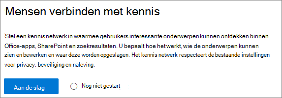
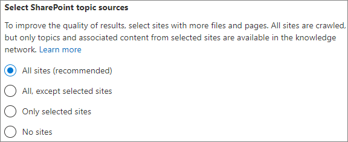
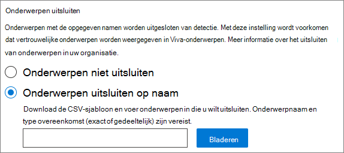
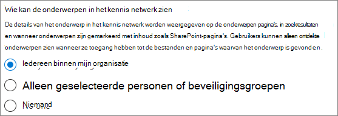
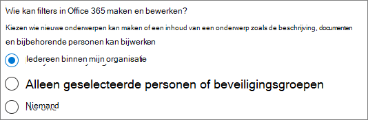
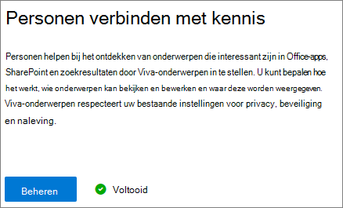

# Microsoft Viva-onderwerpen instellen

U kunt het Microsoft 365-beheercentrum gebruiken om Onderwerpen in te stellen en te [configureren.](topic-experiences-overview.md) 

Het is belangrijk om de beste manier te plannen om onderwerpen in uw omgeving in te stellen en te configureren. Lees Plan voor [Microsoft Viva-onderwerpen](plan-topic-experiences.md) voordat u de procedures in dit artikel start.

U moet zijn [geabonneerd](https://www.microsoft.com/microsoft-viva/topics) op Viva Topics en een globale beheerder of SharePoint-beheerder zijn om toegang te krijgen tot het Microsoft 365-beheercentrum en Onderwerpen in te stellen.

Als u SharePoint hebt geconfigureerd voor het vereisen van beheerde [apparaten,](/sharepoint/control-access-from-unmanaged-devices)moet u Onderwerpen instellen vanaf een beheerd apparaat.

## Videodemonstratie

In deze video ziet u het proces voor het instellen van Onderwerpen in Microsoft 365.

 

> [!VIDEO https://www.microsoft.com/videoplayer/embed/RE4Li0E]  

 

## Onderwerpen instellen

Onderwerpen instellen

1. Selecteer setup [in het Microsoft 365-beheercentrum](https://admin.microsoft.com) **en** bekijk vervolgens de sectie **Bestanden en inhoud.**
2. Klik in **de sectie Bestanden** en inhoud op Personen verbinden met **kennis.**

     

3. Klik op **de pagina Personen verbinden met kennis** op Aan **de** slag om u door het installatieproces te helpen.

     

4. Op de **pagina Kiezen hoe Viva-onderwerpen onderwerpen kunnen vinden,** configureert u onderwerpdetectie. Selecteer in **de sectie SharePoint-onderwerpbronnen** selecteren welke SharePoint-sites tijdens de detectie worden verkend als bronnen voor uw onderwerpen. Kies uit:
    - **Alle sites:** Alle SharePoint-sites in uw organisatie. Dit geldt ook voor huidige en toekomstige sites.
    - **Alle, behalve geselecteerde sites:** Typ de namen van de sites die u wilt uitsluiten.  U kunt ook een lijst uploaden met sites die u niet wilt ontdekken. Sites die in de toekomst worden gemaakt, worden opgenomen als bronnen voor onderwerpdetectie. 
    - **Alleen geselecteerde sites:** Typ de namen van de sites die u wilt opnemen. U kunt ook een lijst met sites uploaden. Sites die in de toekomst worden gemaakt, worden niet opgenomen als bronnen voor onderwerpdetectie.
    - **Geen sites:** Neem geen SharePoint-sites op.

     
   
5. In de **sectie Onderwerpen uitsluiten op naam** kunt u namen toevoegen van onderwerpen die u wilt uitsluiten van onderwerpdetectie. Gebruik deze instelling om te voorkomen dat gevoelige informatie als onderwerpen wordt opgenomen. De opties zijn:
    - **Sluit geen onderwerpen uit** 
    - **Onderwerpen uitsluiten op naam**

     

    (Kennisbeheerders kunnen ook onderwerpen in het onderwerpcentrum uitsluiten na ontdekking.)

    #### Onderwerpen uitsluiten op naam    

    Als u onderwerpen wilt uitsluiten nadat u Onderwerpen op naam uitsluiten hebt **geselecteerd,** downloadt u de CSV-sjabloon en updatet u deze met de lijst met onderwerpen die u wilt uitsluiten van de detectieresultaten.

     

    Voer in de CSV-sjabloon de volgende informatie in over de onderwerpen die u wilt uitsluiten:

    - **Naam:** Typ de naam van het onderwerp dat u wilt uitsluiten. U kunt dit op twee manieren doen:
        - Exacte overeenkomst: U kunt de exacte naam of het acroniem (bijvoorbeeld *Contoso* of *ATL) opnemen.*
        - Gedeeltelijke overeenkomst: U kunt alle onderwerpen met een specifiek woord uitsluiten.  Met een *boog worden bijvoorbeeld* alle onderwerpen uitgesloten met de woordboog in de boog, zoals boogcirkel, lassen van de boog van Het *plasma* of *Trainingsboog.*   Houd er rekening mee dat onderwerpen waarin de tekst is opgenomen als onderdeel van een woord, zoals Architectuur, niet worden *uitgesloten.*
    - **Staat voor (optioneel)**: Als u een acroniem wilt uitsluiten, typt u de woorden waar het acroniem voor staat.
    - **MatchType-Exact/Gedeeltelijk:** Typ of de opgegeven naam *een exact* of *gedeeltelijk overeenkomend* type was.

    Nadat u het CSV-bestand hebt voltooid en opgeslagen, **selecteert** u Bladeren om het te zoeken en te selecteren.
    
    Selecteer **Volgende**.

6. Op de **pagina Wie kan onderwerpen zien en waar kunnen** ze deze zien, configureert u de zichtbaarheid van het onderwerp. In de **instelling Wie kan onderwerpen** zien, kiest u wie toegang heeft tot onderwerpdetails, zoals gemarkeerde onderwerpen, onderwerpkaarten, onderwerp antwoorden in zoekopdrachten en onderwerppagina's. U kunt het volgende selecteren:
    - **Iedereen in mijn organisatie**
    - **Alleen geselecteerde personen of beveiligingsgroepen**
    - **Niemand**

      

    > [!Note] 
    > Hoewel u met deze instelling elke gebruiker in uw organisatie kunt selecteren, kunnen alleen gebruikers met licenties voor onderwerpervaringen onderwerpen bekijken.

7. Op de **pagina Machtigingen voor onderwerpbeheer** kiest u wie onderwerpen kan maken, bewerken of beheren. In de **sectie Wie kan onderwerpen maken en bewerken,** kunt u het volgende selecteren:
    - **Iedereen in mijn organisatie**
    - **Alleen geselecteerde personen of beveiligingsgroepen**
    - **Niemand**

     

8. In de **sectie Wie kan onderwerpen beheren,** kunt u het volgende selecteren:
    - **Iedereen in mijn organisatie**
    - **Alleen geselecteerde personen of beveiligingsgroepen**

     

    Selecteer **Volgende**.

9. Op de **pagina Onderwerpcentrum** maken kunt u uw onderwerpcentrumsite maken waarin onderwerppagina's kunnen worden bekeken en onderwerpen kunnen worden beheerd. Typ in **het vak** Sitenaam een naam voor het onderwerpcentrum. U kunt desgewenst een korte beschrijving typen in **het vak** Beschrijving. 

   Selecteer **Volgende**.

     

10. Op de pagina **Controleren en voltooien** kunt u de geselecteerde instelling bekijken en wijzigingen aanbrengen. Selecteer **Activeren** wanneer u tevreden bent met uw selecties.

11. De **geactiveerde pagina Viva-onderwerpen** wordt weergegeven, om te bevestigen dat het systeem nu begint met het analyseren van de geselecteerde sites voor onderwerpen en het maken van de site van het onderwerpcentrum. Selecteer **Gereed**.

12. U wordt teruggegeven aan de pagina **Personen verbinden met kennis.** Op deze pagina kunt u **Beheren** selecteren om wijzigingen aan te brengen in de configuratie-instellingen. 

        

De eerste keer dat onderwerpdetectie is ingeschakeld, kan het maximaal twee weken duren voordat alle voorgestelde onderwerpen worden weergegeven in de weergave Onderwerpen beheren. Onderwerpdetectie wordt voortgezet wanneer er nieuwe inhoud of updates voor inhoud worden aangebracht. Het is normaal dat er fluctuaties zijn in het aantal voorgestelde onderwerpen in uw organisatie, aangezien Viva Topics nieuwe informatie evalueert.

## Licenties toewijzen

Nadat u de onderwerpervaringen hebt geconfigureerd, moet u licenties toewijzen aan de gebruikers die Onderwerpen gebruiken. Alleen gebruikers met een licentie kunnen informatie zien over onderwerpen zoals highlights, onderwerpkaarten, onderwerppagina's en het onderwerpcentrum. 

Licenties toewijzen:

1. Klik in het Microsoft 365-beheercentrum onder **Gebruikers** op **Actieve gebruikers**.

2. Selecteer de gebruikers die u een licentie wilt geven en klik op **Licenties en apps.**

3. Selecteer **onder Licenties** de optie **Viva-onderwerpen.**

4. Zorg **er onder Apps** voor dat Graph **Connectors Search with Index (Viva Topics)** en **Viva Topics** beide zijn geselecteerd.

   > [!div class="mx-imgBorder"]
   > 

5. Klik op **Wijzigingen opslaan**.

## Onderwerpervaringen beheren

Nadat u Onderwerpen hebt ingesteld, kunt u de instellingen wijzigen die u hebt gekozen tijdens de installatie in het [Microsoft 365-beheercentrum.](https://admin.microsoft.com/AdminPortal#/featureexplorer/csi/KnowledgeManagement) Zie de volgende referenties:

- [Onderwerpdetectie beheren in Microsoft Viva-onderwerpen](topic-experiences-discovery.md)
- [Zichtbaarheid van onderwerpen beheren in Microsoft Viva-onderwerpen](topic-experiences-knowledge-rules.md)
- [Onderwerpmachtigingen beheren in Microsoft Viva-onderwerpen](topic-experiences-user-permissions.md)
- [De naam van het onderwerpcentrum wijzigen in Microsoft Viva-onderwerpen](topic-experiences-administration.md)

## Zie ook

[Overzicht van onderwerpervaringen](topic-experiences-overview.md)
