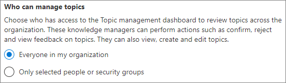

# Onderwerpen over functies instellen in Microsoft 365Set up topic experiences in Microsoft 365

Met het Microsoft 365-Beheercentrum kunt u [topic Experience](topic-experiences-overview.md)instellen en configureren.You can use the Microsoft 365 admin center to set up and configure [topic experiences](topic-experiences-overview.md). 

Het is belangrijk dat u de beste manier voor het plannen en configureren van onderwerpen in uw omgeving van plan bent.It is important to plan the best way to set up and configure topics in your environment. Zorg ervoor dat u de ervaringen van het [plan](plan-topic-experiences.md) vindt voordat u de procedures in dit artikel start.Be sure to read [Plan topic experiences](plan-topic-experiences.md) before you begin the procedures in this article.

U moet een globale beheerder of SharePoint-beheerder zijn om toegang te krijgen tot het Microsoft 365-Beheercentrum en de functies voor het onderwerp in te stellen.You must be a global administrator or SharePoint administrator to access the Microsoft 365 admin center and set up topic experiences.

## Ervaring met het onderwerp instellenSet up topic experiences

Topic Experience instellen in Microsoft 365To set up topic experiences in Microsoft 365

1. Selecteer in het [Microsoft 365-Beheercentrum](https://admin.microsoft.com)de optie **Setup** en vervolgens de sectie **bestanden en inhoud** weergeven.In the [Microsoft 365 admin center](https://admin.microsoft.com), select **Setup**, and then view the **Files and content** section.
2. Klik in de sectie **bestanden en inhoud** op **personen verbinden met kennis**.In the **Files and content** section, click **Connect people to knowledge**.

     

3. Klik op de pagina **personen verbinden met kennis** op aan de slag om u door te **gaan** met het instellen van het installatieproces.On the **Connect people to knowledge** page, click **Get started** to walk you through the setup process.

     

4. Ga naar de pagina **Kies hoe u de pagina wilt zoeken** in het onderwerp: detectie van een kennis netwerk.On the **Choose how the knowledge network can find topics** page, you will configure topic discovery. Selecteer in de sectie **SharePoint-onderwerpen selecteren** welke SharePoint-sites worden verkend als bronnen voor uw onderwerpen tijdens de detectie.In the **Select SharePoint topic sources** section, select which SharePoint sites will be crawled as sources for your topics during discovery. Kies uit:Choose from:
    - **Alle sites**: alle SharePoint-sites in uw organisatie.**All sites**: All SharePoint sites in your organization. Dit geldt ook voor huidige en toekomstige sites.This includes current and future sites.
    - **Alles, met uitzondering van geselecteerde sites**: Typ de namen van de sites die u wilt uitsluiten.**All, except selected sites**: Type the names of the sites you want to exclude.  U kunt ook een lijst uploaden met sites die u wilt afmelden bij ontdekking.You can also upload a list of sites that you want to opt out from discovery. Sites die in de toekomst zijn gemaakt, worden opgenomen als bronnen voor de detectie van het onderwerp.Sites created in future will be included as sources for topic discovery. 
    - **Alleen geselecteerde sites**: Typ de namen van de sites die u wilt opnemen.**Only selected sites**: Type the names of the sites you want to include. U kunt ook een lijst met sites uploaden.You can also upload a list of sites. Sites die u later maakt, worden niet opgenomen als bronnen voor de detectie van het onderwerp.Sites created in the future will not be included as sources for topic discovery.
    - **Geen sites**: geen SharePoint-sites opnemen.**No sites**: Do not include any SharePoint sites.

     
   
5. In de sectie **onderwerpen uitsluiten van naam** kunt u namen van onderwerpen toevoegen die u wilt uitsluiten van het detecteren van het onderwerp.In the **Exclude topics by name** section, you can add names of topics you want to exclude from topic discovery. Met deze instelling kunt u voorkomen dat vertrouwelijke informatie wordt opgenomen in de onderwerpen.Use this setting to prevent sensitive information from being included as topics. De opties zijn:The options are:
    - **Geen onderwerpen uitsluiten****Don't exclude any topics** 
    - **Onderwerpen uitsluiten op naam****Exclude topics by name**

     

    (Kennis managers kunnen onderwerpen in het onderwerp centrum ook uitsluiten na ontdekking.)(Knowledge managers can also exclude topics in the topic center after discovery.)

    #### Onderwerpen uitsluiten op naamHow to exclude topics by name    

    Als **u onderwerpen moet** uitsluiten, selecteert u de sjabloon. csv downloaden en bijwerken met de lijst met onderwerpen die u wilt uitsluiten van de resultaten van de zoekresultaten.If you need to exclude topics, after selecting **Exclude topics by name**, select download the .csv template and update it with the list of topics that you want to exclude from your discovery results.

     

    Voer de volgende informatie over de onderwerpen die u wilt uitsluiten in het CSV-sjabloon in:In the CSV template, enter the following information about the topics you want to exclude:

    - **Naam**: Typ de naam van het onderwerp dat u wilt uitsluiten.**Name**: Type the name of the topic you want to exclude. U kunt dit op twee manieren doen:There are two ways to do this:
        - Exacte overeenkomst: u kunt de exacte naam of het acroniem opnemen, bijvoorbeeld *Contoso* of *ATL*.Exact match: You can include the exact name or acronym (for example, *Contoso* or *ATL*).
        - Gedeeltelijke overeenkomst: u kunt alle onderwerpen met een specifiek woord uitsluiten.Partial match: You can exclude all topics that have a specific word in it.  Met de *boog* worden bijvoorbeeld alle onderwerpen met het woord *boog* weggelaten, zoals *boog cirkel*, *plasma boog lassen* of *boog boog*. Houd er rekening mee dat onderwerpen waarvan de tekst deel uitmaakt van een woord, zoals de *architectuur*, niet worden uitgesloten.For example, *arc* will exclude all topics with the word *arc* in it, such as *Arc circle*, *Plasma arc welding*, or *Training arc*. Note that it will not exclude topics in which the text is included as part of a word, such as *Architecture*.
    - **Staat voor (optioneel)**: als u een acroniem wilt uitsluiten, typt u de woorden waarop het acroniem staat.**Stands for (optional)**: If you want to exclude an acronym, type the words the acronym stands for.
    - **MatchType-exact/gedeeltelijk**: Typ of de ingevoerde naam een *exact* of *gedeeltelijk* overeenkomend type is.**MatchType-Exact/Partial**: Type whether the name you entered was an *exact* or *partial* match type.

    Wanneer u het CSV-bestand hebt voltooid en opgeslagen, selecteert u **Bladeren** om naar het bestand te zoeken en te selecteren.After you've completed and saved your .csv file, select **Browse** to locate and select it.
    
    Selecteer **Volgende**.Select **Next**.

6. Als u in de sectie **wie kan de onderwerpen zien en waar kan ze** de pagina zien, wordt de zichtbaarheid van het onderwerp geconfigureerd.On the **Who can see topics and where can they see them** page, you will configure topic visibility. In de instelling **wie kan de onderwerpen zien in de instelling van het kennis netwerk** , kiest u wie toegang heeft tot de details van het onderwerp, zoals gemarkeerde onderwerpen, topic cards, onderwerp Answers in Search en topic Pages.In the **Who can see topics in the knowledge network** setting, you choose who will have access to topic details, such as highlighted topics, topic cards, topic answers in search, and topic pages. U kunt kiezen voor:You can select:
    - **Iedereen binnen mijn organisatie****Everyone in my organization**
    - **Alleen geselecteerde personen of beveiligingsgroepen****Only selected people or security groups**
    - **Niemand****No one**

      

 > [!Note] 
 > Met deze instelling kunt u een gebruiker in de organisatie selecteren, zodat alleen gebruikers met een onderwerp licenties die aan hen zijn toegewezen, onderwerpen kunnen weergeven.While this setting allows you to select any user in your organization, only users who have Topic Experiences licenses assigned to them will be able to view topics.

7. Op de pagina **machtigingen voor onderwerp beheren** kiest u wie onderwerpen kan maken, bewerken en beheren.In the **Permissions for topic management** page, you choose who will be able to create, edit, or manage topics. In de sectie **wie kan onderwerpen maken en bewerken** , kunt u het volgende selecteren:In the **Who can create and edit topics** section, you can select:
    - **Iedereen binnen mijn organisatie****Everyone in my organization**
    - **Alleen geselecteerde personen of beveiligingsgroepen****Only selected people or security groups**
    - **Niemand****No one**

     

8. In de sectie **wie kan secties beheren** , kunt u het volgende selecteren:In the **Who can manage topics** section, you can select:
    - **Iedereen binnen mijn organisatie****Everyone in my organization**
    - **Alleen geselecteerde personen of beveiligingsgroepen****Only selected people or security groups**

     

    Selecteer **Volgende**.Select **Next**.

9. Op de pagina **topic maken** kunt u de site van het onderwerp maken waarin de onderwerpen kunnen worden weergegeven en de onderwerpen kunnen worden beheerd.On the **Create topic center** page, you can create your topic center site in which topic pages can be viewed and topics can be managed. Typ in het vak **site naam** een naam voor het onderwerp Center.In the **Site name** box, type a name for your Topic center. U kunt desgewenst een korte beschrijving typen in het vak **Beschrijving** .You can optionally type a short description in the **Description** box. 

Selecteer **Volgende**.Select **Next**.

     

10. Op de pagina **Controleren en voltooien** kunt u de geselecteerde instelling bekijken en wijzigingen aanbrengen.On the **Review and finish** page, you can look at your selected setting and choose to make changes. Selecteer **Activeren** wanneer u tevreden bent met uw selecties.If you are satisfied with your selections, select **Activate**.

11. De pagina voor **geactiveerde kennis netwerk** wordt weergegeven en u wordt bevestigd dat het systeem nu begint met het analyseren van de geselecteerde sites voor onderwerpen en de site van de Knowledge Center-site maakt.The **Knowledge network activated** page will display, confirming that the system will now start analyzing your selected sites for topics and creating the Knowledge Center site. Selecteer **Gereed**.Select **Done**.

12. U gaat terug naar de pagina contact **personen verbinden met kennis** .You'll be returned to your **Connect people to knowledge** page. Op deze pagina kunt u **Beheren** selecteren om wijzigingen aan te brengen in de configuratie-instellingen.From this page, you can select **Manage** to make any changes to your configuration settings. 

        

## Licenties toewijzenAssign licenses

Wanneer u onderwerpen hebt geconfigureerd, moet u een licentie toewijzen voor de gebruikers die gebruikmaken van de functies van het onderwerp.Once you have configured topic experiences, you must assign licenses for the users who will be using topic experiences. Alleen gebruikers met een licentie kunnen informatie over onderwerpen, waaronder hooglichten, topic cards, topic pagina's en het onderwerp centrum zien.Only users with a license can see information on topics including highlights, topic cards, topic pages and the topic center. 

Licenties toewijzen:To assign licenses:

1. Klik in het Microsoft 365-beheercentrum onder **Gebruikers** op **Actieve gebruikers**.In the Microsoft 365 admin center, under **Users**, click **Active users**.

2. Selecteer de gebruikers aan wie u een licentie wilt toewijzen en klik op **Productlicenties beheren**.Select the users that you want to license, and click **Manage product licenses**.

3. Selecteer **Meer toewijzen**.Select **Assign more**.

4. Selecteer onder **licenties** de optie **onderwerp**.Under **Licenses**, select **Topic Experiences**.

5. Zorg ervoor dat onder **apps** de optie **Graph-verbindingslijnen zoeken met** de functies index en **onderwerp** zijn geselecteerd.Under **Apps**, make sure **Graph Connectors Search with Index** and **Topic Experiences** are both selected.

    > [!div class="mx-imgBorder"]
    > 

6. Klik op **Wijzigingen opslaan**.Click **Save changes**.

## Onderwerp ervaring beherenManage topic experiences

Wanneer u de ervaringen met het onderwerp hebt ingesteld, kunt u de instellingen wijzigen die u tijdens de installatie hebt gekozen in het [Microsoft 365-Beheercentrum](https://admin.microsoft.com/AdminPortal#/featureexplorer/csi/KnowledgeManagement).Once you have set up topic experiences, you can change the settings that you chose during setup in the [Microsoft 365 admin center](https://admin.microsoft.com/AdminPortal#/featureexplorer/csi/KnowledgeManagement). Zie de volgende verwijzingen:See the following references:

- [Detectie van onderwerp beheren in Microsoft 365Manage topic discovery in Microsoft 365](topic-experiences-discovery.md)
- [De zichtbaarheid van een onderwerp beheren in Microsoft 365Manage topic visibility in Microsoft 365](topic-experiences-knowledge-rules.md)
- [Machtigingen voor onderwerp beheren in Microsoft 365Manage topic permissions in Microsoft 365](topic-experiences-user-permissions.md)
- [De naam van het onderwerp centreren in Microsoft 365Change the name of the topic center in Microsoft 365](topic-experiences-administration.md)

## Zie ookSee also

[Overzicht van onderwerpenTopic Experiences Overview](topic-experiences-overview.md)
