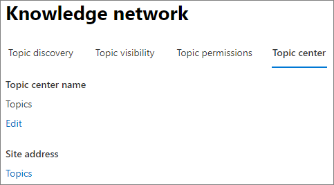

# Overzicht van het onderwerpcentrum in Microsoft Viva-onderwerpen

In Microsoft Viva Topics is het onderwerpcentrum een moderne SharePoint site die fungeert als een kenniscentrum voor uw organisatie. Deze wordt gemaakt tijdens [de installatie van Viva-onderwerpen](set-up-topic-experiences.md) in het Microsoft 365 beheercentrum.

Het onderwerpcentrum heeft een standaard startpagina met het **webonderdeel** Onderwerpen waarin alle gelicentieerde gebruikers de onderwerpen kunnen zien waarmee ze een verbinding hebben. 

Hoewel alle gelicentieerde gebruikers die onderwerpen kunnen bekijken, toegang hebben tot het onderwerpcentrum, kunnen kennisbeheerders ook onderwerpen beheren via de **pagina Onderwerpen** beheren. Het **tabblad Onderwerpen beheren** wordt alleen weergegeven voor gebruikers met de machtiging Onderwerpen beheren. 

## Waar is mijn onderwerpcentrum

Het onderwerpcentrum wordt gemaakt tijdens de installatie van Viva-onderwerpen. Nadat de installatie is voltooid, kan een beheerder de URL vinden op de [pagina Onderwerpcentrumbeheer.](./topic-experiences-administration.md#to-access-topics-management-settings)

1. Selecteer in Microsoft 365 beheercentrum **Instellingen** en selecteer vervolgens **Organisatie-instellingen.**
2. Selecteer op **het tabblad** Services de optie **Onderwerpervaringen.**

     

3. Selecteer het **tabblad Onderwerpcentrum.** Onder **Siteadres** staat een koppeling naar uw onderwerpcentrum.

     

## Startpagina

 

> [!VIDEO https://www.microsoft.com/videoplayer/embed/RE4LAhZ]  

 

Op de startpagina van het onderwerpcentrum ziet u de onderwerpen in uw organisatie waarmee u verbinding hebt.

- Voorgestelde verbindingen: u ziet onderwerpen die worden vermeld onder **We hebben u op deze onderwerpen vermeld. Hebben we het goed gedaan?** Dit zijn onderwerpen waarin uw verbinding met het onderwerp is voorgesteld via AI. U kunt bijvoorbeeld een auteur van een gerelateerd bestand of site zijn. U wordt gevraagd te bevestigen dat u moet blijven vermeld als een verwante persoon voor het onderwerp.

    
 
- Bevestigd verbindingen: dit zijn onderwerpen waarin u bent vastgemaakt aan de onderwerppagina of u een voorgestelde verbinding met het onderwerp hebt bevestigd. Onderwerpen worden verplaatst van de voorgestelde sectie naar de sectie bevestigd wanneer u een voorgestelde verbinding bevestigt.
 
    

Wanneer een gebruiker zijn of haar verbinding met een onderwerp bevestigt, kan de gebruiker wijzigingen aan de onderwerppagina maken om de verbinding te curaçeren. Ze kunnen bijvoorbeeld meer informatie geven over hun verbinding met het onderwerp.

## Pagina Onderwerpen beheren

Als u wilt werken aan **de pagina** Onderwerpen beheren van het onderwerpcentrum, moet u de vereiste machtigingen voor onderwerpen beheren hebben die nodig zijn voor de rol van knowledge manager. Uw beheerder kan deze machtigingen toewijzen aan gebruikers tijdens  het instellen van [kennisbeheer,](set-up-topic-experiences.md)of nieuwe gebruikers kunnen daarna worden toegevoegd door een beheerder via het Microsoft 365 beheercentrum.

Op de **pagina Onderwerpen beheren** worden in het onderwerpdashboard alle onderwerpen weergegeven die u hebt, die zijn geïdentificeerd op basis van de opgegeven bronlocaties. In elk onderwerp wordt de datum van het onderwerp gevonden. Een gebruiker aan wie machtigingen voor onderwerpen beheren zijn toegewezen, kan de onbevestigde onderwerpen bekijken en ervoor kiezen om:

- Bevestig het onderwerp: Geeft gebruikers aan dat een AI-voorgesteld onderwerp is gevalideerd door een menselijke curator.

- Publiceer het onderwerp: Bewerk de onderwerpgegevens om de kwaliteit van het onderwerp te verbeteren dat in eerste instantie is geïdentificeerd, en belicht het onderwerp voor alle gebruikers die toegang hebben tot onderwerpen.
 
- Verwijder het onderwerp: Maakt het onderwerp onontdekt voor eindgebruikers. Het onderwerp wordt verplaatst naar het tabblad **Verwijderd** en kan zo nodig later worden bevestigd. 

Zie Onderwerpen beheren voor meer informatie over het beheren van onderwerpen op **de** pagina Onderwerpen [beheren.](manage-topics.md)

## Een onderwerp maken of bewerken

Als u de machtiging Onderwerpen maken en bewerken hebt, kunt u het volgende doen:

- [Bestaande onderwerpen bewerken:](edit-a-topic.md)U kunt wijzigingen aanbrengen in bestaande onderwerppagina's die zijn gemaakt via detectie.

- [Nieuwe onderwerpen maken:](create-a-topic.md)U kunt nieuwe onderwerpen maken voor onderwerpen die niet zijn gevonden via detectie of als er onvoldoende bewijs is gevonden voor het maken van een onderwerp door AI-hulpmiddelen.

## Zie ook

[Onderwerpen beheren in het onderwerpcentrum](manage-topics.md)

