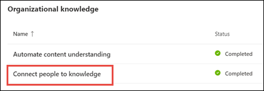

# Overzicht van het onderwerpcentrum (Voorbeeld)

> [!Note] 
> De inhoud in dit artikel is voor Project Cortex Private Preview. [Lees meer over Project Cortex](https://aka.ms/projectcortex).

Het onderwerpcentrum is een moderne SharePoint-site die dient als kenniscentrum voor uw organisatie. Het wordt gemaakt tijdens [de installatie van Kennisbeheer](set-up-knowledge-network.md) in het Microsoft 365-beheercentrum.

Via het onderwerpcentrum kunnen gebruikers met de juiste machtigingen het volgende doen:

- Ontdekte onderwerpen bevestigen of afwijzen
- Een nieuwe onderwerppagina maken
- Een bestaande onderwerppagina bewerken

> [!Note] 
> U meer informatie vinden over elke taak in [Werken met onderwerpen in het onderwerpcentrum.](work-with-topics.md)

## Waar is het onderwerp centrum

Uw onderwerpcentrum wordt gemaakt tijdens de installatie van Kennisbeheer. Nadat de installatie is voltooid, kan een beheerder de URL vinden op de [beheerpagina van het kenniscentrum.](manage-knowledge-network.md)

1. Selecteer **Setup** in het navigatiedeelvenster van Microsoft 365 in het navigatiedeelvenster en selecteer in de sectie **Organisatiekennis** de optie **Personen verbinden met kennis**.

     

2. Zie Op de pagina **Personen verbinden met kennis** in de sectie In één **oogopslag** **het adres van het onderwerpcentrum** voor de site-URL.

## Machtigingen voor het gebruik van het onderwerpcentrum

Als u in het onderwerpcentrum wilt werken, moet u over de vereiste machtigingen beschikken. Uw beheerder kan deze machtigingen toewijzen aan gebruikers tijdens [het instellen van kennisbeheer](set-up-knowledge-network.md)of nieuwe gebruikers kunnen achteraf worden [toegevoegd](give-user-permissions-to-the-topic-center.md) door een beheerder via het Microsoft 365-beheercentrum.

Gebruikers van het onderwerpcentrum kunnen twee sets machtigingen krijgen:

- **Onderwerpen maken en bewerken:** Maak nieuwe onderwerpen of werk onderwerpinhoud bij, zoals de beschrijving, documenten en geassocieerde personen. Wijs deze toestemming toe aan vakexperts die de taak hebben om onderwerppagina's te bekijken.
- **Onderwerpen beheren:** gebruik het onderwerpdashboard om onderwerpen in de hele organisatie te bekijken. Gebruikers kunnen acties uitvoeren, zoals het bevestigen en afwijzen van onbevestigde onderwerpen.

Een gebruiker kan beide sets machtigingen krijgen, of slechts één indien nodig. 

## Onderwerpen bekijken in het onderwerpdashboard

Het onderwerpdashboard toont onderwerpen die zijn ontgonnen uit uw opgegeven bronlocaties. Elk onderwerp toont de datum waarop het onderwerp is ontdekt en of er feedback op is gegeven. Een gebruiker die machtigingen voor **onderwerpen beheren** is toegewezen, kan de onbevestigde onderwerpen bekijken en ervoor kiezen om:
- Het onderwerp bevestigen: hiermee wordt het onderwerp markeert aan gebruikers die toegang hebben en waarmee ze de bijbehorende onderwerpkaart en onderwerppagina kunnen zien.
- Het onderwerp afwijzen: maakt het onderwerp niet beschikbaar voor gebruikers. Het onderwerp wordt verplaatst naar het tabblad **Afgewezen** en kan later worden bevestigd indien nodig.

## Een onderwerp maken of bewerken

Als u **machtigingen voor Het maken en bewerken van onderwerpen** hebt, u kiezen voor:

- Bestaande onderwerpen bewerken: u wijzigingen aanbrengen in bestaande onderwerppagina's die zijn gemaakt door detectie.
- Nieuwe onderwerpen maken: u nieuwe onderwerpen maken voor onderwerpen die niet zijn gevonden door detectie, of als AI-hulpprogramma's niet genoeg bewijs hebben gevonden om een onderwerp te maken.

## Zie ook

  

