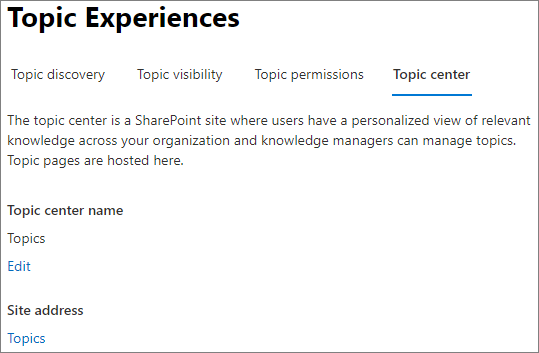

# De naam van het onderwerp centreren in Microsoft 365

U kunt de naam van het topic Center wijzigen in het [Microsoft 365-Beheercentrum](https://admin.microsoft.com). U moet een globale beheerder of SharePoint-beheerder zijn om deze taken uit te voeren.

## De instellingen voor het beheer van onderwerpen raadplegen:

1. Klik in het Microsoft 365-Beheercentrum op **instellingen** en vervolgens op **organisatie-instellingen**.
2. Klik op het tabblad **Services** op **kennis netwerk**.

     

3. Selecteer het tabblad **topic Center** . Zie de volgende secties voor informatie over elke instelling.

     

##  De naam van uw topic Center bijwerken

De naam van het onderwerpen centrum wijzigen

1. Selecteer op het tabblad **onderwerp centrum** , onder **naam onderwerp centrum**, de optie **bewerken**.
2. Typ op de paginanaam van het **centrum voor bewerken** , in het vak **naam van onderwerp centrum** , de nieuwe naam voor het onderwerp Center.
3. Selecteer **Opslaan** .

      

## Zie ook

[Detectie van onderwerp beheren in Microsoft 365](topic-experiences-discovery.md)

[De zichtbaarheid van een onderwerp beheren in Microsoft 365](topic-experiences-knowledge-rules.md)

[Machtigingen voor onderwerp beheren in Microsoft 365](topic-experiences-user-permissions.md)
