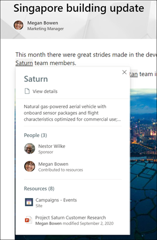

# Onderwerp met detectie en curator (preview)

> [!Note] 
> De inhoud in dit artikel is bedoeld voor project cortex private preview. [Meer informatie over Project Cortex](https://aka.ms/projectcortex).

Met beantwoorde functies worden kennis gegevens geconverteerd naar informatie in uw Microsoft 365-omgeving. We hebben al ervaring met het lezen van documenten en sitepagina's, waar we de voorwaarden kunnen zien. Het is heel vaak om te voorkomen dat we in de loop van de tijd overgaan naar meer informatie.

Voor wat u doet, maakt u gebruik van Microsoft Graph en AI voor het identificeren van **onderwerpen** in uw organisatie.  Een onderwerp is een woordgroep of term met een specifieke betekenis van een organisatie, waarbij gebruikers liever een wikipagina kunnen weergeven. Met AI kunt u zoeken naar personen en inhoud die met het onderwerp verbonden zijn, en als u er genoeg ter detectie wordt, wordt dit een suggestie onderwerp.

De gegevens van een AI-gegenereerde alinea worden toegevoegd aan een **onderwerpenpagina**, die kan bestaan uit:
- Een korte beschrijving van het onderwerp.
- Alternatieve namen voor het onderwerp.
- Personen die mogelijk meer weten over het onderwerp.
- Sites, bestanden en pagina's die mogelijk zijn gerelateerd aan het onderwerp.

Met een onderwerp zorgt u ervoor dat elk exemplaar van een onderwerp is gemarkeerd op alle pagina's van de moderne SharePoint-site in uw Tenant. Wanneer een gebruiker meer wilt weten over een onderwerp, kunnen ze het gemarkeerde onderwerp selecteren om een **samenvattingsrij** met een korte beschrijving te bekijken. En als ze meer willen weten, kunnen ze een koppeling naar **Details** van het onderwerp selecteren in het overzicht om de pagina gedetailleerd onderwerp te openen.

  

Daarnaast kunnen gebruikers ook onderwerpen zoeken via Microsoft Search.

## Onderwerp-curator

In het onderwerp wordt de kwaliteit van de onderwerpen verbeterd. Terwijl AI in eerste instantie de onderwerpen identificeert en vermoedt, handmatig updates voor inhoud van medewerkers, bevestiging van gebruikers voor AI-inhoud die is gegenereerd en feedback over de bruikbaarheid van onderwerpen zijn allemaal essentieel.

- Met AI gegenereerde onderwerpen (' voorgestelde onderwerpen ') kunt u een beoordeling door de **kennis van beheerders** in uw organisatie. Op de pagina Manage topics in het onderwerp kunnen ze ze op hun geldige manier verifiëren of weigeren om te voorkomen dat ze deze kunnen weergeven.

- U kunt de machtigingen voor het *maken en bewerken van onderwerpen* toewijzen aan alle gebruikers met een licentie, zodat ze wijzigingen kunnen aanbrengen in bestaande onderwerpen of nieuwe onderwerpen kunnen maken wanneer dat nodig is. 

- Zelfs gebruikers die alleen leestoegang hebben tot het onderwerp (de bezoekers van het onderwerp) worden gevraagd de bruikbaarheid van specifieke onderwerpen te verifiëren.

Ook met menselijke curator zal AI continu informatie vinden over onderwerpen, en er wordt gezocht naar menselijke verificatie. Als u bijvoorbeeld van AI denkt dat u een persoon bent die als deskundige moet worden vastgemaakt, wordt u gevraagd om dit te bevestigen. 

## Zie ook

  

