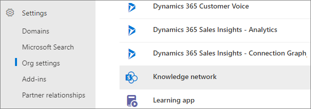
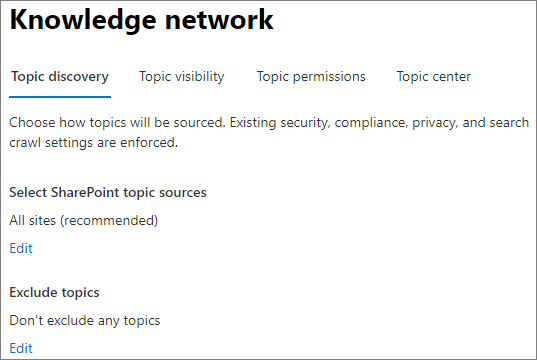
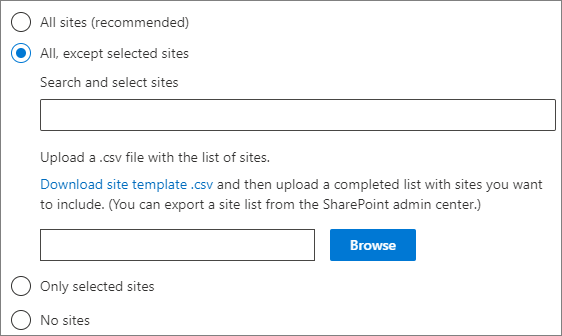

# <a name="manage-topic-discovery-in-microsoft-viva-topics"></a><span data-ttu-id="a236a-103">Onderwerpdetectie beheren in Microsoft Viva-onderwerpen</span><span class="sxs-lookup"><span data-stu-id="a236a-103">Manage topic discovery in Microsoft Viva Topics</span></span>

<span data-ttu-id="a236a-104">U kunt instellingen voor onderwerpdetectie beheren in het [Microsoft 365-beheercentrum.](https://admin.microsoft.com)</span><span class="sxs-lookup"><span data-stu-id="a236a-104">You can manage topic discovery settings in the [Microsoft 365 admin center](https://admin.microsoft.com).</span></span> <span data-ttu-id="a236a-105">U moet een globale beheerder of SharePoint-beheerder zijn om deze taken uit te voeren.</span><span class="sxs-lookup"><span data-stu-id="a236a-105">You must be a global administrator or SharePoint administrator to perform these tasks.</span></span>

## <a name="to-access-topics-management-settings"></a><span data-ttu-id="a236a-106">Voor toegang tot instellingen voor onderwerpenbeheer:</span><span class="sxs-lookup"><span data-stu-id="a236a-106">To access topics management settings:</span></span>

1. <span data-ttu-id="a236a-107">Klik in het Microsoft 365-beheercentrum op **Instellingen** en vervolgens **op Organisatie-instellingen.**</span><span class="sxs-lookup"><span data-stu-id="a236a-107">In the Microsoft 365 admin center, click **Settings**, then **Org settings**.</span></span>
2. <span data-ttu-id="a236a-108">Klik op **het tabblad** Services op **Onderwerpervaringen.**</span><span class="sxs-lookup"><span data-stu-id="a236a-108">On the **Services** tab, click **Topic experiences**.</span></span>

     

3. <span data-ttu-id="a236a-110">Selecteer het **tabblad Onderwerpdetectie.** Zie de volgende secties voor meer informatie over elke instelling.</span><span class="sxs-lookup"><span data-stu-id="a236a-110">Select the **Topic discovery** tab. See the following sections for information about each setting.</span></span>

     

## <a name="select-sharepoint-topic-sources"></a><span data-ttu-id="a236a-112">SharePoint-onderwerpbronnen selecteren</span><span class="sxs-lookup"><span data-stu-id="a236a-112">Select SharePoint topic sources</span></span>

<span data-ttu-id="a236a-113">U kunt de SharePoint-sites in uw organisatie wijzigen die worden verkend voor onderwerpen.</span><span class="sxs-lookup"><span data-stu-id="a236a-113">You can change the SharePoint sites in your organization that will be crawled for topics.</span></span>

<span data-ttu-id="a236a-114">Als u een specifieke lijst met sites wilt opnemen of uitsluiten, kunt u de volgende CSV-sjabloon gebruiken:</span><span class="sxs-lookup"><span data-stu-id="a236a-114">If you want to include or exclude a specific list of sites, you can use the following .csv template:</span></span>

``` csv
Site name,URL
```

<span data-ttu-id="a236a-115">Als u sites toevoegt met behulp van de site picker, worden deze toegevoegd aan de bestaande lijst met sites die u wilt opnemen of uitsluiten.</span><span class="sxs-lookup"><span data-stu-id="a236a-115">If you add sites using the site picker, they are added to the existing list of sites to include or exclude.</span></span> <span data-ttu-id="a236a-116">Als u een CSV-bestand uploadt, wordt elke bestaande lijst overschreven.</span><span class="sxs-lookup"><span data-stu-id="a236a-116">If you upload a .csv file, it overwrites any existing list.</span></span> <span data-ttu-id="a236a-117">Als u eerder specifieke sites hebt opgenomen of uitgesloten, downloadt en downloadt u de lijst als een CSV-bestand, wijzigt u en uploadt u de nieuwe lijst.</span><span class="sxs-lookup"><span data-stu-id="a236a-117">If you have previously included or excluded specific sites, you and download the list as a .csv file, make changes, and upload the new list.</span></span>

<span data-ttu-id="a236a-118">Sites kiezen voor onderwerpdetectie</span><span class="sxs-lookup"><span data-stu-id="a236a-118">To choose sites for topic discovery</span></span>

1. <span data-ttu-id="a236a-119">Selecteer Bewerken **op het tabblad** Onderwerpdetectie onder **SharePoint-onderwerpbronnen** **selecteren.**</span><span class="sxs-lookup"><span data-stu-id="a236a-119">On the **Topic discovery** tab, under **Select SharePoint topic sources**, select **Edit**.</span></span>
2. <span data-ttu-id="a236a-120">Selecteer op **de pagina SharePoint-onderwerpbronnen** selecteren welke SharePoint-sites tijdens de detectie worden verkend als bronnen voor uw onderwerpen.</span><span class="sxs-lookup"><span data-stu-id="a236a-120">On the **Select SharePoint topic sources** page, select which SharePoint sites will be crawled as sources for your topics during discovery.</span></span> <span data-ttu-id="a236a-121">Dit omvat:</span><span class="sxs-lookup"><span data-stu-id="a236a-121">This includes:</span></span>
    - <span data-ttu-id="a236a-122">**Alle sites:** alle SharePoint-sites in uw tenant.</span><span class="sxs-lookup"><span data-stu-id="a236a-122">**All sites**: All SharePoint sites in your tenant.</span></span> <span data-ttu-id="a236a-123">Hiermee worden huidige en toekomstige sites vastleggen.</span><span class="sxs-lookup"><span data-stu-id="a236a-123">This captures current and future sites.</span></span>
    - <span data-ttu-id="a236a-124">**Alle, behalve geselecteerde sites:** typ de namen van de sites die u wilt uitsluiten.</span><span class="sxs-lookup"><span data-stu-id="a236a-124">**All, except selected sites**: Type the names of the sites you want to exclude.</span></span>  <span data-ttu-id="a236a-125">U kunt ook een lijst met sites uploaden die u niet wilt ontdekken.</span><span class="sxs-lookup"><span data-stu-id="a236a-125">You can also upload a list of sites you want to opt out from discovery.</span></span> <span data-ttu-id="a236a-126">Sites die in de toekomst worden gemaakt, worden opgenomen als bronnen voor onderwerpdetectie.</span><span class="sxs-lookup"><span data-stu-id="a236a-126">Sites created in the future will be included as sources for topic discovery.</span></span> 
    - <span data-ttu-id="a236a-127">**Alleen geselecteerde sites:** typ de namen van de sites die u wilt opnemen.</span><span class="sxs-lookup"><span data-stu-id="a236a-127">**Only selected sites**: Type the names of the sites you want to include.</span></span> <span data-ttu-id="a236a-128">U kunt ook een lijst met sites uploaden.</span><span class="sxs-lookup"><span data-stu-id="a236a-128">You can also upload a list of sites.</span></span> <span data-ttu-id="a236a-129">Sites die in de toekomst worden gemaakt, worden niet opgenomen als bronnen voor onderwerpdetectie.</span><span class="sxs-lookup"><span data-stu-id="a236a-129">Sites created in the future will not be included as sources for topic discovery.</span></span>
    - <span data-ttu-id="a236a-130">**Geen sites:** onderwerpen worden niet automatisch gegenereerd of bijgewerkt met SharePoint-inhoud.</span><span class="sxs-lookup"><span data-stu-id="a236a-130">**No sites**: Topics won't be automatically generated or updated with SharePoint content.</span></span> <span data-ttu-id="a236a-131">Bestaande onderwerpen blijven in het onderwerpcentrum staan.</span><span class="sxs-lookup"><span data-stu-id="a236a-131">Existing topics remain in the topic center.</span></span>

    
   
3. <span data-ttu-id="a236a-133">Klik op **Opslaan**.</span><span class="sxs-lookup"><span data-stu-id="a236a-133">Click **Save**.</span></span>

## <a name="exclude-topics-by-name"></a><span data-ttu-id="a236a-134">Onderwerpen uitsluiten op naam</span><span class="sxs-lookup"><span data-stu-id="a236a-134">Exclude topics by name</span></span>

<span data-ttu-id="a236a-135">U kunt onderwerpen uitsluiten van detectie door een lijst te uploaden met een CSV-bestand.</span><span class="sxs-lookup"><span data-stu-id="a236a-135">You can exclude topics from discovery by uploading a list using a .csv file.</span></span> <span data-ttu-id="a236a-136">Als u eerder onderwerpen hebt uitgesloten, kunt u het CSV-bestand downloaden, wijzigingen aanbrengen en opnieuw uploaden.</span><span class="sxs-lookup"><span data-stu-id="a236a-136">If you've previously excluded topics, you can download the .csv, make changes, and upload it again.</span></span>

1. <span data-ttu-id="a236a-137">Selecteer Bewerken **op het tabblad** Onderwerpdetectie onder **Onderwerpen** **uitsluiten.**</span><span class="sxs-lookup"><span data-stu-id="a236a-137">On the **Topic discovery** tab, under **Exclude topics**, select **Edit**.</span></span>
2. <span data-ttu-id="a236a-138">Klik **op Onderwerpen uitsluiten op naam.**</span><span class="sxs-lookup"><span data-stu-id="a236a-138">Click **Exclude topics by name**.</span></span>
3. <span data-ttu-id="a236a-139">Als u een lijst moet maken, downloadt u de CSV-sjabloon en voegt u de onderwerpen toe die u wilt uitsluiten (zie Werken met de *CSV-sjabloon* hieronder).</span><span class="sxs-lookup"><span data-stu-id="a236a-139">If you need to create a list, download the .csv template and add the topics that you want to exclude (see *Working with the .csv template* below).</span></span> <span data-ttu-id="a236a-140">Wanneer het bestand klaar is, klikt u **op Bladeren en** het bestand uploaden.</span><span class="sxs-lookup"><span data-stu-id="a236a-140">When the file is ready, click **Browse** and upload the file.</span></span> <span data-ttu-id="a236a-141">Als er een bestaande lijst is, kunt u het CSV-bestand downloaden dat de lijst bevat.</span><span class="sxs-lookup"><span data-stu-id="a236a-141">If there's an existing list, you can download the .csv containing the list.</span></span>
4. <span data-ttu-id="a236a-142">Klik op **Opslaan**.</span><span class="sxs-lookup"><span data-stu-id="a236a-142">Click **Save**.</span></span>

    

### <a name="working-with-the-csv-template"></a><span data-ttu-id="a236a-144">Werken met de CSV-sjabloon</span><span class="sxs-lookup"><span data-stu-id="a236a-144">Working with the .csv template</span></span>

<span data-ttu-id="a236a-145">U kunt de csv-sjabloon hieronder kopiëren:</span><span class="sxs-lookup"><span data-stu-id="a236a-145">You can copy the csv template below:</span></span>

``` csv
Name (required),Expansion,MatchType- Exact/Partial (required)
```

<span data-ttu-id="a236a-146">Voer in de CSV-sjabloon de volgende informatie in over de onderwerpen die u wilt uitsluiten:</span><span class="sxs-lookup"><span data-stu-id="a236a-146">In the CSV template, enter the following information about the topics you want to exclude:</span></span>

- <span data-ttu-id="a236a-147">**Naam:** typ de naam van het onderwerp dat u wilt uitsluiten.</span><span class="sxs-lookup"><span data-stu-id="a236a-147">**Name**: Type the name of the topic you want to exclude.</span></span> <span data-ttu-id="a236a-148">U kunt dit op twee manieren doen:</span><span class="sxs-lookup"><span data-stu-id="a236a-148">There are two ways to do this:</span></span>
    - <span data-ttu-id="a236a-149">Exacte overeenkomst: u kunt de exacte naam of het acroniem opnemen (bijvoorbeeld *Contoso* of *ATL).*</span><span class="sxs-lookup"><span data-stu-id="a236a-149">Exact match: You can include the exact name or acronym (for example, *Contoso* or *ATL*).</span></span>
    - <span data-ttu-id="a236a-150">Gedeeltelijke overeenkomst: U kunt alle onderwerpen met een specifiek woord uitsluiten.</span><span class="sxs-lookup"><span data-stu-id="a236a-150">Partial match: You can exclude all topics that have a specific word in it.</span></span>  <span data-ttu-id="a236a-151">Zo worden met *de boog* bijvoorbeeld alle onderwerpen met de *woordcirkel* uitgesloten, zoals Boogcirkel,  *Arc-boog* of *Trainingsbogen.* Onderwerpen waarin de tekst is opgenomen als onderdeel van een woord, zoals Architectuur, worden niet *uitgesloten.*</span><span class="sxs-lookup"><span data-stu-id="a236a-151">For example, *arc* will exclude all topics with the word *arc* in it, such as *Arc circle*, *Plasma arc welding*, or *Training arc*. Note that it will not exclude topics in which the text is included as part of a word, such as *Architecture*.</span></span>
- <span data-ttu-id="a236a-152">**Staat voor (optioneel:** als u een acroniem wilt uitsluiten, typt u de woorden waar het acroniem voor staat.</span><span class="sxs-lookup"><span data-stu-id="a236a-152">**Stands for (optional)**: If you want to exclude an acronym, type the words the acronym stands for.</span></span>
- <span data-ttu-id="a236a-153">**MatchType-Exact/Gedeeltelijk:** typ of de naam die u hebt ingevoerd *een exact* of *gedeeltelijk* overeenkomsttype is.</span><span class="sxs-lookup"><span data-stu-id="a236a-153">**MatchType-Exact/Partial**: Type whether the name you entered was an *exact* or *partial* match type.</span></span>

     

## <a name="see-also"></a><span data-ttu-id="a236a-155">Zie ook</span><span class="sxs-lookup"><span data-stu-id="a236a-155">See also</span></span>

[<span data-ttu-id="a236a-156">Zichtbaarheid van onderwerpen beheren in Microsoft 365</span><span class="sxs-lookup"><span data-stu-id="a236a-156">Manage topic visibility in Microsoft 365</span></span>](topic-experiences-knowledge-rules.md)

[<span data-ttu-id="a236a-157">Onderwerpmachtigingen beheren in Microsoft 365</span><span class="sxs-lookup"><span data-stu-id="a236a-157">Manage topic permissions in Microsoft 365</span></span>](topic-experiences-user-permissions.md)

[<span data-ttu-id="a236a-158">De naam van het onderwerpcentrum wijzigen in Microsoft 365</span><span class="sxs-lookup"><span data-stu-id="a236a-158">Change the name of the topic center in Microsoft 365</span></span>](topic-experiences-administration.md)
