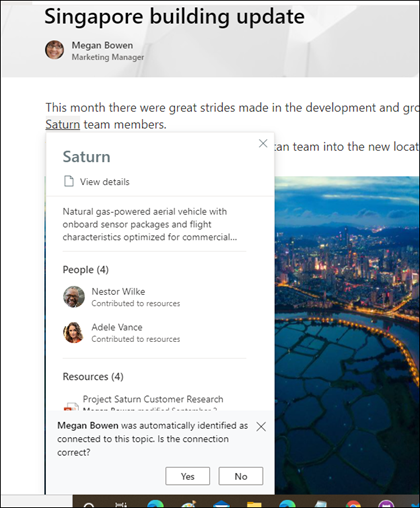

# Overzicht van Microsoft Viva TopicsMicrosoft Viva Topics overview 

Viva Topics gebruikt Microsoft AI-technologie, Microsoft 365, Microsoft Graph, Zoeken en andere onderdelen en services om uw gebruikers kennis te brengen in de Microsoft 365-apps die ze dagelijks gebruiken, te beginnen met SharePoint moderne pagina's, Microsoft Search en Zoeken in Word, PowerPoint, Outlook en Excel.Viva Topics uses Microsoft AI technology, Microsoft 365, Microsoft Graph, Search, and other components and services to bring knowledge to your users in the Microsoft 365 apps they use everyday, starting with SharePoint modern pages, Microsoft Search, and Search in Word, PowerPoint, Outlook, and Excel.

 

> [!VIDEO https://www.microsoft.com/videoplayer/embed/RE4LhZP]  

 

Viva Topics helpt bij het oplossen van een belangrijk zakelijk probleem in veel bedrijven, door de informatie te verstrekken aan gebruikers wanneer ze deze nodig hebben.Viva Topics helps to address a key business issue in many companies — providing the information to users when they need it. Zo moeten nieuwe werknemers snel veel nieuwe informatie opnemen en komen ze bij het doorlezen van bedrijfsgegevens termen tegen waar ze niets van weten.For example, new employees need to learn a lot of new information quickly, and encounter terms they know nothing about when reading through company information. Om meer te weten moet de gebruiker even stoppen waar hij of zij mee bezig is, en gaat kostbare tijd verloren met het zoeken naar informatie, zoals over wat de term is, wie in de organisatie een expert is op een bepaald gebied, en mogelijk aan de term gerelateerde sites en documenten.To learn more, the user might need to step away from what they are doing and spend valuable time searching for details, such as information about what the term is, who in the organization is a subject matter expert, and maybe sites and documents that are related to the term.

In Viva Topics wordt AI gebruikt om automatisch te zoeken naar *onderwerpen* in je organisatie.Viva Topics uses AI to automatically search for and identify *topics* in your organization. Het stelt informatie samen over hen, zoals een korte beschrijving, personen die aan het onderwerp en sites en bestanden werken, en pagina's die aan het onderwerp zijn gerelateerd.It compiles information about them, such as a short description, people working on the topic, and sites, files, and pages that are related to it. Een kennismanager of medewerker kan ervoor kiezen om de onderwerpgegevens zo nodig bij te werken.A knowledge manager or contributor can choose to update the topic information as needed. De onderwerpen zijn beschikbaar voor je gebruikers. Dit betekent dat de tekst wordt gemarkeerd voor elk exemplaar van het onderwerp dat op een moderne SharePoint-site in nieuws en op pagina's wordt weergegeven.The topics are available to your users, which means that for every instance of the topic that appears in a modern SharePoint site in news and pages, the text will be highlighted. Gebruikers kunnen ervoor kiezen om het onderwerp te selecteren om hierover meer te weten te komen via de onderwerpdetails.Users can choose to select the topic to learn more about it through the topic details. Topics vind je ook in SharePoint Search.Topics can also be found in SharePoint Search.

## Hoe onderwerpen worden weergegeven aan gebruikersHow topics are displayed to users

Onderwerpen worden weergegeven voor gebruikers via:Topics are displayed to users through:

- [Onderwerpen gemarkeerd](topic-experiences-overview.md#sharepoint-highlights) op SharePoint pagina's[Topics highlighted](topic-experiences-overview.md#sharepoint-highlights) on SharePoint pages
- Antwoorden over onderwerpen in [zoekresultaten](topic-experiences-overview.md#search-results)Topic answers in [search results](topic-experiences-overview.md#search-results)
- Zoeken in [office-toepassingen](topic-experiences-overview.md#office-application-search)Search in [office applications](topic-experiences-overview.md#office-application-search)
- [Startpagina onderwerpcentrum](topic-experiences-overview.md#topic-center)[Topic center](topic-experiences-overview.md#topic-center) home page

### SharePoint highlightsSharePoint highlights

Wanneer een onderwerp wordt genoemd in nieuws en SharePoint-pagina's, dan wordt dit gemarkeerd.When a topic is mentioned in content on SharePoint news and pages, you'll see it highlighted. Je kunt het onderwerpoverzicht openen vanuit de markering.You can open the topic summary from the highlight. Open de onderwerpdetails in de titel van de samenvatting om de volledige onderwerppagina te bekijken.Open the topic details from the title of the summary to view the full topic page. Het genoemde onderwerp kan automatisch worden geïdentificeerd of rechtstreeks door de paginaauteur zijn genoemd.The mentioned topic could be identified automatically or could have been referenced directly by the page author. 

    

### ZoekresultatenSearch results

U kunt een onderwerpantwoord [zien](search.md#topic-answer) in zoekresultaten wanneer u zoekt vanaf de startpagina van SharePoint, op Office.com zoekt of op een SharePoint-site zoekt nadat u het zoekbereik hebt gewijzigd om de volledige organisatie op te nemen.You can see a [topic answer](search.md#topic-answer) in search results when you search from the SharePoint start page, search on Office.com, or search from a SharePoint site after you you change the search scope to include the full organization. Het antwoord op het onderwerp wordt weergegeven op het onderwerp van de lijst met resultaten en geeft u een korte reeks informatie over dat onderwerp.The topic answer will appear at the topic of the results list and give you a short set of information related to that topic. 

    

### Office zoeken in toepassingenOffice application search

Wanneer u Zoeken gebruikt in Office-apps, zoals Word, PowerPoint, Outlook of Excel, via het zoekvak of door Zoeken **te** selecteren in het contextmenu, worden onderwerp antwoorden weergegeven in de zoekresultaten.When you use Search in Office apps such as Word, PowerPoint, Outlook, or Excel — either through the search box or by selecting **Search** in the context menu — topic answers are displayed in the search results.

   

   

### OnderwerpcentrumTopic center

Gebruikers kunnen onderwerpen in hun organisatie zien waarmee ze verbinding hebben op de startpagina [van het onderwerpcentrum.](topic-center-overview.md#home-page)Users can see topics in their organization to which they have a connection on the [topic center home page](topic-center-overview.md#home-page).

## KennisindexeringKnowledge indexing

Viva Topics gebruikt Microsoft AI-technologie om *onderwerpen* te identificeren in je Microsoft 365-omgeving.Viva Topics uses Microsoft AI technology to identify *topics* in your Microsoft 365 environment.

Een onderwerp is een woordgroep of term die belangrijk is in de organisatie.A topic is a phrase or term that is organizationally significant or important. Het heeft een specifieke betekenis voor de organisatie met hieraan gerelateerde bronnen zodat mensen kunnen begrijpen wat het is en hier meer informatie over kunnen vinden.It has a specific meaning to the organization, and has resources related to it that can help people understand what it is and find more information about it. Er is een groot aantal verschillende soorten onderwerpen dat belangrijk is voor je organisatie.There are lots of different types of topics that will be important to your organization. In eerste instantie richt de Microsoft AI-technologie zich op de volgende typen:Initially, the Microsoft AI technology focuses on the following types:

- ProjectProject
- GebeurtenisEvent
- OrganisatieOrganization
- LocatieLocation
- ProductProduct
- Creatief werkCreative work
- OnderzoeksgebiedField of study

Wanneer een onderwerp wordt geïdentificeerd en AI bepaalt dat het voldoende informatie heeft om een voorgesteld onderwerp te kunnen zijn, dan geeft een *onderwerppagina* de informatie weer die is verzameld door onderwerpindexering, zoals:When a topic is identified and AI determines that it has enough information for it to be a suggested topic, a *topic page* displays the information that was gathered through topic indexing, such as:

- Alternatieve namen en acroniemen.Alternate names and acronyms.
- Een korte beschrijving van het onderwerp.A short description of the topic.
- Personen die mogelijk wat van het onderwerp afweten.People who might be knowledgeable about the topic.
- Bestanden, pagina's en sites die aan het onderwerp zijn gerelateerd.Files, pages, and sites that are related to the topic.

Je kennisbeheerders kunnen ervoor kiezen om alle SharePoint-sites in je tenant te verkennen voor onderwerpen, of om alleen bepaalde sites te selecteren.Your knowledge admins can choose to crawl all SharePoint sites in your tenant for topics, or to just select certain ones.

Zie Onderwerpdetectie en [curatie voor meer informatie.](./topic-experiences-discovery-curation.md)For more information, see [Topic discovery and curation](./topic-experiences-discovery-curation.md).

## RollenRoles

Als je Viva Topics gebruikt in je Microsoft 365-omgeving, dan hebben je gebruikers de volgende rollen:When you use Viva Topics in your Microsoft 365 environment, your users will have the following roles:

- Onderwerpgebruikers: gebruikers die de belangrijkste onderwerpen op moderne SharePoint-sites kunnen zien en hier ten minste *leestoegang* toe hebben, en in Microsoft Search.Topic viewers: Users who can see topic highlights on SharePoint modern sites that they have at least *Read* access to, and in Microsoft Search. Ze kunnen de belangrijkste onderwerpen selecteren om de onderwerpdetails weer te geven op de onderwerppagina's.They can select topic highlights to see topic details in topic pages. Gebruikers van onderwerpen kunnen feedback geven over hoe nuttig een onderwerp voor hen is.Topic viewers can provide feedback on how useful a topic is to them.

- Inzenders: gebruikers die recht hebben op het bewerken of maken van nieuwe onderwerpen.Contributors: Users who have rights to edit existing topics or create new ones. Kennisbeheerders wijzen inzendermachtigingen toe aan gebruikers via Viva Topics-instellingen in het Microsoft 365-beheercentrum.Knowledge admins assign contributor permissions to users through the Viva Topics settings in the Microsoft 365 admin center. Je kunt er ook voor kiezen om alle personen die onderwerpen bekijken toestemming te geven om onderwerpen te bewerken en te maken, zodat iedereen kan bijdragen aan onderwerpen die ze zien.Note that you can also choose to give all topic viewers the permission to edit and create topics so that everyone can contribute to topics that they see.

- Kennisbeheerders: gebruikers die onderwerpen door de levenscyclus van onderwerpen leiden.Knowledge managers: Users who guide topics through the topic lifecycle. Kennisbeheerders gebruiken  de pagina Onderwerpen beheren in het onderwerpcentrum om ai-voorgestelde onderwerpen te bevestigen, onderwerpen te verwijderen die niet meer relevant zijn, bestaande onderwerpen te bewerken of nieuwe onderwerpen te maken en zijn de enige gebruikers die er toegang toe hebben.Knowledge managers use the **Manage topics** page in the topic center to confirm AI-suggested topics, remove topics that are no longer relevant, as well as edit existing topics or create new ones, and are the only users who have access to it. Kennisbeheerders wijzen kennisbeheerders toe aan gebruikers via Viva Topics-beheerinstellingen in het Microsoft 365-beheercentrum.Knowledge admins assign knowledge manager permissions to users through the Viva Topics admin settings in the Microsoft 365 admin center. 

- Kennisbeheerders: beheerders stellen Viva-onderwerpen in en beheren deze via de beheerbesturingselementen in de Microsoft 365-beheercentrum.Knowledge admins: Admins set up Viva Topics and manage it through the admin controls in the Microsoft 365 admin center. Op dit moment kan een globale beheerder of SharePoint-beheerder van Microsoft 365 fungeren als een kennisbeheerder.Currently, a Microsoft 365 global or SharePoint administrator can serve as a knowledge admin.

Zie De rollen [van Viva-onderwerpen voor meer informatie.](topic-experiences-roles.md)For more information, see [Viva Topics roles](topic-experiences-roles.md).

## OnderwerpbeheerTopic management

Onderwerpbeheer wordt uitgevoerd op **de pagina Onderwerpen beheren** in het onderwerpcentrum van uw *organisatie.*Topic management is done in the **Manage topics** page in your organization's *topic center*. Het onderwerpcentrum wordt gemaakt tijdens de installatie en fungeert als uw kenniscentrum voor uw organisatie.The topic center is created during setup and serves as your center of knowledge for your organization. 

Hoewel alle gelicentieerde gebruikers onderwerpen kunnen zien met wie  ze verbonden zijn in het onderwerpcentrum, kunnen alleen gebruikers met machtigingen voor onderwerpen beheren (kennisbeheerders) de pagina Onderwerpen **beheren** bekijken en gebruiken.While all licensed users can see topics they're connected with in the topic center, only users with *Manage topics* permissions (knowledge managers) can view and use the **Manage topics** page.

Kennisbeheerders kunnen:Knowledge managers can:

- Onderwerpen bevestigen of verwijderen die zijn ontdekt in uw tenant.Confirm or remove topics that were discovered in your tenant.
- Indien nodig nieuwe onderwerpen maken (als er bijvoorbeeld onvoldoende informatie beschikbaar is om deze via AI te vinden).Create new topics manually as needed (for example, if not enough information was provided for it to be discovered through AI).
- Bestaande onderwerppagina's bewerken.Edit existing topic pages.

Zie Onderwerpen beheren [in het onderwerpcentrum voor meer informatie.](manage-topics.md)For more information, see [Manage topics in the topic center](manage-topics.md).  

## BeheerdersinstellingenAdmin controls

Met beheerbesturingselementen in Microsoft 365-beheercentrum kunt u Viva-onderwerpen beheren.Admin controls in the Microsoft 365 admin center allow you to manage Viva Topics. Hiermee kan een globale beheerder of SharePoint-beheerder van Microsoft 365 het volgende doen:They allow a Microsoft 365 global or SharePoint administrator to:

- Bepalen welke gebruikers in uw organisatie onderwerpen mogen zien op moderne SharePoint-pagina's of in zoekresultaten van SharePoint.Control which users in your organization are allowed to see topics in SharePoint modern pages or in SharePoint search results.
- Bepalen welke SharePoint-sites worden verkend om onderwerpen te identificeren.Control which SharePoint sites will be crawled to identify topics.
- Uitsluiten dat bepaalde onderwerpen niet worden gevonden.Exclude specific topics from being found.
- Bepalen welke gebruikers onderwerpen in het onderwerpcentrum kunnen beheren.Control which users can manage topics in the topic center.
- Bepalen welke gebruikers onderwerpen kunnen maken en bewerken.Control which users can create and edit topics.
- Bepalen welke gebruikers onderwerpen kunnen bekijken.Control which user can view topics.

Zie Gebruikersmachtigingen [toewijzen,](./plan-topic-experiences.md#user-permissions)onderwerpzichtbaarheid beheren en onderwerpdetectie beheren voor meer [informatie over beheerbesturingselementen.](./topic-experiences-discovery.md)For more information about admin controls, see [assign user permissions](./plan-topic-experiences.md#user-permissions), [manage topic visibility](./topic-experiences-knowledge-rules.md), and [manage topic discovery](./topic-experiences-discovery.md).

## Bewaren van onderwerpen en feedbackTopic curation & feedback

AI zal voortdurend blijven werken om jouw suggesties voor onderwerpen te verbeteren naarmate uw omgeving verandert.AI will continually work to provide you suggestions to improve your topics as changes occur in your environment. 

Gebruikers met machtigingen voor bewerken of het maken van onderwerpen kunnen onderwerppagina's rechtstreeks bewerken als ze correcties willen maken of aanvullende informatie willen toevoegen.Users with edit or create topics permissions can make updates to topic pages directly if they want to make corrections or add additional information. Ze kunnen ook nieuwe onderwerpen toevoegen die AI niet heeft kunnen identificeren.They can also add new topics that AI wasn't able to identify. Als er voldoende informatie over deze handmatig toegevoegde onderwerpen is en AI dit type onderwerp kan identificeren, kunnen aanvullende suggesties van AI deze handmatig toegevoegde onderwerpen verbeteren.If there's enough information on these manually added topics, and AI is able to identify this type of topic, additional suggestions from AI might enhance these manually added topics.

Gebruikers die je toegang geeft tot onderwerpen tijdens hun dagelijkse werkzaamheden, kunnen worden gevraagd of het onderwerp nuttig voor hen is.Users that you allow access to see topics in their daily work might be asked if the topic was useful to them. Het systeem bekijkt deze reacties en gebruikt het om de markering van onderwerpen te verbeteren, en helpt om te bepalen wat er wordt weergegeven over onderwerpsamenvattingen en in informatie over onderwerpen.The system looks at these responses and uses them to improve the topic highlight, and help determine what's shown on topic summaries and in topic details.

Zie Onderwerpdetectie en [curatie voor meer informatie.](./topic-experiences-discovery-curation.md)For more information, see [Topic discovery and curation](./topic-experiences-discovery-curation.md).

## Zie ookSee also

[Gebruik Microsoft Search om onderwerpen te vinden in Viva-onderwerpenUse Microsoft Search to find topics in Viva Topics](./search.md)
