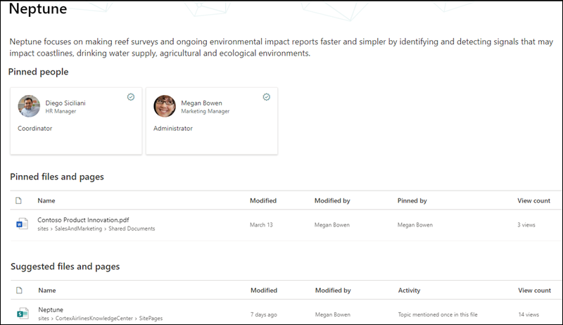

# Beveiliging van Microsoft Viva-onderwerpenMicrosoft Viva Topics security trimming 

Gebruikers van Viva-onderwerpen kunnen geen informatie weergeven in onderwerpen die hun bestaande Office 365 voorkomen dat ze deze kunnen zien.Viva Topics users can't view information in topics that their existing Office 365 permissions prevent them from seeing. Alles wat een gebruiker ziet op een onderwerppagina (bijvoorbeeld SharePoint sites, documenten, bestanden) zijn gegevens die ze al mogen zien.Everything a user sees on a topic page (for example, SharePoint sites, documents, files) will be information they are already allowed to see. Viva-onderwerpen brengen geen wijzigingen aan in bestaande machtigingen.Viva Topics does not make changes to any existing permissions.

## Waarom twee gebruikers verschillende weergaven van hetzelfde onderwerp hebbenWhy two users may have different views of the same topic

Wanneer een onderwerp wordt gemaakt via AI of handmatige curatie, kan het een beschrijving bevatten van het onderwerp, alternatieve namen, personen die aan het onderwerp zijn gekoppeld, evenals sites, pagina's en bestanden met betrekking tot het onderwerp.When a topic is created through AI or manual curation, it can contain a description of the topic, alternative names, people associated with the topic, as well as sites, pages, and files related to the topic. Wanneer deze informatie wordt weergegeven op een onderwerppagina, is het mogelijk dat twee gebruikers die hetzelfde onderwerp bekijken, dezelfde informatie niet zien.When this information is viewed on a topic page, it is possible that two users who are viewing the same topic my not see the same information.
  
Als gebruiker 1 bijvoorbeeld de onderwerppagina van Den Oudsten bekijkt, kunnen ze deze weergave van de onderwerppagina zien.For example, when User 1 views the Neptune topic page, they might see this view of the topic page.

   

Wanneer gebruiker 2 echter naar dezelfde onderwerppagina van Neptunus kijkt, verschilt de weergave van gebruiker 1.However, when User 2 looks at the same Neptune topic page, their view differs from User 1.  Gebruiker 2 kan het *BESTAND PRODUCToverzicht VAN DG-2000* zien in de sectie Vastgemaakte bestanden en pagina's van de onderwerppagina, die niet wordt weergegeven voor gebruiker 1. User 2 is able to see the *DG-2000 Product Overview* file in the **Pinned files and pages** section of the topic page, which does not appear for User 1. 

   

Het verschil in wat gebruikers over hetzelfde onderwerp kunnen zien, is omdat gebruikers mogelijk niet de Office 365 hebben om een gerelateerde site of bestand te bekijken.The difference in what users may see on the same topic is because users may not have the Office 365 permissions to view a related site or file.  Viva-onderwerpen respecteert de machtigingen die zijn ingesteld voor items in een onderwerp en kunnen de toegang tot items niet wijzigen.Viva Topics respects the permissions that are set on items in a topic, and cannot change access to them. In ons voorbeeld kan gebruiker 1 het *BESTAND VAN DG-2000 Productoverzicht* niet weergeven op de onderwerppagina voor Neptunus, omdat gebruiker 1 geen Office 365 machtigingen heeft om het bestand te bekijken.In our example, User 1 is not able to view the *DG-2000 Product Overview* file in their topic page for Neptune because User 1 does not have Office 365 permissions to view the file.

Als een gebruiker onvoldoende informatie in een onderwerp kan zien om het nuttig te maken, is het onderwerp niet beschikbaar voor de gebruiker.If a user is not able to see enough information in a topic for it to be useful, the topic will not be available to the user. Wanneer dit gebeurt, ziet de gebruiker het gemarkeerde onderwerp niet.When this happens, the user will not see the highlighted topic. Een andere gebruiker die machtigingen heeft voor meer informatie in het onderwerp, kan het onderwerp zien.A different user who has permissions to more information in the topic for it to be useful, will be able to see the topic.

## Onderwerpmachtigingen voor kennismanagers en onderwerpcontribuantenTopic permissions for knowledge managers and topic contributors

Gebruikers aan wie machtigingen zijn toegewezen voor het beheren van onderwerpen - kennisbeheerders - kunnen alleen informatie bekijken die ze in onderwerpen kunnen zien.Users that are assigned permissions to manage topics - knowledge managers - will only be able to view information they have permissions to see within topics.

Op dezelfde manier kunnen gebruikers die onderwerpmachtigingen ( onderwerpcontribuanten) hebben, alleen informatie bekijken die ze in onderwerpen kunnen zien.Similarly, users who have create and edit topic permissions - topic contributors - will only be able to view information they have permissions to see within topics. 

## AI versus handmatig samengestelde onderwerpgegevensAI versus manually curated topic information

Onderwerpen kunnen informatie bevatten die wordt gegenereerd door AI en informatie die is toegevoegd of bewerkt door onderwerpcontribuanten of kennisbeheerders.Topics can contain information generated by AI and information added or edited by topic contributors or knowledge managers.

 - Informatie in een onderwerp dat door AI is toegevoegd, is alleen zichtbaar voor personen die toegang hebben tot de broninhoud.Information in a topic that was added by AI is only visible to people who have access to the source content.
 - Onderwerpbeschrijving en personengegevens die handmatig zijn toegevoegd of bewerkt door een inzender of kennisbeheerder van het onderwerp, zijn zichtbaar voor iedereen die het onderwerp kan zien.Topic description and people information that has been manually added or edited by a topic contributor or knowledge manager is visible to everyone who can see the topic.
 - Bestanden, pagina's en sites zijn alleen zichtbaar voor gebruikers die machtigingen hebben voor de broninhoud, ongeacht of ze handmatig zijn toegevoegd of toegevoegd door AI.Files, pages, and sites are only visible to users who have permissions to the source content, whether manually added or added by AI.

In de volgende tabel wordt beschreven wat gebruikers - kijkers van onderwerpen, medewerkers en kennisbeheerders - kunnen zien in een bepaald onderwerp op basis van hun machtigingen.The following table describes what users - topic viewers, contributors, and knowledge managers - can see in a given topic based on their permissions.

|OnderwerpitemTopic item|Wat gebruikers kunnen zienWhat users can see|
|:---------|:------------------|
|OnderwerpnaamTopic name|Gebruikers kunnen de onderwerpnaam van onderwerpen zien in het onderwerpcentrum.Users can see the topic name of topics in the topic center. Sommige onderwerpen zijn mogelijk niet zichtbaar als gebruikers geen machtigingen voor de broninhoud hebben of een lage relevantie voor de gebruiker hebben.Some topics may not be visible if users don't have permissions to the source content or have a low relevancy to the user.|
|Beschrijving van onderwerpTopic description|Door AI gegenereerde beschrijvingen zijn alleen zichtbaar voor gebruikers die machtigingen hebben voor de broninhoud.AI-generated descriptions are visible only to users who have permissions to the source content. Handmatig ingevoerde of bewerkte beschrijvingen zijn zichtbaar voor alle gebruikers.Manually entered or edited descriptions are visible to all users.|
|PersonenPeople|Vastgemaakte personen zijn zichtbaar voor alle gebruikers.Pinned people are visible to all users. Voorgestelde personen zijn alleen zichtbaar voor gebruikers die machtigingen hebben voor de broninhoud.Suggested people are only visible to users who have permissions to the source content.|
|BestandenFiles|Bestanden zijn alleen zichtbaar voor gebruikers die machtigingen hebben voor de broninhoud.Files are only visible to users who have permissions to the source content.|
|Pagina'sPages|Pagina's zijn alleen zichtbaar voor gebruikers die machtigingen hebben voor de broninhoud.Pages are only visible to users who have permissions to the source content.|
|SitesSites|Sites zijn alleen zichtbaar voor gebruikers die machtigingen hebben voor de broninhoud.Sites are only visible to users who have permissions to the source content.|

## Zie ookSee also

