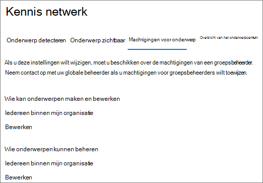
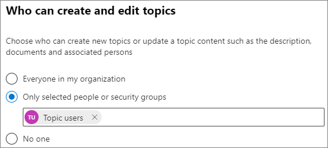
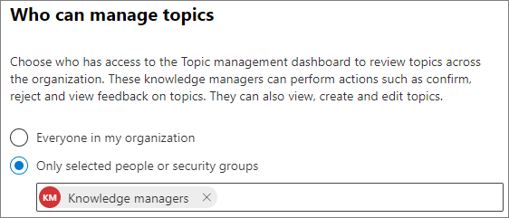

# Machtigingen voor onderwerp beheren in Microsoft 365Manage topic permissions in Microsoft 365

U kunt de machtigingsinstellingen voor het onderwerp beheren in het [Microsoft 365-Beheercentrum](https://admin.microsoft.com).You can manage topic permissions settings in the [Microsoft 365 admin center](https://admin.microsoft.com). U moet een globale beheerder of SharePoint-beheerder zijn om deze taken uit te voeren.You must be a global administrator or SharePoint administrator to perform these tasks.

Met de instellingen voor de machtigingen van het onderwerp kunt u het volgende kiezen:With topic permissions settings you can choose:

- Welke gebruikers kunnen onderwerpen maken en bewerken: nieuwe onderwerpen maken die niet zijn gevonden tijdens het detecteren of bewerken van bestaande Details van een onderwerp.Which users can create and edit topics: Create new topics that were not found during discovery or edit existing topic details.
- Welke gebruikers onderwerpen kunnen beheren: Ga naar het onderwerp Beheercentrum en Bekijk de feedback over de onderwerpen, en plaats de onderwerpen binnen de levenscyclus.Which users can manage topics: Access the topic management center and view feedback on topics as well as move topics through the lifecycle.

## De instellingen voor het beheer van onderwerpen raadplegen:To access topics management settings:

1. Klik in het Microsoft 365-Beheercentrum op **instellingen** en vervolgens op **organisatie-instellingen**.In the Microsoft 365 admin center, click **Settings**, then **Org settings**.
2. Klik op het tabblad **Services** op **kennis netwerk**.On the **Services** tab, click **Knowledge network**.

     

3. Selecteer het tabblad **machtigingen voor onderwerp** . Zie de volgende secties voor informatie over elke instelling.Select the **Topic permissions** tab. See the following sections for information about each setting.

     

## Wijzigen wie machtigingen heeft voor het bijwerken van de details van een onderwerpChange who has permissions to update topic details

Een update maken van de gebruikers die gemachtigd zijn om onderwerpen te maken en bewerken:To update who has permissions to create and edit topics:

1. Selecteer op het tabblad **onderwerp machtigingen** onder **wie kan onderwerpen maken en bewerken** de optie **bewerken**.On the **Topic permissions** tab, under **Who can create and edit topics**, select **Edit**.
2. Op de pagina **wie kan onderwerpen maken en bewerken** , kunt u het volgende selecteren:On the **Who can create and edit topics** page, you can select:
    - **Iedereen in uw organisatie****Everyone in your organization**
    - **Alleen geselecteerde personen of beveiligingsgroepen****Only selected people or security groups**
    - **Niemand****No one**

      

3. Kies **Opslaan**.Select **Save**.

Bijwerken met de gebruikers die gemachtigd zijn om onderwerpen te beheren:To update who has permissions to manage topics:

1. Selecteer op het tabblad **machtigingen voor onderwerp** onder **wie kan onderwerpen beheren** de optie **bewerken**.On the **Topic permissions** tab, under **Who can manage topics**, select **Edit**.
2. Op de pagina **wie kan onderwerpen beheren** , kunt u de volgende opties kiezen:On the **Who can manage topics** page, you can select:
    - **Iedereen in uw organisatie****Everyone in your organization**
    - **Geselecteerde personen of beveiligingsgroepen****Selected people or security groups**

      

3. Kies **Opslaan**.Select **Save**.

## Zie ookSee also

[Detectie van onderwerp beheren in Microsoft 365Manage topic discovery in Microsoft 365](topic-experiences-discovery.md)

[De zichtbaarheid van een onderwerp beheren in Microsoft 365Manage topic visibility in Microsoft 365](topic-experiences-knowledge-rules.md)

[De naam van het onderwerp centreren in Microsoft 365Change the name of the topic center in Microsoft 365](topic-experiences-administration.md)
