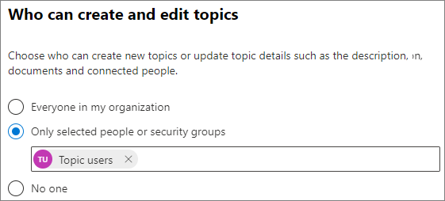

# Onderwerpmachtigingen beheren in Microsoft Viva-onderwerpenManage topic permissions in Microsoft Viva Topics

U kunt instellingen voor onderwerpmachtigingen beheren in het [Microsoft 365-beheercentrum.](https://admin.microsoft.com)You can manage topic permissions settings in the [Microsoft 365 admin center](https://admin.microsoft.com). U moet een globale beheerder of SharePoint-beheerder zijn om deze taken uit te voeren.You must be a global administrator or SharePoint administrator to perform these tasks.

Met instellingen voor onderwerpmachtigingen kunt u kiezen:With topic permissions settings you can choose:

- Welke gebruikers onderwerpen kunnen maken en bewerken: Nieuwe onderwerpen maken die niet zijn gevonden tijdens het ontdekken of bewerken van bestaande onderwerpgegevens.Which users can create and edit topics: Create new topics that were not found during discovery or edit existing topic details.
- Welke gebruikers onderwerpen kunnen beheren: Ga naar het beheercentrum voor onderwerpen, bekijk feedback over onderwerpen en verplaats onderwerpen tijdens de levenscyclus.Which users can manage topics: Access the topic management center and view feedback on topics as well as move topics through the lifecycle.

## Voor toegang tot instellingen voor onderwerpenbeheer:To access topics management settings:

1. Klik in het Microsoft 365-beheercentrum op **Instellingen** en vervolgens **op Organisatie-instellingen.**In the Microsoft 365 admin center, click **Settings**, then **Org settings**.
2. Klik op **het tabblad** Services op **Onderwerpervaringen.**On the **Services** tab, click **Topic experiences**.

     

3. Selecteer het **tabblad Onderwerpmachtigingen.** Zie de volgende secties voor meer informatie over elke instelling.Select the **Topic permissions** tab. See the following sections for information about each setting.

     

## Wijzigen wie machtigingen heeft om onderwerpdetails bij te werkenChange who has permissions to update topic details

Bijwerken wie machtigingen heeft voor het maken en bewerken van onderwerpen:To update who has permissions to create and edit topics:

1. Selecteer Op **het tabblad Onderwerpmachtigingen** onder Wie kan onderwerpen maken en **bewerken,** de optie **Bewerken.**On the **Topic permissions** tab, under **Who can create and edit topics**, select **Edit**.
2. Op de **pagina Wie kan onderwerpen maken en bewerken,** kunt u het volgende selecteren:On the **Who can create and edit topics** page, you can select:
    - **Iedereen in uw organisatie****Everyone in your organization**
    - **Alleen geselecteerde personen of beveiligingsgroepen****Only selected people or security groups**
    - **Niemand****No one**

      

3. Kies **Opslaan**.Select **Save**.

Bijwerken wie machtigingen heeft voor het beheren van onderwerpen:To update who has permissions to manage topics:

1. Selecteer Bewerken **op het tabblad Onderwerpmachtigingen** onder Wie **kan** onderwerpen **beheren.**On the **Topic permissions** tab, under **Who can manage topics**, select **Edit**.
2. Op de **pagina Wie kan onderwerpen beheren,** kunt u het volgende selecteren:On the **Who can manage topics** page, you can select:
    - **Iedereen in uw organisatie****Everyone in your organization**
    - **Geselecteerde personen of beveiligingsgroepen****Selected people or security groups**

      

3. Kies **Opslaan**.Select **Save**.

## Zie ookSee also

[Onderwerpdetectie beheren in Microsoft Viva-onderwerpenManage topic discovery in Microsoft Viva Topics](topic-experiences-discovery.md)

[Zichtbaarheid van onderwerpen beheren in Microsoft Viva-onderwerpenManage topic visibility in Microsoft Viva Topics](topic-experiences-knowledge-rules.md)

[De naam van het onderwerpcentrum wijzigen in Microsoft Viva-onderwerpenChange the name of the topic center in Microsoft Viva Topics](topic-experiences-administration.md)
